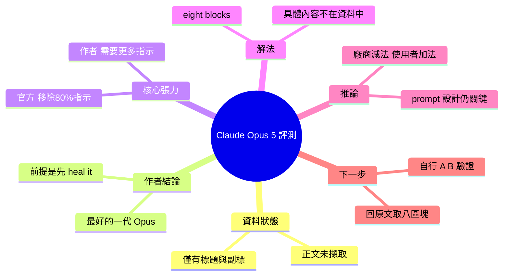

## Claude Opus 5: The Best Opus Yet, Once You Heal It

Claude Opus 5 是 Anthropic 最新旗艦模型。官方聲稱相比前代移除了 80% 的指示負擔，以提升使用者體驗。然而根據評測，Opus 5 實際使用時仍需精心設計的 prompt 策略才能發揮最佳性能。評測者提出了 8 個具體的提示框架（blocks）來優化 Opus 5 表現。這暗示即使模型能力提升，有效的人機協作仍需微調和技巧。因此 prompt engineering 在新模型時代仍是關鍵能力。

### 重點
- Claude Opus 5 移除 80% 指示負擔，但實務中仍需精細 prompt 優化才能最大化性能
- 8 個 blocks（提示框架）可優化 Opus 5 表現 — 具體內容應參考原文詳解
- Pattern：模型能力進步但人機協作複雜度並未減少，prompt engineering 仍是瓶頸

**原文：** [substack-product-compass](https://www.productcompass.pm/p/claude-opus-5-the-best-opus-yet-once)

---

<!-- deep-analysis:begin -->
## 📌 摘要 (TL;DR)

- **重要前提**：本次抓取到的原文內容只有標題與副標（deck），正文段落並未包含在輸入資料中。以下整理僅覆蓋可查證的部分，**文章核心的「八個區塊」具體內容不在可用資料內，本文不予杜撰**。
- 作者對 Claude Opus 5 的整體評價：**「我用過最好的 Opus」**，但附帶條件是 *once you heal it*（等你先把它「治好」）。
- 文章的核心張力：Anthropic 以「移除了 80% 的指示（instructions）」作為這一代的賣點與驕傲之處；作者的實際結論相反——**這個模型需要更多指示**。
- 作者的解法是一套稱為 **eight blocks（八個區塊）** 的提示結構，宣稱套用後讓 Opus 5 成為他使用過表現最好的 Opus。
- 讀者該關注的點：模型世代升級 ≠ prompt 設計可以省略。廠商減少內建指示，責任就轉移到使用者端的提示結構上。

## 🎯 核心概念

- **移除指示**（removing instructions）：指模型內建的系統提示 / 行為規範被大幅精簡；Anthropic 以此為 Opus 5 的訴求之一（依副標所述為 80%）。
- **八個區塊**（eight blocks）：作者自訂的提示模板結構，共八個組成部分。**輸入資料未包含各區塊的名稱與內容。**
- **「治好它」**（heal it）：作者用來形容「補回被移除的指示」這個動作的修辭——模型出廠狀態被視為有缺損，需要使用者用提示把它補齊。

## 📖 整理分析

### 1. 可用資料只有標題與副標
輸入的 `body_md` 欄位僅有兩行：文章標題 `Claude Opus 5: The Best Opus Yet, Once You Heal It`，以及副標 `Anthropic was proud of removing 80% of instructions. This model needs more of them. The eight blocks that made Opus 5 the best Opus I have used.`。這是 Substack 付費電子報（Product Compass）常見的抓取結果——正文未被擷取。因此任何關於「八個區塊分別是什麼」「作者跑了哪些測試」「和前代的分數對比」的敘述，都無法從現有資料得出。

### 2. 官方定位與作者體感的落差
可確認的對立只有一組：**Anthropic 主張「少即是多」（減少 80% 指示），作者主張「這個模型需要更多指示」**。副標把「Anthropic was proud of」寫成過去式並緊接反轉句，語氣上是對官方定位的直接反駁。至於 80% 這個數字是官方原話、還是作者的轉述，現有資料無法判定。

### 3. 「八個區塊」：只有名稱，沒有內容
副標把 eight blocks 定位為「讓 Opus 5 成為我用過最好的 Opus」的直接原因，可見這是整篇文章的主體。但八個區塊各自的名稱、順序、範例 prompt、適用場景，全部不在輸入資料中。**若需要這部分，必須回原文 <https://www.productcompass.pm/p/claude-opus-5-the-best-opus-yet-once> 閱讀。**

### 4. 這則觀點為何值得追蹤（推論）
以下為推論，非原文陳述：當模型廠商把內建指示往下砍，模型的預設行為會更「原始」、更依賴使用者輸入的框架；原本由系統提示承擔的格式、角色、邊界約束，會轉嫁到使用者的 prompt 上。這正好解釋了副標的邏輯——**廠商減法，使用者就得做加法**。這個結論若成立，代表 prompt engineering（提示工程）在新一代模型上不但沒有貶值，反而在「指示被精簡」的模型上更關鍵。

### 5. 建議的驗證方式
因為資料不足，建議把本文當成「一則待驗證的實務主張」而非結論：(a) 回原文取得八個區塊的定義；(b) 在自己的任務上做 A/B——空白 prompt vs. 套用八區塊；(c) 檢查 Anthropic 官方文件是否確實有「移除 80% 指示」的說法及其確切語境。

## 🧠 Mindmap

<!-- deep-analysis:end -->
### 📄 原文內容

點此展開 / 收合

Anthropic was proud of removing 80% of instructions. This model needs more of them. The eight blocks that made Opus 5 the best Opus I have used.

