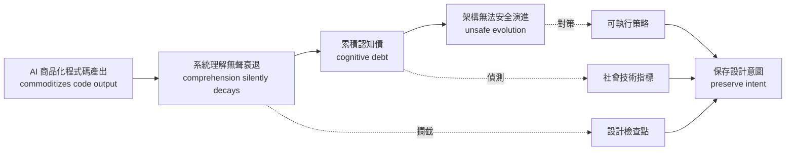
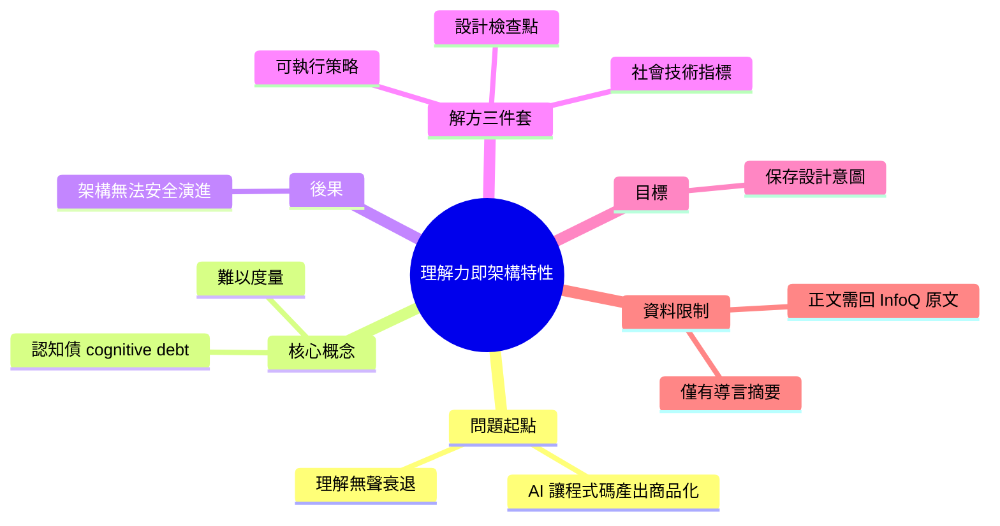

## Article: Comprehension as an Architectural Characteristic: A System That Is Not Understood Cannot Evolve Safely

文章論證系統理解應被視為可度量的架構特性。AI 代碼生成氾濫導致人類對系統的理解衰退，形成難以度量的「cognitive debt」，威脅安全的架構演進。文章提供 actionable 策略、socio-technical 指標與設計檢查點，確保在 AI 時代保留系統設計意圖。

### 重點
- 系統理解衰退形成 cognitive debt，威脅架構安全演進能力
- 將理解度重新框架化為可度量的非功能性需求（architectural characteristic）
- 提供 socio-technical metrics 和設計檢查點防止系統意圖被 AI 代碼掩蓋

**原文：** [infoq-main](https://www.infoq.com/articles/system-comprehension-evolutionary-architecture/?utm_campaign=infoq_content&utm_source=infoq&utm_medium=feed&utm_term=global)

---

<!-- deep-analysis:begin -->
## 📌 摘要 (TL;DR)

- InfoQ 這篇文章由 Jacobus Meintjes、Narayana Rengaswamy、Paul Katsande、Sureshbabu Bikki 四人共同撰寫，主張把「人對系統的理解」（comprehension）當成一項**正式的架構特性**（architectural characteristic）來對待，而不是靠團隊自覺的軟性文化。
- 核心因果鏈：AI 把程式碼產出商品化（commoditizes code output）→ 系統理解「無聲地衰退」（silently decays）→ 累積成**認知債**（cognitive debt）→ 威脅架構的**安全演進**（safe architectural evolution）。
- 文章宣稱提供三類具體產出：可執行的策略（actionable strategies）、**社會技術指標**（socio-technical metrics）、以及**設計檢查點**（design checkpoints），目的是在現代工程團隊之間「保存設計意圖」（preserve intent）。
- 為什麼值得關注：多數團隊已經在用 AI 大量生成程式碼，但衡量的仍是產出速度；這篇把「沒人真的看得懂這段系統」視為可度量、可管理的架構風險。
- ⚠️ **資料完整性提醒**：本次輸入只包含標題與 InfoQ 的導言摘要段落，**未包含文章正文**。以下整理僅能覆蓋摘要中明確陳述的內容，具體策略、指標定義與檢查點清單需回原文閱讀。

## 🎯 核心概念

- **架構特性** (architectural characteristic)：架構界用來指稱驅動設計決策的系統品質屬性（如可用性、可擴展性、安全性）；本文的主張是把「可被人理解」也放進這份清單。（*註：此術語的通用定義為背景補充，非本篇摘要明述*）
- **系統理解 / 可理解性** (comprehension)：人（而非工具）對系統為何長成這樣、各部分如何互動的實際掌握程度。
- **認知債** (cognitive debt)：摘要中直接使用的詞。相對於技術債指涉程式碼與設計的欠帳，認知債指涉的是「團隊腦中對系統的知識」的欠帳——而且更難被度量。
- **社會技術指標** (socio-technical metrics)：同時涵蓋「系統」與「人／組織」兩面的度量方式，用來偵測理解衰退，而非只量測程式碼本身。
- **設計檢查點** (design checkpoints)：在開發流程中設置的關卡，用來確認設計意圖仍被理解與延續。
- **演進式架構** (evolutionary architecture)：文章 URL 的主題脈絡（`system-comprehension-evolutionary-architecture`），即架構需要能持續、安全地變更。
- **意圖保存** (preserve intent)：讓「當初為什麼這樣設計」的知識，跨團隊、跨時間不流失。

## 📖 整理分析

### 1. 先講清楚：本次可用資料的邊界
本次輸入的 `body_md` 僅有標題與 InfoQ 的一段導言（含作者署名），**沒有文章內文**。因此以下分析嚴格限定在導言明確陳述的命題上；文章實際提出了哪些指標公式、檢查點如何嵌入流程、有無案例或數據，**無法從現有資料判定**。任何具體清單都應以原文為準。

### 2. 論點主線：程式碼變便宜，理解變稀缺
導言的第一句就是整篇的軸心：「As AI commoditizes code output, system comprehension silently decays」。這裡的關鍵字是 *commoditizes*（商品化）與 *silently*（無聲地）。前者指出 AI 讓「寫出可運行的程式碼」不再是瓶頸與稀缺資源；後者指出理解的流失沒有明顯警訊——不會有編譯錯誤、不會有測試失敗，因此不會被既有的工程訊號捕捉到。

### 3. 認知債：一種缺乏儀表板的欠帳
摘要把這種衰退命名為 *cognitive debt*，並直接連到後果：「threatens safe architectural evolution」。可以這樣理解其邏輯——架構演進的前提是能預測「改這裡會影響哪裡」；當團隊對系統的心智模型與實際系統脫節，任何變更都變成賭博。summary 亦點出這種債「難以度量」，這正是文章要引入社會技術指標的動機。

### 4. 解方三件套：策略、指標、檢查點
導言列出的交付物是三層次的：**actionable strategies**（團隊層面的做法）、**socio-technical metrics**（讓不可見的理解衰退變成可觀測訊號）、**design checkpoints**（把驗證嵌進設計流程的關卡）。三者組成一個典型的「治理迴路」：先能測量，再設關卡，再談策略。具體內容需查原文。

### 5. 這篇的定位與待補問題（推論）
**以下為推論，非原文陳述**：把「可理解性」提升為架構特性，意味著它應該像效能或可用性一樣，能被寫進架構決策記錄、被測試、被權衡取捨（trade-off）。真正的難點在於——理解是主觀且分散在人腦中的，如何轉成不作弊、不淪為形式的指標，是這類主張最容易失敗的地方。閱讀原文時，值得優先檢查作者提出的 metrics 是否可操作、是否會被 Goodhart's Law 反噬。

## 🧭 流程圖 / 架構圖

下圖為導言明述之因果鏈與其對應解方（節點文字均取自摘要用語）：

## 🧠 Mindmap

<!-- deep-analysis:end -->
### 📄 原文內容

點此展開 / 收合

As AI commoditizes code output, system comprehension silently decays, creating cognitive debt that threatens safe architectural evolution. This article explores why human understanding must be treated as an essential architectural characteristic, offering actionable strategies, socio-technical metrics, and design checkpoints to preserve intent across modern engineering teams. By Jacobus Meintjes, Narayana Rengaswamy, Paul Katsande, Sureshbabu Bikki

