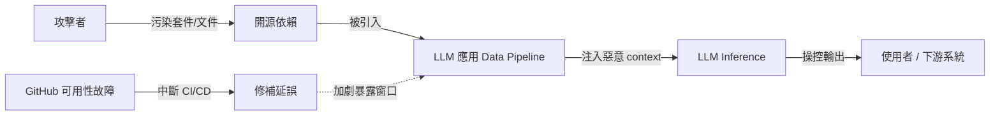

# AI Daily Digest — 2026-03-26

<!-- pipeline-generated:begin -->

## 🔥 今日 TOP 3
### 1. LLM 供應鏈攻擊與 GitHub 故障同步浮現
GitHub 長期可用性故障與針對 LLM 應用的大規模供應鏈攻擊在近期同時浮現。攻擊者透過污染開源依賴套件，讓惡意內容進入 LLM 應用的 context window，無需執行任何程式碼即可操控模型輸出；GitHub 的持續故障則同步衝擊依賴 CI/CD 的 AI 應用交付流程，延長了安全漏洞的暴露窗口。

這兩起事件共同指向 AI 時代開發基礎設施的系統性脆弱性。LLM 供應鏈攻擊的威脅面已從「程式碼執行層」升級至「語義污染層」，影響比傳統 RCE 更隱蔽、更難溯源；GitHub 的高集中度依賴風險也再次暴露單點故障對整個 AI 開發生態的連鎖效應。

短期行動：對 LLM pipeline 的外部依賴實施 hash pinning 與 integrity check，評估 GitLab self-hosted 或 Gitea 作為備援方案。中期應追蹤 SLSA level 3 等供應鏈安全標準是否延伸覆蓋 model inference 的 data path，並在模型輸出端建立 output validation layer。

📖 [閱讀完整 insight](../10-insights/2026-03-26/inbox_a4e80a8b.md) · 🔗 [原文連結](https://newsletter.pragmaticengineer.com/p/the-pulse-is-github-still-best-for)
### 2. 代理型工作流：實踐落地仍缺具體設計模式
Nick Tune 訪談（inbox_26dd8bac）指出，業界對 agentic code workflow 的討論多停留在概念層面，缺乏針對 task decomposition、context management 與 error recovery 的具體設計模式與量化案例，各工程團隊仍在獨立摸索。

這個落差的影響是雙重的：工程師難以評估引入 agentic workflow 的實際效益，也難以預判失敗模式。相比於廣泛的生產力宣稱，業界更需要「哪些場景下 agent 會失敗、如何 recover」的具體實測紀錄。

建議優先追蹤有量化指標的 agentic workflow case study，特別是在 long-horizon task 的 context 管理與 multi-step error 累積上有實測數據的分享，而非泛泛的生產力討論。

📖 [閱讀完整 insight](../10-insights/2026-03-26/inbox_26dd8bac.md) · 🔗 [原文連結](https://newsletter.techworld-with-milan.com/p/agentic-code-workflows-with-nick)
### 3. Spark 取代 MapReduce：記憶體運算克服磁碟瓶頸
Apache Spark 透過 in-memory processing 克服了 MapReduce 反覆讀寫磁碟的效能瓶頸，成為主流分散式資料處理引擎。其 lazy evaluation、DAG execution 與 unified API 設計哲學定義了現代大規模資料 pipeline 的標準形式。

對 AI/ML 工程師而言，理解 Spark 的技術定位有助於大規模訓練資料前處理（data preprocessing）與 feature engineering 的技術選型，尤其在需整合 Hadoop 生態系的 PB 級場景中 Spark 仍是主要方案。

入門者可透過短影片（4 分鐘）建立架構直覺後，進一步深入 Spark SQL 或 Structured Streaming；進階使用者應關注 Apache Iceberg + Spark 的組合，這是目前 data lakehouse 架構的主流選擇。

📖 [閱讀完整 insight](../10-insights/2026-03-26/inbox_f94e5ba8.md) · 🔗 [原文連結](https://vutr.substack.com/p/video-what-is-apache-spark)

## 📚 分類摘要
### agents
今日代理型工作流訊號來自 inbox_26dd8bac（Nick Tune 訪談）。核心觀察是：業界對 agentic code workflow 的討論普遍缺乏可操作的設計模式，工程師在採用前難以評估實際效益或預判失敗模式。這對考慮導入 agentic pattern 的團隊是重要警訊——應先確認目標場景有可量化的成功指標（如 task completion rate、context utilization、error recovery rate），而非直接套用抽象概念。

目前 agentic workflow 的主要工程挑戰集中在三個面向：long-horizon task 的 context 管理（防止關鍵資訊在多輪後被截斷）、multi-step error 的累積與 recovery 機制設計、以及多 agent 之間的狀態同步與 conflict resolution。今日沒有具體技術細節，但這個話題值得持續追蹤有 benchmark 支持的具體案例。
### infra
今日最重要的基礎設施訊號來自 inbox_a4e80a8b：GitHub 長期可用性問題與大規模 LLM 供應鏈攻擊同步浮現，共同指向 AI 開發工具鏈的系統性脆弱性。LLM 供應鏈攻擊的新特點是攻擊面從「程式碼執行層」延伸至「語義層」——污染開源依賴的說明文件或 RAG data source 即可影響 LLM 的 context，不需執行惡意程式碼，偵測難度顯著高於傳統攻擊。

API 安全基礎（inbox_296c3d25）涵蓋 HTTPS、API 金鑰驗證與程式碼審查三要素，屬通用最佳實踐，對 LLM 特定威脅的針對性有限。Apache Spark（inbox_f94e5ba8）作為分散式資料處理基礎設施入門背景，適合需快速了解 Spark 定位的工程師。

## 🎯 專欄
### 🏢 企業導入 AI / 團隊實踐
- **[How to Implement API Security](../10-insights/2026-03-26/inbox_296c3d25.md)**
  本文介紹 API 安全的基礎實踐，包括啟用 HTTPS、要求 API 金鑰驗證、以及部署前進行程式碼審查。文章指出絕大多數上線 API 都採用了這些標準措施，但未提及更高階的安全策略或最新威脅防護。
- **[Good Judgment is the New Important Skill for Engineers](../10-insights/2026-03-26/inbox_48559f14.md)**
  無法完整處理：原文未提供內容，僅有標題。標題指出在 AI 時代，工程師決策能力比編碼技術更重要，但缺乏具體論述、案例或「judgment」的定義。
### 🎓 AI 使用技巧 / 心法
- **[How to Implement API Security](../10-insights/2026-03-26/inbox_296c3d25.md)**
  本文介紹 API 安全的基礎實踐，包括啟用 HTTPS、要求 API 金鑰驗證、以及部署前進行程式碼審查。文章指出絕大多數上線 API 都採用了這些標準措施，但未提及更高階的安全策略或最新威脅防護。
- **[Agentic code workflows with Nick Tune](../10-insights/2026-03-26/inbox_26dd8bac.md)**
  無法處理此項：無足夠正文內容。根據標題，文章為對 Nick Tune 的訪談，討論主題為「Agentic code workflows」（代理型程式碼工作流）。文章強調多數工程師談論 AI 生產力時多停留在抽象層面。
### ⛓️ 區塊鏈 / Web3
- **[16 個加密貨幣剛拿到免死金牌...](../10-insights/2026-03-26/inbox_5a42092b.md)**
  無法完整解析
### 🔐 AI 安全 / 濫用
- **[How to Implement API Security](../10-insights/2026-03-26/inbox_296c3d25.md)**
  本文介紹 API 安全的基礎實踐，包括啟用 HTTPS、要求 API 金鑰驗證、以及部署前進行程式碼審查。文章指出絕大多數上線 API 都採用了這些標準措施，但未提及更高階的安全策略或最新威脅防護。

## 💡 今日 Takeaway

_讀完今日所有內容後，可帶走的知識點_
### 1. LLM 應用的供應鏈攻擊面已擴展至語義污染層
傳統供應鏈攻擊目標是讓惡意程式碼在主機執行；針對 LLM 的新型攻擊更隱蔽——污染套件說明文件、RAG 資料源或 prompt template，即可在不執行任何程式碼的情況下操控模型輸出，且難以被傳統 SAST/DAST 工具偵測。這意味著 LLM 應用的安全邊界必須延伸到整條 data path 的完整性驗證，而非僅限於程式碼審查。實務上，應對所有外部資料來源（套件、向量資料庫、文件）實施 integrity check，並在模型輸出端設計 output validation layer 以偵測異常輸出模式。

_類型：pattern_

**參考來源**：
- [The Pulse: is GitHub still best for AI-native development?](../10-insights/2026-03-26/inbox_a4e80a8b.md) · [原文](https://newsletter.pragmaticengineer.com/p/the-pulse-is-github-still-best-for)

<!-- pipeline-generated:end -->

<!-- user-notes -->
<!-- Write your own notes below; pipeline never touches this section. -->