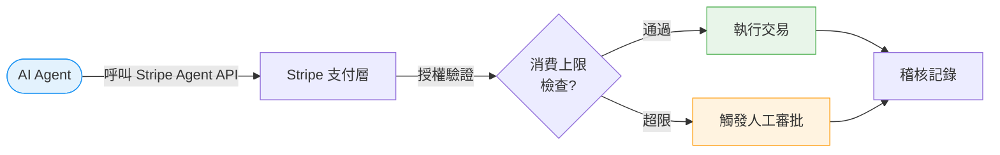

# AI Daily Digest — 2026-03-29

<!-- pipeline-generated:begin -->

## 🔥 今日 TOP 3
### 1. SEC+CFTC 聯合確認 16 代幣非證券；Stripe 進入 AI Agent 支付
美國 SEC 與 CFTC 首次聯合發布聲明，確認 16 個加密代幣在美國法律框架下不屬於證券，為兩大監管機構首度就代幣定性達成一致立場。同期 Stripe 宣布進入 AI Agent 支付領域，自主代理將能直接發起金融交易。Ethereum Foundation 新政策引發社群分歧，Balancer Labs 同步宣告倒閉，市場出現波動。

SEC+CFTC 聯合聲明打破加密市場多年的法律模糊地帶，其約束力遠比單一機構聲明更強，預期為機構投資者建立可預測的合規基礎並吸引資金回流。Stripe 進軍 Agent 支付則標誌著 agentic 應用從「執行指令」升至「自主消費」，是商業 Agent 從實驗走向落地不可缺少的基礎設施轉折點。

觀察其他主流代幣是否跟進取得非證券認定，留意是否觸發美國加密 ETF 審批加速。Stripe Agent 支付的授權邊界設計（消費上限、稽核記錄、人工觸發閾值）對計畫構建 agentic 應用的開發者有直接架構決策影響，應在系統設計早期就納入考量。

📖 [閱讀完整 insight](../10-insights/2026-03-29/inbox_20d668c4.md) · 🔗 [原文連結](https://www.maxcrypto.space/p/digest-6-podcast)
### 2. OpenAI 與蓋茨基金會合辦亞洲 AI 災害應對工作坊
OpenAI 與比爾及梅琳達·蓋茨基金會在亞洲聯合舉辦工作坊，協助多國災害應對機構將 AI 技術轉化為實際行動方案。工作坊涵蓋災害預防、應對及復原三個階段，多個亞洲國家的緊急管理機構參與其中。

此舉標誌 OpenAI 將觸角延伸至社會影響力領域，不再局限於商業產品推廣。對亞洲開發中國家而言，AI 輔助災害應對可在資源有限情況下大幅提升緊急響應效率，相較於純靠人力訓練的傳統模式，具備更高可擴展性與可複製性。

留意工作坊是否產出公開的 AI 災害應對框架或工具包；若此模式成功複製，可能帶動更多科技公司與國際基金會合作，在公共政策領域建立 AI 應用的標準化路徑，形成新一類「社會影響力型 AI 部署」範本。

📖 [閱讀完整 insight](../10-insights/2026-03-29/inbox_5a6a25c0.md) · 🔗 [原文連結](https://openai.com/index/helping-disaster-response-teams-asia)
### 3. GitHub Copilot SDK 拓展 C# Source Generators 整合應用
2026 年 3 月開發週刊揭示 GitHub Copilot SDK 在 C# 生態的最新進展，重點介紹 C# Source Generators 與 Copilot 整合的應用範例，以及設計模式在 AI 輔助開發時代的重新定位。

C# Source Generators 屬於編譯期程式碼生成技術，與 Copilot SDK 結合後，AI 補全建議可更精準地感知 .NET 專案的程式碼生成脈絡，相比傳統 IntelliSense 補全具備更深的語意理解能力，對大量使用樣板程式碼的企業 .NET 專案有直接提效價值。

追蹤 Copilot SDK 的公開 API 文件更新，評估 Source Generators + Copilot 組合是否適合引入現有 .NET 企業專案；對已大量採用 Source Generators 的團隊，此整合路徑值得優先驗證，可作為 AI 輔助開發工具鏈升級的試點場景。

📖 [閱讀完整 insight](../10-insights/2026-03-29/inbox_9ece9e59.md) · 🔗 [原文連結](https://devleader.substack.com/p/github-copilot-sdk-c-source-generators)

## 📚 分類摘要
### foundation_models
今日 foundation_models 類別有兩則 insights。inbox_5a6a25c0 記錄 OpenAI 與蓋茨基金會在亞洲合辦 AI 災害應對工作坊，代表 OpenAI 在社會影響力領域的首次大規模區域性佈局，聚焦將 GPT 系列模型轉化為各國災難應對機構的實務工具，而非商業產品推廣。

inbox_9ece9e59 介紹 GitHub Copilot SDK 在 C# 生態的最新整合進展，涵蓋 C# Source Generators 與 Copilot 協同的具體應用範例，以及 AI 輔助開發時代對傳統設計模式的重新審視。

兩則 insights 共同呈現 foundation model 廠商在 2026 年的差異化策略：OpenAI 往社會議題延伸，GitHub（Microsoft）則持續深耕開發者工具整合生態，兩條路線互不重疊但都在拓寬模型的應用邊界。
### agents
inbox_20d668c4 中 Stripe 進入 AI Agent 支付領域是今日 agents 類別最重要的事件。自主代理的「支付能力」一直是 agentic 應用落地的隱形瓶頸——代理可以規劃、搜尋、執行，但無法獨立完成金融交易，Stripe 此舉直接填補這個架構缺口。

開發者在設計 agentic 應用時，需提前規劃授權邊界（哪些交易類型允許自主執行）、支出上限，以及不可逆操作的人工觸發閾值；這些架構決策比功能本身更早需要確定，而非上線後才補充治理機制。

## 🎯 專欄
### 🏢 企業導入 AI / 團隊實踐
- **[Helping disaster response teams turn AI into action across Asia](../10-insights/2026-03-29/inbox_5a6a25c0.md)**
  OpenAI 與蓋茨基金會合作，在亞洲舉辦工作坊推進 AI 在災害應對中的應用。該計畫幫助災害應對團隊將 AI 技術轉化為實際行動。工作坊聚焦於災害預防、應對和復災中的 AI 應用方法。此舉展現 OpenAI 在社會應急領域的承諾。亞洲多個國家的災害應對機構參與其中。
- **[How to Evaluate AI Fluency in Technical Interviews](../10-insights/2026-03-29/inbox_7c7f7217.md)**
  無法完整處理：原文未提供內容，僅有標題。標題提及在技術面試中評估 AI fluency 的方法，暗示取代禁用 AI 的舊做法，但缺乏具體評估框架、案例或建議。
- **[GitHub Copilot SDK, C# Source Generators, and Design Patterns](../10-insights/2026-03-29/inbox_9ece9e59.md)**
  2026 年 3 月開發週刊，重點介紹 GitHub Copilot SDK、C# Source Generators 與設計模式的最新動向。本期亮點為 Copilot SDK 在 C# 生態中的擴展與應用範例。展示開發工具與 AI 助手整合的逐步演進。
### 🎓 AI 使用技巧 / 心法
- **[Helping disaster response teams turn AI into action across Asia](../10-insights/2026-03-29/inbox_5a6a25c0.md)**
  OpenAI 與蓋茨基金會合作，在亞洲舉辦工作坊推進 AI 在災害應對中的應用。該計畫幫助災害應對團隊將 AI 技術轉化為實際行動。工作坊聚焦於災害預防、應對和復災中的 AI 應用方法。此舉展現 OpenAI 在社會應急領域的承諾。亞洲多個國家的災害應對機構參與其中。
- **[How to Evaluate AI Fluency in Technical Interviews](../10-insights/2026-03-29/inbox_7c7f7217.md)**
  無法完整處理：原文未提供內容，僅有標題。標題提及在技術面試中評估 AI fluency 的方法，暗示取代禁用 AI 的舊做法，但缺乏具體評估框架、案例或建議。
- **[GitHub Copilot SDK, C# Source Generators, and Design Patterns](../10-insights/2026-03-29/inbox_9ece9e59.md)**
  2026 年 3 月開發週刊，重點介紹 GitHub Copilot SDK、C# Source Generators 與設計模式的最新動向。本期亮點為 Copilot SDK 在 C# 生態中的擴展與應用範例。展示開發工具與 AI 助手整合的逐步演進。
### 💳 支付 / Fintech
- **[只有這 16 個代幣被發免死金牌，有你的嗎？](../10-insights/2026-03-29/inbox_20d668c4.md)**
  SEC 與 CFTC 首次聯合發布監管定義，確認 16 個加密貨幣代幣在美國法律下「不屬於證券」，為加密產業建立清晰的規則框架。同時 Stripe 宣布進入 AI Agent 支付領域，拓展自主代理在支付生態中的應用。Ethereum Foundation 推出新政策引發社群分裂，Balancer Labs 則宣布倒閉，市場面臨波動。儘管短期震蕩，加密貨幣產
### ⛓️ 區塊鏈 / Web3
- **[只有這 16 個代幣被發免死金牌，有你的嗎？](../10-insights/2026-03-29/inbox_20d668c4.md)**
  SEC 與 CFTC 首次聯合發布監管定義，確認 16 個加密貨幣代幣在美國法律下「不屬於證券」，為加密產業建立清晰的規則框架。同時 Stripe 宣布進入 AI Agent 支付領域，拓展自主代理在支付生態中的應用。Ethereum Foundation 推出新政策引發社群分裂，Balancer Labs 則宣布倒閉，市場面臨波動。儘管短期震蕩，加密貨幣產

## 💡 今日 Takeaway

_讀完今日所有內容後，可帶走的知識點_
### 1. 支付基礎設施支援 Agent 自主交易，是 Agentic 應用商業落地的必要前提
Stripe 進入 AI Agent 支付領域揭示一個普遍規律：agentic 應用要從實驗走向商業，必須在每個「資源獲取節點」建立對應的自主執行能力，支付是其中最關鍵的一環——沒有支付授權的 Agent 只能完成無成本操作，這限制了其在商業場景的實際價值上限。設計 agentic 系統時，應在早期架構評審中明確定義「哪些動作可自主執行、哪些需人工確認」，並將消費上限與稽核記錄納入核心設計，而非上線後才補充治理層。

_類型：pattern_

**參考來源**：
- [只有這 16 個代幣被發免死金牌，有你的嗎？](../10-insights/2026-03-29/inbox_20d668c4.md) · [原文](https://www.maxcrypto.space/p/digest-6-podcast)
### 2. 監管明確化是機構資金進入新興市場的領先指標，但實際進場往往滯後 1-2 季
SEC+CFTC 聯合確認 16 個代幣非證券，首次建立可預測的法律框架；歷史資料顯示，監管清晰度降低的是合規成本而非市場風險，機構進場的實際時機通常滯後監管明確化事件 1-2 個季度。在評估新興市場（加密、AI 產品責任）的機構化進程時，「監管明確化」應作為領先指標追蹤，而非等到資金實際進場才確認趨勢，此模式在歐盟 MiCA 框架落地過程中已有明確先例可參照。

_類型：data-point_

**參考來源**：
- [只有這 16 個代幣被發免死金牌，有你的嗎？](../10-insights/2026-03-29/inbox_20d668c4.md) · [原文](https://www.maxcrypto.space/p/digest-6-podcast)

<!-- pipeline-generated:end -->

<!-- user-notes -->
<!-- Write your own notes below; pipeline never touches this section. -->