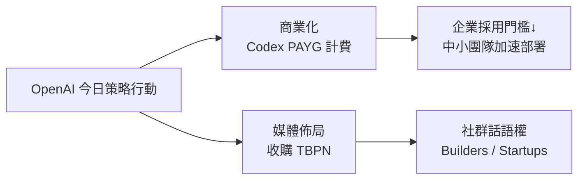
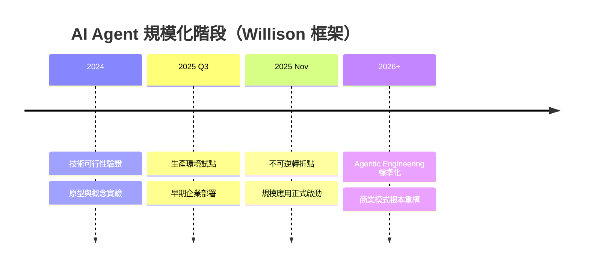

# AI Daily Digest — 2026-04-02

<!-- pipeline-generated:begin -->

## 🔥 今日 TOP 3
### 1. Simon Willison 宣告 AI Agent 規模化不可逆轉折點
資深研究者 Simon Willison 宣告 2025 年 11 月為軟體工程的歷史性分水嶺：AI agent 從原型實驗正式跨入生產規模部署階段，進入不可逆的新常態。他提出「lethal trifecta」框架描述 agent 在特定條件組合下呈現的致命複合優勢，並系統整理出 agentic engineering 的核心設計模式。

這份分析的意義超越技術評估：整個產業已越過「技術可不可行」的討論門檻，進入「如何規模化競賽」的實作期。Willison 強調，自動化帶來的衝擊是商業模式、人力配置與軟體架構的根本重構——而非只是個別任務效率提升——對企業而言，agentic 架構已從「值得探索」升格為「競爭必要條件」。

工程師與技術主管現在最應做的是：系統性學習 agentic design patterns（Willison 指出這些模式可習得、可預測、非黑盒），深讀原文了解「lethal trifecta」具體構成，並盤點自身組織是否仍停留在原型討論階段——若是，策略上已落後。

📖 [閱讀完整 insight](../10-insights/2026-04-02/inbox_399ab9bf.md) · 🔗 [原文連結](https://www.lennysnewsletter.com/p/an-ai-state-of-the-union)
### 2. Meta 撤除 Instagram 私訊加密以供 AI 訓練資料使用
Meta 宣布移除 Instagram Direct Message 的端對端加密（E2EE）保護，使其 AI 系統得以存取用戶私訊內容作為訓練資料。分析人士將此稱為「精準收割」策略：Meta 利用用戶優先便利性而非隱私的心理，單方面改寫既有隱私承諾，而調查顯示多數用戶反應淡漠。

相較過往以廣告定向為由的資料收集，以 AI 訓練為由的隱私政策調整代表新一代數據治理邏輯——AI 訓練資料的商業價值已成為推動此類調整的核心驅動力。用戶便利性優先的結構性心理為平台提供了低阻力的策略空間，也為其他社群平台跟進類似做法降低了社會成本。

觀察重點：歐盟 GDPR 監管機關的回應時間軸，以及其他掌握大量私人對話資料的平台是否跟進。AI 產品設計者在規劃資料策略時，應提前評估隱私政策調整對長期用戶信任的代價，而非等到輿論反彈後才被動應對。

📖 [閱讀完整 insight](../10-insights/2026-04-02/inbox_da2fc10b.md) · 🔗 [原文連結](https://likecoin.substack.com/p/instagram)
### 3. OpenAI 收購科技媒體 TBPN 進軍社群話語權基礎設施
OpenAI 宣布收購科技媒體平台 TBPN，受眾以 builders、創業者與科技社群為核心。這是 OpenAI 首次透過直接持有媒體資產建立社群對話管道，不同於過往依賴官方 blog 和 Twitter 的單向發布模式，標誌著主動議題設定能力的戰略升級。

相較其他 AI lab 仍以產品發布和研究論文塑造品牌，OpenAI 此舉使其能在 AI 政策、產品方向、監管辯論等議題上持續影響社群認知——媒體資產作為「話語權基礎設施」的商業邏輯，在 AI 競爭格局中第一次被以收購形式明確實現。此舉對 Anthropic、Google DeepMind 等競爭者構成不對稱壓力。

觀察重點：TBPN 的編輯獨立性能否維持、OpenAI 是否進一步收購其他媒體或播客。對 AI 從業者而言，這提示未來「AI 基礎設施」的定義可能持續擴展——從算力和模型，延伸至社群話語權與知識分發渠道。

📖 [閱讀完整 insight](../10-insights/2026-04-02/inbox_3a45b72a.md) · 🔗 [原文連結](https://openai.com/index/openai-acquires-tbpn)

## 📚 分類摘要
### foundation_models
OpenAI 本日在商業化與媒體佈局兩條戰線同步推進。商業化方面，Codex 正式推出 pay-as-you-go 按使用量計費模式（inbox_14551dab），適用於 ChatGPT Business 和 Enterprise 方案，有效降低企業初期採用門檻，預計加速中小型開發團隊從評估轉向生產部署。媒體佈局方面，OpenAI 收購 TBPN（inbox_3a45b72a），直接掌握面向 builders 與創業社群的媒體渠道，是 AI lab 將「社群話語權」列入戰略資產的首次明確行動。

工具採用訊號方面，Meta CEO Zuckerberg 與 YC 主席 Garry Tan 親身使用 AI 編碼工具的消息（inbox_bb8911b8）廣受關注。同期 Claude Code 與 GitHub 出現服務中斷，反而強化了這個訊號：當頭條級別的領導者因 AI 開發工具中斷而受影響，代表這類工具已深度嵌入現代核心工作流，而非邊緣輔助工具。
### agents
今日 agents 類別的核心是 Simon Willison 的深度分析（inbox_399ab9bf）：他以 2025 年 11 月為基準，宣告 agentic engineering 進入規模化生產部署的不可逆階段，並提出「lethal trifecta」框架描述 agent 複合優勢的致命組合。更關鍵的是，Willison 系統整理了 agentic engineering 的設計模式，並明確指出這些模式「可習得、可預測、可規模化」——這個定性對工程師的意義在於：agentic 系統不再是難以駕馭的黑盒，而是有章法可循的工程領域，具備明確的學習路徑。

Willison 的分析超越技術評估，指出真正的衝擊在業務層：自動化重構的是商業模式、人力配置與軟體架構本身，而非只是個別任務效率。這個視角對正在思考 AI 投資優先順序的技術主管尤其重要：agentic 架構布局的窗口期正在快速收縮，原型討論期已結束。

## 🎯 專欄
### 🛠 Claude Code / Codex 新功能
- **[Codex now offers more flexible pricing for teams](../10-insights/2026-04-02/inbox_14551dab.md)**
  OpenAI 為 Codex 推出按使用量計費（pay-as-you-go）的定價模式。此新定價適用於 ChatGPT Business 和 Enterprise 方案。該模式降低了團隊的初期成本和採用障礙。企業現在可以更靈活地開始試用和擴展 Codex 的使用規模。此舉有助於加速企業級 AI 編碼工具的采用。
- **[The Pulse: Industry leaders return to coding with AI](../10-insights/2026-04-02/inbox_bb8911b8.md)**
  Mark Zuckerberg 和 Garry Tan 加入了一波企業領導者利用 AI 工具重返編碼的趨勢。同期 Claude Code 和 GitHub 經歷了服務中斷，凸顯這些 AI 開發工具對現代開發流程的關鍵性。Meta 和 Y Combinator 等大型組織的高管親身使用 AI 編程，標誌著 AI 輔助開發已成為業界標配。
### 🏢 企業導入 AI / 團隊實踐
- **[OpenAI acquires TBPN](../10-insights/2026-04-02/inbox_3a45b72a.md)**
  OpenAI 宣布收購 TBPN，旨在加速全球 AI 相關對話並支持獨立媒體。此次收購反映 OpenAI 在內容傳播和社區對話領域的戰略擴展。通過 TBPN，OpenAI 期望拓展與建造者、企業和更廣泛科技社群的對話渠道。此舉有助於推進 AI 技術在全球範圍內的認知和應用。TBPN 的具體業務模式和此次收購的詳細條款暫未披露。
- **[Codex now offers more flexible pricing for teams](../10-insights/2026-04-02/inbox_14551dab.md)**
  OpenAI 為 Codex 推出按使用量計費（pay-as-you-go）的定價模式。此新定價適用於 ChatGPT Business 和 Enterprise 方案。該模式降低了團隊的初期成本和採用障礙。企業現在可以更靈活地開始試用和擴展 Codex 的使用規模。此舉有助於加速企業級 AI 編碼工具的采用。
- **[The Pulse: Industry leaders return to coding with AI](../10-insights/2026-04-02/inbox_bb8911b8.md)**
  Mark Zuckerberg 和 Garry Tan 加入了一波企業領導者利用 AI 工具重返編碼的趨勢。同期 Claude Code 和 GitHub 經歷了服務中斷，凸顯這些 AI 開發工具對現代開發流程的關鍵性。Meta 和 Y Combinator 等大型組織的高管親身使用 AI 編程，標誌著 AI 輔助開發已成為業界標配。
- **[Would I Still Go The Engineering Manager Route in 2026?](../10-insights/2026-04-02/inbox_5e6382f1.md)**
  無法完整處理：原文未提供內容，僅有標題。標題暗示文章探討工程師在 2026 年是否應轉向管理角色，但無法確認核心論點、推理過程或實務建議。
- **[Instagram Removing End-to-End Encryption: a Precision Harvest](../10-insights/2026-04-02/inbox_da2fc10b.md)**
  Meta 為供應 AI 訓練資料，決定移除 Instagram DM 的端到端加密(E2EE)保護，使其 AI 系統能訪問用戶對話内容。此舉被分析人士稱為『精準收割』(precision harvest)：Meta 利用用戶優先選擇便利性而非隱私的心理，單方面改寫隱私政策。調查數據顯示多數使用者反應淡漠，更重視應用功能便捷性。這個事件揭示重要趨勢：AI 訓練
### ⛓️ 區塊鏈 / Web3
- **[Codex now offers more flexible pricing for teams](../10-insights/2026-04-02/inbox_14551dab.md)**
  OpenAI 為 Codex 推出按使用量計費（pay-as-you-go）的定價模式。此新定價適用於 ChatGPT Business 和 Enterprise 方案。該模式降低了團隊的初期成本和採用障礙。企業現在可以更靈活地開始試用和擴展 Codex 的使用規模。此舉有助於加速企業級 AI 編碼工具的采用。
- **[Instagram Removing End-to-End Encryption: a Precision Harvest](../10-insights/2026-04-02/inbox_da2fc10b.md)**
  Meta 為供應 AI 訓練資料，決定移除 Instagram DM 的端到端加密(E2EE)保護，使其 AI 系統能訪問用戶對話内容。此舉被分析人士稱為『精準收割』(precision harvest)：Meta 利用用戶優先選擇便利性而非隱私的心理，單方面改寫隱私政策。調查數據顯示多數使用者反應淡漠，更重視應用功能便捷性。這個事件揭示重要趨勢：AI 訓練

## 💡 今日 Takeaway

_讀完今日所有內容後，可帶走的知識點_
### 1. Agentic 設計模式可習得、可預測，非不可捉摸的黑盒
Simon Willison 明確指出 agentic engineering 的設計模式具備可習得性與跨框架通用性，工程師不需要針對每個 agent 系統從零摸索行為邊界。這意味著投資學習 agentic patterns 的 ROI 遠高於等待下一個框架——底層設計模式比上層工具更穩定。實務上，建議以「設計模式清單」方式系統學習，並在現有系統中識別哪些環節具備 agentic 化條件，優先在有明確 success criteria 的任務上試點。

_類型：framework_

**參考來源**：
- [An AI state of the union: We’ve passed the inflection point, dark factories are coming, and automation timelines | Simon Willison](../10-insights/2026-04-02/inbox_399ab9bf.md) · [原文](https://www.lennysnewsletter.com/p/an-ai-state-of-the-union)
### 2. 轉折點判定法：生產案例數 > 原型案例數即已越過門檻
Willison 的框架提供一個可操作的判定標準：當某技術的生產部署案例數量超過原型案例，代表已越過「技術可行性討論期」進入「規模化競賽期」，仍在內部辯論「要不要試」的組織已策略落後。以 agentic engineering 為例，2025 年底已符合此條件。這個框架可直接套用至組織內部技術優先順序決策：用生產 vs. 原型比例作為投資強度的客觀指標，而非依賴主觀的「技術成熟度」判斷。

_類型：framework_

**參考來源**：
- [An AI state of the union: We’ve passed the inflection point, dark factories are coming, and automation timelines | Simon Willison](../10-insights/2026-04-02/inbox_399ab9bf.md) · [原文](https://www.lennysnewsletter.com/p/an-ai-state-of-the-union)
### 3. AI 訓練資料的商業價值正成為企業隱私政策調整的主要驅動力
Meta 移除 Instagram DM E2EE 的決策顯示，當 AI 訓練資料的商業價值足夠高，企業具備強烈動機重新詮釋隱私承諾——而用戶便利性優先的結構性心理為此提供了低阻力條件。這個 pattern 適用於任何掌握大量用戶私人互動資料的平台，代表新一代數據治理的商業邏輯。規劃 AI 產品資料策略時，應在設計階段即模擬「若以 AI 訓練為由調整資料使用政策，用戶信任代價與商業收益的對比」，而非等到輿論反彈後被動應對。

_類型：pattern_

**參考來源**：
- [Instagram Removing End-to-End Encryption: a Precision Harvest](../10-insights/2026-04-02/inbox_da2fc10b.md) · [原文](https://likecoin.substack.com/p/instagram)

<!-- pipeline-generated:end -->

<!-- user-notes -->
<!-- Write your own notes below; pipeline never touches this section. -->