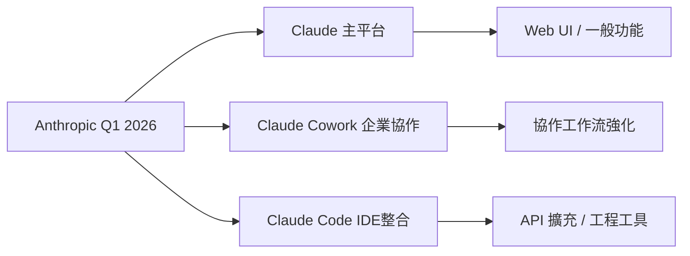

# AI Daily Digest — 2026-04-03

<!-- pipeline-generated:begin -->

## 🔥 今日 TOP 3
### 1. Anthropic Q1 發布 120+ 功能，三大產品線加速
Anthropic 在 2026 年 Q1（90 天內）跨 Claude、Claude Cowork、Claude Code 三大產品線發布超過 120 項新功能，覆蓋 API 擴充、Web 介面改版、IDE 整合及工作流程編排等核心應用場景。此規模的單季發布數量，為目前主要 AI 工具廠商中最高紀錄之一。

對 AI 開發者與企業用戶而言，這批更新最直接的影響在於 Claude Code 的 IDE 整合強化，以及 Claude Cowork 對企業協作場景的功能補完。相較於 OpenAI 以模型大版本為主要發布節奏，Anthropic 以產品線為維度的高頻迭代，代表其競爭策略已從純模型能力比拼轉向開發者平台生態的深度構建。

建議開發者本週梳理 Claude Code 的 IDE 整合新功能清單，評估是否可直接套用於現有 CI/CD 工作流或 Agent 管線。也需關注 120+ 功能中哪些已正式 GA、哪些仍為 Beta，以判斷生產環境的可用性風險。

📖 [閱讀完整 insight](../10-insights/2026-04-03/inbox_c844c016.md) · 🔗 [原文連結](https://www.news.aakashg.com/p/anthropic-q1-features)
### 2. Condor 開源框架上線，自主交易代理開發標準化
Hummingbot 官方推出開源框架 Condor，專為自主交易代理（Autonomous Trading Agents）設計，提供標準化的機器人部署、策略回測與交易所連接器基礎設施，目標是大幅縮短交易策略從構思到上線的工程週期。

相較於過去開發者需自行處理交易所 API 接入、風控邏輯與訂單管理等底層問題，Condor 將這些設施封裝為可重用元件，顯著降低量化交易社群的技術進入門檻。這也是 AI Agent 從語言處理延伸至高風險金融操作場景的具體案例，反映 Agentic 應用向垂直領域加速滲透的趨勢。

關鍵觀察點在於 Condor 社群的 Connector 插件生態成熟速度，以及其策略沙盒（backtesting）引擎的實戰完整性。對 DeFi 或 CEX 量化團隊而言，現階段可評估 Condor 是否能取代自建 Bot 框架，降低維護成本並提升策略迭代速度。

📖 [閱讀完整 insight](../10-insights/2026-04-03/inbox_e709ec20.md) · 🔗 [原文連結](https://hummingbot.substack.com/p/the-bot-pod-episode-1-trading-agents)
### 3. Apache Parquet 列式儲存格式規格概述
本篇文章以約 3 分鐘短篇形式介紹 Apache Parquet 列式儲存格式的核心規格，內容涵蓋檔案結構與基本編碼策略。然而原始文章正文內容極為有限，缺乏可供深度分析的技術細節，本摘要依據標題與有限資訊整理。

Parquet 是 Spark、Trino、DuckDB 等大數據分析工具的主流儲存格式，理解其基礎規格有助工程師在 ETL 管線設計時做出合理的分區與壓縮選擇。然而本篇定位為入門概述，與 AI 領域的直接關聯性較低，主要適合剛接觸大數據格式的讀者參考。

若需深入理解 Parquet 的巢狀資料結構（Dremel 編碼）或查詢效能調優，建議直接查閱 Apache 官方規格文件。本篇短文的參考價值有限，不建議作為技術決策的主要依據。

📖 [閱讀完整 insight](../10-insights/2026-04-03/inbox_c9871190.md) · 🔗 [原文連結](https://vutr.substack.com/p/parquet-fundamentals-in-3-mins)

## 📚 分類摘要
### foundation_models
本日 foundation_models 類別的核心事件為 Anthropic 在 2026 年 Q1 跨三大產品線發布超過 120 項功能（inbox_c844c016）。三條產品線各有定位：Claude 主平台面向一般用戶體驗優化，Claude Cowork 聚焦企業協作場景，Claude Code 深化工程師 IDE 工具整合。此規模的產品迭代顯示 Anthropic 的工程策略已從「模型研究優先」明確轉向「產品體驗與開發者生態並重」。

值得關注的是，如此高頻的發布節奏對文件維護與功能一致性管理提出挑戰，尤其 API 層面的改動若缺乏版本穩定性保證，可能影響既有整合商的升級決策。觀察 Anthropic 是否會提供清晰的功能分級機制（GA vs Preview vs Beta），將是評估其平台成熟度的重要指標。對比 OpenAI 的季度大版本節奏，Anthropic 的高頻小步伐策略形成差異化競爭定位。
### agents
本日 agents 類別的代表事件為 Hummingbot 推出 Condor 開源框架（inbox_e709ec20），將自主交易代理的開發工具鏈標準化。不同於 LangChain、AutoGen 等通用 Agent 框架，Condor 針對交易場景做深度垂直整合，內建交易所連接器（Connector）、策略回測引擎與風控模組，是領域專用（domain-specific）Agent 框架的典型案例。

此發展方向預示一個趨勢：Agentic 應用將從水平通用框架逐漸分裂出多個垂直框架，各自對應高度領域化的操作場景（金融交易、醫療診斷、法律合規等）。垂直框架通常能提供更好的工具精度與合規管控能力，但以犧牲通用性為代價，形成與通用框架的互補關係而非取代關係。

對 AI 工程師而言，Condor 的開源代碼庫是學習「如何將 LLM Agent 安全嵌入高頻、低容錯操作環境」的具體案例，其錯誤處理與狀態回復機制值得深入研究，可作為設計其他高風險場景 Agent 系統的參考藍本。

## 🎯 專欄
### 🛠 Claude Code / Codex 新功能
- **[How Anthropic shipped 120 features in 90 days (and how to use them)](../10-insights/2026-04-03/inbox_c844c016.md)**
  Anthropic 在 Q1（90 天內）跨 Claude、Claude Cowork、Claude Code 三大產品線發布了 120+ 功能。本文系統梳理了所有新功能並提供使用指南。如此密集的功能發布展現了 Anthropic 應對市場競爭的積極姿態，功能覆蓋 API、Web 介面、IDE 整合等多維度。Q1 的發布規模確立了 Claude 在 AI 工
### 🏢 企業導入 AI / 團隊實踐
- **[The Bot Pod Episode 1: Trading Agents in Condor](../10-insights/2026-04-03/inbox_e709ec20.md)**
  Hummingbot 推出新開源框架 Condor，專門用於構建自主交易代理。該框架簡化了交易機器人的開發流程，允許開發者快速部署和測試自動化交易策略。Condor 作為統一的開源工具基礎設施，為加密貨幣交易社群降低了進入交易代理開發的門檻。該框架有望促進自主交易機器人應用的普及。
### 🎓 AI 使用技巧 / 心法
- **[How Anthropic shipped 120 features in 90 days (and how to use them)](../10-insights/2026-04-03/inbox_c844c016.md)**
  Anthropic 在 Q1（90 天內）跨 Claude、Claude Cowork、Claude Code 三大產品線發布了 120+ 功能。本文系統梳理了所有新功能並提供使用指南。如此密集的功能發布展現了 Anthropic 應對市場競爭的積極姿態，功能覆蓋 API、Web 介面、IDE 整合等多維度。Q1 的發布規模確立了 Claude 在 AI 工
### ⛓️ 區塊鏈 / Web3
- **[The Bot Pod Episode 1: Trading Agents in Condor](../10-insights/2026-04-03/inbox_e709ec20.md)**
  Hummingbot 推出新開源框架 Condor，專門用於構建自主交易代理。該框架簡化了交易機器人的開發流程，允許開發者快速部署和測試自動化交易策略。Condor 作為統一的開源工具基礎設施，為加密貨幣交易社群降低了進入交易代理開發的門檻。該框架有望促進自主交易機器人應用的普及。

<!-- pipeline-generated:end -->

<!-- user-notes -->
<!-- Write your own notes below; pipeline never touches this section. -->