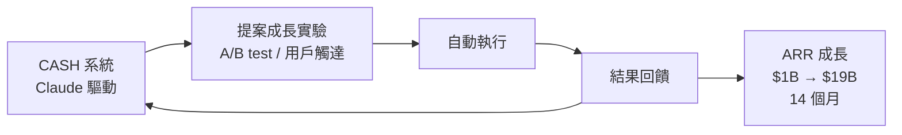

# AI Daily Digest — 2026-04-05

<!-- pipeline-generated:begin -->

## 🔥 今日 TOP 3
### 1. Anthropic 14 個月 ARR 從 $1B 躍升至 $19B 的成長策略
Anthropic Head of Growth Amol Avasare 公開揭露公司在 14 個月內將 ARR 從 $1B 成長至 $19B（年化成長率 228%）的核心方法：大膽投注高風險策略、刻意設計新用戶摩擦、嚴格現金流管理，以及內部 AI 系統 CASH 自動執行成長實驗。這是目前已知 B2B/B2C AI 公司中速度最快的 ARR 成長案例之一，且並非單純燒錢換增長。

CASH 系統的意義超越數字本身：Anthropic 以 Claude 驅動自家的 A/B 測試、用戶觸達與成長實驗，形成「產品即 GTM 基礎設施」的正反饋迴圈——每次成長實驗同時也是 Claude 能力的真實示範與驗證。相較傳統 SaaS 依賴大型人工成長團隊，這種 AI-native GTM 模式在邊際成本上具有結構性優勢，且會隨產品能力提升而自我強化。

下一步值得觀察：CASH 的自動化邊界在哪裡（哪些成長決策仍需人工介入）？Anthropic 是否會將類似框架開放給企業客戶作為成長自動化解決方案？對於正在規劃 AI agent 落地的公司，CASH 的「AI 提案 → 自動執行 → 結果回饋」循環可直接作為內部成長自動化流程的設計藍圖。

📖 [閱讀完整 insight](../10-insights/2026-04-05/inbox_71d82fd6.md) · 🔗 [原文連結](https://www.lennysnewsletter.com/p/anthropics-1b-to-19b-growth-run)
### 2. OpenClaw 工程主管管理工具三項目實戰驗證入門
文章作者以工程主管身份親身測試 OpenClaw，完成 3 個驗證項目，整理出工具的入門步驟與實務應用建議，是目前少見針對工程管理 AI 工具的第一手使用報告。作者特別強調工具對管理效率的具體提升，並提供可直接套用的入門流程。

OpenClaw 屬於 AI 時代工程管理工具的新興品類，聚焦工程主管日常管理場景。目前公開資訊有限，缺乏與同類工具（如 Lattice、Leapsome）的對比數據及大規模用戶回饋；作者的三項目實地測試提供了初步可信度，但尚不足以評估工具在企業規模下的成熟度與穩定性。

若您是工程主管且正在評估 AI 輔助管理工具，可跟進原文入門指南嘗試上手；短期建議持續觀察社群回饋，再決定是否投入較深的工作流程整合。特別值得追蹤的是工具在 performance review 或 team retrospective 等高頻場景下的實際表現。

📖 [閱讀完整 insight](../10-insights/2026-04-05/inbox_4981c17f.md) · 🔗 [原文連結](https://newsletter.eng-leadership.com/p/how-to-use-openclaw-as-an-engineering)

## 📚 分類摘要
### foundation_models
本日 Claude／Anthropic 最重要的訊號來自商業面：`inbox_71d82fd6` 揭示 Anthropic 在 14 個月內從 $1B ARR 成長至 $19B，年化成長率 228%，並透過內部 AI 系統 CASH 直接以 Claude 驅動公司的 GTM 機器——自動提案、執行、並回饋成長實驗結果。

這個模式的核心洞察是：AI 公司以自身產品驅動自己的成長，形成雙重價值——既降低 GTM 邊際成本，又持續累積真實高品質使用案例。結合刻意設計的 onboarding 摩擦（篩選高意圖用戶）與嚴格現金流紀律，這份成長數字背後的策略組合代表了一種可複製的 AI-native GTM 框架，值得產品與商業策略團隊深入研究。

## 🎯 專欄
### 🏢 企業導入 AI / 團隊實踐
- **[How to Use OpenClaw as an Engineering Leader](../10-insights/2026-04-05/inbox_4981c17f.md)**
  文章分享工程主管如何實際應用 OpenClaw 工具。作者親身驗證該工具，完成 3 個測試項目，整理入門步驟與實務應用要點，幫助工程領導者了解 OpenClaw 對提升管理效率的具體價值。
- **[Head of Growth (Anthropic): “Claude is growing itself at this point” | Amol Avasare](../10-insights/2026-04-05/inbox_71d82fd6.md)**
  Anthropic Head of Growth Amol Avasare 揭露公司在 14 個月內達成 $1B→$19B ARR 的成長關鍵：大膽投注、設計適度摩擦的新用戶體驗、深度專注、及現金流管理。最具啟發的是引入內部 AI 系統 CASH 來自動執行成長實驗——這本身就體現了 Claude 在複雜業務自動化上的實用性。從商業角度看，Anthropic
### 🎓 AI 使用技巧 / 心法
- **[How to Use OpenClaw as an Engineering Leader](../10-insights/2026-04-05/inbox_4981c17f.md)**
  文章分享工程主管如何實際應用 OpenClaw 工具。作者親身驗證該工具，完成 3 個測試項目，整理入門步驟與實務應用要點，幫助工程領導者了解 OpenClaw 對提升管理效率的具體價值。

## 💡 今日 Takeaway

_讀完今日所有內容後，可帶走的知識點_
### 1. 以自家 AI 系統自動執行成長實驗，產品本身成為最佳 GTM 基礎設施
當 AI 公司以自身產品執行 A/B 測試、用戶觸達等成長工作，每次實驗同時也是產品能力的真實示範，形成「成長即 demo」的正反饋迴圈，隨產品進步而自我強化。Anthropic 的 CASH 系統展示了這個架構的可行性：AI 提案 → 自動執行 → 結果回饋，在不大幅擴張人工成長團隊的前提下加速實驗速度。這個框架可套用到任何 AI-first 產品：盤點哪些成長環節（個性化郵件、分群觸達、文案 A/B）可由 AI agent 自動執行，以小規模試點確認自動化邊界後再逐步擴大。

_類型：pattern_

**參考來源**：
- [Head of Growth (Anthropic): “Claude is growing itself at this point” | Amol Avasare](../10-insights/2026-04-05/inbox_71d82fd6.md) · [原文](https://www.lennysnewsletter.com/p/anthropics-1b-to-19b-growth-run)
### 2. 刻意保留 onboarding 摩擦可篩選高意圖用戶，提升長期 LTV
反直覺的設計原則：不追求零摩擦 onboarding，而是在流程中刻意設置需要用戶主動投入的關卡，篩除低意圖的輕度用戶，確保留下的用戶有足夠動機深度使用產品。這在高複雜度、高單價的 AI 工具上尤其有效——真正的目標客群不怕學習曲線，過濾掉的是轉換率低的試用者。實務上，可在 onboarding 中加入「必須完成一個有意義任務才能繼續」的步驟，例如要求用戶輸入真實使用場景或完成首個工作流程設定，而非讓一切自動預填。

_類型：framework_

**參考來源**：
- [Head of Growth (Anthropic): “Claude is growing itself at this point” | Amol Avasare](../10-insights/2026-04-05/inbox_71d82fd6.md) · [原文](https://www.lennysnewsletter.com/p/anthropics-1b-to-19b-growth-run)

<!-- pipeline-generated:end -->

<!-- user-notes -->
<!-- Write your own notes below; pipeline never touches this section. -->