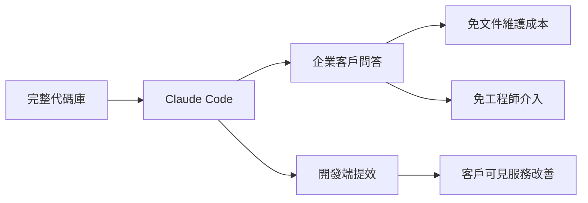

# AI Daily Digest — 2026-04-06

<!-- pipeline-generated:begin -->

## 🔥 今日 TOP 3
### 1. 紅杉資本：AI 億元融資從工具轉向成果驗證
紅杉資本觀察到超過 1 億美元的 AI 服務融資正在重新分配，投資標準已從「有沒有 AI 工具」轉向「AI 能否產出可量化的業務成果」。這一市場動態的轉變速度快於多數決策者的感知，而資本流動已先一步反映。

這個轉折點對企業和新創的意義在於：光有「AI 支援」的功能宣稱已不足夠，投資人與買家都開始要求具體可測的指標——節省了多少工程師時數、客戶滿意度提升了幾個百分點、成本降低幅度為何。缺乏這類成果指標的 AI 工具在融資與採購競爭中將處於明顯劣勢，淘汰機制已在運作中。

實務上，產品與業務團隊應立即梳理自家 AI 功能的成果指標，建立清晰的 ROI 敘事。若現有功能難以量化成果，需重新考慮功能優先順序；若已有可量化資料，應將其前置為核心溝通材料而非留在附錄。

📖 [閱讀完整 insight](../10-insights/2026-04-06/inbox_c5acc7ec.md) · 🔗 [原文連結](https://darrentechtalk.substack.com/p/4ff)
### 2. Claude Code 全庫問答取代企業文件支援流程
Galileo 現場工程師 Al Chen 將整個代碼庫導入 Claude Code，實現對 enterprise 客戶技術問題的即時精確回答，全程無需更新文件或工程師介入。這是 AI-powered codebase Q&A 在真實生產環境中首次有姓名的落地案例，標誌著這一應用模式從實驗進入實用。

傳統企業技術支援依賴三個昂貴節點：文件維護（高人工成本）、工程師 oncall（高機會成本）、等待回應（高客戶流失風險）。Claude Code + 完整代碼庫的組合同時打破這三點，客戶反應可見且即時，代表 AI 已在支援端、而非只在開發端創造結構性價值。

工程與客戶成功團隊可參考此模式評估：哪些重複性技術問題消耗最多工程師時間？哪些知識只存在於代碼而非文件中？這些場景正是 Claude Code 全代碼庫策略的優先切入點。

📖 [閱讀完整 insight](../10-insights/2026-04-06/inbox_faf12c63.md) · 🔗 [原文連結](https://www.lennysnewsletter.com/p/i-gave-claude-code-our-entire-codebase)
### 3. Claude Code 全庫上下文策略雙案例驗證
Lenny's Podcast 的開發者案例顯示，將完整代碼庫提供給 Claude Code 分析後，直接帶來客戶端可感知的服務品質提升。此案例與 Galileo 的 Al Chen 案例形成雙重佐證，共同指向同一結論：廣泛的代碼上下文是 AI 助手從「有幫助」到「真正驅動成果」的關鍵變數。

相較於只提供片段代碼或依賴文件的傳統使用方式，全代碼庫上下文讓 AI 能理解跨模組依賴關係、隱性設計決策，以及無法從單一文件察覺的模式。這不是 Claude Code 功能本身的突破，而是使用策略（usage pattern）的突破——兩個案例均由不同背景的從業者獨立發現並收斂至相同方法，強化此策略的可複製性。

工程師可將「全代碼庫上下文」視為可系統化的策略：建立代碼庫導入的標準流程、追蹤使用前後的問題解決速度與準確率，以量化資料在組織內驗證並推廣此模式。

📖 [閱讀完整 insight](../10-insights/2026-04-06/inbox_1ff55595.md) · 🔗 [原文連結](https://www.lennysnewsletter.com/p/this-week-on-how-i-ai-i-gave-claude)

## 📚 分類摘要
### foundation_models
今日最具衝擊力的 foundation models 內容集中於 Claude Code 的企業實戰應用，出現兩則互補案例：inbox_1ff55595（Lenny's Podcast 開發者）與 inbox_faf12c63（Galileo 現場工程師 Al Chen）。兩者共同驗證「全代碼庫上下文」策略的實際效果——AI 助手不再只是加速開發，而是直接替代傳統文件驅動的支援流程，在客戶端產生可見成果。兩案例高度相似但來源完全獨立，強化此策略的可複製性。

GitHub Copilot SDK 新增 C# 正式支援（inbox_71384b93），微軟持續擴大 Copilot 語言生態覆蓋，同期涵蓋 C# Source Generators 整合與觀察者設計模式實踐。相對於 Claude Code 的企業落地案例，此更新屬基礎設施完善層面，短期商業衝擊有限，但對 C# 開發者社群的長期 AI 工具滲透有持續意義。
### agents
今日最值得關注的 agents 相關訊號來自紅杉資本（inbox_c5acc7ec）：超過 1 億美元的 AI 服務融資正在重新分配，驗證標準從「工具能力展示」轉向「業務成果量化」，且轉變速度超出多數市場參與者的預期。這對所有正在開發 AI Agent 產品或服務的團隊構成直接的市場訊號——能舉證 ROI 的 Agent 服務將優先獲得資本，反之則面臨淘汰壓力，市場競爭已進入成熟期淘汰邏輯。

Web3 Matters 第 176 期（inbox_77406203）亦觸及 AI Agents 在金融服務中的商業潛力，以及加密洗錢如何透過 3,800 美元盲盒機制繞過現有監管工具。前者指向自主代理在支付與交易場景的新商機，後者則揭示 AI 工具的雙面性——自動化能力在合規與不合規的應用場景中同步演進，對現有監管偵測框架構成結構性挑戰。

整合今日兩則訊號來看，2026 年 AI Agent 的核心競爭維度不再是技術能力的展示，而是能否在真實業務場景中交付並量化可信的業務成果。

## 🎯 專欄
### 🛠 Claude Code / Codex 新功能
- **[🎙️ This week on How I AI: I gave Claude Code our entire codebase. Our customers noticed.](../10-insights/2026-04-06/inbox_1ff55595.md)**
  Lenny's Podcast 節目「How I AI」介紹一位開發者將完整代碼庫提供給 Claude Code 進行分析與協助，結果在客戶端產生可感知的改進。此案例展示大規模代碼上下文環境下，AI 程式設計助手能夠驅動實質性的商業價值與使用者體驗提升。
- **[I gave Claude Code our entire codebase. Our customers noticed. | Al Chen (Galileo)](../10-insights/2026-04-06/inbox_faf12c63.md)**
  Galileo 現場工程師 Al Chen 分享實踐案例：將整個代碼庫導入 Claude Code，實現為企業客戶實時回答技術問題的能力，無需依賴文檔或工程師介入。此案例驗證了 Claude Code 在生產環境的應用價值——快速查詢複雜代碼庫並提供精確答案，大幅降低企業支持成本。客戶對這一新的交互方式有顯著反應，標誌著 AI-powered codebas
### 🏢 企業導入 AI / 團隊實踐
- **[Industrial policy for the Intelligence Age](../10-insights/2026-04-06/inbox_251e9be8.md)**
  OpenAI 發表關於『智能時代產業政策』的見解，提議以人為中心的政策框架。其核心主張包括：拓展 AI 教育和機會、確保 AI 收益廣泛共享、建立適應 AI 發展的彈性社會制度。該立場反映 OpenAI 對 AI 時代經濟不平等和制度適應的思考，呼籲政策制定者和社會各界協作應對。
- **[Observer Pattern, C# Source Generators, and GitHub Copilot SDK in C#](../10-insights/2026-04-06/inbox_71384b93.md)**
  2026 年 4 月開發週刊，涵蓋多個 C# 相關主題與工具生態。其中 GitHub Copilot SDK for C# 為本週重點之一，展示微軟持續擴展 Copilot 對多語言生態的支援。同時並涵蓋觀察者設計模式與 C# Source Generators 等開發工具的最新進展。
- **[I gave Claude Code our entire codebase. Our customers noticed. | Al Chen (Galileo)](../10-insights/2026-04-06/inbox_faf12c63.md)**
  Galileo 現場工程師 Al Chen 分享實踐案例：將整個代碼庫導入 Claude Code，實現為企業客戶實時回答技術問題的能力，無需依賴文檔或工程師介入。此案例驗證了 Claude Code 在生產環境的應用價值——快速查詢複雜代碼庫並提供精確答案，大幅降低企業支持成本。客戶對這一新的交互方式有顯著反應，標誌著 AI-powered codebas
- **[第 176 期](../10-insights/2026-04-06/inbox_77406203.md)**
  Web3Matters 第 176 期涵蓋多個 Web3 與金融交匯的議題。探討加密貨幣洗錢手法如何通過 3,800 美元盲盒機制規避現有監管檢測工具，分析 AI Agents 未來在金融服務中的商業機會，討論 Web3 公共財的發展方向。內容反映監管套利、自主代理商業化與去中心化金融的複雜交互。
### 🎓 AI 使用技巧 / 心法
- **[Observer Pattern, C# Source Generators, and GitHub Copilot SDK in C#](../10-insights/2026-04-06/inbox_71384b93.md)**
  2026 年 4 月開發週刊，涵蓋多個 C# 相關主題與工具生態。其中 GitHub Copilot SDK for C# 為本週重點之一，展示微軟持續擴展 Copilot 對多語言生態的支援。同時並涵蓋觀察者設計模式與 C# Source Generators 等開發工具的最新進展。
- **[第 176 期](../10-insights/2026-04-06/inbox_77406203.md)**
  Web3Matters 第 176 期涵蓋多個 Web3 與金融交匯的議題。探討加密貨幣洗錢手法如何通過 3,800 美元盲盒機制規避現有監管檢測工具，分析 AI Agents 未來在金融服務中的商業機會，討論 Web3 公共財的發展方向。內容反映監管套利、自主代理商業化與去中心化金融的複雜交互。
### ⛓️ 區塊鏈 / Web3
- **[🎙️ This week on How I AI: I gave Claude Code our entire codebase. Our customers noticed.](../10-insights/2026-04-06/inbox_1ff55595.md)**
  Lenny's Podcast 節目「How I AI」介紹一位開發者將完整代碼庫提供給 Claude Code 進行分析與協助，結果在客戶端產生可感知的改進。此案例展示大規模代碼上下文環境下，AI 程式設計助手能夠驅動實質性的商業價值與使用者體驗提升。
- **[I gave Claude Code our entire codebase. Our customers noticed. | Al Chen (Galileo)](../10-insights/2026-04-06/inbox_faf12c63.md)**
  Galileo 現場工程師 Al Chen 分享實踐案例：將整個代碼庫導入 Claude Code，實現為企業客戶實時回答技術問題的能力，無需依賴文檔或工程師介入。此案例驗證了 Claude Code 在生產環境的應用價值——快速查詢複雜代碼庫並提供精確答案，大幅降低企業支持成本。客戶對這一新的交互方式有顯著反應，標誌著 AI-powered codebas
- **[第 176 期](../10-insights/2026-04-06/inbox_77406203.md)**
  Web3Matters 第 176 期涵蓋多個 Web3 與金融交匯的議題。探討加密貨幣洗錢手法如何通過 3,800 美元盲盒機制規避現有監管檢測工具，分析 AI Agents 未來在金融服務中的商業機會，討論 Web3 公共財的發展方向。內容反映監管套利、自主代理商業化與去中心化金融的複雜交互。

## 💡 今日 Takeaway

_讀完今日所有內容後，可帶走的知識點_
### 1. 全代碼庫上下文可讓 AI 助手升格為企業知識引擎
當 AI 助手擁有完整代碼庫上下文（而非片段），它能理解跨模組依賴與隱性設計決策，回答只存在於代碼中、而非任何文件中的問題。Galileo 的案例具體展示這個策略如何取代傳統文件驅動的企業支援流程，消除文件維護成本與工程師介入需求。實務上，優先識別「知識存在於代碼但客戶需即時查詢」的場景，建立標準化的全庫導入流程即可複製此效果。

_類型：technique_

**參考來源**：
- [I gave Claude Code our entire codebase. Our customers noticed. | Al Chen (Galileo)](../10-insights/2026-04-06/inbox_faf12c63.md) · [原文](https://www.lennysnewsletter.com/p/i-gave-claude-code-our-entire-codebase)
- [🎙️ This week on How I AI: I gave Claude Code our entire codebase. Our customers noticed.](../10-insights/2026-04-06/inbox_1ff55595.md) · [原文](https://www.lennysnewsletter.com/p/this-week-on-how-i-ai-i-gave-claude)
### 2. AI 產品市場存活關鍵：成果可量化，而非功能可展示
紅杉資本觀察到的資本重分配揭示一個正在固化的商業法則：AI 產品的競爭地位愈來愈取決於能否提供可量化的業務成果，而非功能的技術先進性。這對應更廣泛的 SaaS 市場成熟規律——從功能競爭轉向 ROI 競爭，且一旦市場進入此階段，轉變往往比預期快。任何 AI 產品在設計初期就應內建成果追蹤機制，而非在融資或採購談判時才事後補充指標。

_類型：pattern_

**參考來源**：
- [紅杉資本報告分析：服務，是下一個軟體戰場](../10-insights/2026-04-06/inbox_c5acc7ec.md) · [原文](https://darrentechtalk.substack.com/p/4ff)

<!-- pipeline-generated:end -->

<!-- user-notes -->
<!-- Write your own notes below; pipeline never touches this section. -->