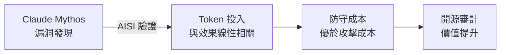
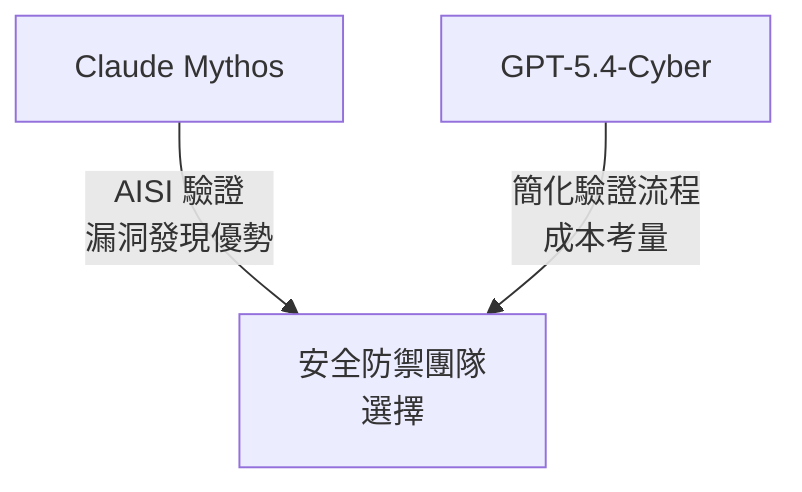

# AI Daily Digest — 2026-04-14

<!-- pipeline-generated:begin -->

## 🔥 今日 TOP 3
### 1. Claude Code v2.1.108 快取 TTL 與 Recap 功能上線
Claude Code v2.1.108 在日前發布，這是功能豐富的大版本，包含快取 TTL 控制、會話 recap 功能與 Skill 工具整合等核心改進。新增的 ENABLE_PROMPT_CACHING_1H 和 FORCE_PROMPT_CACHING_5M 環境變數讓使用者針對不同場景（Bedrock、Vertex、Foundry）調整提示快取時間，直接影響 API 成本與上下文連貫性。此外，內建的 recap 功能在重新進入會話時自動生成摘要，大幅改進長期協作體驗。與前一版本相比，此次更新更強調開發者的控制權與工作流靈活性。

實務上，開發者可透過調整 FORCE_PROMPT_CACHING_5M 進行激進的快取策略，降低重複查詢的成本；同時利用 recap 功能在隔日或長間隔後快速恢復上下文。這對需要持續進行多天代碼審查、架構設計或文件編寫的團隊特別有價值。

📖 [閱讀完整 insight](../10-insights/2026-04-14/inbox_9af0a8a9.md) · 🔗 [原文連結](https://github.com/anthropics/claude-code/releases/tag/v2.1.108)
### 2. Claude Mythos 安全評估：漏洞發現優於預期，改變開源審計經濟學
英國 AI Safety Institute 的獨立評估首次量化了 Claude Mythos 在網路安全漏洞發現中的優勢，驗證了投入更多 token 可線性提升審計成效。這一發現打破了傳統的安全審計經濟學——防守成本必須超過攻擊者的利用成本。該評估揭示了一個新的經濟激勵模型：當安全防禦的成本被多個開源社群使用者攤分時，整體價值倍增。相較於單一組織進行審計，社群共享的成本結構使開源專案的長期競爭力大幅提升。

對於安全研究團隊和開源維護者，這意味著可以考慮使用 Claude Mythos 進行代碼審計和漏洞尋找，將 AISI 驗證的效能數據作為投資決策的依據。同時，這也強化了 AI 在防禦性安全工作中的角色，而非單純的攻擊工具。

📖 [閱讀完整 insight](../10-insights/2026-04-14/inbox_66db491f.md) · 🔗 [原文連結](https://simonwillison.net/2026/Apr/14/cybersecurity-proof-of-work/#atom-everything)
### 3. OpenAI GPT-5.4-Cyber：推出專用模型與簡化身分驗證流程
OpenAI 推出針對防禦性網路安全任務微調的 GPT-5.4-Cyber，並擴展「Trusted Access for Cyber」計畫，容許防禦者透過簡化的政府身分驗證（由 Persona 服務商處理）快速獲得模型存取權。此舉直接回應了 Anthropic 的 Project Glasswing / Claude Mythos 在網安領域的領先地位。OpenAI 強調自身多年的網路安全工作經驗，惟最高級工具仍需額外審核，實質差異不大。

該舉措的實務意義在於降低了防禦者使用先進 AI 工具的摩擦力，加速了網路安全 AI 工具的普及。安全團隊現可在 Claude Mythos 和 GPT-5.4-Cyber 之間進行評估，並根據 AISI 等獨立驗證結果與實際使用成本做出選擇。這個競爭格局也預示著未來更多基礎模型的安全用途微調。

📖 [閱讀完整 insight](../10-insights/2026-04-14/inbox_e8616413.md) · 🔗 [原文連結](https://simonwillison.net/2026/Apr/14/trusted-access-openai/#atom-everything)

## 📚 分類摘要
### foundation_models.claude
Claude Code v2.1.108 大版本引入了提示快取 TTL 動態控制（ENABLE_PROMPT_CACHING_1H、FORCE_PROMPT_CACHING_5M）與 recap 會話摘要功能，允許開發者在不同場景（Bedrock、Vertex、Foundry）中調整快取策略，直接優化 API 成本與上下文連貫性。同時，Skill 工具整合讓模型自動發現內建命令（/init、/review、/security-review），進一步簡化開發流程。此次更新共包含 20 多項修復，涵蓋密鑰管理、會話復原、終端相容性等核心問題。

英國 AISI 獨立驗證了 Claude Mythos 在漏洞發現中的優異表現，確認投入 token 數與審計效果呈線性相關。該評估揭示了全新的安全經濟學模式：防守成本超過攻擊利用成本時，開源專案因審計成本被多方攤分而獲得長期競爭優勢。這改變了人們對 AI 在防禦性安全工作中角色的認知，從工具層面上升到戰略層面。

### foundation_models.gpt
OpenAI 推出 GPT-5.4-Cyber，這是針對防禦性網路安全任務微調的 GPT-5.4 變體，並擴展「Trusted Access for Cyber」計畫，透過政府身分驗證（由 Persona 服務商處理）簡化防禦者的模型存取流程。該舉措被視為對 Anthropic Project Glasswing / Claude Mythos 的直接回應，反映了業界對網路安全 AI 工具的重視。儘管 OpenAI 強調自身多年的網路安全工作經驗，但最高級工具仍需額外申請，實質上與簡化流程的差異有限。

此舉的競爭意義在於加速網路安全 AI 工具的民主化，防禦團隊可在 Claude Mythos 與 GPT-5.4-Cyber 間進行評估。根據 AISI 的獨立驗證數據，決策應基於實測效能與成本，而非單純的品牌信任。

## 🎯 專欄
### 🛠 Claude Code / Codex 新功能
- [v2.1.108](../10-insights/2026-04-14/inbox_9af0a8a9.md) — Claude Code v2.1.108 是功能豐富的大版本更新。引入環境變數 ENABLE_PROMPT_CACHING_1H 和 FORCE_PROMPT_CACHING_5M 讓使用者調整提示快取 TTL（支援 API key、Bed
- [v2.1.107](../10-insights/2026-04-14/inbox_165a3822.md) — Claude Code v2.1.107 改進長時間操作期間思考提示的顯示時機，讓使用者更快看到 extended-thinking 已啟動，減少等待期間的不確定感。
- [datasette PR #2689: Replace token-based CSRF with Sec-Fetch-Site header protection](../10-insights/2026-04-14/inbox_9ce7b755.md) — Datasette 框架更新了跨站請求偽造（CSRF）防護機制，從基於 Token 的方案改用 Sec-Fetch-Site 請求頭檢驗。這套方法參考 Go 1.25 及 Filippo Valsorda 的資安研究。新方案移除了模板中所有
### 🚀 Frontier 模型動態
- [v2.1.108](../10-insights/2026-04-14/inbox_9af0a8a9.md) — Claude Code v2.1.108 是功能豐富的大版本更新。引入環境變數 ENABLE_PROMPT_CACHING_1H 和 FORCE_PROMPT_CACHING_5M 讓使用者調整提示快取 TTL（支援 API key、Bed
- [v2.1.107](../10-insights/2026-04-14/inbox_165a3822.md) — Claude Code v2.1.107 改進長時間操作期間思考提示的顯示時機，讓使用者更快看到 extended-thinking 已啟動，減少等待期間的不確定感。
- [Trusted access for the next era of cyber defense](../10-insights/2026-04-14/inbox_04861960.md) — OpenAI 擴展「可信網路安全計畫」(Trusted Access for Cyber)，向經過篩選的防禦人員推出 GPT-5.4-Cyber 模型。該計畫進一步強化了安全防護措施，確保 AI 網路安全能力的負責任使用。擴展計畫反映了 O
- [Trusted access for the next era of cyber defense](../10-insights/2026-04-14/inbox_e8616413.md) — OpenAI 推出 GPT-5.4-Cyber，這是針對防禦性網路安全任務微調的 GPT-5.4 變體。同時擴展二月啟動的「Trusted Access for Cyber」計畫，用戶可透過政府核發身分證件驗證（由 Persona 服務商處
- [Cybersecurity Looks Like Proof of Work Now](../10-insights/2026-04-14/inbox_66db491f.md) — 英國 AI Safety Institute（AISI）獨立評估發現 Claude Mythos 在發現安全漏洞方面效能優異。評估報告顯示消費的 token 數越多、審計成效越好，呈現線性相關。評論家 Drew Breunig 指出這揭露了
### 🔐 AI 安全 / 濫用
- [v2.1.108](../10-insights/2026-04-14/inbox_9af0a8a9.md) — Claude Code v2.1.108 是功能豐富的大版本更新。引入環境變數 ENABLE_PROMPT_CACHING_1H 和 FORCE_PROMPT_CACHING_5M 讓使用者調整提示快取 TTL（支援 API key、Bed
- [Cybersecurity Looks Like Proof of Work Now](../10-insights/2026-04-14/inbox_66db491f.md) — 英國 AI Safety Institute（AISI）獨立評估發現 Claude Mythos 在發現安全漏洞方面效能優異。評估報告顯示消費的 token 數越多、審計成效越好，呈現線性相關。評論家 Drew Breunig 指出這揭露了

<!-- pipeline-generated:end -->

<!-- user-notes -->
<!-- Write your own notes below; pipeline never touches this section. -->