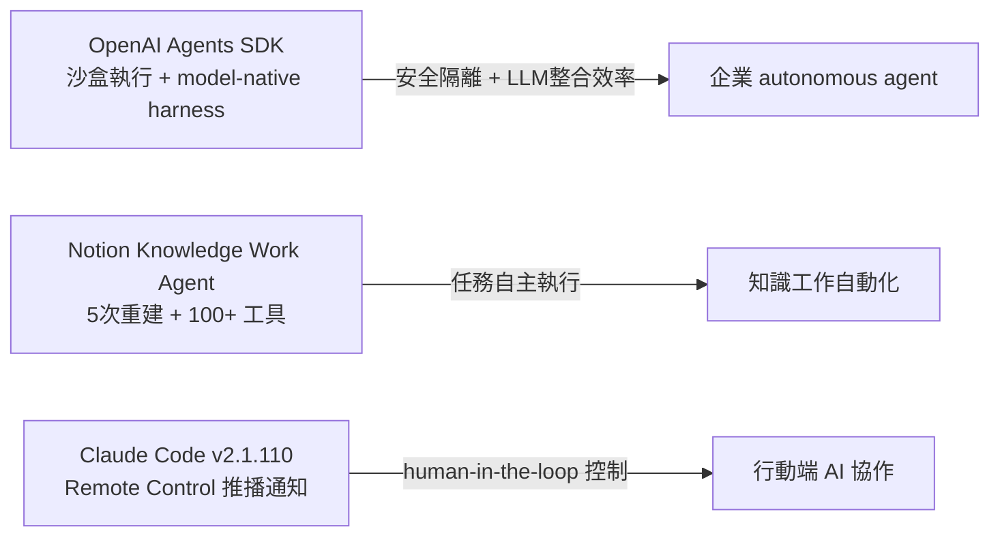

# AI Daily Digest — 2026-04-15

<!-- pipeline-generated:begin -->

## 🔥 今日 TOP 3
### 1. Gemini 3.1 Flash TTS：結構化提示驅動精細語音生成
Google 於 2026-04-15 正式發布 gemini-3.1-flash-tts-preview，可透過標準 Gemini API 呼叫。開發者可在提示中撰寫多層次結構化描述——包含 AUDIO PROFILE（角色個人檔案）、THE SCENE（場景設定）、DIRECTOR'S NOTES（聲調風格）、SAMPLE CONTEXT（情境說明）——並在同一次請求中定義多個角色、各自指定口音，模型據此生成差異化語音；已驗證倫敦、紐卡斯爾、德文郡等英國區域口音的可區分性。

相較於傳統 TTS 僅能調整語速與音量，此模型將控制層次從「調參」提升到「寫劇本」，口音、情感曲線、節奏風格均可透過自然語言精確指定。novelty=5 的核心在於「描述 → 生成」範式首次被大廠以 API 形式正式驗證，這不是語音克隆，而是 prompt-driven expressive TTS 的工程可行性確認，拉大了與參數化 TTS 方案的體驗差距。

短期可透過 Simon Willison 開發的網頁 UI 或 API 測試多角色對話場景；中期需關注多語言支援（目前以英語為主）、商業授權條款與 audio-only 輸出限制是否鬆綁；AUDIO PROFILE + DIRECTOR'S NOTES 的提示結構值得整理為可複用的工程資產。

📖 [閱讀完整 insight](../10-insights/2026-04-15/inbox_5a5cf9c8.md) · 🔗 [原文連結](https://simonwillison.net/2026/Apr/15/gemini-31-flash-tts/#atom-everything)
### 2. Notion 正式推出知識工作 AI Agent，歷經 5 次重建與百項工具迭代
Notion 聯合創辦人 Simon Last 與 AI 負責人 Sarah Sachs 公開披露，Notion 已正式推出知識工作 AI 智能體，是繼多次重大重建之後、累積超過 100 項工具開發後才確立的產品形態。訪談中同時揭露了 MCP 與 CLI 在工具鏈設計上的取捨權衡，以及「軟體工廠」（Software Factory）未來演進方向的預判。

Notion 作為知識工作軟體的標誌性品牌，此次進入 AI agent 領域代表該類產品從「AI 輔助功能」正式升級為「任務自主執行」。5 次重建的歷程透露出 agent 產品在易用性與功能完整性之間長期存在的張力；百項工具迭代顯示 agent 工具鏈的廣度需求遠超早期預期，MCP vs. CLI 的選擇框架對工具鏈設計者具備直接參考價值。

值得密切追蹤：Notion AI agent 在文件自動生成、跨資料整合等高頻任務上的實際完成率與留存表現；以及 Notion 最終在 MCP 與 CLI 間的落地選擇，可作為同類產品安全性與靈活性平衡策略的參照案例。

📖 [閱讀完整 insight](../10-insights/2026-04-15/inbox_d08a3e9a.md) · 🔗 [原文連結](https://www.latent.space/p/notion)
### 3. OpenAI Agents SDK 新增沙盒執行與模型原生工作層
OpenAI 為 Agents SDK 發布重要更新，引入原生沙盒執行環境（sandbox execution）與模型原生工作層（model-native harness），支援跨文件與工具的長時間運行代理工作流，降低企業構建複雜自動化流程的技術門檻。

沙盒隔離解決了 autonomous agent 部署中的安全邊界問題，是企業生產環境落地的關鍵前提；model-native harness 縮短了 LLM 與代理執行層之間的整合距離，直接降低工程複雜度。相較於此前需開發者自行搭建隔離層，官方原生支援意味著安全責任部分轉移至 SDK 維護者，這對中小型工程團隊尤具意義。

下一步需評估沙盒執行環境的性能開銷與定價影響；關注 model-native harness 在多 LLM 異構架構中的可移植性；以及 OpenAI 是否會對沙盒環境設定更細粒度的資源配額控制，這將直接影響企業合規採用的可行性。

📖 [閱讀完整 insight](../10-insights/2026-04-15/inbox_ac987042.md) · 🔗 [原文連結](https://openai.com/index/the-next-evolution-of-the-agents-sdk)

## 📚 分類摘要
### foundation_models
本日 foundation_models 焦點集中在語音生成領域，由 Google DeepMind 帶來兩則相互補充的 Gemini 3.1 Flash TTS 報導。inbox_5a5cf9c8 提供最完整的技術細節：模型 ID 為 `gemini-3.1-flash-tts-preview`，透過標準 Gemini API 呼叫，輸出限定為音訊格式；核心能力在於支援 AUDIO PROFILE、THE SCENE、DIRECTOR'S NOTES、SAMPLE CONTEXT 多層次結構化提示控制，已驗證倫敦、紐卡斯爾、德文郡等英國區域口音可區分性，並可在單次請求中定義多角色、各自指定口音與情感風格。inbox_ab17e698 則從 granular audio tags 角度補充，強調此功能拓展了 TTS 在多元應用場景下的靈活性。

這次發布的技術突破在於將 TTS 控制範式從參數調整（速率、音量）升級為語言描述（角色背景、場景情境、聲學風格），novelty=5 在今日所有 insights 中最高。目前已知限制是輸出格式限於音訊，多語言支援與商業授權細節尚待 Google 正式公告。Simon Willison 開發的網頁版工具（inbox_294b60ca）提供無需撰寫 API 代碼的快速試用入口，適合快速評估應用場景可行性。
### agents
代理工具鏈在今日出現三個來自不同主體的重要進展，共同指向 agent 基礎設施的快速成熟。OpenAI Agents SDK（inbox_ac987042）新增原生沙盒執行環境與 model-native harness，沙盒解決代理安全邊界問題，harness 降低 LLM 整合複雜度，雙重加固使企業生產環境部署 autonomous agent 的可行性顯著提升。Notion（inbox_d08a3e9a）正式推出知識工作 AI 智能體，聯合創辦人揭露歷經 5 次重建、逾 100 項工具迭代的產品演化歷程，並分享 MCP vs. CLI 工具鏈選型思考框架與「軟體工廠」願景。

Claude Code v2.1.110（inbox_5357f42a）則在 human-in-the-loop 控制面推進：推播通知工具讓 Remote Control 行動客戶端可接收 Claude 主動推播；新增 /tui 無閃爍全屏渲染模式、/focus 焦點視圖；Remote Control 擴展支援 /autocompact、/context、/exit、/reload-plugins 等控制指令，並修復 MCP 伺服器斷線導致的無限掛起等 25+ 問題。三者方向各異：OpenAI 強化執行層安全性，Notion 拓展知識工作應用廣度，Anthropic 深化人機協作控制介面。

## 🎯 專欄
### 🛠 Claude Code / Codex 新功能
- [v2.1.110](../10-insights/2026-04-15/inbox_5357f42a.md) — Claude Code v2.1.110 於 2026 年 4 月 15 日發布，推出 /tui 指令與無閃爍全屏渲染模式。Ctrl+O 現僅切換逐字稿詳細度，焦點檢視由新 /focus 指令控制。新增推播通知工具支援 Remote Con
- [v2.1.109](../10-insights/2026-04-15/inbox_2efa6f4f.md) — Claude Code v2.1.109 改進了 extended-thinking 指示器的視覺回饋，加入旋轉進度提示。這是小規模 UI 優化，幫助使用者在長時間操作期間更清楚地看到系統正在思考。
### 🏢 企業導入 AI / 團隊實踐
- [v2.1.110](../10-insights/2026-04-15/inbox_5357f42a.md) — Claude Code v2.1.110 於 2026 年 4 月 15 日發布，推出 /tui 指令與無閃爍全屏渲染模式。Ctrl+O 現僅切換逐字稿詳細度，焦點檢視由新 /focus 指令控制。新增推播通知工具支援 Remote Con
- [The next evolution of the Agents SDK](../10-insights/2026-04-15/inbox_ac987042.md) — OpenAI 發佈 Agents SDK 的重要更新版本，新增原生沙盒執行和模型原生工作層。開發者可利用這些新功能構建安全的、長時間運行的智能代理，跨越文件和工具進行操作。沙盒執行環境保證了代理程式的安全隔離，防止潛在的系統干擾。模型原生工
- [Quoting Kyle Kingsbury](../10-insights/2026-04-15/inbox_23024a24.md) — Kyle Kingsbury 在長文《AI 的未來是謊言？新工作》中提出「肉盾」職位新概念。所謂「肉盾」是被明確或隱含僱用來對自動化 ML 系統決策承擔責任的人類。根據 Kingsbury 的分析，責任歸屬有四種模式：其一，Meta 模式的
- [Notion’s Token Town: 5 Rebuilds, 100+ Tools, MCP vs CLIs and the Software Factory Future — Simon Last &amp; Sarah Sachs of Notion](../10-insights/2026-04-15/inbox_d08a3e9a.md) — Notion 聯合創辦人 Simon Last 與 AI 負責人 Sarah Sachs 分享 Notion 的發展歷程：經歷 5 次重大重建、累積 100+ 項工具開發，並探討 MCP 與 CLI 在 AI 工具中的定位。Notion 終
### 🎓 AI 使用技巧 / 心法
- [v2.1.110](../10-insights/2026-04-15/inbox_5357f42a.md) — Claude Code v2.1.110 於 2026 年 4 月 15 日發布，推出 /tui 指令與無閃爍全屏渲染模式。Ctrl+O 現僅切換逐字稿詳細度，焦點檢視由新 /focus 指令控制。新增推播通知工具支援 Remote Con
- [datasette 1.0a27](../10-insights/2026-04-15/inbox_8b39ac85.md) — Datasette 1.0a27 推出多項重大變更。首先摒棄 Django 風格的 CSRF 表單令牌，改用現代瀏覽器標頭方式進行 CSRF 防護，參考 Filippo Valsorda 的相關說明。其次新增 RenameTableEven

<!-- pipeline-generated:end -->

<!-- user-notes -->
<!-- Write your own notes below; pipeline never touches this section. -->