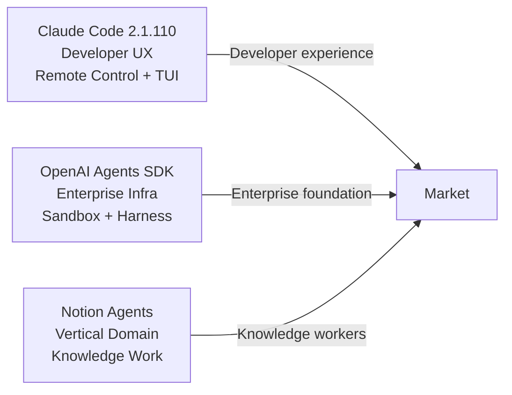
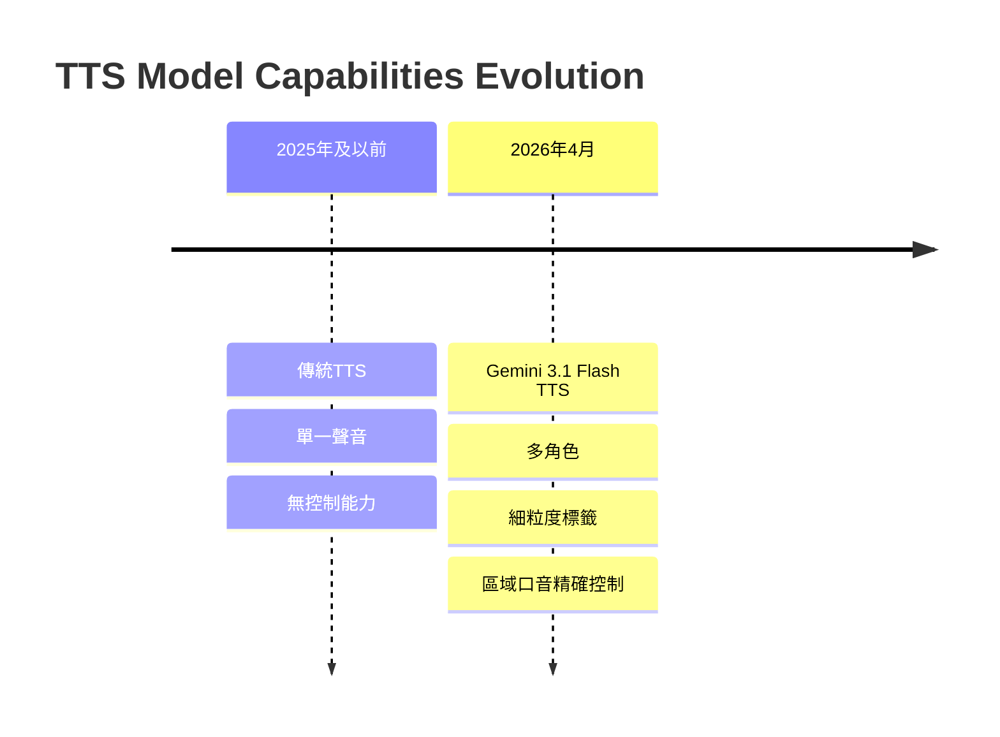

# AI Daily Digest — 2026-04-15

<!-- pipeline-generated:begin -->

## 🔥 今日 TOP 3
### 1. Google Gemini 3.1 Flash TTS 精細聲音控制突破
Google 於 4 月 15 日發布 Gemini 3.1 Flash TTS 模型，首次支援細粒度音訊標籤（granular audio tags）。開發者可透過結構化提示詳細描述角色檔案、口音、聲調等參數，模型據此生成符合要求的語音。

這是文字轉語音領域的重大突破。傳統 TTS 輸出單調無感，Gemini 3.1 Flash TTS 支援多角色對話與區域口音差異（倫敦、紐卡斯爾、德文郡等），首次實現表現力 AI 語音的精細控制，遠超前一代方案。

開發者可立即用於虛擬助手、有聲書、遊戲配音等場景。關鍵觀察點是多角色穩定性與口音精確度能否在實際部署中維持，以及應用層如何利用新能力降低內容成本。

📖 [閱讀完整 insight](../10-insights/2026-04-15/inbox_5a5cf9c8.md) · 🔗 [原文連結](https://simonwillison.net/2026/Apr/15/gemini-31-flash-tts/#atom-everything)
### 2. Notion 正式推出知識工作 AI 智能體
Notion 聯合創辦人宣布推出知識工作 AI 智能體，這是經過 5 次重建、100+ 工具開發後的重要產品發布。標誌著 Notion 從協作文檔工具進化為 AI 驅動知識系統的戰略轉型。

相比 Claude Code、OpenAI Agents 等通用框架，Notion 智能體針對知識工作場景深度優化，能理解並操作文檔、資料庫、協作流程。填補通用框架與垂直應用的空隙，對知識工作者吸引力將遠超通用方案。

觀察重點包括：Notion 在 MCP vs CLI 的架構選擇、與其他 agents 框架的互操作性，以及能否成為企業知識自動化的標準平台。Simon Last 的分享涵蓋 Software Factory 演進，值得深入了解。

📖 [閱讀完整 insight](../10-insights/2026-04-15/inbox_d08a3e9a.md) · 🔗 [原文連結](https://www.latent.space/p/notion)
### 3. OpenAI Agents SDK 推出原生沙盒與工作層
OpenAI 更新 Agents SDK，新增原生沙盒執行環境與模型原生工作層。沙盒隔離確保代理安全執行，模型原生工作層優化 LLM 與代理的互動效率，減少 token 開銷。

這項更新顯著降低企業自動化工作流程的開發門檻。過去需自行實現隔離邏輯，現在可直接利用 SDK 原生功能，支援跨文件與工具的長時間運行代理，適用複雜多步驟場景。

下一步觀察沙盒隔離的性能開銷、模型原生工作層與其他 agents 框架的競爭態勢、企業在安全與性能間的權衡決策。

📖 [閱讀完整 insight](../10-insights/2026-04-15/inbox_ac987042.md) · 🔗 [原文連結](https://openai.com/index/the-next-evolution-of-the-agents-sdk)

## 📚 分類摘要
### agents
Claude Code v2.1.110 強化 Remote Control 客戶端支援，推出 /tui 無閃爍全屏渲染、推播通知工具與遠端控制指令擴展（/autocompact、/context、/exit、/reload-plugins），專注開發者工作流體驗。OpenAI Agents SDK 推出原生沙盒執行環境與模型原生工作層，聚焦企業級長時間運行代理。Notion 知識工作 AI 智能體針對協作文檔、資料庫與工作流場景深度優化。

三者形成分層生態：Claude Code 是開發者工具體驗，OpenAI SDK 提供企業基礎設施，Notion 主打垂直領域應用。未來競爭焦點將在互操作性標準（MCP）與框架間的生態整合能力。

### foundation_models
Google Gemini 3.1 Flash TTS 於 4 月 15 日發布，引入細粒度音訊標籤允許開發者透過結構化提示（包含 AUDIO PROFILE、THE SCENE、DIRECTOR'S NOTES 等多層次描述）精確控制語音表現。支援多角色對話模式與區域口音差異化，已驗證倫敦、紐卡斯爾、德文郡等英國方言的精確生成。

相比傳統 TTS 的『單一聲音』限制，此版本實現表現力 AI 語音的精細控制，為文字轉語音領域帶來突破。開發者可透過標準 Gemini API 呼叫（模型 ID：gemini-3.1-flash-tts-preview），Simon Willison 開發的網頁工具（tools.simonwillison.net/gemini-flash-tts）進一步降低試驗門檻。

此次發布拓展了 TTS 在遊戲配音、虛擬助手、有聲書等多域應用的潛力。應用層需驗證多角色穩定性與口音精確度在實際生產環境的表現。

### infra
Datasette 1.0a27 推出多項重大變更強化安全性與開發體驗。摒棄 Django 風格 CSRF 表單令牌，改用現代瀏覽器標頭防護方式，參考 Filippo Valsorda 的標準做法。新增 RenameTableEvent 事件支援表格重新命名通知，datasette.client 新增 actor= 參數啟用身份模擬測試，Database(is_temp_disk=True) 選項改進臨時資料庫並解決記憶體死鎖問題。

相應地，datasette-export-database 發布 0.3a1 版本以相容 CSRF 機制變更，移除對已棄用 ds_csrftoken cookie 的依賴。Datasette 1.0a27 同時在 API 一致性精進，/upsert API 拒絕空主鍵值提升資料完整性，/database.json 端點新增 "ok": true 鍵確保端點一致性，call_with_supported_arguments() 列為公開 API，確保長期相容性與開發者文檔完整。

## 🎯 專欄
### 🛠 Claude Code / Codex 新功能
- [v2.1.110](../10-insights/2026-04-15/inbox_5357f42a.md) — Claude Code v2.1.110 於 2026 年 4 月 15 日發布，推出 /tui 指令與無閃爍全屏渲染模式。Ctrl+O 現僅切換逐字稿詳細度，焦點檢視由新 /focus 指令控制。新增推播通知工具支援 Remote Con
- [v2.1.109](../10-insights/2026-04-15/inbox_2efa6f4f.md) — Claude Code v2.1.109 改進了 extended-thinking 指示器的視覺回饋，加入旋轉進度提示。這是小規模 UI 優化，幫助使用者在長時間操作期間更清楚地看到系統正在思考。
### 🚀 Frontier 模型動態
- [v2.1.109](../10-insights/2026-04-15/inbox_2efa6f4f.md) — Claude Code v2.1.109 改進了 extended-thinking 指示器的視覺回饋，加入旋轉進度提示。這是小規模 UI 優化，幫助使用者在長時間操作期間更清楚地看到系統正在思考。
### 🔐 AI 安全 / 濫用
_（今日無相關內容）_

<!-- pipeline-generated:end -->

<!-- user-notes -->
<!-- Write your own notes below; pipeline never touches this section. -->