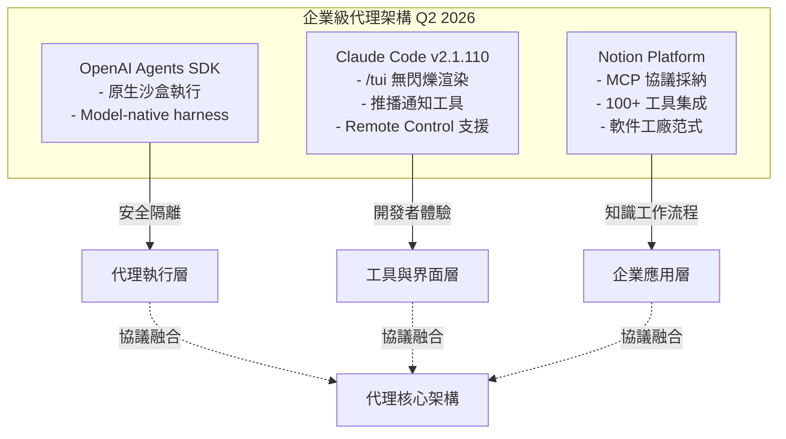

# AI Daily Digest — 2026-04-15

<!-- pipeline-generated:begin -->

## 🔥 今日 TOP 3
### 1. Notion 重建知識工作 AI 代理架構
Notion 聯合創始人 Simon Last 與 AI 主管 Sarah Sachs 深度討論知識工作 AI 代理的未來，Notion 經歷 5 次重大重建、集成 100+ 工具，並採用 MCP（Model Context Protocol）與 CLI 混合方案，勾勒出「軟件工廠」的架構願景。

這反映了企業級知識工作平台如何從基礎層級重新設計以原生支持 AI 代理。MCP 的選擇標示著協議層統一的可能性，相比點對點工具集成，MCP 建立了可擴展的標準化接口。對標 Claude Code、Anthropic SDK 生態，Notion 的實踐驗證了 MCP 在複雜應用生態中的生產可行性，為業界標準化樹立了範例。

關注 Notion + Anthropic 的進一步合作方向、MCP 標準化進度、以及其他企業平台（Slack、Figma、Linear）對 MCP 的採納時間表，這將直接影響 2026 下半年代理工具生態的收斂方向。

📖 [閱讀完整 insight](../10-insights/2026-04-15/inbox_d08a3e9a.md) · 🔗 [原文連結](https://www.latent.space/p/notion)
### 2. OpenAI 代理 SDK 新增原生沙盒與協議層優化
OpenAI 發佈 Agents SDK 重要版本更新，新增原生沙盒執行環境（native sandbox execution）與模型原生工作層（model-native harness），支持長時間運行、跨文件與工具操作的智能代理。

沙盒執行是企業 AI 部署的必須特性，實現了代理與宿主系統的安全隔離，防止惡意或誤操作導致的系統干擾。模型原生工作層標示著 LLM 代理已從「包裝層」升級到協議原生層，類似 Claude Haiku 中的 tool use 優化，大幅提升了代理與 LLM 互動的效率。此舉降低了企業構建複雜自動化工作流的技術門檻，同時解決了安全合規的關鍵瓶頸。

下一步評估重點：對標 Anthropic SDK 中的 Managed Agents，深入理解沙盒隔離的細粒度配置（文件系統、網絡、API 限額）、成本模型、以及多代理協調的可能性，預期年內會看到企業在生產環境中大規模部署 OpenAI Agents。

📖 [閱讀完整 insight](../10-insights/2026-04-15/inbox_ac987042.md) · 🔗 [原文連結](https://openai.com/index/the-next-evolution-of-the-agents-sdk)
### 3. Google Gemini 3.1 Flash TTS 實現聲音特徵細粒度控制
Google 發佈 Gemini 3.1 Flash TTS 模型（API 模型 ID：`gemini-3.1-flash-tts-preview`），支持極細粒度的 prompt 工程，可精確指導 AI 語音的表達方式、情感基調、口音特性，同一段腳本可精確生成倫敦 Brixton、Newcastle、Devon 等不同英倫口音的音頻，並支持多說話者對話模式。

相比傳統 TTS 系統，Gemini 3.1 Flash TTS 將控制維度從「文本內容」升級到「聲音特徵空間」（說話者身份、口音、語調、速度、動態），驗證了 LLM 對細微音頻差異的建模深度。這標示著 AI 聲音合成的代際轉變，從通用合成向定製化聲音生成演進，相對於前代模型，表達力提升一個數量級。

實務應用方向：測試音頻特徵提示詞的跨語言遷移能力（英文模型能否應用於中文口音控制）、與視頻製作工具（DaVinci Resolve、Runway、Synthesia）的整合進度、成本效益相對 11Labs / ElevenLabs 等專業 TTS 服務的對標，預期會在媒體內容生成與客服機器人領域帶來新的應用浪潮。

📖 [閱讀完整 insight](../10-insights/2026-04-15/inbox_5a5cf9c8.md) · 🔗 [原文連結](https://simonwillison.net/2026/Apr/15/gemini-31-flash-tts/#atom-everything)

## 📚 分類摘要
### agents
Agents 生態在 2026 年四月達到架構融合點。OpenAI Agents SDK 引入原生沙盒執行與模型原生工作層（model-native harness），建立了企業級代理安全部署的基線標準。同期，Claude Code v2.1.110 擴展了代理與用戶的互動通道，推出 `/tui` 無閃爍全屏渲染、推播通知工具（支持 Remote Control 行動客戶端）及遠程控制支援，使開發者能構建更多元的代理界面。Notion 在知識工作領域的架構實踐最為深遠：經 5 次重大重建、集成 100+ 工具、採納 MCP 與 CLI 混合方案，Notion 正在構造「軟件工廠」（software factory）範式，驗證了 MCP 協議在複雜應用生態中的生產可行性。

### foundation_models
Google Gemini 3.1 Flash TTS 推進了文字轉語音從「內容層」到「風格層」的跨越。Gemini 3.1 Flash TTS（模型 ID：`gemini-3.1-flash-tts-preview`）支持極細粒度的 prompt 工程，可精確控制口音、語調、速度、動態等聲音特徵，同一腳本可生成倫敦 Brixton、Newcastle、Devon 等多種英倫口音的精確音頻輸出，並支持多說話者對話模式，驗證了 LLM 對音頻「風格空間」的深度建模。Claude Code 方面則專注於開發者體驗的微觀優化，v2.1.109 改進了 extended-thinking 指示器的旋轉進度視覺反饋，雖為小規模改動，卻反映了 Claude 在長時間推理操作下的思考可視化方向。開源模型生態方面，社區對 2026 年中的發展持觀察態度，關注開源與閉源模型性能差距的演變方向、影響關鍵因素與生態投資策略，但尚無重大發佈或技術突破帶動該領域進展。

## 🎯 專欄
### 🛠 Claude Code / Codex 新功能
- [v2.1.110](../10-insights/2026-04-15/inbox_5357f42a.md) — Claude Code v2.1.110 於 2026 年 4 月 15 日發布，推出 /tui 指令與無閃爍全屏渲染模式。Ctrl+O 現僅切換逐字稿詳細度，焦點檢視由新 /focus 指令控制。新增推播通知工具支援 Remote Con
- [v2.1.109](../10-insights/2026-04-15/inbox_2efa6f4f.md) — Claude Code v2.1.109 改進了 extended-thinking 指示器的視覺回饋，加入旋轉進度提示。這是小規模 UI 優化，幫助使用者在長時間操作期間更清楚地看到系統正在思考。
### 🚀 Frontier 模型動態
- [v2.1.109](../10-insights/2026-04-15/inbox_2efa6f4f.md) — Claude Code v2.1.109 改進了 extended-thinking 指示器的視覺回饋，加入旋轉進度提示。這是小規模 UI 優化，幫助使用者在長時間操作期間更清楚地看到系統正在思考。
- [Gemini 3.1 Flash TTS](../10-insights/2026-04-15/inbox_5a5cf9c8.md) — Google 發佈 Gemini 3.1 Flash TTS 文本轉語音模型，可透過 `gemini-3.1-flash-tts-preview` 模型 ID 經由標準 Gemini API 調用。該模型支持詳細的 prompt 工程，允許
- [My bets on open models, mid-2026](../10-insights/2026-04-15/inbox_6a4095f0.md) — 作者基於 2026 年中時點，發表對開源模型發展的預測與投資看法，特別關注開源與閉源模型性能差距的演變方向，並提出個人對該領域下一步發展的預期。
### 🔐 AI 安全 / 濫用
_（今日無相關內容）_

<!-- pipeline-generated:end -->

<!-- user-notes -->
<!-- Write your own notes below; pipeline never touches this section. -->