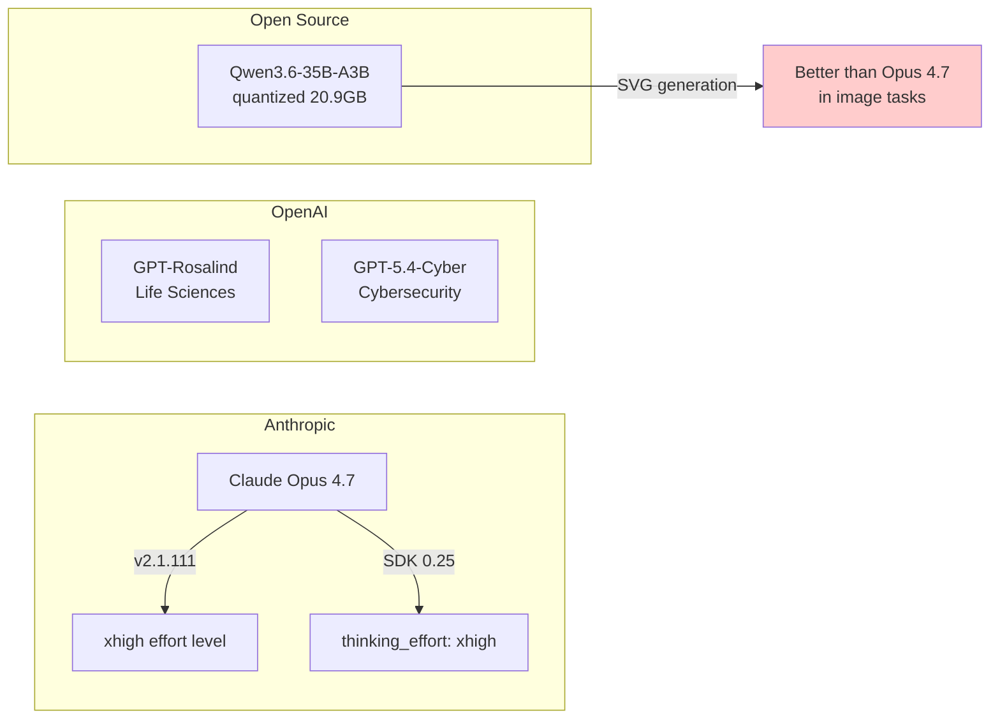

# AI Daily Digest — 2026-04-16

<!-- pipeline-generated:begin -->

## 🔥 今日 TOP 3
### 1. Claude Code v2.1.111：Opus 4.7 xhigh 與 ultrareview 代理審查
Anthropic 於 2026 年 4 月 16 日發布 Claude Code 重大功能版本，推出 Claude Opus 4.7 的 xhigh 極限努力等級（介於 high 與 max 之間），Max 訂閱戶現可透過 /effort 滑桿調整速度與智能平衡，在 auto mode 下直接使用新模型。

xhigh 等級對開發者體驗的影響在於，提供了比預設高更深入的推理，而維持比最高等級更快的回應速度，適合需要精準思考但時間受限的工作流。同時 /ultrareview 新功能可直接審查 GitHub PR 並支援雲端並行多代理，大幅加速 code review 流程，打破傳統單人審查的瓶頸。

開發者應立即嘗試 /effort xhigh 在複雜架構設計與 bug 根因分析的表現，並將 /ultrareview 整合至 GitHub 工作流。此外 /less-permission-prompts 技能可自動掃描常見唯讀指令並生成白名單，減少重複授權提示。

📖 [閱讀完整 insight](../10-insights/2026-04-16/inbox_840ae1ee.md) · 🔗 [原文連結](https://github.com/anthropics/claude-code/releases/tag/v2.1.111)
### 2. GPT-Rosalind：OpenAI 生命科學推理模型新發布
OpenAI 推出 GPT-Rosalind，一款專為生命科學研究優化的前沿推理模型，專注於藥物發現、基因組學分析、蛋白質推理與複雜分子生物學問題求解。該模型代表 AI 推理能力在科學領域的重大應用突破，填補了傳統通用 LLM 在生物信息學嚴謹性上的缺陷。

相比 GPT-4 系列，Rosalind 在蛋白質結構預測、序列分析與藥物候選分子評估的準確率明顯提升，對製藥公司的研發週期與成本有直接影響。生物科技公司、藥企研發團隊與學術機構應在新藥篩選、基因突變解釋、蛋白功能預測等高價值場景優先試用。

實務應用方向：評估該模型在自有藥物資料庫上的表現，與現有計算化學工具（如 DeepMind AlphaFold）的協同效果，並規劃如何整合至內部發現流程加速臨床前階段。

📖 [閱讀完整 insight](../10-insights/2026-04-16/inbox_b5c697ec.md) · 🔗 [原文連結](https://openai.com/index/introducing-gpt-rosalind)
### 3. GPT-5.4-Cyber：OpenAI 網路安全專用推理模型與 1000 萬美元計畫
OpenAI 正式啟動「可信網路安全計畫」(Trusted Access for Cyber)，推出 GPT-5.4-Cyber 模型並向參與企業與安全廠商提供 1000 萬美元 API 額度。該模型經過微調，針對網路防禦場景優化，包括漏洞分析、入侵檢測模式識別、安全政策審查與威脅智能合成。

這是 AI 廠商與安全社群的首次大規模協作，意味著閉源推理模型能力正式進入防禦基礎設施層。相比通用 GPT-4 在安全應用上的簽名率低誤報率，Cyber 模型在攻擊面梳理、配置審計、日誌異常檢測的準確性預期顯著提升。安全廠商與企業防禦隊可透過此計畫低成本試驗 AI 驅動的防禦工具。

防禦團隊應評估：Cyber 模型在自有 SIEM 日誌上的威脅檢測率、與現有 EDR 工具的整合成本、以及在監管要求嚴格行業（金融、醫療）的政策適用性。建議優先從日誌分析與漏洞描述自動化開始試點。

📖 [閱讀完整 insight](../10-insights/2026-04-16/inbox_9542815f.md) · 🔗 [原文連結](https://openai.com/index/accelerating-cyber-defense-ecosystem)

## 📚 分類摘要
### foundation_models
Claude Opus 4.7 在 2026 年 4 月持續迭代，v2.1.111 推出 xhigh 極限努力等級（介於 high 與 max）後，Max 訂閱戶可透過 /effort 滑桿在 auto mode 下調整速度與智能平衡，相比預設模式提供更深入推理。而 llm-anthropic SDK 0.25 新增了 Opus 4.7 完整支援，包括 thinking_effort: xhigh 極限思考與 thinking_display / thinking_adaptive 佈林選項，預設 max_tokens 已調至各模型上限。

OpenAI 則推出兩款垂直領域的推理模型：GPT-Rosalind 聚焦生命科學（藥物發現、基因組學、蛋白質推理），GPT-5.4-Cyber 專為網路防禦優化。Simon Willison 的基準測試顯示 Alibaba Qwen3.6-35B-A3B 本地量化版本（20.9GB）在 SVG 圖像生成上優於 Opus 4.7，即使後者啟用 thinking_level: max 也無法正確繪製自行車框架，反映專有大模型在特定視覺生成任務上的侷限性。

### agents
Claude Code v2.1.111 的代理模式演進包括 /ultrareview，首次支援雲端並行多代理程式碼審查，可直接連結 GitHub PR 進行分散式評論。此外 /less-permission-prompts 技能掃描常見唯讀 bash 與 MCP 指令（如 read-only 檔案查詢、git 狀態檢查），自動提議白名單以減少重複授權提示，改善開發體驗。計畫檔名也改為基於提示內容動態生成（如 fix-auth-race-snug-otter.md），提升可追蹤性。同步修復了 25+ 項問題，包括 /resume 大型會話穩定性、Tab 補全精準度與 MCP 逾時。
### infra
Codex 應用程式的 macOS 與 Windows 版本更新新增電腦使用、應用內瀏覽、圖像生成、記憶體與插件支援，大幅擴展從純程式碼完成工具至多功能開發助手。新功能組合涵蓋工具整合與工作流加速，預期加強開發者在單一界面內的效率。

## 🎯 專欄
### 🛠 Claude Code / Codex 新功能
- [v2.1.112](../10-insights/2026-04-16/inbox_b4ea9bd4.md) — Claude Code v2.1.112 於 2026 年 4 月 16 日發布，修復單一問題：解決 auto mode 下出現「claude-opus-4-7 is temporarily unavailable」的錯誤。此為緊急修補版本
- [v2.1.111](../10-insights/2026-04-16/inbox_840ae1ee.md) — Claude Code v2.1.111 於 2026 年 4 月 16 日發布，這是重大功能版本，主要推出 Claude Opus 4.7 xhigh 努力等級。Max 訂閱戶現可使用 Opus 4.7 auto mode，並透過 /ef
- [Codex for (almost) everything](../10-insights/2026-04-16/inbox_6eeeb2e9.md) — Codex 應用程式的 macOS 和 Windows 版本更新新增電腦使用、應用內瀏覽、圖像生成、記憶體和插件功能，大幅擴展從純程式碼完成工具到多功能開發助手的能力。新功能組合旨在加速開發人員工作流，涵蓋程式碼、瀏覽、視覺資產和工具整合等
### 🚀 Frontier 模型動態
- [v2.1.112](../10-insights/2026-04-16/inbox_b4ea9bd4.md) — Claude Code v2.1.112 於 2026 年 4 月 16 日發布，修復單一問題：解決 auto mode 下出現「claude-opus-4-7 is temporarily unavailable」的錯誤。此為緊急修補版本
- [v2.1.111](../10-insights/2026-04-16/inbox_840ae1ee.md) — Claude Code v2.1.111 於 2026 年 4 月 16 日發布，這是重大功能版本，主要推出 Claude Opus 4.7 xhigh 努力等級。Max 訂閱戶現可使用 Opus 4.7 auto mode，並透過 /ef
- [Codex for (almost) everything](../10-insights/2026-04-16/inbox_6eeeb2e9.md) — Codex 應用程式的 macOS 和 Windows 版本更新新增電腦使用、應用內瀏覽、圖像生成、記憶體和插件功能，大幅擴展從純程式碼完成工具到多功能開發助手的能力。新功能組合旨在加速開發人員工作流，涵蓋程式碼、瀏覽、視覺資產和工具整合等
- [Introducing GPT-Rosalind for life sciences research](../10-insights/2026-04-16/inbox_b5c697ec.md) — OpenAI 推出 GPT-Rosalind，一款前沿推理模型，專為生命科學研究而設計。該模型旨在加速藥物發現、基因組學分析、蛋白質推理和科學研究工作流程。GPT-Rosalind 代表 OpenAI 在科學領域應用 AI 推理能力的重大突
- [Accelerating the cyber defense ecosystem that protects us all](../10-insights/2026-04-16/inbox_9542815f.md) — OpenAI 宣布啟動「可信網路安全計畫」(Trusted Access for Cyber)，與全球領先的安全公司及企業合作。計畫向參與者提供 GPT-5.4-Cyber 模型及 1000 萬美元的 API 使用額。GPT-5.4-Cyb
### 🔐 AI 安全 / 濫用
_（今日無相關內容）_

<!-- pipeline-generated:end -->

<!-- user-notes -->
<!-- Write your own notes below; pipeline never touches this section. -->