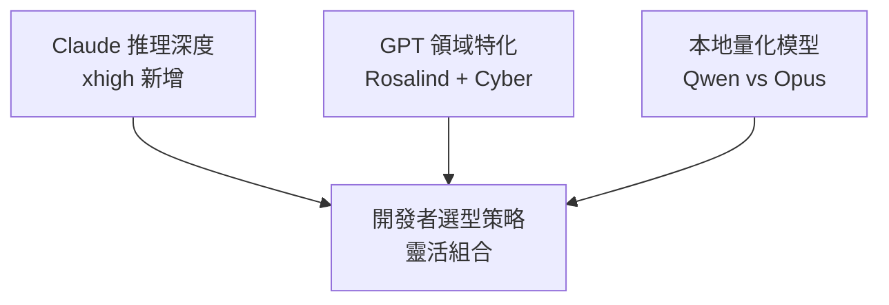

# AI Daily Digest — 2026-04-16

<!-- pipeline-generated:begin -->

## 🔥 今日 TOP 3
### 1. Claude Code v2.1.111：Opus 4.7 xhigh 與多代理審查
Claude Code 主版本更新推出 Opus 4.7 xhigh 努力等級，Max 訂閱戶可透過 auto mode 使用，並新增 /ultrareview 功能實現雲端並行多代理程式碼審查。xhigh 填補 high 與 max 之間的推理深度檔位，讓開發者在速度與智能間有更細微的控制；/ultrareview 則將程式碼審查從單一評審者模式升級為並行多視角評估，直接支持 GitHub PR。若使用 Max，應嘗試 /effort 滑桿調整 Opus 4.7 的推理深度；複雜的架構審查建議啟用 /ultrareview 以獲得多代理並行見解。

📖 [閱讀完整 insight](../10-insights/2026-04-16/inbox_840ae1ee.md) · 🔗 [原文連結](https://github.com/anthropics/claude-code/releases/tag/v2.1.111)
### 2. GPT-Rosalind：OpenAI 生命科學推理專用模型
OpenAI 推出 GPT-Rosalind，是專為生命科學研究（藥物發現、基因組學、蛋白質推理）設計的前沿推理模型。代表 AI 推理能力在科學領域的首度專項應用，相比通用模型，Rosalind 針對分子生物學問題的推理精度與效率均顯著提升，對藥企、生科公司和學術機構具直接商業和研究價值。製藥和生科企業應評估 Rosalind 在藥物篩選、基因體分析工作流中的集成機會；學術團隊可探索 Rosalind 用於加速蛋白質折疊預測和分子設計。

📖 [閱讀完整 insight](../10-insights/2026-04-16/inbox_b5c697ec.md) · 🔗 [原文連結](https://openai.com/index/introducing-gpt-rosalind)
### 3. GPT-5.4-Cyber：Trusted Access 啟動網路防禦賦能
OpenAI 推出「可信網路安全計畫」，向全球防禦人員提供 GPT-5.4-Cyber 模型及 1000 萬美元 API 額度，該模型專為網路防禦優化。此舉將 AI 推理能力直接對接網路威脅防禦，強化防禦人員對抗複雜攻擊的能力；相比通用 GPT，Cyber 特化版本在漏洞分析、異常檢測和防禦策略上更精準。安全企業應關注 Trusted Access 計畫的參與條件與 API 額度政策；防禦團隊可預先評估 Cyber 模型在入侵檢測、威脅狩獵和事件回應流程中的應用場景。

📖 [閱讀完整 insight](../10-insights/2026-04-16/inbox_9542815f.md) · 🔗 [原文連結](https://openai.com/index/accelerating-cyber-defense-ecosystem)

## 📚 分類摘要
### foundation_models
Claude 系列與 GPT 系列同步推進推理深度與領域專項。Claude Opus 4.7 xhigh 努力等級的推出（Claude Code v2.1.111）補足了推理檔位的細度控制，llm-anthropic 0.25 並行新增 thinking_display 與 thinking_adaptive 選項，讓開發者精細化推理過程的可視化與自適應行為。同期 OpenAI 則以 GPT-Rosalind（生命科學專用）與 GPT-5.4-Cyber（網路防禦專用）的方式拓展推理模型的領域邊界，代表從「通用推理模型」向「領域特化推理」的產業分化。

在本地運行的量化模型同樣值得關注：Simon Willison 的基準測試顯示，Qwen3.6-35B-A3B 在本地 MacBook 上的 SVG 生成精度超越 Opus 4.7，即便後者啟用 thinking_level: max 也無法匹敵。這反映了開源量化模型在特定視覺任務上的進展，提示開發者不應過度依賴旗艦閉源模型，應根據任務性質靈活選型。

Codex macOS/Windows 應用新增電腦使用、應用內瀏覽與圖像生成功能，進一步模糊了「程式碼補全工具」與「多功能開發助手」的邊界。這些功能組合旨在加速開發工作流，但也暗示 Codex 的競爭焦點從純推理轉向工作流整合。

### agents
Claude Code v2.1.111 新增 /ultrareview 功能，啟用雲端並行多代理程式碼審查，支援直接審查 GitHub PR。此舉將程式碼審查從單一評審者模式升級為並行多視角評估，顯著提升大型 PR 的審查品質與效率。

同時，/less-permission-prompts 技能允許掃描常見唯讀指令並自動提議白名單，這是對代理工作流中權限管理的優化。這些改進代表 Claude Code 從單一智能體向多智能體協作框架的演進，強化了代理在大型專案中的適用性。

## 🎯 專欄
### 🛠 Claude Code / Codex 新功能
- [v2.1.112](../10-insights/2026-04-16/inbox_b4ea9bd4.md) — Claude Code v2.1.112 於 2026 年 4 月 16 日發布，修復單一問題：解決 auto mode 下出現「claude-opus-4-7 is temporarily unavailable」的錯誤。此為緊急修補版本
- [v2.1.111](../10-insights/2026-04-16/inbox_840ae1ee.md) — Claude Code v2.1.111 於 2026 年 4 月 16 日發布，這是重大功能版本，主要推出 Claude Opus 4.7 xhigh 努力等級。Max 訂閱戶現可使用 Opus 4.7 auto mode，並透過 /ef
- [Codex for (almost) everything](../10-insights/2026-04-16/inbox_6eeeb2e9.md) — Codex 應用程式的 macOS 和 Windows 版本更新新增電腦使用、應用內瀏覽、圖像生成、記憶體和插件功能，大幅擴展從純程式碼完成工具到多功能開發助手的能力。新功能組合旨在加速開發人員工作流，涵蓋程式碼、瀏覽、視覺資產和工具整合等
### 🚀 Frontier 模型動態
- [v2.1.112](../10-insights/2026-04-16/inbox_b4ea9bd4.md) — Claude Code v2.1.112 於 2026 年 4 月 16 日發布，修復單一問題：解決 auto mode 下出現「claude-opus-4-7 is temporarily unavailable」的錯誤。此為緊急修補版本
- [v2.1.111](../10-insights/2026-04-16/inbox_840ae1ee.md) — Claude Code v2.1.111 於 2026 年 4 月 16 日發布，這是重大功能版本，主要推出 Claude Opus 4.7 xhigh 努力等級。Max 訂閱戶現可使用 Opus 4.7 auto mode，並透過 /ef
- [Codex for (almost) everything](../10-insights/2026-04-16/inbox_6eeeb2e9.md) — Codex 應用程式的 macOS 和 Windows 版本更新新增電腦使用、應用內瀏覽、圖像生成、記憶體和插件功能，大幅擴展從純程式碼完成工具到多功能開發助手的能力。新功能組合旨在加速開發人員工作流，涵蓋程式碼、瀏覽、視覺資產和工具整合等
- [Introducing GPT-Rosalind for life sciences research](../10-insights/2026-04-16/inbox_b5c697ec.md) — OpenAI 推出 GPT-Rosalind，一款前沿推理模型，專為生命科學研究而設計。該模型旨在加速藥物發現、基因組學分析、蛋白質推理和科學研究工作流程。GPT-Rosalind 代表 OpenAI 在科學領域應用 AI 推理能力的重大突
- [Accelerating the cyber defense ecosystem that protects us all](../10-insights/2026-04-16/inbox_9542815f.md) — OpenAI 宣布啟動「可信網路安全計畫」(Trusted Access for Cyber)，與全球領先的安全公司及企業合作。計畫向參與者提供 GPT-5.4-Cyber 模型及 1000 萬美元的 API 使用額。GPT-5.4-Cyb
### 🔐 AI 安全 / 濫用
_（今日無相關內容）_

<!-- pipeline-generated:end -->

<!-- user-notes -->
<!-- Write your own notes below; pipeline never touches this section. -->