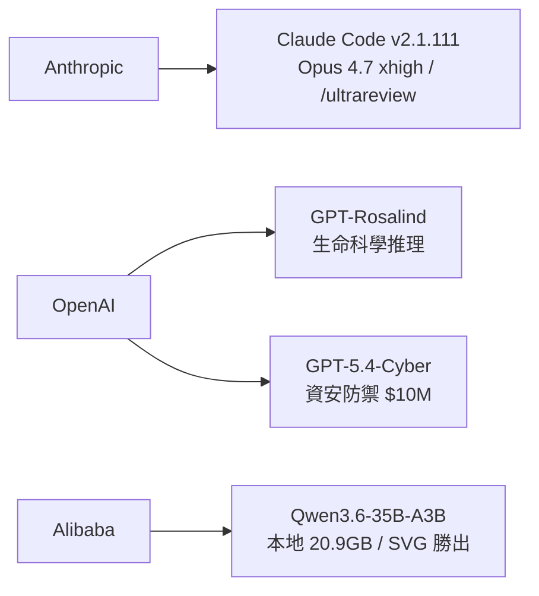
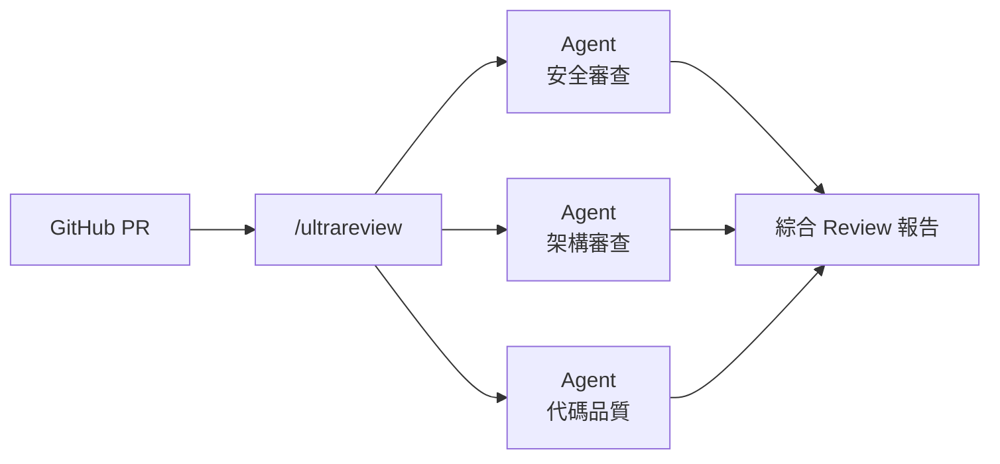

# AI Daily Digest — 2026-04-16

<!-- pipeline-generated:begin -->

## 🔥 今日 TOP 3
### 1. Claude Code 新增 Opus xhigh 與多代理代碼審查
Anthropic 在 Claude Code v2.1.111 推出 Opus 4.7 xhigh 努力等級，Max 訂閱用戶可透過 /effort 滑桿動態調整速度與智能。/ultrareview 指令讓多代理雲端代碼審查成為原生 workflow，可直接對 GitHub PR 啟動並行多視角審查。

xhigh 填補 high 與 max 之間的成本缺口，降低每次複雜任務都需最高算力的壓力。/ultrareview 是 AI coding 工具首次原生支援多代理 review pipeline，相較單線程助手提供更全面的評估覆蓋。

建議立即對現有 PR 跑 /ultrareview 測試評語品質；規劃 /effort 的 team default 策略，追蹤 xhigh 在 long-horizon 任務的實際成本效益，並以 /less-permission-prompts 掃描 CI 白名單減少授權摩擦。

📖 [閱讀完整 insight](../10-insights/2026-04-16/inbox_840ae1ee.md) · 🔗 [原文連結](https://github.com/anthropics/claude-code/releases/tag/v2.1.111)
### 2. GPT-Rosalind：OpenAI 首款生命科學推理模型
OpenAI 發布 GPT-Rosalind，首款公開聲稱針對生命科學優化的前沿推理模型，聚焦藥物發現、基因組學分析與蛋白質推理，面向製藥、生物科技及學術研究機構。

與通用推理模型相比，GPT-Rosalind 代表 AI lab 開始走向垂直領域深度優化；若能有效輔助蛋白質推理，將與 AlphaFold 系列形成不同切入角的競合關係，加速生醫研究工作流自動化。

可追蹤 Rosalind API 開放後與 ESM、PubMedGPT 的 benchmark 對比；生醫新創可評估將研究工作流切換至 Rosalind 的成本效益，並觀察 OpenAI 是否持續擴大垂直模型產品線。

📖 [閱讀完整 insight](../10-insights/2026-04-16/inbox_b5c697ec.md) · 🔗 [原文連結](https://openai.com/index/introducing-gpt-rosalind)
### 3. GPT-5.4-Cyber 攜千萬 API 額度入局資安防禦
OpenAI 推出「可信網路安全計畫」，向參與的頂尖資安公司提供 GPT-5.4-Cyber 防禦優化模型及 1000 萬美元 API 使用額度，明確定位為全球網路防禦生態強化。

過去 AI 資安多為通用模型的附加功能，GPT-5.4-Cyber 是 OpenAI 首款獨立資安防禦模型，搭配大規模資金支持，直接與 Google VirusTotal AI 和 Microsoft Security Copilot 形成競爭，標誌 AI 供應商將「可信 AI 資安」列為戰略賽道。

資安團隊可申請加入計畫，評估 GPT-5.4-Cyber 在威脅情報分析與事件響應自動化的效能；同時需關注計畫的安全審核機制，確保模型能力不被用於攻擊性用途。

📖 [閱讀完整 insight](../10-insights/2026-04-16/inbox_9542815f.md) · 🔗 [原文連結](https://openai.com/index/accelerating-cyber-defense-ecosystem)

## 📚 分類摘要
### foundation_models
**Claude 陣營**：Anthropic 本週密集更新 Claude Code，v2.1.111 推出 Opus 4.7 xhigh 努力等級，Max 訂閱用戶可在 auto mode 動態調整效能；/ultrareview 讓雲端多代理代碼審查成為原生 workflow。v2.1.112 緊急修補 Opus 4.7 在 auto mode 出現 temporarily unavailable 的問題。llm-anthropic SDK 0.25 同步支援 Opus 4.7 與 thinking_effort: xhigh，預設 max_tokens 升至各模型上限，移除過時 beta 標頭。

**OpenAI 陣營**：OpenAI 同日推出兩款垂直模型——GPT-Rosalind（生命科學推理）與 GPT-5.4-Cyber（網路防禦，$10M API 額度），標誌通用模型路線開始平行發展垂直深度模型。Codex macOS/Windows 應用加入電腦使用、應用內瀏覽、圖像生成、記憶體與插件，從程式碼完成工具擴展為多功能開發助手。

**開源競爭**：Alibaba Qwen3.6-35B-A3B 本地量化版（20.9GB，MacBook Pro M5）在 Simon Willison 的非正式 SVG 基準測試中優於 Claude Opus 4.7（含 thinking_level: max），凸顯本地量化模型在特定視覺生成任務仍具競爭力。

### agents
Claude Code v2.1.111 透過 /ultrareview 正式引入雲端並行多代理代碼審查，可直接對 GitHub PR 啟動多視角並行審查，是 AI coding 助手首次原生整合多代理 review pipeline。相較過去單一助手逐行審查，多代理並行讓不同代理聚焦安全、架構、效能等不同面向，提供更全面的代碼品質評估。

/less-permission-prompts 技能可掃描常見唯讀指令並提議白名單，降低 agent 操作的人工授權頻率；計畫檔案改以提示內容命名（如 fix-auth-race-snug-otter.md），改善多會話環境下的 agent context 追蹤。這些更新整體方向是降低 Claude Code agent 在開發 workflow 中的操作摩擦，使其更適合嵌入自動化 CI/CD pipeline。

## 💡 今日 Takeaway
### 1. RAG 分塊策略優先於模型選擇，設計缺陷無法靠模型彌補
RAG 系統失敗的根源常在 upstream 的分塊策略，而非模型能力不足。一旦分塊邊界切錯，後續換更強模型、加微調、或調 prompt，都無法修復資訊破碎帶來的召回失準。設計 RAG 系統時應先確定分塊策略（按語意、按結構、固定 token 窗口），以 retrieval precision/recall 為第一優化目標，選模型是第二步。

_類型：framework_ · 來源：[[inbox_6e7226cc]]
### 2. DER 框架讓神經網絡量化不確定性，避免分布外過度自信
傳統神經網絡訓練目標是最小化預測誤差，卻缺乏機制表達「我不確定」。Deep Evidential Regression 透過讓模型輸出 evidential distribution，同時量化知識邊界（epistemic uncertainty）與資料雜訊（aleatoric uncertainty）。在醫療診斷、金融預測、自駕決策等風險敏感場景，DER 可顯著降低模型在分布外資料上盲目高信心輸出的決策風險。

_類型：framework_ · 來源：[[inbox_8d56ac12]]
### 3. 任務分解模組是 AI 助手最高槓桿組件，應優先設計
將複雜目標整體交給 AI 處理容易失控；獨立的任務分解模組把目標結構化拆解為可追蹤步驟，本質上是將規劃與執行分離。這種設計讓每個子任務可獨立驗證，失敗點可精確定位。構建 AI-augmented 工作流時，應先識別「哪個模組是最高槓桿點」——任務分解通常是值得最先投資的組件。

_類型：technique_ · 來源：[[inbox_a009bd83]]
### 4. Agent 記憶體不需向量 DB：Markdown + SQLite 零基礎設施方案
向量數據庫（Pinecone、Weaviate）的部署複雜度常成為 agent 記憶體功能落地的阻力。memweave 採用 Markdown 儲存記憶條目、SQLite 管理索引，無需額外基礎設施即可實現 agent 記憶體持久化。適合個人工具、內部 POC 或資源受限部署；若應用的記憶體查詢是結構化而非語義相似度搜尋，此方案的簡單性優勢尤為明顯。

_類型：tool_ · 來源：[[inbox_29f5f388]]

## 🎯 專欄
### 🛠 Claude Code / Codex 新功能
- [v2.1.112](../10-insights/2026-04-16/inbox_b4ea9bd4.md) — Claude Code v2.1.112 於 2026 年 4 月 16 日發布，修復單一問題：解決 auto mode 下出現「claude-opus-4-7 is temporarily unavailable」的錯誤。此為緊急修補版本
- [v2.1.111](../10-insights/2026-04-16/inbox_840ae1ee.md) — Claude Code v2.1.111 於 2026 年 4 月 16 日發布，這是重大功能版本，主要推出 Claude Opus 4.7 xhigh 努力等級。Max 訂閱戶現可使用 Opus 4.7 auto mode，並透過 /ef
- [Codex for (almost) everything](../10-insights/2026-04-16/inbox_6eeeb2e9.md) — Codex 應用程式的 macOS 和 Windows 版本更新新增電腦使用、應用內瀏覽、圖像生成、記憶體和插件功能，大幅擴展從純程式碼完成工具到多功能開發助手的能力。新功能組合旨在加速開發人員工作流，涵蓋程式碼、瀏覽、視覺資產和工具整合等
### 📚 AI 知識管理
- [Artifacts: Versioned storage that speaks Git](../10-insights/2026-04-16/inbox_3162bed4.md) — 無法處理：內容空白
- [Your Chunks Failed Your RAG in Production](../10-insights/2026-04-16/inbox_6e7226cc.md) — RAG 系統失敗根源分析：分塊策略的架構決策優先級。核心警示是 upstream 的分塊決策無法由模型優化或微調修復。一旦分塊策略在設計階段出錯，後續的模型選擇再優秀也無法補救。強調架構決策（chunking strategy）的優先級高於
- [memweave: Zero-Infra AI Agent Memory with Markdown and SQLite — No Vector Database Required](../10-insights/2026-04-16/inbox_29f5f388.md) — memweave 是一個 AI agent 記憶體解決方案，採用 Markdown 和 SQLite 作為技術基礎，標榜零基礎設施特點。核心優勢是無需依賴向量數據庫，相比傳統方案大幅簡化了部署的複雜度。這種設計讓開發者可以用最少的額外基礎設
### 🏢 企業導入 AI / 團隊實踐
- [v2.1.111](../10-insights/2026-04-16/inbox_840ae1ee.md) — Claude Code v2.1.111 於 2026 年 4 月 16 日發布，這是重大功能版本，主要推出 Claude Opus 4.7 xhigh 努力等級。Max 訂閱戶現可使用 Opus 4.7 auto mode，並透過 /ef
- [Accelerating the cyber defense ecosystem that protects us all](../10-insights/2026-04-16/inbox_9542815f.md) — OpenAI 宣布啟動「可信網路安全計畫」(Trusted Access for Cyber)，與全球領先的安全公司及企業合作。計畫向參與者提供 GPT-5.4-Cyber 模型及 1000 萬美元的 API 使用額。GPT-5.4-Cyb
- [What It Actually Takes to Run Code on 200M€ Supercomputer](../10-insights/2026-04-16/inbox_51602563.md) — 深入 MareNostrum V 超級計算機（投資 2 億歐元）的大規模分散式系統運維。揭示 HPC 基礎設施的技術挑戰：SLURM 排程器管理、Fat-Tree 網路拓樸設計、跨 8000 節點的計算管道擴展。在 19 世紀教堂內運行超算
- [memweave: Zero-Infra AI Agent Memory with Markdown and SQLite — No Vector Database Required](../10-insights/2026-04-16/inbox_29f5f388.md) — memweave 是一個 AI agent 記憶體解決方案，採用 Markdown 和 SQLite 作為技術基礎，標榜零基礎設施特點。核心優勢是無需依賴向量數據庫，相比傳統方案大幅簡化了部署的複雜度。這種設計讓開發者可以用最少的額外基礎設
### 🎓 AI 使用技巧 / 心法
- [v2.1.111](../10-insights/2026-04-16/inbox_840ae1ee.md) — Claude Code v2.1.111 於 2026 年 4 月 16 日發布，這是重大功能版本，主要推出 Claude Opus 4.7 xhigh 努力等級。Max 訂閱戶現可使用 Opus 4.7 auto mode，並透過 /ef
- [datasette.io news preview](../10-insights/2026-04-16/inbox_71433ef5.md) — Simon Willison 使用 Claude 和 Claude Artifacts 快速構建了 datasette.io 新聞預覽工具，用於簡化 news.yaml 文件的編輯和驗證流程。該工具允許用戶貼上 YAML 內容，實時預覽渲染
- [Introduction to Deep Evidential Regression for Uncertainty Quantification](../10-insights/2026-04-16/inbox_8d56ac12.md) — Deep Evidential Regression (DER) 是應對機器學習模型過度自信的新方法。ML 模型常被視為高置信度預測者，但實際上在面對不確定情況時往往缺乏誠實表達。DER 提供框架讓神經網絡能夠明確表達不確定性和認知邊界，而

<!-- pipeline-generated:end -->

<!-- user-notes -->
<!-- Write your own notes below; pipeline never touches this section. -->