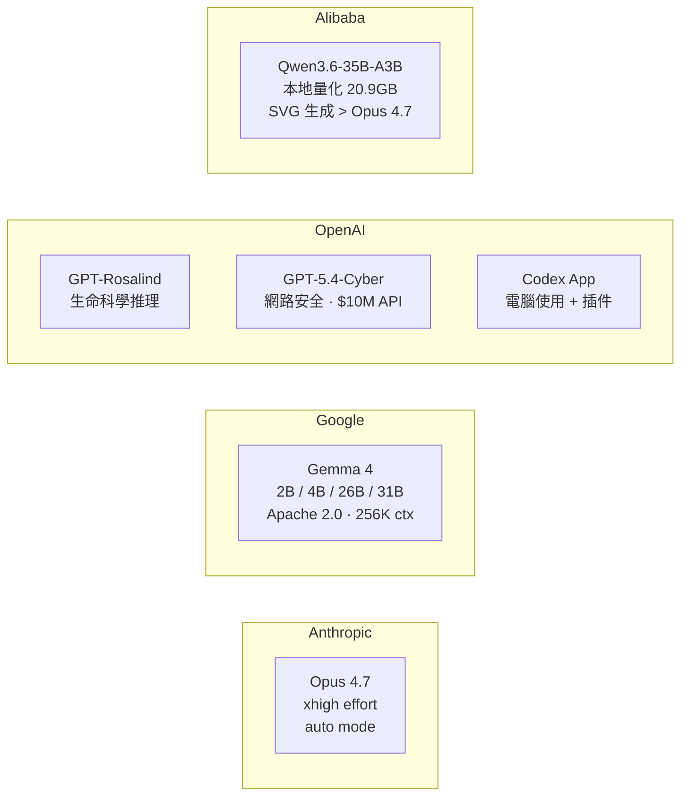

# AI Daily Digest — 2026-04-16

<!-- pipeline-generated:begin -->

## 🔥 今日 TOP 3
### 1. Opus 4.7 xhigh 登場，/ultrareview 開放雲端多代理 PR 審查
Anthropic 於 4 月 16 日發布 Claude Code v2.1.111，推出三項重大新功能：介於 high 與 max 之間的 Opus 4.7 xhigh 努力等級（Max 訂閱戶可搭配 auto mode）、/ultrareview 雲端並行多代理程式碼審查（可直接審查 GitHub PR）、以及 /less-permission-prompts 技能自動掃描唯讀指令生成白名單。計畫檔名也改由提示內容自動生成（如 fix-auth-race-snug-otter.md），解決多專案情境下歷史對話難以追蹤的痛點。

xhigh 等級為開發者提供比 high 更強、比 max 更省成本的算力選項，填補過去只有兩極設定的空白。/ultrareview 標誌著程式碼審查從「單一 AI 審閱」升級為「分散並行多代理覆蓋」，在不增加人力的情況下提升審查深度與廣度——對管理大型 PR 或高風險改動的工程師特別有價值。同版本修復了 25+ 項已知問題，包括 /resume 大型會話、Tab 補全、MCP 逾時等長期回報的缺陷。

Max 訂閱者可立即透過 /effort xhigh 測試 Opus 4.7 在複雜推理任務上的效益，並在下一次 PR 中實測 /ultrareview 的並行審查品質差異。白名單技能建議在日常開發環境優先部署，減少重複授權確認對開發流的干擾；下週觀察重點是 xhigh 在 long-horizon task 的 context 穩定性表現。

📖 [閱讀完整 insight](../10-insights/2026-04-16/inbox_840ae1ee.md) · 🔗 [原文連結](https://github.com/anthropics/claude-code/releases/tag/v2.1.111)
### 2. Gemma 4 四規模 Apache 2.0 開源，256K ctx 補足長文件短板
Google 以 Apache 2.0 授權開源 Gemma 4 系列，提供 2B、4B、26B、31B 四種參數規模。全系列支援視頻與圖像多模態輸入，小型模型亦支援音頻輸入，最大上下文窗口達 256K tokens，並內建代理（agent）能力，涵蓋邊緣裝置到高效能伺服器的完整部署場景。

Apache 2.0 授權對企業意義重大——商業使用零限制，可部署於私有環境而不受閉源模型使用條款的約束。256K 上下文窗口讓長文件分析不再是開源模型對比閉源模型的明顯弱點；多規模設計使同一模型家族可在不換框架的情況下從 PoC 擴展至生產，競爭態勢直指 Meta LLaMA 4 和 Mistral 開源陣營。

開發者應優先評估 Gemma 4 4B 在私有資料微調的效果，以及 26B 在多模態文件處理任務的準確率。下週觀察重點是社群系統性基準：Gemma 4 vs LLaMA 4 在 coding、multimodal、long-context 三個維度的對比結果，以及 Google 是否同步開放微調配方（recipe）與量化最佳化版本。

📖 [閱讀完整 insight](../10-insights/2026-04-16/inbox_be916228.md) · 🔗 [原文連結](https://www.infoq.com/news/2026/04/google-gemm4/?utm_campaign=infoq_content&utm_source=infoq&utm_medium=feed&utm_term=AI%2C+ML+%26+Data+Engineering)
### 3. OpenAI 雙發垂直推理模型：Rosalind 攻生命科學，Cyber 守網路防禦
OpenAI 同期推出兩款垂直領域專用模型：GPT-Rosalind 專為生命科學設計（藥物發現、基因組學分析、蛋白質推理），GPT-5.4-Cyber 針對網路安全防禦優化，並附帶 1000 萬美元 API 使用額度給參與「可信網路安全計畫（Trusted Access for Cyber）」的全球安全機構。

這兩款模型代表 AI 從「廣泛通用推理」向「垂直深度專精」的戰略轉型。GPT-Rosalind 對製藥與生技公司的意義在於：分子生物學問題的前期研究時間有望從數週壓縮至小時，且相比通用模型可在蛋白質與基因推理的專業子領域提供更可靠的輸出。GPT-5.4-Cyber 則直接進入安全生態，以 AI 能力強化防禦體系，與現有的 SIEM / EDR 工具形成互補。

製藥研究人員應評估 GPT-Rosalind 在蛋白質結構推理上相對 AlphaFold 管線的互補性；安全工程師可申請加入 Trusted Access for Cyber 計畫取得優先 API 額度。OpenAI 的垂直化策略預示後續可能出現材料科學、法律、金融等更多領域的專用模型——這是評估 AI 供應商長期路線圖的重要信號。

📖 [閱讀完整 insight](../10-insights/2026-04-16/inbox_b5c697ec.md) · 🔗 [原文連結](https://openai.com/index/introducing-gpt-rosalind)

## 📚 分類摘要
### foundation_models
2026 年 4 月中旬是多模型發布密集期。Anthropic 推出 Claude Code v2.1.111，核心亮點是 Opus 4.7 的 xhigh 努力等級（介於 high 與 max 之間），Max 訂閱戶可透過 auto mode 直接使用；llm-anthropic 0.25 SDK 同步更新支援 Opus 4.7 及 thinking_effort: xhigh，預設 max_tokens 調整為各模型允許上限，並移除過時的 structured-outputs beta 標頭。Claude Code v2.1.112 緊接修補了 auto mode 下 Opus 4.7 暫時無法使用的 bug。社群測試（Simon Willison）發現 Qwen3.6-35B-A3B 本地量化版（20.9GB，MacBook Pro M5 可跑）在 SVG 圖像生成上優於 Opus 4.7——後者開啟 thinking_level: max 仍將自行車框架畫錯——提醒開發者閉源前沿模型在特定視覺生成任務上並非全面領先。

Google 以 Apache 2.0 開源 Gemma 4 系列（2B / 4B / 26B / 31B），支援多模態（視頻、圖像、音頻）及 256K tokens 上下文，商業使用無限制，直接對標 Meta LLaMA 4。OpenAI 同步推出 GPT-Rosalind（生命科學推理）與 GPT-5.4-Cyber（網路安全防禦，含 1000 萬美元 API 額度），Codex macOS / Windows app 也擴充電腦使用、應用內瀏覽、圖像生成、記憶體及插件功能。

整體趨勢：垂直領域專用模型（Rosalind / Cyber）預示 AI 正從通用智能向可商業化深度垂直能力演進；開源多模態基礎模型（Gemma 4 / Qwen）在特定任務已與閉源前沿模型形成實質競爭，256K 上下文也不再是閉源模型的專屬優勢。
### agents
Cloudflare 推出基於 Code Mode 技術的 MCP server，覆蓋 2,500+ API endpoint，解決傳統 MCP server 在大量 API 場景下 context 爆炸的核心痛點。其設計邏輯是讓 LLM Agent 生成程式碼來執行 API 調用，而非把全部 endpoint schema 直接置入 context——2,500 個 endpoint 因此只需極小的 token footprint 即可被 Agent 調度。系統同時提供安全沙箱代碼執行環境，使複雜跨 API 工作流成為可能，對需要整合多個外部服務的 Agent 應用具有直接生產價值。

Claude Code v2.1.111 同步推出 /ultrareview，啟用雲端並行多代理對 GitHub PR 進行分散式程式碼審查；memweave 工具則提供 Markdown + SQLite 的輕量 Agent 記憶體方案（inbox_29f5f388），避免向量資料庫的部署複雜度。三個方向共同指向一個趨勢：Agent 生態正在系統性解決 context 效率、記憶體管理、多代理協作三大生產化瓶頸。
### infra
AWS 推出 S3 Files 功能，允許應用程式透過標準 POSIX 文件系統介面掛載 S3 儲存桶——讀寫操作自動轉譯為等效的 S3 API 請求，對應用層完全透明。這對原本假設本地儲存的舊有應用遷移至雲端具有實際意義：無需改寫業務邏輯，僅需掛載 mount point 即可享受 S3 的可擴展性，反映雲端儲存向更無縫集成方向演進的趨勢。

社群分享的 MareNostrum V 超算中心（2 億歐元投資，8000+ 節點）運維經驗揭示大規模分散式系統的工程現實：SLURM 排程器在數千節點環境的調度優化、Fat-Tree 網路拓樸的通訊瓶頸管理，以及在 19 世紀教堂建築內運作超算中心的物理工程約束。對構建 HPC 級別分散式系統的工程師提供直接的實戰參考。

## 🎯 專欄
### 🛠 Claude Code / Codex 新功能
- **[v2.1.112](../10-insights/2026-04-16/inbox_b4ea9bd4.md)**
  Claude Code v2.1.112 於 2026 年 4 月 16 日發布，修復單一問題：解決 auto mode 下出現「claude-opus-4-7 is temporarily unavailable」的錯誤。此為緊急修補版本，確保 Opus 4.7 自動模式可正常運作。
- **[v2.1.111](../10-insights/2026-04-16/inbox_840ae1ee.md)**
  Claude Code v2.1.111 於 2026 年 4 月 16 日發布，這是重大功能版本，主要推出 Claude Opus 4.7 xhigh 努力等級。Max 訂閱戶現可使用 Opus 4.7 auto mode，並透過 /effort 滑桿調整速度與智能平衡；xhigh 等級介於 high 與 max 之間。新增 /less-permissio
- **[Codex for (almost) everything](../10-insights/2026-04-16/inbox_6eeeb2e9.md)**
  Codex 應用程式的 macOS 和 Windows 版本更新新增電腦使用、應用內瀏覽、圖像生成、記憶體和插件功能，大幅擴展從純程式碼完成工具到多功能開發助手的能力。新功能組合旨在加速開發人員工作流，涵蓋程式碼、瀏覽、視覺資產和工具整合等多個維度。
### 📚 AI 知識管理
- **[Artifacts: Versioned storage that speaks Git](../10-insights/2026-04-16/inbox_3162bed4.md)**
  無法處理：內容空白
- **[Your Chunks Failed Your RAG in Production](../10-insights/2026-04-16/inbox_6e7226cc.md)**
  RAG 系統失敗根源分析：分塊策略的架構決策優先級。核心警示是 upstream 的分塊決策無法由模型優化或微調修復。一旦分塊策略在設計階段出錯，後續的模型選擇再優秀也無法補救。強調架構決策（chunking strategy）的優先級高於模型能力。對構建 RAG 生產系統的工程師是重要的系統設計原則。
- **[memweave: Zero-Infra AI Agent Memory with Markdown and SQLite — No Vector Database Required](../10-insights/2026-04-16/inbox_29f5f388.md)**
  memweave 是一個 AI agent 記憶體解決方案，採用 Markdown 和 SQLite 作為技術基礎，標榜零基礎設施特點。核心優勢是無需依賴向量數據庫，相比傳統方案大幅簡化了部署的複雜度。這種設計讓開發者可以用最少的額外基礎設施為 AI agent 加入記憶體管理能力。
- **[AWS Introduces S3 Files, Bringing File System Access to S3 Buckets](../10-insights/2026-04-16/inbox_e298a816.md)**
  AWS推出S3 Files功能，允許用戶將Amazon S3儲存桶掛載為標準文件系統，應用程序可通過熟悉的文件操作讀寫數據。系統自動將標準文件I/O操作轉譯為等效的S3 API請求，對應用透明。此特性大幅降低了應用遷移至S3或與S3協作的認知成本，使得舊有假設本地存儲的應用可輕鬆適配。開發者無需改寫業務邏輯，只需掛載point就能享受S3的可擴展性。這反映了
### 🏢 企業導入 AI / 團隊實踐
- **[v2.1.111](../10-insights/2026-04-16/inbox_840ae1ee.md)**
  Claude Code v2.1.111 於 2026 年 4 月 16 日發布，這是重大功能版本，主要推出 Claude Opus 4.7 xhigh 努力等級。Max 訂閱戶現可使用 Opus 4.7 auto mode，並透過 /effort 滑桿調整速度與智能平衡；xhigh 等級介於 high 與 max 之間。新增 /less-permissio
- **[Accelerating the cyber defense ecosystem that protects us all](../10-insights/2026-04-16/inbox_9542815f.md)**
  OpenAI 宣布啟動「可信網路安全計畫」(Trusted Access for Cyber)，與全球領先的安全公司及企業合作。計畫向參與者提供 GPT-5.4-Cyber 模型及 1000 萬美元的 API 使用額。GPT-5.4-Cyber 是專門為網路防禦優化的模型，能夠增強全球網路防禦生態系統。此舉意味著 AI 能力與網路安全領域的深度整合。對安全企
- **[What It Actually Takes to Run Code on 200M€ Supercomputer](../10-insights/2026-04-16/inbox_51602563.md)**
  深入 MareNostrum V 超級計算機（投資 2 億歐元）的大規模分散式系統運維。揭示 HPC 基礎設施的技術挑戰：SLURM 排程器管理、Fat-Tree 網路拓樸設計、跨 8000 節點的計算管道擴展。在 19 世紀教堂內運行超算中心的獨特場景凸顯工程約束。對高效能計算與大規模分散系統的工程師提供實戰運維經驗。
- **[memweave: Zero-Infra AI Agent Memory with Markdown and SQLite — No Vector Database Required](../10-insights/2026-04-16/inbox_29f5f388.md)**
  memweave 是一個 AI agent 記憶體解決方案，採用 Markdown 和 SQLite 作為技術基礎，標榜零基礎設施特點。核心優勢是無需依賴向量數據庫，相比傳統方案大幅簡化了部署的複雜度。這種設計讓開發者可以用最少的額外基礎設施為 AI agent 加入記憶體管理能力。
- **[Google Opens Gemma 4 Under Apache 2.0 with Multimodal and Agentic Capabilities](../10-insights/2026-04-16/inbox_be916228.md)**
  Google 宣布開源發布 Gemma 4 系列模型，包括 2B、4B、26B 和 31B 參數四個規模，均採用 Apache 2.0 許可證。主要特性包括增強的視頻和圖像處理能力、較小模型上支持音頻輸入，以及最高 256K tokens 的擴展上下文窗口。該發布涵蓋多模態和代理能力，為開發者提供高度靈活的開源模型選擇。Gemma 4 的多規模設計滿足從邊緣
### 🎓 AI 使用技巧 / 心法
- **[v2.1.111](../10-insights/2026-04-16/inbox_840ae1ee.md)**
  Claude Code v2.1.111 於 2026 年 4 月 16 日發布，這是重大功能版本，主要推出 Claude Opus 4.7 xhigh 努力等級。Max 訂閱戶現可使用 Opus 4.7 auto mode，並透過 /effort 滑桿調整速度與智能平衡；xhigh 等級介於 high 與 max 之間。新增 /less-permissio
- **[datasette.io news preview](../10-insights/2026-04-16/inbox_71433ef5.md)**
  Simon Willison 使用 Claude 和 Claude Artifacts 快速構建了 datasette.io 新聞預覽工具，用於簡化 news.yaml 文件的編輯和驗證流程。該工具允許用戶貼上 YAML 內容，實時預覽渲染效果並檢測 Markdown 和 YAML 語法錯誤。目前 datasette.io 新聞部分已有 115 條新聞條目。
- **[Introduction to Deep Evidential Regression for Uncertainty Quantification](../10-insights/2026-04-16/inbox_8d56ac12.md)**
  Deep Evidential Regression (DER) 是應對機器學習模型過度自信的新方法。ML 模型常被視為高置信度預測者，但實際上在面對不確定情況時往往缺乏誠實表達。DER 提供框架讓神經網絡能夠明確表達不確定性和認知邊界，而非盲目給出高置信預測。這種能力對於需要理解模型邊界和可靠性的應用特別重要。
- **[A Guide to Relational Database Design](../10-insights/2026-04-16/inbox_3cdca312.md)**
  系統講述關聯式資料庫設計的核心概念，涵蓋表、鍵、關係、正規化和 join 等基礎，各概念環環相扣逐步深化。通過建立清晰的設計原則，幫助工程師避免資料冗余和異常更新，做出正確的資料庫架構決策。
- **[Cloudflare Launches Code Mode MCP Server to Optimize Token Usage for AI Agents](../10-insights/2026-04-16/inbox_751c48bb.md)**
  Cloudflare 推出基於 Code Mode 技術的新型 MCP server，專門優化 AI agents 與大規模 API 交互時的 token 使用效率。該 server 覆蓋 2,500+ 個 endpoint，將 context footprint 大幅縮小，同時改善多 API 編排能力。系統提供安全的代碼執行環境，使 LLM agents 
### 💳 支付 / Fintech
- **[datasette.io news preview](../10-insights/2026-04-16/inbox_71433ef5.md)**
  Simon Willison 使用 Claude 和 Claude Artifacts 快速構建了 datasette.io 新聞預覽工具，用於簡化 news.yaml 文件的編輯和驗證流程。該工具允許用戶貼上 YAML 內容，實時預覽渲染效果並檢測 Markdown 和 YAML 語法錯誤。目前 datasette.io 新聞部分已有 115 條新聞條目。
### ⛓️ 區塊鏈 / Web3
- **[Codex for (almost) everything](../10-insights/2026-04-16/inbox_6eeeb2e9.md)**
  Codex 應用程式的 macOS 和 Windows 版本更新新增電腦使用、應用內瀏覽、圖像生成、記憶體和插件功能，大幅擴展從純程式碼完成工具到多功能開發助手的能力。新功能組合旨在加速開發人員工作流，涵蓋程式碼、瀏覽、視覺資產和工具整合等多個維度。
- **[memweave: Zero-Infra AI Agent Memory with Markdown and SQLite — No Vector Database Required](../10-insights/2026-04-16/inbox_29f5f388.md)**
  memweave 是一個 AI agent 記憶體解決方案，採用 Markdown 和 SQLite 作為技術基礎，標榜零基礎設施特點。核心優勢是無需依賴向量數據庫，相比傳統方案大幅簡化了部署的複雜度。這種設計讓開發者可以用最少的額外基礎設施為 AI agent 加入記憶體管理能力。
- **[A Guide to Relational Database Design](../10-insights/2026-04-16/inbox_3cdca312.md)**
  系統講述關聯式資料庫設計的核心概念，涵蓋表、鍵、關係、正規化和 join 等基礎，各概念環環相扣逐步深化。通過建立清晰的設計原則，幫助工程師避免資料冗余和異常更新，做出正確的資料庫架構決策。

## 💡 今日 Takeaway

_讀完今日所有內容後，可帶走的知識點_
### 1. RAG 分塊策略是 upstream 架構決策，模型優化無法事後補救
在 RAG 系統中，chunking（分塊）策略的決定優先序高於模型選擇——一旦設計階段的分塊方式出錯（粒度不當、語義跨塊斷裂），後續再強的 retrieval 模型或生成模型都無法修復 recall 品質。建議把分塊策略視為等同資料庫 schema 設計的架構決策：在原型初期就進行多種分塊方式的 A/B 測試，以 end-to-end recall@k 指標評估，而非等到下游任務表現不佳才回溯修改架構，屆時代價遠高於前期投入。

_類型：framework_

**參考來源**：
- [Your Chunks Failed Your RAG in Production](../10-insights/2026-04-16/inbox_6e7226cc.md) · [原文](https://towardsdatascience.com/your-chunks-failed-your-rag-in-production/)
### 2. Agent 記憶體用 Markdown + SQLite 即可，避免過早引入向量資料庫
向量資料庫並非 AI Agent 持久記憶的唯一方案——Markdown 文件加 SQLite 已足以支撐 Agent 的語義記憶需求，且部署複雜度遠低於 Pinecone / Weaviate 等方案。這個模式適合原型期或小規模 Agent 系統：先以零基礎設施快速驗證記憶體邏輯，待規模需求與查詢模式確認後才遷移至向量資料庫，避免過早的基礎設施投資鎖死架構彈性。

_類型：tool_

**參考來源**：
- [memweave: Zero-Infra AI Agent Memory with Markdown and SQLite — No Vector Database Required](../10-insights/2026-04-16/inbox_29f5f388.md) · [原文](https://towardsdatascience.com/memweave-zero-infra-ai-agent-memory-with-markdown-and-sqlite-no-vector-database-required/)
### 3. Code Mode MCP 讓 Agent 寫程式呼叫 API，比窮舉 schema 省 token
傳統 MCP server 把每個 API 的完整 schema 注入 context，endpoint 數量一多 token 消耗即爆炸。Code Mode MCP 改採「代碼生成 + 沙箱執行」模式：Agent 生成程式碼來調用 API，而非背誦完整 schema——Cloudflare 的實作讓 2,500+ endpoint 的 context footprint 大幅壓縮。設計整合大量外部 API 的 Agent 系統時，應優先評估 code-generation 介面的 MCP 架構，而非窮舉 schema 的傳統方案。

_類型：tool_

**參考來源**：
- [Cloudflare Launches Code Mode MCP Server to Optimize Token Usage for AI Agents](../10-insights/2026-04-16/inbox_751c48bb.md) · [原文](https://www.infoq.com/news/2026/04/cloudflare-code-mode-mcp-server/?utm_campaign=infoq_content&utm_source=infoq&utm_medium=feed&utm_term=AI%2C+ML+%26+Data+Engineering)
- [Cloudflare Launches Code Mode MCP Server to Optimize Token Usage for AI Agents](../10-insights/2026-04-16/inbox_55d56ee4.md) · [原文](https://www.infoq.com/news/2026/04/cloudflare-code-mode-mcp-server/?utm_campaign=infoq_content&utm_source=infoq&utm_medium=feed&utm_term=Architecture+%26+Design)

<!-- pipeline-generated:end -->

<!-- user-notes -->
<!-- Write your own notes below; pipeline never touches this section. -->