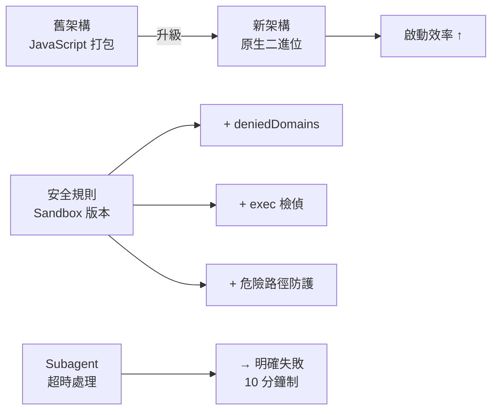
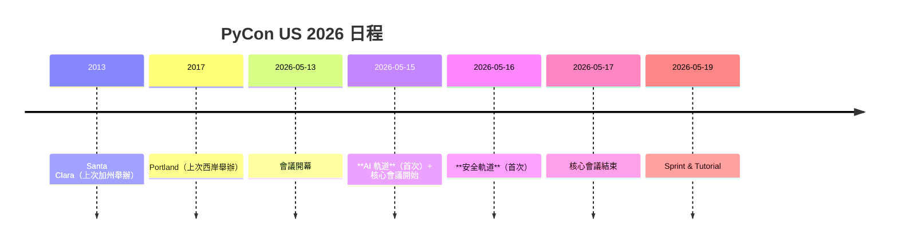

# AI Daily Digest — 2026-04-17

<!-- pipeline-generated:begin -->

## 🔥 今日 TOP 3
### 1. Claude Opus 4.7 發布：LLM 市場全面領先
Anthropic 官方宣布 Claude Opus 4.7 為新一代最先進模型，在推理、編碼、分析等所有維度相比 4.6 均有顯著提升，確立該系列在 LLM 市場的主導地位。這次發布並非單一功能改進，而是模型能力的跨維度突破。

對開發者和企業用戶而言，4.7 的全面優勢直接影響產品成本與效能。依賴 Claude API 的應用（例如企業客服、代碼生成工具、分析平臺）將獲得性能提升的紅利，同時減少 prompt 工程的調優成本。相比 GPT-4o、Gemini 等競品，4.7 的全面領先讓 Anthropic 在商用生態中的議價能力大幅提升。

開發者應立即評估 4.7 在自己應用中的效果差異。檢視現有提示詞工程是否能充分利用新模型能力；規劃升級成本與收益權衡；同步關注 Anthropic 的定價策略（4.7 是否溢價）和商用可用性時程。企業用戶應與 Anthropic 確認遷移路徑與相容性保證。

📖 [閱讀完整 insight](../10-insights/2026-04-17/inbox_5308e74d.md) · 🔗 [原文連結](https://www.latent.space/p/ainews-anthropic-claude-opus-47-literally)
### 2. Claude Code v2.1.113：CLI 架構優化與安全加固
Claude Code 於 4 月 17 日發布 v2.1.113，核心改進包括：CLI 改用平臺原生二進位執行（取代 JavaScript 打包，提升啟動效率）、新增 sandbox.network.deniedDomains 域名黑名單配置、Subagent 超時判定從無限等待改為 10 分鐘後明確失敗、加強 macOS 危險路徑偵測和 exec 包裹命令檢偵。

CLI 改為原生二進位直接提升工具啟動速度，這對高頻開發循環和自動化場景影響最大。安全規則加強（特別是 exec 包裹、macOS /private/* 路徑防護）大幅降低誤操作和權限外逸風險，對生產環境集成和多人開發團隊尤其重要。Subagent 超時明確化防止任務 hang、消耗資源，改善 CI/CD 和自動化效能可預測性。

更新至 v2.1.113 時，應檢視本地環境 sandbox 配置，特別是 deniedDomains 是否需因應網路政策調整。掃描自動化腳本中常用的 exec、find、sudo 指令，確認是否觸及新安全規則。在代理重工作流（如 agent 大量生成程式碼場景）中監控 Subagent 表現，驗證超時機制是否改善任務可靠性。

📖 [閱讀完整 insight](../10-insights/2026-04-17/inbox_c5fda427.md) · 🔗 [原文連結](https://github.com/anthropics/claude-code/releases/tag/v2.1.113)
### 3. PyCon US 2026 西岸回歸：AI 軌道首度啟動
PyCon US 2026 將於 5 月 13–19 日在加州 Long Beach 舉辦，這是自 Portland 2017 後首次西岸舉辦、自 Santa Clara 2013 後首次回歸加州。會議首度新增 AI 軌道（5 月 15 日）與安全軌道（5 月 16 日），AI 軌道包含 8 場演講，涵蓋量化技術、邊緣推理、實時語音 agent、低資源語言識別等前沿議題，由 PSF 董事會成員 Simon Willison 擔任主持，Anthropic 的 Zac Hatfield-Dodds 主持安全軌道。

AI 軌道首次亮相反映 Python 社群對 AI 應用日益增長的關注和優先度。西岸回歸吸引灣區科技重鎮（Google、OpenAI、Anthropic 總部）從業者參與，社群多樣性與深度均提升。Anthropic 主持人參與暗示大廠對 Python 生態在 AI 安全工程中的角色認可，進一步推動安全議題進入主流開發實踐。PyCon 規模和官方背書意味著這些軌道內容將成為業界參考標準。

有興趣 AI/Python 交集工作的開發者應立即留意會議 CFP 截止與註冊時程。若所在團隊涉及 AI 工程，可考慮投稿（尤其量化、邊緣推理、agent 相關主題）或參加 sprint。評估議程發佈後的演講內容，對標自己技術棧（推理最佳化、隱私計算、安全驗證等），規劃參與和學習計畫。

📖 [閱讀完整 insight](../10-insights/2026-04-17/inbox_fdc7266a.md) · 🔗 [原文連結](https://simonwillison.net/2026/Apr/17/pycon-us-2026/#atom-everything)

## 📚 分類摘要
### foundation_models
Claude Opus 4.7 的發布代表 Anthropic 在 LLM 競賽中的全面領先。該版本在推理能力、編碼精度、分析深度等所有評估維度均優於 4.6，確立新一代 SOTA 地位。這不是單點功能升級，而是模型整體能力的跨維度突破。

對應用開發者而言，4.7 的能力提升直接帶來成本效益。同等任務下，更強的模型意味著更簡潔的提示詞、更少的重試、更低的 token 消耗。企業用戶應評估升級時程與 API 定價變化，尤其高頻調用場景（客服、翻譯、代碼生成）的 ROI 改善會更為顯著。Anthropic 的市場議價能力隨之提升，使得選擇 Claude 作為核心 LLM 的決策在企業層面更容易得到支持。
### agents
Claude Code v2.1.113 聚焦 agent 工作流的可靠性和安全性。原生二進位 CLI 減少啟動開銷，Subagent 超時明確化（10 分鐘後失敗而非無限 hang）直接提升自動化任務的可預測性。這些改進對依賴 agent 執行長期任務或 CI/CD 集成的場景影響最大。

安全面的加強尤其重要：exec 指令檢偵、macOS 危險路徑防護、sandbox.network.deniedDomains 黑名單等措施降低誤操作和越權風險。多人團隊和生產環境中，這些安全規則可防止單一操作引發系統性問題。開發者應在升級後檢視自動化腳本的相容性，確保現有工作流不被新安全機制阻擋。

## 🎯 專欄
### 🛠 Claude Code / Codex 新功能
- [v2.1.113](../10-insights/2026-04-17/inbox_c5fda427.md) — Claude Code v2.1.113 於 2026 年 4 月 17 日發布，包含架構優化與安全加固。CLI 改為生成原生二進位檔（平臺特定可選依賴）而非捆綁 JavaScript，新增 sandbox.network.deniedDo
### 🚀 Frontier 模型動態
- [Claude Design](../10-insights/2026-04-17/inbox_dfac9b85.md) — 無法提供摘要（缺少內容）
- [[AINews] Anthropic Claude Opus 4.7 - literally one step better than 4.6 in every dimension](../10-insights/2026-04-17/inbox_5308e74d.md) — Anthropic 發布 Claude Opus 4.7，成為新的 SOTA（最先進）模型。標題明確表述該版本在「每個維度上都領先 4.6」，確立 Anthropic 在大型語言模型市場的主導地位。此版本代表模型能力的全面突破，涵蓋推理、編
### 🔐 AI 安全 / 濫用
- [Join us at PyCon US 2026 in Long Beach - we have new AI and security tracks this year](../10-insights/2026-04-17/inbox_fdc7266a.md) — PyCon US 2026 將於 5 月 13–19 日在加州 Long Beach 舉辦，為自 2017 Portland 後首次西岸、自 2013 Santa Clara 後首次加州召開。核心會議 5 月 15–17 日，另含 tuto

<!-- pipeline-generated:end -->

<!-- user-notes -->
<!-- Write your own notes below; pipeline never touches this section. -->