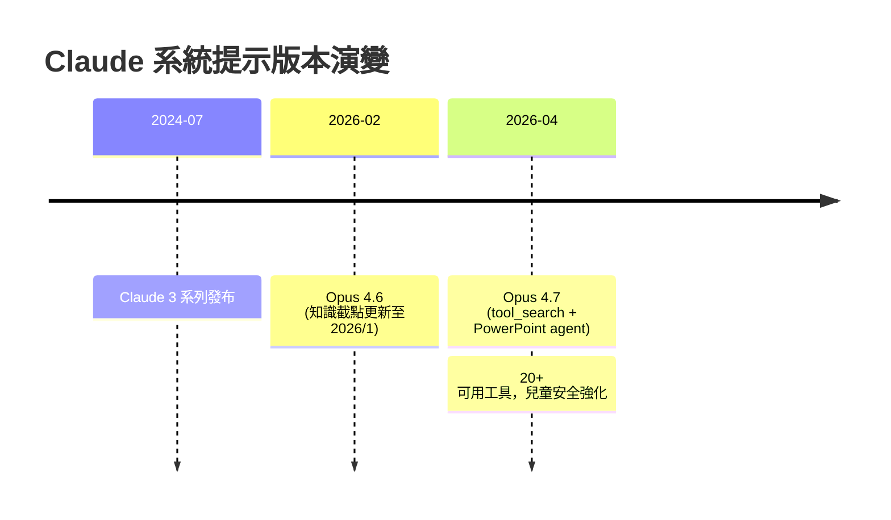
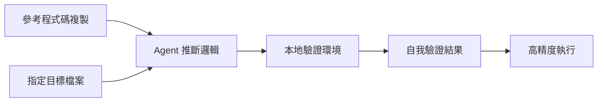

# AI Daily Digest — 2026-04-18

<!-- pipeline-generated:begin -->

## 🔥 今日 TOP 3
### 1. Claude Opus 4.7 系統提示重大更新：工具搜尋與行為強化
Anthropic 在 4 月 16 日發布 Claude Opus 4.7，系統提示相較 4.6 版本（2 月 5 日）做出多項核心改動。新增 PowerPoint agent，兒童安全指示大幅擴展並用 `<critical_child_safety_instructions>` 標籤包装，知識截點更新至 2026 年 1 月。系統可用工具逾 20 項，包括 tool_search、bash_tool、create_file、image_search 等。

最關鍵改變是新引入 `tool_search` 機制，強制 Claude 在聲稱「無法存取」前先檢查可用工具，這直接改變了 agent 解決問題的邏輯流程。同時系統提示強調更主動的解決嘗試（先試後問）、簡化冗長回應、加強防守截圖攻擊與 disordered eating 誤導。這些變更影響每個依賴 Claude 的應用與工作流，特別是 agentic 場景中模型的自主性與可靠性判斷。

開發者應立即檢視自己的 agent 邏輯是否假設舊版行為（被動等待指令），並評估 tool_search 帶來的額外工具調用成本。可利用 Simon Willison 開源的系統提示 Git timeline 工具追蹤版本演變，預先規劃應對更新的 safeguard 機制。

📖 [閱讀完整 insight](../10-insights/2026-04-18/inbox_9ba714c9.md) · 🔗 [原文連結](https://simonwillison.net/2026/Apr/18/opus-system-prompt/#atom-everything)
### 2. 三行提示實踐：參考程式碼 + 自我驗證的高效 Agent 工程
Simon Willison 展示用極簡三行提示讓 Claude Code 完成複雜任務的方法，案例為 blog-to-newsletter 工具新增 beats 內容類型支援。核心做法包括：(1) 指示 agent 複製參考程式碼到 /tmp；(2) 準確指定目標檔案；(3) 參考現成實現（如 blog 的 Atom feed 邏輯）；(4) 提供驗證機制（本地伺服器 + browser automation）；(5) 指示比較實時結果與預期結果。

這套方法相比傳統逐行說明高效得多。參考程式碼讓 agent 從實例推斷邏輯而非翻譯文字，具體驗證機制使 agent 能自我驗證而非盲目執行。結果 PR 268 正確新增 UNION SQL 子句過濾草稿與無註解的 beats，展示高效 prompt engineering 可顯著減少 agent 誤解與迭代成本。

實踐上，構建 agentic workflow 時應優先準備參考程式碼與本地驗證環境，而非冗長的文字說明。此模式適用於各類 agent-driven 開發，特別是需要高精度程式碼修改的場景。未來可預期這類最佳實踐成為 agent 工程的基礎工具包。

📖 [閱讀完整 insight](../10-insights/2026-04-18/inbox_9bed8b29.md) · 🔗 [原文連結](https://simonwillison.net/guides/agentic-engineering-patterns/adding-a-new-content-type/#atom-everything)
### 3. Claude 系統提示版本追蹤工具：Git 時間線重現
Simon Willison 創建開源工具，將 Anthropic 發布的 Markdown 系統提示轉換為按時間排列的個別檔案，並用偽造的 git commit dates 重現版本歷史。資源托管於 GitHub（simonw/research/extract-system-prompts），涵蓋 Claude 3（2024 年 7 月）至最新版本的完整演變記錄。

此工具對理解模型設計決策演變至關重要。過去追蹤系統提示演變需手動對比 markdown 文件，容易遺漏細節；現在可透過 Git 差異檢視直觀看到每版本間安全防守、行為、架構變更的具體差異。特別是面對 Claude 多版本共存的現狀（3.5 Sonnet、Opus 4.6/4.7 等），這類工具成為研究與部署決策的基礎。

研究者與開發者可利用此資源深入理解 Claude 設計邏輯的演變軌跡，評估舊版本是否仍符合合規需求，或預測未來方向。建議將此工具納入 agent 系統監測流程，以便在官方提示更新時自動觸發相容性檢查。

📖 [閱讀完整 insight](../10-insights/2026-04-18/inbox_be4f5a81.md) · 🔗 [原文連結](https://simonwillison.net/2026/Apr/18/extract-system-prompts/#atom-everything)

## 📚 分類摘要
### foundation_models
Claude 版本架構的可觀測性日趨完善。Opus 4.7（2026/4/16 發布）引入 tool_search 機制與 PowerPoint agent，相較 4.6 版本（2026/2/5 發布）系統提示擴展逾 20 個可用工具，知識截點跨越 2026 年 1 月；兒童安全指示大幅擴展並強化截圖攻擊防衛。Simon Willison 開源的 Git timeline 工具（GitHub simonw/research）則追蹤 Claude 3（2024/7）至今的完整演變，便於開發者透過差異檢視追蹤安全、行為、架構變更軌跡。

兩項動態共同推進 Claude 生態從「黑盒模型」向「可版本控制、可追蹤設計決策」的方向演進，為研究者與工程師提供了解模型演變邏輯的便利途徑。
### agents
Agentic engineering 實踐向更簡潔、更自驗證的方向演進。Simon Willison 展示的最佳實踐（PR 268）以三行提示完成複雜任務：複製參考程式碼、指定目標檔案、引用現成實現（blog Atom feed 邏輯）、提供本地驗證環境（python -m http.server + browser automation）、比較實時結果與預期。相比傳統逐行說明，此方法讓 Claude Code 從實例推斷邏輯、自我驗證結果，結果新增正確的 UNION SQL 子句過濾草稿。

Claude Code v2.1.114 同步修正 agent teams 隊友工具權限對話框當機，穩定化協作流程；兩項進展共同夯實 agent 工程的可靠性與效率基礎。

## 🎯 專欄
### 🛠 Claude Code / Codex 新功能
- [v2.1.114](../10-insights/2026-04-18/inbox_0962f69f.md) — Claude Code v2.1.114 於 2026 年 4 月 18 日發布，這是最小化修復版本。唯一改動為修正權限對話框在 agent teams 隊友請求工具權限時發生的當機問題。此版本聚焦於穩定化 agent teams 功能。
- [Adding a new content type to my blog-to-newsletter tool](../10-insights/2026-04-18/inbox_9bed8b29.md) — Simon Willison 分享 agentic engineering 最佳實踐，展示用三行簡短提示讓 Claude Code 完成複雜任務的方法。案例：更新 blog-to-newsletter.html 工具以支援新內容類型「bea
### 🚀 Frontier 模型動態
- [Anonymous request-token comparisons from Opus 4.6 and Opus 4.7](../10-insights/2026-04-18/inbox_c6d043db.md) — 無法提供摘要（缺少內容）
- [Thoughts and feelings around Claude Design](../10-insights/2026-04-18/inbox_3aced815.md) — 無法提供摘要（缺少內容）
- [Changes in the system prompt between Claude Opus 4.6 and 4.7](../10-insights/2026-04-18/inbox_9ba714c9.md) — Simon Willison 詳細分析 Claude Opus 4.7（4/16 發布）相比 4.6（2/5 發布）的系統提示變更。核心改動：新增 Claude in PowerPoint agent；兒童安全指示大幅擴展並用 `<crit
- [Claude system prompts as a git timeline](../10-insights/2026-04-18/inbox_be4f5a81.md) — Simon Willison 創建 Claude 系統提示的 Git 時間線工具，將 Anthropic 發布的 Markdown 系統提示轉換為按時間排列的個別檔案，並用偽造的 git commit dates 重現版本歷史。資源托管於 
### 🔐 AI 安全 / 濫用
_（今日無相關內容）_

<!-- pipeline-generated:end -->

<!-- user-notes -->
<!-- Write your own notes below; pipeline never touches this section. -->