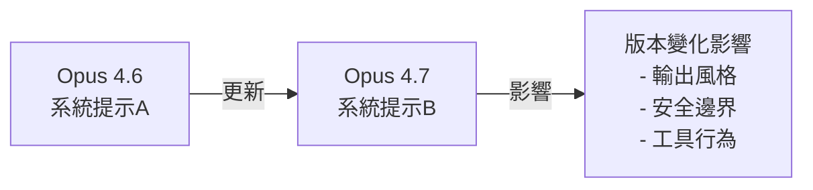
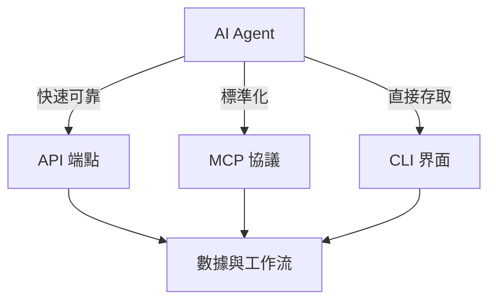

# AI Daily Digest — 2026-04-19

<!-- pipeline-generated:begin -->

## 🔥 今日 TOP 3
### 1. Claude Opus 4.7 系統提示變化
Anthropic 在 Claude Opus 4.6 和 4.7 版本間修改了系統提示。此更新反映了模型指導、安全性和性能的持續優化。

開發者依賴系統提示來確定模型行為；版本間的更新可能改變現有應用的輸出一致性和能力。對運用 Opus 進行關鍵決策的企業有直接影響。

開發者應檢視版本更新的具體項目，評估對現有 prompt 工程和工作流的影響。必要時應調整策略或進行回歸測試，以避免生產環境的意外結果。

📖 [閱讀完整 insight](../10-insights/2026-04-19/inbox_d9b01fc5.md) · 🔗 [原文連結](https://simonwillison.net/2026/Apr/18/opus-system-prompt/)
### 2. Salesforce Headless 360 顛覆 SaaS 定價
Marc Benioff 發表 Salesforce Headless 360，將 Salesforce、Agentforce 和 Slack 的全部功能暴露為 API、MCP 和 CLI。此架構讓 AI agents 無需 GUI 直接操作數據和工作流。

Headless 架構對 agents 比傳統 bot-controlled GUI 方案更快、更可靠，並可能顛覆 SaaS 按座位數定價的既有商業模式。此舉標誌整個業界向 API-first 轉變，類似 2010 年代初期的浪潮。

企業應評估現有 SaaS 工具的 API/MCP 支持程度，開始設計可直接呼叫平台 API 的 agent 工作流。同時應降低對 GUI 自動化的依賴，並準備因定價模式變化所帶來的商業影響。

📖 [閱讀完整 insight](../10-insights/2026-04-19/inbox_f96fb69f.md) · 🔗 [原文連結](https://simonwillison.net/2026/Apr/19/headless-everything/#atom-everything)
### 3. 全球 RAM 短缺限制 AI 擴展
全球 RAM 市場面臨長期短缺，預計將持續數年。先進 AI 模型的訓練和推理均需大量內存資源。

硬體短缺直接影響 AI 基礎設施擴展能力，並將顯著延遲大規模 AI 系統部署。對依賴本地 GPU 集群訓練模型的企業尤其重要。

企業應評估現有基礎設施的 RAM 容量規劃，考慮採取分散訓練策略或轉向雲端推理服務。應持續監控晶片供應鏈動向，以應對供應受限時期的成本和可用性挑戰。

📖 [閱讀完整 insight](../10-insights/2026-04-19/inbox_aca72d1e.md) · 🔗 [原文連結](https://www.theverge.com/ai-artificial-intelligence/914672/the-ram-shortage-could-last-years)

## 📚 分類摘要
### foundation_models
Claude Opus 系統提示的版本間變化反映 Anthropic 對模型行為的持續精化。Opus 4.6 至 4.7 的系統提示更新涵蓋模型指導、安全防護和性能最佳化等多個面向。開發者應注意版本升級可能改變既有應用的輸出風格和能力邊界，對依賴 Opus 進行內容生成、代碼合成或複雜推理的企業應進行系統的回歸測試。

系統提示變化可能涉及模型角色定義、工具使用方式或安全邊界的微調。建議開發團隊在升級前建立版本間的行為基準對比。應使用標準測試集驗證輸出一致性，確保業務邏輯不被意外改變。

### agents
Marc Benioff 推出的 Salesforce Headless 360 標誌著 SaaS 平台向 API-first 架構的根本轉變。Headless 服務將整個 Salesforce、Agentforce 和 Slack 生態暴露為標準 API、MCP 及 CLI，使 AI agents 能直接存取數據、工作流和任務，無需透過 GUI 自動化。相比傳統 bot-controlled mouse 方案，Headless 架構具備三大優勢：速度更快（直接 API 呼叫無需網頁渲染）、可靠性更高（無 GUI 脆弱性）、成本更低（無須模擬使用者操作）。

API 可用性預期成為 SaaS 產品的決定性競爭因素。此趨勢可能重演 2010 年代初期的 API-first 運動，並威脅現有按座位數定價模式。SaaS 廠商將被迫重新評估其產品架構和商業模式，以適應 AI agents 直接調用的新時代。

### infra
全球半導體產業面臨 RAM 供應危機，預計短缺將延續數年。高端 AI 模型的訓練和推理對記憶體需求極大；Transformer 架構需大量 VRAM 以容納中間激活值，推理時也需充足內存進行批次處理。供應緊張直接限制 AI 基礎設施規模化能力，並威脅大規模 AI 系統部署的時程。

缺乏足夠 RAM 將直接延遲或阻礙大規模 AI 系統部署。企業應評估現有基礎設施的 RAM 容量規劃，考慮採取分散訓練策略或轉向雲端推理服務。在供應受限時期，內存資源的可用性和成本將成為 AI 基礎設施決策的關鍵制約因素。

## 🎯 專欄
### 🛠 Claude Code / Codex 新功能
_（今日無相關內容）_
### 🚀 Frontier 模型動態
- [Changes in the system prompt between Claude Opus 4.6 and 4.7](../10-insights/2026-04-19/inbox_d9b01fc5.md) — Claude Opus 4.6 和 4.7 版本之間的系統提示發生了重要變化。Anthropic 在模型指導、安全性和性能方面進行了持續改進。開發者應檢視這些變化以充分理解新版本的特性差異。
### 🔐 AI 安全 / 濫用
_（今日無相關內容）_

<!-- pipeline-generated:end -->

<!-- user-notes -->
<!-- Write your own notes below; pipeline never touches this section. -->