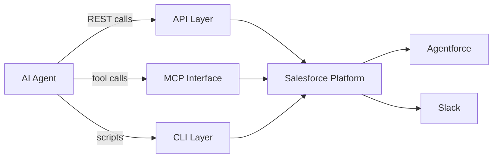
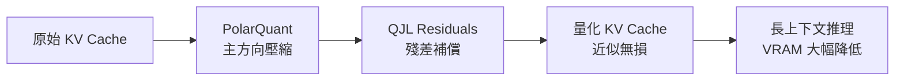

# AI Daily Digest — 2026-04-19

<!-- pipeline-generated:begin -->

## 🔥 今日 TOP 3
### 1. Proxy-Pointer RAG 架構以混合策略聲稱達成近 100% 檢索準確度
一個名為 Proxy-Pointer 的開源 RAG 架構本日發布，聲稱相較傳統純向量 RAG 實現接近 100% 的檢索準確度。架構採用結構化指標（proxy）搭配向量指針（pointer）的雙層混合設計，提供比傳統 embedding-only 方案更智能的檢索邏輯，且五分鐘內可完成設置、開箱即用。

傳統向量 RAG 的核心缺陷在於語義近似搜索對精確事實查詢不穩定，尤其當知識庫包含大量近義或重複語義條目時召回率明顯下滑。Proxy-Pointer 在向量索引之上疊加結構化指標層，理論上可同時覆蓋語義模糊查詢與精確事實查詢兩種場景，對需要高可信度輸出的金融、法律、客服等垂直應用特別具價值。

100% 準確度的聲稱需在更多真實數據集上獨立驗證——早期版本常有測試條件限制。實務建議：本週可用自有知識庫對比 Proxy-Pointer 與純向量 RAG 的 recall@k，若差距顯著且部署成本可控，值得列入下季 RAG 升級計畫。

📖 [閱讀完整 insight](../10-insights/2026-04-19/inbox_2cdef584.md) · 🔗 [原文連結](https://towardsdatascience.com/proxy-pointer-rag-structure-meets-scale-100-accuracy-with-smarter-retrieval/)
### 2. Google TurboQuant 兩階段 KV Cache 量化，近似無損大幅降低推理 VRAM 需求
Google 提出 TurboQuant，一個針對 LLM 推理設計的 KV cache 量化框架，採用 PolarQuant（處理主方向特徵）加 QJL residuals（補償殘差誤差）兩階段壓縮流程，達到近似無損儲存效果，且無需修改既有模型架構即可套用。

KV cache 是長上下文推理最主要的 VRAM 消耗來源，過去 INT4/INT8 量化方案往往以明顯精度損失換取壓縮率，導致長 context 下性能退化。TurboQuant 的近似無損特性若在生產環境驗證成立，代表同等硬體可支援更長的 context window 或更高並發請求，對推理服務成本結構影響深遠——尤其在全球 RAM 長期短缺背景下，軟體層壓縮比追加硬體更具即時可行性。

下一步觀察重點：TurboQuant 在 Llama 3、Gemma 等主流開源模型上的公開 benchmark，以及 128K+ context 長度下的實際吞吐量數據。已部署長上下文推理服務的工程師應優先追蹤後續程式碼或論文釋出。

📖 [閱讀完整 insight](../10-insights/2026-04-19/inbox_8b858dbb.md) · 🔗 [原文連結](https://towardsdatascience.com/kv-cache-is-eating-your-vram-heres-how-google-fixed-it-with-turboquant/)
### 3. Salesforce Headless 360 宣示 SaaS 平台 API-First 轉型，AI Agent 時代競爭新軸線
Salesforce CEO Marc Benioff 宣布 Salesforce Headless 360，將整個 Salesforce 平台（含 Agentforce 和 Slack）全面暴露為 REST API、MCP（Model Context Protocol）及 CLI 三層介面，讓 AI agent 無需瀏覽器即可存取所有功能。業界觀察者 Matt Webb 和 Brandur Leach 同步指出，API 呼叫比 browser automation 對 agent 更快更可靠，headless 架構正成為企業整合的主流路徑。

此轉變標誌 SaaS 平台從「人類透過 GUI 操作」到「AI agent 透過 API 呼叫」的範式轉移。傳統按用戶（per-seat）計費模式面臨根本挑戰，API/MCP 可用性從工程負擔搖身成為產品核心競爭力——提供 MCP 介面的平台對 AI agent 開發者的吸引力遠高於僅有 GUI 的競品，預示 SaaS 選型標準即將改變。

觀察重點：HubSpot、ServiceNow 等主要 SaaS 競品是否會在年內跟進 MCP 介面。對工程和採購決策者而言，現在應將 API/MCP 支援加入 SaaS 選型的優先評估標準，並評估現有工具棧的「agent-readiness」。

📖 [閱讀完整 insight](../10-insights/2026-04-19/inbox_f96fb69f.md) · 🔗 [原文連結](https://simonwillison.net/2026/Apr/19/headless-everything/#atom-everything)

## 📚 分類摘要
### foundation_models
Anthropic 針對 Claude Opus 4.7 的系統提示進行了明顯更新（inbox_d9b01fc5），涉及模型指導方針、安全邊界設定及性能調優等面向。相較 Opus 4.6，4.7 的系統提示變更反映 Anthropic 在模型行為一致性和安全強化上的最新優先事項，但具體 diff 目前未有官方公開說明，需要開發者自行比對新舊版本的實際行為差異。

對使用 Claude Opus API 的工程師而言，版本升級時應針對依賴精確指令遵從性（instruction-following）、邊界案例處理或特定安全行為的應用進行 regression 測試，不能假設上下游行為與 4.6 完全相容。建議追蹤 Anthropic 官方版本說明或社群的行為對比報告，以快速掌握差異重點並評估是否需要調整應用層的 system prompt 設計。
### agents
Salesforce Headless 360 的發布（inbox_f96fb69f）將 API-first 架構討論推向主流：Marc Benioff 宣布整個 Salesforce 生態以 REST API、MCP、CLI 三層並行暴露，代表未來 AI agent 整合企業系統的路徑將以程式介面為主，而非螢幕爬取或 browser automation。Matt Webb 和 Brandur Leach 的分析進一步指出，API-first 模式正從成本負擔轉變為 SaaS 產品差異化的核心競爭點，Salesforce 此舉可能引發同類平台的跟進效應。

開源 Proxy-Pointer RAG（inbox_2cdef584）同樣直接服務 agent 架構：當 agent 需要即時查詢知識庫時，檢索準確度直接影響輸出可靠性與幻覺率。Proxy-Pointer 的低部署門檻（5 分鐘設置）使其成為 agent RAG 後端的快速驗證選項，適合在 agent prototype 階段評估是否優於現有純向量索引方案。
### infra
Google 發布 TurboQuant KV cache 量化框架（inbox_8b858dbb），以 PolarQuant 加 QJL residuals 兩階段壓縮實現近似無損儲存，在不修改模型架構的前提下大幅降低長上下文推理的 VRAM 佔用。相較既有 INT4/INT8 單階段量化方案，兩階段設計先壓縮主方向特徵、再以殘差層補償精度損失，理論上可更接近原始精度，是目前最具潛力的推理記憶體優化方向之一。

此進展與全球 RAM 長期短缺議題（inbox_aca72d1e）直接呼應：AI 模型訓練與推理對記憶體的需求持續上升，而硬體供應受限下，軟體層壓縮技術（如 TurboQuant）成為維持 AI 基礎設施擴展能力的關鍵槓桿，比追加硬體採購更具短期可行性，值得基礎設施團隊優先評估。

## 💡 今日 Takeaway
### 1. 結構化指標與向量索引混合可同時覆蓋精確與語義兩類 RAG 查詢場景
純向量 RAG 在語義模糊查詢表現良好，但對精確事實查詢（如特定 ID、數字、專有名詞）容易出現召回不穩定，導致幻覺風險上升。Proxy-Pointer 架構以結構化指標作為精確指針、向量索引作為語義輔助，兩層各司其職，理論上可大幅降低精確查詢的幻覺風險同時保留語義召回能力。實作時先評估知識庫的結構化程度：若數據有明確欄位（如產品 ID、條款編號、交易哈希），應優先考慮加入 pointer 層以補強向量索引的不足，而非繼續堆疊更大的 embedding 模型。

_類型：tool_ · 來源：[[inbox_2cdef584]]
### 2. 主壓縮加殘差補償的兩階段設計是在精度與壓縮率之間取得平衡的通用架構模式
TurboQuant 的 PolarQuant + QJL residuals 設計揭示了一個通用原則：先以主壓縮層捕捉大部分信息、再以殘差層補償精度損失，比單一量化方法更接近無損效果。這個「粗壓縮 + 精修」的架構模式可推廣到音頻、圖像、向量嵌入等其他需要在精度和效率間取捨的壓縮場景。部署 LLM 推理服務時，若 VRAM 是主要瓶頸，應優先評估多階段 KV cache 量化方案（而非直接縮短 context 長度或升級硬體），以在成本可控的前提下維持長上下文推理能力。

_類型：technique_ · 來源：[[inbox_8b858dbb]]

## 🎯 專欄
### 🛠 Claude Code / Codex 新功能
- [0.122.0-alpha.12](../10-insights/2026-04-19/inbox_ca7b232a.md) — OpenAI Codex 發布 0.122.0-alpha.12 版本。該版本僅提供標題，未提供詳細更新說明。
- [0.122.0-alpha.11](../10-insights/2026-04-19/inbox_4e27dc04.md) — OpenAI Codex 發布 0.122.0-alpha.11 版本。該版本僅提供標題，未提供詳細更新說明。
### 📚 AI 知識管理
- [Proxy-Pointer RAG: Structure Meets Scale at 100% Accuracy with Smarter Retrieval](../10-insights/2026-04-19/inbox_2cdef584.md) — 開源 Proxy-Pointer RAG 架構，聲稱達成 100% 檢索準確度。方案結合結構化指標與向量檢索，支援 5 分鐘快速設置，提供比傳統向量 RAG 更智能的檢索邏輯，開箱即用。
### 🏢 企業導入 AI / 團隊實踐
- [The RAM shortage could last years](../10-insights/2026-04-19/inbox_aca72d1e.md) — 全球 RAM 市場面臨長期短缺問題，預計將持續多年。先進 AI 模型的訓練和推理需要大量內存資源，此硬體短缺直接威脅 AI 基礎設施的擴展能力。RAM 供應緊張可能顯著延遲或限制 AI 系統的規模部署。
- [Ask HN: How did you land your first projects as a solo engineer/consultant?](../10-insights/2026-04-19/inbox_98936c34.md) — 軟體工程師轉型為獨立顧問，協助中小企業處理後勤混亂問題，包括試算表整合、工作流最佳化與 AI 工作流應用。尋求同行建議，提供前五個客戶十小時免費諮詢。
- [Headless everything for personal AI](../10-insights/2026-04-19/inbox_f96fb69f.md) — 業界觀點認為「headless」API 驅動的服務架構將成為 AI agent 時代主流。Matt Webb 指出個人 AI 通過 API 呼叫比瀏覽器自動化體驗更佳，對 agent 更快更可靠。Salesforce CEO Marc Be
### 🎓 AI 使用技巧 / 心法
- [Changes in the system prompt between Claude Opus 4.6 and 4.7](../10-insights/2026-04-19/inbox_d9b01fc5.md) — Claude Opus 4.6 和 4.7 版本之間的系統提示發生了重要變化。Anthropic 在模型指導、安全性和性能方面進行了持續改進。開發者應檢視這些變化以充分理解新版本的特性差異。
- [Proxy-Pointer RAG: Structure Meets Scale at 100% Accuracy with Smarter Retrieval](../10-insights/2026-04-19/inbox_2cdef584.md) — 開源 Proxy-Pointer RAG 架構，聲稱達成 100% 檢索準確度。方案結合結構化指標與向量檢索，支援 5 分鐘快速設置，提供比傳統向量 RAG 更智能的檢索邏輯，開箱即用。

<!-- pipeline-generated:end -->

<!-- user-notes -->
<!-- Write your own notes below; pipeline never touches this section. -->