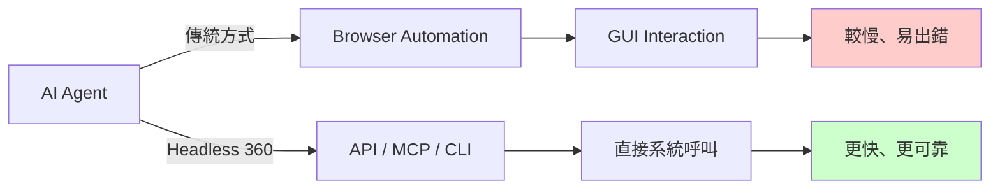

# AI Daily Digest — 2026-04-19

<!-- pipeline-generated:begin -->

## 🔥 今日 TOP 3
### 1. Headless API 架構成 AI Agent 主流
業界領袖包括 Matt Webb 和 Salesforce CEO Marc Benioff 指出，headless（無 GUI）API 驅動架構將成為 AI agent 時代主流。Salesforce 宣布 Headless 360，將整個平臺暴露為 API、MCP、CLI 介面，整個應用無需瀏覽器即可被 agent 存取。

相比瀏覽器自動化，API 呼叫對 agent 的執行速度更快、可靠性更高。這改變了整個軟體產業的商業模式：傳統 SaaS 按用戶計費的定價可能轉向按 API 呼叫，API 可用性從成本負擔轉變為競爭優勢和產品差異化的關鍵決定因素。

開發者應評估現有應用的 API 完整性和可用性，為 agent 驅動場景進行架構優化。企業應考慮如何將既有系統 headless 化，同時思考 API 計費模式對定價策略的影響。

📖 [閱讀完整 insight](../10-insights/2026-04-19/inbox_f96fb69f.md) · 🔗 [原文連結](https://simonwillison.net/2026/Apr/19/headless-everything/#atom-everything)
### 2. Claude Opus 4.7 系統提示重要更新
Anthropic 在 Claude Opus 4.7 版本中對系統提示進行了明顯更新，涵蓋模型指導、安全性和性能等多方面。這代表 Anthropic 基於用戶反饋和內部研究，對模型能力和行為進行的持續優化。

系統提示的變化直接影響模型輸出品質、安全特性和指令遵循能力。對於依賴 Claude 進行複雜任務的開發者，若未及時理解新版本差異，可能錯失性能提升或誤用新能力，甚至導致現有應用行為改變。

建議開發者立即閱讀版本公告並對比 4.6 至 4.7 的系統提示差異，特別關注安全策略和能力邊界的改變。評估自身應用是否需要調整 prompt 或升級至 4.7 以獲得最新改進。

📖 [閱讀完整 insight](../10-insights/2026-04-19/inbox_d9b01fc5.md) · 🔗 [原文連結](https://simonwillison.net/2026/Apr/18/opus-system-prompt/)
### 3. 全球 RAM 短缺威脅 AI 基礎設施擴展
業界分析指出，全球 RAM 市場面臨長期短缺問題，預計將持續多年。這源於 AI 訓練和推理對大量內存資源的需求持續增加，尤其是大規模語言模型的推理內存消耗。

內存短缺成為 AI 基礎設施擴展的硬體瓶頸，可能顯著延遲或限制大規模 AI 模型部署的進度。相比計算芯片短缺，內存短缺往往被忽視但同樣致命——無論計算能力多強，內存不足依然無法進行推理。

企業應評估現有 AI 基礎設施的內存需求和供應風險，與晶片製造商溝通優先級排序。軟體團隊應優化內存使用效率，並探索低精度量化、分批推理等技術來減少內存消耗。

📖 [閱讀完整 insight](../10-insights/2026-04-19/inbox_aca72d1e.md) · 🔗 [原文連結](https://www.theverge.com/ai-artificial-intelligence/914672/the-ram-shortage-could-last-years)

## 📚 分類摘要
### foundation_models
Anthropic 在 Claude Opus 4.7 版本推送了系統提示的重要更新，涵蓋模型指導、安全性和性能等多個維度。這反映在大型語言模型領域，持續優化和版本更新已成為主流趨勢，開發者需要密切追蹤版本變化以充分利用最新能力。
### agents
AI agent 架構正在經歷從瀏覽器自動化向 headless API 驅動的根本轉變。Salesforce Headless 360 的發布標誌著企業級應用正式擁抱 API-first 模式，將整個平臺（包括 Salesforce、Agentforce、Slack）暴露為 API、MCP、CLI 三層介面。這對 agent 的執行效率、可靠性和規模化都產生深遠影響，同時催生了按 API 呼叫計費的新商業模式，徹底改變了 SaaS 定價體系。開發者應準備將現有應用 headless 化，並評估 API 完整性在 agent 場景中的競爭優勢。
### infra
全球 RAM 市場面臨長期短缺，預計將持續數年，成為 AI 基礎設施擴展的關鍵瓶頸。AI 訓練和推理需要大量內存資源，內存短缺對大規模模型部署的影響不亞於計算芯片短缺，但往往被忽視。企業應評估內存需求、優化內存效率（如低精度量化），並與供應商協商優先級排序。

## 🎯 專欄
### 🛠 Claude Code / Codex 新功能
- [0.122.0-alpha.12](../10-insights/2026-04-19/inbox_ca7b232a.md) — OpenAI Codex 發布 0.122.0-alpha.12 版本。該版本僅提供標題，未提供詳細更新說明。
- [0.122.0-alpha.11](../10-insights/2026-04-19/inbox_4e27dc04.md) — OpenAI Codex 發布 0.122.0-alpha.11 版本。該版本僅提供標題，未提供詳細更新說明。
### 🚀 Frontier 模型動態
- [Changes in the system prompt between Claude Opus 4.6 and 4.7](../10-insights/2026-04-19/inbox_d9b01fc5.md) — Claude Opus 4.6 和 4.7 版本之間的系統提示發生了重要變化。Anthropic 在模型指導、安全性和性能方面進行了持續改進。開發者應檢視這些變化以充分理解新版本的特性差異。
### 🔐 AI 安全 / 濫用
_（今日無相關內容）_

<!-- pipeline-generated:end -->

<!-- user-notes -->
<!-- Write your own notes below; pipeline never touches this section. -->