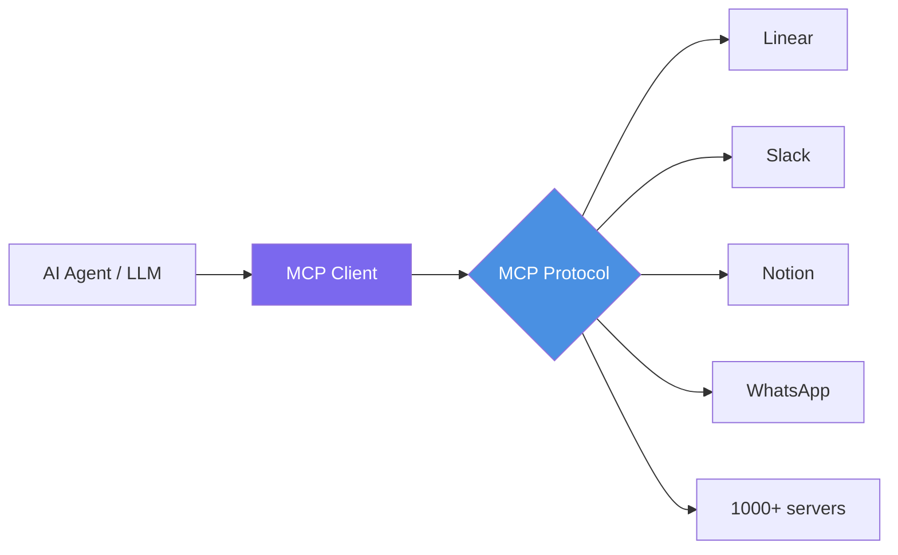
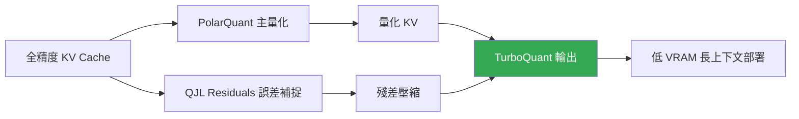

# AI Daily Digest — 2026-04-19

<!-- pipeline-generated:begin -->

## 🔥 今日 TOP 3
### 1. Google Aletheia 在 IMO-ProofBench 達 91.9%，實現自動化研究級數學形式證明
Google 發布 Aletheia（基於 Gemini 3 Deep Think 架構），在 IMO-ProofBench 達到 91.9% 準確率、FirstProof challenge 解出 10 道新穎數學問題中的 6 道。這是完全自動化、無需人工干預的研究級形式數學證明系統，代表 AI 正式跨越「生成看起來合理的答案」與「可機器驗證的形式證明」之間的鴻溝。

Aletheia 的意義不止於分數：此前 AI 在奧林匹克等級數學推理上的表現遠低於競賽水準，91.9% 意味著 AI 在結構化形式推理上已接近人類數學家的自動化能力。Gemini 3 Deep Think 的「規劃→推理→自我驗證」三段式架構是關鍵機制，使模型能偵測錯誤推理路徑並主動回溯，而非線性串流輸出；這一能力對密碼學驗證、形式規格檢驗等封閉系統具有高度遷移潛力，對比前一代模型是本質性而非量化的跨越。

下一步觀察重點：Gemini 3 Deep Think 是否開放 API 供開發者存取？類似的「推理→驗證→回溯」三段架構能否在 Google AI Studio 業界應用中落地？設計需要精確推理之 agent（法律合規審查、財務計算驗證）的團隊，現在應評估此類 deep thinking 模式是否適合納入 agent 工作流設計。

📖 [閱讀完整 insight](../10-insights/2026-04-19/inbox_9ee85f80.md) · 🔗 [原文連結](https://www.infoq.com/news/2026/04/deepmind-aletheia-agentic-math/?utm_campaign=infoq_content&utm_source=infoq&utm_medium=feed&utm_term=AI%2C+ML+%26+Data+Engineering)
### 2. MCP 月下載量達 1.1 億，David Soria Parra 公布 2026 無狀態傳輸生產路線圖
Anthropic 工程師 David Soria Parra 公開詳述 MCP（Model Context Protocol）規模：月度下載量 1.1 億次、1,000+ 伺服器整合（Linear、Slack、Notion、WhatsApp、Blender 等），18 個月成長速度超越 React 生態。路線圖確認當前處於「生產標準化」階段，2026 年將新增無狀態傳輸協議與伺服器自動發現機制，標誌 MCP 從實驗走向真正的生產基礎設施。

MCP 的核心競爭力在於架構設計原則—無狀態伺服器、標準化資源表示、可組合性—讓工具開發者真正實現「寫一次、整合到處」。相比各廠商自定義 tool calling 格式，MCP 成為統一標準的速度比 React 更快；Salesforce Headless 360 同日宣布將整個 Salesforce、Agentforce、Slack 暴露為 API、MCP、CLI 三層介面，印證 MCP 正成為 AI agent 工具生態的基礎設施而非私有格式，傳統 SaaS 按用戶計費模式同步面臨轉型壓力。

計畫為服務構建 AI agent 存取層的團隊，現在應優先評估採用 MCP 標準而非自建 API wrapper；無狀態傳輸協議落地後，Cloudflare Workers、AWS Lambda 等 serverless 環境的 MCP 部署成本將大幅下降。下一步可追蹤主流雲端平台何時提供成熟的 MCP serverless 部署範本。

📖 [閱讀完整 insight](../10-insights/2026-04-19/inbox_93d76028.md) · 🔗 [原文連結](https://www.youtube.com/watch?v=v3Fr2JR47KA)
### 3. Google TurboQuant 雙層量化實現 KV Cache 近似無損壓縮，解鎖長上下文部署
Google 發布 TurboQuant，以 PolarQuant（主量化層）加 QJL residuals（誤差補捉層）的雙層壓縮架構，實現 KV cache 的近似無損量化，支援超大上下文窗口同時大幅降低 VRAM 佔用。此方案無需修改模型架構，可直接套用於現有 LLM 推理系統，是最低摩擦力的長上下文部署優化路徑。

KV cache 是限制長上下文 LLM 部署的核心硬體瓶頸：支援 128K token 上下文時，KV cache VRAM 佔用往往超過模型權重本身。TurboQuant 透過雙層量化壓縮這部分記憶體，使相同硬體上部署更長上下文成為可能，直接影響 RAG 系統設計、多輪對話 agent 和程式碼助理的成本結構；在全球 RAM 短缺預計持續數年的宏觀背景下，此類記憶體優化技術的戰略價值進一步提升。

工程師在規劃長上下文 LLM 服務時，應將 KV cache 量化方案（如 TurboQuant）列為優先評估項，而非直接採購更多 VRAM—後者的成本遠高於軟體層優化。下一步觀察：TurboQuant 是否整合進 vLLM 或 TensorRT-LLM，以及開源實現何時釋出供獨立評估。

📖 [閱讀完整 insight](../10-insights/2026-04-19/inbox_8b858dbb.md) · 🔗 [原文連結](https://towardsdatascience.com/kv-cache-is-eating-your-vram-heres-how-google-fixed-it-with-turboquant/)

## 📚 分類摘要
### foundation_models
今日基礎模型最重大突破來自 Google Aletheia（基於 Gemini 3 Deep Think），在 IMO-ProofBench 達 91.9%、FirstProof challenge 解出 6/10 novel problems，實現完全自動化的研究級數學形式證明—無需人工干預。Gemini 3 Deep Think 的「規劃→推理→自我驗證」三段式架構使模型能偵測並回溯錯誤推理路徑，與標準 chain-of-thought 的根本差異在於「可回溯性」：推理過程是對解空間的有向搜索，而非單一路徑的線性生成。

Anthropic 同步更新了 Claude Opus 4.6 到 4.7 的系統提示，涵蓋模型能力與安全邊界的最新優化調整。雖然完整變更清單尚未全面公開，正在使用 Claude Opus API 的開發者應詳閱系統提示差異，確保現有應用程式行為不受影響。兩家頂尖 lab 的同期動向共同指向一個趨勢：2026 年的模型競爭重心正從「語言流暢度」轉向「可驗證推理能力」，Aletheia 的 IMO-ProofBench 成績與 Claude 4.7 的安全邊界優化都是此趨勢的具體體現。
### agents
MCP（Model Context Protocol）生態今日獲得重要規模確認：David Soria Parra 詳述 1.1 億月度下載量、1,000+ 伺服器整合（Linear、Slack、Notion、WhatsApp、Blender 等），18 個月成長速度超越 React 生態，路線圖確認 2026 年將新增無狀態傳輸協議和伺服器自動發現機制。MCP 核心架構的三個原則—無狀態伺服器、標準化資源表示、可組合性—讓工具開發者真正實現「寫一次、整合到處」，MCP 正式從實驗走向生產基礎設施階段。

Salesforce CEO Marc Benioff 同日宣布 Salesforce Headless 360，將整個 Salesforce、Agentforce、Slack 平台暴露為 API、MCP、CLI 三層介面，無需 GUI 即可讓 agent 直接存取。這呼應 Matt Webb 和 Brandur Leach 的「headless 優先」預測：AI agent 透過 API 呼叫比瀏覽器自動化更快更可靠，傳統 SaaS 按用戶計費模式面臨向 API 呼叫計費的轉型壓力，API 可用性正從成本負擔轉為產品差異化的競爭優勢。
### infra
今日基礎設施最值得關注的技術是 Google TurboQuant：以 PolarQuant 主量化搭配 QJL residuals 誤差補捉的雙層壓縮框架，實現近似無損的 KV cache 量化。此方案無需修改模型架構，直接解決長上下文 LLM 部署的核心硬體瓶頸—128K token 上下文時 KV cache VRAM 往往超過模型權重本身，TurboQuant 使相同硬體部署更長上下文成為可能。

開源 Proxy-Pointer RAG 架構同日發布，以結構化指標層（精確過濾）搭配向量搜尋（語意召回），聲稱達接近 100% 的檢索準確率，5 分鐘可部署，特別適合文件結構清晰的 RAG 應用（API 文件、法規條文、技術手冊）。宏觀硬體層面，全球 RAM 短缺預計持續數年，AI 訓練與推理的記憶體需求持續攀升，TurboQuant 類記憶體優化技術在此背景下具有更高戰略價值；兩項技術合計降低了長上下文推理與精確檢索的硬體門檻，對 AI 基礎設施選型具有直接參考意義。

## 🎯 專欄
### 🛠 Claude Code / Codex 新功能
- **[0.122.0-alpha.12](../10-insights/2026-04-19/inbox_ca7b232a.md)**
  OpenAI Codex 發布 0.122.0-alpha.12 版本。該版本僅提供標題，未提供詳細更新說明。
- **[0.122.0-alpha.11](../10-insights/2026-04-19/inbox_4e27dc04.md)**
  OpenAI Codex 發布 0.122.0-alpha.11 版本。該版本僅提供標題，未提供詳細更新說明。
### 📚 AI 知識管理
- **[Proxy-Pointer RAG: Structure Meets Scale at 100% Accuracy with Smarter Retrieval](../10-insights/2026-04-19/inbox_2cdef584.md)**
  開源 Proxy-Pointer RAG 架構，聲稱達成 100% 檢索準確度。方案結合結構化指標與向量檢索，支援 5 分鐘快速設置，提供比傳統向量 RAG 更智能的檢索邏輯，開箱即用。
### 🏢 企業導入 AI / 團隊實踐
- **[The RAM shortage could last years](../10-insights/2026-04-19/inbox_aca72d1e.md)**
  全球 RAM 市場面臨長期短缺問題，預計將持續多年。先進 AI 模型的訓練和推理需要大量內存資源，此硬體短缺直接威脅 AI 基礎設施的擴展能力。RAM 供應緊張可能顯著延遲或限制 AI 系統的規模部署。
- **[Ask HN: How did you land your first projects as a solo engineer/consultant?](../10-insights/2026-04-19/inbox_98936c34.md)**
  軟體工程師轉型為獨立顧問，協助中小企業處理後勤混亂問題，包括試算表整合、工作流最佳化與 AI 工作流應用。尋求同行建議，提供前五個客戶十小時免費諮詢。
- **[Headless everything for personal AI](../10-insights/2026-04-19/inbox_f96fb69f.md)**
  業界觀點認為「headless」API 驅動的服務架構將成為 AI agent 時代主流。Matt Webb 指出個人 AI 通過 API 呼叫比瀏覽器自動化體驗更佳，對 agent 更快更可靠。Salesforce CEO Marc Benioff 宣布 Salesforce Headless 360，將整個 Salesforce、Agentforce、S
- **[The Future of MCP — David Soria Parra, Anthropic](../10-insights/2026-04-19/inbox_93d76028.md)**
  David Soria Parra 介紹 MCP (Model Context Protocol)，這是連接 LLMs 到外部工具和資料的通用標準，被譽為「AI 的 USB」。MCP 已達 1.1 億月度下載量，採用三階段演進：PoC、生產標準化、高級功能（pub/sub、串流、進階發現）。核心架構強調無狀態設計、標準化資源表示和可組合性，使工具開發者「寫一
### 🎓 AI 使用技巧 / 心法
- **[Changes in the system prompt between Claude Opus 4.6 and 4.7](../10-insights/2026-04-19/inbox_d9b01fc5.md)**
  Claude Opus 4.6 和 4.7 版本之間的系統提示發生了重要變化。Anthropic 在模型指導、安全性和性能方面進行了持續改進。開發者應檢視這些變化以充分理解新版本的特性差異。
- **[Proxy-Pointer RAG: Structure Meets Scale at 100% Accuracy with Smarter Retrieval](../10-insights/2026-04-19/inbox_2cdef584.md)**
  開源 Proxy-Pointer RAG 架構，聲稱達成 100% 檢索準確度。方案結合結構化指標與向量檢索，支援 5 分鐘快速設置，提供比傳統向量 RAG 更智能的檢索邏輯，開箱即用。
- **[The Future of MCP — David Soria Parra, Anthropic](../10-insights/2026-04-19/inbox_93d76028.md)**
  David Soria Parra 介紹 MCP (Model Context Protocol)，這是連接 LLMs 到外部工具和資料的通用標準，被譽為「AI 的 USB」。MCP 已達 1.1 億月度下載量，採用三階段演進：PoC、生產標準化、高級功能（pub/sub、串流、進階發現）。核心架構強調無狀態設計、標準化資源表示和可組合性，使工具開發者「寫一
### ⛓️ 區塊鏈 / Web3
- **[0.122.0-alpha.12](../10-insights/2026-04-19/inbox_ca7b232a.md)**
  OpenAI Codex 發布 0.122.0-alpha.12 版本。該版本僅提供標題，未提供詳細更新說明。
- **[0.122.0-alpha.11](../10-insights/2026-04-19/inbox_4e27dc04.md)**
  OpenAI Codex 發布 0.122.0-alpha.11 版本。該版本僅提供標題，未提供詳細更新說明。

## 💡 今日 Takeaway

_讀完今日所有內容後，可帶走的知識點_
### 1. 深度思考的「推理→驗證→回溯」循環可突破 AI 形式推理的能力上限
Aletheia（Gemini 3 Deep Think）在 IMO-ProofBench 達 91.9% 的關鍵在於多步驟自我驗證機制：模型能偵測錯誤推理路徑並主動回溯，本質上是對解空間的搜索而非語言生成，與標準 CoT 的根本差異是「可回溯性」。設計需要精確推理的 agent（法律合規審查、財務計算驗證、形式規格檢驗）時，應考慮引入 deep thinking + formal verification 的組合模式，而非只依賴單次 CoT 輸出—後者無法偵測中間步驟的邏輯錯誤。此原則適用於任何要求「結果可驗證」而非「結果看起來合理」的 agent 設計場景。

_類型：data-point_

**參考來源**：
- [Google’s Aletheia Advances the State of the Art of Fully Autonomous Agentic Math Research](../10-insights/2026-04-19/inbox_9ee85f80.md) · [原文](https://www.infoq.com/news/2026/04/deepmind-aletheia-agentic-math/?utm_campaign=infoq_content&utm_source=infoq&utm_medium=feed&utm_term=AI%2C+ML+%26+Data+Engineering)
### 2. 粗量化＋殘差修正的雙層壓縮策略可近似無損壓縮 LLM KV Cache
TurboQuant 的 PolarQuant + QJL residuals 雙層設計體現一個通用壓縮原則：先用粗粒度量化降低主體積，再用精細殘差層補回精度損失—組合後比單一量化更接近無損，同時比全精度存儲佔用更少記憶體。此方案無需修改模型架構或重新訓練，是最低摩擦力的長上下文部署優化路徑。規劃需要 128K+ token 上下文的 LLM 服務時，應優先評估 KV cache 量化方案，而非直接採購更多 VRAM—後者成本遠高於軟體層優化，且在全球 RAM 短缺背景下可行性更低。

_類型：technique_

**參考來源**：
- [KV Cache Is Eating Your VRAM. Here’s How Google Fixed It With TurboQuant.](../10-insights/2026-04-19/inbox_8b858dbb.md) · [原文](https://towardsdatascience.com/kv-cache-is-eating-your-vram-heres-how-google-fixed-it-with-turboquant/)
### 3. 結構化索引層補向量搜尋的精確度短板，混合 RAG 召回率可接近 100%
傳統向量 RAG 在高相似度場景易出現「語意相近但指向錯誤文件」的問題，根本原因是純向量搜尋缺乏精確邊界感知能力。Proxy-Pointer 引入結構化指標層作為精確過濾器，再由向量搜尋做語意召回，兩層結合大幅提升準確率；此架構特別適合文件結構清晰的場景—API 文件、法規條文、技術手冊等的文件邊界是確定的，結構化索引的構建成本低但效果顯著。評估 RAG pipeline 準確率不足時，應優先考慮加入結構化索引層，而非直接更換向量模型或重新 fine-tune embedding。

_類型：tool_

**參考來源**：
- [Proxy-Pointer RAG: Structure Meets Scale at 100% Accuracy with Smarter Retrieval](../10-insights/2026-04-19/inbox_2cdef584.md) · [原文](https://towardsdatascience.com/proxy-pointer-rag-structure-meets-scale-100-accuracy-with-smarter-retrieval/)

<!-- pipeline-generated:end -->

<!-- user-notes -->
<!-- Write your own notes below; pipeline never touches this section. -->