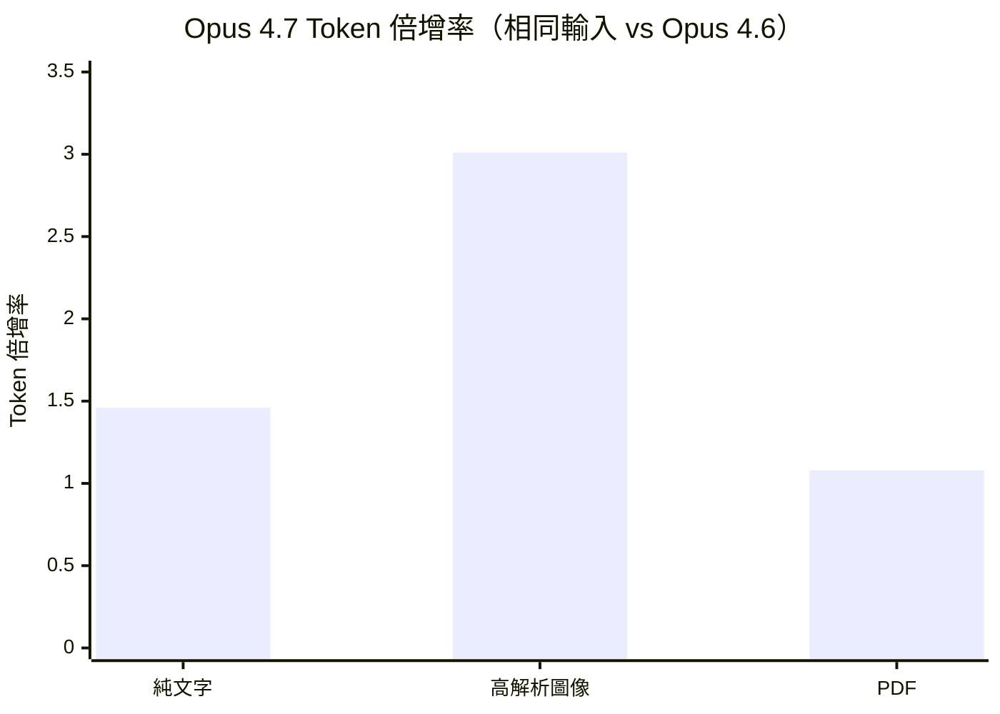

# AI Daily Digest — 2026-04-20

<!-- pipeline-generated:begin -->

## 🔥 今日 TOP 3
### 1. Claude Opus 4.7 新 Tokenizer 致使實際成本默升約 40%
Simon Willison 實測 Claude Opus 4.7 搭載的新 tokenizer，發現在定價維持 $5/百萬 token 不變的前提下，相同輸入文字的 token 計數較 Opus 4.6 增加 1.0–1.46 倍，預期實際 API 費用將上漲約 40%；官方公示的 1.0–1.35× 平均值低於實測結果。

此差距與輸入媒體類型高度相關：純文字受衝擊最大（1.46×），高解析度圖像因新增 2,576 像素支援能力造成 token 計數增加 3.01 倍，而 PDF 文件增幅相對溫和（1.08×）。這直接影響所有依照前代模型定價規劃預算的工程師與 AI 產品負責人，尤其是以文字輸入為主的應用場景。

建議在切換至 Opus 4.7 前，用 Token Counter 工具實測自身 payload 的實際增幅，而非使用官方平均值；預算模型應引入媒體類型加權的 token inflation factor，混用圖像和文字的 pipeline 需格外留意 3× 圖像倍增的累積效應。

📖 [閱讀完整 insight](../10-insights/2026-04-20/inbox_3dd12bfd.md) · 🔗 [原文連結](https://simonwillison.net/2026/Apr/20/claude-token-counts/#atom-everything)
### 2. OpenAI Codex 0.122.0：Plan Mode 獨立 Context、沙箱隔離全面強化
OpenAI Codex 0.122.0 正式發布，Plan Mode 可在全新 context 中啟動實作流程並即時顯示 context 用量，從架構上解決 long-horizon 任務中規劃與執行互相污染的問題。TUI 新增 /side 側邊對話與即時斜命令執行，讓任務切換更加流暢。

安全層面，此版本新增 deny-read glob 策略、沙箱隔離、managed deny-read 與 codex exec 獨立執行機制，補強了前版在權限控制上的空白。相比 Claude Code 同期更新以效能穩定性為主，Codex 0.122.0 在互動模式與安全邊界兩個維度同步推進，差異化更為明顯。

開發者可優先試驗 Plan Mode 的 context 可見化功能，在長任務中觀察規劃階段是否有效控制 context 消耗；安全意識較強的團隊應驗證 deny-read glob 策略是否已覆蓋既有敏感目錄。

📖 [閱讀完整 insight](../10-insights/2026-04-20/inbox_6bb7f1d4.md) · 🔗 [原文連結](https://github.com/openai/codex/releases/tag/rust-v0.122.0)
### 3. Claude Code v2.1.116：大型會話 /resume 提速 67%、MCP 啟動加速
Claude Code v2.1.116 於 4 月 20 日發布，針對 40MB+ 大型會話的 /resume 操作提速 67%，MCP 資源樣板延遲至首次 @ 提及時才載入，顯著縮短多伺服器場景的初始化時間。思考進度改為行內動態顯示（still thinking / thinking more / almost done），減少等待的視覺干擾。

此版本包含 15+ 項安全修復，涵蓋 rm/rmdir 危險路徑強化檢查、Ctrl+Z 懸掛修復、API 快取控制 TTL 排序問題修正。對長時間使用 Claude Code 的重度用戶以及同時掛載多個 MCP 伺服器的工程師，此次更新的實際使用感受改善較為明顯。

建議重度用戶立即更新；多 MCP 伺服器場景可觀察初始化日誌，確認延遲載入是否如預期生效，尤其留意首次 @ 觸發後的資源載入延遲是否在可接受範圍內。

📖 [閱讀完整 insight](../10-insights/2026-04-20/inbox_7349264c.md) · 🔗 [原文連結](https://github.com/anthropics/claude-code/releases/tag/v2.1.116)

## 📚 分類摘要
### foundation_models
本日 foundation model 領域最具操作意義的訊息來自 inbox_3dd12bfd 的 Opus 4.7 tokenizer 成本分析。Simon Willison 的實測揭示新 tokenizer 的通膨效應因媒體類型差異顯著：純文字 1.46×、高解析度圖像 3.01×、PDF 1.08×，在定價不變的情況下形成約 40% 的隱性成本增加。這對依賴 Claude API 的產品預算規劃形成直接挑戰，尤其是混用多種媒體格式的應用場景需要重新核算成本模型。

Hyatt 集團（inbox_cff6b621）宣布全球員工部署 ChatGPT Enterprise，採用 GPT-5.4 與 Codex 模型組合，是旅宿服務業迄今規模最大的企業級 AI 導入案例之一，顯示 foundation model 正從開發者工具向全員生產力工具延伸。inbox_6b2aeae7 則探討開閉源模型性能差距的評估複雜性，指出單一 benchmark 數字無法反映真實應用表現，對企業選型或研究方向決策具有參考價值。
### agents
本日 agent 工具迎來兩個值得追蹤的更新，發展方向卻出現明顯分歧。Claude Code v2.1.116（inbox_7349264c）以效能與穩定性修復為主軸：大型會話 /resume 提速、MCP 資源延遲載入、15+ 安全修復，整體目標是降低長時間工作的摩擦力而非添加新功能。OpenAI Codex 0.122.0（inbox_6bb7f1d4）則走功能擴充路線：Plan Mode 的獨立 context 執行設計、/side 側邊對話、Plugin workflows 分頁管理、deny-read glob 安全策略，同步推進互動模式、context 管理與安全邊界三個維度。

對同時使用兩個工具的開發者而言，短期內 Codex 0.122.0 的 Plan Mode context 可視化是最具差異化的功能，適合在複雜工程任務中優先試驗；Claude Code 的更新則更適合直接受益於大型會話場景的重度用戶。

## 🎯 專欄
### 🛠 Claude Code / Codex 新功能
- [v2.1.116](../10-insights/2026-04-20/inbox_7349264c.md) — Claude Code v2.1.116 於 2026 年 4 月 20 日發布，聚焦效能最佳化與穩定性改善。/resume 指令在大型會話上快速化 67%（40MB+ 會話），MCP 啟動速度提升，VS Code/Cursor/Winds
- [OpenAI helps Hyatt advance AI among colleagues](../10-insights/2026-04-20/inbox_cff6b621.md) — Hyatt 國際酒店集團在全球員工中部署 ChatGPT Enterprise，使用 GPT-5.4 和 Codex 模型提升生產力、營運效率和客户體驗。此案例展示企業級 AI 工具在大型旅宿服務業的實際應用，涵蓋員工工作流優化和營運決策支
- [rust-v0.123.0-alpha.1](../10-insights/2026-04-20/inbox_e50959de.md) — OpenAI Codex 發布 rust-v0.123.0-alpha.1 版本。該版本僅提供標題，未提供詳細更新說明。
- [0.122.0](../10-insights/2026-04-20/inbox_6bb7f1d4.md) — OpenAI Codex 0.122.0 版本發布，新增多項關鍵功能。包括：獨立安裝改進（Windows 與 Intel Mac 支援）、TUI 新增 /side 側邊對話與即時斜命令執行、Plan Mode 可在新上下文啟動實作並顯示 c
- [0.122.0-alpha.13](../10-insights/2026-04-20/inbox_f4384148.md) — OpenAI Codex 發布 0.122.0-alpha.13 版本。該版本僅提供標題，未提供詳細更新說明。
### 📚 AI 知識管理
_（今日無相關內容）_
### 🏢 企業導入 AI / 團隊實踐
- [v2.1.116](../10-insights/2026-04-20/inbox_7349264c.md) — Claude Code v2.1.116 於 2026 年 4 月 20 日發布，聚焦效能最佳化與穩定性改善。/resume 指令在大型會話上快速化 67%（40MB+ 會話），MCP 啟動速度提升，VS Code/Cursor/Winds
- [OpenAI helps Hyatt advance AI among colleagues](../10-insights/2026-04-20/inbox_cff6b621.md) — Hyatt 國際酒店集團在全球員工中部署 ChatGPT Enterprise，使用 GPT-5.4 和 Codex 模型提升生產力、營運效率和客户體驗。此案例展示企業級 AI 工具在大型旅宿服務業的實際應用，涵蓋員工工作流優化和營運決策支
- [0.122.0](../10-insights/2026-04-20/inbox_6bb7f1d4.md) — OpenAI Codex 0.122.0 版本發布，新增多項關鍵功能。包括：獨立安裝改進（Windows 與 Intel Mac 支援）、TUI 新增 /side 側邊對話與即時斜命令執行、Plan Mode 可在新上下文啟動實作並顯示 c
- [🔬 Training Transformers to solve 95% failure rate of Cancer Trials — Ron Alfa &amp; Daniel Bear, Noetik](../10-insights/2026-04-20/inbox_8e61d46b.md) — 無法處理：內容嚴重截斷。正文提及 Noetik 用 autoregressive transformers（TARIO-2）應對癌症臨床試驗 95% 失敗率，但所提供摘錄不足以構成完整分析。
### 🎓 AI 使用技巧 / 心法
- [0.122.0](../10-insights/2026-04-20/inbox_6bb7f1d4.md) — OpenAI Codex 0.122.0 版本發布，新增多項關鍵功能。包括：獨立安裝改進（Windows 與 Intel Mac 支援）、TUI 新增 /side 側邊對話與即時斜命令執行、Plan Mode 可在新上下文啟動實作並顯示 c
- [SQL functions in Google Sheets to fetch data from Datasette](../10-insights/2026-04-20/inbox_221f953b.md) — Simon Willison 分享在 Google Sheets 中使用 SQL 函數從 Datasette 實例提取資料的方法。提供三種實現方式：（1）直接使用內建的 importdata() 函數無需認證；（2）用 named func
### 🔐 AI 安全 / 濫用
_（今日無相關內容）_

<!-- pipeline-generated:end -->

<!-- user-notes -->
<!-- Write your own notes below; pipeline never touches this section. -->