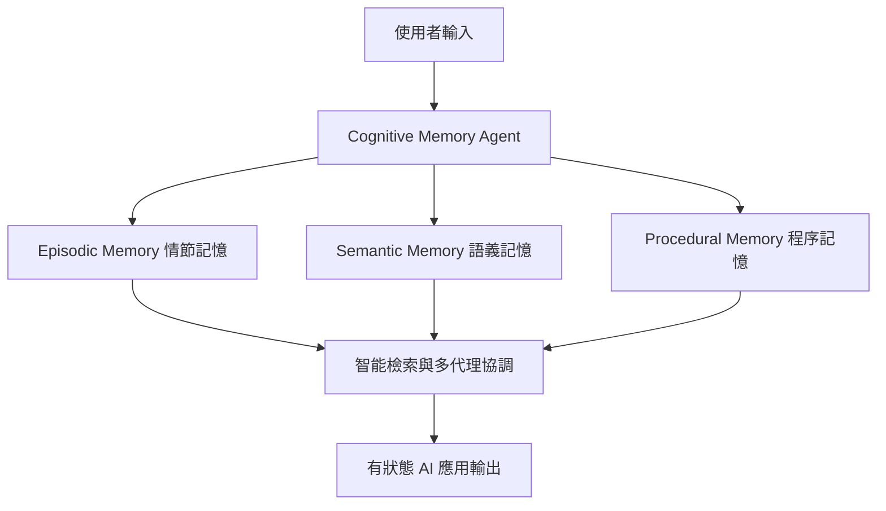

# AI Daily Digest — 2026-04-20

<!-- pipeline-generated:begin -->

## 🔥 今日 TOP 3
### 1. LinkedIn 發佈 CMA：三層記憶架構讓代理系統擁有持久記憶
LinkedIn 工程團隊正式發佈認知記憶代理（CMA），透過情節、語義、程序三層記憶架構為 AI 代理系統提供跨對話的持久記憶能力，同時支援多代理協調、智能檢索與完整生命週期管理。架構已在 LinkedIn 生產級 AI 基礎設施中部署。

LLM 本質上是無狀態的，每次對話都是孤立事件。CMA 以標準化三層分類首次在企業生產系統中系統性解決這一根本限制：情節記憶保存特定互動、語義記憶維護知識庫、程序記憶封裝執行模式，使 AI 應用能跨越對話邊界維持個性化決策與長期推理。相較過去各自為政的記憶實作，此框架提供可複用的設計語言。

設計有狀態代理系統的工程師可直接採用三層分類，明確區分不同資訊類型的儲存與檢索策略。下一步觀察重點是多代理系統如何共享語義記憶層，以及記憶過期與衝突解決的生命週期管理具體實現。

📖 [閱讀完整 insight](../10-insights/2026-04-20/inbox_f49e1919.md) · 🔗 [原文連結](https://www.infoq.com/news/2026/04/linkedin-cognitive-memory-agent/?utm_campaign=infoq_content&utm_source=infoq&utm_medium=feed&utm_term=global)
### 2. Opus 4.7 Tokenizer 升版：定價不變，文本成本實漲約 40%
Simon Willison 升級 Claude Token Counter 工具後實測 Opus 4.7 的 tokenizer 變化：相同文本輸入 token 數增加最多 1.46 倍，高分辨率圖像達 3.01 倍，PDF 文件增幅最低僅 1.08 倍，三種媒體類型呈現顯著差異。官方公示上限為 1.35 倍，實測超出。

Opus 4.7 標示定價與 4.6 相同（$5/百萬輸入 token），但 tokenizer 更換意味著文本場景下 API 預算實際需增加約 40%。這是 Anthropic 透過 tokenizer 設計而非公開調價來改變成本結構的案例，同時 Opus 4.7 支援更高解析圖像（最高 2,576 像素），但 3.01 倍 token 成本增加主要源於解析度能力本身。

遷移 Opus 4.7 前應先用 Token Counter 實測自家資料集的實際增幅，並在預算中引入 token inflation factor。PDF 密集型應用受影響最小（1.08×），混合文本 + 高解析圖像的應用需特別重新估算月支出。

📖 [閱讀完整 insight](../10-insights/2026-04-20/inbox_3dd12bfd.md) · 🔗 [原文連結](https://simonwillison.net/2026/Apr/20/claude-token-counts/#atom-everything)
### 3. Intercom 9 個月工程速度翻倍：工具×遙測×文化缺一不可
Intercom 工程副總 Brian Scanlan 揭露：團隊在 9 個月內透過系統性應用 Claude Code 實現工程速度翻倍。成果歸因三要素協同：Claude Code 提供編碼能力、深度遙測體系量化效率、組織文化鼓勵工程師快速嘗試與迭代，三者缺一不可。

案例核心洞察是單純導入工具不足以帶來量級提升。Intercom 同步建立可量化工程速度的遙測儀表板，並主動打造賦能文化——文化是 AI 增益的倍增器。這與大多數企業「採購工具卻未見明顯提升」的現象形成直接對比，說明工具之外的系統性建設才是決定因素。

正在推動工程效率的組織可以此為範本：工具部署→遙測量化→文化改變三步序列。可操作的起點是先建立工程速度的量化基線，再以數據驅動後續文化調整，而非一次性推行三項變革。

📖 [閱讀完整 insight](../10-insights/2026-04-20/inbox_5f104eb7.md) · 🔗 [原文連結](https://www.lennysnewsletter.com/p/how-intercom-2xd-their-engineering)

## 📚 分類摘要
### foundation_models
Claude Opus 4.7 的 tokenizer 變更是本週 foundation models 最具實務影響的事件。Simon Willison（inbox_3dd12bfd）實測確認：文本 token 增幅 1.46 倍、高分辨率圖像 3.01 倍、PDF 1.08 倍；定價與 4.6 相同，但文本場景預算成本實質上漲約 40%。Opus 4.7 支援最高 2,576 像素 / 3.75 百萬像素圖像（前代 3 倍），但高圖像 token 成本主要源於解析度能力本身，低解析圖像成本基本持平。

Claude Design 上週五發布後 Figma 股價下跌 7%（inbox_825968bb），量化了市場對 Anthropic 進入設計工具領域的威脅評估。競爭對手 UXPin 分析指出反應兩極化：末日論認為「設計師時代終結」，炒作論則認為不值一提；UXPin 認為真相居中，AI 設計工具在專業創意工作流的真實滲透程度需要更精確評估而非情緒性反應。Figma 的 7% 跌幅本身已是有意義的市場訊號。

Claude Code v2.1.116（inbox_7349264c）發布 15+ 項修復，重點改善大型會話 /resume 速度提升 67%（針對 40MB+ 場景）、MCP 啟動效率、以及思考進度提示改為行內動態顯示（「still thinking」/「thinking more」/「almost done」）。版本持續高頻迭代反映 Anthropic 在代理工作流基礎設施上的持續高密度投資。
### agents
LinkedIn 發佈 Cognitive Memory Agent（CMA），以三層記憶架構解決 LLM 無狀態根本限制（inbox_f49e1919、inbox_649121f7、inbox_c17cc528）。情節記憶（episodic）儲存特定互動紀錄、語義記憶（semantic）維護知識庫與關係網絡、程序記憶（procedural）封裝技能與工作流程模板，三層共同支援多代理協調與持久化上下文推理。這是本週 agents 領域最具架構影響力的發布，代表從無狀態 API 呼叫向有狀態代理系統的根本性轉變。

Gemini CLI 新增 subagents 功能（inbox_c8471438、inbox_d1cdcd98），支援複雜任務並行委派給專門代理；Google ADK for Java 1.0（inbox_d954ed4b、inbox_32ff2245）正式穩定發布，帶來外部工具整合、插件架構與 human-in-the-loop 支援。兩項發布共同反映 2026 年各大平台將多代理協調納入標準開發工具組的一致趨勢。

GitHub 展示 agentic workflow 零信任安全架構（inbox_119a3678），採取「假設 agent 已被入侵」的最嚴苛威脅模型，重設信任邊界與驗證流程。Weave 10 人 SF 新創（inbox_61ce6bfe）展示 AI 原生工程模式：75% 程式碼由 AI 生成、4-5 個審查工具並行、1 個月規劃週期應對快速變化優先級；發現 AI 在 UI 設計與架構決策上仍需人工把關，AI 輔助工程（工程師引導）優於完全自動化。
### infra
本週基礎設施洞察集中在資料庫性能的生產陷阱。inbox_c9043086 梳理 7 個「在 staging 不現身、只在生產爆發」的 DB 問題：OFFSET 分頁在 2M 列規模每月損失 $47K（遊標式分頁可 10 倍加速）、連線池洩漏每 2 小時損失 $18K、外鍵缺少索引導致 JOIN 全表掃描。inbox_c2caec8e 從審計 12 家公司的實踐出發，指出 ORM 隱藏的 N+1 查詢是最常見隱性成本——單頁 450 個查詢只需一個 JOIN 和 GROUP BY 即可解決；複合索引應精準覆蓋 WHERE 和 ORDER BY，亂加索引反而拖慢寫入。

API 層方面，inbox_d213eb1e 提供 Apollo Federation 遷移至 tRPC 的量化成果：bug 減少 89%、響應時間快 67%，日均 2.4M 請求維持 99.97% 可用性。金融級事件驅動架構最佳實踐（inbox_722d2046、inbox_2a7daf4a）重點：Inbox/Outbox 模式防止分佈式事務資料遺失、事件版本管理維持向後相容、幂等性設計確保監管約束下的最終一致性，已在支付系統生產環境驗證。

Midjourney 工程師 Cheng Lou 發布 Pretext（inbox_8fcd5032），一個 15KB TypeScript 庫，透過直接計算文字版面配置繞過 DOM 重排機制，達到 60–120 fps 的複雜 UI 渲染，使無限列表、砌體佈局和滾動位置錨定等過去受制於瀏覽器性能的 UX 模式成為可行；該庫本身是用 AI loop 反向工程 DOM 佈局演算法所建。

## 🎯 專欄
### 🛠 Claude Code / Codex 新功能
- **[v2.1.116](../10-insights/2026-04-20/inbox_7349264c.md)**
  Claude Code v2.1.116 於 2026 年 4 月 20 日發布，聚焦效能最佳化與穩定性改善。/resume 指令在大型會話上快速化 67%（40MB+ 會話），MCP 啟動速度提升，VS Code/Cursor/Windsurf 的全屏滾動更順暢，思考進度提示改為行內動態顯示（\"still thinking\"、\"thinking mo
- **[OpenAI helps Hyatt advance AI among colleagues](../10-insights/2026-04-20/inbox_cff6b621.md)**
  Hyatt 國際酒店集團在全球員工中部署 ChatGPT Enterprise，使用 GPT-5.4 和 Codex 模型提升生產力、營運效率和客户體驗。此案例展示企業級 AI 工具在大型旅宿服務業的實際應用，涵蓋員工工作流優化和營運決策支援。
- **[rust-v0.123.0-alpha.1](../10-insights/2026-04-20/inbox_e50959de.md)**
  OpenAI Codex 發布 rust-v0.123.0-alpha.1 版本。該版本僅提供標題，未提供詳細更新說明。
- **[0.122.0](../10-insights/2026-04-20/inbox_6bb7f1d4.md)**
  OpenAI Codex 0.122.0 版本發布，新增多項關鍵功能。包括：獨立安裝改進（Windows 與 Intel Mac 支援）、TUI 新增 /side 側邊對話與即時斜命令執行、Plan Mode 可在新上下文啟動實作並顯示 context 用量、Plugin workflows 支援分頁瀏覽與 inline 開關、檔案系統權限支援拒讀 glob
- **[0.122.0-alpha.13](../10-insights/2026-04-20/inbox_f4384148.md)**
  OpenAI Codex 發布 0.122.0-alpha.13 版本。該版本僅提供標題，未提供詳細更新說明。
### 📚 AI 知識管理
- **[I Failed 6 System Design Interviews in a Row — Then I Realized I Was Designing for 2026, Not 2018](../10-insights/2026-04-20/inbox_e6ceaa43.md)**
  系統設計面試在 2026 年的標準已大幅改變。舊式（2018-2022）答法強調微服務、NoSQL、分片設計；2026 實際獲勝點：(1)成本意識（AWS/GCP 月成本計算是常見追問），(2)可觀測性與故障優先（監控、故障模式、優雅降級、冪等性），(3)混合架構（單體 + 事件驅動）替代純微服務，(4)LLM/Agent 整合成新標準問題，(5)生產實踐思
- **[I Compared 4 Python Vector Databases. One Replaced Pinecone](../10-insights/2026-04-20/inbox_237e2cf5.md)**
  作者因 Pinecone 成本（200 萬向量規模時月費超 $70）轉向測試開源替代方案。在相同硬件環境（AWS EC2 c6i.2xlarge，8 vCPU/16GB RAM）上，對 Chroma、Weaviate、Qdrant、Milvus 四個 Python 向量數據庫進行實測比較，評估基準性能與開發者體驗。文章基於 200 萬個 1536 維向量（O
- **[Turing Award Winner: Postgres, Disagreeing with Google, Future Problems | Mike Stonebraker](../10-insights/2026-04-20/inbox_8201a452.md)**
  Turing Award得主Mike Stonebraker談論Postgres開發、對Google的不同意見及數據庫未來挑戰。他於1971年從Berkeley開始數據庫工作，開發Ingres（後成商業產品與Oracle競爭）、後創建Postgres以解決Ingres限制。Postgres的關鍵創新是可擴展型系統，允許任意高效的資料型態，滿足GIS和特化金融
### 🏢 企業導入 AI / 團隊實踐
- **[v2.1.116](../10-insights/2026-04-20/inbox_7349264c.md)**
  Claude Code v2.1.116 於 2026 年 4 月 20 日發布，聚焦效能最佳化與穩定性改善。/resume 指令在大型會話上快速化 67%（40MB+ 會話），MCP 啟動速度提升，VS Code/Cursor/Windsurf 的全屏滾動更順暢，思考進度提示改為行內動態顯示（\"still thinking\"、\"thinking mo
- **[OpenAI helps Hyatt advance AI among colleagues](../10-insights/2026-04-20/inbox_cff6b621.md)**
  Hyatt 國際酒店集團在全球員工中部署 ChatGPT Enterprise，使用 GPT-5.4 和 Codex 模型提升生產力、營運效率和客户體驗。此案例展示企業級 AI 工具在大型旅宿服務業的實際應用，涵蓋員工工作流優化和營運決策支援。
- **[0.122.0](../10-insights/2026-04-20/inbox_6bb7f1d4.md)**
  OpenAI Codex 0.122.0 版本發布，新增多項關鍵功能。包括：獨立安裝改進（Windows 與 Intel Mac 支援）、TUI 新增 /side 側邊對話與即時斜命令執行、Plan Mode 可在新上下文啟動實作並顯示 context 用量、Plugin workflows 支援分頁瀏覽與 inline 開關、檔案系統權限支援拒讀 glob
- **[🔬 Training Transformers to solve 95% failure rate of Cancer Trials — Ron Alfa &amp; Daniel Bear, Noetik](../10-insights/2026-04-20/inbox_8e61d46b.md)**
  無法處理：內容嚴重截斷。正文提及 Noetik 用 autoregressive transformers（TARIO-2）應對癌症臨床試驗 95% 失敗率，但所提供摘錄不足以構成完整分析。
- **[The LLM Gamble](../10-insights/2026-04-20/inbox_17b4214d.md)**
  文章分析使用 LLM 的心理吸引力，探討這種「賭博感」如何驅動用戶採納，以及它對 AI 產業的深層影響——從採用熱度、預期管理到長期產業發展的含義。
### 🎓 AI 使用技巧 / 心法
- **[0.122.0](../10-insights/2026-04-20/inbox_6bb7f1d4.md)**
  OpenAI Codex 0.122.0 版本發布，新增多項關鍵功能。包括：獨立安裝改進（Windows 與 Intel Mac 支援）、TUI 新增 /side 側邊對話與即時斜命令執行、Plan Mode 可在新上下文啟動實作並顯示 context 用量、Plugin workflows 支援分頁瀏覽與 inline 開關、檔案系統權限支援拒讀 glob
- **[SQL functions in Google Sheets to fetch data from Datasette](../10-insights/2026-04-20/inbox_221f953b.md)**
  Simon Willison 分享在 Google Sheets 中使用 SQL 函數從 Datasette 實例提取資料的方法。提供三種實現方式：（1）直接使用內建的 importdata() 函數無需認證；（2）用 named function 包裝 importdata()；（3）使用 Google Apps Script 以在 HTTP header
- **[Context Payload Optimization for ICL-Based Tabular Foundation Models](../10-insights/2026-04-20/inbox_5e1efe29.md)**
  文章介紹表格型基礎模型的 In-Context Learning (ICL) 上下文負載優化方法，提供概念概述與實踐指導。
- **[Stop Guessing Which LLM Fits Your Machine: Better Workflows for Local AI in 2026](../10-insights/2026-04-20/inbox_e8a4f942.md)**
  本地大型語言模型(LLM)的爆炸性增長已使在家運行AI變得普遍，但隨之而來的選項激增讓用戶難以判斷哪個模型最適合自己的硬體配置。文章強調盲目猜測效率低下，提供系統化的工作流來幫助選擇者根據硬體能力(CPU、GPU、記憶體等)匹配適合的本地模型。這個方法論對開發者和技術愛好者有實踐指導價值，避免試錯成本。
- **[Mythos But For Everyone. Is This Really Possible?](../10-insights/2026-04-20/inbox_b7ce2a80.md)**
  作者聲稱發現了一種新的理論方法來理解LLM的「思考」過程，試圖將這個複雜概念簡化使所有人都能理解。標題中的「Mythos But For Everyone」暗示這是對現有LLM思維模式理論的民眾化或重新詮釋。文章可能提供了LLM行為的新視角或簡化的思考框架，挑戰了以往對「模型如何思考」的既有認知。儘管摘段不完整，但核心主張指向一個新的概念框架。
### 💳 支付 / Fintech
- **[Presentation: Event-Driven Patterns for Cloud-Native Banking - What Works, What Hurts?](../10-insights/2026-04-20/inbox_722d2046.md)**
  Chris Tacey-Green 分享金融級事件驅動架構的實踐經驗，特別強調在高度監管環境中從同步命令向非同步事件的轉變。演講詳解 Inbox 和 Outbox 模式如何防止數據丟失、事件版本管理的細節、跨域解耦的原則，以及容錯和最終一致性的「battle-tested」實踐。此內容適用於支付系統、銀行業務等對可靠性和合規性要求極高的場景。
- **[Presentation: Event-Driven Patterns for Cloud-Native Banking - What Works, What Hurts?](../10-insights/2026-04-20/inbox_2a7daf4a.md)**
  Chris Tacey-Green 演講探討在高度監管環境中實現事件驅動架構的最佳實踐。重點強調 Inbox 及 Outbox 模式對防止分佈式事務中資料遺失的關鍵作用，深入解析事件版本控制如何保持向後相容與領域解耦。分享經實戰驗證的容錯原則與最終一致性管理策略，直接適用於支付系統等對可靠性要求極高的金融場景。避免同步命令轉向非同步事件的常見陷阱。
- **[Java News Roundup: OpenJDK JEPs, Jakarta EE 12, Spring Framework, Micrometer, Camel, JBang](../10-insights/2026-04-20/inbox_bd45b534.md)**
  本週Java生態發布了多項更新，包括OpenJDK新增JEPs提案、Jakarta EE 12進展、Spring Framework安全補丁（修復CVE漏洞）、Micrometer Metrics首個候選版本，以及Apache Grails、Apache Camel和JBang的點版本發布。同時，Eclipse Store和Eclipse Serialize
### ⛓️ 區塊鏈 / Web3
- **[OpenAI helps Hyatt advance AI among colleagues](../10-insights/2026-04-20/inbox_cff6b621.md)**
  Hyatt 國際酒店集團在全球員工中部署 ChatGPT Enterprise，使用 GPT-5.4 和 Codex 模型提升生產力、營運效率和客户體驗。此案例展示企業級 AI 工具在大型旅宿服務業的實際應用，涵蓋員工工作流優化和營運決策支援。
- **[rust-v0.123.0-alpha.1](../10-insights/2026-04-20/inbox_e50959de.md)**
  OpenAI Codex 發布 rust-v0.123.0-alpha.1 版本。該版本僅提供標題，未提供詳細更新說明。
- **[0.122.0](../10-insights/2026-04-20/inbox_6bb7f1d4.md)**
  OpenAI Codex 0.122.0 版本發布，新增多項關鍵功能。包括：獨立安裝改進（Windows 與 Intel Mac 支援）、TUI 新增 /side 側邊對話與即時斜命令執行、Plan Mode 可在新上下文啟動實作並顯示 context 用量、Plugin workflows 支援分頁瀏覽與 inline 開關、檔案系統權限支援拒讀 glob
- **[0.122.0-alpha.13](../10-insights/2026-04-20/inbox_f4384148.md)**
  OpenAI Codex 發布 0.122.0-alpha.13 版本。該版本僅提供標題，未提供詳細更新說明。
- **[Context Payload Optimization for ICL-Based Tabular Foundation Models](../10-insights/2026-04-20/inbox_5e1efe29.md)**
  文章介紹表格型基礎模型的 In-Context Learning (ICL) 上下文負載優化方法，提供概念概述與實踐指導。
### 🔐 AI 安全 / 濫用
- **[The Security Architecture of GitHub Agentic Workflow](../10-insights/2026-04-20/inbox_119a3678.md)**
  GitHub 打造的 agentic workflow 安全架構採取了前瞻性的威脅假設——假定代理已被入侵——進而重新設計信任邊界和驗證流程。此方式打破傳統外圍防禦思維，改採零信任模型進行架構設計。文章深入探討在此假設下的具體安全實施機制，對於構建可信任 agent 系統有重要啟示。

## 💡 今日 Takeaway

_讀完今日所有內容後，可帶走的知識點_
### 1. 記憶分三層：情節 / 語義 / 程序，分層儲存才能高效檢索
LLM 無狀態問題的系統解法不是強化單一記憶庫，而是按資訊性質分層：情節記憶存特定互動事件、語義記憶存知識和關係、程序記憶存可重用執行模式。三層各自服務不同查詢需求，也各有最適儲存與檢索機制（向量搜尋 vs. 圖資料庫 vs. 工作流模板）。設計多代理系統時，此框架可用來決定哪些狀態應跨代理共享（語義層）、哪些應隔離（情節層），避免狀態污染與上下文混淆。

_類型：framework_

**參考來源**：
- [Designing Memory for AI Agents: Inside Linkedin’s Cognitive Memory Agent](../10-insights/2026-04-20/inbox_f49e1919.md) · [原文](https://www.infoq.com/news/2026/04/linkedin-cognitive-memory-agent/?utm_campaign=infoq_content&utm_source=infoq&utm_medium=feed&utm_term=global)
- [Designing Memory for AI Agents: Inside Linkedin’s Cognitive Memory Agent](../10-insights/2026-04-20/inbox_649121f7.md) · [原文](https://www.infoq.com/news/2026/04/linkedin-cognitive-memory-agent/?utm_campaign=infoq_content&utm_source=infoq&utm_medium=feed&utm_term=AI%2C+ML+%26+Data+Engineering)
- [Designing Memory for AI Agents: Inside Linkedin’s Cognitive Memory Agent](../10-insights/2026-04-20/inbox_c17cc528.md) · [原文](https://www.infoq.com/news/2026/04/linkedin-cognitive-memory-agent/?utm_campaign=infoq_content&utm_source=infoq&utm_medium=feed&utm_term=Architecture+%26+Design)
### 2. Context window 品質 > 數量：資訊相關性遞減才是長對話衰退真因
填滿 context window 不等於提升模型表現——資訊飽和與相關性遞減是更根本的限制。長對話品質下降的真正機制是模型難以從海量低相關資訊中萃取信號，而非容量耗盡。實務上，策略性選擇高相關資訊置入上下文，定期刪除過時或低相關的對話段落，往往比增加上下文數量更能提升輸出品質。

_類型：framework_

**參考來源**：
- [AI without illussions (3/20): Context windows, memory, and why models seem to forget](../10-insights/2026-04-20/inbox_a052c732.md) · [原文](https://blog.stackademic.com/ai-without-illussions-3-20-context-windows-memory-and-why-models-seem-to-forget-e8a311cdbf35?source=rss----d1baaa8417a4---4)
### 3. Zero-trust Agent 架構：假設 Agent 已被入侵，重建信任邊界
傳統外圍防禦思維不適用於 agentic workflow——agent 可能在執行過程中遭受提示注入或工具鏈攻擊。最有效的安全架構轉向最嚴苛假設：「agent 本體已被入侵」，信任驗證因此不依賴 agent 自我報告，而在每個邊界點進行獨立驗證。實務上這意味著設計多層驗證流程、最小化代理權限範圍（least privilege），以及在高風險操作前引入人工確認節點。

_類型：framework_

**參考來源**：
- [The Security Architecture of GitHub Agentic Workflow](../10-insights/2026-04-20/inbox_119a3678.md) · [原文](https://blog.bytebytego.com/p/the-security-architecture-of-github)
### 4. OFFSET 分頁是百萬列下的成本陷阱，遊標分頁可 10x 加速
OFFSET 分頁在列數規模大時每次掃描的資料量隨 OFFSET 值線性成長，百萬列後成本爆炸（實際案例每月損失 $47K）；改用遊標式分頁（keyset pagination）可達 10 倍加速且成本恆定。連線池洩漏同樣隱蔽：連線未釋放讓新請求排隊，一次事故可損失 $18K/2 小時；確保所有 DB 連線在 try-with-resources 或 finally 區塊中釋放可完全預防。兩個問題都可透過 pg_stat_statements 或慢查詢監控在生產前早期發現。

_類型：pattern_

**參考來源**：
- [The 7 Database Mistakes That Quietly Kill Performance (And Nobody Notices Until It’s Too Late)](../10-insights/2026-04-20/inbox_c9043086.md) · [原文](https://blog.stackademic.com/the-7-database-mistakes-that-quietly-kill-performance-and-nobody-notices-until-its-too-late-e5045bb94184?source=rss----d1baaa8417a4---4)
- [The “Senior” Dev Who Doesn’t Know SQL is a Liability](../10-insights/2026-04-20/inbox_c2caec8e.md) · [原文](https://blog.stackademic.com/the-senior-dev-who-doesnt-know-sql-is-a-liability-d1188440c3b9?source=rss----d1baaa8417a4---4)
### 5. Text-to-SQL 公開基準 80%+ 無法外推生產環境——實際得分可低至 0%
公開基準（如 Spider）的查詢平均 20 行、schema 命名規範；但生產資料倉庫 schema 使用非記憶性欄位名、查詢常超過 100 行、資料含訓練集缺失的特殊分佈，導致 LLM 得分從 80%+ 跌至 0%（加入 RAG 後改善至約 10%）。在實際部署 Text-to-SQL 系統前，必須以生產 schema 的真實查詢集做內部評估，不能直接以公開基準分數作決策依據；schema 文件化品質是比模型選擇更關鍵的準備工作。

_類型：data-point_

**參考來源**：
- [Turing Award Winner: Postgres, Disagreeing with Google, Future Problems | Mike Stonebraker](../10-insights/2026-04-20/inbox_8201a452.md) · [原文](https://www.developing.dev/p/turing-award-winner-postgres-disagreeing)

<!-- pipeline-generated:end -->

<!-- user-notes -->
<!-- Write your own notes below; pipeline never touches this section. -->