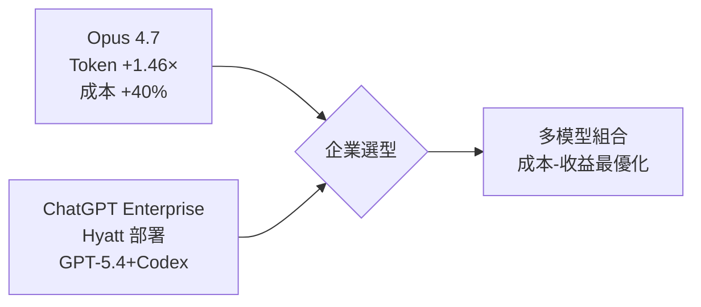
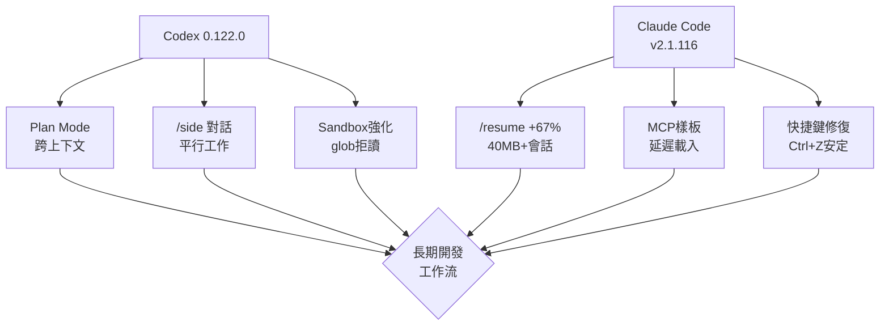

# AI Daily Digest — 2026-04-20

<!-- pipeline-generated:begin -->

## 🔥 今日 TOP 3
### 1. Opus 4.7 新 Tokenizer：1.46× 文本成本升幅、定價不變 40% 隱形漲價
Claude Opus 4.7 採用新 tokenizer，同等文本輸入的 token 數增加 1.0–1.46 倍。Simon Willison 升級 Token Counter 工具進行詳細對比測試，發現定價與 4.6 相同（輸入 $5 /百萬 token），但預期實際成本增加約 40%。同時支持最高 2,576 像素、3.75 百萬像素圖像，較前代增 3 倍。

對依賴 Claude API 的應用開發者與成本監控人員而言，這是重大的經濟決策點。token 增幅並非均勻分布——文本增幅 1.46 倍，高分辨率圖像成本增 3.01 倍（主要因分辨率能力），而 PDF 文檔僅增 1.08 倍。這表明新 tokenizer 針對多模態能力做了優化，但對純文本應用的邊際成本更高。

應用團隊應立即量化自身工作負載對 4.7 的敏感度——文本密集型應用應評估是否升級，成本增幅可能達 40%。建議透過 Token Counter 工具模擬遷移成本。高分辨率圖像能力對文檔 OCR、視覺理解等應用開啟新機會，但須權衡成本與收益。

📖 [閱讀完整 insight](../10-insights/2026-04-20/inbox_3dd12bfd.md) · 🔗 [原文連結](https://simonwillison.net/2026/Apr/20/claude-token-counts/#atom-everything)
### 2. Codex 0.122.0：跨上下文計畫實作 + 檔案系統沙箱強化
OpenAI Codex 0.122.0 推出三項核心改進：（1）Plan Mode 可在新上下文啟動實作並顯示 context 用量；（2）TUI 新增 /side 側邊對話與 ! shell 提示支援，背景執行斜命令；（3）檔案系統權限新增拒讀 glob、沙箱隔離、managed deny-read。並包含 token 撤銷、專案 hooks 信任驗證等 15+ 項安全改善。

這次更新針對長上下文應用的可見性與安全進行了重大改善。Plan Mode 跨上下文實作代表 AI 輔助開發流程的成熟化——計畫與執行可分離，context 預算可預測，避免長期任務的上下文爆炸。檔案系統沙箱強化對企業採用至關重要，特別是在 DevOps、基礎設施自動化等需要代碼執行的場景，符合零信任安全模型。

IDE 集成方應評估如何在分割面板中展示新的 /side 側邊對話，提升多工具協作體驗。開發團隊應設定專案 hooks 信任策略，避免 prompt injection。基礎設施任務應調整檔案系統白名單，利用新的 deny-read glob 規則強化隔離邊界。

📖 [閱讀完整 insight](../10-insights/2026-04-20/inbox_6bb7f1d4.md) · 🔗 [原文連結](https://github.com/openai/codex/releases/tag/rust-v0.122.0)
### 3. Claude Code v2.1.116：40MB+ 會話 /resume 快速化 67%
Anthropic 發布 Claude Code v2.1.116，重點優化大型會話性能。/resume 指令在 40MB+ 會話上快速化 67%，特別優化多分支場景；MCP 資源樣板推遲到首次 @ 提及時載入，提升多伺服器啟動效率；VS Code/Cursor/Windsurf 終端滾動改善，Kitty 鍵盤協議（iTerm2/Ghostty/kitty/WezTerm）下 Ctrl+Z/Cmd+Left/Right 修復；思考進度提示改為行內動態顯示（"still thinking"、"thinking more"、"almost done"）。

對長期、多分支開發工作流而言，/resume 加速 67% 意味著上下文恢復時間從分鐘級降至秒級，大幅降低開發中斷成本。MCP 樣板延遲載入與終端滾動改善提升了多工具場景的流暢度。安全修復涵蓋終端快捷鍵與排版穩定性，減少實務中的卡頓與重複操作浪費。

VS Code/Cursor/Windsurf 使用者應在下一次更新後測試 /resume 效果，驗證是否能接受多周長期分支而無需頻繁重啟。MCP 多伺服器環境使用者應觀察首次 @ 提及時的載入體驗改善。對高頻 Ctrl+Z 操作的工作流（快速迭代、重複試驗），應驗證懸掛修復是否消除。

📖 [閱讀完整 insight](../10-insights/2026-04-20/inbox_7349264c.md) · 🔗 [原文連結](https://github.com/anthropics/claude-code/releases/tag/v2.1.116)

## 📚 分類摘要
### foundation_models
Anthropic 與 OpenAI 在基礎模型層面的競爭動態明顯。Claude Opus 4.7 新 tokenizer 與高分辨率圖像支援（最高 3.75 百萬像素）展現多模態能力的加速，但帶來成本權衡：文本 token 增 1.46 倍、定價不變，實際成本增 40%；高分辨率圖像成本增 3.01 倍；PDF 僅增 1.08 倍。同時，Hyatt 國際酒店集團全球部署 ChatGPT Enterprise（搭配 GPT-5.4 與 Codex 模型），展示企業級 AI 工具在旅宿營運中的實際應用——從員工生產力到客户體驗均有涵蓋。這反映企業選型趨勢：不再局限於單一模型，而是組合策略以適應多元業務場景。

### agents
開發工具層的改進圍繞三個主軸：（1）計畫與執行分離——Codex 0.122.0 的 Plan Mode 跨上下文實作與 context 預算可見化，避免長期任務失控；（2）多工具協作——Claude Code 的 MCP 樣板延遲載入使多伺服器啟動更快，Codex 的 /side 側邊對話支援平行任務；（3）安全邊界強化——Codex 檔案系統沙箱新增拒讀 glob、managed deny-read，Claude Code 修復 15+ 安全與邊界情況問題。特別是 /resume 快速化 67%（40MB+ 會話）與 MCP 啟動改進，使長期多分支開發與複雜工具組合變得可實用，降低開發流程的中斷成本與工具切換摩擦。

## 🎯 專欄
### 🛠 Claude Code / Codex 新功能
- [v2.1.116](../10-insights/2026-04-20/inbox_7349264c.md) — Claude Code v2.1.116 於 2026 年 4 月 20 日發布，聚焦效能最佳化與穩定性改善。/resume 指令在大型會話上快速化 67%（40MB+ 會話），MCP 啟動速度提升，VS Code/Cursor/Winds
- [OpenAI helps Hyatt advance AI among colleagues](../10-insights/2026-04-20/inbox_cff6b621.md) — Hyatt 國際酒店集團在全球員工中部署 ChatGPT Enterprise，使用 GPT-5.4 和 Codex 模型提升生產力、營運效率和客户體驗。此案例展示企業級 AI 工具在大型旅宿服務業的實際應用，涵蓋員工工作流優化和營運決策支
- [rust-v0.123.0-alpha.1](../10-insights/2026-04-20/inbox_e50959de.md) — OpenAI Codex 發布 rust-v0.123.0-alpha.1 版本。該版本僅提供標題，未提供詳細更新說明。
- [0.122.0](../10-insights/2026-04-20/inbox_6bb7f1d4.md) — OpenAI Codex 0.122.0 版本發布，新增多項關鍵功能。包括：獨立安裝改進（Windows 與 Intel Mac 支援）、TUI 新增 /side 側邊對話與即時斜命令執行、Plan Mode 可在新上下文啟動實作並顯示 c
- [0.122.0-alpha.13](../10-insights/2026-04-20/inbox_f4384148.md) — OpenAI Codex 發布 0.122.0-alpha.13 版本。該版本僅提供標題，未提供詳細更新說明。
### 🚀 Frontier 模型動態
- [OpenAI helps Hyatt advance AI among colleagues](../10-insights/2026-04-20/inbox_cff6b621.md) — Hyatt 國際酒店集團在全球員工中部署 ChatGPT Enterprise，使用 GPT-5.4 和 Codex 模型提升生產力、營運效率和客户體驗。此案例展示企業級 AI 工具在大型旅宿服務業的實際應用，涵蓋員工工作流優化和營運決策支
- [Claude Token Counter, now with model comparisons](../10-insights/2026-04-20/inbox_3dd12bfd.md) — Simon Willison 升級 Claude Token Counter 工具，支持跨模型 token 計數對比。Claude Opus 4.7 採用新 tokenizer，輸入相同內容時 token 數增加 1.0–1.46 倍（官方
### 🔐 AI 安全 / 濫用
_（今日無相關內容）_

<!-- pipeline-generated:end -->

<!-- user-notes -->
<!-- Write your own notes below; pipeline never touches this section. -->