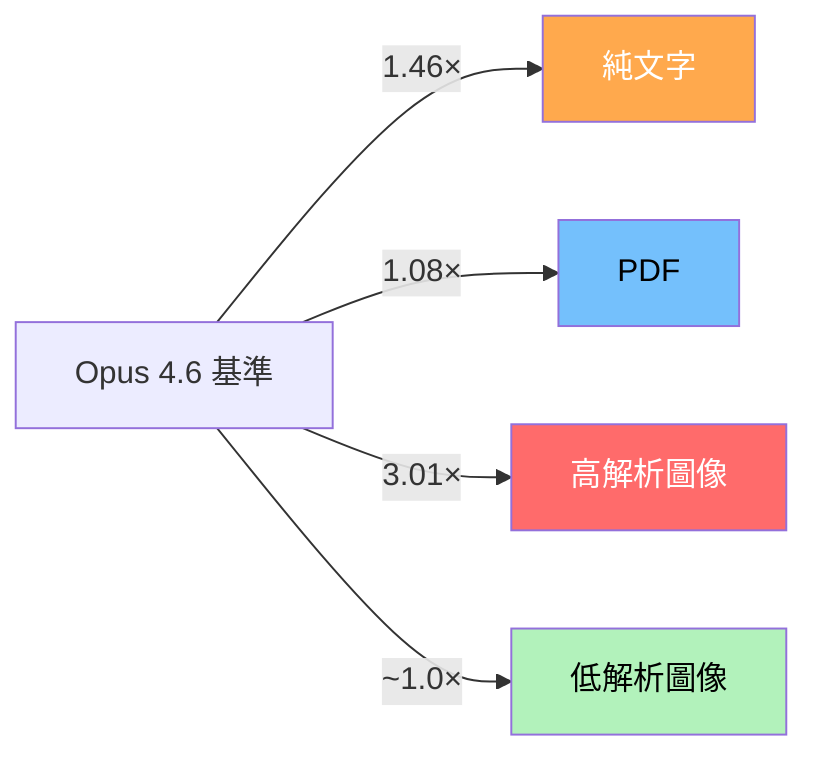
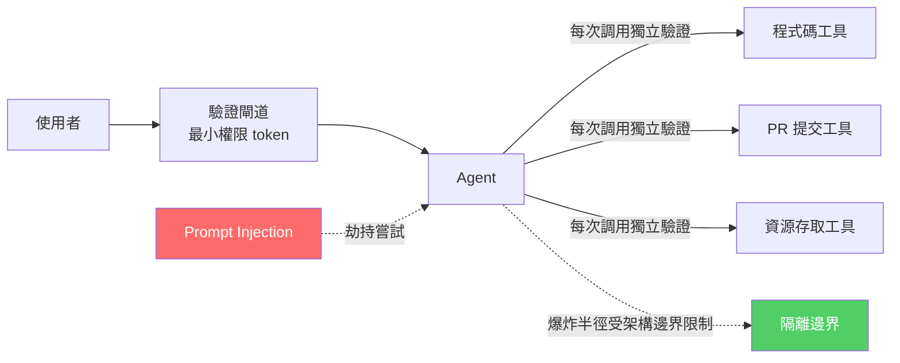

# AI Daily Digest — 2026-04-20

<!-- pipeline-generated:begin -->

## 🔥 今日 TOP 3
### 1. Opus 4.7 新 Tokenizer 導致相同輸入成本靜默上升約 40%
Simon Willison 對 Claude Opus 4.7 的新 tokenizer 進行系統性實測，發現在定價維持 $5/百萬 token 不變的情況下，相同輸入的 token 數比 Opus 4.6 增加 1.0–1.46 倍；純文字增幅最高達 1.46×，高解析圖像因新增最高 2,576px 支援增加 3.01×，PDF 影響最小僅 1.08×。

這種「定價不變但 token 膨脹」的組合，對大量使用文字工作流的 API 消費者意味著月帳單將在不更改任何程式碼的情況下自動上升約 40%，且這個數字因 payload 組成不同而顯著差異——混用高解析圖像的工作流成本增幅可能遠超此數字，相比之下 PDF 密集型工作流幾乎不受影響。

規劃 Opus 4.7 遷移預算時，應引入「token inflation factor」作為基準線，建議在遷移前對代表性 payload（特別是文字密集型 prompt）先執行 token 計數對比，並依 payload 類型分別建立成本模型，而非一律套用舊費率直接估算。

📖 [閱讀完整 insight](../10-insights/2026-04-20/inbox_3dd12bfd.md) · 🔗 [原文連結](https://simonwillison.net/2026/Apr/20/claude-token-counts/#atom-everything)
### 2. Intercom 九個月工程速度翻倍：工具＋遙測＋文化缺一不可
Intercom 工程團隊在 Brian Scanlan 帶領下，透過導入 Claude Code 在 9 個月內實現工程速度翻倍。與多數「AI 工具提升個人效率」的案例不同，Intercom 同步建立了三個支柱：以 Claude Code 加速開發流程、建立深度遙測體系持續量化工程速度、以及培養賦能工程師快速出貨的組織文化。

這三個要素互為條件——工具提供能力，遙測提供決策依據，文化決定工具是否被深度採納。任何一環缺失，生產力提升就只能停留在個人層面而無法系統化複製，這也解釋了為何眾多企業採購了相同工具卻未能取得同等成果。

有意複製此模式的工程組織應先建立可量化工程速度的遙測基線（如 DORA 指標），確認決策迴路就位後再全面導入 AI 工具，而非以採購工具作為起點；同時需評估組織文化是否允許工程師在 AI 輔助下快速出貨而無需繁瑣的人工審查流程。

📖 [閱讀完整 insight](../10-insights/2026-04-20/inbox_5f104eb7.md) · 🔗 [原文連結](https://www.lennysnewsletter.com/p/how-intercom-2xd-their-engineering)
### 3. GitHub 提出零信任 Agent 安全架構：假設代理已被入侵
GitHub 在構建 agentic workflow 的安全架構時，採用「假設 agent 已被入侵」的最嚴苛威脅模型重新設計信任邊界與驗證流程，而非沿用傳統的外圍防禦假設。

這個設計哲學的轉變意義重大：隨著 AI agents 開始執行 PR 提交、程式碼撰寫、資源存取等高權限操作，任何依賴單點邊界防禦的架構都暴露在 prompt injection 或惡意輸入劫持的風險下；相比之下，多層驗證加架構級隔離能確保被劫持的 agent 僅在預授權的窄範圍內造成破壞，有效限制爆炸半徑。

正在設計 agentic 系統的工程師應立即審視：agent 的工具權限是否符合最小化原則？每個工具調用是否有獨立驗證層？是否有機制能在 agent 行為異常時中斷執行鏈？GitHub 的框架可作為重新評估現有 agent 安全邊界的具體起點。

📖 [閱讀完整 insight](../10-insights/2026-04-20/inbox_119a3678.md) · 🔗 [原文連結](https://blog.bytebytego.com/p/the-security-architecture-of-github)

## 📚 分類摘要
### foundation_models
Claude Opus 4.7 的新 tokenizer 是本日最具成本影響力的議題。Simon Willison（inbox_3dd12bfd）透過 Claude Token Counter 工具實測，確認相同輸入在 Opus 4.7 下 token 數增加 1.0–1.46 倍，預期整體成本上升約 40%——差異因內容類型而異：純文字 1.46×、高解析圖像 3.01×、PDF 1.08×。由於定價與 Opus 4.6 相同（$5/百萬 token），這是一個隱性的成本結構變化，所有正在或計劃遷移至 Opus 4.7 的消費者都需要重新核算預算。

Claude Design 的上市引發市場重新評估 AI 設計工具的威脅程度（inbox_825968bb）：Figma 股價應聲下跌 7%，競爭對手 UXPin 提供了較平衡的觀點——市場反應可能過度，但威脅亦非純屬炒作，AI 在專業創意領域的滲透已進入可量化衝擊階段。企業部署端，Hyatt 全球員工採用 ChatGPT Enterprise（inbox_cff6b621），採用 GPT-5.4 與 Codex 組合，涵蓋員工工作流優化和營運決策支援，是旅宿服務業的旗艦部署案例。
### agents
工具層本日有兩大版本發布，方向均指向「更安全、更可控的 agentic 執行」。Claude Code v2.1.116（inbox_7349264c）專注效能與穩定性：大型會話（40MB+）的 /resume 速度提升 67%，MCP 資源改為惰性載入（首次 @ 提及時才載入），顯著改善多伺服器啟動效率，思考進度提示改為行內動態顯示。OpenAI Codex 0.122.0（inbox_6bb7f1d4）帶來 Plan Mode 在獨立 context 執行實作並顯示 context 用量、/side 側邊對話、檔案系統 deny-read glob 策略與沙箱隔離——兩款工具的演進路徑高度平行，都在向「規劃與執行分離、權限顆粒度收緊」邁進。

實際部署案例提供了量化基準。Intercom（inbox_5f104eb7）在 9 個月內實現工程速度 2×，核心是工具、遙測、文化三元組；AI 原生新創 Weave（inbox_61ce6bfe）展示 75% AI 程式碼的日常運作，並坦率指出 AI 在 UI 設計（不符合自定設計系統）和架構決策（context 限制）上的明顯弱點，強調「工程師引導 AI 流程」優於完全自動化——新工程師初期逐行審查、隨表現快速遞減審查密度是其落地策略。

安全架構方面，GitHub（inbox_119a3678）提出零信任 agent 框架，要求假設 agent 已被入侵、從架構層設計爆炸半徑上限，對正在生產部署 agentic workflow 的團隊具有直接參考價值。

### infra
資料庫效能議題有兩則高密度內容。ORM 陷阱分析（inbox_c2caec8e）提供了 12 年跨 12 家公司的審計數據：單頁 450 查詢、每月 $15k 浪費是常態，根本原因是開發者在 ORM 抽象後看不見 N+1 問題。解法始終是讀懂 EXPLAIN ANALYZE、設計複合索引精確覆蓋 WHERE＋ORDER BY、使用 keyset 分頁取代 OFFSET——一個 JOIN 加 GROUP BY 通常比添購伺服器便宜幾個數量級。連線池設計失當（100 連線上限 vs 150 K8s pods 自動擴容）同樣是設計問題而非容量問題。

Turing Award 得主 Mike Stonebraker（inbox_8201a452）的訪談揭露了 Text-to-SQL 的生產現實落差：公開基準 LLM 達 80%+，但真實生產倉庫得分 0%（加 RAG 僅到 10%）。差距來自 schema 欄位名稱語義缺失、100+ 行查詢（基準僅 20 行）、業務資料訓練集缺失——這不是模型能力問題，是基準設計的系統性偏差。Stonebraker 同時確認 Postgres 的核心競爭力始終是可擴展型系統（任意資料型態），以及批評 Google 早期最終一致性模型的實務缺陷（Spanner 前的雙重銷售問題）。

向量資料庫選型方面（inbox_237e2cf5），Pinecone 在 200 萬向量規模時月費超 $70，四款開源替代方案（Chroma、Weaviate、Qdrant、Milvus）在統一 8 vCPU/16GB 環境下完成可對比基準測試，為自託管可行性提供量化依據。

⚠️ 注意：今日尚有 5 個 pending items 未處理，本摘要未涵蓋這部分內容。

## 💡 今日 Takeaway
### 1. Agent 安全設計應假設代理已被入侵，從架構層限制爆炸半徑而非依賴邊界防禦
傳統安全思維依賴外圍防禦，但 agentic 工具調用鏈一旦被 prompt injection 劫持，單點失守可導致全域破壞。零信任框架要求每個工具調用都有獨立驗證層和最小權限設計，使被劫持的 agent 僅能在預授權的窄範圍內造成影響。設計 agent 系統時，應將「agent 已被入侵」列為架構假設前提，並在 tool 調用層而非 agent 入口層設置安全控制點。

_類型：framework_ · 來源：[[inbox_119a3678]]
### 2. AI 輔助工程速度倍增的前提：遙測量化基線和賦能文化必須與工具同步建立
Intercom 2× 工程速度和 Weave 75% AI 程式碼案例共同指向同一模式：AI 工具是能力層，但沒有遙測就無法量化效果、沒有賦能文化工程師就不敢快速出貨，工具投資的 ROI 因此無法系統化複製。組織導入 AI 編程工具前，應先確認已有量化工程速度的指標（如 DORA），並同步推動 delivery 文化調整，避免「採購工具等於速度提升」的錯誤假設。

_類型：pattern_ · 來源：[[inbox_5f104eb7]], [[inbox_61ce6bfe]]
### 3. ORM N+1 問題的正確解法是讀懂查詢計畫和設計複合索引，而非水平擴展
單頁 450 查詢、月浪費 $15k 是 ORM 抽象後認知盲點的典型後果，工程師習慣在抽象層操作而不知底層執行了多少次往返。EXPLAIN ANALYZE 定位瓶頸、複合索引精確覆蓋 WHERE+ORDER BY、keyset 分頁替代 OFFSET——這三個工具的成本接近零但優化效果可達數量級。任何後端效能優化專案在考慮水平擴展前，應先確認已完成查詢層面的基礎審計。

_類型：pattern_ · 來源：[[inbox_c2caec8e]]
### 4. 上下文品質優先於數量：相關性遞減比窗口容量更早成為 LLM 性能瓶頸
長對話品質下降的根本原因不是記憶體耗盡，而是窗口累積的低相關性資訊干擾了模型注意力——「把所有資訊塞進去」的直覺反而有害。設計長對話系統或 RAG 管道時，應建立資訊相關性評分機制，主動淘汰舊的低相關性上下文，而非被動等待窗口填滿後出現品質崩塌。

_類型：framework_ · 來源：[[inbox_a052c732]]
### 5. Text-to-SQL 公開基準 80% vs 生產 0% 的差距，揭示所有 LLM 基準評估的系統性偏差
基準題設計了語義欄位名、短查詢（20 行）、乾淨 schema；生產倉庫則有雜亂命名、100+ 行查詢、業務特殊資料——差距不是模型能力的邊界，而是基準設計的系統性偏差。引申原則：凡是根據公開基準評估 LLM 能力並作採購或部署決策的場景，都應補充在自有生產資料集上的測試，以避免基準虛高導致的錯誤投資。

_類型：data-point_ · 來源：[[inbox_8201a452]]

## 🎯 專欄
### 🛠 Claude Code / Codex 新功能
- [v2.1.116](../10-insights/2026-04-20/inbox_7349264c.md) — Claude Code v2.1.116 於 2026 年 4 月 20 日發布，聚焦效能最佳化與穩定性改善。/resume 指令在大型會話上快速化 67%（40MB+ 會話），MCP 啟動速度提升，VS Code/Cursor/Winds
- [OpenAI helps Hyatt advance AI among colleagues](../10-insights/2026-04-20/inbox_cff6b621.md) — Hyatt 國際酒店集團在全球員工中部署 ChatGPT Enterprise，使用 GPT-5.4 和 Codex 模型提升生產力、營運效率和客户體驗。此案例展示企業級 AI 工具在大型旅宿服務業的實際應用，涵蓋員工工作流優化和營運決策支
- [rust-v0.123.0-alpha.1](../10-insights/2026-04-20/inbox_e50959de.md) — OpenAI Codex 發布 rust-v0.123.0-alpha.1 版本。該版本僅提供標題，未提供詳細更新說明。
- [0.122.0](../10-insights/2026-04-20/inbox_6bb7f1d4.md) — OpenAI Codex 0.122.0 版本發布，新增多項關鍵功能。包括：獨立安裝改進（Windows 與 Intel Mac 支援）、TUI 新增 /side 側邊對話與即時斜命令執行、Plan Mode 可在新上下文啟動實作並顯示 c
- [0.122.0-alpha.13](../10-insights/2026-04-20/inbox_f4384148.md) — OpenAI Codex 發布 0.122.0-alpha.13 版本。該版本僅提供標題，未提供詳細更新說明。
### 📚 AI 知識管理
- [I Compared 4 Python Vector Databases. One Replaced Pinecone](../10-insights/2026-04-20/inbox_237e2cf5.md) — 作者因 Pinecone 成本（200 萬向量規模時月費超 $70）轉向測試開源替代方案。在相同硬件環境（AWS EC2 c6i.2xlarge，8 vCPU/16GB RAM）上，對 Chroma、Weaviate、Qdrant、Milv
- [Turing Award Winner: Postgres, Disagreeing with Google, Future Problems | Mike Stonebraker](../10-insights/2026-04-20/inbox_8201a452.md) — Turing Award得主Mike Stonebraker談論Postgres開發、對Google的不同意見及數據庫未來挑戰。他於1971年從Berkeley開始數據庫工作，開發Ingres（後成商業產品與Oracle競爭）、後創建Pos
### 🏢 企業導入 AI / 團隊實踐
- [v2.1.116](../10-insights/2026-04-20/inbox_7349264c.md) — Claude Code v2.1.116 於 2026 年 4 月 20 日發布，聚焦效能最佳化與穩定性改善。/resume 指令在大型會話上快速化 67%（40MB+ 會話），MCP 啟動速度提升，VS Code/Cursor/Winds
- [OpenAI helps Hyatt advance AI among colleagues](../10-insights/2026-04-20/inbox_cff6b621.md) — Hyatt 國際酒店集團在全球員工中部署 ChatGPT Enterprise，使用 GPT-5.4 和 Codex 模型提升生產力、營運效率和客户體驗。此案例展示企業級 AI 工具在大型旅宿服務業的實際應用，涵蓋員工工作流優化和營運決策支
- [0.122.0](../10-insights/2026-04-20/inbox_6bb7f1d4.md) — OpenAI Codex 0.122.0 版本發布，新增多項關鍵功能。包括：獨立安裝改進（Windows 與 Intel Mac 支援）、TUI 新增 /side 側邊對話與即時斜命令執行、Plan Mode 可在新上下文啟動實作並顯示 c
- [🔬 Training Transformers to solve 95% failure rate of Cancer Trials — Ron Alfa &amp; Daniel Bear, Noetik](../10-insights/2026-04-20/inbox_8e61d46b.md) — 無法處理：內容嚴重截斷。正文提及 Noetik 用 autoregressive transformers（TARIO-2）應對癌症臨床試驗 95% 失敗率，但所提供摘錄不足以構成完整分析。
- [The LLM Gamble](../10-insights/2026-04-20/inbox_17b4214d.md) — 文章分析使用 LLM 的心理吸引力，探討這種「賭博感」如何驅動用戶採納，以及它對 AI 產業的深層影響——從採用熱度、預期管理到長期產業發展的含義。
### 🎓 AI 使用技巧 / 心法
- [0.122.0](../10-insights/2026-04-20/inbox_6bb7f1d4.md) — OpenAI Codex 0.122.0 版本發布，新增多項關鍵功能。包括：獨立安裝改進（Windows 與 Intel Mac 支援）、TUI 新增 /side 側邊對話與即時斜命令執行、Plan Mode 可在新上下文啟動實作並顯示 c
- [SQL functions in Google Sheets to fetch data from Datasette](../10-insights/2026-04-20/inbox_221f953b.md) — Simon Willison 分享在 Google Sheets 中使用 SQL 函數從 Datasette 實例提取資料的方法。提供三種實現方式：（1）直接使用內建的 importdata() 函數無需認證；（2）用 named func
- [Context Payload Optimization for ICL-Based Tabular Foundation Models](../10-insights/2026-04-20/inbox_5e1efe29.md) — 文章介紹表格型基礎模型的 In-Context Learning (ICL) 上下文負載優化方法，提供概念概述與實踐指導。
- [Stop Guessing Which LLM Fits Your Machine: Better Workflows for Local AI in 2026](../10-insights/2026-04-20/inbox_e8a4f942.md) — 本地大型語言模型(LLM)的爆炸性增長已使在家運行AI變得普遍，但隨之而來的選項激增讓用戶難以判斷哪個模型最適合自己的硬體配置。文章強調盲目猜測效率低下，提供系統化的工作流來幫助選擇者根據硬體能力(CPU、GPU、記憶體等)匹配適合的本地模
- [Mythos But For Everyone. Is This Really Possible?](../10-insights/2026-04-20/inbox_b7ce2a80.md) — 作者聲稱發現了一種新的理論方法來理解LLM的「思考」過程，試圖將這個複雜概念簡化使所有人都能理解。標題中的「Mythos But For Everyone」暗示這是對現有LLM思維模式理論的民眾化或重新詮釋。文章可能提供了LLM行為的新視角
### ⛓️ 區塊鏈 / Web3
- [OpenAI helps Hyatt advance AI among colleagues](../10-insights/2026-04-20/inbox_cff6b621.md) — Hyatt 國際酒店集團在全球員工中部署 ChatGPT Enterprise，使用 GPT-5.4 和 Codex 模型提升生產力、營運效率和客户體驗。此案例展示企業級 AI 工具在大型旅宿服務業的實際應用，涵蓋員工工作流優化和營運決策支
- [rust-v0.123.0-alpha.1](../10-insights/2026-04-20/inbox_e50959de.md) — OpenAI Codex 發布 rust-v0.123.0-alpha.1 版本。該版本僅提供標題，未提供詳細更新說明。
- [0.122.0](../10-insights/2026-04-20/inbox_6bb7f1d4.md) — OpenAI Codex 0.122.0 版本發布，新增多項關鍵功能。包括：獨立安裝改進（Windows 與 Intel Mac 支援）、TUI 新增 /side 側邊對話與即時斜命令執行、Plan Mode 可在新上下文啟動實作並顯示 c
- [0.122.0-alpha.13](../10-insights/2026-04-20/inbox_f4384148.md) — OpenAI Codex 發布 0.122.0-alpha.13 版本。該版本僅提供標題，未提供詳細更新說明。
- [Context Payload Optimization for ICL-Based Tabular Foundation Models](../10-insights/2026-04-20/inbox_5e1efe29.md) — 文章介紹表格型基礎模型的 In-Context Learning (ICL) 上下文負載優化方法，提供概念概述與實踐指導。
### 🔐 AI 安全 / 濫用
- [The Security Architecture of GitHub Agentic Workflow](../10-insights/2026-04-20/inbox_119a3678.md) — GitHub 打造的 agentic workflow 安全架構採取了前瞻性的威脅假設——假定代理已被入侵——進而重新設計信任邊界和驗證流程。此方式打破傳統外圍防禦思維，改採零信任模型進行架構設計。文章深入探討在此假設下的具體安全實施機制，
## ⏳ 待處理 (5 筆)

<!-- pipeline-generated:end -->

<!-- user-notes -->
<!-- Write your own notes below; pipeline never touches this section. -->