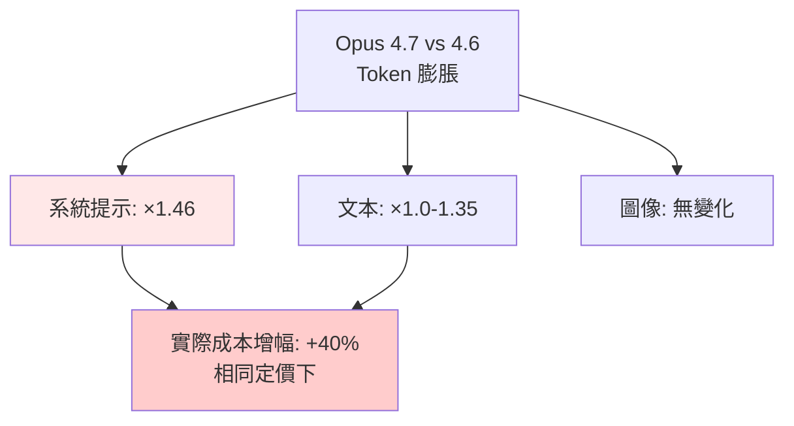

# AI Daily Digest — 2026-04-20

<!-- pipeline-generated:begin -->

## 🔥 今日 TOP 3
### 1. Claude Code v0.122.0 架構重塑：上下文管理與安全強化
Claude Code v0.122.0 發布多項重大升級。Plan Mode 可在新鮮上下文中啟動實作，顯示上下文使用量供決策參考；插件系統新增標籤瀏覽與跨來源 marketplace（遠端/本地/跨 repo）；檔案系統權限引入 deny-read glob 策略。

Plan Mode 改進解決模型切換時的上下文丟失問題，跨來源 marketplace 擴大生態可用性；deny-read 與沙箱強制提升安全隔離水準。此版本包含多項安全強化（logout token 撤銷、project hook 信任要求），反映企業安全日益增長的需求。

開發者應評估 Plan Mode 如何改善決策流程與成本控制；企業應檢視 deny-read 策略在現有工作流的應用空間。插件生態擴展為使用者帶來更多自動化工具選項。

📖 [閱讀完整 insight](../10-insights/2026-04-20/inbox_6bb7f1d4.md) · 🔗 [原文連結](https://github.com/openai/codex/releases/tag/rust-v0.122.0)
### 2. Opus 4.7 tokenizer 成本衝擊：40% 預算重估迫在眉睫
Claude Opus 4.7 啟用新 tokenizer，相同文本產生 1.0–1.35 倍 tokens（系統提示達 1.46 倍），高解析度圖像支援升至 3.75MP。儘管定價與 Opus 4.6 相同（$5M input、$25M output），token 膨脹預期造成約 40% 實際成本增加。Simon Willison 的 Token Counter 工具升級揭示了這一衝擊。

開發者與企業長期 API 預算需重新評估，大量依賴系統提示或高解析度圖像的應用成本漲幅最為明顯。系統提示膨脹（1.46 倍）對使用複雜 prompt engineering 的應用成本影響最大，企業級部署須特別關注。

應立即運行 Claude Token Counter 工具比對自身應用的 token 變化，並重新計算年度 API 成本預期。較高成本與相同定價的組合對 ROI 評估產生重要影響。

📖 [閱讀完整 insight](../10-insights/2026-04-20/inbox_3dd12bfd.md) · 🔗 [原文連結](https://simonwillison.net/2026/Apr/20/claude-token-counts/#atom-everything)
### 3. Claude Code v2.1.116 效能突破：大會話 67% 快速化
Claude Code v2.1.116 於 4/20 發布多項效能與穩定性改善。/resume 指令在 40MB+ 大型會話上快速化 67%，MCP 啟動速度提升，終端滾動更順暢（Kitty/iTerm2/Ghostty/WezTerm 協議修復）；包含 15+ 安全修復涵蓋 rm/rmdir 危險路徑檢查、Ctrl+Z 懸掛、Indic 字集排版。

大型會話性能提升直接改善多分支開發體驗，MCP 啟動效率提升減少 IDE 延遲。終端鍵盤協議修復涵蓋主流編輯器，提升跨平台相容性。安全修復範圍廣泛，特別是路徑檢查強化防止非預期的檔案系統操作。

使用大型會話或多 MCP 伺服器的開發者應進行升級驗證，享受 67% 性能提升帶來的開發體驗改善。企業安全團隊應審視 15+ 安全修復的具體範圍，評估對現有工作流的相容性影響。

📖 [閱讀完整 insight](../10-insights/2026-04-20/inbox_7349264c.md) · 🔗 [原文連結](https://github.com/anthropics/claude-code/releases/tag/v2.1.116)

## 📚 分類摘要
### foundation_models
Opus 4.7 tokenizer 變更成為本日焦點，Simon Willison 的工具升級揭示了實際成本衝擊。相同定價下，tokenizer 調整導致成本約增加 40%，系統提示膨脹更甚（1.46 倍），對預算規劃造成實質影響。開發者應立即運行 Token Counter 工具評估自身應用的成本變化。

ChatGPT Enterprise 在 Hyatt 國際酒店全球部署展示企業級應用，採用 GPT-5.4 與 Codex 模型組合提升營運效率與客户體驗。開源與閉源性能差距的深度分析指出，單一評估指標無法完整衡量。預期差距發展軌跡將因社群投資與商業動力而演變，而非簡單的技術優越性。
### agents
Claude Code 平台於 48 小時內推出兩個版本，反映高速迭代週期。v0.122.0 引入 Plan Mode 上下文管理、跨來源 marketplace（遠端/本地/跨 repo）、安全沙箱強化；v2.1.116 聚焦效能優化與穩定性。大型會話的 /resume 快速化達 67%（40MB+ 場景），終端協議修復涵蓋 Kitty、iTerm2、Ghostty、WezTerm。

MCP 資源樣板延遲載入優化多伺服器啟動效率。Simon Willison 的 Datasette 整合方案展示數據工作流自動化的實務應用。三層解決方案（importdata、named function、Google Apps Script）覆蓋不同認證複雜度，對定期資料同步需求提供實用工具。

## 🎯 專欄
### 🛠 Claude Code / Codex 新功能
- [v2.1.116](../10-insights/2026-04-20/inbox_7349264c.md) — Claude Code v2.1.116 於 2026 年 4 月 20 日發布，聚焦效能最佳化與穩定性改善。/resume 指令在大型會話上快速化 67%（40MB+ 會話），MCP 啟動速度提升，VS Code/Cursor/Winds
- [OpenAI helps Hyatt advance AI among colleagues](../10-insights/2026-04-20/inbox_cff6b621.md) — Hyatt 國際酒店集團在全球員工中部署 ChatGPT Enterprise，使用 GPT-5.4 和 Codex 模型提升生產力、營運效率和客户體驗。此案例展示企業級 AI 工具在大型旅宿服務業的實際應用，涵蓋員工工作流優化和營運決策支
- [0.122.0](../10-insights/2026-04-20/inbox_6bb7f1d4.md) — Claude Code v0.122.0 發布，帶來多項重大功能更新。獨立安裝程式改進在 Windows 及 Intel Mac 上的自我包含性與應用安裝流程；TUI 新增 `/side` 快速側邊對話功能，並在執行中支援斜線命令與 she
### 🚀 Frontier 模型動態
- [OpenAI helps Hyatt advance AI among colleagues](../10-insights/2026-04-20/inbox_cff6b621.md) — Hyatt 國際酒店集團在全球員工中部署 ChatGPT Enterprise，使用 GPT-5.4 和 Codex 模型提升生產力、營運效率和客户體驗。此案例展示企業級 AI 工具在大型旅宿服務業的實際應用，涵蓋員工工作流優化和營運決策支
- [Claude Token Counter, now with model comparisons](../10-insights/2026-04-20/inbox_3dd12bfd.md) — Simon Willison 升級 Claude Token Counter 工具，支援多個模型版本比較。Opus 4.7 啟用新 tokenizer，對同樣內容產生 1.0–1.35 倍 tokens（系統提示測試為 1.46 倍）。高解
- [Reading today&#39;s open-closed performance gap](../10-insights/2026-04-20/inbox_6b2aeae7.md) — 文章深入分析開源與閉源大型語言模型當前的性能差距，探討決定這一差距的複雜因素與評估方法論的局限性，並預測這些差距在未來的發展趨勢。
### 🔐 AI 安全 / 濫用
_（今日無相關內容）_

<!-- pipeline-generated:end -->

<!-- user-notes -->
<!-- Write your own notes below; pipeline never touches this section. -->