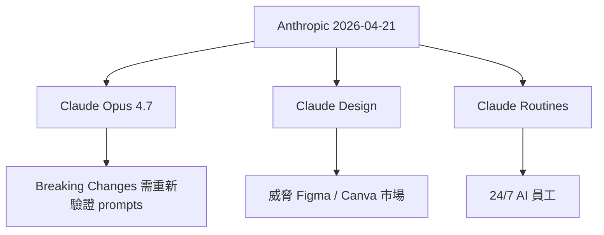
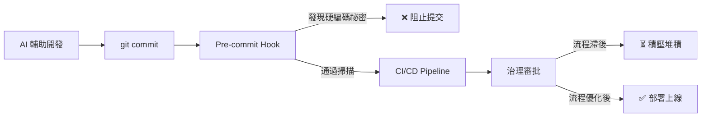

# AI Daily Digest — 2026-04-21

<!-- pipeline-generated:begin -->

## 🔥 今日 TOP 3
### 1. Anthropic 雙重發布：Opus 4.7 與足以威脅 Figma/Canva 的 AI 設計工具
Anthropic 同日發布 Claude Opus 4.7 基礎模型與 Claude Design 設計工具，後者直接瞄準 Figma 與 Canva 市場。大多數觀察者僅聚焦其中一項，忽略了兩件事同步發生的戰略意義。

這標誌著 AI 從「輔助工具」演進為「替代工具」的臨界點：基礎模型持續突破能力邊界的同時，應用層已成熟到足以直接取代現有 SaaS 龍頭。Claude Design 若能達到設計師的生產標準，Figma 與 Canva 的護城河將受到實質侵蝕。

下一步：評估 Claude Design 輸出品質是否達生產標準（而非原型品質）。開發者應本週驗證 Opus 4.7 的 prompt 相容性，因已確認存在 breaking changes（inbox_0563f2f2）。

📖 [閱讀完整 insight](../10-insights/2026-04-21/inbox_70b2e6c0.md) · 🔗 [原文連結](https://medium.com/@white9349/anthropic-just-dropped-two-bombshells-and-most-people-missed-both-308a76d8539a?source=rss------artificial_intelligence-5)
### 2. 治理滯後正在吃掉企業 AI 投資的所有商業回報
企業 AI 開發速度已達 2026 年水準，但審批流程與部署管道仍停留在 2019 年，造成完成的 AI 成果在審批隊列中積壓數週，無法轉化為商業價值，技術 ROI 在等待期間持續折損。

這是組織設計與技術速度不匹配的系統性缺陷。AI 開發速度在五年內提升了一個數量級，但治理框架幾乎未變——越擅長開發 AI 的團隊，反而越容易在組織流程中積累更大的瓶頸。

規劃 AI 路線圖時，治理改造預算應與開發預算並行規劃。優先評估哪些審批環節可自動化、哪些決策可下放，否則再強大的 AI 能力也只是把壓力前移到審批隊列。

📖 [閱讀完整 insight](../10-insights/2026-04-21/inbox_dacbebff.md) · 🔗 [原文連結](https://medium.com/@michael-hutson/why-your-ai-investment-is-currently-rotting-in-a-queue-f8ec78bd8da7?source=rss------artificial_intelligence-5)
### 3. AI 加速編碼正在整個產業積累看不見的安全債務
當 AI 讓編碼速度提升數倍，開發者傾向跳過安全審查，且常錯誤假設 AI 生成代碼已足夠安全。AI 在架構設計層面就可能引入根本性漏洞，這類問題難以事後修補。

這是「生產力提升→安全意識下降」的歷史重複模式，在 AI 時代因代碼量更大、開發者對生成代碼理解深度更低而更加危險，安全漏洞積累速度與代碼產出量同步增長。

應對方案：在 pre-commit 階段嵌入強制安全掃描，使其成為不可繞過的流程節點。inbox_801193d6 提供具體路徑：用 Claude Code Skills 在 pre-commit 自動掃描硬編碼祕密。

📖 [閱讀完整 insight](../10-insights/2026-04-21/inbox_dcb37dd2.md) · 🔗 [原文連結](https://medium.com/@karmacharyadiya02/the-dark-side-of-the-vibe-why-ai-generated-code-is-a-security-time-bomb-74862a8e544a?source=rss------artificial_intelligence-5)

## 📚 分類摘要
### foundation_models
2026 年 4 月 21 日是 Claude 生態的密集發布日。最核心的事件是 Claude Opus 4.7 正式上線（inbox_70b2e6c0），成為 Anthropic 目前最強基礎模型；同步推出的 Claude Design 直接瞄準設計市場，讓非工程師透過自然語言生成 UI 與品牌視覺（inbox_41e73992）。另一項值得追蹤但細節匱乏的發布是 Claude Routines，定位為「24/7 AI 員工」，目前缺乏工作原理說明（inbox_87a65d3e）。

Opus 4.7 升級帶來了一個實務痛點：部分舊版提示詞出現向後不相容的 breaking changes，需主動驗證並調整提示策略（inbox_0563f2f2）。inbox_851ab167 進一步指出遷移的核心挑戰在統一 API 層設計與 prompt 相容性測試，而非模型能力評估本身，這部分工作量被普遍低估。

兩個高品質技術亮點：claude-anti-mem 工具（200 行 Markdown 的錯誤清單注入機制）實驗證明能顯著降低 Claude 重複犯錯機率（inbox_b86362d0）；Claude Code 透過 custom skills 在 pre-commit 階段自動掃描硬編碼祕密，將安全左移至最早期（inbox_801193d6）。Claude Cowork 案例則展示了非技術人員如何無需編程，透過代理自動處理 40+ 頁 Notion 資料（inbox_51a89c9a）。
### agents
今日 agents 相關洞見集中在兩個截然不同的面向：普及化潛力與被忽視的運維風險。

Claude Cowork 案例（inbox_51a89c9a）展示了代理系統向普通辦公工具的演進：作者無需編程，單純透過 Claude 代理即可自動從 40+ 頁 Notion 資料庫收集整理資訊，具體設置步驟已公開，技術門檻大幅降低，普通使用者已能執行過去需要工程師才能完成的複雜自動化任務。

然而，inbox_d409d345 提出了嚴肅的反面案例：長期在 Mac Mini 運行的 AI agents 靜默停止工作達三天，沒有任何告警或日誌，直到作者手動察覺才發現故障。這兩個案例合在一起揭示一個關鍵缺口：啟動代理容易，讓代理可靠長期運行並具備可觀測性，是完全不同層次的工程挑戰。
### infra
今日基礎設施與安全主題圍繞一個共同問題：AI 開發速度提升後，組織流程和安全機制跟不上所帶來的系統性風險。

inbox_dacbebff 分析了治理滯後的核心機制：AI 以 2026 年速度開發，但企業部署審批和風險評估停留在 2019 年，導致完成的 AI 成果在隊列中積壓浪費。inbox_dcb37dd2 從安全角度呈現相同問題：速度優先心態讓開發者跳過安全檢查，AI 生成代碼在架構層就可能存在嚴重漏洞，事後難以修補。

inbox_801193d6 提供具體技術解法：利用 Claude Code Skills 在 Git pre-commit 階段自動偵測硬編碼的 API keys 與 token，將安全檢測嵌入開發工作流最前端。

## 💡 今日 Takeaway
### 1. 向 LLM 注入歷史錯誤清單，可顯著降低重複犯錯機率
claude-anti-mem 實驗顯示，只需 200 行 Markdown 記錄 Claude 曾犯過的錯誤，在後續對話中提供此清單，模型即可明顯減少重複同類失誤。機制是「負例上下文」：讓模型在生成前先看到自身的失敗模式，觸發更謹慎的輸出路徑。此技術成本極低、效果隨錯誤積累自動增強，適合任何長期使用同一 LLM 工作流的開發者或團隊立即採用。

_類型：technique_ · 來源：[[inbox_b86362d0]]
### 2. AI agent 若無主動監控，靜默故障可持續數天而完全無法被察覺
AI agent 停止工作時，往往不會拋出明顯告警，系統看起來「沒有錯誤」，實際上已停滯數天。這與傳統服務不同：LLM agent 的故障模式更接近「靜默降級」而非「顯性崩潰」。部署任何長期 agent 系統前，必須先設計健康檢查 endpoint、心跳日誌與告警機制——這是生產就緒的前提，而非事後補救的可選項。

_類型：pattern_ · 來源：[[inbox_d409d345]]
### 3. AI 加速開發期間，安全門禁必須強制嵌入流程，防止安全債務指數積累
當 AI 讓代碼產出速度提升數倍，開發者傾向跳過安全審查，且容易錯誤假設 AI 生成代碼本身已足夠安全。這是「生產力提升→安全意識下降」的歷史重複模式，在 AI 時代因代碼量更大、開發者理解深度更低而更加危險。應對方案：在 pre-commit 或 build 階段嵌入強制安全掃描，使其成為不可繞過的流程節點，而非依賴人工審查或開發者自覺。

_類型：pattern_ · 來源：[[inbox_dcb37dd2]], [[inbox_801193d6]]
### 4. 企業 AI 的核心瓶頸通常在治理與審批流程，而非技術能力本身
AI 開發速度已遠超組織的決策和部署流程，導致完成的 AI 成果在審批隊列中停滯，技術 ROI 持續流失。治理框架的現代化（自動化低風險審批、下放決策權限、簡化部署流程）應與 AI 開發投資並行規劃。不升級治理速度的組織，再強大的 AI 能力也只是把壓力前移到審批隊列。

_類型：framework_ · 來源：[[inbox_dacbebff]]
### 5. Pre-commit 自動祕密掃描是 AI 輔助開發安全左移的最低成本起點
AI 輔助開發顯著提升了硬編碼祕密（API keys、token、密碼）意外進入版本庫的風險，因代碼生成速度快且開發者對細節注意力更分散。透過 Claude Code Skills 客製化 pre-commit hook 執行自動掃描，可在 commit 前攔截敏感資訊，成本極低但防護即時。這是將安全責任從「人工審查」轉移至「流程機制」的最小可行實作，適合作為所有 AI 開發團隊的第一道防線。

_類型：technique_ · 來源：[[inbox_801193d6]]

## 🎯 專欄
### 🛠 Claude Code / Codex 新功能
- [0.123.0-alpha.2](../10-insights/2026-04-21/inbox_11e3b013.md) — OpenAI Codex 發布 0.123.0-alpha.2 版本。該版本僅提供標題，未提供詳細更新說明。
- [0.123.0-alpha.3](../10-insights/2026-04-21/inbox_546bd9f7.md) — OpenAI Codex 發布 0.123.0-alpha.3 版本。
- [The $50 Billion IDE: Why Cursor’s $2B Mega-Raise Just Broke the AI Coding Matrix](../10-insights/2026-04-21/inbox_a2b845c0.md) — AI 編寫 IDE Cursor 完成 $2B 融資，作者將其估值推至 $500 億級別。指出此輪融資象徵 2026 年 AI Summer 期間，整個軟體工程領域正經歷根本性 AI 重塑，AI 編寫工具從邊緣走向市場中心。
- [10 GitHub Repos That Cut Claude Code Token Usage by Up to 90%](../10-insights/2026-04-21/inbox_e08fa917.md) — 一篇指南介紹 10 個 GitHub 專案/工具，宣稱能將 Claude Code 的 token 使用量最多降低 90%。作者親身經歷在使用 Claude Code 數週後驚覺成本高昂，遂蒐集並分析這些開源優化方案。但原文未列舉這 10 
- [20 Claude Code Commands That Make Your Life Easier (Most People Don’t Know Them)](../10-insights/2026-04-21/inbox_eecfaf96.md) — 一篇進階指南介紹 20 個鮮為人知的 Claude Code 命令與技巧，聲稱大多數使用者只將 Claude Code 當作「終端版 ChatGPT」，因而忽略了 80% 的功能潛力。文章暗示存在大量隱藏的高效命令，但原文未揭露任何具體命令
### 📚 AI 知識管理
- [How NLP Models Represent Meaning (Embeddings Explained Simply)](../10-insights/2026-04-21/inbox_9ec072f6.md) — 教育文章解釋 NLP 模型在 tokenization 後如何運用 embedding 向量來表示和捕捉文本語義意涵。
- [The Grand Finale: Chat with Your Data Using a Full RAG System in Spring Boot](../10-insights/2026-04-21/inbox_2fc52b52.md) — Spring Boot AI 系列最終章，示範完整 RAG（檢索增強生成）系統實裝。前文涵蓋基礎聊天應用與向量儲存，此篇整合端到端流程：向量化 → 檢索 → LLM 生成。主要技術棧包括 Spring AI 框架、向量資料庫、LLM API
### 🏢 企業導入 AI / 團隊實踐
- [5 Business Processes You Should Automate First Using AI](../10-insights/2026-04-21/inbox_ead50d9b.md) — 業務流程自動化從前沿企業的可選投資演變為現代競爭環境的生存基線。在數據驅動的商業世界中，不採用自動化的組織將面臨淘汰風險。文章標題暗示有五個應優先自動化的流程，但具體內容在提供的摘要中不完整。
- [How NLP Models Represent Meaning (Embeddings Explained Simply)](../10-insights/2026-04-21/inbox_9ec072f6.md) — 教育文章解釋 NLP 模型在 tokenization 後如何運用 embedding 向量來表示和捕捉文本語義意涵。
- [Creative AI Is Overrated. Reliable AI Will Win the Next Wave.](../10-insights/2026-04-21/inbox_cdf313f5.md) — 本文主張當前 AI 產業過度強調創意能力，實則可靠性（consistency）才是下一波發展的決勝關鍵。作者認為未來 AI 系統應從追求想像力轉向追求穩定可靠的輸出，直接挑戰了「AI 創意應用」的產業敘事。這觀點對企業應用場景特別相關：穩定
- [The Grand Finale: Chat with Your Data Using a Full RAG System in Spring Boot](../10-insights/2026-04-21/inbox_2fc52b52.md) — Spring Boot AI 系列最終章，示範完整 RAG（檢索增強生成）系統實裝。前文涵蓋基礎聊天應用與向量儲存，此篇整合端到端流程：向量化 → 檢索 → LLM 生成。主要技術棧包括 Spring AI 框架、向量資料庫、LLM API
- [Top Python and AI skills for making money in 2026](../10-insights/2026-04-21/inbox_55e128ea.md) — 本文探討 2026 年如何透過 Python 和 AI 技能創造收入的實用策略。作者核心論點：賺錢的關鍵不在盲目追逐每週新推出的模型更新，而在於建立深度的應用能力與實戰經驗。文章可能涵蓋具體的技能組合架構（如提示工程、框架整合、數據處理）以
### 🎓 AI 使用技巧 / 心法
- [Stop Using Old Prompts! The Claude Opus 4.7 Hack Guide](../10-insights/2026-04-21/inbox_0563f2f2.md) — Claude Opus 4.7 版本發布後改變了部分提示詞的相容性，導致舊的提示詞模式不再有效。本文分析 Opus 4.7 中哪些方面發生了破裂式改變、改變的原因，以及開發者應如何調整提示詞策略來適配新版本。作者建議使用者立即停止依賴舊的提
- [20 Claude Code Commands That Make Your Life Easier (Most People Don’t Know Them)](../10-insights/2026-04-21/inbox_eecfaf96.md) — 一篇進階指南介紹 20 個鮮為人知的 Claude Code 命令與技巧，聲稱大多數使用者只將 Claude Code 當作「終端版 ChatGPT」，因而忽略了 80% 的功能潛力。文章暗示存在大量隱藏的高效命令，但原文未揭露任何具體命令
- [Top Python and AI skills for making money in 2026](../10-insights/2026-04-21/inbox_55e128ea.md) — 本文探討 2026 年如何透過 Python 和 AI 技能創造收入的實用策略。作者核心論點：賺錢的關鍵不在盲目追逐每週新推出的模型更新，而在於建立深度的應用能力與實戰經驗。文章可能涵蓋具體的技能組合架構（如提示工程、框架整合、數據處理）以
- [Claude Opus 4.7: Why AI Teams Need a Unified Model API Layer](../10-insights/2026-04-21/inbox_851ab167.md) — Claude Opus 4.7 升級時，團隊面臨的最大挑戰不在新模型本身，而在 API 層的統一與遷移。企業需建立統一的模型 API 層以便管理版本、切換模型、控制成本。遷移涉及 prompt 相容性驗證、參數調整、測試覆蓋等複雜協調，往往
### ⛓️ 區塊鏈 / Web3
- [0.123.0-alpha.2](../10-insights/2026-04-21/inbox_11e3b013.md) — OpenAI Codex 發布 0.123.0-alpha.2 版本。該版本僅提供標題，未提供詳細更新說明。
- [0.123.0-alpha.3](../10-insights/2026-04-21/inbox_546bd9f7.md) — OpenAI Codex 發布 0.123.0-alpha.3 版本。
- [How NLP Models Represent Meaning (Embeddings Explained Simply)](../10-insights/2026-04-21/inbox_9ec072f6.md) — 教育文章解釋 NLP 模型在 tokenization 後如何運用 embedding 向量來表示和捕捉文本語義意涵。
### 🔐 AI 安全 / 濫用
- [The Dark Side of the “Vibe”: Why AI‑Generated Code Is a Security Time Bomb](../10-insights/2026-04-21/inbox_dcb37dd2.md) — AI 生成代碼帶來的安全隱患正在加速惡化，因為開發團隊被速度優先的心態（作者稱之為「vibe」）所驅動。當 AI 使代碼編寫速度大幅提升時，開發者傾向於跳過安全審查、滲透測試和最佳實踐，導致代碼在架構設計階段就存在嚴重安全缺陷。許多開發者錯

<!-- pipeline-generated:end -->

<!-- user-notes -->
<!-- Write your own notes below; pipeline never touches this section. -->