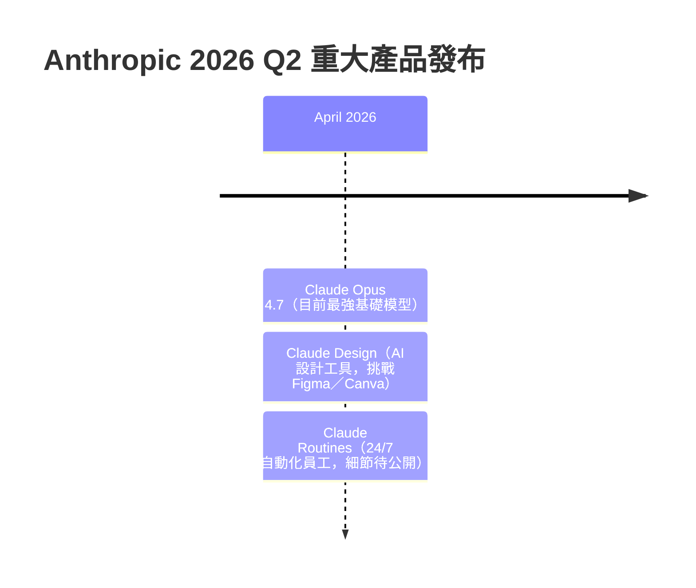
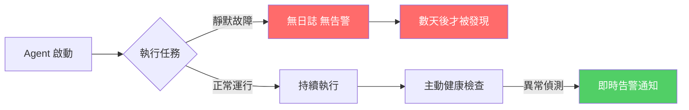

# AI Daily Digest — 2026-04-21

<!-- pipeline-generated:begin -->

## 🔥 今日 TOP 3
### 1. Claude Opus 4.7 與 AI 設計工具雙發布，直接挑戰 Figma／Canva 市場
Anthropic 在 2026 年 4 月同期推出兩項產品：Claude Opus 4.7（目前最強基礎模型）與 Claude Design（AI 設計生成工具），後者讓使用者能以自然語言提示生成 UI、品牌識別與行銷素材，被視為對 Figma、Canva 市場地位的直接挑戰。此次雙線發布打破過往「基礎模型廠商不做應用層」的市場預期。

這代表 AI 廠商的競爭策略正在發生根本轉變：不再只是提供 API 讓第三方建應用，而是自身下場搶佔應用層市場。對既有 SaaS 設計工具而言，核心競爭優勢（UX、功能深度、生態整合）正面臨被對話式介面釜底抽薪的風險；對使用者而言，設計生產力工具的選擇邏輯也將重新洗牌。

設計師和產品團隊應在接下來 30 天內評估 Claude Design 能否覆蓋日常工作流的主要場景。對 Figma、Canva 的用戶與競爭者而言，觀察 Anthropic 如何拿捏「能力供應商」與「應用層競爭者」之間的角色衝突，是判斷下一步策略的關鍵信號。

📖 [閱讀完整 insight](../10-insights/2026-04-21/inbox_70b2e6c0.md) · 🔗 [原文連結](https://medium.com/@white9349/anthropic-just-dropped-two-bombshells-and-most-people-missed-both-308a76d8539a?source=rss------artificial_intelligence-5)
### 2. 企業 AI 治理速度嚴重滯後，正在把 AI 投資回報鎖進審批隊列
企業的 AI 開發能力已提升至 2026 年的速度，但審批機制、風險評估流程和部署管道仍停留在 2019 年。這造成具體現象：AI 成果已完成，卻在等待上線審批的隊列中堆積，完全無法轉化為商業價值，ROI 在等待中蒸發。

這不是個別企業的問題，而是系統性的組織設計缺陷——技術能力升級速度遠快於流程重構速度。企業因此陷入悖論：越激進投入 AI 開發，越容易因治理滯後而浪費投資。與舊科技週期不同，AI 時代的競爭優勢往往是「速度差」而非「功能差」，治理瓶頸直接抵消了速度優勢。

CTO 和工程主管應立即審計：平均一個 AI 功能從完成到上線需要幾天？哪些審批環節可以並行化或自動化？若答案超過兩週，治理流程本身就是 AI 策略中最大的風險項，需要與 AI 投資同等優先級地列入下一季改造計畫。

📖 [閱讀完整 insight](../10-insights/2026-04-21/inbox_dacbebff.md) · 🔗 [原文連結](https://medium.com/@michael-hutson/why-your-ai-investment-is-currently-rotting-in-a-queue-f8ec78bd8da7?source=rss------artificial_intelligence-5)
### 3. AI 加速編碼正累積隱性安全債：速度優先文化讓架構缺陷無人察覺
當 AI 輔助工具大幅壓縮編碼時間，開發團隊被「快速交付」心態驅動，系統性地跳過安全審查、滲透測試和架構評估。問題的嚴重性在於：AI 生成的代碼在架構設計層面就可能存在缺陷，而非表面 bug，導致事後修補代價極高，且難以在常規 code review 中被識別。

這與過往技術債不同——過去是「先做再說，之後補」，現在是「連補的機會都沒意識到」。許多開發者錯誤地假設 AI 生成的代碼本身就是安全的，這種認知偏差讓漏洞在代碼庫中靜默積累，直到事故發生才被揭露，而屆時修補成本已呈指數級攀升。

應對策略是將安全門控強制前移：在 pre-commit 階段自動化偵測敏感資訊（如 inbox_801193d6 所示），並在 PR 流程中加入強制性架構安全審查。工程組織需要在速度 KPI 之外，同步設立「安全覆蓋率」作為 AI 時代的開發基線標準。

📖 [閱讀完整 insight](../10-insights/2026-04-21/inbox_dcb37dd2.md) · 🔗 [原文連結](https://medium.com/@karmacharyadiya02/the-dark-side-of-the-vibe-why-ai-generated-code-is-a-security-time-bomb-74862a8e544a?source=rss------artificial_intelligence-5)

## 📚 分類摘要
### foundation_models
Anthropic 本日發布密度罕見，呈現三線同發格局：Claude Opus 4.7（inbox_70b2e6c0）成為目前最強基礎模型；Claude Design（inbox_41e73992）讓非技術用戶透過自然語言生成 UI 和品牌素材，直接挑戰 Figma 和 Canva；Claude Routines（inbox_87a65d3e）宣稱能將 AI 化為「24/7 員工」，但具體功能細節尚未公開。三項產品同期發布，標誌著 Anthropic 正從「API 供應商」加速轉型為「完整應用平台」。

伴隨 Opus 4.7 發布，inbox_0563f2f2 揭示了破裂性改變（breaking changes）：舊提示詞在新版本下失效，需重新設計。inbox_851ab167 進一步指出，Opus 4.7 升級的核心挑戰不在新能力評估，而在 API 遷移架構——統一的模型 API 抽象層、prompt 相容性驗證和測試覆蓋的協調往往比技術選型更耗時，遷移工程量被普遍低估。

在使用優化方面，inbox_b86362d0 展示了一個輕量但效果顯著的技巧：用 200 行 Markdown 記錄 Claude 歷史錯誤（claude-anti-mem），並在後續對話中引入，可顯著降低重複犯錯頻率，是作者年度最實用的提示工程工具。
### agents
inbox_51a89c9a 展示了 Claude Cowork 代理模式的非技術應用：單一 Claude 代理自動整理 Notion 40+ 頁資料庫，全程無需撰寫程式碼。這標誌著 AI 代理的使用門檻正在跨越「需要開發者操作」的邊界，普通知識工作者開始能執行過去需要工程師才能完成的複雜自動化任務，「Agent 民主化」不再是願景而是具體落地案例。

然而，inbox_d409d345 以真實失敗案例提出嚴重警示：靜默故障（silent failures）是長期運行 AI Agent 最危險的風險模式。作者的代理在 Mac Mini 上靜默停止工作整整三天，系統未拋出任何告警，直到業務層面才察覺。這與 inbox_51a89c9a 展示的「易啟動」形成鮮明對比，揭示了 AI 代理「易啟動、難維護」的生產落差。

### infra
inbox_801193d6 展示了 Claude Code Skills 在 IaC 工具鏈的安全應用：透過自訂 Skills 在 Git pre-commit 階段自動偵測硬編碼的 API keys、密碼與 token，將安全檢測左移至開發流程最前端，防止敏感資訊進入版本控制系統。這是「AI 工具強化安全流程」的具體落地示範，實作成本低、防護效益高。

這與 inbox_dcb37dd2 描述的 AI 編碼安全風險形成重要對照：AI 工具既是安全威脅的放大器（加速開發→跳過審查→累積安全債），也能成為安全防護的自動化手段（pre-commit 自動掃描→強制閘口）。企業在推廣 AI 編碼工具的同時，同步建立自動化安全閘口是化解「速度-安全」矛盾的可行路徑，而非二選一的取捨。

## 🎯 專欄
### 🛠 Claude Code / Codex 新功能
- **[0.123.0-alpha.2](../10-insights/2026-04-21/inbox_11e3b013.md)**
  OpenAI Codex 發布 0.123.0-alpha.2 版本。該版本僅提供標題，未提供詳細更新說明。
- **[0.123.0-alpha.3](../10-insights/2026-04-21/inbox_546bd9f7.md)**
  OpenAI Codex 發布 0.123.0-alpha.3 版本。
- **[The $50 Billion IDE: Why Cursor’s $2B Mega-Raise Just Broke the AI Coding Matrix](../10-insights/2026-04-21/inbox_a2b845c0.md)**
  AI 編寫 IDE Cursor 完成 $2B 融資，作者將其估值推至 $500 億級別。指出此輪融資象徵 2026 年 AI Summer 期間，整個軟體工程領域正經歷根本性 AI 重塑，AI 編寫工具從邊緣走向市場中心。
- **[10 GitHub Repos That Cut Claude Code Token Usage by Up to 90%](../10-insights/2026-04-21/inbox_e08fa917.md)**
  一篇指南介紹 10 個 GitHub 專案/工具，宣稱能將 Claude Code 的 token 使用量最多降低 90%。作者親身經歷在使用 Claude Code 數週後驚覺成本高昂，遂蒐集並分析這些開源優化方案。但原文未列舉這 10 個專案的具體名稱、類型或各自的成本削減幅度。
- **[20 Claude Code Commands That Make Your Life Easier (Most People Don’t Know Them)](../10-insights/2026-04-21/inbox_eecfaf96.md)**
  一篇進階指南介紹 20 個鮮為人知的 Claude Code 命令與技巧，聲稱大多數使用者只將 Claude Code 當作「終端版 ChatGPT」，因而忽略了 80% 的功能潛力。文章暗示存在大量隱藏的高效命令，但原文未揭露任何具體命令名稱或用途。
### 📚 AI 知識管理
- **[How NLP Models Represent Meaning (Embeddings Explained Simply)](../10-insights/2026-04-21/inbox_9ec072f6.md)**
  教育文章解釋 NLP 模型在 tokenization 後如何運用 embedding 向量來表示和捕捉文本語義意涵。
- **[The Grand Finale: Chat with Your Data Using a Full RAG System in Spring Boot](../10-insights/2026-04-21/inbox_2fc52b52.md)**
  Spring Boot AI 系列最終章，示範完整 RAG（檢索增強生成）系統實裝。前文涵蓋基礎聊天應用與向量儲存，此篇整合端到端流程：向量化 → 檢索 → LLM 生成。主要技術棧包括 Spring AI 框架、向量資料庫、LLM API 整合，適合快速掌握企業級對話系統原型的 Java/Spring 開發者。實戰教程風格，省略理論細節，直指關鍵集成點。
### 🏢 企業導入 AI / 團隊實踐
- **[5 Business Processes You Should Automate First Using AI](../10-insights/2026-04-21/inbox_ead50d9b.md)**
  業務流程自動化從前沿企業的可選投資演變為現代競爭環境的生存基線。在數據驅動的商業世界中，不採用自動化的組織將面臨淘汰風險。文章標題暗示有五個應優先自動化的流程，但具體內容在提供的摘要中不完整。
- **[How NLP Models Represent Meaning (Embeddings Explained Simply)](../10-insights/2026-04-21/inbox_9ec072f6.md)**
  教育文章解釋 NLP 模型在 tokenization 後如何運用 embedding 向量來表示和捕捉文本語義意涵。
- **[Creative AI Is Overrated. Reliable AI Will Win the Next Wave.](../10-insights/2026-04-21/inbox_cdf313f5.md)**
  本文主張當前 AI 產業過度強調創意能力，實則可靠性（consistency）才是下一波發展的決勝關鍵。作者認為未來 AI 系統應從追求想像力轉向追求穩定可靠的輸出，直接挑戰了「AI 創意應用」的產業敘事。這觀點對企業應用場景特別相關：穩定性優先於驚人創意。該論點暗示可靠性可能成為評估 AI 工具的首要指標，而非市場常見的功能炫耀競賽。
- **[The Grand Finale: Chat with Your Data Using a Full RAG System in Spring Boot](../10-insights/2026-04-21/inbox_2fc52b52.md)**
  Spring Boot AI 系列最終章，示範完整 RAG（檢索增強生成）系統實裝。前文涵蓋基礎聊天應用與向量儲存，此篇整合端到端流程：向量化 → 檢索 → LLM 生成。主要技術棧包括 Spring AI 框架、向量資料庫、LLM API 整合，適合快速掌握企業級對話系統原型的 Java/Spring 開發者。實戰教程風格，省略理論細節，直指關鍵集成點。
- **[Top Python and AI skills for making money in 2026](../10-insights/2026-04-21/inbox_55e128ea.md)**
  本文探討 2026 年如何透過 Python 和 AI 技能創造收入的實用策略。作者核心論點：賺錢的關鍵不在盲目追逐每週新推出的模型更新，而在於建立深度的應用能力與實戰經驗。文章可能涵蓋具體的技能組合架構（如提示工程、框架整合、數據處理）以及如何將 AI 技能轉化為市場價值的方法論。重點強調跨越模型炒作週期，建立長期競爭力才是在 AI 時代穩定獲利的正確路徑
### 🎓 AI 使用技巧 / 心法
- **[Stop Using Old Prompts! The Claude Opus 4.7 Hack Guide](../10-insights/2026-04-21/inbox_0563f2f2.md)**
  Claude Opus 4.7 版本發布後改變了部分提示詞的相容性，導致舊的提示詞模式不再有效。本文分析 Opus 4.7 中哪些方面發生了破裂式改變、改變的原因，以及開發者應如何調整提示詞策略來適配新版本。作者建議使用者立即停止依賴舊的提示詞範式，轉而採用針對 4.7 最佳化的新方法。
- **[20 Claude Code Commands That Make Your Life Easier (Most People Don’t Know Them)](../10-insights/2026-04-21/inbox_eecfaf96.md)**
  一篇進階指南介紹 20 個鮮為人知的 Claude Code 命令與技巧，聲稱大多數使用者只將 Claude Code 當作「終端版 ChatGPT」，因而忽略了 80% 的功能潛力。文章暗示存在大量隱藏的高效命令，但原文未揭露任何具體命令名稱或用途。
- **[Top Python and AI skills for making money in 2026](../10-insights/2026-04-21/inbox_55e128ea.md)**
  本文探討 2026 年如何透過 Python 和 AI 技能創造收入的實用策略。作者核心論點：賺錢的關鍵不在盲目追逐每週新推出的模型更新，而在於建立深度的應用能力與實戰經驗。文章可能涵蓋具體的技能組合架構（如提示工程、框架整合、數據處理）以及如何將 AI 技能轉化為市場價值的方法論。重點強調跨越模型炒作週期，建立長期競爭力才是在 AI 時代穩定獲利的正確路徑
- **[Claude Opus 4.7: Why AI Teams Need a Unified Model API Layer](../10-insights/2026-04-21/inbox_851ab167.md)**
  Claude Opus 4.7 升級時，團隊面臨的最大挑戰不在新模型本身，而在 API 層的統一與遷移。企業需建立統一的模型 API 層以便管理版本、切換模型、控制成本。遷移涉及 prompt 相容性驗證、參數調整、測試覆蓋等複雜協調，往往耗時超過採用新模型的技術評估。此洞見對正計畫升級 Claude 或其他新一代模型的團隊提供重要指導。
### ⛓️ 區塊鏈 / Web3
- **[0.123.0-alpha.2](../10-insights/2026-04-21/inbox_11e3b013.md)**
  OpenAI Codex 發布 0.123.0-alpha.2 版本。該版本僅提供標題，未提供詳細更新說明。
- **[0.123.0-alpha.3](../10-insights/2026-04-21/inbox_546bd9f7.md)**
  OpenAI Codex 發布 0.123.0-alpha.3 版本。
- **[How NLP Models Represent Meaning (Embeddings Explained Simply)](../10-insights/2026-04-21/inbox_9ec072f6.md)**
  教育文章解釋 NLP 模型在 tokenization 後如何運用 embedding 向量來表示和捕捉文本語義意涵。
### 🔐 AI 安全 / 濫用
- **[The Dark Side of the “Vibe”: Why AI‑Generated Code Is a Security Time Bomb](../10-insights/2026-04-21/inbox_dcb37dd2.md)**
  AI 生成代碼帶來的安全隱患正在加速惡化，因為開發團隊被速度優先的心態（作者稱之為「vibe」）所驅動。當 AI 使代碼編寫速度大幅提升時，開發者傾向於跳過安全審查、滲透測試和最佳實踐，導致代碼在架構設計階段就存在嚴重安全缺陷。許多開發者錯誤地假設 AI 生成的代碼是安全的，這種信心缺陷造成了一個「安全定時炸彈」——系統看起來運行良好，但其內部已充滿可被利用

## 💡 今日 Takeaway

_讀完今日所有內容後，可帶走的知識點_
### 1. 將 LLM 歷史錯誤清單注入 context，可顯著降低重複犯錯率
在 system prompt 或對話開頭提供 LLM 過去犯過的錯誤清單（即「anti-mem」），讓模型在輸出前主動自我校正。實作成本極低——200 行 Markdown 記錄即可，無需 fine-tuning 或任何框架改動，且可隨錯誤累積持續完善。這個技巧適用於任何有固定失誤模式的重複性 LLM 工作流，尤其是長期使用、有累積錯誤紀錄的對話場景。

_類型：technique_

**參考來源**：
- [I Gave Claude a Rap Sheet of Its Own Mistakes. It Stopped Repeating Them.](../10-insights/2026-04-21/inbox_b86362d0.md) · [原文](https://ai.plainenglish.io/i-gave-claude-a-rap-sheet-of-its-own-mistakes-it-stopped-repeating-them-f154410c16b8?source=rss------claude-5)
### 2. 長期運行 AI Agent 最危險的失敗模式是靜默故障，不是顯性崩潰
AI Agent 靜默停止工作時，系統表面仍「看起來正常」，直到業務層面才察覺——這比顯性崩潰更危險，因為問題可以持續數天無人知曉。健康檢查和告警機制不是可選的優化，而是生產部署的前提條件。任何計畫長期運行的 Agent 系統，都應在架構設計階段就納入 heartbeat 機制、執行日誌和異常通知，而非事後補充。

_類型：pattern_

**參考來源**：
- [Two Months of AI Agents on a Mac Mini. Here’s the Silent Bug I Still Can’t Forgive.](../10-insights/2026-04-21/inbox_d409d345.md) · [原文](https://medium.com/@pixipace/two-months-of-ai-agents-on-a-mac-mini-heres-the-silent-bug-i-still-can-t-forgive-b3aeabc27f1e?source=rss------artificial_intelligence-5)
### 3. AI 治理框架的改造速度必須跟上開發速度，否則 ROI 在審批隊列中蒸發
當 AI 將開發週期壓縮數倍，但審批和部署流程未同步升級時，完成的成果在等待上線過程中喪失時效性和競爭優勢。企業應將「治理現代化」視為與 AI 採用同等優先級的投資，具體評估哪些審批環節可以並行化或自動化。判斷基準：若一個 AI 功能完成後等待超過兩週才能上線，治理流程本身就是當前最大的 AI 投資風險，而非技術本身。

_類型：framework_

**參考來源**：
- [Why Your AI Investment Is Currently Rotting in a Queue](../10-insights/2026-04-21/inbox_dacbebff.md) · [原文](https://medium.com/@michael-hutson/why-your-ai-investment-is-currently-rotting-in-a-queue-f8ec78bd8da7?source=rss------artificial_intelligence-5)
### 4. 模型版本升級的隱性成本：Prompt 相容性與 API 遷移通常超過模型評估本身
Claude Opus 4.7 的破裂性改變揭示了一個普遍模式：採用新模型的主要工程成本來自 prompt 相容性驗證、參數調整和測試覆蓋的協調，而非模型能力評估本身。建立統一的模型 API 抽象層，可在未來版本切換時隔離影響範圍、降低遷移成本。規劃 LLM 升級預算時，應預留至少與模型評估等量的時間用於遷移工程，避免嚴重低估。

_類型：technique_

**參考來源**：
- [Stop Using Old Prompts! The Claude Opus 4.7 Hack Guide](../10-insights/2026-04-21/inbox_0563f2f2.md) · [原文](https://medium.com/@tentenco/stop-using-old-prompts-the-claude-opus-4-7-hack-guide-1379a9ecdd69?source=rss------claude-5)
- [Claude Opus 4.7: Why AI Teams Need a Unified Model API Layer](../10-insights/2026-04-21/inbox_851ab167.md) · [原文](https://medium.com/@social_18794/claude-opus-4-7-why-ai-teams-need-a-unified-model-api-layer-caf775a93359?source=rss------claude-5)
### 5. AI 提速編碼時，安全門控若未同步左移，架構缺陷將難以事後修補
AI 加速開發讓安全審查被系統性省略，但 AI 生成代碼的缺陷往往在架構層而非表面，事後修補代價呈指數級攀升。有效對策是強制前移安全閘口：在 pre-commit 階段自動偵測敏感資訊、在 PR 流程加入架構安全審查，讓安全成為流程的強制組成而非後期選項。組織應在速度 KPI 之外同步設立「安全覆蓋率」基線，以防止 AI 時代特有的隱性安全債靜默積累。

_類型：pattern_

**參考來源**：
- [The Dark Side of the “Vibe”: Why AI‑Generated Code Is a Security Time Bomb](../10-insights/2026-04-21/inbox_dcb37dd2.md) · [原文](https://medium.com/@karmacharyadiya02/the-dark-side-of-the-vibe-why-ai-generated-code-is-a-security-time-bomb-74862a8e544a?source=rss------artificial_intelligence-5)
- [Claude Skills for IaC: Stop Hardcoded Secrets Before They Hit Git](../10-insights/2026-04-21/inbox_801193d6.md) · [原文](https://medium.com/@gokulnath70/claude-skills-for-iac-stop-hardcoded-secrets-before-they-hit-git-8e0c542211ad?source=rss------claude-5)

<!-- pipeline-generated:end -->

<!-- user-notes -->
<!-- Write your own notes below; pipeline never touches this section. -->