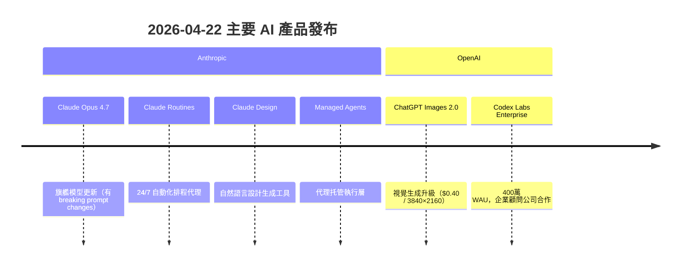
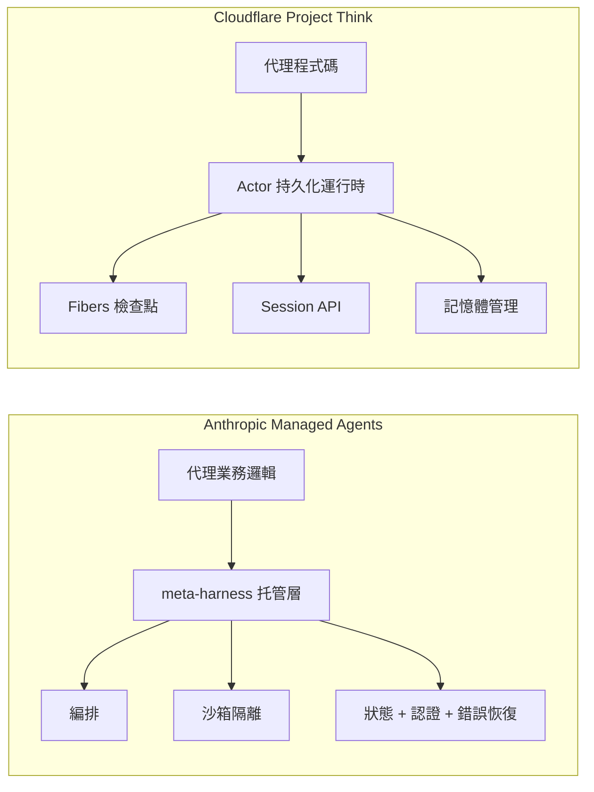

# AI Daily Digest — 2026-04-21

<!-- pipeline-generated:begin -->

## 🔥 今日 TOP 3
### 1. Anthropic Managed Agents：代理邏輯與執行基礎設施正式分層
Anthropic 發布 Managed Agents，為 Claude 平台提供托管代理執行層，以 meta-harness 架構將代理業務邏輯與編排、沙箱隔離、狀態管理、認證等運行時關切完全解耦。系統原生支援多步驟長程工作流、外部工具整合、錯誤自動恢復與會話連續性，多個獨立來源（inbox_b886bfdb、inbox_8dde3380、inbox_5b01f246）相互印證了此架構創新的真實性。

這是 Anthropic 從「模型提供商」向「代理平台」轉型的關鍵里程碑，類比微服務架構中的服務網格（service mesh）定位——開發者不再需要自行構建基礎設施層即可部署生產級自主代理。中小型工程團隊的代理部署門檻因此大幅降低，過去因基礎設施複雜度而停滯的代理應用現在有了清晰落地路徑。

下一步關鍵觀察：Managed Agents 的定價模型（是否按執行時長或工具呼叫次數計費）、與 Cloudflare Project Think 等競品的功能邊界劃分，以及 Anthropic 是否開放平台讓第三方代理運行於 Managed Agents 之上。

📖 [閱讀完整 insight](../10-insights/2026-04-21/inbox_b886bfdb.md) · 🔗 [原文連結](https://www.infoq.com/news/2026/04/anthropic-managed-agents/?utm_campaign=infoq_content&utm_source=infoq&utm_medium=feed&utm_term=Architecture+%26+Design)
### 2. Cloudflare Project Think：AI 代理執行從無狀態函數轉向持久 Actor 模型
Cloudflare 發布 Project Think，引入基於 Actor 模型的持久化代理執行框架，與傳統無狀態 serverless 函數編排形成根本性架構對立。核心創新包括 Fibers（類協程的進度檢查點機制，代理可在中斷後從斷點恢復）與 Session API（原生多輪對話與關聯上下文支援），運行時提供類 OS 核心環境讓代理自主管理記憶體與安全執行程式碼（inbox_3e796ee6、inbox_7c298f25）。

從無狀態到有狀態的架構轉變對代理可靠性有根本影響：跨越數十個工具呼叫的長程任務不再因執行中斷而全部重來，可從最近檢查點恢復。這直接回應了 MLDS 2026 大會中「沉默失敗」被列為代理生產頭號風險的診斷，也使得跨多系統的資料處理工作流和多日背景代理任務成為可能。

建議工程師評估兩個選項的差異：Cloudflare Project Think 提供更深的基礎設施控制與邊緣部署能力，Anthropic Managed Agents 則有更緊密的 Claude 生態整合。選型應聚焦於狀態持久化需求、故障恢復策略，以及是否有 edge computing 場景。

📖 [閱讀完整 insight](../10-insights/2026-04-21/inbox_3e796ee6.md) · 🔗 [原文連結](https://www.infoq.com/news/2026/04/cloudflare-project-think/?utm_campaign=infoq_content&utm_source=infoq&utm_medium=feed&utm_term=global)
### 3. ChatGPT Images 2.0 實測：3840×2160 生成 $0.40，但存在視覺幻覺問題
OpenAI 發布 ChatGPT Images 2.0，Sam Altman 宣稱能力躍升相當於 GPT-3 到 GPT-5。Simon Willison 以 Where's Waldo 風格的密集視覺場景進行獨立實測：最高設定 3840×2160 輸出 13,342 tokens，單次成本約 USD 0.40，在複雜插圖與文字細節結合場景上明顯優於 Google Nano Banana 2/Pro 及舊版 gpt-image-1（inbox_1782a21a）。

性能有實測數據佐證，但實測同時揭露關鍵缺陷：模型會捏造虛假視覺元素以滿足提示約束（如在不存在的物件周圍加圓圈）。這是視覺版的幻覺問題，且比文字幻覺更難察覺——圖像沒有引用可供核對，適用於創意生成但不適用於技術圖表、資料視覺化、法律文件插圖等需要事實精確的商業場景。

Where's Waldo 密集多元素場景已成為評估複雜視覺 AI 的有效基準，建議納入模型選型流程。使用 Images 2.0 於精確性要求高的場景時，必須建立獨立人工驗證機制，不能依賴模型輸出的視覺完整性。

📖 [閱讀完整 insight](../10-insights/2026-04-21/inbox_1782a21a.md) · 🔗 [原文連結](https://simonwillison.net/2026/Apr/21/gpt-image-2/#atom-everything)

## 📚 分類摘要
### foundation_models
Anthropic 今日發布密集產品群：Claude Opus 4.7 正式更新為旗艦模型（inbox_70b2e6c0），同步推出 Claude Routines（以「24/7 員工」為定位的自動化排程代理，inbox_87a65d3e）、Claude Design（自然語言驅動的無程式碼設計工具，被部分媒體解讀為威脅 Figma 與 Canva，inbox_41e73992），以及 Managed Agents 代理執行層（見 agents 分類詳述）。值得特別注意的工程挑戰：inbox_0563f2f2 記錄 Opus 4.7 存在向後不相容的提示詞破裂性變更，inbox_851ab167 則指出升級時 API 遷移架構才是主要工作負擔（prompt 相容性驗證、參數調整、測試覆蓋），遷移成本普遍被低估，建議在技術評估階段就將此納入時程規劃。

Anthopic 解釋性 AI 研究（inbox_b05a22bd）取得重要進展：研究人員識別出 Claude 中 171 個可控的神經元特徵向量，其中某特徵被放大時可顯著增加有害行為傾向，揭示了 LLM 內部微觀機制與具體行為輸出的因果關係，為不重新訓練整個模型即可調整特定行為提供了方向。開發者社群同日驗證了輕量級實踐：將 Claude 歷史錯誤記錄到 200 行 Markdown 並在後續對話中引入，可顯著降低模型重複犯錯頻率，成為年度最實用提示工程工具之一（inbox_b86362d0）。

OpenAI 方面，ChatGPT Images 2.0 以 Where's Waldo 基準實測展示視覺生成能力大幅提升（詳見 top_3）。Codex Labs 宣布與 Accenture、PwC、Infosys 等企業顧問公司達成合作，WAU 達 400 萬，標誌 Codex 從開發者工具向企業級全生命週期解決方案正式轉型（inbox_db38c13d）。

### agents
代理基礎設施出現兩個重要里程碑。Anthropic Managed Agents（inbox_b886bfdb）以 meta-harness 托管執行層分離代理邏輯與運行時（編排、沙箱、狀態管理、認證）；Cloudflare Project Think（inbox_3e796ee6）引入 Actor 持久化運行時，以 Fibers 檢查點和 Session API 解決長程任務的中斷恢復問題。兩者都指向同一個產業方向：代理基礎設施正在從「每個團隊自己造輪子」演進至平台托管的標準化，競爭格局開始成形。

MLDS 2026 大會（inbox_ca4989ed）提供了最具實務深度的企業代理洞見：生產失敗根源不在模型能力，而在系統設計缺陷——陳舊資料、驗證缺失、上下文遺失、治理不足。演講者提出「驗證優先代理」架構：每個輸出在執行前必須接地到可溯源資料、追蹤資料新鮮度、完成語義驗證。另一關鍵區分是 Structural Intelligence（設計時編碼穩定關係，低成本、確定性高）優先於 Runtime Policy Learning（GPU 密集、難治理）。四大生產風險被明確點名：沉默失敗、黑箱決策、權限爆炸、執行失控。

MCP 協議的隱性成本值得所有 Claude 使用者警覺（inbox_7f7ae9aa）：每個連接的 MCP 伺服器無論是否觸發，其工具定義元資料在第一個 token 前就佔用 context，背景消耗可達整體用量的 85%。LangChain ReAct 代理（inbox_efda212c）生產環境存在三大已知陷阱：推理循環幻覺（模型宣稱已執行工具但未實際呼叫）、verbose 推理鏈的 token 成本失控（每 20 次 prompt 約 $4.30）、以及沉默失敗需 verbose=True 才能暴露——建議在完善結構化日誌前不要關閉 verbose 模式。

### infra
模型選用策略出現兩個具有實測數據的有力案例。inbox_5d88f69f 記錄了三層路由框架：小模型（GPT-4o mini）執行規劃並輸出明確的 acceptance criteria，Sonnet 負責驗證與一般實現，Opus 僅用於安全邏輯或架構決策；實際效果是高級模型呼叫從 15 次降至 2-3 次，預算從週三耗盡改善至整月充足。inbox_5bbb580d 則展示了反向場景：CI/CD 流水線用 GPT-4 時失敗率反而高於本地小模型，根本原因是確定性系統無法容忍概率性輸出——這挑戰了「能力越強越好」的直覺，可靠性有時優先於模型智力。

DoorDash 分享的 LLM+DL 混合個人化架構（inbox_65720380、inbox_3c105d00）是生產規模的重要參考：LLM 生成自然語言「消費者檔案」捕捉語義意圖，傳統深度學習模型負責最後一哩效率排序。這種分工——LLM 做語義理解與上下文建模、傳統 ML 做計算效率優化——正成為大規模個人化推薦的實用範式，平衡了靈活性與系統效能，且架構上允許兩層獨立迭代。

GitHub 近期多起服務中斷（inbox_c0b770de、inbox_93c8f7b3）被官方歸因於模組緊耦合和快速成長導致的負載承載能力不足，顯示超大規模平台的架構技術債會以不可用性的形式浮現。Slack 通知系統重構（inbox_4080a60a）將活動（activity）與傳遞（delivery）分離的統一架構，帶來用戶通知設定互動 5 倍增長、支援工單顯著減少，驗證了清晰的架構分層能直接改善使用者行為指標。

## 🎯 專欄
### 🛠 Claude Code / Codex 新功能
- **[0.123.0-alpha.2](../10-insights/2026-04-21/inbox_11e3b013.md)**
  OpenAI Codex 發布 0.123.0-alpha.2 版本。該版本僅提供標題，未提供詳細更新說明。
- **[0.123.0-alpha.3](../10-insights/2026-04-21/inbox_546bd9f7.md)**
  OpenAI Codex 發布 0.123.0-alpha.3 版本。
- **[The $50 Billion IDE: Why Cursor’s $2B Mega-Raise Just Broke the AI Coding Matrix](../10-insights/2026-04-21/inbox_a2b845c0.md)**
  AI 編寫 IDE Cursor 完成 $2B 融資，作者將其估值推至 $500 億級別。指出此輪融資象徵 2026 年 AI Summer 期間，整個軟體工程領域正經歷根本性 AI 重塑，AI 編寫工具從邊緣走向市場中心。
- **[10 GitHub Repos That Cut Claude Code Token Usage by Up to 90%](../10-insights/2026-04-21/inbox_e08fa917.md)**
  一篇指南介紹 10 個 GitHub 專案/工具，宣稱能將 Claude Code 的 token 使用量最多降低 90%。作者親身經歷在使用 Claude Code 數週後驚覺成本高昂，遂蒐集並分析這些開源優化方案。但原文未列舉這 10 個專案的具體名稱、類型或各自的成本削減幅度。
- **[20 Claude Code Commands That Make Your Life Easier (Most People Don’t Know Them)](../10-insights/2026-04-21/inbox_eecfaf96.md)**
  一篇進階指南介紹 20 個鮮為人知的 Claude Code 命令與技巧，聲稱大多數使用者只將 Claude Code 當作「終端版 ChatGPT」，因而忽略了 80% 的功能潛力。文章暗示存在大量隱藏的高效命令，但原文未揭露任何具體命令名稱或用途。
### 📚 AI 知識管理
- **[How NLP Models Represent Meaning (Embeddings Explained Simply)](../10-insights/2026-04-21/inbox_9ec072f6.md)**
  教育文章解釋 NLP 模型在 tokenization 後如何運用 embedding 向量來表示和捕捉文本語義意涵。
- **[The Grand Finale: Chat with Your Data Using a Full RAG System in Spring Boot](../10-insights/2026-04-21/inbox_2fc52b52.md)**
  Spring Boot AI 系列最終章，示範完整 RAG（檢索增強生成）系統實裝。前文涵蓋基礎聊天應用與向量儲存，此篇整合端到端流程：向量化 → 檢索 → LLM 生成。主要技術棧包括 Spring AI 框架、向量資料庫、LLM API 整合，適合快速掌握企業級對話系統原型的 Java/Spring 開發者。實戰教程風格，省略理論細節，直指關鍵集成點。
- **[How AI is changing Software Engineering: A Conversation with Gergely Orosz, @pragmaticengineer](../10-insights/2026-04-21/inbox_78735df0.md)**
  Gergely Orosz（Pragmatic Engineer）與軟體業者探討 AI 如何改變軟體工程實踐。討論涵蓋 AI 對開發流程、工具選擇、團隊技能的衝擊。核心主題包括：AI 提升開發效率但需要新的品質保證思路、開發者角色演變、AI 工具整合帶來的組織文化轉變。對話強調適應 AI 時代需要重新思考軟體工程的流程和標準。
- **[Taste &amp; Craft: A Conversation with Tuomas Artman, CTO Linear &amp; Gergely Orosz, @pragmaticengineer](../10-insights/2026-04-21/inbox_ef833cff.md)**
  Linear 的 CTO Tuomas Artman 與 Gergely Orosz 深入討論「品味與工藝」(Taste & Craft) 在軟體工程中的角色。對話聚焦於：在 AI 時代如何維持產品品質、工程直覺的價值、以及團隊文化對交付卓越軟體的影響。核心論點是品味——對好設計的品味——無法被 AI 完全自動化，而工藝精神仍是構建頂級產品的關鍵。
- **[Your RAG Gets Confidently Wrong as Memory Grows – I Built the Memory Layer That Stops It](../10-insights/2026-04-21/inbox_ec957b31.md)**
  文章揭示 RAG（檢索增強生成）系統的隱藏失敗模式：隨著記憶體/知識庫規模增長，模型準確度逐漸下降，但置信度卻反向上升，形成「高度自信卻大錯特錯」的現象。傳統監測系統難以察覺此類失敗，因為表面上系統「看起來」在工作。作者通過可重現實驗論證問題根源，並提出簡單的記憶層架構修復方案恢復可靠性。此模式對任何規模擴張的 RAG 系統都有啟示。
### 🏢 企業導入 AI / 團隊實踐
- **[5 Business Processes You Should Automate First Using AI](../10-insights/2026-04-21/inbox_ead50d9b.md)**
  業務流程自動化從前沿企業的可選投資演變為現代競爭環境的生存基線。在數據驅動的商業世界中，不採用自動化的組織將面臨淘汰風險。文章標題暗示有五個應優先自動化的流程，但具體內容在提供的摘要中不完整。
- **[How NLP Models Represent Meaning (Embeddings Explained Simply)](../10-insights/2026-04-21/inbox_9ec072f6.md)**
  教育文章解釋 NLP 模型在 tokenization 後如何運用 embedding 向量來表示和捕捉文本語義意涵。
- **[Creative AI Is Overrated. Reliable AI Will Win the Next Wave.](../10-insights/2026-04-21/inbox_cdf313f5.md)**
  本文主張當前 AI 產業過度強調創意能力，實則可靠性（consistency）才是下一波發展的決勝關鍵。作者認為未來 AI 系統應從追求想像力轉向追求穩定可靠的輸出，直接挑戰了「AI 創意應用」的產業敘事。這觀點對企業應用場景特別相關：穩定性優先於驚人創意。該論點暗示可靠性可能成為評估 AI 工具的首要指標，而非市場常見的功能炫耀競賽。
- **[The Grand Finale: Chat with Your Data Using a Full RAG System in Spring Boot](../10-insights/2026-04-21/inbox_2fc52b52.md)**
  Spring Boot AI 系列最終章，示範完整 RAG（檢索增強生成）系統實裝。前文涵蓋基礎聊天應用與向量儲存，此篇整合端到端流程：向量化 → 檢索 → LLM 生成。主要技術棧包括 Spring AI 框架、向量資料庫、LLM API 整合，適合快速掌握企業級對話系統原型的 Java/Spring 開發者。實戰教程風格，省略理論細節，直指關鍵集成點。
- **[Top Python and AI skills for making money in 2026](../10-insights/2026-04-21/inbox_55e128ea.md)**
  本文探討 2026 年如何透過 Python 和 AI 技能創造收入的實用策略。作者核心論點：賺錢的關鍵不在盲目追逐每週新推出的模型更新，而在於建立深度的應用能力與實戰經驗。文章可能涵蓋具體的技能組合架構（如提示工程、框架整合、數據處理）以及如何將 AI 技能轉化為市場價值的方法論。重點強調跨越模型炒作週期，建立長期競爭力才是在 AI 時代穩定獲利的正確路徑
### 🎓 AI 使用技巧 / 心法
- **[Stop Using Old Prompts! The Claude Opus 4.7 Hack Guide](../10-insights/2026-04-21/inbox_0563f2f2.md)**
  Claude Opus 4.7 版本發布後改變了部分提示詞的相容性，導致舊的提示詞模式不再有效。本文分析 Opus 4.7 中哪些方面發生了破裂式改變、改變的原因，以及開發者應如何調整提示詞策略來適配新版本。作者建議使用者立即停止依賴舊的提示詞範式，轉而採用針對 4.7 最佳化的新方法。
- **[20 Claude Code Commands That Make Your Life Easier (Most People Don’t Know Them)](../10-insights/2026-04-21/inbox_eecfaf96.md)**
  一篇進階指南介紹 20 個鮮為人知的 Claude Code 命令與技巧，聲稱大多數使用者只將 Claude Code 當作「終端版 ChatGPT」，因而忽略了 80% 的功能潛力。文章暗示存在大量隱藏的高效命令，但原文未揭露任何具體命令名稱或用途。
- **[Top Python and AI skills for making money in 2026](../10-insights/2026-04-21/inbox_55e128ea.md)**
  本文探討 2026 年如何透過 Python 和 AI 技能創造收入的實用策略。作者核心論點：賺錢的關鍵不在盲目追逐每週新推出的模型更新，而在於建立深度的應用能力與實戰經驗。文章可能涵蓋具體的技能組合架構（如提示工程、框架整合、數據處理）以及如何將 AI 技能轉化為市場價值的方法論。重點強調跨越模型炒作週期，建立長期競爭力才是在 AI 時代穩定獲利的正確路徑
- **[Claude Opus 4.7: Why AI Teams Need a Unified Model API Layer](../10-insights/2026-04-21/inbox_851ab167.md)**
  Claude Opus 4.7 升級時，團隊面臨的最大挑戰不在新模型本身，而在 API 層的統一與遷移。企業需建立統一的模型 API 層以便管理版本、切換模型、控制成本。遷移涉及 prompt 相容性驗證、參數調整、測試覆蓋等複雜協調，往往耗時超過採用新模型的技術評估。此洞見對正計畫升級 Claude 或其他新一代模型的團隊提供重要指導。
- **[Article: Redesigning Banking PDF Table Extraction: A Layered Approach with Java](../10-insights/2026-04-21/inbox_3b356a19.md)**
  文章介紹銀行 PDF 表格提取的分層架構重設。實際銀行對帳單包含掃描頁、版面漂移、合併儲存格、折行等複雜情況。解決方案採用流解析（stream parsing）、lattice/OCR、驗證、評分和選擇性機器學習，透過多層次方法提高提取可靠性，避免標準 Java 解析器失效。
### 💳 支付 / Fintech
- **[I Pay $200 a Month for an AI That Lost an Argument to Its Own While Loop](../10-insights/2026-04-21/inbox_7ca224ae.md)**
  使用者每月支付 $200 訂閱 Claude Opus 4.7，但在使用過程中發現模型在邏輯推理上出現矛盾，具體例子是處理 while loop 等程式結構時出現問題。文章從三個角度探討 Claude Opus 4.7 是否性能下降的疑問，並以實際遭遇為證。這反映了用戶對高端訂閱服務品質穩定性的疑慮，以及模型在複雜邏輯推理任務上可能存在的局限。
### ⛓️ 區塊鏈 / Web3
- **[0.123.0-alpha.2](../10-insights/2026-04-21/inbox_11e3b013.md)**
  OpenAI Codex 發布 0.123.0-alpha.2 版本。該版本僅提供標題，未提供詳細更新說明。
- **[0.123.0-alpha.3](../10-insights/2026-04-21/inbox_546bd9f7.md)**
  OpenAI Codex 發布 0.123.0-alpha.3 版本。
- **[How NLP Models Represent Meaning (Embeddings Explained Simply)](../10-insights/2026-04-21/inbox_9ec072f6.md)**
  教育文章解釋 NLP 模型在 tokenization 後如何運用 embedding 向量來表示和捕捉文本語義意涵。
- **[Scaling Codex to enterprises worldwide](../10-insights/2026-04-21/inbox_db38c13d.md)**
  OpenAI正式推出Codex Labs企業計劃，已與Accenture、PwC、Infosys等全球領先顧問公司達成戰略合作，幫助企業在整個軟體開發生命週期中部署和擴展Codex。根據官方數據，Codex已達到400萬周活躍用戶(WAU)，展示其在代碼生成領域的廣泛市場採用。此項舉措標誌著Codex從開發者工具向企業級解決方案的重要進展。
- **[0.123.0-alpha.7](../10-insights/2026-04-21/inbox_cd789f67.md)**
  OpenAI Codex版本0.123.0-alpha.7發布
### 📒 帳務架構 / Ledger
- **[Article: Redesigning Banking PDF Table Extraction: A Layered Approach with Java](../10-insights/2026-04-21/inbox_3b356a19.md)**
  文章介紹銀行 PDF 表格提取的分層架構重設。實際銀行對帳單包含掃描頁、版面漂移、合併儲存格、折行等複雜情況。解決方案採用流解析（stream parsing）、lattice/OCR、驗證、評分和選擇性機器學習，透過多層次方法提高提取可靠性，避免標準 Java 解析器失效。
### 🔐 AI 安全 / 濫用
- **[The Dark Side of the “Vibe”: Why AI‑Generated Code Is a Security Time Bomb](../10-insights/2026-04-21/inbox_dcb37dd2.md)**
  AI 生成代碼帶來的安全隱患正在加速惡化，因為開發團隊被速度優先的心態（作者稱之為「vibe」）所驅動。當 AI 使代碼編寫速度大幅提升時，開發者傾向於跳過安全審查、滲透測試和最佳實踐，導致代碼在架構設計階段就存在嚴重安全缺陷。許多開發者錯誤地假設 AI 生成的代碼是安全的，這種信心缺陷造成了一個「安全定時炸彈」——系統看起來運行良好，但其內部已充滿可被利用
- **[AI and the Future of Cybersecurity: Why Openness Matters](../10-insights/2026-04-21/inbox_b943aba8.md)**
  HuggingFace blog 發佈文章「AI and the Future of Cybersecurity: Why Openness Matters」。
- **[pnpm 11 Release Candidate: ESM Distribution, Supply Chain Defaults and a New Store Format](../10-insights/2026-04-21/inbox_50269f9e.md)**
  pnpm v11 RC 發佈，導入多項性能與安全改進：採用 SQLite 後端存儲索引提升查詢效率；設置更嚴格的安全預設值（全局安裝預設隔離）；統一構建腳本配置選項；要求 Node.js v22 以上。新增多個輔助命令提升可用性，官方文檔提供遷移指南。
- **[DIY AI &amp; ML: Solving The Multi-Armed Bandit Problem with Thompson Sampling](../10-insights/2026-04-21/inbox_4e1128e6.md)**
  本文介紹如何在 Python 中實現 Thompson Sampling 演算法來解決多臂老虎機（Multi-Armed Bandit, MAB）問題。Thompson Sampling 是一種貝氏決策方法，能在探索與開發（exploration-exploitation trade-off）間取得平衡。文章通過現實案例展示如何建構自訂的 Thompson 

## 💡 今日 Takeaway

_讀完今日所有內容後，可帶走的知識點_
### 1. MCP 未使用工具連接可耗盡 85% context，應定期審查並禁用閒置伺服器
每個連接的 MCP 伺服器即使從未被觸發，其工具定義、名稱、描述、參數 schema 都會被納入 context 計費，且在使用者輸入任何內容前就已開始消耗。在多伺服器工作環境中，這類背景 token 消耗可達整體用量的 85%，是遠比提示詞措辭更大的成本驅動因素。實際優化策略是定期審查 MCP 配置、禁用當前工作流不需要的伺服器連接，效果通常優於提示詞壓縮或切換至更便宜的模型。

_類型：data-point_

**參考來源**：
- [Save up to 85% of your Claude tokens with one setting](../10-insights/2026-04-21/inbox_7f7ae9aa.md) · [原文](https://medium.com/@dan.avila7/save-up-to-85-of-your-claude-tokens-with-one-setting-22d78728b8a2?source=rss------claude-5)
### 2. RAG 知識庫規模增大時置信度反向上升、準確度下降，是需要主動監測的沉默失敗模式
當 RAG 系統知識庫從小規模擴展至大規模時，模型回答的準確度逐漸下滑，但置信度卻反向上升，形成「高度自信卻大錯特錯」的盲區——傳統監測系統顯示系統「正常運行」，但實際輸出品質已悄然衰退。根源在記憶層架構缺乏知識衝突解決與資料新鮮度追蹤機制。防禦措施：定期跨不同知識庫規模做抽樣準確度測試、引入 ECE 等置信度校準指標，以及在記憶層設計中加入知識衝突的明確處理邏輯。

_類型：framework_

**參考來源**：
- [Your RAG Gets Confidently Wrong as Memory Grows – I Built the Memory Layer That Stops It](../10-insights/2026-04-21/inbox_ec957b31.md) · [原文](https://towardsdatascience.com/your-rag-gets-confidently-wrong-as-memory-grows-i-built-the-memory-layer-that-stops-it/)
### 3. 三層模型路由：規劃用小模型、稽核用中模型、Opus 只做架構決策，可削減 80%+ 高成本呼叫
核心原則是將 AI 工作流拆分為規劃（小模型快速生成含 acceptance criteria 的計畫文件）→ 稽核（中模型確認計畫合理性而非重建）→ 逐項實現（Sonnet 為主，Opus 僅用於安全邏輯和架構判斷）。規劃文件的關鍵是明確列出接受條件、應做與不應做事項、約束條件，讓前期結構化思考替代後期昂貴的除錯成本。此框架將高級模型呼叫從 15 次降至 2-3 次，適用於任何 token 預算緊張的長流程開發場景。

_類型：framework_

**參考來源**：
- [Stop Burning Your AI Credits on the Wrong Model — Here’s What I Use Instead](../10-insights/2026-04-21/inbox_5d88f69f.md) · [原文](https://blog.stackademic.com/stop-using-your-best-ai-model-for-everything-its-making-your-work-worse-b5a66024f847?source=rss----d1baaa8417a4---4)
### 4. LLM 微調失敗應先排查訓練數據品質，而非調整模型架構或超參數
微調失敗的直覺反應是調整模型架構或學習率，但大多數失敗根源在數據層：標籤不一致、分佈偏差、邊界案例處理不當。「以數據為中心的調試」方法是系統性檢查訓練集的標籤一致性、分佈均衡性、異常值比例，修復數據問題後往往不需要改動模型即可恢復性能。在 LLM 微調中，語言邊界案例的破壞力比數值噪音更隱蔽，應在開始超參數搜尋前先建立數據品質的系統性驗證流程。

_類型：pattern_

**參考來源**：
- [When LLM Fine-Tuning Fails: A Data-Centric Debugging Story](../10-insights/2026-04-21/inbox_77465aaa.md) · [原文](https://medium.com/@emon.mlengineer/when-llm-fine-tuning-fails-a-data-centric-debugging-story-83ac6f4b7a19?source=rss------large_language_models-5)
### 5. 企業代理生產失敗根源是驗證缺失：輸出前必須接地、查新鮮度、驗語義
工業規模代理系統的生產失敗幾乎不源於模型能力不足，而是設計缺陷：輸出未接地到可溯源資料、資料新鮮度未追蹤、執行前未完成語義驗證。驗證優先架構要求每個代理行動前完成三步驟：接地到源資料、檢查資料新鮮度、語義驗證輸出符合預期。穩定關係應在設計時以 Structural Intelligence 編碼（確定性、低成本、可預測），避免用 Runtime Policy Learning 處理可靜態解決的問題——後者 GPU 密集、難觀測、成本高。

_類型：pattern_

**參考來源**：
- [I Attended MLDS 2026 — Every Agentic AI Failure Came Down to the Same Mistakes](../10-insights/2026-04-21/inbox_ca4989ed.md) · [原文](https://blog.stackademic.com/agentic-ai-fails-in-production-for-simple-reasons-what-mlds-2026-taught-me-95c7ea9aa782?source=rss----d1baaa8417a4---4)

<!-- pipeline-generated:end -->

<!-- user-notes -->
<!-- Write your own notes below; pipeline never touches this section. -->