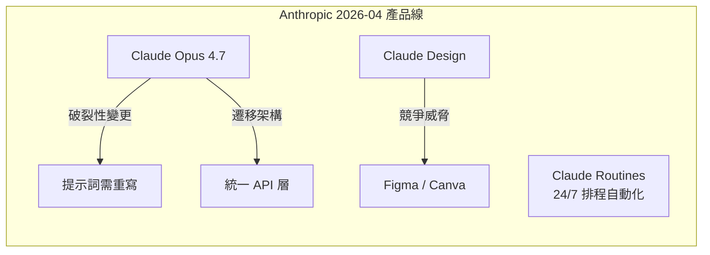

# AI Daily Digest — 2026-04-21

<!-- pipeline-generated:begin -->

## 🔥 今日 TOP 3
### 1. Anthropic 雙公告：Opus 4.7 發布，AI 設計工具直指 Figma
2026 年 4 月，Anthropic 同日發布 Claude Opus 4.7（目前最強基礎模型）與一款對話式 AI 設計工具，可透過自然語言提示生成 UI 介面、品牌識別與行銷素材。多數輿論聚焦 Opus 4.7 的模型能力提升，卻忽略後者對設計軟體生態的潛在衝擊。

這標誌著 Anthropic 商業策略已從「模型供應商」擴展至「直接取代應用層工具」的新方向。Figma 與 Canva 的核心護城河——低學習曲線的視覺設計工具——正面臨對話式 AI 的正面挑戰。此前 AI 工具多作為輔助，此次是首次有基礎模型廠商以自有產品直接競爭設計 SaaS。

值得持續觀察 Figma 與 Canva 的回應策略（嵌入 AI 防守 vs. 對抗式競爭），以及 Anthropic 設計工具輸出精度的迭代速度。對產品與行銷團隊，現在是評估「現有設計工具訂閱替代可行性」的最佳時間點，應安排小規模試用並建立比較基準。

📖 [閱讀完整 insight](../10-insights/2026-04-21/inbox_70b2e6c0.md) · 🔗 [原文連結](https://medium.com/@white9349/anthropic-just-dropped-two-bombshells-and-most-people-missed-both-308a76d8539a?source=rss------artificial_intelligence-5)
### 2. AI 治理速度滯後正在系統性蠶食企業投資報酬率
AI 已能以 2026 年的速度交付成果，但多數企業的審批流程、合規評估與部署管道仍停留在 2019 年架構——造成「開發完成 → 上線」之間出現數週到數月的堆積缺口，完成的 AI 成果在審批佇列中等待，無法轉化為商業價值。

對已大量投入 AI 預算的企業，這意味著 ROI 被組織瓶頸而非技術能力所限制。技術團隊的效率提升無法對應商業交付速度，造成高管層對 AI 投資的失望情緒——而根因在治理框架，而非 AI 能力不足。此問題的嚴重性隨 AI 開發速度提升而等比放大，是「AI Summer」階段最被低估的組織風險。

組織應以「成果完成到上線」的週期時間（cycle time）為核心 AI 成熟度指標。具體干預點包括：決策授權層級下移、自動化合規審查、CI/CD 部署管道現代化。治理框架升級是 2026 年 AI ROI 兌現的決定性瓶頸，應與技術投資同步列入預算規劃。

📖 [閱讀完整 insight](../10-insights/2026-04-21/inbox_dacbebff.md) · 🔗 [原文連結](https://medium.com/@michael-hutson/why-your-ai-investment-is-currently-rotting-in-a-queue-f8ec78bd8da7?source=rss------artificial_intelligence-5)
### 3. 速度優先心態正將 AI 生成代碼安全缺陷烙入生產架構
AI 大幅提升編碼速度後，開發者傾向跳過安全審查、滲透測試與最佳實踐，部分原因是錯誤地假設 AI 生成的代碼已具備安全性。此模式已在多個工程團隊中被重複觀察，形成結構性的「安全定時炸彈」——系統表面運行正常，但內部充滿可被利用的漏洞。

安全缺陷若在架構設計層就已嵌入，事後修復成本遠高於早期預防。與前 AI 時代相比，缺陷產生速度加快而安全審查速度未相應提升，造成「安全債務」快速累積。這是 AI 時代特有的新型風險模式：生產力工具同時創造了一個系統性的認知盲區。

工程組織應在 CI/CD 中設立不可繞過的安全閘門（SAST 掃描、依賴審計、安全代碼評審），並修訂 AI 編碼使用規範，明確規定 AI 生成代碼不免除安全複查義務。對於已大量採用 AI coding tools 的團隊，建議立即進行一次「安全債務盤點」，優先修復架構層的設計缺陷。

📖 [閱讀完整 insight](../10-insights/2026-04-21/inbox_dcb37dd2.md) · 🔗 [原文連結](https://medium.com/@karmacharyadiya02/the-dark-side-of-the-vibe-why-ai-generated-code-is-a-security-time-bomb-74862a8e544a?source=rss------artificial_intelligence-5)

## 📚 分類摘要
### foundation_models
Anthropic 今日幾乎主導所有重大公告。Claude Opus 4.7 正式發布（inbox_70b2e6c0），為目前最強基礎模型；同日推出的 AI 設計工具直接挑戰 Figma 與 Canva，標誌著策略從模型供應商擴展至應用層競爭。Claude Routines（inbox_87a65d3e）以「24/7 員工」為定位同步公告，細節有限，但命名暗示定期排程型自動化的正式產品化。Claude Design（inbox_41e73992）以對話式提示驅動 UI、品牌與行銷素材生成，專為非技術獨立創作者設計，五個具體使用場景均已公開展示。

從技術遷移角度，Opus 4.7 升級存在破裂性的提示詞不相容（inbox_0563f2f2）——舊有提示策略需重寫，prompt 兼容性測試應列為必要升級步驟，而非可選驗證。inbox_851ab167 進一步指出，建立統一的模型 API 抽象層（管理版本切換、成本控制、參數管理）是應對此類週期性升級的正確架構解法，實際遷移工作量普遍被低估。

社群出現值得關注的輕量提示工程技巧（inbox_b86362d0）：開發者以 200 行 Markdown 記錄 Claude 的歷史錯誤清單，注入對話 context 作為「犯罪紀錄」，實驗結果顯示顯著降低重複犯錯率，已成為作者本年度最具生產力的 Claude 優化工具，開源專案 claude-anti-mem 可公開取用。

### agents
Claude Cowork（inbox_51a89c9a）展示了 AI 代理向非技術用戶普及的關鍵案例：使用者無需撰寫程式，僅透過自然語言驅動 Claude 代理自動從 40+ 頁 Notion 資料庫整理資料。文章提供具體設置步驟，印證 AI 代理正從工程師工具轉型為一般辦公生產力工具的演進趨勢。

然而，生產環境部署 AI 代理時存在一個被嚴重低估的運維風險（inbox_d409d345）：靜默故障（silent failure）。作者在 Mac Mini 上運行的 AI 代理曾連續三天無聲停止工作，無任何錯誤訊息、日誌或告警，直到人工察覺才發現。AI agent 不同於傳統服務——失敗時不拋 exception，而是靜默停止，使標準監控儀表板難以偵測。對於依賴 AI 代理執行重要任務的應用，缺乏主動健康檢查與故障通知機制是高優先風險點，心跳機制與任務完成率追蹤應視為代理系統的基礎設施標配。
### infra
inbox_801193d6 展示了一個高實用性的 Claude Code 應用場景：透過客製化 Skills 在 Git pre-commit 階段自動掃描 IaC 工具鏈（Terraform、Pulumi 等）中的硬編碼祕密（API keys、密碼、token），將安全左移至版本提交前最早期防線。此方案無需引入額外 CI/CD 外掛，僅透過 Claude Code Skill 擴充即可實現，對使用 IaC 的基礎設施工程師具有直接落地價值。

inbox_2fc52b52 提供了 Spring Boot + RAG 的完整端到端實裝教程，涵蓋向量化、檢索、LLM 生成三層整合標準流程，為系列最終章，完成從基礎聊天 → 向量儲存 → 完整 RAG 的全流程閉環。適合需要快速搭建企業對話系統原型的 Java/Spring 技術棧團隊，以標準化流程降低原型開發周期。

## 🎯 專欄
### 🛠 Claude Code / Codex 新功能
- [0.123.0-alpha.2](../10-insights/2026-04-21/inbox_11e3b013.md) — OpenAI Codex 發布 0.123.0-alpha.2 版本。該版本僅提供標題，未提供詳細更新說明。
- [0.123.0-alpha.3](../10-insights/2026-04-21/inbox_546bd9f7.md) — OpenAI Codex 發布 0.123.0-alpha.3 版本。
- [The $50 Billion IDE: Why Cursor’s $2B Mega-Raise Just Broke the AI Coding Matrix](../10-insights/2026-04-21/inbox_a2b845c0.md) — AI 編寫 IDE Cursor 完成 $2B 融資，作者將其估值推至 $500 億級別。指出此輪融資象徵 2026 年 AI Summer 期間，整個軟體工程領域正經歷根本性 AI 重塑，AI 編寫工具從邊緣走向市場中心。
- [10 GitHub Repos That Cut Claude Code Token Usage by Up to 90%](../10-insights/2026-04-21/inbox_e08fa917.md) — 一篇指南介紹 10 個 GitHub 專案/工具，宣稱能將 Claude Code 的 token 使用量最多降低 90%。作者親身經歷在使用 Claude Code 數週後驚覺成本高昂，遂蒐集並分析這些開源優化方案。但原文未列舉這 10 
- [20 Claude Code Commands That Make Your Life Easier (Most People Don’t Know Them)](../10-insights/2026-04-21/inbox_eecfaf96.md) — 一篇進階指南介紹 20 個鮮為人知的 Claude Code 命令與技巧，聲稱大多數使用者只將 Claude Code 當作「終端版 ChatGPT」，因而忽略了 80% 的功能潛力。文章暗示存在大量隱藏的高效命令，但原文未揭露任何具體命令
### 📚 AI 知識管理
- [How NLP Models Represent Meaning (Embeddings Explained Simply)](../10-insights/2026-04-21/inbox_9ec072f6.md) — 教育文章解釋 NLP 模型在 tokenization 後如何運用 embedding 向量來表示和捕捉文本語義意涵。
- [The Grand Finale: Chat with Your Data Using a Full RAG System in Spring Boot](../10-insights/2026-04-21/inbox_2fc52b52.md) — Spring Boot AI 系列最終章，示範完整 RAG（檢索增強生成）系統實裝。前文涵蓋基礎聊天應用與向量儲存，此篇整合端到端流程：向量化 → 檢索 → LLM 生成。主要技術棧包括 Spring AI 框架、向量資料庫、LLM API
### 🏢 企業導入 AI / 團隊實踐
- [5 Business Processes You Should Automate First Using AI](../10-insights/2026-04-21/inbox_ead50d9b.md) — 業務流程自動化從前沿企業的可選投資演變為現代競爭環境的生存基線。在數據驅動的商業世界中，不採用自動化的組織將面臨淘汰風險。文章標題暗示有五個應優先自動化的流程，但具體內容在提供的摘要中不完整。
- [How NLP Models Represent Meaning (Embeddings Explained Simply)](../10-insights/2026-04-21/inbox_9ec072f6.md) — 教育文章解釋 NLP 模型在 tokenization 後如何運用 embedding 向量來表示和捕捉文本語義意涵。
- [Creative AI Is Overrated. Reliable AI Will Win the Next Wave.](../10-insights/2026-04-21/inbox_cdf313f5.md) — 本文主張當前 AI 產業過度強調創意能力，實則可靠性（consistency）才是下一波發展的決勝關鍵。作者認為未來 AI 系統應從追求想像力轉向追求穩定可靠的輸出，直接挑戰了「AI 創意應用」的產業敘事。這觀點對企業應用場景特別相關：穩定
- [The Grand Finale: Chat with Your Data Using a Full RAG System in Spring Boot](../10-insights/2026-04-21/inbox_2fc52b52.md) — Spring Boot AI 系列最終章，示範完整 RAG（檢索增強生成）系統實裝。前文涵蓋基礎聊天應用與向量儲存，此篇整合端到端流程：向量化 → 檢索 → LLM 生成。主要技術棧包括 Spring AI 框架、向量資料庫、LLM API
- [Top Python and AI skills for making money in 2026](../10-insights/2026-04-21/inbox_55e128ea.md) — 本文探討 2026 年如何透過 Python 和 AI 技能創造收入的實用策略。作者核心論點：賺錢的關鍵不在盲目追逐每週新推出的模型更新，而在於建立深度的應用能力與實戰經驗。文章可能涵蓋具體的技能組合架構（如提示工程、框架整合、數據處理）以
### 🎓 AI 使用技巧 / 心法
- [Stop Using Old Prompts! The Claude Opus 4.7 Hack Guide](../10-insights/2026-04-21/inbox_0563f2f2.md) — Claude Opus 4.7 版本發布後改變了部分提示詞的相容性，導致舊的提示詞模式不再有效。本文分析 Opus 4.7 中哪些方面發生了破裂式改變、改變的原因，以及開發者應如何調整提示詞策略來適配新版本。作者建議使用者立即停止依賴舊的提
- [20 Claude Code Commands That Make Your Life Easier (Most People Don’t Know Them)](../10-insights/2026-04-21/inbox_eecfaf96.md) — 一篇進階指南介紹 20 個鮮為人知的 Claude Code 命令與技巧，聲稱大多數使用者只將 Claude Code 當作「終端版 ChatGPT」，因而忽略了 80% 的功能潛力。文章暗示存在大量隱藏的高效命令，但原文未揭露任何具體命令
- [Top Python and AI skills for making money in 2026](../10-insights/2026-04-21/inbox_55e128ea.md) — 本文探討 2026 年如何透過 Python 和 AI 技能創造收入的實用策略。作者核心論點：賺錢的關鍵不在盲目追逐每週新推出的模型更新，而在於建立深度的應用能力與實戰經驗。文章可能涵蓋具體的技能組合架構（如提示工程、框架整合、數據處理）以
- [Claude Opus 4.7: Why AI Teams Need a Unified Model API Layer](../10-insights/2026-04-21/inbox_851ab167.md) — Claude Opus 4.7 升級時，團隊面臨的最大挑戰不在新模型本身，而在 API 層的統一與遷移。企業需建立統一的模型 API 層以便管理版本、切換模型、控制成本。遷移涉及 prompt 相容性驗證、參數調整、測試覆蓋等複雜協調，往往
### ⛓️ 區塊鏈 / Web3
- [0.123.0-alpha.2](../10-insights/2026-04-21/inbox_11e3b013.md) — OpenAI Codex 發布 0.123.0-alpha.2 版本。該版本僅提供標題，未提供詳細更新說明。
- [0.123.0-alpha.3](../10-insights/2026-04-21/inbox_546bd9f7.md) — OpenAI Codex 發布 0.123.0-alpha.3 版本。
- [How NLP Models Represent Meaning (Embeddings Explained Simply)](../10-insights/2026-04-21/inbox_9ec072f6.md) — 教育文章解釋 NLP 模型在 tokenization 後如何運用 embedding 向量來表示和捕捉文本語義意涵。
### 🔐 AI 安全 / 濫用
- [The Dark Side of the “Vibe”: Why AI‑Generated Code Is a Security Time Bomb](../10-insights/2026-04-21/inbox_dcb37dd2.md) — AI 生成代碼帶來的安全隱患正在加速惡化，因為開發團隊被速度優先的心態（作者稱之為「vibe」）所驅動。當 AI 使代碼編寫速度大幅提升時，開發者傾向於跳過安全審查、滲透測試和最佳實踐，導致代碼在架構設計階段就存在嚴重安全缺陷。許多開發者錯

## 💡 今日 Takeaway

_讀完今日所有內容後，可帶走的知識點_
### 1. LLM 錯誤紀錄注入 context 可降低重複犯錯率
LLM 沒有跨對話的持久記憶，但可透過在 context 中顯式提供「錯誤紀錄清單」來模擬學習效果——這是 claude-anti-mem 的核心原理。以 200 行 Markdown 記錄歷史錯誤模式，每次對話前作為 system context 注入，模型在生成時會主動規避已知模式。此方法無需 fine-tuning 或複雜基礎設施，可推廣至任何需要持續校正模型行為的工作流，對長期維護的 AI 應用尤具價值。

_類型：technique_

**參考來源**：
- [I Gave Claude a Rap Sheet of Its Own Mistakes. It Stopped Repeating Them.](../10-insights/2026-04-21/inbox_b86362d0.md) · [原文](https://ai.plainenglish.io/i-gave-claude-a-rap-sheet-of-its-own-mistakes-it-stopped-repeating-them-f154410c16b8?source=rss------claude-5)
### 2. 生產 AI Agent 靜默故障需主動健康檢查，非被動監控
AI agent 失敗時往往不拋異常而是靜默停止，使常規監控儀表板難以偵測——這與傳統服務行為根本不同。設計代理系統時應在初期就嵌入心跳機制、任務完成率追蹤與多通道告警（Slack、email），而非上線後補救。對定期排程或持續運行的 agent，建議以獨立守護程序確認任務是否在預期時間窗內完成，並設定超時告警閾值。

_類型：pattern_

**參考來源**：
- [Two Months of AI Agents on a Mac Mini. Here’s the Silent Bug I Still Can’t Forgive.](../10-insights/2026-04-21/inbox_d409d345.md) · [原文](https://medium.com/@pixipace/two-months-of-ai-agents-on-a-mac-mini-heres-the-silent-bug-i-still-can-t-forgive-b3aeabc27f1e?source=rss------artificial_intelligence-5)
### 3. AI ROI 決定性瓶頸在治理框架現代化速度而非技術能力
「AI 開發速度 vs. 組織審批速度」的錯配是可重複觀察的企業失敗模式：技術能力提升時，若決策流程未同步升級，成果將堆積在審批佇列中無法兌現商業價值。評估組織 AI 成熟度的核心指標應是「成果完成到上線」的 cycle time，而非模型能力強弱。縮短此週期需要授權下移、自動化合規審查、CI/CD 管道現代化三管齊下。

_類型：framework_

**參考來源**：
- [Why Your AI Investment Is Currently Rotting in a Queue](../10-insights/2026-04-21/inbox_dacbebff.md) · [原文](https://medium.com/@michael-hutson/why-your-ai-investment-is-currently-rotting-in-a-queue-f8ec78bd8da7?source=rss------artificial_intelligence-5)
### 4. AI 編碼速度提升若無安全閘門將系統性累積架構層安全債務
AI 提升開發速度的同時創造一個認知盲區：開發者易誤以為 AI 生成代碼已具安全性，從而跳過安全審查。缺陷在架構層就已嵌入，事後修復成本遠高於設計時預防，且系統表面運行正常，難以在攻擊前察覺。解法是在 pipeline 中設立不可繞過的安全閘門（SAST 掃描、依賴審計、安全代碼評審），使安全審查成為必要步驟而非可選環節。

_類型：pattern_

**參考來源**：
- [The Dark Side of the “Vibe”: Why AI‑Generated Code Is a Security Time Bomb](../10-insights/2026-04-21/inbox_dcb37dd2.md) · [原文](https://medium.com/@karmacharyadiya02/the-dark-side-of-the-vibe-why-ai-generated-code-is-a-security-time-bomb-74862a8e544a?source=rss------artificial_intelligence-5)
### 5. 基礎模型版本升級的主要挑戰在 API 遷移架構而非能力評估
企業升級 Claude Opus 4.7 等新版基礎模型的主要阻力不在「新模型夠不夠強」，而在「現有 prompts 相容性驗證、參數調整與測試覆蓋」，工作量普遍被低估。建立統一的模型 API 抽象層（版本路由、A/B 測試切換、成本追蹤）是應對週期性升級的基礎設施解法，可將每次遷移成本從數週壓縮至數天。Opus 4.7 的破裂性提示詞變更是此原則的具體例證。

_類型：framework_

**參考來源**：
- [Claude Opus 4.7: Why AI Teams Need a Unified Model API Layer](../10-insights/2026-04-21/inbox_851ab167.md) · [原文](https://medium.com/@social_18794/claude-opus-4-7-why-ai-teams-need-a-unified-model-api-layer-caf775a93359?source=rss------claude-5)
- [Stop Using Old Prompts! The Claude Opus 4.7 Hack Guide](../10-insights/2026-04-21/inbox_0563f2f2.md) · [原文](https://medium.com/@tentenco/stop-using-old-prompts-the-claude-opus-4-7-hack-guide-1379a9ecdd69?source=rss------claude-5)

<!-- pipeline-generated:end -->

<!-- user-notes -->
<!-- Write your own notes below; pipeline never touches this section. -->