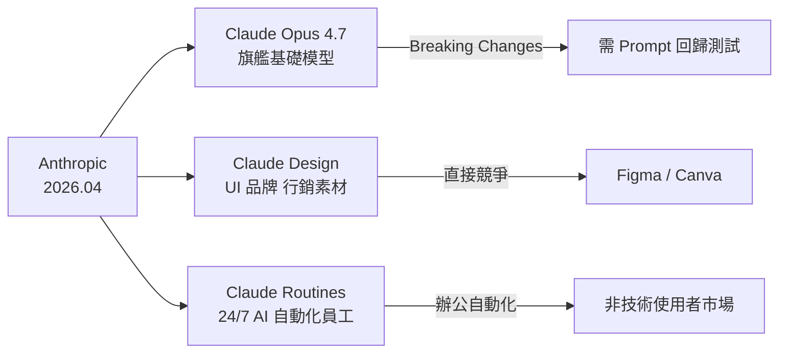
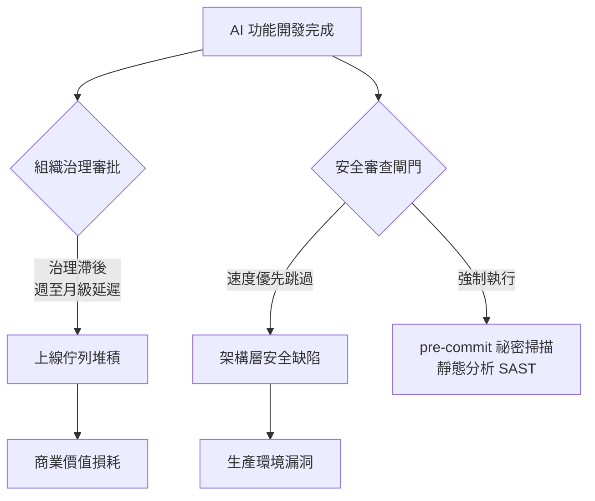

# AI Daily Digest — 2026-04-21

<!-- pipeline-generated:begin -->

## 🔥 今日 TOP 3
### 1. Claude Opus 4.7 發布，AI 設計工具同日登場直攻 Figma／Canva
Anthropic 在 2026 年 4 月同時公告兩項重大更新：Claude Opus 4.7 正式上線（目前最強旗艦基礎模型），以及一款 AI 設計生成工具，其自然語言驅動的設計能力被認為足以正面挑戰 Figma 與 Canva 的核心業務。多數觀察者只注意到 Opus 4.7 的模型更新，卻忽略了設計工具才是更具顛覆性的戰略訊號。

這標誌著 Anthropic 從「能力競賽」升級為「垂直應用替代」——不再只是 benchmark 超越競品，而是直接推出可取代現有 SaaS 軟件的應用層產品。Claude Design 支援 UI、品牌識別、行銷素材等多元場景，若品質達到設計師可接受的門檻，對傳統設計工具生態的影響將是結構性的。這也代表 AI Lab 的商業模式正在演化：基礎模型 API 不再是唯一收入來源，垂直應用市場的直接競爭正式開始。

短期觀察重點：Figma 和 Canva 的回應策略與股價反應；Claude Design 的實際設計品質與輸出一致性測試。對開發者而言，Opus 4.7 存在破裂性 prompt 相容性變更，升級前應先建立 prompt 回歸測試套件，並評估 API 遷移工程成本是否已納入規劃。

📖 [閱讀完整 insight](../10-insights/2026-04-21/inbox_70b2e6c0.md) · 🔗 [原文連結](https://medium.com/@white9349/anthropic-just-dropped-two-bombshells-and-most-people-missed-both-308a76d8539a?source=rss------artificial_intelligence-5)
### 2. 對 LLM 提供自身歷史錯誤清單，能有效降低重複犯錯率
一位開發者建立了 claude-anti-mem 工具：以 200 行 Markdown 記錄 Claude 歷史上曾犯過的錯誤，並在每次對話開始時將這份「犯罪紀錄」注入 context。實驗結果顯示，Claude 在閱讀自身錯誤清單後，重複犯同類錯誤的頻率顯著降低，作者稱之為年度最有效的 prompt 工程方案。

這個洞見的重要性在於：它不依賴 fine-tuning、模型版本升級或任何額外 API 費用，純靠 context 工程實現持久性行為矯正，邊際成本趨近於零。這同時驗證了「negative few-shot」在降低特定錯誤模式上的有效性，也暗示 LLM 具備根據具體錯誤案例調整後續行為的元認知能力——這對理解 LLM 能力邊界有一定研究價值。

任何長期使用 Claude 的工作流均可立即套用：建立並持續維護一份「已知錯誤清單」，固定放入 system prompt 開頭。後續值得追蹤此技巧是否對 GPT-4o、Gemini 同樣有效，以判斷這是 Claude 特有的模型特性還是普適的 context 工程技巧。

📖 [閱讀完整 insight](../10-insights/2026-04-21/inbox_b86362d0.md) · 🔗 [原文連結](https://ai.plainenglish.io/i-gave-claude-a-rap-sheet-of-its-own-mistakes-it-stopped-repeating-them-f154410c16b8?source=rss------claude-5)
### 3. AI 開發速度超越企業治理速度，組織流程成 ROI 的真正瓶頸
企業的 AI 開發速度已大幅躍升，但決策、審批和部署流程卻仍停留在舊有框架——AI 能以 2026 年節奏交付成果，治理流程卻仍是 2019 年設計。結果是：已完成的 AI 成果大量堆積在上線佇列中無法及時轉化為商業價值，形成隱性的價值損耗。

問題的核心不在技術能力，而在組織設計缺陷：風險評估框架、合規審查、部署管道都是為較慢的交付節奏所設計的。當 AI 使開發速度提升 3-10 倍，這些流程本身就成了業務加速的阻礙。更危險的是，許多組織並未意識到這個缺口的存在，因為「已完成」和「已上線」往往被誤作等號，管理層看到的是進展，而非堆積。

實務行動建議：量化你的組織從「AI 功能開發完成」到「正式上線」的平均天數——這個數字就是治理滯後的量化指標。若超過兩週，應將重構治理框架列為優先級，包含精簡審批路徑、建立 AI 專屬快速通道，否則技術投資的邊際效益將持續遞減。

📖 [閱讀完整 insight](../10-insights/2026-04-21/inbox_dacbebff.md) · 🔗 [原文連結](https://medium.com/@michael-hutson/why-your-ai-investment-is-currently-rotting-in-a-queue-f8ec78bd8da7?source=rss------artificial_intelligence-5)

## 📚 分類摘要
### foundation_models
本日 Anthropic 在基礎模型與應用層同時全面出擊：Claude Opus 4.7 正式發布，同期推出 Claude Design（AI 設計生成工具，直接挑戰 Figma／Canva）與 Claude Routines（定位為「24/7 AI 員工」的自動化功能，但目前無具體技術細節可供評估）。這三項公告合計代表 Anthropic 在 2026 年 4 月最密集的產品攻勢，戰略從「模型能力突破」全面轉向「垂直應用替代」（inbox_70b2e6c0、inbox_41e73992、inbox_87a65d3e）。

Opus 4.7 升級帶來不可忽視的工程挑戰：舊版 prompt 存在破裂性相容性變更（inbox_0563f2f2），API 遷移的協調成本遠超預期，涵蓋 prompt 相容性驗證、參數重調和測試覆蓋，往往耗時超過模型技術評估本身（inbox_851ab167）。在工具鏈層面，claude-anti-mem（inbox_b86362d0）以 200 行 Markdown 記錄 Claude 歷史錯誤並注入 context，顯著降低重複犯錯率，是本日最高品質的實用 prompt 工程技巧（insight_quality=5）。Claude Code Skills 已可整合至 IaC pre-commit 流程，自動攔截硬編碼 API keys 與 token，安全防線左移至版本控制最前端（inbox_801193d6）。
### agents
Claude Cowork 示範了 AI agent 向非技術使用者普及的具體路徑（inbox_51a89c9a）：用戶無需編程即可啟動 Claude agent 自動從 40+ 頁 Notion 資料庫彙整資料，辦公自動化應用的技術門檻正在系統性降低。這個趨勢的核心含義是：AI agent 的主要使用者群體正從工程師擴展至一般知識工作者，no-code 介面與自然語言指令將成為 agent 平台的核心競爭要素。

然而，一個 Mac Mini 本地部署 AI agents 長達兩個月的真實案例（inbox_d409d345）揭露了嚴重運維風險：靜默故障讓 agent 停止工作整整三天，期間無任何告警通知，直到人工巡查才發現。這代表一個重要的架構原則：生產級 AI agent 必須配備 heartbeat 定期檢查、任務輸出驗證與異常推播通知。本地部署尤為危險，因為缺乏雲端平台的內建告警機制兜底，「看起來正常運行」並不等同於「確實在運行」。
### infra
AI 輔助開發的速度紅利正在製造新型安全債（inbox_dcb37dd2）：開發者被速度優先心態驅動而跳過安全審查，並普遍誤以為 AI 生成代碼天然安全。架構設計層的安全缺陷一旦形成，事後補救成本呈指數上升，而組織往往在爆出漏洞前對此毫無感知。Claude Code Skills 的 pre-commit 祕密掃描方案（inbox_801193d6）提供了可立即落地的起點：在 Git 提交最早期自動攔截硬編碼憑證，強制安全閘門內建於開發流程而非依賴自律。

企業治理框架的系統性滯後（inbox_dacbebff）則是更深層的組織問題：AI 開發速度已是 2026 年節奏，但審批、合規與部署流程仍是 2019 年設計，已完成的 AI 功能在上線佇列堆積、商業價值持續損耗。解決方案不在加快開發，而在同步重構治理框架——包含建立 AI 專屬快速審批通道、自動化合規驗證，以消除組織摩擦力。

## 🎯 專欄
### 🛠 Claude Code / Codex 新功能
- **[0.123.0-alpha.2](../10-insights/2026-04-21/inbox_11e3b013.md)**
  OpenAI Codex 發布 0.123.0-alpha.2 版本。該版本僅提供標題，未提供詳細更新說明。
- **[0.123.0-alpha.3](../10-insights/2026-04-21/inbox_546bd9f7.md)**
  OpenAI Codex 發布 0.123.0-alpha.3 版本。
- **[The $50 Billion IDE: Why Cursor’s $2B Mega-Raise Just Broke the AI Coding Matrix](../10-insights/2026-04-21/inbox_a2b845c0.md)**
  AI 編寫 IDE Cursor 完成 $2B 融資，作者將其估值推至 $500 億級別。指出此輪融資象徵 2026 年 AI Summer 期間，整個軟體工程領域正經歷根本性 AI 重塑，AI 編寫工具從邊緣走向市場中心。
- **[10 GitHub Repos That Cut Claude Code Token Usage by Up to 90%](../10-insights/2026-04-21/inbox_e08fa917.md)**
  一篇指南介紹 10 個 GitHub 專案/工具，宣稱能將 Claude Code 的 token 使用量最多降低 90%。作者親身經歷在使用 Claude Code 數週後驚覺成本高昂，遂蒐集並分析這些開源優化方案。但原文未列舉這 10 個專案的具體名稱、類型或各自的成本削減幅度。
- **[20 Claude Code Commands That Make Your Life Easier (Most People Don’t Know Them)](../10-insights/2026-04-21/inbox_eecfaf96.md)**
  一篇進階指南介紹 20 個鮮為人知的 Claude Code 命令與技巧，聲稱大多數使用者只將 Claude Code 當作「終端版 ChatGPT」，因而忽略了 80% 的功能潛力。文章暗示存在大量隱藏的高效命令，但原文未揭露任何具體命令名稱或用途。
### 📚 AI 知識管理
- **[How NLP Models Represent Meaning (Embeddings Explained Simply)](../10-insights/2026-04-21/inbox_9ec072f6.md)**
  教育文章解釋 NLP 模型在 tokenization 後如何運用 embedding 向量來表示和捕捉文本語義意涵。
- **[The Grand Finale: Chat with Your Data Using a Full RAG System in Spring Boot](../10-insights/2026-04-21/inbox_2fc52b52.md)**
  Spring Boot AI 系列最終章，示範完整 RAG（檢索增強生成）系統實裝。前文涵蓋基礎聊天應用與向量儲存，此篇整合端到端流程：向量化 → 檢索 → LLM 生成。主要技術棧包括 Spring AI 框架、向量資料庫、LLM API 整合，適合快速掌握企業級對話系統原型的 Java/Spring 開發者。實戰教程風格，省略理論細節，直指關鍵集成點。
### 🏢 企業導入 AI / 團隊實踐
- **[5 Business Processes You Should Automate First Using AI](../10-insights/2026-04-21/inbox_ead50d9b.md)**
  業務流程自動化從前沿企業的可選投資演變為現代競爭環境的生存基線。在數據驅動的商業世界中，不採用自動化的組織將面臨淘汰風險。文章標題暗示有五個應優先自動化的流程，但具體內容在提供的摘要中不完整。
- **[How NLP Models Represent Meaning (Embeddings Explained Simply)](../10-insights/2026-04-21/inbox_9ec072f6.md)**
  教育文章解釋 NLP 模型在 tokenization 後如何運用 embedding 向量來表示和捕捉文本語義意涵。
- **[Creative AI Is Overrated. Reliable AI Will Win the Next Wave.](../10-insights/2026-04-21/inbox_cdf313f5.md)**
  本文主張當前 AI 產業過度強調創意能力，實則可靠性（consistency）才是下一波發展的決勝關鍵。作者認為未來 AI 系統應從追求想像力轉向追求穩定可靠的輸出，直接挑戰了「AI 創意應用」的產業敘事。這觀點對企業應用場景特別相關：穩定性優先於驚人創意。該論點暗示可靠性可能成為評估 AI 工具的首要指標，而非市場常見的功能炫耀競賽。
- **[The Grand Finale: Chat with Your Data Using a Full RAG System in Spring Boot](../10-insights/2026-04-21/inbox_2fc52b52.md)**
  Spring Boot AI 系列最終章，示範完整 RAG（檢索增強生成）系統實裝。前文涵蓋基礎聊天應用與向量儲存，此篇整合端到端流程：向量化 → 檢索 → LLM 生成。主要技術棧包括 Spring AI 框架、向量資料庫、LLM API 整合，適合快速掌握企業級對話系統原型的 Java/Spring 開發者。實戰教程風格，省略理論細節，直指關鍵集成點。
- **[Top Python and AI skills for making money in 2026](../10-insights/2026-04-21/inbox_55e128ea.md)**
  本文探討 2026 年如何透過 Python 和 AI 技能創造收入的實用策略。作者核心論點：賺錢的關鍵不在盲目追逐每週新推出的模型更新，而在於建立深度的應用能力與實戰經驗。文章可能涵蓋具體的技能組合架構（如提示工程、框架整合、數據處理）以及如何將 AI 技能轉化為市場價值的方法論。重點強調跨越模型炒作週期，建立長期競爭力才是在 AI 時代穩定獲利的正確路徑
### 🎓 AI 使用技巧 / 心法
- **[Stop Using Old Prompts! The Claude Opus 4.7 Hack Guide](../10-insights/2026-04-21/inbox_0563f2f2.md)**
  Claude Opus 4.7 版本發布後改變了部分提示詞的相容性，導致舊的提示詞模式不再有效。本文分析 Opus 4.7 中哪些方面發生了破裂式改變、改變的原因，以及開發者應如何調整提示詞策略來適配新版本。作者建議使用者立即停止依賴舊的提示詞範式，轉而採用針對 4.7 最佳化的新方法。
- **[20 Claude Code Commands That Make Your Life Easier (Most People Don’t Know Them)](../10-insights/2026-04-21/inbox_eecfaf96.md)**
  一篇進階指南介紹 20 個鮮為人知的 Claude Code 命令與技巧，聲稱大多數使用者只將 Claude Code 當作「終端版 ChatGPT」，因而忽略了 80% 的功能潛力。文章暗示存在大量隱藏的高效命令，但原文未揭露任何具體命令名稱或用途。
- **[Top Python and AI skills for making money in 2026](../10-insights/2026-04-21/inbox_55e128ea.md)**
  本文探討 2026 年如何透過 Python 和 AI 技能創造收入的實用策略。作者核心論點：賺錢的關鍵不在盲目追逐每週新推出的模型更新，而在於建立深度的應用能力與實戰經驗。文章可能涵蓋具體的技能組合架構（如提示工程、框架整合、數據處理）以及如何將 AI 技能轉化為市場價值的方法論。重點強調跨越模型炒作週期，建立長期競爭力才是在 AI 時代穩定獲利的正確路徑
- **[Claude Opus 4.7: Why AI Teams Need a Unified Model API Layer](../10-insights/2026-04-21/inbox_851ab167.md)**
  Claude Opus 4.7 升級時，團隊面臨的最大挑戰不在新模型本身，而在 API 層的統一與遷移。企業需建立統一的模型 API 層以便管理版本、切換模型、控制成本。遷移涉及 prompt 相容性驗證、參數調整、測試覆蓋等複雜協調，往往耗時超過採用新模型的技術評估。此洞見對正計畫升級 Claude 或其他新一代模型的團隊提供重要指導。
### ⛓️ 區塊鏈 / Web3
- **[0.123.0-alpha.2](../10-insights/2026-04-21/inbox_11e3b013.md)**
  OpenAI Codex 發布 0.123.0-alpha.2 版本。該版本僅提供標題，未提供詳細更新說明。
- **[0.123.0-alpha.3](../10-insights/2026-04-21/inbox_546bd9f7.md)**
  OpenAI Codex 發布 0.123.0-alpha.3 版本。
- **[How NLP Models Represent Meaning (Embeddings Explained Simply)](../10-insights/2026-04-21/inbox_9ec072f6.md)**
  教育文章解釋 NLP 模型在 tokenization 後如何運用 embedding 向量來表示和捕捉文本語義意涵。
### 🔐 AI 安全 / 濫用
- **[The Dark Side of the “Vibe”: Why AI‑Generated Code Is a Security Time Bomb](../10-insights/2026-04-21/inbox_dcb37dd2.md)**
  AI 生成代碼帶來的安全隱患正在加速惡化，因為開發團隊被速度優先的心態（作者稱之為「vibe」）所驅動。當 AI 使代碼編寫速度大幅提升時，開發者傾向於跳過安全審查、滲透測試和最佳實踐，導致代碼在架構設計階段就存在嚴重安全缺陷。許多開發者錯誤地假設 AI 生成的代碼是安全的，這種信心缺陷造成了一個「安全定時炸彈」——系統看起來運行良好，但其內部已充滿可被利用

## 💡 今日 Takeaway

_讀完今日所有內容後，可帶走的知識點_
### 1. 對 LLM 提供自身歷史錯誤清單，能有效降低重複犯錯率
將 LLM 曾犯過的具體錯誤整理為 Markdown 清單，固定注入每次對話的 system prompt 開頭。實驗顯示 Claude 在閱讀自身「犯罪紀錄」後會主動迴避同類失誤，效果優於口頭提醒或一次性通用指令。此技巧不依賴 fine-tuning，邊際成本趨近於零，可立即套用於任何長期人機協作工作流，並應隨使用持續更新清單內容。

_類型：technique_

**參考來源**：
- [I Gave Claude a Rap Sheet of Its Own Mistakes. It Stopped Repeating Them.](../10-insights/2026-04-21/inbox_b86362d0.md) · [原文](https://ai.plainenglish.io/i-gave-claude-a-rap-sheet-of-its-own-mistakes-it-stopped-repeating-them-f154410c16b8?source=rss------claude-5)
### 2. AI agent 缺乏主動監控時，靜默故障可能持續數天無人察覺
AI agent 的任務失敗往往不拋出明顯異常，而是靜默中止——系統外觀正常，但任務早已停止。生產部署必須配備 heartbeat 定期檢查、任務輸出驗證、以及異常推播通知，三者缺一不可。本地部署（如個人 Mac）的監控缺口尤為危險，因為沒有雲端平台的內建告警機制兜底，「沒報錯」不等於「在正常運行」。

_類型：pattern_

**參考來源**：
- [Two Months of AI Agents on a Mac Mini. Here’s the Silent Bug I Still Can’t Forgive.](../10-insights/2026-04-21/inbox_d409d345.md) · [原文](https://medium.com/@pixipace/two-months-of-ai-agents-on-a-mac-mini-heres-the-silent-bug-i-still-can-t-forgive-b3aeabc27f1e?source=rss------artificial_intelligence-5)
### 3. AI 交付速度超越治理速度時，組織流程成為 ROI 的真正殺手
當 AI 使交付速度提升數倍，企業若未同步升級審批與部署流程，已完成功能將堆積在上線佇列，商業價值持續損耗。量化指標是「開發完成到上線」的平均天數——若超過兩週，組織瓶頸而非技術能力才是根本問題。解法不在加快開發，而在重構治理框架，包含建立 AI 功能快速審批通道與自動化合規驗證。

_類型：framework_

**參考來源**：
- [Why Your AI Investment Is Currently Rotting in a Queue](../10-insights/2026-04-21/inbox_dacbebff.md) · [原文](https://medium.com/@michael-hutson/why-your-ai-investment-is-currently-rotting-in-a-queue-f8ec78bd8da7?source=rss------artificial_intelligence-5)
### 4. AI 生成代碼若繞過安全審查，架構層安全債難以事後補救
開發者使用 AI 生成代碼時常誤以為輸出天然安全，進而省略靜態分析與滲透測試。安全問題一旦嵌入架構設計層，事後修補成本遠高於早期攔截，且往往在爆出漏洞前對組織不可見。強制性安全閘門（pre-commit 祕密掃描、自動化 SAST）必須內建於 AI 輔助開發流程，而非依賴工程師自律執行。

_類型：pattern_

**參考來源**：
- [The Dark Side of the “Vibe”: Why AI‑Generated Code Is a Security Time Bomb](../10-insights/2026-04-21/inbox_dcb37dd2.md) · [原文](https://medium.com/@karmacharyadiya02/the-dark-side-of-the-vibe-why-ai-generated-code-is-a-security-time-bomb-74862a8e544a?source=rss------artificial_intelligence-5)
- [Claude Skills for IaC: Stop Hardcoded Secrets Before They Hit Git](../10-insights/2026-04-21/inbox_801193d6.md) · [原文](https://medium.com/@gokulnath70/claude-skills-for-iac-stop-hardcoded-secrets-before-they-hit-git-8e0c542211ad?source=rss------claude-5)
### 5. LLM 版本升級的隱性最大成本在 prompt 遷移協調，非模型評估
Claude Opus 4.7 升級案例顯示，破裂性 prompt 變更讓舊有提示詞失效，遷移工程——涵蓋 prompt 相容性驗證、參數重調、測試覆蓋率——耗時往往超過模型能力評估本身。規劃模型升級時應將遷移工程師人時納入成本估算，並預先建立 prompt 回歸測試套件作為版本驗收標準，而非等升級後才緊急補救。

_類型：framework_

**參考來源**：
- [Claude Opus 4.7: Why AI Teams Need a Unified Model API Layer](../10-insights/2026-04-21/inbox_851ab167.md) · [原文](https://medium.com/@social_18794/claude-opus-4-7-why-ai-teams-need-a-unified-model-api-layer-caf775a93359?source=rss------claude-5)
- [Stop Using Old Prompts! The Claude Opus 4.7 Hack Guide](../10-insights/2026-04-21/inbox_0563f2f2.md) · [原文](https://medium.com/@tentenco/stop-using-old-prompts-the-claude-opus-4-7-hack-guide-1379a9ecdd69?source=rss------claude-5)

<!-- pipeline-generated:end -->

<!-- user-notes -->
<!-- Write your own notes below; pipeline never touches this section. -->