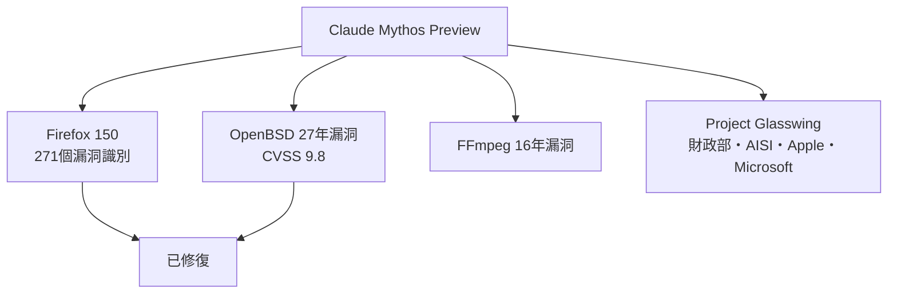
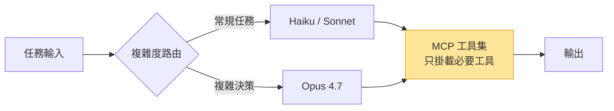

# AI Daily Digest — 2026-04-22

<!-- pipeline-generated:begin -->

## 🔥 今日 TOP 3
### 1. Claude Mythos Preview：數小時內識別 27 年歷史安全漏洞
2026 年 4 月 7 日，Anthropic 發布 Claude Mythos Preview，這是一個專攻深層代碼邏輯漏洞的模型。Mythos 在數小時內發現了存在 27 年的 OpenBSD 安全缺口（CVSS 9.8）與 16 年的 FFmpeg 漏洞，並已在 Firefox 150 代碼庫中識別出 271 個問題。該模型被整合進「Project Glasswing」政府-企業防禦聯盟，成員包含美國財政部、英國 AI 安全研究所、Apple 與 Microsoft，僅供藍隊防禦使用。

此前，人工安全審計與自動化 fuzzing 長期並存卻仍有系統性盲點。Mythos 識別零日攻擊鏈的計算成本僅約 2000 美元，意味著 LLM 已能在安全工程中產生傳統方法無法達成的深度因果推理。Mozilla CTO Bobby Holley 表示「防守方終於有機會決定性地贏下安全戰」，反映 AI 安全工具的實際效益已超越概念驗證階段。

下一步觀察：Mythos 是否會擴大至商業或更廣泛的開源社群使用；其他主要 AI 廠商是否跟進推出安全專用模型；以及 Project Glasswing 的免費計算資源能協助修補多少積累多年的歷史漏洞。

📖 [閱讀完整 insight](../10-insights/2026-04-22/inbox_ea5a9aa0.md) · 🔗 [原文連結](https://meetcyber.net/the-zero-day-factory-anthropics-mythos-and-the-end-of-code-security-d8e93ed9b20a?source=rss------large_language_models-5)
### 2. GitHub Copilot 定價重組：Agent 並行 session 使計算成本模型崩解
GitHub Copilot 宣布將 Claude Opus 4.7 限制於 39 美元/月的 Pro+ 方案，同步引入每會話與每周代幣用量上限，並暫停個人計畫新用戶註冊。官方聲明直接點名根因：「Agent 工作流從根本上改變了 Copilot 的運算需求，並行 session 消耗資源遠超原有計畫設計」。

這是 AI 服務定價的重要轉折點。傳統代碼補全是單次、有限 context 的請求，而 Agent 工作流是多輪、並行、可能持續數分鐘的 session，計算成本結構完全不同，使過去以「每請求計費」為基礎的定價模型徹底失效。同一時期 Anthropic 短暫測試將 Claude Code 限制為 Max 方案（$100+/月）後因強烈反彈撤回，顯示整個行業都在為 Agent 時代的成本結構尋找新的平衡點。

實務應對：任何正在規劃 Agent 系統的工程師或產品經理，預算規劃必須改以「average session compute」為計算單位，而非過去的「per-request token 數」；並應為 agent 工作流設計獨立的成本追蹤管道，以免在 AI 服務商統一調整定價時措手不及。

📖 [閱讀完整 insight](../10-insights/2026-04-22/inbox_0f9b7f75.md) · 🔗 [原文連結](https://simonwillison.net/2026/Apr/22/changes-to-github-copilot/#atom-everything)
### 3. MCP 工具連接的隱藏成本：背景 token 最高達整體用量 85%
每個已連接但未使用的 MCP 伺服器，在用戶輸入第一個字前就已將工具定義、名稱、描述、參數與 schema 元資料計入 token 費用。根據量測數據，這類背景消耗可達整體 token 用量的 85%，意味著大多數 Claude API 帳單的大宗是為「工具清單本身」而非「工具執行」買單。

對比傳統 API 設計，MCP 的優勢在於標準化與可組合性，但每個伺服器連接都附帶固定的 context 稅。連接 5 個以上 MCP 伺服器的複雜工作流會讓此問題倍數放大，在高頻呼叫場景下對快速 iteration 造成嚴重的成本壓力。這個特性在架構設計階段就需要納入考量，而非等到帳單出現才回頭優化。

立即可行的優化行動：審查 MCP 伺服器配置並禁用非必要的工具連接；若場景允許，按任務動態掛載 MCP 伺服器而非全程常駐，在不犧牲功能的前提下能大幅降低整體 token 消耗。

📖 [閱讀完整 insight](../10-insights/2026-04-21/inbox_7f7ae9aa.md) · 🔗 [原文連結](https://medium.com/@dan.avila7/save-up-to-85-of-your-claude-tokens-with-one-setting-22d78728b8a2?source=rss------claude-5)

## 📚 分類摘要
### foundation_models
Claude 陣線今日有多則重要動態。Claude Mythos Preview（inbox_ea5a9aa0）以具體案例展示 LLM 在安全工程的突破性應用：$2000 計算成本識別 CVSS 9.8 漏洞，被整合進 Project Glasswing 政府-企業防禦聯盟並已在 Mozilla Firefox 150 中識別 271 個漏洞。Claude Code v2.1.117（inbox_113aa3f4）修正了 Opus 4.7 context window 長期錯誤（200K 誤標應為 1M），解決自動壓縮過早觸發與 /context 百分比虛高問題；本機構建同步改用內置 bfs/ugrep 替代 Glob/Grep 提升搜尋速度。Anthropic 解釋性 AI 研究（inbox_b05a22bd）在 Claude 中識別出 171 個可控神經元特徵，特定特徵被調整後會顯著增加有害行為傾向，為 AI 對齊提供新方向但也揭露可操控風險。

OpenAI 方面，GPT-Image-2 與 ChatGPT Images 2.0（inbox_8f77a230、inbox_91c250ba）相繼發布，後者附帶完整 system card 安全評估文件與官方直播演示，顯示 OpenAI 在圖像生成的迭代週期已大幅壓縮。Mozilla 與 Anthropic 深度安全合作（inbox_dd3e1adc）完成 Firefox 150 代碼庫評估，這是 AI 模型正式整合進大型開源專案安全工程流程的重要標誌案例。

### agents
MCP 生態今日進入企業化成熟期。Cloudflare 發布 MCP 企業部署參考架構（inbox_e75daad0、inbox_57c81abd），聚焦三大要素：集中式治理（跨代理的統一權限與安全審查）、遠端伺服器基礎設施（分散式可擴展部署）、成本控制機制（防止多代理系統失控支出）。此舉標誌 MCP 從開發工具升級至 enterprise-grade 代理平台，需要完整的 DevOps 與治理框架才能進入生產環境。

成本優化方面有兩則關鍵發現需要同時閱讀。inbox_7f7ae9aa 揭露 MCP 背景 token 消耗可達 85%（工具定義本身即為主要成本驅動因素）；inbox_44bb3089 的「顧問策略」（Advisor Pattern）提出解法：用 Sonnet/Haiku 處理常規任務，Opus 4.7 專攻複雜決策，通過智能路由而非一律使用最高級模型來最佳化整體 agent 成本。兩則合併閱讀可形成完整的 agent 成本管理框架：先減少工具 context 稅，再以模型路由優化執行成本。

### infra
GitHub Copilot 定價重組（inbox_0f9b7f75）是今日最重要的基礎設施訊號：Agent 工作流的並行 session 特性使傳統 per-request 計費失效，促使 GitHub 轉向代幣額度限制並將 Opus 4.7 限制於 Pro+ 方案。Anthropic 同期短暫測試將 Claude Code 升至 Max 方案（$100+/月）後撤回（inbox_f7735784），Simon Willison 指出此舉的信任成本：定價測試若缺乏透明公告，可能觸發用戶轉投競品（如 OpenAI Codex）並造成永久性品牌傷害。

企業 AI 部署失敗模式方面，inbox_d070112d 記錄了 400 萬美元教訓：廠商演示理想化場景，而真實失敗點是多個歷史併購遺留的獨立員工系統與資料孤島。inbox_d71306d4 提供量化數據：73% 組織仍卡在資料品質，Microsoft 130 億美元 OpenAI 投資僅產生 8% 使用率，企業 AI 專案 70% 未達生產，澳洲銀行因缺乏詐欺偵測基礎設施而引發國會調查。

基礎設施韌性框架方面，inbox_bdd14adf 提出「主權故障域」概念：以法律/政治/物理司法管轄區定義故障邊界，主張跨境系統應以 multi-region 取代傳統 multi-AZ 作為高可用基線，並透過 ALE 成本模型量化地緣政治風險的投資正當性，對全球化部署的跨國企業有直接參考價值。

## 🎯 專欄
### 🛠 Claude Code / Codex 新功能
- **[v2.1.117](../10-insights/2026-04-22/inbox_113aa3f4.md)**
  Claude Code 發布 v2.1.117，包含多項核心功能改進。支援透過環境變數 CLAUDE_CODE_FORK_SUBAGENT=1 在外部構建中啟用 forked subagents；agent frontmatter 的 mcpServers 現已透過 --agent 參數為主線程代理 session 加載；改進 /model 命令使選擇在重啟
- **[[AINews] OpenAI launches GPT-Image-2](../10-insights/2026-04-22/inbox_8f77a230.md)**
  OpenAI 推出 GPT-Image-2 模型。同時，Cursor 獲得 xAI 價值 10 億美元的合約，並獲得 60 億美元的收購權。
- **[35 Claude Code Commands, Tricks, and Workflows That Actually Matter](../10-insights/2026-04-22/inbox_f880b442.md)**
  文章整理了使用 Claude Code 的 35 個實戰技巧，分為五大類別：必要指令（Plan Mode、/compact、/clear、/init、/cost、/memory 等）、生產力技巧（參考檔案、截圖除錯、測試優先、增量開發、git checkpoint）、架構技巧（依賴評估、安全掃描、效能分析、重構規劃）、工作流自動化（git hooks、CI/
- **[35 Claude Code Commands, Tricks, and Workflows That Actually Matter](../10-insights/2026-04-22/inbox_776102eb.md)**
  這篇文章整理了 35 個 Claude Code 的實用指令、技巧和工作流程。作者基於日常使用 Claude Code 自動化客戶工作流、交付 AI 系統、進行生產除錯的經驗，匯集這份清單。內容涵蓋開發者在 Claude Code 中最實用的操作，包括提升生產力、系統設計和實務除錯。文章強調這些技巧源自實戰經驗，並非理論指南。這份聚合指南對已使用 Claud
- **[Claude Code to be removed from Anthropic&#39;s Pro plan?](../10-insights/2026-04-21/inbox_53591d8a.md)**
  有傳言稱 Claude Code 可能將從 Anthropic Pro 計畫中被移除。此報導源自社交媒體（Bluesky/Twitter）討論，標題使用問號表示具有投機與未確認性質。Claude Code 是 Anthropic 提供的代碼編輯工具，若傳言屬實將影響 Pro 訂閱用戶的功能可用性與產品體驗。
### 🏢 企業導入 AI / 團隊實踐
- **[v2.1.117](../10-insights/2026-04-22/inbox_113aa3f4.md)**
  Claude Code 發布 v2.1.117，包含多項核心功能改進。支援透過環境變數 CLAUDE_CODE_FORK_SUBAGENT=1 在外部構建中啟用 forked subagents；agent frontmatter 的 mcpServers 現已透過 --agent 參數為主線程代理 session 加載；改進 /model 命令使選擇在重啟
- **[What You’re Actually Buying When You Buy Enterprise AI](../10-insights/2026-04-22/inbox_d070112d.md)**
  一家客戶花費 400 萬美元得到的教訓揭示企業 AI 採購的隱藏成本：廠商在 RFP 贏得的完美演示與實際部署的複雜性之間存在巨大落差。該客戶的 AI agent 在生產環境「未能如預期運作」，根本原因是企業內部有多個來自歷史併購的子組織，各自擁有獨立的員工系統與資料孤島。文章強調企業 AI 實際採購的不只是技術本身，而是理解與整合複雜組織結構、跨系統資料連
- **[Surviving the AI Wave in Companies](../10-insights/2026-04-22/inbox_e18d9ef2.md)**
  面對 AI 浪潮，組織應指導員工從「執行例行任務」轉向「詮釋、判斷、策略、優先順序、溝通與責任」等獨特人類價值。文章提出「清晰思考變得更寶貴」的關鍵觀點：當內容生成自動化時，定義問題、提出更好的問題、做出策略決策的能力更形重要。核心建議包括發展 AI 素養（理解 AI 的強項與限制）、擁抱持續學習、建立情感智慧與跨團隊協作、以及從「任務執行者」轉變為「問題解
- **[AI Is Moving Too Fast and Too Slowly at the Same Time.](../10-insights/2026-04-22/inbox_d71306d4.md)**
  文章揭露了 AI 部署的根本悖論：資本流動速度快於組織準備速度（「capital 移動快於 infrastructure」）。部署速度過快的證據包括：73% 在 2025 年啟動 AI 專案的組織仍以資料品質為首要障礙；Microsoft 130 億美元 OpenAI 投資僅產生 8% 使用率；澳洲銀行部署房貸 AI 因缺乏詐欺偵測基礎設施而系統性失敗、引發
- **[️ Claude Tutorial — Build a Tool-Using AI Agent: Calendar Management](../10-insights/2026-04-22/inbox_9b0f819d.md)**
  官方教程教導如何以日曆管理為實例建構 Claude tool-using agent，核心哲學是「聊天機器人旨在對話，Agent 旨在行動」。教程採用「五層同心圓」的漸進式結構：(1) 單一工具單次調用、(2) Agent 迴圈迭代（Agent 觀察工具結果後再決策）、(3) 多工具平行調用、(4) 錯誤處理與 robustness、(5) Tool Run
### 🎓 AI 使用技巧 / 心法
- **[v2.1.117](../10-insights/2026-04-22/inbox_113aa3f4.md)**
  Claude Code 發布 v2.1.117，包含多項核心功能改進。支援透過環境變數 CLAUDE_CODE_FORK_SUBAGENT=1 在外部構建中啟用 forked subagents；agent frontmatter 的 mcpServers 現已透過 --agent 參數為主線程代理 session 加載；改進 /model 命令使選擇在重啟
- **[35 Claude Code Commands, Tricks, and Workflows That Actually Matter](../10-insights/2026-04-22/inbox_f880b442.md)**
  文章整理了使用 Claude Code 的 35 個實戰技巧，分為五大類別：必要指令（Plan Mode、/compact、/clear、/init、/cost、/memory 等）、生產力技巧（參考檔案、截圖除錯、測試優先、增量開發、git checkpoint）、架構技巧（依賴評估、安全掃描、效能分析、重構規劃）、工作流自動化（git hooks、CI/
- **[How to Detect and Remove Spyware from your device](../10-insights/2026-04-22/inbox_a9c430b0.md)**
  本文介紹偵測和移除間諜軟體的實用步驟。因內容不可訪問，無法獲得具體細節。
- **[What If LLMs Learn Better from Language Than from Rewards?](../10-insights/2026-04-21/inbox_7a799d47.md)**
  文章探討 LLM 是否從自然語言反饋比從獎勵信號中學習更好，提及 TextGrad、MIPRO、GEPA 三種優化方法。因內容不可訪問，無法評估各方法的實驗結果與優劣對比。
- **[35 Claude Code Commands, Tricks, and Workflows That Actually Matter](../10-insights/2026-04-22/inbox_776102eb.md)**
  這篇文章整理了 35 個 Claude Code 的實用指令、技巧和工作流程。作者基於日常使用 Claude Code 自動化客戶工作流、交付 AI 系統、進行生產除錯的經驗，匯集這份清單。內容涵蓋開發者在 Claude Code 中最實用的操作，包括提升生產力、系統設計和實務除錯。文章強調這些技巧源自實戰經驗，並非理論指南。這份聚合指南對已使用 Claud
### 💳 支付 / Fintech
- **[AI Is Moving Too Fast and Too Slowly at the Same Time.](../10-insights/2026-04-22/inbox_d71306d4.md)**
  文章揭露了 AI 部署的根本悖論：資本流動速度快於組織準備速度（「capital 移動快於 infrastructure」）。部署速度過快的證據包括：73% 在 2025 年啟動 AI 專案的組織仍以資料品質為首要障礙；Microsoft 130 億美元 OpenAI 投資僅產生 8% 使用率；澳洲銀行部署房貸 AI 因缺乏詐欺偵測基礎設施而系統性失敗、引發
- **[Article: When a Cloud Region Fails: Rethinking High Availability in a Geopolitically Unstable World](../10-insights/2026-04-22/inbox_bdd14adf.md)**
  InfoQ 文章提出「主權故障域」概念──由法律、政治或物理司法管轄區定義的故障邊界，而非傳統硬體拓樸的故障域。文章將地理政治事件映射到已知的分散式系統故障模式，論證 multi-region 應取代 multi-AZ 成為跨境系統的 HA 基線，並提供設計模式、混沌實驗和 ALE 成本模型來量化和驗證投資正當性。這對於全球化部署、跨域合規和 DR 策略有直
### ⛓️ 區塊鏈 / Web3
- **[Tokenization to Neuralization](../10-insights/2026-04-22/inbox_3d288785.md)**
  文章討論 Tokenformer 論文的深層意義。Tokenformer 將模型參數也 token 化，支援參數和資料在統一的 attention 機制下互動。作者指出這建立了「token ↔ neural」的雙向轉換通道：若將優化更新規則作為函數 f、參數作為輸入 x，則 f(x) 得到更新後的參數。這意味整個訓練推理流程都可能被「神經化」。核心洞察：未來
- **[解讀 Google 量子論文：比特幣、以太坊誰準備好了？ 專訪量子物理博士曾可維](../10-insights/2026-04-21/inbox_dac530c4.md)**
  缺少主要內容，無法評估。
- **[Changes to GitHub Copilot Individual plans](../10-insights/2026-04-22/inbox_0f9b7f75.md)**
  GitHub Copilot調整定價與功能限制：Claude Opus 4.7模型獨占$39/月Pro+計畫，暫停個人計畫新用戶註冊，並引入每會話與每週代幣用量上限。官方聲明指出「Agent工作流從根本上改變了Copilot的運算需求，並行會話消耗資源遠超原有計畫設計」。此變化反映coding agent的計算成本遠高於傳統代碼補全，導致GitHub從每請求
- **[Is Claude Code going to cost $100/month? Probably not - it&#39;s all very confusing](../10-insights/2026-04-22/inbox_f7735784.md)**
  Anthropic短暫測試將Claude Code限制為Max計畫獨占（月費$100-200），引發社群強烈反彈，在數小時內撤回此變更。雖標明為影響~2%新用戶的小規模測試，但pricing頁面全體用戶與Internet Archive均記錄此變動。Simon Willison指出此舉造成信任危機：Claude Code從$20躍升$100最低價可能觸發用戶
- **[AgentCore: The Definitive Strategic Framework for AI Agent Cost Optimization](../10-insights/2026-04-22/inbox_a3b23526.md)**
  文章介紹 AgentCore 框架，定位為 AI agent 成本最優化的戰略工具。背景脈絡：2026 年 AI 產業已從「驚奇因子」轉向「實用主義」，企業開始優先考慮成本控制與營運效率。AgentCore 提供一套方法論幫助企業在部署 agent 系統時最小化成本，滿足現階段的市場需求。
### 🔐 AI 安全 / 濫用
- **[Cloudflare Outlines MCP Architecture as Enterprises Confront Security and Governance Risks](../10-insights/2026-04-22/inbox_e75daad0.md)**
  Cloudflare發布Model Context Protocol (MCP)企業級部署參考架構，強調集中治理、遠端伺服器基礎設施與成本控制為production-ready agent系統的關鍵需求。該架構標位MCP從開發工具升級至企業代理平台，解決安全、治理與成本管控痛點。Cloudflare作為全球基礎設施廠商的此舉反映MCP正進入企業採用期，需要更
- **[Cloudflare Outlines MCP Architecture as Enterprises Confront Security and Governance Risks](../10-insights/2026-04-22/inbox_57c81abd.md)**
  Cloudflare發布Model Context Protocol (MCP)企業級部署參考架構，強調集中治理、遠端伺服器基礎設施與成本控制為production-ready agent系統的關鍵需求。該架構標位MCP從開發工具升級至企業代理平台，解決安全、治理與成本管控痛點。Cloudflare作為全球基礎設施廠商的此舉反映MCP正進入企業採用期，需要更
- **[Cloudflare Outlines MCP Architecture as Enterprises Confront Security and Governance Risks](../10-insights/2026-04-22/inbox_ddbd72d5.md)**
  Cloudflare 發表企業級 MCP（Model Context Protocol）部署的參考架構，聚焦三大生產就緒要素：集中式治理確保符合企業政策、遠程伺服器基礎設施實現規模化分佈、成本控制機制防止代理系統失控支出。這反映企業採用 MCP 的成熟階段，從單點實驗轉向系統化、可控的多代理架構。
- **[The Zero-Day Factory: Anthropic’s ‘Mythos’ and the End of Code Security](../10-insights/2026-04-22/inbox_ea5a9aa0.md)**
  2026 年 4 月 7 日，Anthropic 發佈 Claude Mythos Preview，一個能深度分析代碼邏輯漏洞的模型。Mythos 在數小時內發現 27 年前的 OpenBSD 關鍵漏洞與 16 年前的 FFmpeg 漏洞，證明傳統審計與自動化 fuzzing 的盲點。該模型被置於「Project Glasswing」（含美國財政部、英國 A
- **[The Zero-Day Factory: Anthropic’s ‘Mythos’ and the End of Code Security](../10-insights/2026-04-22/inbox_1d625325.md)**
  文章標題與 snippet 內容調性不尋常。標題提及 Anthropic 的「Mythos」與代碼安全終結，snippet 敘述一個推測性場景：2026 年 4 月 7 日 Anthropic 發布「偽裝成語言模型的警告」。措辭（「disguised as a language model」與標題的「Mythos」即神話）暗示內容為推測、諷刺或虛構性質，而非

## 💡 今日 Takeaway

_讀完今日所有內容後，可帶走的知識點_
### 1. MCP 工具可見性是 agent 成本的主驅動因素，而非工具使用頻率
每個連接的 MCP 伺服器無論使用與否，其工具定義與 schema 在每次請求都計入 context，「連接 10 個工具但只用 2 個」的成本遠高於「只連接 2 個工具」。最佳實踐是按任務動態掛載 MCP 伺服器，並定期審查不再使用的工具連接；在架構設計階段就應將「工具可見性管理」納入成本模型，而非等帳單出現才回頭優化。

_類型：data-point_

**參考來源**：
- [Save up to 85% of your Claude tokens with one setting](../10-insights/2026-04-21/inbox_7f7ae9aa.md) · [原文](https://medium.com/@dan.avila7/save-up-to-85-of-your-claude-tokens-with-one-setting-22d78728b8a2?source=rss------claude-5)
### 2. 多模型路由（Advisor Pattern）：把 agent 成本問題轉化為路由工程問題
生產 agent 系統的任務複雜度分布通常是長尾的——90% 的請求不需要頂級模型，正確識別需要 Opus 的那 10% 才是 ROI 的核心。以 Haiku/Sonnet 處理結構化重複任務、Opus 處理高複雜決策的路由策略，是在維持輸出品質前提下壓縮運營成本的系統性框架。對高頻執行的 agent 工作流，此模式應在架構設計階段就規劃，而非在成本超標後補救。

_類型：framework_

**參考來源**：
- [Stop Spending Opus Tokens on Routine Agent Work](../10-insights/2026-04-22/inbox_44bb3089.md) · [原文](https://medium.com/illumination/stop-spending-opus-tokens-on-routine-agent-work-f17f7f26a103?source=rss------claude-5)
### 3. 企業 AI 採購應評估「整合組織複雜性」的能力，而非只看技術指標
廠商演示永遠假設資料乾淨、系統統一、組織扁平，而真實企業失敗點幾乎都在歷史併購遺留的資料孤島與多個獨立系統的整合工作量。評估階段應強制要求廠商說明「客戶有三個來自不同技術棧的子系統時，整合路徑是什麼」，並將整合成本與時程納入合約條款而非售後範疇。這不是技術採購，而是評估廠商對組織複雜性的理解深度。

_類型：framework_

**參考來源**：
- [What You’re Actually Buying When You Buy Enterprise AI](../10-insights/2026-04-22/inbox_d070112d.md) · [原文](https://medium.com/@eranki9.srikanth/what-youre-actually-buying-when-you-buy-enterprise-ai-abc5e0b080eb?source=rss------artificial_intelligence-5)
### 4. Agent 工作流需要獨立的成本單位：session compute，而非 per-request tokens
Agent 工作流因多輪對話、並行 session 與工具調用鏈，其計算成本可能是傳統補全模式的 10-100 倍，GitHub Copilot 因此被迫重寫整個定價基礎。規劃 AI 系統預算時，應以「平均 session 計算量」取代「平均請求 token 數」作為成本錨點，並為 agent 工作流建立獨立的成本追蹤管道，以便在服務商調整定價時有足夠的數據基礎重新評估 ROI。

_類型：pattern_

**參考來源**：
- [Changes to GitHub Copilot Individual plans](../10-insights/2026-04-22/inbox_0f9b7f75.md) · [原文](https://simonwillison.net/2026/Apr/22/changes-to-github-copilot/#atom-everything)
### 5. AI 部署速度悖論：以基礎設施就緒度為節奏錨點，而非等待完美或盲目衝刺
73% 組織卡在資料品質，資料修復需時 12-24 個月；但等到完全準備好時競爭格局已變。解套策略是識別對資料品質要求最低的核心 use case 先行部署，積累 production 經驗的同時並行推進資料治理，避免「等待完美」與「無腦衝刺」兩個極端。Microsoft 130 億美元投資僅產生 8% 使用率的案例顯示，資本投入與基礎設施就緒度必須同步，否則投資不會轉化為實際使用。

_類型：pattern_

**參考來源**：
- [AI Is Moving Too Fast and Too Slowly at the Same Time.](../10-insights/2026-04-22/inbox_d71306d4.md) · [原文](https://medium.com/@firalim/ai-is-moving-too-fast-and-too-slowly-at-the-same-time-9ecca4148a3a?source=rss------artificial_intelligence-5)

<!-- pipeline-generated:end -->

<!-- user-notes -->
<!-- Write your own notes below; pipeline never touches this section. -->