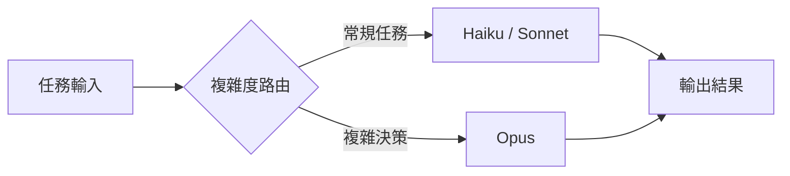
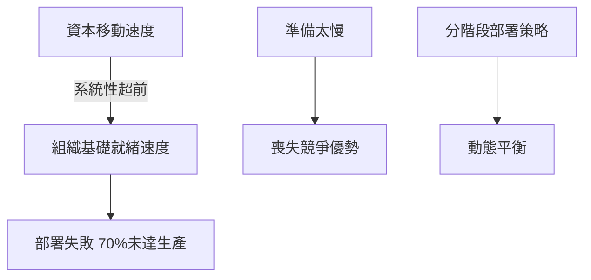

# AI Daily Digest — 2026-04-22

<!-- pipeline-generated:begin -->

## 🔥 今日 TOP 3
### 1. 4百萬教訓：企業AI採購的是整合能力非軟體
某企業花費 400 萬美元導入 AI agent 系統，部署後在生產環境「未能如預期運作」。根本原因是企業內部有多個因歷史併購形成的子組織，各自擁有獨立員工系統與資料孤島，廠商 RFP 演示呈現理想化單一系統場景，完全未涵蓋這層組織複雜性。

這揭示企業 AI 採購的根本錯位：廠商賣的是技術，企業真正需要的是「理解複雜組織結構、跨系統資料整合、現實營運限制」的能力。資料修復週期需 12-24 個月，治理框架需 3-6 個月，這些隱性成本在任何 RFP 中都不會主動揭露。

採購前應做「組織複雜度盡調」：清點獨立子系統數量、資料孤島來源、歷史併購整合缺口。要求廠商展示多系統異質環境的真實案例，若廠商無法回答「如何處理多個獨立 HR 系統資料連通」，風險溢價應顯著調高。

📖 [閱讀完整 insight](../10-insights/2026-04-22/inbox_d070112d.md) · 🔗 [原文連結](https://medium.com/@eranki9.srikanth/what-youre-actually-buying-when-you-buy-enterprise-ai-abc5e0b080eb?source=rss------artificial_intelligence-5)
### 2. 多模型路由：Opus只在複雜決策時出場
文章提出「Advisor Pattern」多模型代理架構：Haiku 或 Sonnet 執行高頻常規任務，僅在複雜推理、邊緣案例或高風險決策時才調用 Opus，將「選哪個模型」的固定問題轉化為「這個任務有多複雜」的動態路由問題。

相較於全程使用 Opus 的設計，Advisor Pattern 可大幅降低 token 成本，同時在關鍵節點維持推理品質。Opus 與 Haiku 的 API 成本比約為 75:1，批量生產場景下路由準確率的邊際提升直接影響系統整體 ROI，使代理商業化可行性門檻大幅降低。

實作切入點是建立「複雜度分類器」，定義升級至 Opus 的觸發條件（多步驟推理、跨工具協調、高責任決策）。建議先審計現有代理的 token 消耗分佈，找出高頻低複雜度調用模式，這些是最容易切換至 Haiku/Sonnet 的候選，可立即見到成本改善。

📖 [閱讀完整 insight](../10-insights/2026-04-22/inbox_44bb3089.md) · 🔗 [原文連結](https://medium.com/illumination/stop-spending-opus-tokens-on-routine-agent-work-f17f7f26a103?source=rss------claude-5)
### 3. AI部署悖論：資本速度快於基礎設施就緒
分析揭示企業 AI 部署的結構性失敗模式：73% 在 2025 年啟動 AI 的組織仍以資料品質為首要障礙，Microsoft 對 OpenAI 的 130 億美元投資僅達 8% 使用率，澳洲某銀行部署房貸 AI 因缺乏詐欺偵測基礎設施而系統性失敗並引發國會調查，70% 企業 AI 專案未達生產狀態。

核心悖論在於「速度無準備造成失敗，無速度的準備喪失競爭優勢」。資料修復需 12-24 個月、治理框架需 3-6 個月，但硬體折舊週期已壓縮至 12 個月，資本流動速度系統性地快於組織基礎設施建設速度，製造了幾乎所有大型企業都難以逃脫的結構性陷阱。

解法是分階段部署：先以 6 週評估期驗證資料品質與整合複雜度，建立三維「AI 準備度矩陣」（資料品質、治理框架、整合基礎），以矩陣評分決定部署節奏而非回應市場壓力，讓組織在保住競爭速度的同時避免沉沒成本。

📖 [閱讀完整 insight](../10-insights/2026-04-22/inbox_d71306d4.md) · 🔗 [原文連結](https://medium.com/@firalim/ai-is-moving-too-fast-and-too-slowly-at-the-same-time-9ecca4148a3a?source=rss------artificial_intelligence-5)

## 📚 分類摘要
### foundation_models
Claude Code v2.1.117（inbox_113aa3f4）修正了 Opus 4.7 context window 誤算：200K 還原至正確的 1M，解決自動壓縮過早與 /context 百分比虛高問題。本機構建以內置 bfs/ugrep 取代 Glob/Grep 工具呼叫，省去往返延遲；agent frontmatter 的 mcpServers 現可透過 --agent 參數在主線程載入；Plugin 缺失依賴改為自動安裝。

OpenAI 方面，GPT-Image-2 圖像生成模型正式發布（inbox_8f77a230），技術規格資訊有限。Cursor 宣布取得 xAI 10 億美元合約並持有 60 億美元收購選項權，顯示 AI coding 工具商業估值持續攀升，輔助開發工具整合浪潮加速。

架構理論層面，Tokenformer 論文（inbox_3d288785，arXiv 2410.23168v2）提出將資料、參數、記憶體統一 token 化並由 attention 處理，理論上可實現程式碼與神經網路相互轉換，仍屬早期研究。神經擬態運算（inbox_7100bc9a）從能效挑戰 LLM 主流：SNNs 模擬大腦 1-2% 神經元稀疏激活，人腦僅需 20W 對比 LLM 訓練數百萬瓦時；Intel Loihi 2 等晶片若商業化，可能打破全球 90% 先進晶片集中五國的地緣政治瓶頸。
### agents
Anthropic 官方教程（inbox_9b0f819d）以日曆管理為實例，提出五層漸進式 agentic 架構，核心哲學是「Chatbot 旨在對話，Agent 旨在行動」。架構從 Single Tool/Single Turn 起步，經 Agentic Loop（觀察→決策→執行）、Multiple Tools/Parallel 平行調用，再到 Error Handling 與 Tool Runner SDK 生產抽象，每層提供可執行程式碼範例，確立生產級代理工程的官方驗收標準。

成本架構面，Advisor Pattern（inbox_44bb3089）為多模型代理提供關鍵設計原則：Haiku/Sonnet 負責常規執行，Opus 僅在複雜決策時出場。在 75:1 的成本比下，路由準確率直接影響系統商業可行性。

工具層面，兩篇 Claude Code 工作流文章（inbox_f880b442、inbox_776102eb）匯集 35 個實戰技巧，核心工作流為：Plan Mode 架構規劃 → /compact 壓縮 context → git checkpoint 保存快照 → diff 審核 → 逐步推進。「建設前規劃 + 增量搭配測試 + 每步驟存檔」組合被多位實戰使用者驗證為降低 long-horizon task 崩塌風險的有效路徑。
### infra
今日 infra 洞察圍繞企業 AI 部署失敗的兩個互補視角。組織整合層面，inbox_d070112d 揭示 400 萬美元部署失敗的根因：歷史併購形成的多個子組織各有獨立員工系統與資料孤島，廠商演示無法反映現實複雜度。企業 AI 的真正成本在於跨系統資料整合而非軟體授權；資料修復需 12-24 個月，治理框架需 3-6 個月，這兩條時間線在 RFP 中從不主動揭露。

宏觀部署模式方面，inbox_d71306d4 揭示結構性悖論：73% 組織仍卡在資料品質、Microsoft 130 億投資僅 8% 使用率、澳洲銀行案例引發國會調查。根本原因是資本移動速度系統性地快於組織基礎設施就緒速度，製造幾乎所有大型企業難以逃脫的陷阱。

## 🎯 專欄
### 🛠 Claude Code / Codex 新功能
- **[v2.1.117](../10-insights/2026-04-22/inbox_113aa3f4.md)**
  Claude Code 發布 v2.1.117，包含多項核心功能改進。支援透過環境變數 CLAUDE_CODE_FORK_SUBAGENT=1 在外部構建中啟用 forked subagents；agent frontmatter 的 mcpServers 現已透過 --agent 參數為主線程代理 session 加載；改進 /model 命令使選擇在重啟
- **[[AINews] OpenAI launches GPT-Image-2](../10-insights/2026-04-22/inbox_8f77a230.md)**
  OpenAI 推出 GPT-Image-2 模型。同時，Cursor 獲得 xAI 價值 10 億美元的合約，並獲得 60 億美元的收購權。
- **[35 Claude Code Commands, Tricks, and Workflows That Actually Matter](../10-insights/2026-04-22/inbox_f880b442.md)**
  文章整理了使用 Claude Code 的 35 個實戰技巧，分為五大類別：必要指令（Plan Mode、/compact、/clear、/init、/cost、/memory 等）、生產力技巧（參考檔案、截圖除錯、測試優先、增量開發、git checkpoint）、架構技巧（依賴評估、安全掃描、效能分析、重構規劃）、工作流自動化（git hooks、CI/
- **[35 Claude Code Commands, Tricks, and Workflows That Actually Matter](../10-insights/2026-04-22/inbox_776102eb.md)**
  這篇文章整理了 35 個 Claude Code 的實用指令、技巧和工作流程。作者基於日常使用 Claude Code 自動化客戶工作流、交付 AI 系統、進行生產除錯的經驗，匯集這份清單。內容涵蓋開發者在 Claude Code 中最實用的操作，包括提升生產力、系統設計和實務除錯。文章強調這些技巧源自實戰經驗，並非理論指南。這份聚合指南對已使用 Claud
### 🏢 企業導入 AI / 團隊實踐
- **[v2.1.117](../10-insights/2026-04-22/inbox_113aa3f4.md)**
  Claude Code 發布 v2.1.117，包含多項核心功能改進。支援透過環境變數 CLAUDE_CODE_FORK_SUBAGENT=1 在外部構建中啟用 forked subagents；agent frontmatter 的 mcpServers 現已透過 --agent 參數為主線程代理 session 加載；改進 /model 命令使選擇在重啟
- **[What You’re Actually Buying When You Buy Enterprise AI](../10-insights/2026-04-22/inbox_d070112d.md)**
  一家客戶花費 400 萬美元得到的教訓揭示企業 AI 採購的隱藏成本：廠商在 RFP 贏得的完美演示與實際部署的複雜性之間存在巨大落差。該客戶的 AI agent 在生產環境「未能如預期運作」，根本原因是企業內部有多個來自歷史併購的子組織，各自擁有獨立的員工系統與資料孤島。文章強調企業 AI 實際採購的不只是技術本身，而是理解與整合複雜組織結構、跨系統資料連
- **[Surviving the AI Wave in Companies](../10-insights/2026-04-22/inbox_e18d9ef2.md)**
  面對 AI 浪潮，組織應指導員工從「執行例行任務」轉向「詮釋、判斷、策略、優先順序、溝通與責任」等獨特人類價值。文章提出「清晰思考變得更寶貴」的關鍵觀點：當內容生成自動化時，定義問題、提出更好的問題、做出策略決策的能力更形重要。核心建議包括發展 AI 素養（理解 AI 的強項與限制）、擁抱持續學習、建立情感智慧與跨團隊協作、以及從「任務執行者」轉變為「問題解
- **[AI Is Moving Too Fast and Too Slowly at the Same Time.](../10-insights/2026-04-22/inbox_d71306d4.md)**
  文章揭露了 AI 部署的根本悖論：資本流動速度快於組織準備速度（「capital 移動快於 infrastructure」）。部署速度過快的證據包括：73% 在 2025 年啟動 AI 專案的組織仍以資料品質為首要障礙；Microsoft 130 億美元 OpenAI 投資僅產生 8% 使用率；澳洲銀行部署房貸 AI 因缺乏詐欺偵測基礎設施而系統性失敗、引發
- **[️ Claude Tutorial — Build a Tool-Using AI Agent: Calendar Management](../10-insights/2026-04-22/inbox_9b0f819d.md)**
  官方教程教導如何以日曆管理為實例建構 Claude tool-using agent，核心哲學是「聊天機器人旨在對話，Agent 旨在行動」。教程採用「五層同心圓」的漸進式結構：(1) 單一工具單次調用、(2) Agent 迴圈迭代（Agent 觀察工具結果後再決策）、(3) 多工具平行調用、(4) 錯誤處理與 robustness、(5) Tool Run
### 🎓 AI 使用技巧 / 心法
- **[v2.1.117](../10-insights/2026-04-22/inbox_113aa3f4.md)**
  Claude Code 發布 v2.1.117，包含多項核心功能改進。支援透過環境變數 CLAUDE_CODE_FORK_SUBAGENT=1 在外部構建中啟用 forked subagents；agent frontmatter 的 mcpServers 現已透過 --agent 參數為主線程代理 session 加載；改進 /model 命令使選擇在重啟
- **[35 Claude Code Commands, Tricks, and Workflows That Actually Matter](../10-insights/2026-04-22/inbox_f880b442.md)**
  文章整理了使用 Claude Code 的 35 個實戰技巧，分為五大類別：必要指令（Plan Mode、/compact、/clear、/init、/cost、/memory 等）、生產力技巧（參考檔案、截圖除錯、測試優先、增量開發、git checkpoint）、架構技巧（依賴評估、安全掃描、效能分析、重構規劃）、工作流自動化（git hooks、CI/
- **[How to Detect and Remove Spyware from your device](../10-insights/2026-04-22/inbox_a9c430b0.md)**
  本文介紹偵測和移除間諜軟體的實用步驟。因內容不可訪問，無法獲得具體細節。
- **[35 Claude Code Commands, Tricks, and Workflows That Actually Matter](../10-insights/2026-04-22/inbox_776102eb.md)**
  這篇文章整理了 35 個 Claude Code 的實用指令、技巧和工作流程。作者基於日常使用 Claude Code 自動化客戶工作流、交付 AI 系統、進行生產除錯的經驗，匯集這份清單。內容涵蓋開發者在 Claude Code 中最實用的操作，包括提升生產力、系統設計和實務除錯。文章強調這些技巧源自實戰經驗，並非理論指南。這份聚合指南對已使用 Claud
- **[“What are the best ChatGPT prompts for entrepreneurs?”](../10-insights/2026-04-22/inbox_1191cc57.md)**
  本文蒐集了 500 個 ChatGPT 提示詞，專為創業者設計，涵蓋內容創作、自由職業、電子郵件行銷、社交媒體、數位行銷等領域。這是一份實用的提示詞模板集合，作者花費時間整理完成。創業者可直接套用到日常業務中，快速生成行銷文案、社交媒體內容或郵件範本。對於尋求降低內容製作時間的新創者有參考價值。不過此文聚焦 ChatGPT 而非 Claude，在本 dige
### 💳 支付 / Fintech
- **[AI Is Moving Too Fast and Too Slowly at the Same Time.](../10-insights/2026-04-22/inbox_d71306d4.md)**
  文章揭露了 AI 部署的根本悖論：資本流動速度快於組織準備速度（「capital 移動快於 infrastructure」）。部署速度過快的證據包括：73% 在 2025 年啟動 AI 專案的組織仍以資料品質為首要障礙；Microsoft 130 億美元 OpenAI 投資僅產生 8% 使用率；澳洲銀行部署房貸 AI 因缺乏詐欺偵測基礎設施而系統性失敗、引發
### ⛓️ 區塊鏈 / Web3
- **[Tokenization to Neuralization](../10-insights/2026-04-22/inbox_3d288785.md)**
  文章討論 Tokenformer 論文的深層意義。Tokenformer 將模型參數也 token 化，支援參數和資料在統一的 attention 機制下互動。作者指出這建立了「token ↔ neural」的雙向轉換通道：若將優化更新規則作為函數 f、參數作為輸入 x，則 f(x) 得到更新後的參數。這意味整個訓練推理流程都可能被「神經化」。核心洞察：未來

## 💡 今日 Takeaway

_讀完今日所有內容後，可帶走的知識點_
### 1. 企業AI採購前應做組織整合複雜度盡調
廠商 RFP 演示的是理想化單一系統場景，而現實企業往往因歷史併購累積多個獨立子系統與資料孤島，這層複雜度不會出現在任何提案文件中。採購決策前應先清點跨系統整合工作量（子系統數、API 介面數、身份系統數），將整合成本顯式化並列入 TCO。若廠商無法展示多系統異質環境的真實案例，應視為高風險指標並調高風險溢價。

_類型：framework_

**參考來源**：
- [What You’re Actually Buying When You Buy Enterprise AI](../10-insights/2026-04-22/inbox_d070112d.md) · [原文](https://medium.com/@eranki9.srikanth/what-youre-actually-buying-when-you-buy-enterprise-ai-abc5e0b080eb?source=rss------artificial_intelligence-5)
### 2. AI部署成敗取決資料就緒度而非投資規模
Microsoft 130 億投資達 8% 使用率、70% 企業 AI 專案未達生產，共同說明資金規模不等於部署成功。資料品質修復需 12-24 個月、治理框架需 3-6 個月，是不可跳過的先決條件，早期準備比晚期補救成本低一個數量級。先建立「AI 準備度矩陣」（資料品質、治理框架、整合基礎），以評分決定部署節奏，比單純回應市場壓力更能保住長期 ROI。

_類型：pattern_

**參考來源**：
- [AI Is Moving Too Fast and Too Slowly at the Same Time.](../10-insights/2026-04-22/inbox_d71306d4.md) · [原文](https://medium.com/@firalim/ai-is-moving-too-fast-and-too-slowly-at-the-same-time-9ecca4148a3a?source=rss------artificial_intelligence-5)
### 3. 多模型路由讓代理在成本與推理品質間動態平衡
Advisor Pattern 將代理模型選擇從「固定使用最高等級」轉為「依任務複雜度動態路由」，在 Opus 與 Haiku 約 75:1 成本比下，路由準確率直接決定系統 ROI。關鍵實作是定義升級至 Opus 的觸發條件（多步推理、邊緣案例、高責任決策），其餘預設 Sonnet 或 Haiku。先審計現有代理 token 消耗分佈找出高頻低複雜度調用，這些是立即可降成本的候選。

_類型：framework_

**參考來源**：
- [Stop Spending Opus Tokens on Routine Agent Work](../10-insights/2026-04-22/inbox_44bb3089.md) · [原文](https://medium.com/illumination/stop-spending-opus-tokens-on-routine-agent-work-f17f7f26a103?source=rss------claude-5)
### 4. 五層漸進架構讓代理從原型到生產逐層可驗
Anthropic 官方建議的五層結構（Single Tool → Agentic Loop → Parallel → Error Handling → SDK 抽象）讓每層可獨立測試，避免複雜代理整體失敗難以診斷的問題。搭配 git checkpoint 與 Plan Mode，每層完成即存快照，在迴圈崩塌或工具調用失效時可快速回滾至上一穩定狀態。這套「分層驗收 + 存檔保護」組合顯著降低 long-horizon agentic task 的整體風險。

_類型：technique_

**參考來源**：
- [️ Claude Tutorial — Build a Tool-Using AI Agent: Calendar Management](../10-insights/2026-04-22/inbox_9b0f819d.md) · [原文](https://medium.com/ai-ml-human-training-coaching/%EF%B8%8F-claude-tutorial-build-a-tool-using-ai-agent-calendar-management-45aae4c11d0b?source=rss------artificial_intelligence-5)
- [35 Claude Code Commands, Tricks, and Workflows That Actually Matter](../10-insights/2026-04-22/inbox_f880b442.md) · [原文](https://medium.com/@okyerevansjohn/35-claude-code-commands-tricks-and-workflows-that-actually-matter-e52c5f377e46?source=rss------artificial_intelligence-5)

<!-- pipeline-generated:end -->

<!-- user-notes -->
<!-- Write your own notes below; pipeline never touches this section. -->