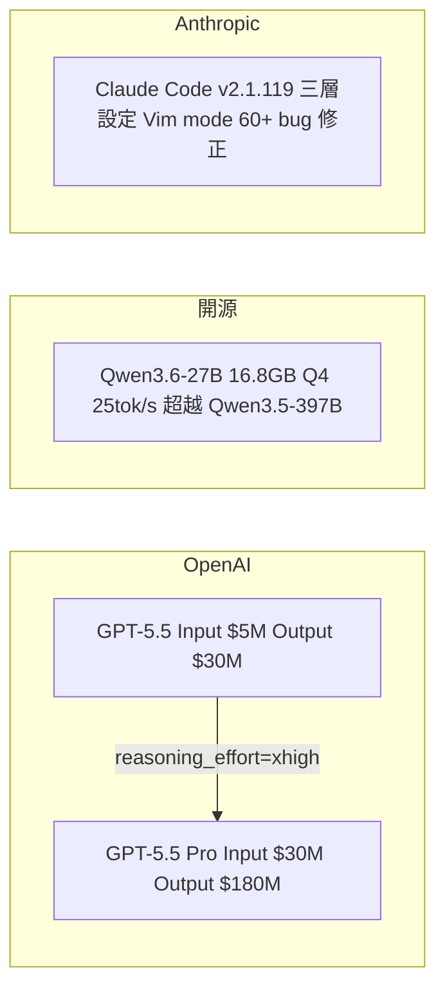
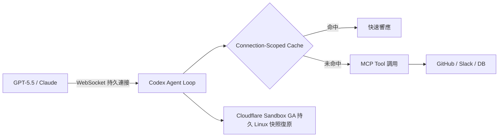

# AI Daily Digest — 2026-04-24

<!-- pipeline-generated:begin -->

## 🔥 今日 TOP 3
### 1. GPT-5.5 定價翻倍與 reasoning_effort 品質旋鈕深度解析
OpenAI 正式發布 GPT-5.5，輸入定價 $5/M tokens、輸出 $30/M，均為 GPT-5.4 的 2 倍；Pro 版本更高達 $30 輸入 / $180 輸出。Simon Willison 透過逆向工程 Codex 開源專案建立外掛，實測 reasoning_effort=xhigh 可將 SVG 生成推理 token 從 39 提升至 9,322，帶來梯度渲染等複雜視覺元素，但延遲從 4 秒跳升至 4 分鐘。

定價翻倍代表相同工作負載的 API 成本直接翻倍，對月費高的企業用戶影響立即顯現；reasoning_effort=xhigh 的 238 倍 token 增幅揭示「品質旋鈕」背後的成本與延遲雙重代價，並非所有任務都值得啟用。Codex 訂閱的整合機制同時讓第三方外掛可繞過 API 獨占存取 GPT-5.5。

實務上應建立任務分層策略：對話查詢維持預設 effort，複雜視覺或多步推理才啟用 xhigh。月度 API 預算必須依 effort 比例分層試算，不能套用單一單價；現有 Codex 訂閱用戶可評估是否透過外掛整合路徑降低直接 API 費用。

📖 [閱讀完整 insight](../10-insights/2026-04-23/inbox_4a257cc8.md) · 🔗 [原文連結](https://simonwillison.net/2026/Apr/23/gpt-5-5/#atom-everything)
### 2. Google TPU-8 雙芯片組針對代理時代工作負載重新設計
Google 發布第 8 代 TPU 芯片組，推出 TPU-8T（訓練型）與 TPU-8I（推理型）兩款，官方定位明確為「代理時代」（agentic era）的 AI 工作負載優化，並附詳細技術白皮書說明各型號性能特性與應用場景。

TPU-8 系列代表主流硬體廠商開始在基礎設施層針對 agent 特性（長時執行、高頻工具調用、有狀態任務管理）進行重新設計，不再只優化批次推理吞吐量——這與前代 TPU 的定位有本質差異，將直接影響企業 AI 推理成本評估與部署選型。

企業規劃 2026 年 agent 基礎設施時，T/I 型號差異應納入選型矩陣；Google Cloud 採用 TPU-8 後的推理服務定價變動值得追蹤，以重新試算 agent loop 的每次工具調用單位成本，並與 AWS Trainium/Inferentia 路線圖做對比。

📖 [閱讀完整 insight](../10-insights/2026-04-22/inbox_3ced077b.md) · 🔗 [原文連結](https://blog.google/innovation-and-ai/infrastructure-and-cloud/google-cloud/eighth-generation-tpu-agentic-era/)
### 3. Codex Agent 循環以 WebSocket 加連接層快取顯著降低延遲
OpenAI 深度分析 Codex agent 循環的性能優化方案：透過 WebSocket 持久連接替換逐次 HTTP 請求，配合 connection-scoped caching（連接範圍快取），顯著降低 API 交握開銷並改善模型延遲，已在生產 Codex 工作流中驗證。

高頻 agent loop 中，每次 TLS handshake 與 TCP 連線建立成本在每輪工具調用中反覆累積；WebSocket 將開銷攤平至首次連線，connection-scoped caching 進一步減少重複上下文傳輸。這一模式的核心價值在可複用性：任何需要快速多輪往返的 agentic 工作負載均可借鑒，與底層模型供應商無關。

開發者構建高頻代理時，應優先評估 WebSocket 而非 REST polling；connection-scoped cache 需設計明確的失效策略（工具狀態變更、session 重置觸發點），避免快取與實際工作流脫節造成幽靈結果。

📖 [閱讀完整 insight](../10-insights/2026-04-22/inbox_80ff946e.md) · 🔗 [原文連結](https://openai.com/index/speeding-up-agentic-workflows-with-websockets)

## 📚 分類摘要
### foundation_models
OpenAI 本日佔據絕對主角：GPT-5.5 正式發布，定價為 GPT-5.4 的 2 倍（輸入 $5/M、輸出 $30/M），Pro 版本達 $30/$180；官方定位從「回答」（Answers）轉向「執行」（Execution），強調 agentic 能力而非單純文本生成。同期配套發布 GPT-5.5 生物安全 Bug Bounty 計畫（上限 $25,000 尋找通用越獄模式）、面向已驗證美國醫師/護理師/藥劑師的免費 ChatGPT for Clinicians，以及 ChatGPT Images 2.0（SOTA 圖像模型，文字渲染準確性與多語言支持大幅提升）。

開源陣營方面，Qwen3.6-27B 密集模型以 1/15 的參數量在編碼基準超越前代旗艦 Qwen3.5-397B（MoE 總規模 397B），GGUF Q4_K_M 量化版僅 16.8GB，在消費級硬體達 ~25 tokens/s 且 SVG 生成品質媲美商用模型，本機零推理成本優勢明顯。Anthropic 側連續釋出 Claude Code v2.1.118 和 v2.1.119，帶來三層設定覆蓋系統（project/local/policy）、hooks duration_ms 追蹤、Vim visual mode（v/V）、自訂主題系統 (~/.claude/themes/)、MCP OAuth 完整修復（涵蓋 token 過期、macOS keychain race condition、refresh 無 cross-process lock 等），累計超過 60 項 bug 修正。Anthropic 同步公開 Claude Code 品質下降事後分析，確認根因為框架 bug：3 月 26 日 idle session 思考清除邏輯因程式碼缺陷每轉執行而非每小時一次，導致 session 連貫性破壞，與模型本身能力完全無關。
### agents
OpenAI 在 agent 層正式推出 ChatGPT 工作區代理（workspace agents），由 Codex 引擎驅動，支援雲端執行的複雜多步工作流與跨工具安全協作，面向企業大規模自動化部署。OpenAI Academy 同期密集發布 Codex 系列教學（工作區設置、threads/projects 管理、plugins & skills 工具連接、排程觸發自動化、十大職場應用案例），展示 Codex 從技術工具向企業工作流平台定位轉移的戰略意圖。OpenAI 同步深度分析 Codex agent 循環的 WebSocket 持久連接 + connection-scoped caching 優化，提供可複用的高頻 agent 延遲降低模式。

Cloudflare Sandboxes & Containers 正式 GA，為 AI 代理提供持久隔離的 Linux 執行環境，核心功能包括出口代理憑證注入、PTY 終端、代碼解釋器、檔案監視與快照式工作階段復原，按實際 CPU 使用量計費，適配間歇性 agent 工作負載的成本結構。Codex 0.123.0 和 0.124.0 連續發布，帶來 Amazon Bedrock 一級支援（含 AWS SigV4 簽名）、hooks 穩定化支援 MCP tool 監控、/mcp verbose 完整診斷命令（保留 /mcp 快速路徑），以及 Plugin MCP 同時相容 mcpServers 和 top-level server map 兩種 .mcp.json 格式。架構設計層面，分析文章強調長期 AGI 系統需要「持續工程（continuity engineering）」——涵蓋故障復原、狀態一致性、工具可靠性——而非僅靠一次性服務認證，為設計 long-running agent 的架構師提供明確的工程要求框架。
### infra
Google 發布第 8 代 TPU 芯片組（TPU-8T 訓練型、TPU-8I 推理型），官方定位針對「代理時代」AI 工作負載優化，標誌著主流硬體廠商開始為 agent 特性在基礎設施層進行重新設計。Grafana 13 在 GrafanaCON 巴塞隆納發布，Loki 引入 Kafka-backed ingestion 架構提升日誌處理能力，新增 AI Observability 功能支援 AI 系統實時監控與評估，並推出 GCX CLI 工具專為 agentic development 設計，讓開發者可在代碼編輯器中直接存取 Grafana Cloud 數據。

精簡架構案例本日特別豐富：Bluesky For You Feed（服務 7.2 萬日活）以單一 Go 進程 + 419GB SQLite 搭配家用遊戲 PC，月成本 $30（電力 + OVH VPS + 域名），Tailscale overlay 解決家用 IP 暴露問題，1ms WAL 輪詢取代複雜訊息佇列，協同過濾在 90 天窗口運行流暢，開發者估計可擴展至百萬日活。開源工具 honker（Rust 實作 SQLite 擴展）為 SQLite 帶來 Postgres NOTIFY/LISTEN 語義，核心為 transactional outbox pattern（確保事件僅在事務提交時入隊），提供 enqueue/claim/ack 佇列操作與 publish/subscribe Kafka 風格流，提供 20+ 自訂 SQL 函數，適合不想引入 Kafka 的單體架構。

Coinbase 工程師公開交易所架構設計：單線程 + Raft 共識算法實現 24/7 可用性與亞毫秒延遲，決定論設計支援零停機滾動部署並讓生產 bug 完全可重現，展示以架構簡化性換取可靠性與可觀測性的設計哲學。Dropbox 與 GitHub 合作優化 Git delta 壓縮演算法，將 87GB 後端 monorepo 壓縮至 20GB（減少 77%），直接改善 clone 時間與 CI 管道性能，驗證版本控制工具優化在大規模工程中是被低估的效率槓桿。

## 🎯 專欄
### 🛠 Claude Code / Codex 新功能
- **[v2.1.119](../10-insights/2026-04-23/inbox_bf677b5e.md)**
  Claude Code v2.1.119 發布，核心改進包括設定系統重構以支援 project/local/policy 三層覆蓋優先級，使用者可透過 `/config` 持久化主題、編輯器模式等設定到 `~/.claude/settings.json`；新增 `prUrlTemplate` 支援自訂 code review URL、`CLAUDE_CODE
- **[v2.1.118](../10-insights/2026-04-23/inbox_f5c76558.md)**
  Claude Code v2.1.118 發布，主要更新包括 Vim visual mode（v 視覺模式、V 視覺行模式）、合併 `/cost` 和 `/stats` 為統一的 `/usage` 指令；新增自訂主題系統可在 `~/.claude/themes/` 建立、編輯或透過 plugins 散佈；hooks 系統擴展支援 MCP tool 直接呼叫 
- **[Automations](../10-insights/2026-04-23/inbox_f6c7b8c0.md)**
  OpenAI 發布 Codex 自動化教學指南，介紹如何透過排程與觸發器自動化任務，用於生成報告、內容摘要與定期工作流程，幫助使用者減少手動操作。
- **[Top 10 uses for Codex at work](../10-insights/2026-04-23/inbox_cb5cb26c.md)**
  OpenAI 發布 Codex 十大職場應用指南，涵蓋任務自動化、交付物生成、工具與檔案整合等實務案例，展示 Codex 在工作流程中的多元應用場景。
- **[Plugins and skills](../10-insights/2026-04-23/inbox_aa3eea9f.md)**
  OpenAI Academy 發布 Codex plugins 和 skills 教學文章。介紹如何使用 plugins 和 skills 連接工具、存取資料、建立重複工作流程，以自動化任務和改進結果。該教學資源針對需要擴展 Codex 功能的用戶。
### 📚 AI 知識管理
- **[How to Build a RAG System in Databricks (Step-by-Step Guide)](../10-insights/2026-04-24/inbox_e0b75309.md)**
  本文介紹如何在 Databricks 平台構建檢索增強生成（RAG）系統的完整步驟。RAG 讓 AI 系統能夠參考用戶自有文檔回答問題，而非僅依賴模型預訓練知識。文章涵蓋向量化、文檔存儲、語義檢索和提示工程的端到端工作流。Databricks 將這些步驟整合在統一平台上，降低了 RAG 系統的實現複雜度。
### 🏢 企業導入 AI / 團隊實踐
- **[v2.1.119](../10-insights/2026-04-23/inbox_bf677b5e.md)**
  Claude Code v2.1.119 發布，核心改進包括設定系統重構以支援 project/local/policy 三層覆蓋優先級，使用者可透過 `/config` 持久化主題、編輯器模式等設定到 `~/.claude/settings.json`；新增 `prUrlTemplate` 支援自訂 code review URL、`CLAUDE_CODE
- **[v2.1.118](../10-insights/2026-04-23/inbox_f5c76558.md)**
  Claude Code v2.1.118 發布，主要更新包括 Vim visual mode（v 視覺模式、V 視覺行模式）、合併 `/cost` 和 `/stats` 為統一的 `/usage` 指令；新增自訂主題系統可在 `~/.claude/themes/` 建立、編輯或透過 plugins 散佈；hooks 系統擴展支援 MCP tool 直接呼叫 
- **[Plugins and skills](../10-insights/2026-04-23/inbox_aa3eea9f.md)**
  OpenAI Academy 發布 Codex plugins 和 skills 教學文章。介紹如何使用 plugins 和 skills 連接工具、存取資料、建立重複工作流程，以自動化任務和改進結果。該教學資源針對需要擴展 Codex 功能的用戶。
- **[Working with Codex](../10-insights/2026-04-23/inbox_7dec4bdd.md)**
  OpenAI Academy 發布 Codex 工作區使用教學。涵蓋設置工作區、創建 threads 和 projects、管理檔案、完成任務的步驟指導。該教學針對 Codex 新用戶提供基礎上手流程。
- **[Codex settings](../10-insights/2026-04-23/inbox_93c00116.md)**
  OpenAI Academy 發布 Codex 設定教學文章。涵蓋個人化設定、詳細程度調整、權限管理等功能，協助用戶平順執行任務並自訂工作流程。該教學針對需要自訂 Codex 行為的用戶。
### 🎓 AI 使用技巧 / 心法
- **[How to get started with Codex](../10-insights/2026-04-23/inbox_6a4effff.md)**
  OpenAI Academy 發布 Codex 快速上手教學。指導如何設置 projects、創建 threads、完成首個任務。該教學針對 Codex 初學者提供結構化的入門流程。
- **[Speeding up agentic workflows with WebSockets in the Responses API](../10-insights/2026-04-22/inbox_80ff946e.md)**
  OpenAI 深度分析 Codex agent 循環如何利用 WebSocket 和連接範圍快取（connection-scoped caching）技術，顯著降低 API 開銷並改善模型延遲。此方案針對代理式工作流的性能優化，通過持久連接和智慧快取策略實現實時性能提升。這一優化模式對構建高頻代理應用具有參考價值，可複用於其他長連接場景。
- **[russellromney/honker](../10-insights/2026-04-24/inbox_a176aaca.md)**
  honker 是一個 Rust 實現的 SQLite 擴展（含多語言綁定），提供 Postgres NOTIFY/LISTEN 語義以支援隊列和事件流。核心設計是 transactional outbox pattern：事件僅在事務成功提交時才被入隊，解決分散系統中業務邏輯與副作用同步的難題。提供 20+ 自訂 SQL 函數，Python API 支援 `
- **[Extract PDF text in your browser with LiteParse for the web](../10-insights/2026-04-23/inbox_cf352e9b.md)**
  Simon Willison 將 LlamaIndex 的 LiteParse 工具（PDF 文字提取）改寫為瀏覽器版本，完全在客戶端運行無需上傳檔案。LiteParse 核心能力是「空間文字解析」：使用啟發式方法自動偵測多欄排版、表格、標題位置等，按邏輯順序而非座標順序輸出文字。工作流程展示 Claude Code + Opus 4.7 的最佳實踐：先撰寫
- **[Google Introduces Room 3.0: A Kotlin-First, Async, Multiplatform Persistence Library](../10-insights/2026-04-23/inbox_a934b9ee.md)**
  不符收集範圍 - Google Room 3.0 是 Android 資料庫持久化庫更新，非 AI 相關主題。內容著重 Kotlin Multiplatform 現代化、非同步支援、WebAssembly 擴展等軟體工程層面改進，不涉及 AI/ML 領域。
### 💳 支付 / Fintech
- **[Introducing OpenAI Privacy Filter](../10-insights/2026-04-22/inbox_caab4bc7.md)**
  OpenAI 開源一款 PII（個人可識別信息）檢測和編輯模型，具有 SOTA 精確度，可自動識別和隱蔽文本中的隱私敏感信息。該模型採用開源權重形式發佈，可用於本地部署或集成至隱私合規系統。這個工具對需要處理敏感數據的企業和研究機構具有實用價值，特別是在數據脫敏和合規驗證場景。
### ⛓️ 區塊鏈 / Web3
- **[Automations](../10-insights/2026-04-23/inbox_f6c7b8c0.md)**
  OpenAI 發布 Codex 自動化教學指南，介紹如何透過排程與觸發器自動化任務，用於生成報告、內容摘要與定期工作流程，幫助使用者減少手動操作。
- **[Top 10 uses for Codex at work](../10-insights/2026-04-23/inbox_cb5cb26c.md)**
  OpenAI 發布 Codex 十大職場應用指南，涵蓋任務自動化、交付物生成、工具與檔案整合等實務案例，展示 Codex 在工作流程中的多元應用場景。
- **[Plugins and skills](../10-insights/2026-04-23/inbox_aa3eea9f.md)**
  OpenAI Academy 發布 Codex plugins 和 skills 教學文章。介紹如何使用 plugins 和 skills 連接工具、存取資料、建立重複工作流程，以自動化任務和改進結果。該教學資源針對需要擴展 Codex 功能的用戶。
- **[Working with Codex](../10-insights/2026-04-23/inbox_7dec4bdd.md)**
  OpenAI Academy 發布 Codex 工作區使用教學。涵蓋設置工作區、創建 threads 和 projects、管理檔案、完成任務的步驟指導。該教學針對 Codex 新用戶提供基礎上手流程。
- **[Codex settings](../10-insights/2026-04-23/inbox_93c00116.md)**
  OpenAI Academy 發布 Codex 設定教學文章。涵蓋個人化設定、詳細程度調整、權限管理等功能，協助用戶平順執行任務並自訂工作流程。該教學針對需要自訂 Codex 行為的用戶。
### 🔐 AI 安全 / 濫用
- **[I Simulated an International Supply Chain and Let OpenClaw Monitor It](../10-insights/2026-04-23/inbox_0e7d8df5.md)**
  作者為供應鏈經理 Mario 模擬國際供應鏈運作，並接入 AI agent 進行監控與分析。問題陳述：儘管每個團隊都達成各自目標，整體仍有 18% 的貨運遲到。AI agent 參與調查後得以發現隱藏的系統性瓶頸。此案例揭示一個常見模式：局部優化（團隊績效）與全局目標（整體交付）之間的悖論，以及 AI agent 在跨部門因果分析中的潛力。
- **[El sistema no fue comprometido. Fue convencido.](../10-insights/2026-04-24/inbox_5a2f4cea.md)**
  根據西班牙文標題和片段推斷：Claude Mythos Preview 被發現容易受到名為『FCHA』的攻擊模式影響，該攻擊的關鍵在於『說服』而非『破壞』系統。文章指出這一漏洞早在三個月前就已在研究中被識別，本次分析是對該模式在實際 Claude 版本上的驗證。這提示 Claude 模型存在 prompt injection / jailbreak 類的安全

## 💡 今日 Takeaway

_讀完今日所有內容後，可帶走的知識點_
### 1. 優化Prompt應先重新定義評估目標而非反覆調整措辭
當 LLM 輸出品質停滯，多數人反覆微調句子表達，但真正瓶頸往往在評估標準的定義本身是否正確。應先建立明確的成功指標（清晰的 eval 集、具體的失敗案例分類），以此為目標進行系統化優化，而非繼續在錯誤的維度消耗資源。這一思維轉移讓每次迭代有明確方向，也讓不同版本 prompt 的效果具有可比性。

_類型：framework_

**參考來源**：
- [It’s Not About Writing a Better Sentence. It’s About Defining a Better Optimization Problem.](../10-insights/2026-04-23/inbox_e57f2ee2.md) · [原文](https://jinlow.medium.com/its-not-about-writing-a-better-sentence-it-s-about-defining-a-better-optimization-problem-71177d41689d?source=rss------large_language_models-5)
### 2. 代理循環改用WebSocket持久連接可顯著降低往返延遲
高頻 agent loop 中，每次 HTTP 請求的 TLS handshake 與 TCP 連線建立成本在每輪工具調用中反覆累積。WebSocket 將這些開銷攤平至首次連線，配合 connection-scoped caching 減少重複上下文傳輸，兩者組合是相同 QPS 下降低模型延遲的有效模式。此方案對任何需要快速多輪往返的 agentic 工作負載均可借鑒，與底層模型供應商無關。

_類型：pattern_

**參考來源**：
- [Speeding up agentic workflows with WebSockets in the Responses API](../10-insights/2026-04-22/inbox_80ff946e.md) · [原文](https://openai.com/index/speeding-up-agentic-workflows-with-websockets)
### 3. AI系統品質下降應優先排查框架層而非歸因模型退步
Claude Code 品質下降的根因是框架邏輯（idle session 思考清除每轉執行而非每小時），模型本身無異常。當 AI 應用品質異常，應先排查 prompt 組裝、context 管理、session 狀態等框架層邏輯，再考慮模型本身——框架 bug 的影響可完全遮蔽模型真實能力。分層診斷（框架 → 配置 → 模型）能大幅縮短定位時間，也避免錯誤的模型切換或升級決策。

_類型：data-point_

**參考來源**：
- [An update on recent Claude Code quality reports](../10-insights/2026-04-24/inbox_3050ceb8.md) · [原文](https://simonwillison.net/2026/Apr/24/recent-claude-code-quality-reports/#atom-everything)
### 4. 模型推理力度可調時需依任務類型分層配置成本與延遲
GPT-5.5 的 reasoning_effort=xhigh 將推理 token 從 39 擴展至 9,322（238 倍），SVG 生成品質顯著提升，但延遲從 4 秒增至 4 分鐘。高推理力度最適合離線批次或使用者可接受長等待的複雜任務；對話式查詢應維持預設 effort。凡是具備推理深度旋鈕的模型，API 預算規劃都必須依 effort 分層估算，不能以單一定價模式試算月費，否則將嚴重低估實際成本。

_類型：data-point_

**參考來源**：
- [A pelican for GPT-5.5 via the semi-official Codex backdoor API](../10-insights/2026-04-23/inbox_4a257cc8.md) · [原文](https://simonwillison.net/2026/Apr/23/gpt-5-5/#atom-everything)
### 5. 規模確定前精簡單體架構優於提前引入分散式複雜度
Bluesky For You Feed 以 SQLite + 單機進程服務 7.2 萬日活，月成本僅 $30，1ms WAL 輪詢取代 Kafka，Tailscale 解決公網暴露問題。這驗證了一個設計原則：在用戶規模明確前，精簡可靠的單體架構往往優於提前引入分散式設計。過度工程不僅是一次性開發成本，更是長期的運維負擔、除錯複雜度與認知稅。

_類型：pattern_

**參考來源**：
- [Serving the For You feed](../10-insights/2026-04-24/inbox_c2c27bc7.md) · [原文](https://simonwillison.net/2026/Apr/24/serving-the-for-you-feed/#atom-everything)

<!-- pipeline-generated:end -->

<!-- user-notes -->
<!-- Write your own notes below; pipeline never touches this section. -->