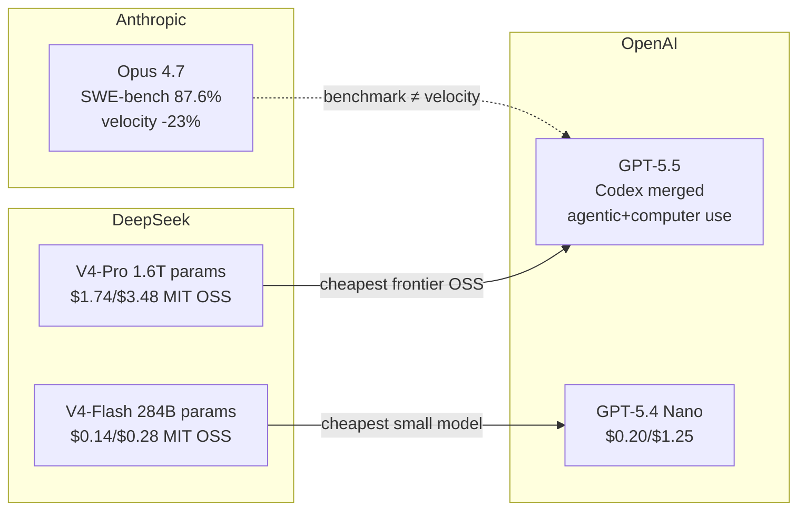

# AI Daily Digest — 2026-04-25

<!-- pipeline-generated:begin -->

## 🔥 今日 TOP 3
### 1. DeepSeek V4 Flash 定價 $0.14/M，開源最大模型登場
DeepSeek 今日發布 V4 系列預覽版：V4-Pro（1.6T 總參數、49B 活躍）與 V4-Flash（284B 總參數、13B 活躍），均為 MoE 架構搭配 1M token 上下文，MIT 開源授權。V4-Flash 定價 $0.14/$0.28 每百萬 tokens，低於 GPT-5.4 Nano 的 $0.20/$1.25；V4-Pro 以 $1.74/$3.48 成最便宜前沿級開源模型，在 1M token 場景下較 V3.2 僅需 27% FLOPs、10% KV cache。

V4-Pro 超越 Kimi K2.6（1.1T 參數）成現存最大開源權重模型；MoE 效率突破直接壓低長上下文場景成本，對百萬 token 級 RAG、法律文件分析、代碼審查業務影響顯著。兩個模型均原生支援華為 Ascend 芯片，中國 AI 晶片自主生態整合加速。

V4-Flash 是 GPT-5.4 Nano 在長上下文的直接替代候選，工程師可立即評估現有 mini 模型替換可行性。V4-Pro 自報比前沿落後 3-6 個月，成本敏感業務須在效能差距與費用節省間做明確取捨。

📖 [閱讀完整 insight](../10-insights/2026-04-24/inbox_82097328.md) · 🔗 [原文連結](https://simonwillison.net/2026/Apr/24/deepseek-v4/#atom-everything)
### 2. Prompt Caching 六大失效模式讓 84% 成本節省歸零
Prompt caching 可將 Claude Code API 成本削減至少 84%，但動態欄位（時間戳、用戶 ID 嵌入 system prompt）、重複 message 未命中、請求頻率超過 TTL、版本頻繁變更、cache 作用域誤解等六類失效模式會讓 cache hit rate 接近零，且不會有任何明顯錯誤提示。

這不只是 Claude Code 問題：任何高頻呼叫 Anthropic API 的 agent pipeline、RAG 系統或監控任務都適用。84% 成本差距等同於同等預算可執行 6 倍以上請求，對長時間運行的 agentic workload 影響尤深。

實務做法：立即審查 system prompt 是否包含請求級動態資訊；將靜態知識庫與工具描述移至 system prompt 前段；在 API response 監控 cache_read_input_tokens 欄位確認 cache 真正命中。

📖 [閱讀完整 insight](../10-insights/2026-04-25/inbox_8774a0ad.md) · 🔗 [原文連結](https://medium.com/@ruralwritter/prompt-cache-the-10x-cheaper-lever-and-6-ways-to-accidentally-kill-it-668694933171?source=rss------claude-5)
### 3. SWE-bench 87.6% 的 Claude Opus 4.7 讓 Sprint 速度降 23%
工程師連續三週使用 Claude Opus 4.7（SWE-bench 87.6%，優於 GPT-5.3-Codex 85%、Gemini 3.1 Pro 80.6%），sprint velocity 反降 23%：每週 6 tickets 對比往常 8 個。關鍵原因是 AI 生成的 200 行代碼需 47 分鐘審查，而自己撰寫同量代碼只需 25 分鐘。「mostly right 的代碼在生產環境不算成功」——可讀性與審查成本被現有基準完全忽視。

SWE-bench、HumanEval 等基準只衡量「生成能通過測試的代碼」，不含命名一致性、架構風格與審查負擔。AI coding 工具的速度瓶頸往往不在生成端，而在驗證端。

實務建議：選型時追蹤「AI 生成到 PR 合併」完整週期時間，而非只看基準分數。可設計 2 週實驗記錄每個 AI 生成 PR 的審查分鐘數，與純手寫 PR 比較，得出真實 velocity delta。

📖 [閱讀完整 insight](../10-insights/2026-04-25/inbox_17bcec00.md) · 🔗 [原文連結](https://medium.com/@pixipace/i-switched-to-claude-opus-4-7-for-everything-my-sprint-velocity-dropped-23-f8648d7f0c72?source=rss------artificial_intelligence-5)

## 📚 分類摘要
### foundation_models
本日最大事件是 DeepSeek V4 Pro/Flash 預覽版（inbox_82097328）與 OpenAI GPT-5.5 正式推出（inbox_88ff8a5c、inbox_861f9654）同日登場。DeepSeek V4-Flash 以 $0.14/$0.28 定價成業界最便宜小模型，低於 GPT-5.4 Nano（$0.20/$1.25）逾 30%；V4-Pro 以 1.6T 參數超越 Kimi K2.6（1.1T）和 GLM-5.1（754B）成最大開源權重模型，並原生支援華為 Ascend 芯片。OpenAI 方面，自 GPT-5.4 起 Codex 已併入主模型不再維持獨立分支，GPT-5.5 進一步強化 agentic coding 與 computer use 能力。

OpenAI 同步發布 GPT-5.5 提示工程遷移指南（inbox_d7bd6da6），核心建議是將 GPT-5.5 視為全新模型族而非直接替代品，應從最小提示重新調整 reasoning effort、verbosity 及工具描述，官方提供 `$openai-docs migrate` 指令輔助遷移。llm CLI v0.31（inbox_2c3d3d9e）同步支援 GPT-5.5，新增 `-o verbosity low|medium|high` 和 `-o image_detail` 四檔選項。GPT-5.5 vs Claude Opus 4.7 的詳細對比（inbox_f8b019f7）涵蓋定價、推理、編碼、多模態四維，可作選型決策參考。

Claude 側，Prompt caching 84% 成本節省（inbox_8774a0ad）與 SWE-bench 高分不等於開發效率（inbox_17bcec00）是兩則高實務價值洞察。OpenMythos（inbox_dc977632）展示 770M 參數模型透過推論時計算重分配可媲美 1.3B 性能，挑戰「更大 = 更好」。⚠️ 今日尚有 74 則 pending items 未納入本摘要，可能有重要內容遺漏。

### agents
OpenAI Codex 0.125.0（inbox_1c543fbb）強化 app-server 基礎設施：新增 Unix socket transport、pagination-friendly resume/fork、sticky environments，permission profiles 實現跨 TUI sessions、MCP sandbox 與 shell escalation 的持久化授權管理，插件管理支援遠程安裝與市場升級。穩定性修復涵蓋 WebSocket 斷裂、exec-server 緩衝溢出；`codex exec --json` 新增 reasoning-token 用量報告。這些改進主要面向 app-server 插件開發者。

LogSentinel v2（inbox_fe8bcb87）引入多代理推理框架於 SOC 工作流，將事件回應從「單一模型單次分類」升級為多專家角色協作——檢測、分類、優先級、響應決策各由獨立 agent 負責，透過 Verifiable Rewards 確保決策可溯源。這與 Codex permission profiles 的持久化授權趨勢方向一致：生產級 agent 系統愈來愈需要可審計、有邊界的操作授權框架，而非單一黑盒模型。

## 🎯 專欄
### 🛠 Claude Code / Codex 新功能
- **[0.125.0](../10-insights/2026-04-24/inbox_1c543fbb.md)**
  OpenAI Codex 0.125.0 版本正式發布，重點強化 app-server 基礎設施與插件管理能力。新增 Unix socket transport、分頁友善的 resume/fork、sticky environments 等傳輸與會話特性；app-server 插件管理現已支援遠程安裝與市場升級；permission profiles 實現跨
- **[Quoting Romain Huet](../10-insights/2026-04-25/inbox_88ff8a5c.md)**
  OpenAI 官方確認 GPT-5.4 起已將 Codex 與主模型統一，不再維持獨立編碼分支；GPT-5.5 進一步強化 agentic coding、computer use 及各類電腦任務能力。開發者應注意 OpenAI 不會推出專門的 GPT-5.5-Codex 模型，編碼需求統一依賴主模型。
- **[GPT-5.5 prompting guide](../10-insights/2026-04-25/inbox_d7bd6da6.md)**
  OpenAI 發布 GPT-5.5 官方提示工程指南，揭露三大核心建議：(1) 多步驟任務應在工具調用前發送短的用戶可見更新，避免長時間沉默，Codex 應用已採用此技巧；(2) GPT-5.5 應視為新模型族而非直接替代品，需從最小提示重新優化 reasoning effort、verbosity、tool descriptions 與輸出格式；(3) O
- **[llm-openai-via-codex 0.1a0](../10-insights/2026-04-23/inbox_0d338145.md)**
  Simon Willison 發布 llm-openai-via-codex 外掛工具 0.1a0 版本，允許 LLM CLI 使用者利用既有的 Codex CLI 認證憑證直接呼叫 OpenAI API，簡化多工具間的認證管理流程。實現跨工具憑證復用，降低使用者設定複雜度。
- **[[AINews] GPT 5.5 and OpenAI Codex Superapp](../10-insights/2026-04-24/inbox_861f9654.md)**
  Latent Space AINews 標題宣告 OpenAI 發布 GPT-5.5 及 OpenAI Codex Superapp，但文章本體資訊嚴重不足，僅為一句隱喻『Spud lives!』，完全無法抽取產品特性、功能詳情、定價、發佈日期或技術規格等關鍵資訊。
### 🏢 企業導入 AI / 團隊實踐
- **[0.125.0](../10-insights/2026-04-24/inbox_1c543fbb.md)**
  OpenAI Codex 0.125.0 版本正式發布，重點強化 app-server 基礎設施與插件管理能力。新增 Unix socket transport、分頁友善的 resume/fork、sticky environments 等傳輸與會話特性；app-server 插件管理現已支援遠程安裝與市場升級；permission profiles 實現跨
- **[llm-openai-via-codex 0.1a0](../10-insights/2026-04-23/inbox_0d338145.md)**
  Simon Willison 發布 llm-openai-via-codex 外掛工具 0.1a0 版本，允許 LLM CLI 使用者利用既有的 Codex CLI 認證憑證直接呼叫 OpenAI API，簡化多工具間的認證管理流程。實現跨工具憑證復用，降低使用者設定複雜度。
- **[India’s New AI Governance Body Is Either Its Smartest Policy Move or a Committee in Disguise](../10-insights/2026-04-25/inbox_47547b97.md)**
  2026 年 4 月 13 日，印度通過單頁政府備忘錄成立 AI Governance and Economic Group (AIGEG)，由 Ashwini Vaishnaw 任主席、Jitin Prasada 任副主席。然而該機構存在重大結構缺陷：央行 (RBI)、證交會 (SEBI)、資料保護委員會、國防部、教育部均缺席代表，業界與學界也無常設席位。
- **[Law as a Chain of Events: Why Legal Analysis Needs an Event-Based Ontology](../10-insights/2026-04-25/inbox_4111465a.md)**
  提出法律應理解為「事件鏈」而非靜態文本的新本體論框架。核心主張：法律意義透過解釋事件（法院判決、行政實踐、律師推理）動態生成，單一條文的意義隨時間演變。為法律 AI 應用提議建立「事件–規範圖譜」(event-normative graphs)，使系統能追蹤規範意義如何在不同脈絡下轉變、區分「穩定慣例」與「偶發決策」。此方案將法律檢索系統從文件導向轉變為能理
- **[95% of Companies Are Breaking an AI Law Most People Don&#39;t Know Exists](../10-insights/2026-04-25/inbox_726c1586.md)**
  調查指出 95% 的公司違反一項鮮為人知的 AI 法規，作者通過紐約市審計經驗揭示「包裹型 AI」（Wrapper AI，即簡單封裝現成 API 的商業模式）無法在監管環境下存活。這表明目前許多輕量級 AI 應用的商業模式在法規趨嚴的未來面臨系統性風險，須從架構設計階段考慮合規性。
### 🎓 AI 使用技巧 / 心法
- **[GPT-5.5 prompting guide](../10-insights/2026-04-25/inbox_d7bd6da6.md)**
  OpenAI 發布 GPT-5.5 官方提示工程指南，揭露三大核心建議：(1) 多步驟任務應在工具調用前發送短的用戶可見更新，避免長時間沉默，Codex 應用已採用此技巧；(2) GPT-5.5 應視為新模型族而非直接替代品，需從最小提示重新優化 reasoning effort、verbosity、tool descriptions 與輸出格式；(3) O
- **[Millisecond Converter](../10-insights/2026-04-24/inbox_011356e3.md)**
  Simon Willison 開發的毫秒轉換工具（Millisecond Converter），用於快速將 LLM CLI 報告的 prompt 執行時間從毫秒單位轉換至秒或分鐘，解決開發人員日常手算時間單位的認知負荷。
- **[It&#39;s a big one](../10-insights/2026-04-24/inbox_5835d2e3.md)**
  Simon Willison 本週 Substack 電郵通訊（inbox edition）內容預告：包含 4 個生成式 AI 視覺示例（以「騎自行車的鵜鶘」為創意測試素材）、1 個電動滑板車場景、5 篇深度技術文章、8 條精選推薦連結、3 則行業引言，以及《Agentic Engineering Patterns》指南的新章節內容。
- **[I research LLM adversarial attacks. Claude Mythos just made the core problem feel urgent.](../10-insights/2026-04-25/inbox_effcb81b.md)**
  一位 LLM 對抗攻擊研究員指出，Claude Mythos 的出現暴露了當前 AI 評估體系的根本性問題。文章認為 AI 評估不應只關注單一模型的能力展現，而需要重新審視評估方法本身如何被繞過或誤導。Claude Mythos 案例表明，現有的評估框架難以抵禦精心設計的挑戰，這對整個行業的 AI 安全評估框架構成深刻質疑。該觀點凸顯了在部署 LLM 時，評
- **[Rakuten × Anthropic: Building the Future of AI-Driven Product Development](../10-insights/2026-04-25/inbox_2ec0e216.md)**
  Rakuten 與 Anthropic 的合作標誌著現代軟件開發方式的重大轉變，從傳統工程方法轉向 AI 驅動的產品開發。這次合作展示企業級應用如何整合 Claude 生成式 AI 來提升開發效率和產品質量。該案例研究涵蓋了實施細節和業務成果。
### 💳 支付 / Fintech
- **[llm 0.31](../10-insights/2026-04-24/inbox_2c3d3d9e.md)**
  llm 工具發布 v0.31 版本，新增三項主要功能：(1) 支援 GPT-5.5 模型（`llm -m gpt-5.5`）；(2) 新增 verbosity 選項控制 GPT-5+ 輸出冗長度（低/中/高三檔）；(3) 新增 image_detail 選項細控圖像處理細節度（低/高/自動/原始四種模式，其中原始模式僅限 GPT-5.4 與 5.5）；此外 
- **[95% of Companies Are Breaking an AI Law Most People Don&#39;t Know Exists](../10-insights/2026-04-25/inbox_726c1586.md)**
  調查指出 95% 的公司違反一項鮮為人知的 AI 法規，作者通過紐約市審計經驗揭示「包裹型 AI」（Wrapper AI，即簡單封裝現成 API 的商業模式）無法在監管環境下存活。這表明目前許多輕量級 AI 應用的商業模式在法規趨嚴的未來面臨系統性風險，須從架構設計階段考慮合規性。
### ⛓️ 區塊鏈 / Web3
- **[0.125.0](../10-insights/2026-04-24/inbox_1c543fbb.md)**
  OpenAI Codex 0.125.0 版本正式發布，重點強化 app-server 基礎設施與插件管理能力。新增 Unix socket transport、分頁友善的 resume/fork、sticky environments 等傳輸與會話特性；app-server 插件管理現已支援遠程安裝與市場升級；permission profiles 實現跨
- **[Quoting Romain Huet](../10-insights/2026-04-25/inbox_88ff8a5c.md)**
  OpenAI 官方確認 GPT-5.4 起已將 Codex 與主模型統一，不再維持獨立編碼分支；GPT-5.5 進一步強化 agentic coding、computer use 及各類電腦任務能力。開發者應注意 OpenAI 不會推出專門的 GPT-5.5-Codex 模型，編碼需求統一依賴主模型。
- **[GPT-5.5 prompting guide](../10-insights/2026-04-25/inbox_d7bd6da6.md)**
  OpenAI 發布 GPT-5.5 官方提示工程指南，揭露三大核心建議：(1) 多步驟任務應在工具調用前發送短的用戶可見更新，避免長時間沉默，Codex 應用已採用此技巧；(2) GPT-5.5 應視為新模型族而非直接替代品，需從最小提示重新優化 reasoning effort、verbosity、tool descriptions 與輸出格式；(3) O
- **[llm-openai-via-codex 0.1a0](../10-insights/2026-04-23/inbox_0d338145.md)**
  Simon Willison 發布 llm-openai-via-codex 外掛工具 0.1a0 版本，允許 LLM CLI 使用者利用既有的 Codex CLI 認證憑證直接呼叫 OpenAI API，簡化多工具間的認證管理流程。實現跨工具憑證復用，降低使用者設定複雜度。
- **[[AINews] DeepSeek V4 Pro (1.6T-A49B) and Flash (284B-A13B), Base and Instruct — runnable on Huawei Ascend chips](../10-insights/2026-04-25/inbox_5e1de4c4.md)**
  Latent Space 報導 DeepSeek V4 系列（Pro 1.6T-49B、Flash 284B-13B）發布。標題特別強調硬體適配進展：兩個模型均可原生運行於華為 Ascend 芯片，反映中國 AI 晶片生態自主整合成果。文章隱含評論指出 DeepSeek 在性能基準排名中不再處於領導位置，暗示與其他前沿模型的競爭差距有所擴大。
### 🔐 AI 安全 / 濫用
- **[I research LLM adversarial attacks. Claude Mythos just made the core problem feel urgent.](../10-insights/2026-04-25/inbox_effcb81b.md)**
  一位 LLM 對抗攻擊研究員指出，Claude Mythos 的出現暴露了當前 AI 評估體系的根本性問題。文章認為 AI 評估不應只關注單一模型的能力展現，而需要重新審視評估方法本身如何被繞過或誤導。Claude Mythos 案例表明，現有的評估框架難以抵禦精心設計的挑戰，這對整個行業的 AI 安全評估框架構成深刻質疑。該觀點凸顯了在部署 LLM 時，評

## 💡 今日 Takeaway

_讀完今日所有內容後，可帶走的知識點_
### 1. Prompt Caching 六大失效模式是最常見的隱性成本漏洞
Prompt caching 在靜態 system prompt 下可節省 84% 以上 API 成本，但動態欄位嵌入、重複 message 未命中、超頻率請求使 TTL 失效等六類錯誤讓 cache hit rate 趨近零且無錯誤提示。實務：將靜態知識庫與工具描述置於 system prompt 前段；監控 cache_read_input_tokens 欄位；嚴禁在 system prompt 嵌入請求級動態資訊（時間戳、用戶 ID）。

_類型：technique_

**參考來源**：
- [Prompt Cache: the 10x-cheaper lever, and 6 ways to accidentally kill it](../10-insights/2026-04-25/inbox_8774a0ad.md) · [原文](https://medium.com/@ruralwritter/prompt-cache-the-10x-cheaper-lever-and-6-ways-to-accidentally-kill-it-668694933171?source=rss------claude-5)
### 2. AI coding 基準分數不含審查成本，完整效率要看 PR 合併週期
SWE-bench 等基準只衡量「生成能通過測試的代碼」，不含可讀性、命名一致性與審查負擔，導致基準高分模型反而拖慢實際 sprint velocity。正確的評估方式是追蹤「AI 生成到 PR 合併」完整週期時間，並與純手寫 PR 的審查分鐘數做對比，才能得到真實的 velocity delta。

_類型：data-point_

**參考來源**：
- [I Switched to Claude Opus 4.7 for Everything. My Sprint Velocity Dropped 23%.](../10-insights/2026-04-25/inbox_17bcec00.md) · [原文](https://medium.com/@pixipace/i-switched-to-claude-opus-4-7-for-everything-my-sprint-velocity-dropped-23-f8648d7f0c72?source=rss------artificial_intelligence-5)
### 3. 大模型主版本升級應視為新模型族，從最小提示重新優化
直接將舊版 system prompt 搬移至新主版本模型（如 GPT-5.5、Claude 4.x）會使 reasoning effort、verbosity 與工具描述的隱性調優全部失效，因為新模型的行為分佈往往大於版本號暗示的改動。正確做法是從最小提示開始，逐步調整關鍵參數，利用官方遷移工具（如 `$openai-docs migrate`）輔助，並對核心用例重新跑基準測試。

_類型：framework_

**參考來源**：
- [GPT-5.5 prompting guide](../10-insights/2026-04-25/inbox_d7bd6da6.md) · [原文](https://simonwillison.net/2026/Apr/25/gpt-5-5-prompting-guide/#atom-everything)
### 4. 推論時動態計算分配可讓小模型超越大模型，參數量不是唯一效能指標
OpenMythos 展示 770M 參數模型透過推論時重新定義「深度」（動態計算分配而非固定層數）可媲美 1.3B 模型性能。這意味著模型選型不能只看參數規模，推論策略（chain-of-thought 步數、routing 機制）對實際性能的貢獻可能與架構本身相當。在延遲與成本限制下，「更聰明地用小模型」比換更大模型往往有更好的 ROI。

_類型：framework_

**參考來源**：
- [OpenMythos: It’s Not About Making the Model Bigger. It’s About Making Computation Smarter.](../10-insights/2026-04-25/inbox_dc977632.md) · [原文](https://medium.com/jin-system-architect/openmythos-its-not-about-making-the-model-bigger-it-s-about-making-computation-smarter-dd85cf89db12?source=rss------artificial_intelligence-5)
### 5. Wrapper AI 缺乏可審計架構，在監管強化環境有系統性合規風險
紐約市 AI 監管審計顯示 95% 企業違反關鍵 AI 法規，主要受害者是「輕量封裝現成 API」的 Wrapper AI——缺乏可解釋決策過程、偏見評估和審計日誌，難以符合透明度要求。從設計階段就應內建合規機制（可解釋性接口、審計日誌、bias testing pipeline），對構建 B2B AI 產品的團隊而言，合規架構是護城河而非成本。

_類型：pattern_

**參考來源**：
- [95% of Companies Are Breaking an AI Law Most People Don&#39;t Know Exists](../10-insights/2026-04-25/inbox_726c1586.md) · [原文](https://medium.com/@ashutosh_veriprajna/95-of-companies-are-breaking-an-ai-law-most-people-dont-know-exists-00c42cd1c9d4?source=rss------artificial_intelligence-5)
## ⏳ 待處理 (74 筆)

<!-- pipeline-generated:end -->

<!-- user-notes -->
<!-- Write your own notes below; pipeline never touches this section. -->