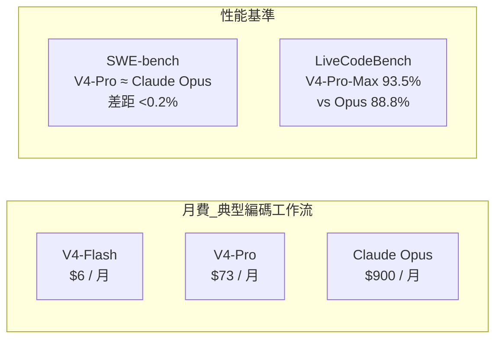
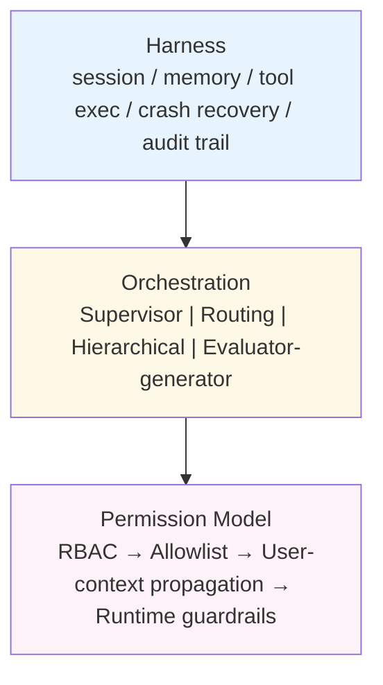

# AI Daily Digest — 2026-04-27

<!-- pipeline-generated:begin -->

## 🔥 今日 TOP 3
### 1. DeepSeek V4 成本低百倍、編碼基準近平 Claude Opus
DeepSeek 發布 V4 系列，V4-Flash 輸入定價 $0.14 / 百萬 tokens，V4-Pro 輸出 $3.48 / 百萬 tokens；相比 Claude 的 $15 輸入與 $75 輸出，差距分別達 107 倍與 21 倍。以典型編碼工作流（日 20 次請求、5 萬 input + 1 萬 output tokens）計算，V4-Flash 月費 $6，V4-Pro $73，Claude Opus 需 $900。企業規模（100 工程師）年費差距可達 $6K vs $900K。

在 SWE-bench 軟體工程基準上，V4-Pro 與 Claude Opus 4.6 差距不足 0.2%，LiveCodeBench 更以 93.5% 勝出（Opus 88.8%）。Claude 仍在抽象推理略勝（40% vs 37.7%），但差距正在縮小。這意味著在主流編碼任務上，同等品質的輸出現在可以用不到 1% 的成本取得，直接衝擊企業對旗艦模型的採購邏輯。

實務應用：高頻低推理任務（code completion、boilerplate 生成、log 分析）優先評估 V4-Flash 作為主力，保留 Claude Opus 於架構設計、跨模組推理等高風險決策場景。採購前應針對公司實際任務跑 task-specific benchmark，並以月 token 用量估算年化成本，而非依賴單一 leaderboard 排名。

📖 [閱讀完整 insight](../10-insights/2026-04-27/inbox_f5d467fa.md) · 🔗 [原文連結](https://medium.com/@cognidownunder/deepseek-v4-just-made-claude-look-expensive-and-the-gap-is-getting-worse-989e100d88b4?source=rss------large_language_models-5)
### 2. Production AI Agent 三層基礎設施缺一不可
深度框架文章指出，生產級 AI agent 必須具備三層基礎設施：Harness（管理 session state、memory、tool execution、crash recovery、audit trail 等 8 項職責的「作業系統」）、Orchestration（提供 Supervisor、Routing、Hierarchical delegation、Evaluator-generator 四種模式，明確區分確定性 workflow 與動態 agent 行為）、Permission model（RBAC → Agent-specific allowlist → User-context propagation → Runtime guardrails 四層防控）。

大多數 agent 生產事故都源自缺少其中一層：無 Harness 則無法追溯崩潰原因；無明確 Orchestration pattern 則非確定性行為難以除錯；Permission model 若缺乏 User-context propagation 層，agent 在委派執行時會以系統身份取得超越原始請求者的權限，造成 privilege escalation。目前框架生態中 LangGraph 專長顯式狀態管理、CrewAI 適合快速原型、Google ADK 與 Microsoft Agent Governance 各自提供不同程度的治理能力。

下一步：以三層框架對現有 agent 做快速審計——確認 session crash 是否留有 audit trail（Harness），工具呼叫是否受 allowlist 限制且 user identity 流過 delegation chain（Permission），orchestration pattern 是否與任務確定性程度匹配（Orchestration）。

📖 [閱讀完整 insight](../10-insights/2026-04-27/inbox_803b78f5.md) · 🔗 [原文連結](https://medium.com/version-1/your-ai-agents-need-an-operating-system-harnesses-orchestration-and-the-permission-model-7c1c140590b1?source=rss------large_language_models-5)
### 3. OpenAI 廢棄 SWE-bench：59% 測試案例有缺陷且遭訓練污染
OpenAI 宣布停止使用 SWE-bench Verified 評估前沿模型。深度審計在 27.6% 的資料集子集中發現至少 59.4% 的問題存在測試瑕疵，會錯誤拒絕功能正確的提交；此外，所有受測前沿模型的訓練資料都包含 SWE-bench 題目與標準解答，使模型能靠記憶複製人工修補方案，而非展現真實工程能力。

過去六個月 SWE-bench 分數從 74.9% 升至 80.9%，這 6% 進步現在被確認是「訓練暴露程度」的指標，而非真實能力改善。業界長期依賴該基準作為模型選型與技術報告的核心依據，此公告意味著相關排名、採購決策與 ROI 論述都需要重新驗證。這是近年最重要的 AI 評估誠信事件，影響不限於 SWE-bench，而是對整體基準信任度的系統性警示。

下一步：OpenAI 建議改用 SWE-bench Pro（較少訓練污染），並宣布開發新的未污染評估。對工程採購，應優先以公司內部私有測試集（包含真實 ticket、內部 codebase）做 task-specific evaluation；向供應商要求訓練資料截止日期與評估集重疊比例的透明揭露，以獨立驗證性能聲稱。

📖 [閱讀完整 insight](../10-insights/2026-04-26/inbox_d4ec9b08.md) · 🔗 [原文連結](https://openai.com/index/why-we-no-longer-evaluate-swe-bench-verified/)

## 📚 分類摘要
### foundation_models
DeepSeek V4 是本日最具成本衝擊的基礎模型新聞。V4-Flash 輸入 $0.14 / 百萬 tokens（Claude $15，低 107 倍），V4-Pro 在 SWE-bench 上與 Claude Opus 4.6 差距不足 0.2%，LiveCodeBench 更以 93.5% 勝出（Opus 88.8%）。100 人工程師團隊年費差距可達 $6K vs $900K，重新定義企業採購基準線。Claude 在抽象推理仍略勝（40% vs 37.7%），但領先幅度正在縮小（inbox_f5d467fa）。

OpenAI 宣布廢棄 SWE-bench Verified，審計確認 59.4% 測試案例有缺陷、所有前沿模型均存在訓練污染，74.9% → 80.9% 的六個月進步是暴露指標而非能力指標，建議改用 SWE-bench Pro 或內部私有測試集（inbox_d4ec9b08）。Arena.ai 6.5M 投票顯示，整體 dissatisfaction rate 從 17% 降至 9%，但數學改善最大（27% → ~10%），創意寫作、遊戲設計、法律幾乎停滯；Claude Sonnet 4.5 對無意義問題的拒答率超過 80%，GPT / Gemini 系列約 50%，顯示模型對齊策略存在明顯分化（inbox_13e23ea1）。OpenAI 另發布 Privacy Filter——1.5B 參數模型（runtime 僅 50M 活躍），在 PII-Masking-300k 達 96% F1，支持 128K tokens 單次處理，識別 8 種 PII 類型，Apache 2.0 開源，為 RAG pipeline 與日誌系統提供輕量隱私防護層（inbox_4b3ee774）。
### agents
GitHub 研究員 Maggie Appleton 在 ACE（Agent Collaboration Environment）原型中提出：agent 時代的核心瓶頸不是執行能力，而是「alignment」。規劃到實施的時間從數天壓縮至分鐘，傳統溝通檢查點消失，agent 容易生成無人需要的功能。ACE 以共享微 VM（含 git branch isolation）為基礎，讓 PM、設計師、客服在 planning 階段同步介入，將財務限制、用戶洞察、組織歷史等業務脈絡帶回決策現場，而非後移至 PR review 才發現方向偏差（inbox_46f4b32d）。

inbox_803b78f5 提供生產 agent 最完整的三層基礎設施框架，其中 User-context propagation 是防止 privilege escalation 的關鍵層，要求 user identity 流過整個 delegation chain；LangGraph（顯式狀態管理）、CrewAI（快速原型）、Google ADK、Microsoft Agent Governance 各自覆蓋部分層次。inbox_6948983a 的四層成熟度模型（Level 1 能力邊界 → Level 2 MCP 標準化整合 → Level 3 SOPs + Skills → Level 4 提示驅動開發）提供團隊升級路線，其中 MCP 被稱為「AI 工具的 USB-C」。inbox_eac3d45b 強調三層記憶架構（Operational / Contextual / Execution Memory）+ ADR 決策記錄，是 agent 持續學習的結構基礎，「agent 失敗不在智能不足，而在記憶組織不良」。inbox_1d1b0594 警示企業 AI 失敗的根因：在未真正理解的流程上部署智能，IBM 數據確認這只是讓錯誤的事更快發生，建議先以 process mining 讀取系統日誌揭示真實執行路徑再部署自動化。
### infra
AWS 宣布大規模服務精簡：WorkMail 於 2027 年 3 月正式停止，App Runner 自 2026 年 4 月 30 日起不接受新客戶並進入維護模式，另有 RDS Custom for Oracle、Audit Manager、CloudTrail Lake、IoT FleetWise、Glue Ray Jobs、WorkSpaces Thin Client（AWS 唯一硬體產品）、Service Management Connector 等共約 14 個服務同步進入維護或日落期。社群討論指出部分服務雖營收貢獻低，但作為生態黏著劑的隱性價值被低估；依賴 App Runner 的團隊建議評估遷移至 Google Cloud Run（inbox_315a1555, inbox_84649e4b）。

Spring 生態四月下旬集中進入 RC 階段：Boot 4.1.0-RC1 新增 OTLP SDK exporter 環境變數支援與 LazyConnectionDataSourceProxy；Security 7.1.0-RC1 新增 anyOf() 與 PreFlightRequestFilter；Integration 7.1.0-RC1 重構 RedisLockRegistry 以利用 Redis 8.4+ 原生 CAS/CAD 命令優化分散式鎖管理；Modulith 2.1.0-RC1 引入 @ModuleSlicing 注解解決多 @SpringBootApplication 整合測試衝突；Kafka 4.1.0-RC1 新增 ContainerProperties.ShareAckMode enum 與 AcknowledgementCommitCallback 支援。共 Boot、Security、Session、Integration、Modulith、AMQP、Kafka、Vault 八個框架協同更新，屬例行發布週期無重大架構轉變（inbox_c946dbbf）。

## 🎯 專欄
### 🛠 Claude Code / Codex 新功能
- **[rust-v0.126.0-alpha.5](../10-insights/2026-04-27/inbox_575d5a83.md)**
  OpenAI Codex Rust 版本發佈 v0.126.0-alpha.5。原文僅提供版本號與時間戳，完全未包含任何變更日誌、功能說明或修復列表。
- **[0.126.0-alpha.4](../10-insights/2026-04-27/inbox_f360faa6.md)**
  OpenAI Codex 發佈版本 0.126.0-alpha.4。原文僅標示版本號與時間戳，無任何實質內容。
- **[0.126.0-alpha.3](../10-insights/2026-04-26/inbox_7cbba282.md)**
  OpenAI Codex 發佈版本 0.126.0-alpha.3。原文僅標示版本號與時間戳，無任何實質內容。
- **[0.126.0-alpha.2](../10-insights/2026-04-25/inbox_f8f2783a.md)**
  OpenAI Codex 發佈版本 0.126.0-alpha.2。原文僅標示版本號與時間戳，無任何實質內容。
- **[I automated away an hour of project setup with a Claude Code skill](../10-insights/2026-04-27/inbox_748b37ea.md)**
  開發者使用 Claude Code skill 自動化了 Next.js + Drizzle + Tailwind 的項目架構化流程，將原本需要 1 小時的手動設定（GitHub repo、環境變數、資料庫配置、Render 部署等）壓縮到 90 秒內完成。這個 skill 集中了三個同類型 SaaS 項目共有的 90% 架構（Next.js 16 + Re
### 📚 AI 知識管理
- **[Microsoft&#39;s Russinovich and Hanselman Warn AI Is Hollowing Out the Junior Developer Pipeline](../10-insights/2026-04-27/inbox_159c9dc7.md)**
  微軟高管 Mark Russinovich 與 Scott Hanselman 在 ACM 通訊雜誌（CACM）發表論文警示，Agent 型 AI 正在拉大初階與資深開發者的技能差距。論文指出 AI 工具對資深工程師幫助最大，反而成為初級開發者學習的「拖累」（AI drag），削弱其成長曲線。統計數據顯示，自 2022 年以來初階開發者招聘量下跌 67%，反
- **[Microsoft&#39;s Russinovich and Hanselman Warn AI Is Hollowing Out the Junior Developer Pipeline](../10-insights/2026-04-27/inbox_7b174aba.md)**
  微軟高管 Mark Russinovich 與 Scott Hanselman 在 ACM 通訊雜誌（CACM）發表論文警示，Agent 型 AI 正在拉大初階與資深開發者的技能差距。論文指出 AI 工具對資深工程師幫助最大，反而成為初級開發者學習的「拖累」（AI drag），削弱其成長曲線。統計數據顯示，自 2022 年以來初階開發者招聘量下跌 67%，反
- **[Why OpenAI Privacy Filter feels like real AI infrastructure](../10-insights/2026-04-27/inbox_4b3ee774.md)**
  OpenAI發布Privacy Filter，一套1.5B參數的bidirectional token-classification模型（運行時僅50M參數活躍），在PII-Masking-300k基準上達96% F1（精度94.04%、召回98.04%），可單次處理128,000 tokens。識別8種PII類型（姓名、地址、郵箱、電話、URL、日期、帳號
- **[New LLM Tools Transforming Everyday Work](../10-insights/2026-04-27/inbox_18aef067.md)**
  Preeti Ramchiary整理LLM工具在日常工作中的6大應用場景：寫作助手（秒速起稿email、改進文法語調）、研究與學習（快速摘要複雜議題）、辦公生產力（自動會議紀錄、簡報起草、資料整理）、編程支援（生成代碼與除錯）、多語言溝通（翻譯及非母語寫作）、創意發想。提及ChatGPT、Microsoft Copilot、Google Gemini、Not
- **[Designing Memory Systems for AI Agents](../10-insights/2026-04-27/inbox_eac3d45b.md)**
  系統化分析 AI agent 的記憶架構設計。提出三層記憶模型：Operational Memory（規則、提示、guardrails），Contextual Memory（領域知識、系統架構、業務邏輯），Execution Memory（過往運行、失敗、修正、學習）。核心洞察：「Agent 失敗不在於智能不足，而在於記憶組織不良」。結構化最佳實踐包括原子化
### 🏢 企業導入 AI / 團隊實踐
- **[Microsoft&#39;s Russinovich and Hanselman Warn AI Is Hollowing Out the Junior Developer Pipeline](../10-insights/2026-04-27/inbox_159c9dc7.md)**
  微軟高管 Mark Russinovich 與 Scott Hanselman 在 ACM 通訊雜誌（CACM）發表論文警示，Agent 型 AI 正在拉大初階與資深開發者的技能差距。論文指出 AI 工具對資深工程師幫助最大，反而成為初級開發者學習的「拖累」（AI drag），削弱其成長曲線。統計數據顯示，自 2022 年以來初階開發者招聘量下跌 67%，反
- **[GitLab Adds Flat-Rate Code Reviews, Free-Tier AI Access, and Spending Caps](../10-insights/2026-04-27/inbox_6592e390.md)**
  GitLab 在版本 18.10 與 18.11 中推出三項重要改變，應對 DevOps 領域的 AI 民主化與成本控制需求。首先，將 Agent AI 功能開放給免費層用戶，降低企業試用 AI 工具的進入門檻。其次，推出固定費率的自動化代碼審查模式，相比按量計費更利於成本預測與預算規劃。第三，讓管理員可設定團隊的 AI 支出上限，防止意外超支。這些調整反映
- **[Spring News Roundup: First Release Candidates of Boot, Security, Integration, Modulith, AMQP](../10-insights/2026-04-27/inbox_b36d3902.md)**
  Spring 生態在 4 月 20 日週迎來一波集中發布，多個主要模組推出首個發行候選版本（RC）。涵蓋範圍包括 Spring Boot、Spring Security、Spring Integration、Spring Modulith、Spring AMQP、Spring for Apache Kafka 以及 Spring Vault。此次發布延續 S
- **[Microsoft&#39;s Russinovich and Hanselman Warn AI Is Hollowing Out the Junior Developer Pipeline](../10-insights/2026-04-27/inbox_7b174aba.md)**
  微軟高管 Mark Russinovich 與 Scott Hanselman 在 ACM 通訊雜誌（CACM）發表論文警示，Agent 型 AI 正在拉大初階與資深開發者的技能差距。論文指出 AI 工具對資深工程師幫助最大，反而成為初級開發者學習的「拖累」（AI drag），削弱其成長曲線。統計數據顯示，自 2022 年以來初階開發者招聘量下跌 67%，反
- **[Spring News Roundup: First Release Candidates of Boot, Security, Integration, Modulith, AMQP](../10-insights/2026-04-27/inbox_c946dbbf.md)**
  Spring 生態在 2026 年 4 月下旬發布多個 RC 版本。Spring Boot 4.1.0-RC1 新增 OpenTelemetry Protocol (OTLP) SDK exporter 環境變數支援和 LazyConnectionDataSourceProxy；Spring Security 7.1.0-RC1 新增 anyOf() 方法和
### 🎓 AI 使用技巧 / 心法
- **[Spring News Roundup: First Release Candidates of Boot, Security, Integration, Modulith, AMQP](../10-insights/2026-04-27/inbox_c946dbbf.md)**
  Spring 生態在 2026 年 4 月下旬發布多個 RC 版本。Spring Boot 4.1.0-RC1 新增 OpenTelemetry Protocol (OTLP) SDK exporter 環境變數支援和 LazyConnectionDataSourceProxy；Spring Security 7.1.0-RC1 新增 anyOf() 方法和
- **[Bytes Speak All Languages: Cross-Script Name Retrieval via Contrastive Learning](../10-insights/2026-04-26/inbox_22ada515.md)**
  研究論文提出純 UTF-8 字節級別的跨文種名字檢索方案，無須 tokenizer 或預訓練骨幹。核心洞察：Unicode 字符確定性分解為 1-4 字節，固定 256 符號表，足以通過對比學習在「Владимир」和「Vladimir」間建立相似向量。使用 4 階段 LLM pipeline（Wikidata 分層取樣 → Llama 生成音韻變體 → Q
- **[Why Your AI Feature Isn’t Being Adopted and the UX Patterns That Fix It](../10-insights/2026-04-27/inbox_24b4426c.md)**
  实践指导文章，剖析 AI 功能上线后采用困难的根本原因，并提出改进用户体验的设计模式（UX patterns）来提升 AI 功能的实际使用率。强调功能的演示效果与生产环境中的实际采用之间存在巨大鸿沟，需要以用户为中心的 UX 优化来弥合这一差距。
- **[Your AI Agents Need an Operating System: Harnesses, Orchestration, and the Permission Model](../10-insights/2026-04-27/inbox_803b78f5.md)**
  Production AI agents不能只靠LLM能力，需要三層基礎設施：(1) Harness——作業系統管理session state、memory、tool execution、crash recovery、audit trail等8項職責；(2) Orchestration——區分deterministic workflow與dynamic ag
- **[Why Large Language Models “Forget” Early Context (and the Math Behind It)](../10-insights/2026-04-27/inbox_dbc1f4dc.md)**
  LLM「遺忘」早期context的根本原因在於self-attention的數學特性。Attention權重必須sum to 1（固定預算），context增長時每個token獲得的基礎attention反比下降（1萬token時~0.01%，100 token時~1%）。Softmax exponential weighting將微小分數差異（如2點）放大
### 💳 支付 / Fintech
- **[Bytes Speak All Languages: Cross-Script Name Retrieval via Contrastive Learning](../10-insights/2026-04-26/inbox_22ada515.md)**
  研究論文提出純 UTF-8 字節級別的跨文種名字檢索方案，無須 tokenizer 或預訓練骨幹。核心洞察：Unicode 字符確定性分解為 1-4 字節，固定 256 符號表，足以通過對比學習在「Владимир」和「Vladimir」間建立相似向量。使用 4 階段 LLM pipeline（Wikidata 分層取樣 → Llama 生成音韻變體 → Q
- **[Why OpenAI Privacy Filter feels like real AI infrastructure](../10-insights/2026-04-27/inbox_4b3ee774.md)**
  OpenAI發布Privacy Filter，一套1.5B參數的bidirectional token-classification模型（運行時僅50M參數活躍），在PII-Masking-300k基準上達96% F1（精度94.04%、召回98.04%），可單次處理128,000 tokens。識別8種PII類型（姓名、地址、郵箱、電話、URL、日期、帳號
- **[第 179 期](../10-insights/2026-04-27/inbox_c22bbb17.md)**
  本期 Web3Matters 主要討論加密相關議題，其中最值得關注的 AI 相關討論來自 Denken：他指出當前「token」(代幣) 焦慮從加密貨幣延伸到 AI 領域——人們討論的重點從「你正在做什麼產品」轉變為「你同時跑了幾個 agent」，使用 AI agent 的頻率與效能成為社交談題核心。這反映出類似當年 mobile app 開發社群從分享應用
### ⛓️ 區塊鏈 / Web3
- **[rust-v0.126.0-alpha.5](../10-insights/2026-04-27/inbox_575d5a83.md)**
  OpenAI Codex Rust 版本發佈 v0.126.0-alpha.5。原文僅提供版本號與時間戳，完全未包含任何變更日誌、功能說明或修復列表。
- **[0.126.0-alpha.4](../10-insights/2026-04-27/inbox_f360faa6.md)**
  OpenAI Codex 發佈版本 0.126.0-alpha.4。原文僅標示版本號與時間戳，無任何實質內容。
- **[0.126.0-alpha.3](../10-insights/2026-04-26/inbox_7cbba282.md)**
  OpenAI Codex 發佈版本 0.126.0-alpha.3。原文僅標示版本號與時間戳，無任何實質內容。
- **[0.126.0-alpha.2](../10-insights/2026-04-25/inbox_f8f2783a.md)**
  OpenAI Codex 發佈版本 0.126.0-alpha.2。原文僅標示版本號與時間戳，無任何實質內容。
- **[Bytes Speak All Languages: Cross-Script Name Retrieval via Contrastive Learning](../10-insights/2026-04-26/inbox_22ada515.md)**
  研究論文提出純 UTF-8 字節級別的跨文種名字檢索方案，無須 tokenizer 或預訓練骨幹。核心洞察：Unicode 字符確定性分解為 1-4 字節，固定 256 符號表，足以通過對比學習在「Владимир」和「Vladimir」間建立相似向量。使用 4 階段 LLM pipeline（Wikidata 分層取樣 → Llama 生成音韻變體 → Q
### 📒 帳務架構 / Ledger
- **[Your AI Agents Need an Operating System: Harnesses, Orchestration, and the Permission Model](../10-insights/2026-04-27/inbox_803b78f5.md)**
  Production AI agents不能只靠LLM能力，需要三層基礎設施：(1) Harness——作業系統管理session state、memory、tool execution、crash recovery、audit trail等8項職責；(2) Orchestration——區分deterministic workflow與dynamic ag
### 🔐 AI 安全 / 濫用
- **[Spring News Roundup: First Release Candidates of Boot, Security, Integration, Modulith, AMQP](../10-insights/2026-04-27/inbox_b36d3902.md)**
  Spring 生態在 4 月 20 日週迎來一波集中發布，多個主要模組推出首個發行候選版本（RC）。涵蓋範圍包括 Spring Boot、Spring Security、Spring Integration、Spring Modulith、Spring AMQP、Spring for Apache Kafka 以及 Spring Vault。此次發布延續 S
- **[Spring News Roundup: First Release Candidates of Boot, Security, Integration, Modulith, AMQP](../10-insights/2026-04-27/inbox_c946dbbf.md)**
  Spring 生態在 2026 年 4 月下旬發布多個 RC 版本。Spring Boot 4.1.0-RC1 新增 OpenTelemetry Protocol (OTLP) SDK exporter 環境變數支援和 LazyConnectionDataSourceProxy；Spring Security 7.1.0-RC1 新增 anyOf() 方法和

## 💡 今日 Takeaway

_讀完今日所有內容後，可帶走的知識點_
### 1. 在 workflow 節點末尾重釘關鍵約束，對抗 context 指數衰減
self-attention 的 softmax 歸一化使 token 的 attention 預算固定（sum to 1），context 每擴張 10 倍，早期 token 的基礎 attention 降低 10 倍。多步驟 workflow 中若每步有 10% constraint 流失，5 步後僅剩 59%（指數衰減），且模型傾向信任自己的摘要而非原始輸入，形成正反饋惡化。工程解法是「constraint pinning」——在每個 workflow 節點末尾重複寫入關鍵約束，而非寄望於更大的 context window。

_類型：technique_

**參考來源**：
- [Why Large Language Models “Forget” Early Context (and the Math Behind It)](../10-insights/2026-04-27/inbox_dbc1f4dc.md) · [原文](https://medium.com/@majid.golshadi/why-large-language-models-forget-early-context-and-the-math-behind-it-397156bac9b3?source=rss------large_language_models-5)
### 2. RAG 兩階段架構（bi-encoder 初篩 + cross-encoder reranker）是生產必需品，非優化選項
bi-encoder 各自獨立編碼查詢和文件，無法交互比較，容易把語義相似的句子（統計描述）誤判為問題答案（解決方案）。cross-encoder 聯合 forward pass 可精確交互評分，但計算成本無法全量應用。兩階段管道（bi-encoder 高召回篩 100 候選 → cross-encoder 精排 Top-K）可將系統精度從約 60% 提升至 80% 以上，直接決定 RAG 是正確回答還是自信幻覺。

_類型：framework_

**參考來源**：
- [The RAG Interview Question I Couldn’t Answer](../10-insights/2026-04-26/inbox_7b9866b5.md) · [原文](https://blog.stackademic.com/the-rag-interview-question-i-couldnt-answer-4ceb6b123b90?source=rss----d1baaa8417a4---4)
### 3. 整體模型排名上升可能掩蓋特定領域停滯，選型應依任務類型而非綜合分數
Arena.ai 6.5M 投票顯示，模型整體 dissatisfaction rate 從 17% 降至 9%，但改善集中於數學（27% → ~10%），創意寫作、遊戲設計、法律幾乎無進展。用綜合排名作為採購唯一依據，等於讓數學任務的改善「補貼」了其他領域的停滯。正確做法是針對實際使用場景跑 task-specific evaluation，並要求廠商公開細分任務性能拆解，不能只看總排行榜。

_類型：pattern_

**參考來源**：
- [What Do Models Still Suck At? - Peter Gostev, Arena.ai, BullshitBench](../10-insights/2026-04-24/inbox_13e23ea1.md) · [原文](https://www.youtube.com/watch?v=R7A8rX-09Zw)
### 4. User-context propagation 穿越 delegation chain 是防止 agent privilege escalation 的關鍵設計層
當 AI agent 以委派身份呼叫下游工具或子 agent 時，若未攜帶原始 user identity，執行環境會以 agent 本身的系統權限判斷可用操作，形成 privilege escalation。正確設計是讓 user identity 流過整個 delegation chain，使每個工具呼叫都在原始請求者的權限範圍內執行。這一層是 RBAC 和 runtime guardrails 之間的關鍵防火牆，在多代理協作架構（Hierarchical delegation、Supervisor pattern）中尤其不可省略。

_類型：framework_

**參考來源**：
- [Your AI Agents Need an Operating System: Harnesses, Orchestration, and the Permission Model](../10-insights/2026-04-27/inbox_803b78f5.md) · [原文](https://medium.com/version-1/your-ai-agents-need-an-operating-system-harnesses-orchestration-and-the-permission-model-7c1c140590b1?source=rss------large_language_models-5)
### 5. AI agent 自動化前必須先 process mining，否則只是加速錯誤流程
企業 AI 失敗的根因是「在無知之上部署智能」——自動化未真正理解的流程。Process mining 透過系統日誌揭示真實執行路徑（而非文件描述的理想流程），task mining 補充捕捉人工 workaround，兩者合力才能為 agent 的 decision boundary 和 escalation logic 提供「操作上誠實」的認知基礎。IBM 數據確認：跳過這步，AI 的加速效應反而讓錯誤的事更快發生，這是企業 AI 計畫高失敗率的直接原因。

_類型：framework_

**參考來源**：
- [Process mining is the strategic foundation your enterprise AI project is missing](../10-insights/2026-04-27/inbox_1d1b0594.md) · [原文](https://generativeai.pub/process-mining-is-the-strategic-foundation-your-enterprise-ai-project-is-missing-d775ba6e55a7?source=rss------artificial_intelligence-5)

<!-- pipeline-generated:end -->

<!-- user-notes -->
<!-- Write your own notes below; pipeline never touches this section. -->