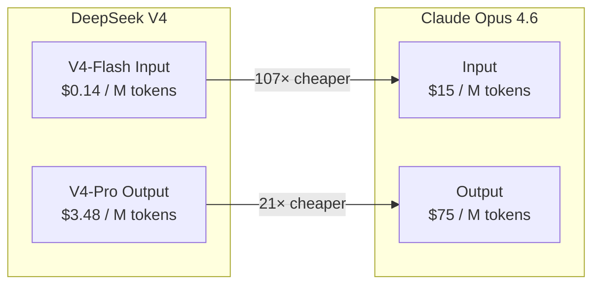
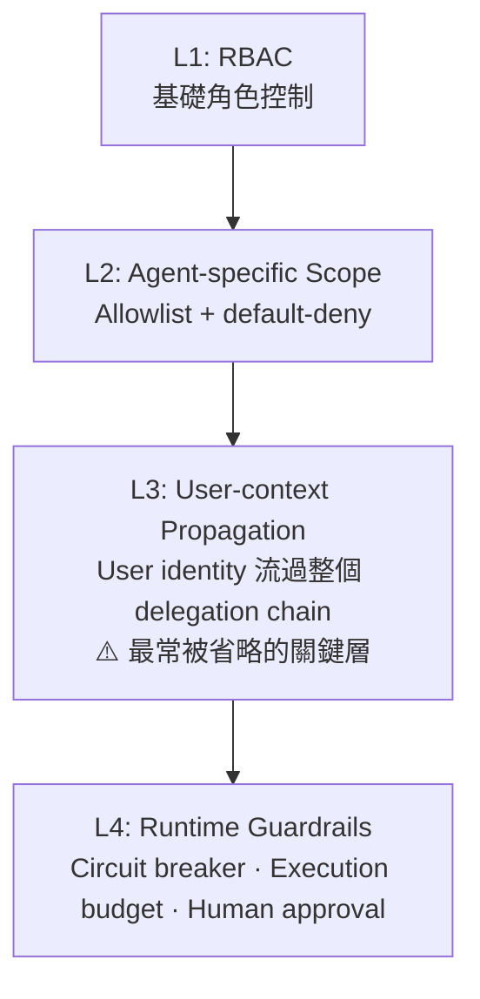

# AI Daily Digest — 2026-04-27

<!-- pipeline-generated:begin -->

## 🔥 今日 TOP 3
### 1. DeepSeek V4 成本較 Claude Opus 低 21 倍，企業採購策略需重估
DeepSeek 發布 V4 系列，V4-Pro 輸出定價 $3.48/百萬 tokens、V4-Flash 輸入定價僅 $0.14/百萬 tokens，分別較 Claude Opus 4.6 便宜 21 倍與 107 倍。SWE-bench 編碼基準上，V4-Pro 與 Claude Opus 4.6 效能差異不足 0.2%；LiveCodeBench 上 V4-Pro-Max 甚至反超（93.5% vs 88.8%），Claude 僅在 abstract reasoning 保有微幅領先（40% vs 37.7%）。

對大量呼叫 API 的企業（AI coding assistant、CI/CD pipeline、文件處理）而言，100 工程師規模的年費差距極為懸殊：V4-Flash $6K、V4-Pro $73K、Claude Opus $900K。這份具體數據意味著在編碼效能相近的情況下，繼續支付品牌溢價的 ROI 計算已根本改變，企業採購決策面臨直接重估壓力。

下一步應按任務性質分層評估：abstract reasoning 與複雜推理保留 Claude，純編碼與文本處理轉換至 V4-Pro 或 V4-Flash；同時須審查 DeepSeek 的資料隱私條款與延遲 SLA，避免將安全敏感工作負載送至成本最低但合規條件未明的端點，全成本計算才能反映真實 ROI。

📖 [閱讀完整 insight](../10-insights/2026-04-27/inbox_f5d467fa.md) · 🔗 [原文連結](https://medium.com/@cognidownunder/deepseek-v4-just-made-claude-look-expensive-and-the-gap-is-getting-worse-989e100d88b4?source=rss------large_language_models-5)
### 2. Microsoft 研究：Agent AI 對初階開發者形成 AI drag，入門職缺已降 67%
微軟高管 Mark Russinovich 與 Scott Hanselman 在 ACM 通訊雜誌（CACM）發表研究，記錄 Agent AI 帶來的技能分層效應：AI 工具對資深工程師有加速效果，對初階開發者卻形成「AI drag」（學習阻力），削弱其成長曲線。自 2022 年以來初階開發者招聘量已下跌 67%，反映企業因 AI 加速效應而縮減初階職位的現實決策。

此研究打破了「AI 取代工作」的表面框架，揭示更深層的產業風險：壓縮初階職位短期節省成本，但若成長管道斷裂，資深工程師本身無法被持續補充，最終形成整個產業的人才供給危機。AI 工具對資歷層級的效益高度不對稱，是目前大多數企業 AI 策略沒有正視的結構性盲點。

作者借用醫學教育「preceptor 制度」（導師一對一指導模式）提出制度性解法。工程組織可設計「由 AI 生成但由人審查並解釋」的配對學習機制——在保持生產力的同時，確保初階工程師真正理解所生成代碼的原理，讓 AI 成為學習催化劑而非跳過理解的捷徑。

📖 [閱讀完整 insight](../10-insights/2026-04-27/inbox_159c9dc7.md) · 🔗 [原文連結](https://www.infoq.com/news/2026/04/junior-developer-pipeline-crisis/?utm_campaign=infoq_content&utm_source=infoq&utm_medium=feed&utm_term=global)
### 3. Production AI Agent 三層基礎設施：Harness、Orchestration、四層 Permission Model
系統性框架提出生產 AI agent 需要三層基礎設施：Harness 管理 session state、memory、tool execution、crash recovery、audit trail 等 8 項職責；Orchestration 提供 Supervisor、Routing、Hierarchical delegation、Evaluator-generator 四種模式；Permission model 由 RBAC → Agent-specific allowlist → User-context propagation → Runtime guardrails 四層構成。

大多數 agent 教程只教 LLM 呼叫與工具使用，跳過了讓系統在生產環境穩定運行的基礎設施層。其中最關鍵且最常被省略的是 User-context propagation 層——若 user identity 沒有流過整個 delegation chain，多層委派中的 privilege escalation 無法追溯，生產 incident 的根因分析將陷入困境，成為難以察覺的安全盲點。

實作建議：先以 LangGraph（顯式狀態管理）或 Google ADK 建立 Harness，再按 Permission model 四層順序加入安全控制（優先建立 default-deny + allowlist 的 Agent-specific scope），最後加入 Runtime guardrails（circuit breaker、execution budget）。不要在基礎設施未就緒前就將 agent 暴露於生產流量。

📖 [閱讀完整 insight](../10-insights/2026-04-27/inbox_803b78f5.md) · 🔗 [原文連結](https://medium.com/version-1/your-ai-agents-need-an-operating-system-harnesses-orchestration-and-the-permission-model-7c1c140590b1?source=rss------large_language_models-5)

## 📚 分類摘要
### foundation_models
DeepSeek V4 是本日最具策略意義的模型動態（inbox_f5d467fa）。V4-Pro 在 SWE-bench 與 Claude Opus 4.6 效能差距不足 0.2%，V4-Pro-Max 在 LiveCodeBench 甚至反超（93.5% vs 88.8%）；成本則相差 21 倍（輸出 $3.48 vs $75/百萬 tokens），V4-Flash 輸入更低 107 倍（$0.14 vs $15）。Claude 仍在 abstract reasoning 保有微幅領先（40% vs 37.7%），但對純編碼任務的採購決策影響已不可忽視。

OpenAI 發布 Privacy Filter（inbox_4b3ee774），1.5B 參數 bidirectional token-classification 模型、運行時僅 50M 活躍參數，支援 128K token 單次處理，PII-Masking-300k 基準達 96% F1（精度 94%、召回 98%），識別 8 種 PII 類型，Apache 2.0 開源可本地部署。OpenAI 明確定位為「隱私設計中的一層」而非完整合規方案，責任邊界清晰是其關鍵設計決策，適合嵌入 RAG pipeline、日誌工具與文件索引等場景。

Arena.ai 透過 6.5M 真實投票數據（inbox_13e23ea1）揭示整體 dissatisfaction rate 從 17% 降至 9%，但改善高度集中於數學（27% → ~10%），創意寫作、遊戲設計、金融、法律幾乎停滯。BullshitBench（155 題無意義問題）測試顯示 Claude Sonnet 4.5 pushback 率 >80%，GPT/Gemini 系列僅約 50%，顯示模型間「識別無效問題」能力存在顯著差異，整體基準上升掩蓋了領域級差距。注意：今日仍有 26 則 items 尚未完整處理，本報告未涵蓋，建議明日進行補充追蹤。
### agents
本日 agents 類主題密集且品質高，多則框架分析同日出現。inbox_803b78f5 提出 Production AI agent 三層基礎設施，最關鍵是四層 Permission model 中的 User-context propagation——確保 user identity 流過整個 delegation chain 以防止 privilege escalation。inbox_6948983a 補充開發者四層成熟度路線：L1 理解能力邊界 → L2 持久化 agent + MCP 標準化工具整合（「AI 工具的 USB-C」）→ L3 SOP + Skills 確定性與可審計性 → L4 提示驅動開發，並警示「工具越多性能越差」的反直覺陷阱。

inbox_46f4b32d 的 GitHub ACE 框架揭示 agent 時代的新組織問題：規劃→實施時間坍縮至分鐘級，傳統對齊檢查點消失，多數問題後移至 PR 審查（已太晚）。ACE 以共享微 VM + git branch isolation 為基礎，讓 PM、設計師等非開發者可在計畫階段同時在場，業務脈絡與決策權回歸團隊。inbox_eac3d45b 提出 agent 三層記憶架構（Operational / Contextual / Execution Memory）+ ADR 決策記錄，指出「agent 失敗不在智能不足，而在記憶組織不良」。

inbox_1d1b0594 點出企業 AI 失敗的根本原因：「在無知之上部署智能」——自動化未被真正理解的流程，IBM 數據佐證結果是「讓錯誤的事更快發生」。Process mining 讀取系統日誌揭示真實流程差距，task mining 補充人為 workaround，兩者是 AI agent 部署的必要前置步驟。inbox_7b9866b5 補充生產 RAG 的關鍵架構：bi-encoder 高召回篩選候選 + cross-encoder reranker 精準重排，精度可從 ~60% 提升至 80%+，省略 reranker 是生產 RAG 最常見的根本設計缺陷。
### infra
AWS 本週集中宣布大規模服務調整（inbox_315a1555），WorkMail 將於 2027 年 3 月完全停止，App Runner 自 2026 年 4 月 30 日起進入維護模式不再接受新客戶。此波約 14 個服務同步日落，涵蓋 Audit Manager、CloudTrail Lake、IoT FleetWise、RDS Custom for Oracle，乃至 WorkSpaces Thin Client（AWS 唯一硬體產品）。社群討論浮現以 Google Cloud Run 替代 App Runner 的方案；使用相關服務的客戶需立即確認截止時程，啟動遷移評估，避免在 2027 年 3 月前陷入服務中斷危機。

GitLab 18.10/18.11（inbox_6592e390）推出三項調整回應 AI 工具的成本控制需求：Agent AI 功能向免費層開放、自動代碼審查改為固定費率（flat-rate）模式、管理員可設定 AI 支出上限。固定費率讓 CI/CD pipeline 預算規劃更可預測，支出上限功能解決了「AI 功能普及後預算失控」的常見痛點。這組設計精確反映了平台廠商在 AI 功能民主化（開放免費層）與避免用戶成本爆炸（支出上限）之間的平衡取捨策略。

## 🎯 專欄
### 🛠 Claude Code / Codex 新功能
- **[rust-v0.126.0-alpha.5](../10-insights/2026-04-27/inbox_575d5a83.md)**
  OpenAI Codex Rust 版本發佈 v0.126.0-alpha.5。原文僅提供版本號與時間戳，完全未包含任何變更日誌、功能說明或修復列表。
- **[0.126.0-alpha.4](../10-insights/2026-04-27/inbox_f360faa6.md)**
  OpenAI Codex 發佈版本 0.126.0-alpha.4。原文僅標示版本號與時間戳，無任何實質內容。
- **[0.126.0-alpha.3](../10-insights/2026-04-26/inbox_7cbba282.md)**
  OpenAI Codex 發佈版本 0.126.0-alpha.3。原文僅標示版本號與時間戳，無任何實質內容。
- **[0.126.0-alpha.2](../10-insights/2026-04-25/inbox_f8f2783a.md)**
  OpenAI Codex 發佈版本 0.126.0-alpha.2。原文僅標示版本號與時間戳，無任何實質內容。
- **[I automated away an hour of project setup with a Claude Code skill](../10-insights/2026-04-27/inbox_748b37ea.md)**
  開發者使用 Claude Code skill 自動化了 Next.js + Drizzle + Tailwind 的項目架構化流程，將原本需要 1 小時的手動設定（GitHub repo、環境變數、資料庫配置、Render 部署等）壓縮到 90 秒內完成。這個 skill 集中了三個同類型 SaaS 項目共有的 90% 架構（Next.js 16 + Re
### 📚 AI 知識管理
- **[Microsoft&#39;s Russinovich and Hanselman Warn AI Is Hollowing Out the Junior Developer Pipeline](../10-insights/2026-04-27/inbox_159c9dc7.md)**
  微軟高管 Mark Russinovich 與 Scott Hanselman 在 ACM 通訊雜誌（CACM）發表論文警示，Agent 型 AI 正在拉大初階與資深開發者的技能差距。論文指出 AI 工具對資深工程師幫助最大，反而成為初級開發者學習的「拖累」（AI drag），削弱其成長曲線。統計數據顯示，自 2022 年以來初階開發者招聘量下跌 67%，反
- **[Microsoft&#39;s Russinovich and Hanselman Warn AI Is Hollowing Out the Junior Developer Pipeline](../10-insights/2026-04-27/inbox_7b174aba.md)**
  微軟高管 Mark Russinovich 與 Scott Hanselman 在 ACM 通訊雜誌（CACM）發表論文警示，Agent 型 AI 正在拉大初階與資深開發者的技能差距。論文指出 AI 工具對資深工程師幫助最大，反而成為初級開發者學習的「拖累」（AI drag），削弱其成長曲線。統計數據顯示，自 2022 年以來初階開發者招聘量下跌 67%，反
- **[Why OpenAI Privacy Filter feels like real AI infrastructure](../10-insights/2026-04-27/inbox_4b3ee774.md)**
  OpenAI發布Privacy Filter，一套1.5B參數的bidirectional token-classification模型（運行時僅50M參數活躍），在PII-Masking-300k基準上達96% F1（精度94.04%、召回98.04%），可單次處理128,000 tokens。識別8種PII類型（姓名、地址、郵箱、電話、URL、日期、帳號
- **[New LLM Tools Transforming Everyday Work](../10-insights/2026-04-27/inbox_18aef067.md)**
  Preeti Ramchiary整理LLM工具在日常工作中的6大應用場景：寫作助手（秒速起稿email、改進文法語調）、研究與學習（快速摘要複雜議題）、辦公生產力（自動會議紀錄、簡報起草、資料整理）、編程支援（生成代碼與除錯）、多語言溝通（翻譯及非母語寫作）、創意發想。提及ChatGPT、Microsoft Copilot、Google Gemini、Not
- **[Designing Memory Systems for AI Agents](../10-insights/2026-04-27/inbox_eac3d45b.md)**
  系統化分析 AI agent 的記憶架構設計。提出三層記憶模型：Operational Memory（規則、提示、guardrails），Contextual Memory（領域知識、系統架構、業務邏輯），Execution Memory（過往運行、失敗、修正、學習）。核心洞察：「Agent 失敗不在於智能不足，而在於記憶組織不良」。結構化最佳實踐包括原子化
### 🏢 企業導入 AI / 團隊實踐
- **[Microsoft&#39;s Russinovich and Hanselman Warn AI Is Hollowing Out the Junior Developer Pipeline](../10-insights/2026-04-27/inbox_159c9dc7.md)**
  微軟高管 Mark Russinovich 與 Scott Hanselman 在 ACM 通訊雜誌（CACM）發表論文警示，Agent 型 AI 正在拉大初階與資深開發者的技能差距。論文指出 AI 工具對資深工程師幫助最大，反而成為初級開發者學習的「拖累」（AI drag），削弱其成長曲線。統計數據顯示，自 2022 年以來初階開發者招聘量下跌 67%，反
- **[GitLab Adds Flat-Rate Code Reviews, Free-Tier AI Access, and Spending Caps](../10-insights/2026-04-27/inbox_6592e390.md)**
  GitLab 在版本 18.10 與 18.11 中推出三項重要改變，應對 DevOps 領域的 AI 民主化與成本控制需求。首先，將 Agent AI 功能開放給免費層用戶，降低企業試用 AI 工具的進入門檻。其次，推出固定費率的自動化代碼審查模式，相比按量計費更利於成本預測與預算規劃。第三，讓管理員可設定團隊的 AI 支出上限，防止意外超支。這些調整反映
- **[Spring News Roundup: First Release Candidates of Boot, Security, Integration, Modulith, AMQP](../10-insights/2026-04-27/inbox_b36d3902.md)**
  Spring 生態在 4 月 20 日週迎來一波集中發布，多個主要模組推出首個發行候選版本（RC）。涵蓋範圍包括 Spring Boot、Spring Security、Spring Integration、Spring Modulith、Spring AMQP、Spring for Apache Kafka 以及 Spring Vault。此次發布延續 S
- **[Microsoft&#39;s Russinovich and Hanselman Warn AI Is Hollowing Out the Junior Developer Pipeline](../10-insights/2026-04-27/inbox_7b174aba.md)**
  微軟高管 Mark Russinovich 與 Scott Hanselman 在 ACM 通訊雜誌（CACM）發表論文警示，Agent 型 AI 正在拉大初階與資深開發者的技能差距。論文指出 AI 工具對資深工程師幫助最大，反而成為初級開發者學習的「拖累」（AI drag），削弱其成長曲線。統計數據顯示，自 2022 年以來初階開發者招聘量下跌 67%，反
- **[Spring News Roundup: First Release Candidates of Boot, Security, Integration, Modulith, AMQP](../10-insights/2026-04-27/inbox_c946dbbf.md)**
  Spring 生態在 2026 年 4 月下旬發布多個 RC 版本。Spring Boot 4.1.0-RC1 新增 OpenTelemetry Protocol (OTLP) SDK exporter 環境變數支援和 LazyConnectionDataSourceProxy；Spring Security 7.1.0-RC1 新增 anyOf() 方法和
### 🎓 AI 使用技巧 / 心法
- **[Spring News Roundup: First Release Candidates of Boot, Security, Integration, Modulith, AMQP](../10-insights/2026-04-27/inbox_c946dbbf.md)**
  Spring 生態在 2026 年 4 月下旬發布多個 RC 版本。Spring Boot 4.1.0-RC1 新增 OpenTelemetry Protocol (OTLP) SDK exporter 環境變數支援和 LazyConnectionDataSourceProxy；Spring Security 7.1.0-RC1 新增 anyOf() 方法和
- **[Bytes Speak All Languages: Cross-Script Name Retrieval via Contrastive Learning](../10-insights/2026-04-26/inbox_22ada515.md)**
  研究論文提出純 UTF-8 字節級別的跨文種名字檢索方案，無須 tokenizer 或預訓練骨幹。核心洞察：Unicode 字符確定性分解為 1-4 字節，固定 256 符號表，足以通過對比學習在「Владимир」和「Vladimir」間建立相似向量。使用 4 階段 LLM pipeline（Wikidata 分層取樣 → Llama 生成音韻變體 → Q
- **[Why Your AI Feature Isn’t Being Adopted and the UX Patterns That Fix It](../10-insights/2026-04-27/inbox_24b4426c.md)**
  实践指导文章，剖析 AI 功能上线后采用困难的根本原因，并提出改进用户体验的设计模式（UX patterns）来提升 AI 功能的实际使用率。强调功能的演示效果与生产环境中的实际采用之间存在巨大鸿沟，需要以用户为中心的 UX 优化来弥合这一差距。
- **[Your AI Agents Need an Operating System: Harnesses, Orchestration, and the Permission Model](../10-insights/2026-04-27/inbox_803b78f5.md)**
  Production AI agents不能只靠LLM能力，需要三層基礎設施：(1) Harness——作業系統管理session state、memory、tool execution、crash recovery、audit trail等8項職責；(2) Orchestration——區分deterministic workflow與dynamic ag
- **[Why Large Language Models “Forget” Early Context (and the Math Behind It)](../10-insights/2026-04-27/inbox_dbc1f4dc.md)**
  LLM「遺忘」早期context的根本原因在於self-attention的數學特性。Attention權重必須sum to 1（固定預算），context增長時每個token獲得的基礎attention反比下降（1萬token時~0.01%，100 token時~1%）。Softmax exponential weighting將微小分數差異（如2點）放大
### 💳 支付 / Fintech
- **[Bytes Speak All Languages: Cross-Script Name Retrieval via Contrastive Learning](../10-insights/2026-04-26/inbox_22ada515.md)**
  研究論文提出純 UTF-8 字節級別的跨文種名字檢索方案，無須 tokenizer 或預訓練骨幹。核心洞察：Unicode 字符確定性分解為 1-4 字節，固定 256 符號表，足以通過對比學習在「Владимир」和「Vladimir」間建立相似向量。使用 4 階段 LLM pipeline（Wikidata 分層取樣 → Llama 生成音韻變體 → Q
- **[Why OpenAI Privacy Filter feels like real AI infrastructure](../10-insights/2026-04-27/inbox_4b3ee774.md)**
  OpenAI發布Privacy Filter，一套1.5B參數的bidirectional token-classification模型（運行時僅50M參數活躍），在PII-Masking-300k基準上達96% F1（精度94.04%、召回98.04%），可單次處理128,000 tokens。識別8種PII類型（姓名、地址、郵箱、電話、URL、日期、帳號
### ⛓️ 區塊鏈 / Web3
- **[rust-v0.126.0-alpha.5](../10-insights/2026-04-27/inbox_575d5a83.md)**
  OpenAI Codex Rust 版本發佈 v0.126.0-alpha.5。原文僅提供版本號與時間戳，完全未包含任何變更日誌、功能說明或修復列表。
- **[0.126.0-alpha.4](../10-insights/2026-04-27/inbox_f360faa6.md)**
  OpenAI Codex 發佈版本 0.126.0-alpha.4。原文僅標示版本號與時間戳，無任何實質內容。
- **[0.126.0-alpha.3](../10-insights/2026-04-26/inbox_7cbba282.md)**
  OpenAI Codex 發佈版本 0.126.0-alpha.3。原文僅標示版本號與時間戳，無任何實質內容。
- **[0.126.0-alpha.2](../10-insights/2026-04-25/inbox_f8f2783a.md)**
  OpenAI Codex 發佈版本 0.126.0-alpha.2。原文僅標示版本號與時間戳，無任何實質內容。
- **[Bytes Speak All Languages: Cross-Script Name Retrieval via Contrastive Learning](../10-insights/2026-04-26/inbox_22ada515.md)**
  研究論文提出純 UTF-8 字節級別的跨文種名字檢索方案，無須 tokenizer 或預訓練骨幹。核心洞察：Unicode 字符確定性分解為 1-4 字節，固定 256 符號表，足以通過對比學習在「Владимир」和「Vladimir」間建立相似向量。使用 4 階段 LLM pipeline（Wikidata 分層取樣 → Llama 生成音韻變體 → Q
### 📒 帳務架構 / Ledger
- **[Your AI Agents Need an Operating System: Harnesses, Orchestration, and the Permission Model](../10-insights/2026-04-27/inbox_803b78f5.md)**
  Production AI agents不能只靠LLM能力，需要三層基礎設施：(1) Harness——作業系統管理session state、memory、tool execution、crash recovery、audit trail等8項職責；(2) Orchestration——區分deterministic workflow與dynamic ag
### 🔐 AI 安全 / 濫用
- **[Spring News Roundup: First Release Candidates of Boot, Security, Integration, Modulith, AMQP](../10-insights/2026-04-27/inbox_b36d3902.md)**
  Spring 生態在 4 月 20 日週迎來一波集中發布，多個主要模組推出首個發行候選版本（RC）。涵蓋範圍包括 Spring Boot、Spring Security、Spring Integration、Spring Modulith、Spring AMQP、Spring for Apache Kafka 以及 Spring Vault。此次發布延續 S
- **[Spring News Roundup: First Release Candidates of Boot, Security, Integration, Modulith, AMQP](../10-insights/2026-04-27/inbox_c946dbbf.md)**
  Spring 生態在 2026 年 4 月下旬發布多個 RC 版本。Spring Boot 4.1.0-RC1 新增 OpenTelemetry Protocol (OTLP) SDK exporter 環境變數支援和 LazyConnectionDataSourceProxy；Spring Security 7.1.0-RC1 新增 anyOf() 方法和

## 💡 今日 Takeaway

_讀完今日所有內容後，可帶走的知識點_
### 1. 生產 RAG 必須採兩階段：Bi-encoder 召回 + Reranker 精準重排
Bi-encoder 各自獨立編碼查詢與文檔，無法交互比較，導致「語義相似」被誤認為「相關性」——醫療統計數字可能被誤認為預防建議的答案。Cross-encoder 透過聯合 forward pass 實現詞層級交互，但計算成本高無法全量應用，因此生產標準是兩階段管道：bi-encoder 高召回篩選約 100 候選（毫秒級），cross-encoder reranker 精準重排（提升 precision）。實測數據顯示精度從 ~60% 跳升至 80%+，這 25% 的差距直接決定系統回答品質或產生自信幻覺。

_類型：framework_

**參考來源**：
- [The RAG Interview Question I Couldn’t Answer](../10-insights/2026-04-26/inbox_7b9866b5.md) · [原文](https://blog.stackademic.com/the-rag-interview-question-i-couldnt-answer-4ceb6b123b90?source=rss----d1baaa8417a4---4)
### 2. 多步驟 Workflow 每步損失 10% Constraint，需在 Context 末尾反覆 Pin 關鍵約束
LLM attention 預算固定（sum to 1），context 增長時每 token 基礎 attention 反比衰減；Softmax 放大讓微小分數差距轉為 7 倍 attention 優勢，最近 token 輕易壓過早期指令。多步驟 workflow 指數衰減明顯：每步損失 10%，5 步後僅剩 59% constraint 存活，且模型傾向信任自己的摘要而非原始輸入，形成正反饋迴圈。更大的 context window 無法解決召回品質問題，正確工程解法是在每步 context 末尾重複 pin 關鍵約束，維持其 attention 競爭力。

_類型：technique_

**參考來源**：
- [Why Large Language Models “Forget” Early Context (and the Math Behind It)](../10-insights/2026-04-27/inbox_dbc1f4dc.md) · [原文](https://medium.com/@majid.golshadi/why-large-language-models-forget-early-context-and-the-math-behind-it-397156bac9b3?source=rss------large_language_models-5)
### 3. 部署 AI Agent 前必先以 Process Mining 暴露真實流程，否則只是加速錯誤
企業 AI 高失敗率的直接原因是自動化「未被真正理解的流程」——IBM 數據佐證組織普遍在「讓錯誤的事更快發生」。AI agent 不同於 RPA，需理解異常狀態、有效轉移邊界與清晰升級邏輯，缺乏這些基礎將使 agent 在昂貴的 token 預算上做出混亂決策。Process mining 讀取系統日誌揭示文件流程與實際流程的差距，task mining 補充捕捉人為 workaround，兩者合力提供 AI agent 做出正確決策的「操作誠實」基礎，是不可省略的前置步驟。

_類型：framework_

**參考來源**：
- [Process mining is the strategic foundation your enterprise AI project is missing](../10-insights/2026-04-27/inbox_1d1b0594.md) · [原文](https://generativeai.pub/process-mining-is-the-strategic-foundation-your-enterprise-ai-project-is-missing-d775ba6e55a7?source=rss------artificial_intelligence-5)
### 4. DeepSeek V4 與 Claude Opus 編碼性能差距 <0.2%，成本相差 21 倍
DeepSeek V4-Pro 輸出 $3.48/M vs Claude Opus $75（21×），V4-Flash 輸入 $0.14 vs $15（107×）；100 工程師年費從 $900K 降至 $73K 或 $6K。規劃 AI 工作負載預算時，應先按任務性質分層：abstract reasoning 與複雜推理保留 Claude，純編碼、文本處理類使用 V4-Pro 或 V4-Flash；同時將資料隱私合規成本與延遲 SLA 納入全成本計算，而非只比較 API 定價，才能做出正確的採購決策。

_類型：data-point_

**參考來源**：
- [DeepSeek V4 Just Made Claude Look Expensive, and the Gap Is Getting Worse](../10-insights/2026-04-27/inbox_f5d467fa.md) · [原文](https://medium.com/@cognidownunder/deepseek-v4-just-made-claude-look-expensive-and-the-gap-is-getting-worse-989e100d88b4?source=rss------large_language_models-5)
### 5. Agent Permission Model 需四層，缺 User-context Propagation 層特權升級無從追溯
四層 Permission model 缺一不可：RBAC 控制角色基礎權限，Agent-specific allowlist 加入 default-deny 邏輯，User-context propagation 確保 user identity 流過整個 delegation chain（防止 privilege escalation），Runtime guardrails 提供 circuit breaker 與 execution budget 動態保護。第三層最常在快速開發中被跳過，但一旦缺失，多層 agent 委派中的權限濫用無法追溯，生產 incident 的根因分析將完全失效；在實作時應優先建立此層，而非等系統複雜化後補救。

_類型：framework_

**參考來源**：
- [Your AI Agents Need an Operating System: Harnesses, Orchestration, and the Permission Model](../10-insights/2026-04-27/inbox_803b78f5.md) · [原文](https://medium.com/version-1/your-ai-agents-need-an-operating-system-harnesses-orchestration-and-the-permission-model-7c1c140590b1?source=rss------large_language_models-5)
## ⏳ 待處理 (26 筆)

<!-- pipeline-generated:end -->

<!-- user-notes -->
<!-- Write your own notes below; pipeline never touches this section. -->