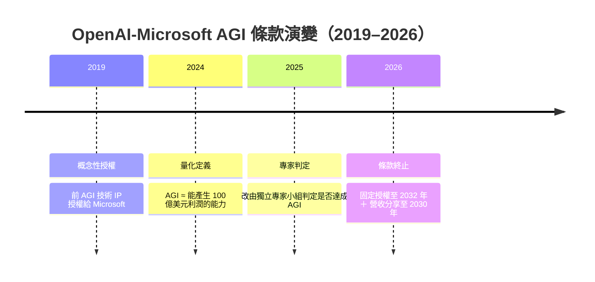
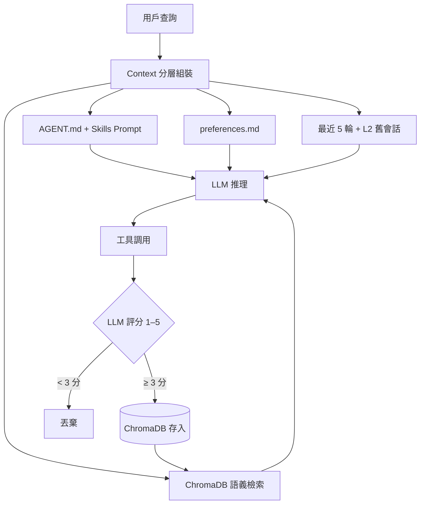

# AI Daily Digest — 2026-04-28

<!-- pipeline-generated:begin -->

## 🔥 今日 TOP 3
### 1. OpenAI-Microsoft AGI 觸發條款終止，合作轉為固定期限授權制
2026 年 4 月 27 日，OpenAI 與 Microsoft 正式廢除合作協議中的「AGI 觸發條款」——原條款規定一旦達成 AGI，Microsoft 對 OpenAI 商業技術 IP 的使用權將自動失效。新協議以固定日期取代技術里程碑：Microsoft 獲非獨佔授權至 2032 年、獲 OpenAI 營收分享至 2030 年，且協議明確標注該分享「與 OpenAI 技術進步無關」，從法律層面徹底終止了 AGI 觸發機制。

此條款歷經 7 年三次演變：2019 年概念性授權 → 2024 年量化為「100 億美元利潤能力」 → 2025 年改由獨立專家小組判定，最終被「固定到期日」取代。這是 AI 業界首次以商業合約承認：AGI 定義的模糊性使其無法作為可執行的法律觸發器，科技巨頭寧可設定固定期限也不願被技術里程碑條款綁架。相較於過去「AGI 達成即授權失效」的不確定性，新合約為 Microsoft Azure OpenAI 整合路線提供了明確的 6 年窗口期保障。

觀察重點有三：（1）2030 年 OpenAI 營收分享到期後的獨立商業路徑；（2）其他 AI 公司的融資合約是否也會將技術里程碑觸發條款轉換為固定日期；（3）企業採購者可更有信心規劃 Azure OpenAI 整合的中期技術路線，無需顧慮 AGI 觸發引發的授權中斷風險。

📖 [閱讀完整 insight](../10-insights/2026-04-27/inbox_1ce94446.md) · 🔗 [原文連結](https://simonwillison.net/2026/Apr/27/now-deceased-agi-clause/#atom-everything)
### 2. 生產級 Agentic AI 架構：四層記憶模型搭配 LLM 品質評分過濾
本文（系列第三篇）公開了一套完整的生產級 agentic AI 架構，核心解決工具發現、記憶機制與 context 管理三大問題。技能系統採 Docker 容器化，各容器暴露 `GET /schema` 與 `POST /execute` 兩個標準端點；四層記憶模型依序組裝 AGENT.md、技能 system prompt、preferences.md、ChromaDB 語義片段、最近 5 輪對話及 L2 層舊會話，再送入 LLM 推理。關鍵創新：工具調用結果在存入 ChromaDB 前由 LLM 評分（1-5），僅保存 ≥3 分者，從根本防止低品質輸出污染語義庫。

相較於全量傳遞（成本線性增長）或滾動視窗（喪失長期記憶），此架構在精度與成本之間取得最佳平衡。Docker 預熱池設計避免冷啟動延遲與跨會話狀態污染，是目前公開最完整的生產級 agent 記憶架構範例，適用對象涵蓋企業自動化代理、個人 AI 助手及任何需要長期任務記憶的場景。

實務上可立即在現有 RAG 系統中引入 LLM-as-evaluator 層：工具輸出經模型評分後選擇性存儲，以最小架構修改換取語義庫長期品質保障。四層記憶模型的分層組裝邏輯可直接作為 agent 架構設計基準，建議開發者對照自身系統的記憶分層策略進行差距分析。

📖 [閱讀完整 insight](../10-insights/2026-04-27/inbox_e0e4ea2a.md) · 🔗 [原文連結](https://medium.com/@CCH0/agentic-ai-the-hard-way-part-3-architecture-and-design-a3d5265f9e01?source=rss------claude-5)
### 3. OpenAI 取得 FedRAMP Moderate 認證，正式進入美國聯邦政府市場
OpenAI 的 ChatGPT Enterprise 和 OpenAI API 於 2026 年 4 月取得 FedRAMP Moderate 授權，這是美國聯邦政府雲端服務採購的主流安全認證門檻，允許衛生部、財政部、教育部等聯邦機構直接採購 OpenAI 服務，無需個別安全審查程序，正式開啟一個規模龐大的政府 AI 服務市場。

FedRAMP Moderate 的市場意義在於突破結構性准入壁壘：此前政府 AI 市場幾乎被已取得認證的基礎設施廠商（AWS Bedrock、Azure OpenAI Service、Google Vertex AI）獨佔，OpenAI 補上了關鍵合規缺口。相較直接競爭對手，Anthropic Claude Enterprise 在政府認證進度上落後，OpenAI 取得先發優勢；政府合約的高黏著度與多年週期，使此認證的長期商業價值可能遠超初期合約金額。

觀察重點：（1）OpenAI 是否推進 FedRAMP High 或 DoD IL4/IL5 進入國防機密領域；（2）Anthropic 是否加速政府合規路徑跟進；（3）政府認證往往作為企業高標準資安採購的代理指標，企業資安長可將其納入 AI 供應商選擇標準的參考依據。

📖 [閱讀完整 insight](../10-insights/2026-04-27/inbox_36d942a1.md) · 🔗 [原文連結](https://openai.com/index/openai-available-at-fedramp-moderate)

## 📚 分類摘要
### foundation_models
Anthropic 在 Claude Code v2.1.121 中修復兩個 2GB+ 級別的記憶體洩漏：多張圖片處理引發 RSS 異常成長、`/usage` 命令單次洩漏約 2GB，大幅提升長時間複雜工作流程的穩定性。配套更新包括 MCP 伺服器 `alwaysLoad` 選項（跳過工具搜尋延遲）、PostToolUse 掛鉤支援全工具輸出替換，以及全螢幕滾動修正、iTerm2 剪貼簿支援等 UI 改進。提示工程方面，來自 Anthropic 的實踐指南確認：XML 標籤分隔指令與工作素材、搭配單一 few-shot 範例的四技組合效果「大於各部分之和」，幾乎消除所有指令歧義。

OpenAI 在本日以多線並進節奏推進：取得 FedRAMP Moderate 認證突破聯邦政府市場（覆蓋 ChatGPT Enterprise 和 OpenAI API 雙產品線）；開源編排規格 Symphony 將 issue tracker 轉化為常態運行的 Codex 代理系統；Codex Rust 版本密集發布三個 alpha 版本（v0.126.0-alpha.6、.7、.8）；Microsoft 與 OpenAI 正式終止 AGI 觸發條款及獨家收入分成協議，合作結構從「技術條件觸發」轉為「固定期限授權至 2032 年」，同時終止 Microsoft 的獨家商業收入分成機制。

「小型模型效率時代」在本日形成多點共振。Apple 人事信號明確：新任 CEO John Ternus 與升任首席硬體長的 Johny Srouji 均為晶片工程師，暗示 Apple 全面放棄雲端 AI 競爭、押注設備端運算（on-device AI）。量化分析顯示，百萬日查詢規模下本地模型 vs 雲端 API 年度成本差距可達 $33M；混合推論架構（本地處理常規任務 + 雲端負責複雜推理）成為新的成本最佳化主流路徑，已獲 Apple、Google Android、Microsoft Phi、Meta Llama 等多家廠商組織性押注。
### agents
InfoQ 的 MCP Java SDK 分析確立了企業 LLM 整合的新架構紀律：將 MCP server 定位為 anti-corruption layer（防腐層），以明確的 explicit contracts 隔離 LLM 不確定性與業務核心邏輯，保護核心系統免受模型行為飄移或版本升級影響，並與既有 JVM 運維、IAM 安全政策、monitoring 框架完全對齊，解決 point-to-point AI 整合的治理風險。同日 OpenAI 發布的開源編排規格 Symphony 採取另一路徑：將 GitHub/JIRA 等 issue tracker 直接轉化為 Codex 代理的任務來源，以自動化 issue 分配替代人工排程，讓問題管理系統成為「常態開啟的代理執行引擎」，兩種路徑分別針對企業治理與工程效率的不同訴求。

本日技術深度最高的 insight 來自一套公開的 agentic AI 完整架構（系列第三篇）。技能系統以 Docker 容器化（各暴露 `/schema` + `/execute` 端點，預熱池設計防止狀態污染），四層記憶模型依序疊加 AGENT.md、skills prompt、preferences.md、ChromaDB 語義檢索、最近 5 輪對話、L2 層舊會話片段；工具結果由 LLM 評分（1-5），僅保存 ≥3 分者。另一篇 agent 記憶文章對比三種策略：即使 GPT-5.4 支援 1.05M token context 窗口，全量傳遞仍導致成本線性增長與注意力不可控，倒排索引語義檢索是精度與成本的最優平衡點。

Agentic UI 設計方面，PropSearch 案例（React 18 + OpenStreetMap + Server-Sent Events）展示了漸進精化模式：系統保留前次篩選條件並跨會話持久化用戶偏好，僅更新主動修改的欄位。Dirac Agent 在 TerminalBench 2.0 達 65.2%，超越 Google 官方 Gemini-3-flash-preview（47.8%）約 17 個百分點，且代碼完全開源、無作弊機制；核心發現再次印證：agent harness 設計（提示詞工程、工具鏈設計、執行迴圈）是決定 agent 性能的關鍵變數，重要性遠超底層模型版本選擇。

## 🎯 專欄
### 🛠 Claude Code / Codex 新功能
- **[v2.1.121](../10-insights/2026-04-28/inbox_cb7cb00d.md)**
  Claude Code v2.1.121 發布，包含超過 30 項功能更新與錯誤修復。修復了嚴重的記憶體洩漏問題：處理多張圖片會導致 RSS 成長至數 GB，`/usage` 命令會洩漏約 2GB 記憶體。新增 MCP 伺服器配置 `alwaysLoad` 選項以跳過工具搜尋延遲，PostToolUse 掛鉤現在支援全工具輸出替換。UI 方面改進包括全螢幕模
- **[An open-source spec for orchestration: Symphony](../10-insights/2026-04-27/inbox_8626ffad.md)**
  OpenAI 發布 Symphony——開源編排規格，用於 Codex 系統的自動化編排。Symphony 可將軟體工程的問題追蹤器（issue tracker）轉變為常態開啟的代理系統，自動處理工作分配與執行，提高工程輸出並減少上下文切換。該工具針對軟體開發團隊設計，透過自動化 issue 管理與代理協調流程，改善開發團隊的生產力與工作流程效率。
- **[0.126.0-alpha.8](../10-insights/2026-04-27/inbox_876e3745.md)**
  OpenAI Codex 發布 v0.126.0-alpha.8，此為早期 alpha 版本編號。發佈說明未提供任何功能變更、bug 修復或改進的詳細資訊，僅標示版本號。
- **[0.126.0-alpha.7](../10-insights/2026-04-27/inbox_b770cf06.md)**
  OpenAI Codex（Rust 版本）0.126.0-alpha.7 發布。
- **[0.126.0-alpha.6](../10-insights/2026-04-27/inbox_2bd05922.md)**
  OpenAI Codex（Rust 版本）0.126.0-alpha.6 發布。
### 🏢 企業導入 AI / 團隊實踐
- **[v2.1.121](../10-insights/2026-04-28/inbox_cb7cb00d.md)**
  Claude Code v2.1.121 發布，包含超過 30 項功能更新與錯誤修復。修復了嚴重的記憶體洩漏問題：處理多張圖片會導致 RSS 成長至數 GB，`/usage` 命令會洩漏約 2GB 記憶體。新增 MCP 伺服器配置 `alwaysLoad` 選項以跳過工具搜尋延遲，PostToolUse 掛鉤現在支援全工具輸出替換。UI 方面改進包括全螢幕模
- **[OpenAI available at FedRAMP Moderate](../10-insights/2026-04-27/inbox_36d942a1.md)**
  OpenAI 獲得 FedRAMP Moderate 授權，ChatGPT Enterprise 和 OpenAI API 均已通過聯邦合規認證。FedRAMP（聯邦風險與授權管理計畫）Moderate 級別是美國政府機構採購雲端服務的安全標準，此認證允許美國聯邦部門安全地使用 OpenAI 服務。這標誌著 OpenAI 在政府市場和合規領域的重大進展，正式
- **[An open-source spec for orchestration: Symphony](../10-insights/2026-04-27/inbox_8626ffad.md)**
  OpenAI 發布 Symphony——開源編排規格，用於 Codex 系統的自動化編排。Symphony 可將軟體工程的問題追蹤器（issue tracker）轉變為常態開啟的代理系統，自動處理工作分配與執行，提高工程輸出並減少上下文切換。該工具針對軟體開發團隊設計，透過自動化 issue 管理與代理協調流程，改善開發團隊的生產力與工作流程效率。
- **[Choco automates food distribution with AI agents](../10-insights/2026-04-27/inbox_ea8eba8a.md)**
  食品科技公司 Choco 利用 OpenAI API 實現食品配送自動化。通過部署 AI 代理系統，Choco 簡化了食品分配流程、提升了團隊生產力、並促進了業務成長。該客戶案例展示了 OpenAI API 在真實供應鏈管理領域的實際應用價值，為相同領域的企業提供了參考範例。
- **[Physical AI that Moves the World — Qasar Younis &amp; Peter Ludwig, Applied Intuition](../10-insights/2026-04-27/inbox_c631305b.md)**
  Latent Space 播客邀請 Applied Intuition 的執行長和技術長，討論該公司如何將 AI 部署於採礦、無人機、卡車、軍艦等高對抗環境中的物理設備。
### 🎓 AI 使用技巧 / 心法
- **[An open-source spec for orchestration: Symphony](../10-insights/2026-04-27/inbox_8626ffad.md)**
  OpenAI 發布 Symphony——開源編排規格，用於 Codex 系統的自動化編排。Symphony 可將軟體工程的問題追蹤器（issue tracker）轉變為常態開啟的代理系統，自動處理工作分配與執行，提高工程輸出並減少上下文切換。該工具針對軟體開發團隊設計，透過自動化 issue 管理與代理協調流程，改善開發團隊的生產力與工作流程效率。
- **[How to build scalable web apps with OpenAI&#39;s Privacy Filter](../10-insights/2026-04-27/inbox_b587aef3.md)**
  OpenAI 隱私過濾器用於建構可擴展網路應用。
- **[Article: MCP in the Java World: Bringing Architectural Strategy to LLM Integrations](../10-insights/2026-04-27/inbox_103da6f8.md)**
  InfoQ 文章介紹 MCP (Model Context Protocol) Java SDK 如何為企業 LLM 整合建立新的架構紀律。透過定義明確的協議與將 MCP servers 作為 anti-corruption layers，確保治理、鬆散耦合與安全對齊 JVM 生態系統和既有運維做法，將整合從脆弱推進到韌性。核心論點：MCP 不只是技術工具，
- **[Article: MCP in the Java World: Bringing Architectural Strategy to LLM Integrations](../10-insights/2026-04-27/inbox_5b18a676.md)**
  InfoQ 文章介紹 MCP (Model Context Protocol) Java SDK 如何為企業 LLM 整合建立新的架構紀律。透過定義明確的協議與將 MCP servers 作為 anti-corruption layers，確保治理、鬆散耦合與安全對齊 JVM 生態系統和既有運維做法，將整合從脆弱推進到韌性。核心論點：MCP 不只是技術工具，
- **[Podcast: A Java Performance Quest: Taming Unsafe Code, Embracing Idiomatic Style &amp; Debugging the Linux Kernel](../10-insights/2026-04-27/inbox_1a3a89d2.md)**
  InfoQ 播客邀請高層次資料系統專家 Jaromir Hamala 分享高效能軟體開發心法。Hamala 強調現代 Java 如何在保持「機械共鳴」（mechanical sympathy）原則下撰寫習慣用法程式碼，並分享他除錯 Linux 核心漏洞的實戰經驗，說明跨層級系統知識對效能最佳化的必要性。內容涵蓋應用層、系統層至核心層的效能觀點整合。注：本項目
### 💳 支付 / Fintech
- **[OpenAI available at FedRAMP Moderate](../10-insights/2026-04-27/inbox_36d942a1.md)**
  OpenAI 獲得 FedRAMP Moderate 授權，ChatGPT Enterprise 和 OpenAI API 均已通過聯邦合規認證。FedRAMP（聯邦風險與授權管理計畫）Moderate 級別是美國政府機構採購雲端服務的安全標準，此認證允許美國聯邦部門安全地使用 OpenAI 服務。這標誌著 OpenAI 在政府市場和合規領域的重大進展，正式
- **[Auto-Save Every Snippet You Copy in Chrome - Then Pipe It to Claude or ChatGPT](../10-insights/2026-04-28/inbox_c8a36962.md)**
  介紹 ClipGate Chrome 擴充套件，自動捕捉使用者複製的代碼片段、API 文件等內容，防止被後續複製覆蓋丟失，並可整批發送給 Claude/ChatGPT。解決跨 30 個標籤頁研究時常見的「複製即失」問題（已驗證使用案例：Stripe webhook 簽名驗證、Tailwind CSS 類名搜尋、GitHub README 配置塊等）。
### ⛓️ 區塊鏈 / Web3
- **[An open-source spec for orchestration: Symphony](../10-insights/2026-04-27/inbox_8626ffad.md)**
  OpenAI 發布 Symphony——開源編排規格，用於 Codex 系統的自動化編排。Symphony 可將軟體工程的問題追蹤器（issue tracker）轉變為常態開啟的代理系統，自動處理工作分配與執行，提高工程輸出並減少上下文切換。該工具針對軟體開發團隊設計，透過自動化 issue 管理與代理協調流程，改善開發團隊的生產力與工作流程效率。
- **[0.126.0-alpha.8](../10-insights/2026-04-27/inbox_876e3745.md)**
  OpenAI Codex 發布 v0.126.0-alpha.8，此為早期 alpha 版本編號。發佈說明未提供任何功能變更、bug 修復或改進的詳細資訊，僅標示版本號。
- **[0.126.0-alpha.7](../10-insights/2026-04-27/inbox_b770cf06.md)**
  OpenAI Codex（Rust 版本）0.126.0-alpha.7 發布。
- **[0.126.0-alpha.6](../10-insights/2026-04-27/inbox_2bd05922.md)**
  OpenAI Codex（Rust 版本）0.126.0-alpha.6 發布。
- **[How to Use Claude Code for Free (No GPU, No Subscription, No Limits)](../10-insights/2026-04-28/inbox_1186fd45.md)**
  文章教學如何透過本地代理伺服器搭配免費 AI 模型供應商（NVIDIA NIM、DeepSeek、OpenRouter）免費執行 Claude Code。該方案建立 Anthropic API 相容層，將 Claude Code 請求轉發至免費後端，避免每月 $20–$100 的訂閱費用。用戶可為 Opus、Sonnet、Haiku 等不同模型層級分別路由至
### 📒 帳務架構 / Ledger
- **[Custom Prompts for Your Profession](../10-insights/2026-04-28/inbox_21c594f8.md)**
  作者銷售職業特定的 ChatGPT/Claude Prompt 套件，涵蓋 30+ 個專業領域（醫生、律師、會計、軟體工程師、教師、數據科學家等），透過 Gumroad 販售。內容為商業廣告清單。
### 🔐 AI 安全 / 濫用
- **[How Spreadsheets Quietly Cost Supply Chains Millions](../10-insights/2026-04-27/inbox_2783db1f.md)**
  文章以模擬分析揭示試算表系統在供應鏈規劃中的隱性成本。核心案例：單一預測值異動在五個規劃團隊間級聯傳播，導致多數零售商在銷售部門與店鋪營運間的規劃落差中損失營收。原文未提供具體損失金額或改善方案細節，僅指出問題症狀。該觀察突出碎片化、非整合資訊系統的實際業務衝擊。注：本項目為供應鏈運營話題，非 AI 相關。

## 💡 今日 Takeaway

_讀完今日所有內容後，可帶走的知識點_
### 1. Agent Harness 設計決定性能上限，重要性遠超底層模型版本選擇
Dirac Agent 以 Gemini flash 作為底層在 TerminalBench 2.0 達 65.2%，超越 Google 官方模型約 17 個百分點，印證 prompt 工程、工具鏈設計、執行迴圈的組合影響力遠超模型版本選擇。在 agent 開發中，應優先投資 harness 設計——系統提示結構、工具定義清晰度、錯誤恢復迴圈、輸出格式驗證——而非等待底層模型升級，因為相同底層下優秀 harness 的提升幅度往往超越一個模型世代的性能差距。

_類型：pattern_

**參考來源**：
- [Show HN: OSS Agent I built topped the TerminalBench on Gemini-3-flash-preview](../10-insights/2026-04-27/inbox_8f873702.md) · [原文](https://github.com/dirac-run/dirac)
### 2. LLM 評分過濾工具輸出，僅存高品質結果防止語義庫長期退化
在 agentic 系統中，工具調用結果在存入向量資料庫前先由 LLM 評分（1-5 分），僅保存 ≥3 分者。此「LLM-as-evaluator」機制防止低品質工具輸出污染 ChromaDB 等語義庫，確保後續 RAG 召回的長期信噪比。這個模式以最小架構修改（一次評分呼叫）換取語義庫的長期品質保障，適用於任何需要持久化記憶的 agent 系統。

_類型：technique_

**參考來源**：
- [Agentic AI the Hard Way — Part 3 Architecture and Design](../10-insights/2026-04-27/inbox_e0e4ea2a.md) · [原文](https://medium.com/@CCH0/agentic-ai-the-hard-way-part-3-architecture-and-design-a3d5265f9e01?source=rss------claude-5)
### 3. MCP Server 定位防腐層，將 LLM 不確定性隔離在業務核心之外
將 MCP server 定位為 anti-corruption layer（防腐層）而非單純工具接口：透過定義 explicit contracts，MCP server 保護業務核心邏輯免受 LLM 行為飄移或模型版本升級的影響，同時與既有 monitoring、IAM 政策完全對齊。此模式將 AI 整合從脆弱的 point-to-point 呼叫推進至可治理的架構層級，在企業環境中兼顧 LLM 彈性與業務系統的穩定性需求。

_類型：framework_

**參考來源**：
- [Article: MCP in the Java World: Bringing Architectural Strategy to LLM Integrations](../10-insights/2026-04-27/inbox_103da6f8.md) · [原文](https://www.infoq.com/articles/mcp-java-architectural-strategy-llm-integrations/?utm_campaign=infoq_content&utm_source=infoq&utm_medium=feed&utm_term=global)
- [Article: MCP in the Java World: Bringing Architectural Strategy to LLM Integrations](../10-insights/2026-04-27/inbox_5b18a676.md) · [原文](https://www.infoq.com/articles/mcp-java-architectural-strategy-llm-integrations/?utm_campaign=infoq_content&utm_source=infoq&utm_medium=feed&utm_term=AI%2C+ML+%26+Data+Engineering)
### 4. XML 標籤加 Few-shot 四技組合，使 LLM 指令遵從品質非線性躍升
在 Claude system prompt 中，以 XML 標籤（如 `<input>`, `<context>`, `<example>`）明確分隔指令與工作素材，搭配一組輸入輸出範例校準格式語氣。Anthropic 實踐指南確認：明確措辭、具體需求清單、XML 標籤、few-shot 範例四技組合的效果「大於各部分之和」，可幾乎消除所有指令歧義。此模式對任何需要結構化輸出的生產級 prompt 均適用，單個 IO 範例的校準效果通常優於同字數的純文字說明。

_類型：framework_

**參考來源**：
- [The Four Techniques That Make Claude Actually Listen to You](../10-insights/2026-04-28/inbox_db033e6e.md) · [原文](https://medium.com/@iamabhinav30/the-four-techniques-that-make-claude-actually-listen-to-you-03acc82ce00f?source=rss------claude-5)
### 5. 倒排索引語義檢索讓 Agent 記憶在精度與 Token 成本間達最優平衡
Agent 的 context 管理三策略：全量傳遞（成本線性增長、注意力不可控）、滾動視窗（成本低但喪失長期記憶）、倒排索引語義檢索（對用戶查詢建立 embedding，僅取語義相關的歷史片段）。即使 GPT-5.4 的 1.05M token context 窗口可容納全量，全量傳遞仍導致診斷困難與成本線性增長；語義索引方案在保留精度的同時控制 token 用量，是生產環境中 agent 記憶管理的最優平衡點。

_類型：technique_

**參考來源**：
- [Building Intelligent Context Memory for AI Agents](../10-insights/2026-04-27/inbox_856a6e8b.md) · [原文](https://mudassirfazal.medium.com/building-intelligent-context-memory-for-ai-agents-072eea011739?source=rss------large_language_models-5)

<!-- pipeline-generated:end -->

<!-- user-notes -->
<!-- Write your own notes below; pipeline never touches this section. -->