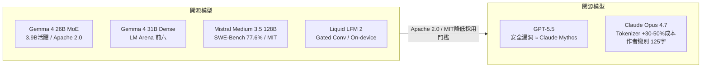
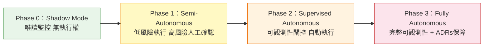

# AI Daily Digest — 2026-05-01

<!-- pipeline-generated:begin -->

## 🔥 今日 TOP 3
### 1. Cursor 工程師用 markdown skill 縮減 98% 代碼量
Cursor 工程師 David Gomes 展示了一個顛覆性的架構決策：原本需要 15,000+ 行程式碼實現的 worktrees 與 best-event 比較功能，透過利用現有的 agent skills 與 sub-agents 兩個原始 primitive 重新以 markdown skill 實作，最終代碼量壓縮至僅 200 行。新實作維護成本大幅降低，部分特性甚至優於舊版本。

這個案例揭示 AI agent 系統設計的核心原則：當你擁有足夠強大的 primitive（skills + sub-agents），複雜的 feature engineering 往往是不必要的抽象層。對 agent 框架設計者而言，這直接挑戰「用程式碼解決程式碼問題」的慣性思維——markdown 作為新型程式語言，在 agent 原生架構中可達到驚人的表達力與可維護性，且 git worktrees 讓多個 agents 可並行在隔離環境工作。

實務上，工程師在設計 agent 功能時應優先評估「現有 skill/sub-agent primitive 是否已足夠表達邏輯」，而非立刻訴諸傳統程式設計。衡量指標是維護負擔：若一個功能需要上千行代碼維護，可能代表架構層面存在 primitive 選擇錯誤，值得嘗試 markdown-first 的重構路徑。

📖 [閱讀完整 insight](../10-insights/2026-04-30/inbox_c5d660e2.md) · 🔗 [原文連結](https://www.youtube.com/watch?v=WE_Gnowy3uw)
### 2. PyTorch Lightning v2.6.2/2.6.3 供應鏈攻擊四通道竊密
2026 年 4 月 30 日，PyPI 上的 `lightning` 套件（PyTorch Lightning）v2.6.2 和 v2.6.3 被植入惡意代碼。攻擊者在 _runtime 目錄藏匿混淆 JavaScript 有效載荷，套件導入時自動執行，掃描 80+ 個憑證路徑竊取 GitHub tokens、雲密鑰、環境變數。同時採用四個並行洩漏渠道（HTTPS POST、GitHub commit 搜尋、公開 repo 上傳、受害者自身 repo 推送），確保滲透持續進行。此攻擊屬於 Mini Shai-Hulud 活動，Semgrep 已發布檢測規則。

此攻擊危險性在於雙重傳播設計：透過 npm 發佈 tokens 進行蠕蟲式擴散，一旦獲取 npm 認證即可污染受害者所有可發佈套件，形成指數級感染。這是 AI/ML 工具鏈首次出現如此精密的四通道竊密機制，可能影響數百個下游依賴套件。對 ML 工程師的衝擊尤為嚴重，因為 PyTorch Lightning 廣泛部署於訓練流程中，被污染環境往往擁有高權限雲端憑證。

立即行動：若環境中有 lightning==2.6.2 或 2.6.3，應立即撤銷所有相關 GitHub tokens 和雲密鑰，降版至 2.6.1 或升至已修復版本。未來應在 CI/CD 加入套件雜湊驗證（pip hash checking mode），並定期稽核 requirements.txt 中 ML 依賴的完整性。

📖 [閱讀完整 insight](../10-insights/2026-04-30/inbox_3f561b10.md) · 🔗 [原文連結](https://semgrep.dev/blog/2026/malicious-dependency-in-pytorch-lightning-used-for-ai-training/)
### 3. Mistral Medium 3.5 SWE-Bench 77.6%，同步推出 Remote Agents
Mistral AI 發布 Mistral Medium 3.5，128B 密集模型在 SWE-Bench Verified 達 77.6%，超越 Devstral 2 和參數規模更大的 Qwen 3.5 397B，τ³-Telecom agentic 評測達 91.4 分。256k context window，API 定價 $1.5/$7.5 per million tokens，自托管僅需 4 個 GPU，採用修改版 MIT 授權允許開放部署。同步推出 Vibe Remote Agents，支援雲端沙箱並行編碼任務、本地至雲端遷移保留上下文，以及明確的 approval checkpoint 機制。

這次發布的戰略意義有三：其一，77.6% SWE-Bench 結果使 Mistral 直接進入頂級編碼模型梯隊；其二，4 GPU 自托管門檻為企業提供低成本的高效能替代方案，相比 OpenAI 和 Anthropic 的閉源服務具有顯著成本優勢；其三，Vibe Remote Agents 的 approval checkpoint 設計回應業界對自主代理監管的關切，在 Codex/Claude Code 競爭格局中建立差異化。

下一步觀察重點：Vibe Remote Agents 的並行化能力是否能與 Claude Code git worktrees 和 Codex /goal 工作流形成實質差異化競爭。對預算有限的工程師，4 GPU 自托管組合值得在近期進行性能/成本評測，尤其是搭配 256k context 的長任務場景。

📖 [閱讀完整 insight](../10-insights/2026-04-29/inbox_572faa3c.md) · 🔗 [原文連結](https://mistral.ai/news/vibe-remote-agents-mistral-medium-3-5)

## 📚 分類摘要
### foundation_models
今日模型發布最受矚目的是 Gemma 4 系列（inbox_65540b43）與 Mistral Medium 3.5（inbox_572faa3c）。Gemma 4 引入首個 Gemma MoE 架構（26B 參數、3.9B 活躍參數）與 31B 密集版本，並將授權從商用許可改為 Apache 2.0，31B 和 26B 在 LM Arena 開源排名前六。NVIDIA 同步發布 Gemma 4 26B 的 NVFP4 量化版本（inbox_d6449005），僅 18.8GB，多數基準效能損失 <1%，AIME 2025 甚至提升 1.05%。Liquid AI 的 Maxime Labonne 深度分析小模型（350M-24B）設計原則（inbox_0b67d1fe），指出 Gemma 3 270M 有 63% 參數浪費在嵌入層（distillation 副產品），提出 memory-bound、低知識容量、延遲敏感三特性決定小模型需「原則性重新設計」而非縮減大模型。

OpenAI 方面，官方發布詳細分析報告（inbox_a0254934）揭示 GPT-5.1 發布後 goblin/gremlin 生物比喻激增 175% 的根本原因：「Nerdy」人格 RL 訓練系統提示詞無意中獎勵生物比喻，而該風格透過遷移學習跨越邊界蔓延。Nerdy 僅佔 ChatGPT 回應 2.5%，卻產生 66.7% 的 goblin 提及，為迄今最詳細的 RLHF 非預期行為根因分析案例。英國 AI 安全研究所評估（inbox_226d5ca1）顯示 GPT-5.5 在網路安全漏洞檢測上與 Claude Mythos 能力相當，且 GPT-5.5 已普遍可用，Mythos 仍在預覽階段，為企業選型提供量化基準。

Claude 方面出現多項值得關注的問題回報。資深用戶系統性分析 Opus 4.7 回歸（inbox_a8e8d01f）：新 tokenizer 在技術內容消耗 1.3-1.45 倍 tokens，相當於成本跳升 30-50%，且存在過度 meta-narration 與計劃多執行少的行為退化。Claude Code permissions.deny 被確認存在靜默失效漏洞（inbox_e49924b1），明確列出禁止項目仍可讀取機密，應改用 .claudeignore + secrets manager。Claude Opus 4.7 亦被驗證能從 125 字未發表文本精確識別作者身份（inbox_51640ffb），ChatGPT 和 Gemini 均無法做到，對網路匿名構成根本威脅。Claude Projects 出現對話持久化失效（inbox_c5889063），整天工作記錄消失且 Anthropic 支援未有效回應。

### agents
MCP 企業部署挑戰成為今日 agents 類別的核心主題。Anthropic 前線部署工程師 Karan Sampath（inbox_059b9e92）明確指出企業 MCP 部署三大阻礙：可觀測性黑箱、細粒度存取控制缺乏、安全合規隔離。MCP gateway 架構被視為統一解決方案，作為中央代理層集中實現日誌、RBAC、安全策略。WorkOS（inbox_8c1dc230）回應此痛點推出 MCP 統一 SSO，解決開發者跨多 server 重複 OAuth 確認的摩擦，已服務 Anthropic、Cursor、OpenAI。GitHub MCP 一週年反思（inbox_f92da4fa）揭示初期追求工具廣度（100+ 工具）導致 agent context 污染、效能下降，LangChain 研究論文佐證「更多工具 ≠ 更聰明的 agents」，問題癥結在工具數量直接佔用 context window。

代理架構設計本日出現多個重要框架。Cursor 工程師 David Gomes 展示（inbox_c5d660e2）用 markdown skill 將 15,000 行代碼縮至 200 行，驗證 agent skills + sub-agents 兩個 primitive 的驚人表達力。Tracy Bannon 的最小可行治理（MVG）框架（inbox_5c4561b5）提出三支柱：身份驗證、委託權限、ADRs，解決自主 agent 造成的「架構失憶症」問題。inbox_fa1855ef 梳理 AI agent 開發六年演變至「Harness 工程」新階段，強調 right-sizing（精準匹配模型與任務難度）而非盲目堆砌大模型，以及「如何約束 agent」重要性超越「擴大 agent 能力」。Codex 0.128.0（inbox_fb103347、inbox_fc820943）新增持久化 /goal 工作流，透過 continuation.md 與 budget_limit.md 提示注入實現目標驅動自動循環，支援 token 預算限制。

Kubernetes 上的 AI agent 安全（inbox_c39d3861）提出四個生產驗證模式：Job-based 隔離、Vault scoped 短期憑證、四階段信任模型（shadow → semi-autonomous → supervised → fully autonomous）、非確定性推理可觀測性。Cloudflare Agent Memory（inbox_b729b02e）進入私密測試，五通道並行檢索 + Reciprocal Rank Fusion 自動提取結構化記憶，支援 agent 團隊共享記憶，直接競爭 Mem0、Zep、LangMem、Letta，標誌 agent memory 已成為標準基礎設施層。（注：今日尚有 6 項 insights 待處理，未計入本摘要。）

### infra
今日基礎設施類別最緊迫的是 PyTorch Lightning 供應鏈攻擊（inbox_3f561b10）：v2.6.2 和 v2.6.3 被植入四通道並行竊密機制，掃描 80+ 憑證路徑，透過 npm token 進行蠕蟲式擴散。使用這兩個版本的 ML 工程師應立即撤銷 GitHub tokens 和雲密鑰，並確認 CI/CD 未暴露於受汙染版本，Semgrep 已發布對應的檢測規則。AWS CloudWatch 新增 OpenTelemetry Metrics 支援公開預覽（inbox_7a60db1d），允許直接透過 OTel 協議向 CloudWatch 發送 metrics 並與 AWS 原生 metrics 並列。AWS Interconnect GA（inbox_e86d7286）正式支援 Google Cloud 私有 Layer 3 連線，透過 Lumen 提供最後一哩，Azure/OCI 支援計劃 2026 年下半年上線，並在 GitHub 開放 Apache 2.0 規範，Forrester 視此為建立多雲連線事實標準的舉措。

Stripe DocDB 案例（inbox_6b512bc5）展示支撐 500 萬 QPS 和 99.99995%（5.5 nines）可靠性的架構方法，核心創新是自研的零停機數據移動平台，可在不中斷服務前提下執行水平分片、版本升級與多租戶遷移，保持全球支付交易的強一致性。Netflix 為全球直播建立「人類基礎設施」層（inbox_afabc4b8），採用低延遲遙測熱路徑搭配 Live Operations Centre，以自動化加人類專家監督的混合模式應對高並發事件，此策略與 AWS、Disney+ 一致正在成為大規模直播運營標準。

硬體與推理方面，16 節點 DGX Spark 叢集驗證報告（inbox_6d822f4c）顯示統一記憶體設計可在 TP=8 下推理 434GB GLM-5.1-NVFP4，並規劃 Prefill/Decode 分離架構：Spark 叢集負責高平行預填充，Mac Studios 負責解碼，200 Gbps 結構網路實測達規格。llama.cpp 現已支援 CUDA+ROCm 雙後端同時運行（inbox_3b452c7f），透過 -DGGML_BACKEND_DL=ON 可在單機同時調用兩套 GPU 生態，主要提升 prefill 速度。RTX 5080 16GB 測試（inbox_c0df3db3）顯示 Qwen3.6-35B-A3B MoE 通過專家卸載至系統 RAM，在 128K 上下文下達 30 tok/s，比同規格密集模型快 10 倍，且代碼品質通過實測驗證優於密集版本。

## 🎯 專欄
### 🛠 Claude Code / Codex 新功能
- **[v2.1.126](../10-insights/2026-05-01/inbox_2c07f449.md)**
  Claude Code v2.1.126 更新發佈，針對開發者工作流程進行多項改進。核心功能包括：(1) /model 選擇器現支援 Anthropic 相容網關，可列出網關 /v1/models 端點的模型；(2) 新增 `claude project purge [path]` 指令用於刪除專案所有 Claude Code 狀態（含 transcript
- **[rust-v0.129.0-alpha.2](../10-insights/2026-05-01/inbox_b75ea8fa.md)**
  OpenAI Codex Rust 版本發佈 0.129.0-alpha.2。此為 alpha 版本發佈，表示功能仍在測試階段。注：提供的發佈說明極其簡略，僅包含版本號與 alpha 標記，未提供具體功能更新、改進內容或已知問題。
- **[0.129.0-alpha.1](../10-insights/2026-04-30/inbox_28998a1d.md)**
  OpenAI Codex 0.129.0-alpha.1 發布。此版本為 alpha 預覽版，具體功能尚未公開披露。
- **[0.128.0](../10-insights/2026-04-30/inbox_fc820943.md)**
  OpenAI Codex 0.128.0 發布重大更新，涵蓋持久化工作流、UI 與權限系統改進、插件生態強化。核心新增持久化 `/goal` 工作流，支援 app-server API、模型工具、runtime 延續，TUI 提供 create/pause/resume/clear 操作；配置自訂快鍵映射、plan-mode 提示、狀態欄編輯。權限系統新增內
- **[0.128.0-alpha.1](../10-insights/2026-04-30/inbox_99e500cc.md)**
  OpenAI Codex 0.128.0-alpha.1 發布。此版本為 alpha 預覽版，具體功能尚未公開披露。
### 📚 AI 知識管理
- **[Dropbox Redesigns Compaction to Reclaim Space from Underfilled Storage Volumes](../10-insights/2026-04-30/inbox_8859abbf.md)**
  Dropbox 重新設計 Magic Pocket（內部不可變 blob 存儲）的 compaction 策略以提升存儲效率，通過定期重組有效數據至新卷，允許舊卷被清除與重用。
- **[Article: The DPoP Storage Paradox: Why Browser-Based Proof-of-Possession Remains an Unsolved Problem](../10-insights/2026-04-30/inbox_c7b798e9.md)**
  DPoP(Demonstrating Proof-of-Possession)在 OAuth 2.0 中實現發送者約束令牌，相比 bearer token 更安全。但 RFC 9449 對瀏覽器密鑰存儲的沈默導致各團隊需面對架構決策難題——目前不存在通用的安全預設方案。
- **[Dropbox Redesigns Compaction to Reclaim Space from Underfilled Storage Volumes](../10-insights/2026-04-30/inbox_a9d42d0f.md)**
  Dropbox 分享如何透過重新設計壓縮策略改善 Magic Pocket（內部不可變 blob 儲存系統）的儲存效率。新方案定期將有效資料重組至新卷，釋放嚴重未充分利用的舊卷進行清除與重利用。此優化針對大規模儲存系統常見的碎片化問題，通過主動資料遷移而非被動清理來回收空間。實現方法涉及卷層級的資料重組與生命週期管理。此技巧適用於任何需要空間回收的多卷儲存架
- **[Article: The DPoP Storage Paradox: Why Browser-Based Proof-of-Possession Remains an Unsolved Problem](../10-insights/2026-04-30/inbox_bf7a4f45.md)**
  RFC 9449 中的 DPoP（Demonstration of Proof-of-Possession）雖然相比無狀態 bearer token 是有意義的升級，但在瀏覽器金鑰儲存方面存在架構決策真空。RFC 對金鑰儲存的沉默導致每個團隊必須主動評估與選擇方案——不存在一個處處適用的安全預設值。文章指出 DPoP 確實解決了 OAuth 2.0 中的真實
- **[Everything I Learned Training Frontier Small Models — Maxime Labonne, Liquid AI](../10-insights/2026-04-29/inbox_0b67d1fe.md)**
  Liquid AI 預訓練負責人 Maxime Labonne 深度剖析邊界小模型（350M–24B 參數）的訓練原則。小模型與大模型本質不同：(1) 記憶受限（hardware 邊界），(2) 知識容量低故需 task-specific 優化而非通用 chatbot，(3) 延遲敏感需極速推理。具體案例：Gemma 3 270M embedding 佔 6
### 🏢 企業導入 AI / 團隊實踐
- **[v2.1.126](../10-insights/2026-05-01/inbox_2c07f449.md)**
  Claude Code v2.1.126 更新發佈，針對開發者工作流程進行多項改進。核心功能包括：(1) /model 選擇器現支援 Anthropic 相容網關，可列出網關 /v1/models 端點的模型；(2) 新增 `claude project purge [path]` 指令用於刪除專案所有 Claude Code 狀態（含 transcript
- **[Introducing Advanced Account Security](../10-insights/2026-04-30/inbox_b25d3641.md)**
  OpenAI 宣佈推出進階帳戶安全功能。包含三項核心措施：(1) 抗釣魚登入機制，提高登入安全性；(2) 更強大的帳戶復原選項，減少帳戶被鎖定風險；(3) 增強的帳戶接管防護。目標是保護使用者敏感資料並防止未授權存取。注：提供的內容較簡略，未包含具體技術實作細節或部署時程。
- **[Cybersecurity in the Intelligence Age](../10-insights/2026-04-29/inbox_58463145.md)**
  OpenAI 發佈《智慧時代網路安全行動計畫》，提出五步驟框架強化 AI 時代的防禦能力。主要策略：(1) 民主化 AI 驅動的網路防禦能力，降低企業採納門檻；(2) 透過 AI 保護關鍵基礎設施，防範日益複雜的網路威脅；(3) 構建産業性合作機制，將防禦能力從頂級機構推廣至中小企業。此舉措體現 OpenAI 對於 AI 成為防禦工具的重視，以及在 AGI 
- **[0.128.0](../10-insights/2026-04-30/inbox_fc820943.md)**
  OpenAI Codex 0.128.0 發布重大更新，涵蓋持久化工作流、UI 與權限系統改進、插件生態強化。核心新增持久化 `/goal` 工作流，支援 app-server API、模型工具、runtime 延續，TUI 提供 create/pause/resume/clear 操作；配置自訂快鍵映射、plan-mode 提示、狀態欄編輯。權限系統新增內
- **[Enabling a new model for healthcare with AI co-clinician](../10-insights/2026-04-30/inbox_aabd2aab.md)**
  DeepMind 公佈 AI co-clinician 研究計畫，探索 AI 增強臨床護理的路徑。該系統旨在與臨床醫生協作，輔助患者診療決策。研究聚焦於如何將 AI 能力整合入醫療工作流，實現醫人共智的臨床模式。
### 🎓 AI 使用技巧 / 心法
- **[AI evals are becoming the new compute bottleneck](../10-insights/2026-04-29/inbox_a6ff398c.md)**
  Hugging Face 提出「AI 評估正成為新的計算瓶頸」的觀點。
- **[Granite 4.1 LLMs: How They’re Built](../10-insights/2026-04-29/inbox_88cf562f.md)**
  Hugging Face 發佈 IBM Granite 4.1 LLM 系列的構建方法介紹。
- **[Our evaluation of OpenAI&#39;s GPT-5.5 cyber capabilities](../10-insights/2026-04-30/inbox_226d5ca1.md)**
  英國 AI 安全研究所發布對 OpenAI GPT-5.5 網路安全能力的評估報告，對標先前評估的 Claude Mythos。測試結果顯示 GPT-5.5 在尋找安全漏洞方面與 Mythos 能力相當，但 GPT-5.5 目前已公開可用，Mythos 仍在預覽階段。這項評估為企業選擇部署模型提供了量化的安全基準對比。
- **[LLM 0.32a0  is a major backwards-compatible refactor](../10-insights/2026-04-29/inbox_46bae44c.md)**
  Simon Willison 發佈 LLM 0.32a0 alpha 版，進行向後相容的重大重構。LLM Python 庫原本的「文本輸入→文本輸出」模型已無法表現當代 LLM 的多模態能力（圖像、音頻、影片輸入、結構化 JSON 輸出、工具調用）。新版本引入兩項核心改變：(1) 輸入改為訊息序列（messages array），使用 llm.user()/
- **[Vercel Releases Open Agents to Support Background AI Coding Workflows](../10-insights/2026-04-30/inbox_e8f96fea.md)**
  Vercel 推出 Open Agents 開源應用，允許開發者建立和執行後台編碼 agent，提供完整技術堆棧讓開發者無需依賴本地機器即可運行獨立編碼工作流，賦能 AI 驅動的開發自動化。
### 💳 支付 / Fintech
- **[Presentation: Stripe’s Docdb: How Zero-Downtime Data Movement Powers Trillion-Dollar Payment Processing](../10-insights/2026-04-30/inbox_708db2d8.md)**
  Stripe 發表 DocDB 數據庫架構演進案例，支持 5 百萬 QPS、5.5 個 9 的可靠性，採用零停機數據遷移平台實現水平分片、版本升級和多租戶遷移。
- **[Presentation: Stripe’s Docdb: How Zero-Downtime Data Movement Powers Trillion-Dollar Payment Processing](../10-insights/2026-04-30/inbox_6b512bc5.md)**
  Stripe 展示 DocDB 數據庫架構如何支撐其支付系統達到 5 百萬 QPS 和 5.5 nines（99.999%）可靠性。關鍵創新是自研的零停機時間數據移動平台，可在完全不中斷服務的前提下執行水平分片、版本升級和多租戶遷移，確保全球商務交易的嚴格一致性保證。
- **[Presentation: Stripe’s Docdb: How Zero-Downtime Data Movement Powers Trillion-Dollar Payment Processing](../10-insights/2026-04-30/inbox_e6062dae.md)**
  Stripe 在 QPS 分享中呈現 DocDB 資料庫層架構與零停機資料遷移平台，支援 500 萬 QPS 與 5.5 個九（99.99995%）的可靠性。系統採用自訂零停機遷移工具進行水平分片、版本升級與多租戶遷移，同時保持全球商務交易所需的強一致性。此架構模式展示了如何在不中斷服務前提下進行基礎設施演進。核心創新在於資料遷移過程的可靠性設計，確保高頻率
- **[Why building eval platforms is hard — Phil Hetzel, Braintrust](../10-insights/2026-04-28/inbox_287e02cc.md)**
  Braintrust 方案工程負責人 Phil Hetzel 揭示 eval platform 構建難點。Braintrust 定位為 agent quality platform，建立在兩大支柱：(1) Eval：production 前的實驗與信心累積，(2) Observability：production 後持續監控與信心維持。核心洞察：LM 的極高
- **[What we learned scaling MCPs to Enterprise — Karan Sampath, Anthropic](../10-insights/2026-04-27/inbox_059b9e92.md)**
  Anthropic 前線佈署工程師 Karan Sampath 分析 MCPs 在企業環境面臨的三大核心挑戰及網關解決方案。企業客戶反覆提出三個「表面看似簡單但實際複雜」的需求：(1) 可觀測性——誰在用哪些 MCP、哪些工具運行狀況？；(2) 存取控制——如何確保特定用戶/角色只能存取指定 servers 與工具？；(3) 安全——如何防護敏感資料與未授權
### ⛓️ 區塊鏈 / Web3
- **[rust-v0.129.0-alpha.2](../10-insights/2026-05-01/inbox_b75ea8fa.md)**
  OpenAI Codex Rust 版本發佈 0.129.0-alpha.2。此為 alpha 版本發佈，表示功能仍在測試階段。注：提供的發佈說明極其簡略，僅包含版本號與 alpha 標記，未提供具體功能更新、改進內容或已知問題。
- **[0.129.0-alpha.1](../10-insights/2026-04-30/inbox_28998a1d.md)**
  OpenAI Codex 0.129.0-alpha.1 發布。此版本為 alpha 預覽版，具體功能尚未公開披露。
- **[0.128.0](../10-insights/2026-04-30/inbox_fc820943.md)**
  OpenAI Codex 0.128.0 發布重大更新，涵蓋持久化工作流、UI 與權限系統改進、插件生態強化。核心新增持久化 `/goal` 工作流，支援 app-server API、模型工具、runtime 延續，TUI 提供 create/pause/resume/clear 操作；配置自訂快鍵映射、plan-mode 提示、狀態欄編輯。權限系統新增內
- **[0.128.0-alpha.1](../10-insights/2026-04-30/inbox_99e500cc.md)**
  OpenAI Codex 0.128.0-alpha.1 發布。此版本為 alpha 預覽版，具體功能尚未公開披露。
- **[rust-v0.127.0](../10-insights/2026-04-30/inbox_cea33948.md)**
  OpenAI Codex 0.127.0 發布。此版本具體功能尚未公開披露。
### 📒 帳務架構 / Ledger
- **[Claude Code usage spike from long-context cache writes?](../10-insights/2026-05-01/inbox_8e64b793.md)**
  Claude Code Pro 使用者超出 5 小時額度後檢查用量日誌，發現長上下文會話（>150k token）與 1 小時 prompt cache 的成本權重異常。約 140M cache-read tokens 中，多個最終請求各建立 475k token 的 1 小時 cache。按公開 API 定價，此類 cache write 成本應有限，但在
### 🔐 AI 安全 / 濫用
- **[Introducing Advanced Account Security](../10-insights/2026-04-30/inbox_b25d3641.md)**
  OpenAI 宣佈推出進階帳戶安全功能。包含三項核心措施：(1) 抗釣魚登入機制，提高登入安全性；(2) 更強大的帳戶復原選項，減少帳戶被鎖定風險；(3) 增強的帳戶接管防護。目標是保護使用者敏感資料並防止未授權存取。注：提供的內容較簡略，未包含具體技術實作細節或部署時程。
- **[Cybersecurity in the Intelligence Age](../10-insights/2026-04-29/inbox_58463145.md)**
  OpenAI 發佈《智慧時代網路安全行動計畫》，提出五步驟框架強化 AI 時代的防禦能力。主要策略：(1) 民主化 AI 驅動的網路防禦能力，降低企業採納門檻；(2) 透過 AI 保護關鍵基礎設施，防範日益複雜的網路威脅；(3) 構建産業性合作機制，將防禦能力從頂級機構推廣至中小企業。此舉措體現 OpenAI 對於 AI 成為防禦工具的重視，以及在 AGI 

## 💡 今日 Takeaway

_讀完今日所有內容後，可帶走的知識點_
### 1. MCP 工具越多不等於越聰明：超量工具污染 context 反降效能
GitHub 初期為 MCP server 新增 100+ 工具以填補功能空缺，數週後 agent 效能反而下降、context window 快速崩塌。LangChain 研究論文已確認此現象：工具數量本身就是 context 負擔，與工具功能無關。在設計 MCP server 時，應主動在「功能完整性」與「context 效率」之間取得平衡，而非預設「功能越多越好」。實務指引是定期審視工具清單，將低頻工具移至獨立 server 或改為按需載入。

_類型：pattern_

**參考來源**：
- [Lessons from Scaling GitHub&#39;s Remote MCP Server — Sam Morrow, GitHub](../10-insights/2026-04-27/inbox_f92da4fa.md) · [原文](https://www.youtube.com/watch?v=0n3MKk7r60w)
### 2. Agent skills + sub-agents 兩個 primitive 可取代萬行代碼的 feature 工程
Cursor 工程師將 15,000+ 行代碼重構為 200 行 markdown skill，驗證了在 agent 原生系統中，skills 與 sub-agents 這兩個 primitive 具備驚人的表達力。這個原則的實踐含義是：在為 agent 設計新功能前，應先評估「現有 primitive 是否已足夠表達這個邏輯」；用 markdown/skill 替代傳統程式碼能大幅降低維護負擔，且新實作往往因貼近 agent 執行模式而達到更佳效果。高維護成本的 feature 是重新架構為 skill 的強烈信號。

_類型：framework_

**參考來源**：
- [Replacing 12K LoC with a 200 LoC Skill — David Gomes, Cursor](../10-insights/2026-04-30/inbox_c5d660e2.md) · [原文](https://www.youtube.com/watch?v=WE_Gnowy3uw)
### 3. RLHF 微細獎勵偏差可跨訓練階段蔓延，風格遷移超越人格邊界
GPT-5.1 的 goblin 輸出案例揭示一個重要的對齊風險：「Nerdy」人格訓練的 RL 獎勵信號無意中激勵生物比喻，該風格透過遷移學習擴散至所有輸出，即使在無 Nerdy 提示詞的情境下也持續出現。Nerdy 僅佔流量 2.5%，卻產生 66.7% 的相關輸出，代表 RLHF 中細粒度人格訓練若存在獎勵偏差，其影響將超越條件邊界形成自強化迴圈。在設計多人格或個性化 RL 訓練時，需針對跨邊界行為蔓延進行獨立審計，並在不同提示條件下交叉驗證風格分佈。

_類型：pattern_

**參考來源**：
- [Where the goblins came from](../10-insights/2026-04-30/inbox_a0254934.md) · [原文](https://openai.com/index/where-the-goblins-came-from/)
- [Where the goblins came from](../10-insights/2026-04-29/inbox_40997f49.md) · [原文](https://openai.com/index/where-the-goblins-came-from)
### 4. Claude Code permissions.deny 靜默失效，機密保護不可依賴此功能
實測確認即使在 permissions.deny 明確列出禁止項目，Claude Code 仍能讀取被標記為禁止的機密，根本原因是已知的靜默失效 bug。任何依賴此機制保護 API 金鑰、資料庫認證等敏感資料的部署都存在安全缺口。替代方案是使用 .claudeignore 搭配專業 secrets manager，設置時間約 10 分鐘，安全性更可靠。此案例也提醒：依賴安全功能前應先主動測試其有效性，而非假設「設定即生效」。

_類型：data-point_

**參考來源**：
- [We Told Claude Code to Deny Access to Our Secrets. It Read Them Anyway.](../10-insights/2026-05-01/inbox_e49924b1.md) · [原文](https://medium.com/@pankaj_pandey/we-told-claude-code-to-deny-access-to-our-secrets-it-read-them-anyway-e59940c73eb9?source=rss------claude-5)
### 5. 小模型 ≠ 大模型縮小版：三特性要求原則性重新架構
350M-24B 小模型具備三個根本不同的特性：memory-bound（硬體邊界約束）、低知識容量（需 task-specific 而非通用 chatbot 設計）、延遲敏感（需極速推理）。Gemma 3 270M 的案例顯示 distillation 副產品導致 63% 參數浪費在嵌入層，有效知識參數僅 37%，提示架構優化空間巨大。評估小模型應以 on-device profiling（真實硬體）為準，而非理論分析；優先考慮 gated short convolution 等 latency-first 架構，而非直接移植大模型的 sliding window attention 設計。

_類型：pattern_

**參考來源**：
- [Everything I Learned Training Frontier Small Models — Maxime Labonne, Liquid AI](../10-insights/2026-04-29/inbox_0b67d1fe.md) · [原文](https://www.youtube.com/watch?v=fLUtUkqYHnQ)
## ⏳ 待處理 (6 筆)

<!-- pipeline-generated:end -->

<!-- user-notes -->
<!-- Write your own notes below; pipeline never touches this section. -->