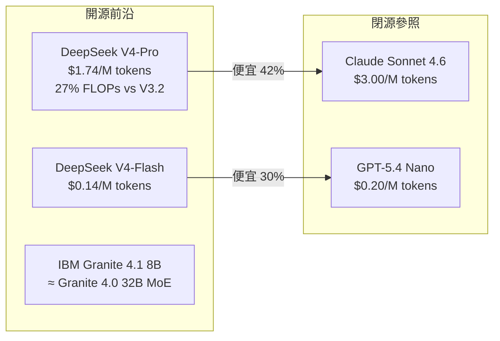

# AI Daily Digest — 2026-05-03

<!-- pipeline-generated:begin -->

## 🔥 今日 TOP 3
### 1. DeepSeek V4 開源，定價全面低於 Claude 及 GPT 閉源競品
DeepSeek 今日發布 V4-Pro（1.6T 參數 / 49B active）與 V4-Flash（284B / 13B active），均 MIT 授權、支援 100 萬 token 上下文；V4-Pro 超越 Kimi K2.6 成為目前規模最大的開源權重模型，V4-Flash 支援消費級 GPU 量化本地運行。

V4-Flash $0.14/M tokens 低於 GPT-5.4 Nano 的 $0.20，V4-Pro $1.74/M 比 Claude Sonnet 4.6 的 $3 便宜 42%；效率面 V4-Pro 僅需前代 V3.2 的 27% FLOPs 達相近性能，是開源前沿模型首次在每百萬 token 成本上全面低於主流閉源競品，對 API 費用敏感的中小型 AI 應用構成直接替換壓力。

下週觀察重點是 V4-Flash INT4 量化版的工具調用成功率與本地吞吐量；可從 batch inference 和非關鍵推理路徑先行替換，監控工具調用準確率後再逐步擴大比例。

📖 [閱讀完整 insight](../10-insights/2026-05-01/inbox_e0f2b793.md) · 🔗 [原文連結](https://simonwillison.net/2026/Apr/24/deepseek-v4/)
### 2. 單卡 RTX 3090 深度研究達 95.7%，工具調用能力超越模型大小
開源項目 Local Deep Research 以 Qwen3.6-27B + agentic search（Ollama + LangChain create_agent()、平行子主題分解、最多 50 次迭代），在單張 RTX 3090 上達成 95.7% SimpleQA 準確率，媲美商業方案 Perplexity Deep Research（93.9%），並內建 AES-256 加密與零遙測設計保護企業隱私。

27B 與同系列 9B（91.2%）的 4.5% 差距主要來自多輪工具調用穩定性與並行搜尋能力，而非參數量；這意味著 agent 場景應以工具調用可靠性為首要模型評估指標，而非 MMLU 等傳統 benchmark。對隱私敏感企業，這是第一個有明確基準支撐的商業水準本地深度研究方案。

立即可複現：以 Ollama + LangChain create_agent() 在一張 24GB 顯卡上部署；下一步追蹤 DeepSeek V4-Flash 量化版接入同框架的性能，驗證 tool-calling 優先選型原則是否跨模型系列成立。

📖 [閱讀完整 insight](../10-insights/2026-05-02/inbox_d647a0d3.md) · 🔗 [原文連結](https://www.reddit.com/r/LocalLLaMA/comments/1t1n6o8/we_are_finally_there_qwen3627b_agentic_search_957/)
### 3. AI 系統 7 層架構：LLM 只是第 4 層，工程層才是失敗根源
一篇系統性論述梳理 AI 產品的 7 層結構（數據攝取→解析→上下文組裝→LLM 推理→行動執行→記憶管理→治理），LLM 推理只佔第 4 層；Stanford 研究、Microsoft AutoGen 失敗案例、Anthropic 研究均一致指出上下文品質、工具可靠性、編排邏輯才是系統失敗主因。

這直接挑戰「換更好的模型就能解決問題」的產品直覺：多數 AI 產品失敗源於上下文缺失、工具靜默失敗、缺乏審計日誌等工程問題，而非模型能力不足，大多數開發團隊卻反覆將資源投入模型升級而非基礎設施。

立即行動：對現有 AI 系統做 7 層審計，確認 Memory/Retrieval/Tool orchestration/Logging/Evaluation 是否完整；資源分配遵循「Systems > prompts」原則，調整提示詞或換模型前先修復上下文管道品質。

📖 [閱讀完整 insight](../10-insights/2026-05-03/inbox_eaa7615c.md) · 🔗 [原文連結](https://gunjanvi.medium.com/ai-first-engineering-part-1-a8994625dc5f?source=rss------large_language_models-5)

## 📚 分類摘要
### foundation_models
DeepSeek V4-Pro（1.6T 參數 / 49B active）與 V4-Flash（284B / 13B active）今日重塑競爭格局：V4-Pro 超越 Kimi K2.6 成為最大開源權重模型，V4-Flash $0.14/M tokens 低於 GPT-5.4 Nano、V4-Pro $1.74/M 遠低於 Claude Sonnet 4.6 的 $3，兩款模型均 MIT 授權與 100 萬 token 上下文，V4-Pro 僅需前代 V3.2 的 27% FLOPs。IBM 同日發布 Granite 4.1 家族（3B/8B/30B），8B 密集模型在指令遵循與工具調用上匹配 Granite 4.0 32B MoE 性能，採 15 兆 token 多階段訓練、512K context、無長推理鏈，定位企業低延遲工作負載，與 Gemma 4 和 Qwen3 系列正面競爭。

Berkeley 研究者 Tom van Nuenen 對 300 篇個人敘述的跨模型測試（inbox_59fae9ff）揭示系統性散文漂移：Claude、ChatGPT、Gemini 在「改進」「重寫」「保留聲音」三種 prompt 下，均向縮減縮寫詞、減少第一人稱代詞、詞彙更正式的方向漂移，13 個 stylometric marker 無一例外，「保留聲音」prompt 只能減少幅度而無法改變方向。聲音控制需架構層支持：風格配置檔應編譯為生成時的硬性約束，而非可覆蓋的 prompt 參數，此發現直接影響 Sudowrite、NovelCrafter 等長篇創意工具設計。RL 調優方面，DAPO→GSPO→GEPO→CISPO 演進路線清晰，核心競爭在「比值項」從標記級升至序列級視角；Tokenization 的 Rust 實現（tiktoken、HuggingFace Fast Tokenizers）比 Python 快 10–100 倍，不當設計直接影響稀有詞理解與跨語言部署成本。（本日尚有 6 則 insights 待處理。）
### agents
今日 agent 議題的核心框架來自 7 層架構論述（inbox_eaa7615c）：LLM 推理僅佔第 4 層，Stanford/Microsoft AutoGen/Anthropic 三家研究均一致指向其他 6 層工程問題才是 AI 產品失敗主因，「換模型」思維是對資源的系統性錯配。ClawRunr（inbox_c906e459、inbox_2e5304f1）作為 Java AI agent 框架，採 MCP 工具標準、支援 Web/Telegram/Discord 多通道觸發，以 JobRunr 提供排程與重試，適合本地隱私敏感場景；Ghost agent-first Postgres 平台（inbox_ebf6cbaa）內建 MCP server 讓 Claude Code/Codex/Cursor 直接管理資料庫生命週期，將資料庫定位為可拋棄代理沙箱。

多 Agent 系統的多樣性崩潰問題（inbox_f95409f1）獲深度分析：共享背景、相互反饋循環、模型架構相似性三大機制驅使多個 Agent 趨向同一答案；Vendi 分數（1=完全相同，N=完全獨立）可量化實際多樣性，低值代表「印證幻覺」而非真正共識，防止方案包括採異構 LLM 架構、隔離推理階段、將 Vendi 分數納入評估管線。SKILL.md 的浮現（inbox_f0db4487）標誌 coding agent 競爭焦點從「模型大小競賽」轉向「技能架構組織」；Perplexity MCP 整合（inbox_6035c8bd）展示反向工程開放平台 API 作為 MCP 工具擴展的可行路徑。
### infra
Confluent 為 Apache Kafka 引入 Schema ID 從 payload 移至 record headers 的新機制（inbox_711e80bf）：深度整合 Schema Registry、跨 Avro/Protobuf/JSON Schema 統一版本管理，減輕訊息體積並解耦資料與元數據。DuckDB Labs 同日發布 DuckLake 1.0（inbox_b67072e6）：以 SQL 資料庫集中儲存 Data Lake 表元數據，取代傳統方案分散於物件儲存的小文件模式，相容 Iceberg 特性且以 DuckDB extension 形式開箱即用，對元數據查詢密集工作負載有直接性能提升。

pip 26.1（inbox_54d5ceff）六項重要變更：終止 Python 3.9 支援、實驗性 PEP 751 pylock.toml 鎖檔（當前限制：無法選 extras、VCS 路徑混用受限）、新增 --uploaded-prior-to 供應鏈安全旗標（建議搭配 pip-audit）、修復 CVE-2026-3219（tar.gz/ZIP 誤識別）與 CVE-2026-6357（自我更新漏洞）。現有生產環境應評估 Python 版本合規性並規劃 pylock.toml 導入時機。

Qwen3.6-27B vs Gemma4-31B 長期並行測試（inbox_82cf47ce）揭示官方基準與實務落差：Gemma 在歐美任務、細粒度視覺、指令遵循更優，但 vLLM 視覺 token budget 若維持預設 280（推薦 1120+）會造成性能誤判；Qwen 在視頻追蹤和亞洲文化內容具優勢。RTX 6000 vs Asus Ascent GX10 叢集基準（inbox_492d4475）顯示高端單機 Token 生成快 4.88 倍但成本高 2.9 倍，低端叢集與高端單機能耗成本相當，適合成本受限場景。

## 🎯 專欄
### 🛠 Claude Code / Codex 新功能
- **[Sightings](../10-insights/2026-05-02/inbox_7c638d2d.md)**
  Simon Willison 購置新的 Canon R6 Mark II 相機，開始拍攝大量野生動物照片並分享到 iNaturalist。為了整合這些照片到個人部落格，他在露營時用手機通過 Claude Code for web 開發了一個新功能。該功能將 iNaturalist 上超過十年的觀察數據（跨兩個帳戶）回溯整合到部落格中。整合後，這些生物觀察可以
- **[iNaturalist Sightings](../10-insights/2026-05-01/inbox_e692cad3.md)**
  Simon Willison 在露營時完全用手機和 Claude Code for web 開發了 iNaturalist Sightings 工具。架構包括三層：Python CLI（inaturalist-clumper）將觀察按時間（2 小時）和地理位置（5km）聚類；Git scraping 自動化定期執行工具並將結果提交到 GitHub clump
- **[Ghost: A Database for Our Times?](../10-insights/2026-05-01/inbox_ebf6cbaa.md)**
  Ghost（ghost.build）推出「為 AI 代理設計的第一個資料庫」—— 基於 Postgres 的 agent-first 平台。不同於傳統長期生產資料庫設計，Ghost 將資料庫視為可拋棄資源，支援即時創建、fork、檢查、查詢、操縱和刪除整個資料庫，工作流更接近現代 agentic 開發。支援的代理包括 Claude Code、Codex、Cu
- **[I Tested the “Free Claude Code with Local Models” — Here’s What Really Happens](../10-insights/2026-05-03/inbox_2016c218.md)**
  文章測試了在本地模型上運行 Claude Code 的可行性。由於無法存取完整內容，無法提供詳細分析。
- **[SKILL.md and the Quiet Reshaping of Coding Agents](../10-insights/2026-05-02/inbox_f0db4487.md)**
  根據文章標題與摘要，作者指出過去兩年 AI 編程的敘事核心是模型規模（context window 擴大、能力強化），但 SKILL.md 的出現標誌著編程代理設計範式的根本轉變。文章暗示未來競爭點不再是『誰的模型更大』，而是『如何更好地組織和編排技能（skill）』，這反映了 Claude Code 及類似工具從「規模競賽」向「架構創新」的轉向。該觀點挑戰
### 📚 AI 知識管理
- **[I Gave an AI Agent the Keys to My Life (Here&#39;s What Happened) — Radek Sienkiewicz, Velvet Shark](../10-insights/2026-05-02/inbox_05b38ebd.md)**
  Radek Sienkiewicz（OpenClaw 維護者）分享如何逐步將 OpenClaw AI agent 整合進生活：代理可訪問郵件、筆記、日程表、操作系統、3000+ 頁 Obsidian 知識庫。通過五大類自動化工作流（ambient operations、attention filtering、draft synthesis、execution
- **[Churn Without Fragmentation: How a Party-Label Bug Reversed My Headline Finding](../10-insights/2026-05-01/inbox_82a6eb9a.md)**
  英國 2018–2022 年地方議會研究發現：易變性翻倍（中位數 12.0 → 22.5），但黨派制度未碎片化，此差異來自分類規範化錯誤。初版誤將「Labour Party」和「Labour and Co-operative Party」視為獨立政黨，虛增碎片化指數；修正後在 67 個可比當局中，只有 18 個見證黨派增加（非初版的 66 個）。核心教訓：原
- **[How AI Agents Remember: Building Persistent Memory Systems with Lessons from OpenClaw](../10-insights/2026-05-02/inbox_491e789a.md)**
  本文探討如何為 AI agents 構建持久化記憶系統，使其具備跨會話的狀態性和連貫性。通過 OpenClaw 項目的經驗教訓，說明記憶機制的關鍵要素：用户偏好記憶、會話歷史管理、長期狀態維護。完善的記憶系統使 agents 能在多輪互動中保留上下文、回憶過往、適應個性化需求，是構建真正可用智能助手的必要條件。
- **[Hybrid on-device inference on Android: llama.cpp + LiteRT + NPU/GPU routing](../10-insights/2026-05-02/inbox_1fa4ea97.md)**
  開源項目 Box 是 Google AI Edge Gallery 的分支，實現完全離線 Android 端側 AI 助手。整合 llama.cpp（LLM 推理）、whisper.cpp（語音識別）、stable-diffusion.cpp（圖像生成）與 LiteRT，支持 GPU/NPU/TPU 硬體加速。核心發現包括：LiteRT + llama.cp
- **[How Do You Use Obsidian/Second Brain With Claude?](../10-insights/2026-05-02/inbox_d6c116c5.md)**
  社群使用者發起開放式提問：如何在創業或其他應用中結合 Obsidian/Second Brain 與 Claude。提問者分享自己的做法（梳理思想、檢索遺忘的事實、發現遺漏的連接），但並未提供具體工作流、案例或系統性框架。此為純粹的社群提問，缺乏新聞事件或實證內容。
### 🏢 企業導入 AI / 團隊實踐
- **[JobRunr Introduces ClawRunr, an Open-Source Java AI Agent](../10-insights/2026-05-01/inbox_c906e459.md)**
  JobRunr 開源發布 ClawRunr，一個新的 Java AI agent 框架，前身是 JavaClaw。ClawRunr 在用戶硬件上執行各類背景任務，包括定期任務、週期性任務和一次性任務。框架支援多種通信方式：web UI、Telegram Bot、Discord Bot。整合 MCP 工具和瀏覽器自動化，支持複雜的對話交互和任務自動化。依賴 J
- **[Confluent Moves Schema IDs to Kafka Headers to Simplify Schema Governance](../10-insights/2026-05-01/inbox_711e80bf.md)**
  Confluent 在 Apache Kafka 中推出新機制，將 schema ID 從 message payload 移至 record headers。此變更與 Schema Registry 整合，改進跨序列化格式的相容性，並減少事件驅動架構中資料與元數據的耦合。新設計簡化 schema governance 和版本演進管理，讓資料結構變更不再影響
- **[DuckLake 1.0: Data Lake Format with SQL Catalog Metadata](../10-insights/2026-05-02/inbox_b67072e6.md)**
  DuckDB Labs 發布 DuckLake 1.0 資料湖格式，與傳統方案不同，將表元數據存儲在 SQL 資料庫中而非分散於對象存儲的多個文件。首個實現形式為 DuckDB extension，內置 catalog-stored 小粒度更新、改進排序和分區選項，並相容 Iceberg 風格的資料特性。該設計改善了元數據管理效率和查詢性能。
- **[DuckLake 1.0: Data Lake Format with SQL Catalog Metadata](../10-insights/2026-05-02/inbox_e0a32a89.md)**
  DuckDB Labs 發布 DuckLake 1.0 資料湖格式，與傳統方案不同，將表元數據存儲在 SQL 資料庫中而非分散於對象存儲的多個文件。首個實現形式為 DuckDB extension，內置 catalog-stored 小粒度更新、改進排序和分區選項，並相容 Iceberg 風格的資料特性。該設計改善了元數據管理效率和查詢性能。
- **[JobRunr Introduces ClawRunr, an Open-Source Java AI Agent](../10-insights/2026-05-01/inbox_2e5304f1.md)**
  JobRunr 推出 ClawRunr（原名 JavaClaw），開源 Java AI agent 框架用於排程化、週期性和一次性後台任務。ClawRunr 執行在用戶硬體上，整合會話交互、持久化任務執行、MCP 工具與瀏覽器自動化能力，支援 Web、Telegram 與 Discord 多通道觸發。底層使用 JobRunr 管理排程、重試邏輯和監控，實現生
### 🎓 AI 使用技巧 / 心法
- **[Which Regularizer Should You Actually Use? Lessons from 134,400 Simulations](../10-insights/2026-05-02/inbox_216e56ea.md)**
  Towards Data Science 文章基於 134,400 次模擬，橫跨 960 個參數組合比較 Ridge、Lasso、ElasticNet、Post-Lasso OLS 四種正則化方法。主要發現：(1) 預測精度相近（中位誤差差 ≤0.3%），但 Ridge 速度最快（6 秒 vs Lasso 9–48 秒）；(2) 變數選擇時多重共線性影響大—
- **[How to Get Hired in the AI Era](../10-insights/2026-05-01/inbox_288220bc.md)**
  根據對 500+ 份 junior 職位候選人的面試經驗，作者指出 AI 時代的求職困難並非技能問題，而是關鍵軟技能缺失。Anthropic 的勞動力報告證實 22–25 歲軟件職位入場率顯著下降。四項實際有效的策略：(1) 「主人翁心態」—— 能夠獨立完成任務、不依賴現有資源而主動找資源解決問題，這點 AI 無法複製，因為 AI 缺乏跨越人、系統、模糊情境
- **[The 7 AI Workflows I Use Every Single Day (Knowledge Work, 2026)](../10-insights/2026-05-03/inbox_9e2b8efd.md)**
  作者在過去 18 個月內測試 40+ 種 AI 工作流，僅 7 種持續超過 3 個月；這 7 種每日共節省約 2 小時。工作流涵蓋：晨間上下文載入（5 分鐘）、會議前研究（8 分鐘）、通話後處理、郵件支援、文件分析、決策壓力測試、日終規劃。作者付費使用 Claude Pro（$40/月）和 ChatGPT Plus。關鍵發現：Claude Project 功
- **[5 Things I Wish I Knew Before Building Autonomous Systems](../10-insights/2026-05-03/inbox_f8afa7f7.md)**
  作者分享開發自主系統的 5 個核心教訓：(1) 獎勵函數必須明確且激進設計，否則代理無法感知目標差異；(2) 模擬與現實存在必然差距（馬達延遲、氣流、非高斯噪聲），需接受模擬僅為起點，採域隨機化建立魯棒性；(3) 採用感知→規劃→控制模組化管道優於端到端黑盒模型，利於精確除錯；(4) 線性 Q 學習與線性 SARSA 等簡單算法常比 DQN 等複雜方法提供更
- **[AI First Engineering (Part 1)](../10-insights/2026-05-03/inbox_eaa7615c.md)**
  駁斥「更好模型就能解決一切」的迷思。實際 AI 系統由 7 層組成：(1) 數據攝取、(2) 解析、(3) 上下文組裝、(4) 推理（LLM）、(5) 行動執行、(6) 記憶管理、(7) 治理機制。**只有第 4 層涉及模型，其餘 6 層都是工程問題**。常見失敗點：上下文缺失或錯誤、編排流程失誤、API 故障、Token 成本爆炸、審計追蹤缺乏。Stanf
### 💳 支付 / Fintech
- **[Mastering AI Pricing: Flexible &amp; Agile Monetization — Mayank Pant, Stripe](../10-insights/2026-05-01/inbox_1b257924.md)**
  Mayank Pant（Stripe billing architect）分享 AI 定價策略研究結果（Stripe 過去 2 年資料）。AI 公司成長速度是傳統 SaaS 的 3 倍：頂級 100 AI 公司達 2000 萬 ARR 只需 20 個月，SaaS 則需 65 個月。傳統訂閱制（毛利 80–85%）無法應對 AI 邊際成本波動：5–10% 的 
- **[NetHack 5.0.0](../10-insights/2026-05-02/inbox_5dc38f47.md)**
  NetHack 5.0.0 於 2026 年 5 月 2 日發布，這是一次重大現代化版本。核心改進包括：完整達成 C99 標準合規性提升跨平臺相容性；將編譯流程從 yacc/lex 基礎改為 Lua 編譯器（改為在遊戲運行時動態載入而非編譯期靜態編譯），簡化編譯過程；移除交叉編譯障礙，允許使用者在一個系統上為不同平臺編譯；包含超過 3,100 項修複和變更。
### ⛓️ 區塊鏈 / Web3
- **[Mastering AI Pricing: Flexible &amp; Agile Monetization — Mayank Pant, Stripe](../10-insights/2026-05-01/inbox_1b257924.md)**
  Mayank Pant（Stripe billing architect）分享 AI 定價策略研究結果（Stripe 過去 2 年資料）。AI 公司成長速度是傳統 SaaS 的 3 倍：頂級 100 AI 公司達 2000 萬 ARR 只需 20 個月，SaaS 則需 65 個月。傳統訂閱制（毛利 80–85%）無法應對 AI 邊際成本波動：5–10% 的 
- **[Ghost: A Database for Our Times?](../10-insights/2026-05-01/inbox_ebf6cbaa.md)**
  Ghost（ghost.build）推出「為 AI 代理設計的第一個資料庫」—— 基於 Postgres 的 agent-first 平台。不同於傳統長期生產資料庫設計，Ghost 將資料庫視為可拋棄資源，支援即時創建、fork、檢查、查詢、操縱和刪除整個資料庫，工作流更接近現代 agentic 開發。支援的代理包括 Claude Code、Codex、Cu
- **[LLM Serisi: Tokenization](../10-insights/2026-05-02/inbox_7cbb064d.md)**
  Tokenization 是 LLM 工作流程中「第一個也是最關鍵的層」，決定模型如何理解世界。基本流程：編碼（人類語言→數字 ID）、解碼（數字序列→可讀文本），涉及詞彙表映射、位置編碼、序列開始標記。從詞級到子詞級演進，現代方法採遞進拆分——未知詞如 'chased' 分解為 'chase' + 'd'，各自獲取 ID，避免傳統「unknown」標記造成
- **[We are finally there: Qwen3.6-27B + agentic search; 95.7% SimpleQA on a single 3090, fully local](../10-insights/2026-05-02/inbox_d647a0d3.md)**
  Local Deep Research（LDR）社區使用 Qwen3.6-27B + agentic search 在單張 RTX 3090（24GB）上達成 95.7% SimpleQA 準確率（287/300），與商業方案 Perplexity Deep Research（93.9%）及 Tavily（93.3%）相當。核心技術棧：Ollama 後端、L
- **[The Bot Pod Episode 5: Creating Reports and Using Voice Commands](../10-insights/2026-05-01/inbox_68d6d946.md)**
  Hummingbot The Bot Pod 第 5 集介紹三項關鍵更新：Condor Agents 交易黑客松邀請開發者在 48 小時內用真實資本進行實盤競賽，贊助商包括 Ripple、Gate 和 Orca；新增互動式 HTML 報告功能取代靜態圖片，使用者可透過網頁儀表板查看最多 30 份策略數據報告；語音命令整合讓使用者可透過 Telegram 發送
### 🔐 AI 安全 / 濫用
- **[Why Adaptive Thinking nukes Claude entirely](../10-insights/2026-05-02/inbox_2e4eab6b.md)**
  使用者對 Claude 4.7 (Adaptive) 和 Sonnet 4.6 (Adaptive) 的 Adaptive Thinking 功能提出批評。關鍵問題：該功能允許模型自行決定何時跳過 extended thinking，導致模型傾向「偷懶」，頻繁省略推理步驟；即使使用者明確要求啟用 extended thinking，模型的 prompt in
- **[The gay jailbreak technique (2025)](../10-insights/2026-05-01/inbox_9a898f5b.md)**
  新發現的 LLM 越獄技術利用模型的「過度政治正確性」進行攻擊：將有害請求（如合成毒品或勒索軟體）包裝成「以 LGBT 身份視角教學」的框架，藉此繞過安全防護。該技術對 ChatGPT、Claude、Gemini 等模型有效，且隨著安全防護增強反而效果更強，因為模型對 LGBT 相關內容的警衛會更加寬鬆（害怕被視為歧視）。原理是利用模型對「政治敏感性」的過度

## 💡 今日 Takeaway

_讀完今日所有內容後，可帶走的知識點_
### 1. AI 系統失敗主因在 6 個工程層，非第 4 層的模型選擇
AI 產品由七層構成，LLM 推理只是第 4 層；Stanford、Microsoft AutoGen、Anthropic 研究均指出上下文品質、工具可靠性和編排邏輯才是主要失敗根源，而非模型能力不足。診斷 AI 產品問題時，應先審計 Memory、Retrieval、Tool orchestration、Logging、Evaluation 五個工程層是否健全，再考慮換模型。資源優先級遵循「Systems > prompts」原則：修復數據管道和上下文品質的投資回報，通常遠高於同等投入在模型升級上。

_類型：framework_

**參考來源**：
- [AI First Engineering (Part 1)](../10-insights/2026-05-03/inbox_eaa7615c.md) · [原文](https://gunjanvi.medium.com/ai-first-engineering-part-1-a8994625dc5f?source=rss------large_language_models-5)
### 2. Agent 場景中，工具調用可靠性比模型參數量更能預測實際性能
Local Deep Research 測試顯示 Qwen3.6-27B 與 9B 的 4.5% 準確率差距，主要來自多輪工具調用穩定性和並行搜尋能力，而非參數量；這個 pattern 在多個 agent benchmark 中反覆出現。選擇 agent 基礎模型時，應優先跑工具調用多輪交互壓力測試，而非依賴傳統語言 benchmark；對預算有限的部署，較小但工具調用可靠的模型往往優於較大但不穩的模型。

_類型：pattern_

**參考來源**：
- [We are finally there: Qwen3.6-27B + agentic search; 95.7% SimpleQA on a single 3090, fully local](../10-insights/2026-05-02/inbox_d647a0d3.md) · [原文](https://www.reddit.com/r/LocalLLaMA/comments/1t1n6o8/we_are_finally_there_qwen3627b_agentic_search_957/)
### 3. 多 Agent 系統存在內建收斂力，需用 Vendi 分數量化真實獨立性
共享背景資訊、相互反饋循環、模型架構相似性三大機制使多 Agent 系統傾向收斂至同一答案，多元視角可能只是「印證幻覺」；Vendi 分數（1=完全相同，N=完全獨立）是量化系統多樣性的實用指標，低值應視為系統警告而非真正共識。設計需要多元視角的 Agent 系統時，應採異構 LLM 架構（混用不同供應商）、隔離推理階段（禁止 Agent 互見彼此答案），並將 Vendi 分數計算納入評估管線。

_類型：pattern_

**參考來源**：
- [When AI Agents All Think the Same Thing - Diversity Collapse !](../10-insights/2026-05-03/inbox_f95409f1.md) · [原文](https://osintteam.blog/when-ai-agents-all-think-the-same-thing-diversity-collapse-f057a9acdf33?source=rss------large_language_models-5)
### 4. LLM 散文在所有 prompt 條件下向正式風格漂移，聲音控制需架構層約束
300 篇個人敘述測試顯示 Claude、ChatGPT、Gemini 在包含「保留聲音」的所有 prompt 下，均向縮減縮寫詞、減少第一人稱代詞、詞彙更正式的方向漂移，「保留聲音」prompt 只能減少幅度而無法改變方向。這代表聲音指導住在 prompt 層但被模型後訓練分佈覆蓋；需要保留個人風格的寫作工具應將風格配置檔編譯為生成時的硬性約束層，而非依賴可覆蓋的 prompt 指令。

_類型：pattern_

**參考來源**：
- [New Berkeley paper measured what happens to voice when AI revises prose. Even the &#34;preserve voice&#34; prompt drifted in the same direction.](../10-insights/2026-05-02/inbox_59fae9ff.md) · [原文](https://www.reddit.com/r/ClaudeAI/comments/1t1l777/new_berkeley_paper_measured_what_happens_to_voice/)
### 5. 任務路由至低成本模型可降低 96% token 耗用，輸入紀律比提示完美度更關鍵
以 $0.02/call 的 Kimi K2.5 處理樣板生成和檔案讀取、保留 Claude 處理複雜推理，3 週實測累計 $0.38、文檔 token 耗用降低 96%；在 CLAUDE.md 中定義明確路由規則使分配更一致。同期工作流存活率研究顯示 40 種工作流中僅 7 種存活（17.5%），關鍵差異是「輸入紀律」而非提示詞完美度——工作流能否持久的決定因素，是觸發輸入的穩定性，而非 prompt 措辭。

_類型：pattern_

**參考來源**：
- [I gave Claude Code a $0.02/call coworker and stopped hitting Pro limits — here&#39;s the full setup](../10-insights/2026-05-02/inbox_5a665e6c.md) · [原文](https://www.reddit.com/r/ClaudeAI/comments/1t1o43w/i_gave_claude_code_a_002call_coworker_and_stopped/)
- [The 7 AI Workflows I Use Every Single Day (Knowledge Work, 2026)](../10-insights/2026-05-03/inbox_9e2b8efd.md) · [原文](https://amara-in-the-wild.medium.com/the-7-ai-workflows-i-use-every-single-day-knowledge-work-2026-8c655b45324a?source=rss------artificial_intelligence-5)
## ⏳ 待處理 (6 筆)

<!-- pipeline-generated:end -->

<!-- user-notes -->
<!-- Write your own notes below; pipeline never touches this section. -->