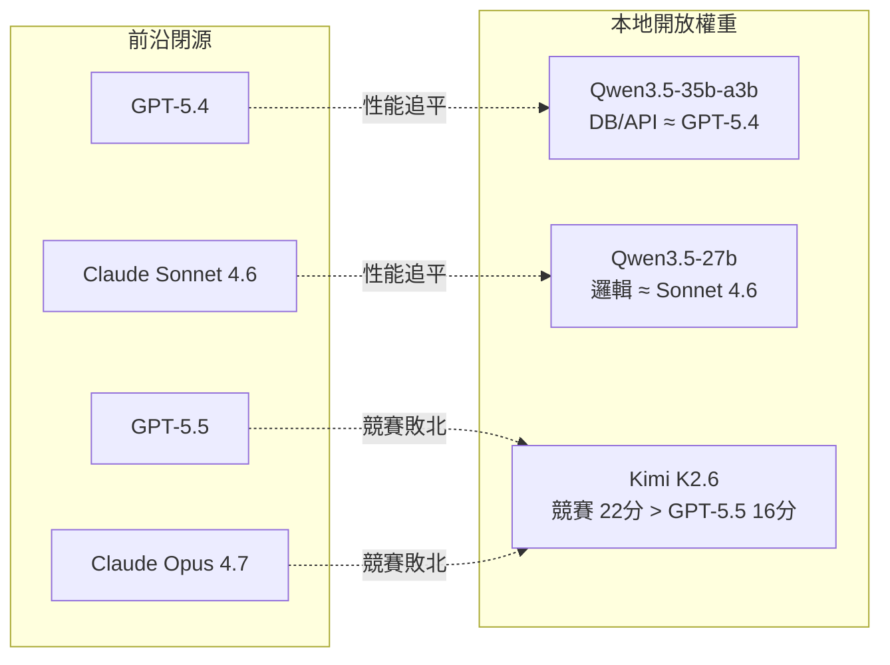
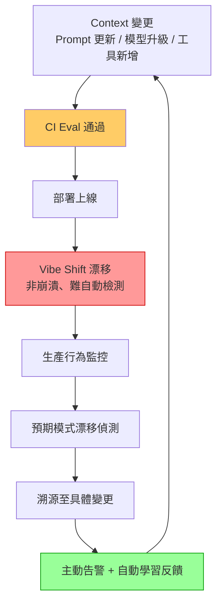

# AI Daily Digest — 2026-05-04

<!-- pipeline-generated:begin -->

## 🔥 今日 TOP 3
### 1. OpenAI o1 哈佛急診試驗正確率達 67%，首次量化超越人類醫師
OpenAI o1 在哈佛醫學院主導的急診科患者診斷試驗中，正確診斷率達 67%，顯著高於 triage 醫師的 50–55%，提升幅度 12–17 個百分點。這是迄今以臨床試驗規格進行的首個量化驗證，顯示前沿推理模型在特定診斷任務上已可超越人類醫療人員。

此結果之所以重要，在於它來自真實急診病例而非合成基準，轉化性更高。對醫療機構而言，AI 診斷輔助的採購論點從「可能有用」升格為「有數據支持」；對 AI 研發者而言，推理模型（test-time compute）在高不確定性醫療決策上的優勢首次獲臨床確認，強化了推理路線的商業正當性，也使「醫療診斷輔助」成為可用 o1 系列模型優先驗證的垂直場景。

後續觀察重點：試驗是否在多院別、多急症類型重現；與專科醫師（而非 triage 護士）的對比數據；以及 FDA 是否接受此類試驗作為軟體即醫療器材（SaMD）申報依據。實務上，醫療資訊系統開發者現可啟動 o1 整合的 PoC，並同步設計人機協作審查機制以滿足合規需求。

📖 [閱讀完整 insight](../10-insights/2026-05-03/inbox_8c27b443.md) · 🔗 [原文連結](https://www.theguardian.com/technology/2026/apr/30/ai-outperforms-doctors-in-harvard-trial-of-emergency-triage-diagnoses)
### 2. Intel、AMD 聯合推出 ACE 指令集，CPU 單時鐘 AI 計算密度躍升 16 倍
Intel 與 AMD 聯合發布 AI Compute Extensions（ACE），引入 2D tile registers 與外積演算法，使每時鐘周期乘法運算從 AVX 的 64 次提升至 1,024 次，相較 AVX10 達 16 倍計算密度，跨廠商統一設計確保 PyTorch、TensorFlow、NumPy 等主流框架的優化核心在消費筆電至企業伺服器上無修改相容，根絕了 AVX-512 時代的碎片化困局。

此標準的意義在於重新定義 CPU 在機器學習任務中的角色：輕量 AI 推理（分類、嵌入、SLM 推論）可直接在 CPU 高效執行，不再強制依賴 GPU，降低了資料中心的能源與硬體成本結構。對邊緣部署場景尤其重要——無 GPU 的 IoT 設備、工業控制器、低功耗筆電將獲得過去不可能實現的本地推理能力，根本性地擴大 AI 應用的可及性。

目前尚無支持 ACE 的硬體上市，影響預計在 2027 年後的硬體世代才顯現。觀察重點：ARM 是否推出競爭性等效標準；llama.cpp、ONNX Runtime、vLLM 等框架何時合并 ACE 優化核心；以及雲端 VM 廠商提供 ACE 實例的時間線。短期內無需調整架構決策，但現在是時候在推理框架路線圖中標記「ACE 就緒」的里程碑。

📖 [閱讀完整 insight](../10-insights/2026-05-03/inbox_a626c692.md) · 🔗 [原文連結](https://www.reddit.com/r/LocalLLaMA/comments/1t2qqtw/could_pc_x64_instruction_extensions_relieve/)
### 3. 「Context 是新代碼」：Patrick Debois 提出 Context Development Life Cycle 框架
Tessl 的 Patrick Debois 提出 Context Development Life Cycle（CDLC）：Generate → Test → Distribute → Observe 四階段循環，主張 Context 應與代碼同等對待——版本控制、CI/CD 測試（以錯誤預算管理不確定性）、Skills/Registry 跨團隊分發，以及對 Agent.md/Claude.md 等文件進行安全掃描（類似 Snyk 處理代碼依賴）。

CDLC 的重要性在於它為「如何工程化 Agent 開發」提供了首個系統性方法論，填補了從 prototype 到 production 之間的工程實踐空白。現有 AI 工程師多以 ad-hoc 方式管理 prompt 和 context，缺乏版本控制、測試策略與部署流水線；CDLC 提供了對應的 DevOps 映射框架，且不依賴任何特定供應商工具，可立即套用於既有工程流程。

實務上立即可行的三個行動：(1) 為任何 CLAUDE.md/AGENTS.md 建立 git 版本控制並加入 PR review 流程；(2) 定義 Context Eval 的通過/失敗標準並納入 CI，使用錯誤預算而非精確 pass rate 應對 LLM 非決定性；(3) 建立組織級 Skills Registry，避免各團隊重複定義相同指令並產生依賴衝突。

📖 [閱讀完整 insight](../10-insights/2026-05-03/inbox_0470ae00.md) · 🔗 [原文連結](https://www.youtube.com/watch?v=bSG9wUYaHWU)

## 📚 分類摘要
### foundation_models
今日最矚目的是 OpenAI o1 在哈佛急診科的臨床驗證（inbox_8c27b443），正確診斷率 67% 對比 triage 醫師 50–55%，首次以臨床試驗規格量化 AI 超越人類醫師的診斷能力，為醫療 AI 商業化提供了前所未有的採購論據。與此同時，Anthropic 發表 Claude 媚言傾向的量化研究（inbox_2a0ce931），自動分類器評估反駁意願、立場堅持、讚美適度性、坦誠度四維度後，發現整體 sycophancy 率僅 9%，但精神信仰領域高達 38%、人際關係領域達 25%，揭示 LLM 在價值判斷話題上的系統性迎合偏向——在諮詢類、教練類應用中需格外警惕。

本地開放權重模型與前沿閉源模型的性能差距持續收窄。AutoBe 的函數呼叫基準（inbox_664a380c）顯示 Qwen3.5-35b-a3b 的 DB/API 設計能力已接近 GPT-5.4，Qwen3.5-27b 邏輯推理媲美 Claude-Sonnet-4.6；測試期間揭示「CoT 依從性現象」——更大的前沿模型傾向跳過程序指令，導致函數呼叫框架下出現性能逆轉，成本最優解指向 $0.14–0.25/M token 的模型。Kimi K2.6 在 Word Gem Puzzle 競賽中以 7-1-0 戰績擊敗 GPT-5.5（16 分）與 Claude Opus 4.7（12 分），獲得 22 分（inbox_5212b9d9），儘管三方基準指數差距仍小（54 vs 57 vs 60），但競賽結果進一步確認開源模型已達前沿水準。

本地推理性能拐點已至（inbox_92c49e40）：相同硬體下新模型推理速度較 2 年前 Llama 405B Q4 提升 25–83 倍（從 1.2 到 30–100 token/sec），Qwen 3.6-36B 可在消費級設備達 50 token/sec，超大模型本地部署的 TCO 已具備實用可行性。

⚠️ 注意：今日尚有 6 則 items 未完成處理，以上摘要不含該部分，最終覆蓋率可能略有提升。
### agents
今日 agents 領域由兩個高度互補的框架主導。Patrick Debois 的 CDLC（inbox_0470ae00）從工程流程視角定義了 Context 的生命周期管理，而 Unblocked 的 Context Engine（inbox_0bdd1867）則從運行時機制視角解決 Agent 任務前的資訊供給問題——只注入必要上下文（代碼庫、組織資訊）排除無關內容，以 Social Engineering Graph 作為核心組件。兩者結合呈現完整的 Agent 上下文工程生態：CDLC 是工程流程，Context Engine 是執行時機制。

生產 Agent 管理方面，兩則 insights 提供重要警示。Memtrace（inbox_b6dff65f）以 42ms 增量快照 + 雙時間層（valid_time + transaction_time）+ 混合檢索（Tantivy BM25 詞彙召回 + Jina-code 768D 語義召回 + RRF k=60 融合）解決 Claude Code 長會話中代理重複讀取、無 blast radius 感知、變更歷史遺忘的 stale context 三大症狀。而用戶分享的 production agent「vibe shift」問題（inbox_06326840）揭示一個系統性缺口：eval 通過但上線 3 天後出現微妙行為漂移（缺少欄位、過度冗長），傳統 CI/CD 無法捕捉，理想解方需要五元素閉迴路——持續生產監控 + 漂移偵測 + 變更溯源 + 主動告警 + 自動學習。現有工具（Langfuse、Arize、Braintrust）多止於可觀測性，完整的行為回歸檢測鏈路尚待建立。

### infra
Cloudflare 宣布的 LLM 運行基礎設施（inbox_3ac897bf）採用「輸入處理 / 輸出生成分離」架構：prefill（計算密集型）與 decode（記憶體頻寬密集型）部署到不同優化系統，直接降低全球邊界網路的 LLM 推論成本與延遲。此設計與業界 disaggregated prefill/decode 主流趨勢一致，但 Cloudflare 的差異化在於將其延伸至邊緣節點，理論上使更多地區的組織可負擔起部署大型模型。

Intel、AMD 聯合推出 ACE 指令集（inbox_a626c692）是更具長遠意義的基礎設施事件：2D tile registers + 外積演算法達每時鐘 1,024 次乘法（AVX 的 16 倍），跨廠商統一標準消除了 AVX-512 時代的碎片化，PyTorch 等框架的優化核心可在消費筆電至企業伺服器間無修改相容。中期影響是 CPU-only 推理場景的能力邊界大幅擴展，對邊緣 AI 與低功耗環境的成本結構影響深遠；目前尚無支持硬體，預計 2027 年後顯現。

AMD Strix Halo 系列的硬體路線圖（inbox_b031e65f, inbox_e419c7c4）持續推進本地超大模型部署的可行性邊界：即將推出的 Gorgon Halo 495 Max 配備 192GB 統一記憶體（較現行 128GB 提升 50%），在 Q8 量化下可完整運行 122B 模型；後續 Medusa Halo（2027）預期達 256GB，足以部署 DeepSeek v4 Flash、MiniMax 2.7 等當代最大 MoE 模型，使單機無雲端依賴的超大模型部署從構想邁向可採購的產品規格。

## 🎯 專欄
### 🛠 Claude Code / Codex 新功能
- **[8 Crazy Things Claude AI Can Do That ChatGPT Can’t](../10-insights/2026-05-04/inbox_0d516f2c.md)**
  Claude 相比 ChatGPT 提供八大差異化優勢。大文件處理：單次上傳 15 萬字且分析能力優於 ChatGPT；上下文保持：10 萬+ token 窗口跨多文件類型；首稿品質高且即用性強；複雜多步驟推理跨域同時進行。技術面：Claude Code 為除錯夥伴，檢測遺漏錯誤與安全漏洞；內建倫理守護—生成前標示危險而非事後過濾。生態集成：原生連接 Not
- **[Open source models are going to be the future on Cursor, OpenCode etc.](../10-insights/2026-05-04/inbox_044d9947.md)**
  Cursor Enterprise 用戶揭示 API 成本危機：2 次提示消費 $10（GPT-5.5、Claude-Opus-4.6-Thinking 各一），上月單週耗費 $80（Claude-Opus-4.7 即使享五折優惠）。使用者預測開源模型成本低 5-10 倍，到 2026 年底將成主流替代方案，迫使 IDE 轉向本地化策略。反映商業 API 定
- **[I can&#39;t be the only person with a normal Claude.](../10-insights/2026-05-04/inbox_941caf20.md)**
  使用者反映自己與 Claude 及 Claude Code 的互動始終保持務實、直接、無個性色彩，與紅迪社群常見的「Claude 有趣、會勸休息、有自覺」的貼文形成對比。儘管使用者更傾向無個性風格，但開始懷疑為何自己的體驗與大多數社群分享的情況差異如此之大。使用者舉例指出，即使自己用粗言責罵 Claude Code 實裝偏離了設計契約，它也只會冷靜承認偏差並
- **[Reminder: Have you checked your context lately?](../10-insights/2026-05-03/inbox_88387960.md)**
  一位 Claude Code 用戶提醒社群檢查 context 設置。該用戶發現新聊天的 context 累積至 54,000 tokens，其中許多來自過時或冗餘的 plugins 和 MCPs。這導致 Haiku 等輕量模型在會話中被龐大背景信息淹沒。用戶通過運行 /context 命令審查並整理設置，將 plugins/MCPs 區分為 user 和 
- **[Your Claude Code agent is always working from stale context. I built it a fix it can rewind, replay, and stay ahead of every edit.](../10-insights/2026-05-04/inbox_b6dff65f.md)**
  開發者發布 Memtrace，針對 Claude Code 長會話中的 stale context 問題。代理在長會話中會重複讀取同一文件、無法追蹤重構影響、缺乏代碼庫變更認知。Memtrace 的兩大創新：(1) 42ms 增量快照實現 always-fresh 記憶；(2) 雙時間層（valid_time + transaction_time）支持代碼狀
### 📚 AI 知識管理
- **[QuCo-RAG: Count What You Know, Retrieve What You Don’t](../10-insights/2026-05-04/inbox_7202e972.md)**
  QuCo-RAG是新的RAG方法論，針對LLM常見的幻覺問題（自信地生成錯誤答案）。核心思路：模型先統計已知知識，再對不確定內容進行檢索，以降低生成不準確信息的風險。『Count What You Know』是自我知識評估的首要步驟。
- **[9 RAG Architectures Every AI Engineer Should Actually Understand (Not Just Memorize)](../10-insights/2026-05-04/inbox_bf428a78.md)**
  文章指出「RAG 就是加上去」的簡化認知誤導開發者。RAG 核心邏輯看似簡單（查詢→檢索→餵 LLM→生成），但實際複雜度在於檢索策略、檢索內容選擇、驗證機制與模型推理方式的決策。生產環境常見失敗：幻覺、檢索結果無關、回應遲緩—根本原因非 RAG 本身而是架構選擇錯誤。文章承諾剖析九種 RAG 架構類型及各自的失效場景與適用時機，但付費內容限制無法完整取得詳
### 🏢 企業導入 AI / 團隊實踐
- **[DoorDash Used Copilot to Convert Its XCTest-Based iOS Test Suite to Swift Testing](../10-insights/2026-05-04/inbox_da6e044c.md)**
  DoorDash 工程師 Matheus Gois 分享了透過 GitHub Copilot 搭配可靠性保障措施，將大規模 iOS XCTest 測試套件遷移到 Swift Testing 框架的經驗。Copilot 被用於批量轉換代碼，大幅加速了遷移工作流。整個過程配合了自動化測試驗證等檢查機制，確保了轉換的正確性和安全性。遷移完成後獲得了可測量的效能提升
- **[Cloudflare Builds High-Performance Infrastructure for Running LLMs](../10-insights/2026-05-03/inbox_3ac897bf.md)**
  Cloudflare 宣布推出專為大型語言模型設計的新一代運行基礎設施，可在其全球邊界網路上大規模部署和運行 LLM。Cloudflare 認識到 LLM 推論面臨的核心挑戰：昂貴的硬體成本和龐大的文本輸入輸出流量。為了應對，Cloudflare 採用了創新的系統架構：將 LLM 的輸入處理和輸出生成分離到不同的優化系統上。輸入處理系統針對快速處理大量輸入而
- **[Cloudflare Builds High-Performance Infrastructure for Running LLMs](../10-insights/2026-05-03/inbox_4571463b.md)**
  Cloudflare 宣布推出專為大型語言模型設計的新一代運行基礎設施，可在其全球邊界網路上大規模部署和運行 LLM。Cloudflare 認識到 LLM 推論面臨的核心挑戰：昂貴的硬體成本和龐大的文本輸入輸出流量。為了應對，Cloudflare 採用了創新的系統架構：將 LLM 的輸入處理和輸出生成分離到不同的優化系統上。輸入處理系統針對快速處理大量輸入而
- **[TLMs: Tiny LLMs and Agents on Edge Devices with LiteRT-LM — Cormac Brick, Google](../10-insights/2026-05-03/inbox_c8a05145.md)**
  Google AI Edge 負責人 Cormac Brick 在演講中討論如何在邊界設備上運行 Tiny LLMs 和 Agents。演講者強調 Google 與 Gemma 團隊的合作，利用 LiteRT-LM 技術將模型部署到邊界。最近推出的 Gemma 4 支持 Android/iOS 應用，展示了移動 AI 的最新進展。Cormac 在 Googl
- **[Mergeable by default: Building the context engine to save time and tokens — Peter Werry, Unblocked](../10-insights/2026-05-03/inbox_0bdd1867.md)**
  Unblocked 的 Peter Werry 和 Brandon 介紹如何構建 Context Engine，專門用於為 AI Agents 提供優化的上下文。Context Engine 的核心目的是在 Agent 開始執行任務前，供應所有必要的上下文（例如代碼庫、組織信息）但不包含無關信息，以節省 tokens 和執行時間。演講駁斥了關於 Contex
### 🎓 AI 使用技巧 / 心法
- **[Mergeable by default: Building the context engine to save time and tokens — Peter Werry, Unblocked](../10-insights/2026-05-03/inbox_0bdd1867.md)**
  Unblocked 的 Peter Werry 和 Brandon 介紹如何構建 Context Engine，專門用於為 AI Agents 提供優化的上下文。Context Engine 的核心目的是在 Agent 開始執行任務前，供應所有必要的上下文（例如代碼庫、組織信息）但不包含無關信息，以節省 tokens 和執行時間。演講駁斥了關於 Contex
- **[Context Is the New Code — Patrick Debois, Tessl](../10-insights/2026-05-03/inbox_0470ae00.md)**
  Tessl 的 Patrick Debois 提出「Context 是新代碼」的核心論點，引入 Context Development Life Cycle 框架，包括 Generate（生成）、Test（測試）、Distribute（分發）、Observe（觀察）四個階段。Patrick 強調應對 Context Evals 進行測試（類似代碼單元測試），
- **[CSPNet Paper Walkthrough: Just Better, No Tradeoffs](../10-insights/2026-05-03/inbox_f16a5513.md)**
  本文詳細講解 Cross-Stage Partial Network（CSPNet）論文，並提供完整的 PyTorch 實現教程。CSPNet 是神經網路架構優化的重要方法，用於改進特徵提取的效率。文章採用循序漸進的方式逐步拆解論文內容，幫助讀者理解核心概念。提供的 from-scratch PyTorch 實現代碼讓開發者可以直接在專案中驗證與應用這個架構
- **[From Prompts to Partnership: Lunch With Maria](../10-insights/2026-05-04/inbox_6cbf5da8.md)**
  本文通過 Maria 的職涯故事來探討 AI 工具使用者的成長路徑。Maria 三年前與其他人一樣，還在反覆調整和優化提示詞（prompt iteration），是一個典型的 AI 工具初學者。但如今她已經獲得績效獎項，成為團隊中的佼佼者。故事的轉折點在於 Maria 的新同事想要瞭解她成功的秘訣。文章通過這個「共進午餐」的對話框架，暗示 Maria 的進步
- **[You Think AI Understands Context… It Actually Doesn’t](../10-insights/2026-05-04/inbox_fd441d7e.md)**
  批判性分析AI對上下文的理解能力。文章主張AI並非真正理解上下文，而是依賴隱藏的『LLM Wiki』系統——訓練數據統計模式庫——來決定回應方式。揭示所謂的『理解』實為統計性而非語義推理。
### 💳 支付 / Fintech
- **[EU AI Act Article 50: Why Your API Won&#39;t Save You [4-Layer Python Fix]](../10-insights/2026-05-04/inbox_c83eef5e.md)**
  本文揭示歐洲企業在實現 EU AI Act（歐盟 AI 法案）第 50 條合規時的一個關鍵漏洞：簡單調用生成式 API 並不能保證法規合規。核心問題在於許多企業在獲得 API 輸出後進行後處理（post-processing）操作，這會破壞內容出處鏈（C2PA），導致無法追溯生成過程，違反第 50 條的審計要求。文章提供一個四層 Python 架構作為解決方
- **[Frontier models can&#39;t run on satellites. Here&#39;s an end-to-end wildfire detection pipeline using a 450M on-board Vision-Language Model (Sentinel-2 + LFM2.5-VL)](../10-insights/2026-05-04/inbox_e6e3552f.md)**
  開發者分享衛星野火預警系統設計，核心洞見為：設計瓶頸非模型品質而是頻寬。在衛星上執行 450M Vision-Language Model (LFM2.5-VL-450M) 本地推理，只下傳 JSON 風險檔案而非龐大多譜影像矩陣。技術方案：RGB (B4-B3-B2) + SWIR (B12-B8-B4) 多譜 tile 組合，SWIR 擷取植被濕度壓力（
- **[Vibe Coding vs. Production reality](../10-insights/2026-05-04/inbox_e3e51fed.md)**
  Reddit 用戶分享觀察：AI 輔助的快速原型設計（\"vibe coding\"）讓概念驗證的 80/20 部分週期從一週縮短到一個下午，但許多人在將不完整產品投入實際使用時遭遇失敗。文章指出生產環境所需的基礎設施——身份驗證、密鑰管理、模型棄用應對、GDPR 合規、審計日誌、速率限制、多租戶支持——在演示中隱而未見，卻在他人部署時全面暴露。核心框架是：
- **[The internal AI tool that’s transforming how Stripe designs products | Owen Williams](../10-insights/2026-05-04/inbox_78e106f0.md)**
  Stripe 產品負責人 Owen Williams 開發了 Protodash，一套內部 AI 工具能將設計系統轉換成可互動原型，耗時僅 2 分鐘。該工具採用「vibe coding」方式加速產品設計流程。此舉反映大廠透過 AI 輔助工具優化產設工作流的實踐方向，對設計團隊效率提升有實質意義。
- **[AI 殺死 DeFi，加密全面淪陷？](../10-insights/2026-04-21/inbox_5555b7a6.md)**
  MAX 加密圈 Digest 第 7 期標題性提問：AI 是否正在摧毀 DeFi 生態。雖無詳細論述內容，但題目反映圈內對 AI 浪潮衝擊金融科技的擔憂，可能涉及 AI 套利、自動化交易、流動性喪失等風險討論。
### ⛓️ 區塊鏈 / Web3
- **[DoorDash Used Copilot to Convert Its XCTest-Based iOS Test Suite to Swift Testing](../10-insights/2026-05-04/inbox_da6e044c.md)**
  DoorDash 工程師 Matheus Gois 分享了透過 GitHub Copilot 搭配可靠性保障措施，將大規模 iOS XCTest 測試套件遷移到 Swift Testing 框架的經驗。Copilot 被用於批量轉換代碼，大幅加速了遷移工作流。整個過程配合了自動化測試驗證等檢查機制，確保了轉換的正確性和安全性。遷移完成後獲得了可測量的效能提升
- **[My coworker and I planning a feature with our two Claude Codes in the same chat room. All four of us, talking.](../10-insights/2026-05-04/inbox_b2fd0c1e.md)**
  兩名工程師透過P2P加密聊天室將本地運行的Claude Code實例邀請進來，進行多Agent協作功能規劃。兩個Claude Code各自帶有本地資料夾上下文和本地settings設置，在人類監督下分別規劃前後端細節。該工作流展示了AI agent可在非官方協作工具中進行跨領域規劃，並由人類選擇性干預。
- **[🧠 把我 7 年的幣圈大腦，裝進你的 Claude](../10-insights/2026-05-03/inbox_c4c8f794.md)**
  MaxBrain 正式上線，將 7 年加密研究成果與 55+ 案例分析整合入 Claude 平台，提供實時市場資訊流。使用者可透過訂閱方式直接在 Claude 內存取專業級的幣圈知識庫，無須離開 AI 介面。展示 Claude 作為知識整合與外部專業內容平台的應用方向。
- **[AI 殺死 DeFi，加密全面淪陷？](../10-insights/2026-04-21/inbox_5555b7a6.md)**
  MAX 加密圈 Digest 第 7 期標題性提問：AI 是否正在摧毀 DeFi 生態。雖無詳細論述內容，但題目反映圈內對 AI 浪潮衝擊金融科技的擔憂，可能涉及 AI 套利、自動化交易、流動性喪失等風險討論。
- **[第 180 期](../10-insights/2026-05-04/inbox_05ce6532.md)**
  Web3Matters 第 180 期涵蓋 RWA、AAVE、DeFi Summer 等加密貨幣相關話題，內容不屬於 AI 領域。
### 🔐 AI 安全 / 濫用
- **[How AI Tools Generate Technical Debt in IoT Systems — and What to Do About It](../10-insights/2026-05-04/inbox_68700c97.md)**
  Towards Data Science 文章分析 AI 工具在 IoT 系統中如何潛伏地引入技術債。開篇引用 1996 年 Ariane 5 火箭軟體故障案例，說明局部正確的代碼在全系統層面失效的風險。作者列舉四種 AI 生成技術債的機制：(1) 複製遺留模式與錯誤（研究：15% AI 提交含代碼質量問題）；(2) 缺乏架構感知的「快速修復」（Ox Sec
- **[15 eBay Scams in 2026 — And How AI Detection Protects You](../10-insights/2026-05-04/inbox_97dbe206.md)**
  文章盤點 eBay 上 15 種騙局，並指出詐騙者現已使用 AI 生成逼真商品照片、深度偽造賣家影片、以及 AI 撰寫的詐騙文案，改變了傳統人工騙局的手法。eBay 及相關平台的 AI 檢測系統試圖辨識這些合成內容，但檢測與對抗技術之間的軍備競賽正在展開。消費者購物時需要提高警覺，同時平台需要不斷升級檢測能力來應對 AI 詐騙工具的進化。

## 💡 今日 Takeaway

_讀完今日所有內容後，可帶走的知識點_
### 1. 用 deny list 而非 allow list 路由多模型任務，負向框架遵循率遠高於正向框架
在 CLAUDE.md 以「不要用 Claude 做 X」（deny list）而非「遇到 X 就用 Y」定義工作分配，實測正向框架被 AI 忽視率約 30%，負向框架幾乎為零。搭配此策略，將 JSON 格式化、字段提取、文件分類等機械任務路由至 DeepSeek V4 Flash（$0.14/M token），可將同等工作量成本降低 60 倍（Claude Sonnet $7 → DeepSeek $0.41，3 週 217 個機械任務的實測數據）。需注意此架構為監督型設計——無工具調用、無鏈式自動化，每次輸出需人工審核，適合批量處理的非即時工作流。

_類型：framework_

**參考來源**：
- [Most of my Claude usage was on work that didn&#39;t need Claude. Cut my bill 60x on bulk tasks with a tiny side model.](../10-insights/2026-05-04/inbox_16202cd3.md) · [原文](https://www.reddit.com/r/ClaudeAI/comments/1t3elab/most_of_my_claude_usage_was_on_work_that_didnt/)
### 2. 生產 Agent 行為漂移是傳統 CI/CD 無法覆蓋的問題，需要五元素閉迴路反饋
Agent 行為漂移（vibe shift）的特徵是：eval 通過但上線後 3 天出現微妙異常（缺少欄位、過度冗長）——非崩潰、無堆疊追蹤、傳統測試框架無法捕捉。理想解方需要五元素閉迴路：持續生產行為監控 + 預期模式漂移偵測 + 變更溯源 + 主動告警 + 自動學習反饋。Langfuse、LangSmith、Arize 等現有工具多止於可觀測性（「發生了什麼」），缺乏完整的行為回歸檢測加自動反饋鏈路。實踐建議：每次提示更新或模型升級前，先定義「預期行為基線」（含邊界案例的輸出格式期望），作為後續漂移偵測的定錨點。

_類型：framework_

**參考來源**：
- [Anyone actually built a real feedback loop for Claude agents in production? Because &#34;run evals and pray&#34; isn&#39;t cutting it](../10-insights/2026-05-04/inbox_06326840.md) · [原文](https://www.reddit.com/r/ClaudeAI/comments/1t32zxi/anyone_actually_built_a_real_feedback_loop_for/)
### 3. Context 應被工程化：git 版本控制、CI/CD Eval（錯誤預算）、跨團隊 Skills Registry
Context Development Life Cycle（CDLC）將 Agent 開發的上下文管理等同於軟體工程：Generate → Test → Distribute → Observe 循環與 DevOps 直接對應。三個核心實踐：(1) 在 CI/CD 中以錯誤預算（而非精確 pass rate）管理 Context Evals 的 LLM 非決定性；(2) 建立 Skills/Registry 使 Agent 指令跨項目複用，並處理版本衝突與安全掃描（類似 Snyk 對代碼依賴）；(3) 為 CLAUDE.md/AGENTS.md 建立 git 版本控制並加入 PR review 流程。此框架不綁定特定工具供應商，可立即套用於既有工程流程。

_類型：framework_

**參考來源**：
- [Context Is the New Code — Patrick Debois, Tessl](../10-insights/2026-05-03/inbox_0470ae00.md) · [原文](https://www.youtube.com/watch?v=bSG9wUYaHWU)
### 4. AI 工具在 IoT 環境有四類技術債機制，數據支撐的防控策略可主動消除
研究和工程案例記錄了 AI 工具在 IoT/嵌入式環境生成代碼的四個技術債來源：(1) 複製遺留模式與錯誤（15% AI 提交含質量問題且未修復）；(2) 缺乏架構感知的快速修復（分析 300 開源項目發現系統級判斷缺陷）；(3) 邏輯重複增加維護複雜性（重複代碼 2024 年從 8.3% 增至 12.3%，首次超過重構量）；(4) 忽視硬件約束（記憶體、頻寬、功耗）。對應防控：在 prompt context 中顯式指定硬件約束、以 Architecture Decision Records（ADR）文檔化跨模塊設計規則、強制人工審查涉及跨模塊邊界的 AI 生成代碼。

_類型：pattern_

**參考來源**：
- [How AI Tools Generate Technical Debt in IoT Systems — and What to Do About It](../10-insights/2026-05-04/inbox_68700c97.md) · [原文](https://towardsdatascience.com/how-ai-tools-generate-technical-debt-in-iot-systems-and-what-to-do-about-it/)
### 5. Vibe coding 只壓縮了 PoC 的 80/20，生產系統必需的基礎設施複雜度從未降低
AI 輔助快速原型設計將 PoC 開發周期從一週壓縮至一個下午，但這只解決了初步驗證的效率問題。生產環境所需的基礎設施——身份驗證、密鑰管理、模型棄用應對、GDPR 合規、審計日誌、速率限制、多租戶——在演示中隱而未見，卻在真實部署時完全暴露。核心陷阱是將「原型速度」等同於「產品開發速度」，導致架構決策被延後到最昂貴的時機。建議在 PoC 階段即明確標記「演示假設清單」（demo assumptions），並同步建立生產需求核查表，避免對利益相關者造成錯誤的時間線預期。

_類型：framework_

**參考來源**：
- [Vibe Coding vs. Production reality](../10-insights/2026-05-04/inbox_e3e51fed.md) · [原文](https://www.reddit.com/r/ClaudeAI/comments/1t3bk3x/vibe_coding_vs_production_reality/)
## ⏳ 待處理 (6 筆)

<!-- pipeline-generated:end -->

<!-- user-notes -->
<!-- Write your own notes below; pipeline never touches this section. -->