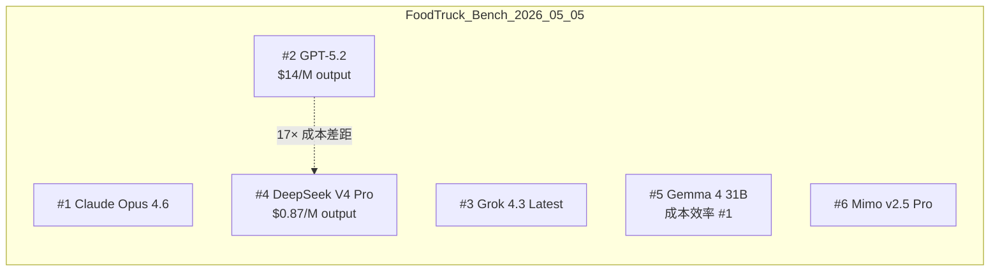
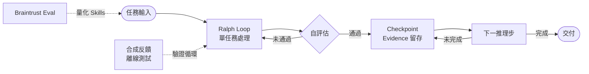

# AI Daily Digest — 2026-05-05

<!-- pipeline-generated:begin -->

## 🔥 今日 TOP 3
### 1. DeepSeek V4 Pro 代理基準第四：以 GPT-5.2 十七分之一成本進前沿
DeepSeek V4 Pro 在 FoodTruck Bench（30 天代理基準、34 工具、持久化記憶與日常反思）整體排名第 4，僅次 Claude Opus 4.6、GPT-5.2、Grok 4.3，成為首個進入前沿層級的中文模型。同日 Xiaomi Mimo v2.5 Pro 排名第 6，合計 2 個中文模型躋身前 6，中美模型差距從「一年」壓縮至「十周」，且成本不再是選用中文模型的主要障礙。

成本差距是最驚人的數字：GPT-5.2 定價 $1.75/M 輸入、$14/M 輸出，DeepSeek V4 Pro 為 $0.435/M 與 $0.87/M，相同代理工作量便宜約 17 倍。穩定性亦優於 Grok 4.3 Latest——零損失、廢棄食物減 6 倍、日均服務量增 30%、結果分佈緊密 2.4 倍——「便宜等於不穩」的偏見在此案例完全不成立。

工程團隊實務建議：代理 pipeline 評估時應將 DeepSeek V4 Pro 納入預設對比方案，在非關鍵決策節點替換 GPT-5.2 可大幅釋放 token 預算。未來 10 周觀察重點：Mimo v2.5 Pro 第三方推理託管上線狀況（目前僅限小米自有平台），以及長序列穩定性在更多垂直場景的實測數據。

📖 [閱讀完整 insight](../10-insights/2026-05-05/inbox_ac3a3034.md) · 🔗 [原文連結](https://www.reddit.com/r/LocalLLaMA/comments/1t47qbw/deepseek_v4_pro_matches_gpt52_on_foodtruck_bench/)
### 2. Anthropic：AI 首波職場衝擊是入職門檻升高而非失業潮
Anthropic 最新研究引入「Observed Exposure」指標，發現 LLM 理論上可涉及 90% 工作任務，但實際落地覆蓋率僅 30%，瓶頸不在技術而在企業組織準備度（流程設計、法規合規、組織信任）。最反直覺的結論是 AI 優先衝擊高薪白領職位：程式設計師暴露率 75%、客服代表 70.1%、資料輸入員 67%，原因是這些職位的輸出「更容易被自動驗證」。

最值得警覺的數據是 22-25 歲年輕求職者進入高暴露職業的成功率下降 14%——junior 缺額正在收縮，企業選擇 AI 補位而非補人，初入職場的機會結構正在根本性改變。相比過去「哪些職業消失」的討論，這個研究更精準地揭示了「入職門檻升高、senior 需求暫時維持」的過渡形態。

實務框架：以「任務輸出是否易驗證」而非「職位薪資高低」判斷 AI 替代風險；個人應優先培養輸出難以自動驗證的能力（系統設計判斷、跨組織信任建立、模糊問題定義）。對招聘負責人，2026-2027 年 junior 招聘計劃需以此框架重新評估，避免盲目縮減後期缺乏接班梯隊。

📖 [閱讀完整 insight](../10-insights/2026-05-05/inbox_1fe37778.md) · 🔗 [原文連結](https://darrentechtalk.substack.com/p/anthropic-report)
### 3. Claude API 路由：85% token 不需頂級模型，月費從 $200 降至 $30
一位開發者的 Claude Max 訂閱分析揭示系統性浪費：85% 的 token 消耗在不需要 Opus 的任務——40% 為檔案讀取/掃描、25% 為測試樣板生成、20% 為格式化/重構，只有 15% 的複雜推理真正需要頂級模型。改用 API 依任務路由（Sonnet 處理常規任務、Opus 處理複雜推理），月成本從 $200 降至 $30，輸出品質無差異。

這揭示了訂閱制 AI 工具的結構性問題：固定月費掩蓋了真實 token 消耗與任務複雜度的對應關係，使用者無意識地以頂級模型處理廉價任務。Sonnet（$0.28/MTok）在 file scan、boilerplate 生成等場景的輸出品質與 Opus 幾乎無差異，而今日 DeepSeek V4 Pro 的 17× 成本優勢再次印證：正確的模型路由策略是降本的核心槓桿。

明天可行動的步驟：審計現有 Claude 使用情境，以「這個任務需要深度推理嗎？」為判斷依據將任務分為 Opus 與 Sonnet 兩類，並在 Claude Code hook 或自建 pipeline 中實作路由邏輯。對大規模使用 AI 的工程團隊，此分析框架預計帶來 5-10× 的成本節省空間。

📖 [閱讀完整 insight](../10-insights/2026-05-05/inbox_866ccff6.md) · 🔗 [原文連結](https://www.reddit.com/r/ClaudeAI/comments/1t3zi9i/i_got_200_of_direct_api_usage_to_perform_equal_to/)

## 📚 分類摘要
### foundation_models
今日最大新聞是 DeepSeek V4 Pro（inbox_ac3a3034）在 FoodTruck Bench 整體排名第 4，以 GPT-5.2 成本 1/17 打平前沿性能，Mimo v2.5 Pro 並行排名第 6，中美模型差距正式壓縮至「十周」。搭配 inbox_a7bfa60b 的 9 供應商決策樹分析（Claude 在 4 場景優勝、中文模型在 3 場景優勝），「默認 OpenAI」的慣性選型已被量化框架取代。OpenAI 在架構層發表重建 WebRTC stack 的技術細節（inbox_2858977d, inbox_514e4e66）：從 SFU 架構改為 transceiver 模型，流式音頻傳輸讓模型在用戶說話中即時轉錄並推理，根本改善對話自然度，支撐全球 900M+ 週活用戶規模。

Claude 端有多個重要信號：Anthropic 勞動力市場研究（inbox_1fe37778）顯示 LLM 理論涵蓋 90% 任務但實際落地僅 30%，程式設計師暴露率達 75%，年輕求職者入職高暴露職業成功率跌 14%。inbox_866ccff6 揭示 85% 的 token 消耗在不需要頂級模型的任務，以 API 路由可將月費從 $200 降至 $30。同時需注意兩個可靠性問題：claude-opus-4.7 長時間無監督任務出現自動生成虛構對話的迴圈 bug（inbox_9edcb6db），以及 thinking 階段出現研究對象與用戶身份混淆的推理 bug（inbox_dba28d41），提示長時間代理任務的穩定性仍需人工監控。
### agents
Agent 架構方法論今日有兩個頂級洞察。Supabase 的 Pedro Rodrigues（inbox_820a2bdf）展示 Agent Skills 評估閉環：Skills 最常見失敗是從未被 agent 調用、或指令表述誤導執行，需透過 MCP + CLI + Braintrust eval harness 建立 write → eval → inspect → iterate 的量化驗證，主觀感受無法取代 eval 數據。Cherrypick 的 Chris Parsons（inbox_a23403d5）提出反直覺的「Ralph Loops」架構：單任務處理→自評估→迭代改進的簡單循環，在實戰中遠優於多 agent 編排和規劃圖，三要素為端到端 Ralph Loop + 合成反饋離線測試 + 自改進機制。

系統層，inbox_94f5c4aa 論證 agent harness 已成主流不可逆範式，且 harness 設計必須與記憶系統（上下文持久性、長期可靠性）聯合架構。inbox_13967380 的 Agent Hive 框架主張多步任務必須嵌入 checkpoint + QA + evidence 追蹤，早期錯誤若無中間驗證節點將在後期爆炸式放大，無法事後追溯。工具層，Relay 插件（inbox_d8c40f8c）用 MCP + unix socket 實現同機器 Claude Code 多會話直接通訊，解決前後端並行開發的手動切換痛點；inbox_70bb62b8 展示 Crustdata + FullEnrich + HubSpot MCP 組合將 5 步 1 小時銷售富集流程壓縮為 5 分鐘工作流。

### infra
推理效率層今日出現兩個值得追蹤的突破。FastDMS（inbox_1486b684）在 Qwen3-8B 上實現 7.6× KV 記憶體壓縮（1.406→0.184 GiB）且解碼加速 1.52×（459→698 tok/s），在 Llama 3.2 1B 達 6.4× 壓縮且 PPL 僅降 0.28%，物理回收已驅逐位置實現真正記憶體節省，全面超越 TurboQuant 4bit。MTPLX（inbox_397a0abb）在 MacBook Pro M5 Max 上讓 Qwen3.6-27B 從 28 tok/s 提升至 63 tok/s（2.24×），利用模型自帶 MTP 頭投機解碼無需外部 drafter，自訂 Metal kernels 支持精確溫度採樣，打破 DFlash/DDTree 的貪心採樣限制。APEX MoE（inbox_7278015f）新增 I-Nano 超低位層級（2.06 bpw），Qwen3.5 35B 從 13GB 壓縮至 11GB，已擴展至 30+ MoE 模型系列，在 32k+ token 長上下文保持連貫性。

平台層，Figma FigCache（inbox_8f1b8e5f）以統一 Redis 代理替代破碎多層緩存，生產環境達六個九可用性（99.9999%），是「統一代理層取代分散緩存棧」的典範案例。Cloudflare 推出 Flagship 功能標記服務（inbox_822e97da），在 Workers 本地評估旗標零外部 API 調用，基於 OpenFeature 標準；Security Overview 儀表板（inbox_6a27cc17）每日處理 1000 萬+ 安全信號，分散式 checker + 實時處理架構自動優先化行動項。分離式前填充/解碼架構（inbox_3b320354）在 M3 Ultra + DGX Spark 組合讓 Qwen 27B 加速 2.3×、Mistral 128B 加速 2.7×，llama.cpp `mmap=0` 將模型加載從分鐘級降至 20 秒；vLLM 0.20.1 修復 TurboQuant 對 Qwen 3.5+/3.6 Mamba 層的支援（inbox_40aadcea），llama.cpp MTP 支援即將落地（inbox_87280a60），涵蓋 DeepSeekv3、Qwen3.5、GLM4.5+ 等 8 個模型系列。

## 🎯 專欄
### 🛠 Claude Code / Codex 新功能
- **[v2.1.128](../10-insights/2026-05-04/inbox_55dc8338.md)**
  Claude Code v2.1.128 發布包含多項功能改進與 bug 修復。核心改動包括：`/mcp` 命令現顯示已連接伺服器的工具計數及標記零工具伺服器；`EnterWorktree` 修復為從本地 HEAD 而非 `origin/<預設分支>` 創建分支，防止未推送提交遺失；修復平行 Bash 工具調用中讀取命令（grep、git diff、ls）失
- **[0.129.0-alpha.6](../10-insights/2026-05-05/inbox_8d45c0a7.md)**
  OpenAI Codex 版本 0.129.0-alpha.6 發布
- **[0.129.0-alpha.5](../10-insights/2026-05-04/inbox_82463591.md)**
  OpenAI Codex 版本 0.129.0-alpha.5 發布
- **[We Gave Claude Code Access to Our Entire Stack. Here&#39;s What the Workflow Looks Like Now.](../10-insights/2026-05-05/inbox_064deecf.md)**
  某公司將 Claude Code 集成到完整技術堆棧，實現從 ticket 創建到生產部署的八階段端到端工作流自動化。該工作流完全在單次對話中完成，消除所有上下文切換，開發者無需離開對話界面即可完成代碼審查、測試和部署。這展示了 AI 驅動開發工具在實際生產環境中大幅降低工程摩擦的具體應用方式，相比傳統多工具切換流程，大幅提升開發體驗。
- **[Making Claude Code CLI More Usable: Starting Optimization from the Terminal Experience](../10-insights/2026-05-05/inbox_b090e0eb.md)**
  文章分享了作者對 Claude Code CLI 終端體驗的優化改進。作者最近進行了一系列改進工作，目標是提升命令行界面的易用性。雖然具體改進細節在摘要中未展開，但標題暗示重點在於終端交互體驗。這些優化來自實際開發使用場景，具有實踐導向。改進對於經常在命令行環境中使用 Claude Code 的開發者而言，可能帶來工作流與生產力的提升。
### 📚 AI 知識管理
- **[Single Agent vs Multi-Agent: When to Build a Multi-Agent System](../10-insights/2026-05-04/inbox_7f27de8f.md)**
  Towards Data Science 的实用指南详解 agent 设计决策。核心要点：单 agent 适合直线任务，多 agent 适合需多专业分工的复杂流程。梳理 agent 三大组件（LLM、Tools、Memory）与 ReAct 模式（Reasoning + Acting）的核心逻辑。通过 RAG 系统案例演示多 agent 实现路径。
- **[How to Build an Efficient Knowledge Base for AI Models](../10-insights/2026-05-04/inbox_44bb7263.md)**
  Towards Data Science 的知识库构建指南强调：AI 模型性能取决于知识库质量，而非规模。研究数据显示主流 AI 聊天机器人约 50% 查询错误率。提供 6 步系统方法：(1)有针对性收集（价值 > 数量）；(2)清理分块并附元数据；(3)向量化与索引；(4)选择向量数据库存储；(5)(6)验证与迭代。
- **[How to Build a Multimodal RAG System (With Python Code Examples)](../10-insights/2026-05-05/inbox_88ad9afb.md)**
  教程文章介紹如何構建多模態 RAG 系統，支持文本、圖像、音頻和文檔等多種輸入類型。文章包含 Python 代碼示例，幫助開發者實現檢索增強生成（RAG）系統，能處理複雜的多模態查詢。
- **[Agent Hive: An Experimental Way to Make Multi-Step LLM Work Less Fragile](../10-insights/2026-05-04/inbox_13967380.md)**
  提出 Agent Hive，一個新方法論用於提升多步 LLM 任務的穩健性。核心轉變：不再將 LLM 視為單次應答機器，而是作為包含 checkpoint（檢查點）、QA（質量驗證）和 evidence（證據追蹤）的工作流。通過引入中間驗證和證據收集，大幅降低多步推理的失敗率。
- **[LLMSearchIndex- an Open Source Local Web Search Library with over 200 million indexed Web Pages for RAG applications](../10-insights/2026-05-04/inbox_fe4c20ed.md)**
  開發者 zakerytclarke 發布 LLMSearchIndex，一個用於本地 LLM/RAG 系統的開源 Python 庫，完全避免依賴 Brave API 或 SearXNG 元搜尋。該索引包含 200M+ 網頁內容（源自 FineWeb 與 Wikipedia），卻僅需 2GB 存儲空間，在大多數硬件上實現快速檢索。使用者透過簡單 Python 
### 🏢 企業導入 AI / 團隊實踐
- **[v2.1.128](../10-insights/2026-05-04/inbox_55dc8338.md)**
  Claude Code v2.1.128 發布包含多項功能改進與 bug 修復。核心改動包括：`/mcp` 命令現顯示已連接伺服器的工具計數及標記零工具伺服器；`EnterWorktree` 修復為從本地 HEAD 而非 `origin/<預設分支>` 創建分支，防止未推送提交遺失；修復平行 Bash 工具調用中讀取命令（grep、git diff、ls）失
- **[OpenAI and PwC collaborate to reimagine the office of the CFO](../10-insights/2026-05-04/inbox_9da5c2d7.md)**
  OpenAI 與普華永道（PwC）宣布推出企業合作計畫，協助企業部署 AI agents 自動化財務工作流程。合作重點包括改進財務預測、強化內部控制、現代化首席財務官（CFO）職能。該計畫面向需要自動化複雜財務流程的大型企業。
- **[Figma Builds In-House Redis Proxy to Hit Six Nines Uptime](../10-insights/2026-05-05/inbox_8f1b8e5f.md)**
  Figma 開發了內部緩存代理服務 FigCache，2025 年下半年投入生產，取代了之前破碎的多層緩存堆棧架構。該系統在生產環境中實現了六個九（99.9999%）的可用性，成為 Figma 基礎設施的關鍵支撐。透過統一的代理層，FigCache 簡化了複雜的緩存管理，提高了整體系統穩定性和易維護性。此案例展示了大型科技公司如何通過構建定製化的內部工具來解
- **[Cloudflare Introduces Flagship: an Edge-Native Feature Flag Service Built on OpenFeature](../10-insights/2026-05-05/inbox_822e97da.md)**
  Cloudflare 推出功能標記服務 Flagship，內置於全球邊緣平台，目前處於閉測階段。與傳統功能標記服務不同，Flagship 直接在 Cloudflare Workers 中本地評估標記，無需呼叫外部服務，大幅降低延遲並提升性能。服務基於 OpenFeature 開放標準構建，支援無需重新部署代碼即可控制功能推出和進行變更實驗。此舉為邊緣計算環境
- **[Cloudflare Processes 10M+ Daily Insights with New Security Overview Dashboard](../10-insights/2026-05-04/inbox_6a27cc17.md)**
  Cloudflare 推出 Security Overview 儀表板，將每日數百萬條安全信號聚合為優先級排序的行動項。該儀表板基於分散檢查器（distributed checkers）和實時事件處理架構構建，幫助安全團隊加速風險識別和修復。透過整合多層安全分析工作流，自動優先級排序，顯著減少調查開銷並提高事件響應效率。
### 🎓 AI 使用技巧 / 心法
- **[Skill Issue: How We Used AI to Make Agents Actually Good at Supabase — Pedro Rodrigues, Supabase](../10-insights/2026-05-04/inbox_820a2bdf.md)**
  Supabase 的 Pedro Rodrigues 详解编写高效 Agent Skills 的核心方法论：写 Skills 易，但写能真正提升 agent 性能的 Skills 难。通过 MCP + CLI 工具 + Braintrust eval harness 构建、测试、迭代的闭环，演示常见陷阱（Skills 未被调用、指令误导、外表看好但不实用）。
- **[How to Build an Efficient Knowledge Base for AI Models](../10-insights/2026-05-04/inbox_44bb7263.md)**
  Towards Data Science 的知识库构建指南强调：AI 模型性能取决于知识库质量，而非规模。研究数据显示主流 AI 聊天机器人约 50% 查询错误率。提供 6 步系统方法：(1)有针对性收集（价值 > 数量）；(2)清理分块并附元数据；(3)向量化与索引；(4)选择向量数据库存储；(5)(6)验证与迭代。
- **[We Gave Claude Code Access to Our Entire Stack. Here&#39;s What the Workflow Looks Like Now.](../10-insights/2026-05-05/inbox_064deecf.md)**
  某公司將 Claude Code 集成到完整技術堆棧，實現從 ticket 創建到生產部署的八階段端到端工作流自動化。該工作流完全在單次對話中完成，消除所有上下文切換，開發者無需離開對話界面即可完成代碼審查、測試和部署。這展示了 AI 驅動開發工具在實際生產環境中大幅降低工程摩擦的具體應用方式，相比傳統多工具切換流程，大幅提升開發體驗。
- **[How to Build a Multimodal RAG System (With Python Code Examples)](../10-insights/2026-05-05/inbox_88ad9afb.md)**
  教程文章介紹如何構建多模態 RAG 系統，支持文本、圖像、音頻和文檔等多種輸入類型。文章包含 Python 代碼示例，幫助開發者實現檢索增強生成（RAG）系統，能處理複雜的多模態查詢。
- **[Agent Hive: An Experimental Way to Make Multi-Step LLM Work Less Fragile](../10-insights/2026-05-04/inbox_13967380.md)**
  提出 Agent Hive，一個新方法論用於提升多步 LLM 任務的穩健性。核心轉變：不再將 LLM 視為單次應答機器，而是作為包含 checkpoint（檢查點）、QA（質量驗證）和 evidence（證據追蹤）的工作流。通過引入中間驗證和證據收集，大幅降低多步推理的失敗率。
### 💳 支付 / Fintech
- **[Y Combinator&#39;s Stake in OpenAI (0.6%?)](../10-insights/2026-05-05/inbox_731a6447.md)**
  Y Combinator 持有 OpenAI 約 0.6% 股份，在當前 $852 億估值下價值超 $50 億。該股權源自 2016 年 OpenAI 由 YC Research（Y Combinator 子機構）等出資創立，時任 YC 主席的 Sam Altman 後來兼任 OpenAI CEO。文章指出此項重大利益衝突在對 Altman 聲譽的第三方調查
### ⛓️ 區塊鏈 / Web3
- **[0.129.0-alpha.6](../10-insights/2026-05-05/inbox_8d45c0a7.md)**
  OpenAI Codex 版本 0.129.0-alpha.6 發布
- **[0.129.0-alpha.5](../10-insights/2026-05-04/inbox_82463591.md)**
  OpenAI Codex 版本 0.129.0-alpha.5 發布
- **[Skill Issue: How We Used AI to Make Agents Actually Good at Supabase — Pedro Rodrigues, Supabase](../10-insights/2026-05-04/inbox_820a2bdf.md)**
  Supabase 的 Pedro Rodrigues 详解编写高效 Agent Skills 的核心方法论：写 Skills 易，但写能真正提升 agent 性能的 Skills 难。通过 MCP + CLI 工具 + Braintrust eval harness 构建、测试、迭代的闭环，演示常见陷阱（Skills 未被调用、指令误导、外表看好但不实用）。
- **[How to Build an Efficient Knowledge Base for AI Models](../10-insights/2026-05-04/inbox_44bb7263.md)**
  Towards Data Science 的知识库构建指南强调：AI 模型性能取决于知识库质量，而非规模。研究数据显示主流 AI 聊天机器人约 50% 查询错误率。提供 6 步系统方法：(1)有针对性收集（价值 > 数量）；(2)清理分块并附元数据；(3)向量化与索引；(4)选择向量数据库存储；(5)(6)验证与迭代。
- **[LLMSearchIndex- an Open Source Local Web Search Library with over 200 million indexed Web Pages for RAG applications](../10-insights/2026-05-04/inbox_fe4c20ed.md)**
  開發者 zakerytclarke 發布 LLMSearchIndex，一個用於本地 LLM/RAG 系統的開源 Python 庫，完全避免依賴 Brave API 或 SearXNG 元搜尋。該索引包含 200M+ 網頁內容（源自 FineWeb 與 Wikipedia），卻僅需 2GB 存儲空間，在大多數硬件上實現快速檢索。使用者透過簡單 Python 
### 📒 帳務架構 / Ledger
- **[CRUD Is Not Backend Architecture](../10-insights/2026-05-05/inbox_329a3c15.md)**
  文章核心論證：CRUD 端點覆蓋完整不等於後端架構設計。作者區分兩個獨立層次——HTTP 成熟度（interface bookkeeping：REST 動詞、狀態碼、資源命名）與業務域設計（決定何謂合法、不變性、並行衝突解決）。真正的架構應在程式碼中明確編碼業務規則（如「發貨前必須付款」），而非散落在 Service 層的臨時邏輯。指出 anemic dom
### 🔐 AI 安全 / 濫用
- **[Cloudflare Processes 10M+ Daily Insights with New Security Overview Dashboard](../10-insights/2026-05-04/inbox_6a27cc17.md)**
  Cloudflare 推出 Security Overview 儀表板，將每日數百萬條安全信號聚合為優先級排序的行動項。該儀表板基於分散檢查器（distributed checkers）和實時事件處理架構構建，幫助安全團隊加速風險識別和修復。透過整合多層安全分析工作流，自動優先級排序，顯著減少調查開銷並提高事件響應效率。
- **[Cloudflare Processes 10M+ Daily Insights with New Security Overview Dashboard](../10-insights/2026-05-04/inbox_18747af5.md)**
  Cloudflare 推出 Security Overview 儀表板，將每日數百萬條安全信號聚合為優先級排序的行動項。該儀表板基於分散檢查器（distributed checkers）和實時事件處理架構構建，幫助安全團隊加速風險識別和修復。透過整合多層安全分析工作流，自動優先級排序，顯著減少調查開銷並提高事件響應效率。
- **[Cloudflare Processes 10M+ Daily Insights with New Security Overview Dashboard](../10-insights/2026-05-04/inbox_f7c75f0a.md)**
  Cloudflare 推出安全概览仪表板，每日处理 1000 万+ 安全信号，并将其汇聚为优先级化的行动项。系统采用分布式检查器和实时事件处理架构，集成分析工作流以减少调查开销、加快响应。该方案帮助安全团队更快识别和修复关键风险。

## 💡 今日 Takeaway

_讀完今日所有內容後，可帶走的知識點_
### 1. Agent Skills 有效性需量化 eval 閉環，光寫不測等於猜
Skills（agent 可調用的能力模塊）最常見的失敗不是寫錯，而是 agent 根本不調用、或調用後執行偏差。建立 write → eval → inspect → iterate 閉環，使用 MCP + CLI tooling + Braintrust eval harness 量化 Skills 命中率與執行品質，才能區分「表面看好」與「真正有效」。評估基礎設施應與 Skills 本身同步建立，沒有 eval 的 Skills 開發是以主觀感受替代數據。

_類型：framework_

**參考來源**：
- [Skill Issue: How We Used AI to Make Agents Actually Good at Supabase — Pedro Rodrigues, Supabase](../10-insights/2026-05-04/inbox_820a2bdf.md) · [原文](https://www.youtube.com/watch?v=GmAQKINjv1E)
### 2. 簡單自評估循環（Ralph Loop）比複雜多 agent 編排更穩定易 debug
多 agent 編排與規劃圖在工程實踐中往往比「處理→自評估→迭代」的單循環更難調試、更容易出錯。Ralph Loop 三要素——端到端單任務處理、輸出自評估、合成反饋離線測試——讓每個環節可獨立驗證，失敗點清晰可定位。架構決策原則：在複雜性需求真正出現前，先驗證最簡單的循環是否已足夠解決問題，避免過早引入協調層增加系統脆弱性。

_類型：framework_

**參考來源**：
- [Ralph Loops: Build Dumb AI Loops That Ship — Chris Parsons, Cherrypick](../10-insights/2026-05-04/inbox_a23403d5.md) · [原文](https://www.youtube.com/watch?v=2TLXsxkz0zI)
### 3. 多步 LLM 任務必須嵌入 checkpoint、QA 與 evidence 追蹤機制
長序列 agent 任務的主要失敗模式是早期錯誤在後期爆炸式放大，而非模型能力不足。在關鍵節點引入 checkpoint（狀態快照）、QA（品質驗證）和 evidence（中間結果留存），讓失敗可定位、可重試、可解釋。設計多步 agent 時，「哪裡需要驗證節點」應作為必選架構決策而非事後補救，是將不可靠的單次推理轉化為可靠系統工程的核心方法。

_類型：framework_

**參考來源**：
- [Agent Hive: An Experimental Way to Make Multi-Step LLM Work Less Fragile](../10-insights/2026-05-04/inbox_13967380.md) · [原文](https://medium.com/@gabi.a.herke/agent-hive-an-experimental-way-to-make-multi-step-llm-work-less-fragile-785cd9455a6f?source=rss------large_language_models-5)
### 4. 模型路由以任務複雜度為依據：85% 的 token 不需頂級模型
大多數 AI 工作流中，只有約 15% 的任務（複雜推理、架構決策）需要 Opus 級別模型；其餘 85%（文件掃描、測試樣板、格式化）以 Sonnet 處理品質等同但成本降一個數量級。設計路由邏輯時以「輸出是否需要深度推理？」作為模型選擇依據，而非讓所有請求走同一個模型。訂閱制工具掩蓋了這個效率問題，自建 pipeline 的最大優勢正是可以精確控制哪類任務使用哪個模型。

_類型：pattern_

**參考來源**：
- [I got $200 of direct API usage to perform equal to my $200 Max subscription after I started model routing](../10-insights/2026-05-05/inbox_866ccff6.md) · [原文](https://www.reddit.com/r/ClaudeAI/comments/1t3zi9i/i_got_200_of_direct_api_usage_to_perform_equal_to/)
### 5. AI 替代速度由任務輸出「易驗證性」決定，而非薪資或學歷
Anthropic 的 Observed Exposure 研究揭示：高薪白領（程式設計師、客服）比低薪職位更早被 AI 接手，因為其輸出（可運行代碼、標準回覆）更容易被自動驗證。個人職涯防禦應優先發展輸出難以自動驗證的能力：系統設計判斷、跨組織信任建立、非結構化問題定義。判斷哪些職能可以 AI 補位的正確框架是「這個任務的輸出有明確的正確性標準嗎？」而非「這個職位薪水高不高？」

_類型：framework_

**參考來源**：
- [沒有 Junior，哪來 Senior？AI 正在壓縮職場的學習階梯](../10-insights/2026-05-05/inbox_1fe37778.md) · [原文](https://darrentechtalk.substack.com/p/anthropic-report)

<!-- pipeline-generated:end -->

<!-- user-notes -->
<!-- Write your own notes below; pipeline never touches this section. -->