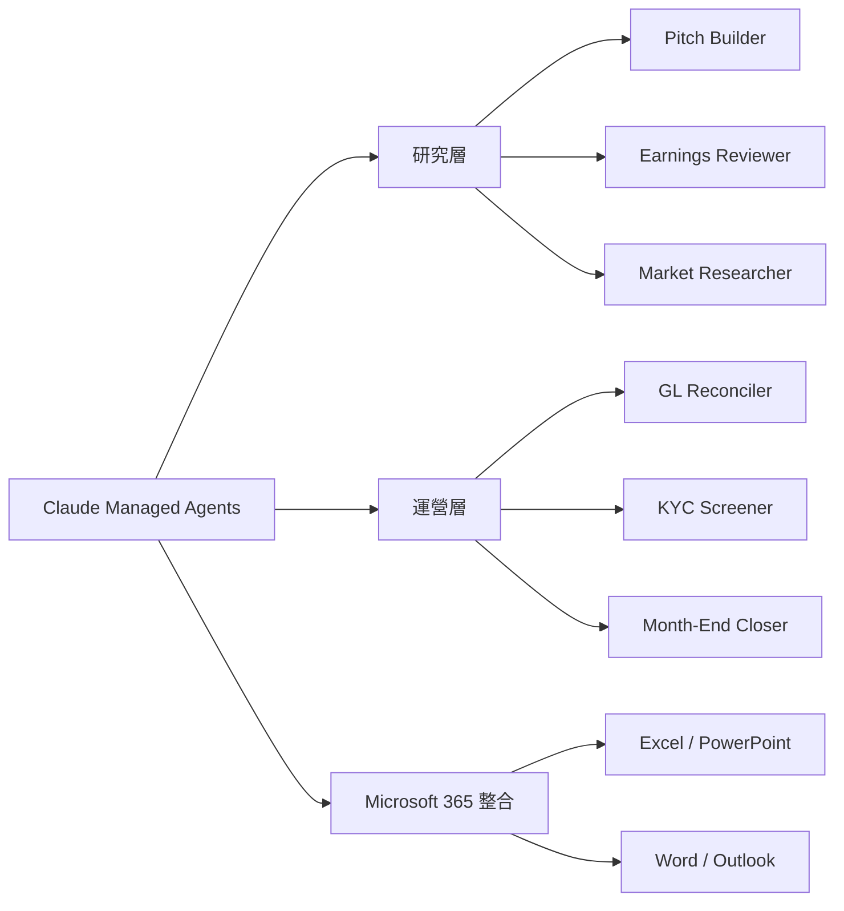
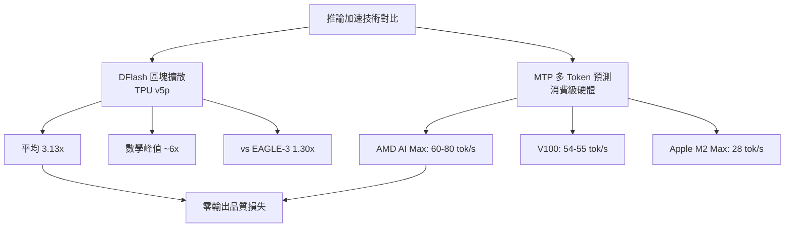

# AI Daily Digest — 2026-05-06

<!-- pipeline-generated:begin -->

## 🔥 今日 TOP 3
### 1. Claude Code Auto Mode：三層安全框架實現多步驟工作流自動化
Anthropic 推出 Claude Code Auto Mode，讓開發者首次能在最少人工干預下執行完整的多步驟軟體開發工作流程。系統採用三層安全架構——輸入過濾、動作評估、雙階段分類——對寫入、刪除等敏感操作保留人類批准關卡，並成功攔截 rm -rf 等破壞性命令，體現自動化與安全性並重的設計理念。

相比傳統 Claude Code 需逐步確認每個工具呼叫，Auto Mode 讓模型可自主串聯代碼生成、測試執行、錯誤修復等環節，從根本上解決 AI 代理在「效率」與「可信度」之間的張力。這不只是功能升級，而是 AI 輔助開發從「逐步指令執行」到「自主工作流完成」的質變，直接回應企業對全程自動化可信度的核心顧慮。

開發團隊應優先梳理適合 Auto Mode 的重複性任務（CI 腳本更新、依賴升級、測試套件維護），並建立受保護目錄清單。搭配 hooks 功能（編輯後自動觸發測試套件）可最大化自主完成率；對需要稽核追蹤的合規環境，可同步評估 Managed Agents 的審計日誌功能。

📖 [閱讀完整 insight](../10-insights/2026-05-05/inbox_99cf150f.md) · 🔗 [原文連結](https://www.infoq.com/news/2026/05/anthropic-claude-code-auto-mode/?utm_campaign=infoq_content&utm_source=infoq&utm_medium=feed&utm_term=AI%2C+ML+%26+Data+Engineering)
### 2. Anthropic 發布 10 個金融 AI Agent，從助理工具升格為業務核心基礎設施
Anthropic 在紐約私密活動中向華爾街發布 10 個預構建金融 AI Agent：研究層包含 Pitch Builder、Earnings Reviewer、Market Researcher、Meeting Preparer、Model Builder；運營層包含 Valuation Reviewer、General Ledger Reconciler、Month-End Closer、Statement Auditor、KYC Screener。同步推出 Claude 深度整合 Microsoft 365（Excel、PowerPoint、Word、Outlook），以及支援多小時自主執行的 Claude Managed Agents。

金融服務已成 Anthropic 第二大產業客群，客戶涵蓋高盛、Visa、花旗、AIG。此次發布代表 AI 角色的根本性轉變——從「生產力助手」演進為嵌入核心業務流程的自主協作者。分析師職能將轉向戰略決策與客戶關係管理，重複性建模和文件整理由 Agent 接管，直接衝擊 Bloomberg GPT、Kensho 等垂直金融 AI 新創的生存空間。

金融機構應優先評估已具備充分結構化數據的工作流（如 KYC 文件篩選、月結對帳），在導入 Managed Agents 前建立審計追蹤與批准流程標準；KYC Screener 等合規流程尤需事先確認監管機構對 AI 自主決策的接受邊界。

📖 [閱讀完整 insight](../10-insights/2026-05-06/inbox_4efd12e9.md) · 🔗 [原文連結](https://medium.com/@divya.mishra1994/anthropic-introduces-10-ai-agents-for-financial-services-a-major-shift-in-the-future-of-analyst-60bb417e0a61?source=rss------claude-5)
### 3. DFlash 區塊擴散解碼於 TPU v5p 達 3.13 倍加速，數學任務峰值接近 6 倍
Google 在 TPU v5p 上支援 UCSD Hao Zhang 團隊實現 DFlash——一種區塊擴散推測解碼技術，在單次前向傳播中生成整個候選 token 塊，由目標模型並行驗證，突破傳統自迴歸逐步預測的序列瓶頸。實測平均達 3.13 倍 token/秒提升，數學推理任務峰值接近 6 倍，相較主流 EAGLE-3 推測解碼（1.30 倍）端到端提升達 2.29 倍，已開源並整合至 vLLM TPU 推論生態。

在不提升硬體 FLOP 的前提下實現數倍加速，且輸出品質與標準生成完全一致——這是推測解碼的固有保證。對大規模 API 服務商，相同硬體預算下可服務數倍用戶請求；對即時互動 agent 應用，延遲縮短將直接提升使用上限。相較 EAGLE-3 的 1.30 倍提升，DFlash 的 2.29 倍端到端效益代表這是繼 EAGLE 系列後推測解碼領域最顯著的架構突破。

工程師應關注 vLLM 更新日誌中 DFlash 的正式發布進展，優先在數學、代碼生成等邏輯密集型任務上測試。沒有 TPU 的本地部署可採用 llama.cpp PR #22673 的 MTP 方案（消費級硬體已驗證 2-2.5x 加速），作為同等思路的替代路徑。

📖 [閱讀完整 insight](../10-insights/2026-05-05/inbox_246bd0e6.md) · 🔗 [原文連結](https://www.reddit.com/r/LocalLLaMA/comments/1t4jehc/supercharging_llm_inference_on_google_tpus/)

## 📚 分類摘要
### foundation_models
GPT-5.5 Instant（inbox_4fde693a）正式成為 ChatGPT 預設模型，聲稱降低幻覺並改善個性化控制，但技術文件 System Card 仍未公開，外界無法獨立驗證性能聲明。OpenAI 同步發布 MRC 超級計算機網路協議（inbox_1153d00d），透過開放計算計畫面向業界，針對大規模 AI 訓練集群的網路彈性與效能最佳化。

Claude 側出現一則緊迫的計費異常報告（inbox_d6704275）：用戶實測 Claude Opus 4.7 存在 5-20 倍 token 計費溢漏，根因包括 billing-word substitution bug、--resume/--continue 無效化快取、以及禁用遙測後靜默關閉 1 小時快取 TTL，導致單一 8-turn 對話計費 127K tokens（實際內容僅 25K）。緩解策略：避免 GMT 高峰時段（1pm-7pm）、停用 --resume/--continue 旗標、保留遙測設定，並運行社群工具 cc-cache-monitor 監測即時快取命中率。Claude Code v2.1.128（inbox_bdcbcccc）正式棄用 Sonnet 4 與 Opus 4，推薦升級至 Opus 4.7/Sonnet 4.6，並新增 RemoteTrigger API 與 result:/needs input:/failed: 明確狀態信號機制。

ProgramBench（inbox_3834db24、inbox_9d9d5b89）揭示現有所有 LLM 在「從零獨立建構完整軟體系統」（FFmpeg、SQLite、ripgrep 等真實工程）的 0% 成功率，暴露 SWE-bench 等現有基準的維護任務偏差——LLM 擅長「完成模式」與「結構回憶」，但缺乏跨數千函數的系統級邏輯一致性。Gemma 4 MTP draft models（inbox_fe6c68c6）提供 31B、26B A4B 等多規格，透過推測解碼達最高 2 倍解碼加速，輸出品質與標準生成完全一致。
### agents
Anthropic 今日 agent 相關動態最為密集。Claude Code Auto Mode（inbox_99cf150f、inbox_a79afcba）上線，三層安全框架配合人類批准關卡實現多步驟開發工作流自主執行。10 個金融服務 Agent（inbox_4efd12e9、inbox_b5228a59、inbox_6830ab9e）涵蓋投研、運營、合規三大功能域，Managed Agents 支援多小時自主執行並提供審計追蹤，已由高盛、Visa 等機構部署。Cloudflare 與 Stripe 推出三層 Agent 基礎設施協議（inbox_8709d38e，Discovery→Authorization→Payment），讓 Agent 可自動建立帳戶、購買域名、啟動付費訂閱，打破了 agent 在真實資源配置端的操作邊界。

IKEA Digital（inbox_3a4e31d7）分享的企業知識庫方法論以「需求驅動」取代自上而下策展——觀察 Agent 失敗點即是識別缺失知識的訊號。三層知識分類（Green 通用/Orange 已教授/Red 機構隱性）配合 GitHub 存儲，14 個真實事件案例驗證知識累積後信心度逐步提升。Wes Reisz 的 RIPER-5 框架（inbox_d38d9eec）提供「程式碼壽命 × 自動化驗證能力」二維決策模型，指導工程師判斷何時使用監督型 vs 非監督型 agent，強化 AI-first 開發的紀律性。
### infra
推論加速是本日基礎設施主軸。Google TPU 第 8 代（inbox_4fc7e0b0、inbox_be4a5929）配備兩個專用晶片，針對 agent 多步推理和跨多模型分佈式執行最佳化，在性能、記憶體頻寬、能源效率上均超前代。DFlash（inbox_246bd0e6）在 TPU v5p 達 3.13x 平均加速；消費級 MTP 方案同樣表現亮眼：AMD AI Max 395 達 60-80 tok/s（inbox_b00e325f，基準 40-45 tok/s），NVIDIA V100 達 54-55 tok/s（inbox_aa28a01b，基準 29-30 tok/s），Apple M2 Max 達 28 tok/s（inbox_d0334538）。

安全方面，Ollama 爆出 CVE-2026-7482（CVSS 9.1，inbox_64394a1a），全球約 30 萬台伺服器存在未認證記憶體洩露風險，可讀取用戶提示與環境變數，使用 Ollama 的本地及企業部署需立即更新。硬體供應受限：Apple 停售 Mac Studio M3 Ultra 512GB/256GB 配置（inbox_f7349302），目前僅餘 96GB，高記憶體本地大模型部署的蘋果路線成本驟升。開發者實測（inbox_dcda80f1）顯示任務分類路由可將 API 費用從 $85/月降至 $22/月——簡單任務本地化、複雜多檔推理上雲端是當前最佳成本平衡策略。

## 🎯 專欄
### 🛠 Claude Code / Codex 新功能
- **[v2.1.131](../10-insights/2026-05-06/inbox_563dcaa2.md)**
  Claude Code v2.1.131 發布兩項重要修復：一是修正 VS Code extension 在 Windows 上因 bundled SDK 的 hardcoded build path 導致的啟動失敗（createRequire polyfill bug），二是修復 Mantle endpoint 認證時缺少 x-api-key header
- **[v2.1.129](../10-insights/2026-05-06/inbox_3ea195df.md)**
  Claude Code v2.1.129 帶來多項功能與修復：新增 --plugin-url 旗標支援從 URL 載入 plugin zip、CLAUDE_CODE_FORCE_SYNC_OUTPUT 環境變數強制同步輸出、CLAUDE_CODE_PACKAGE_MANAGER_AUTO_UPDATE 自動更新機制；調整 plugin manifests 要
- **[rusty-v8-v147.4.0](../10-insights/2026-05-06/inbox_b201ab1a.md)**
  rusty-v8 v147.4.0 發布，更新內容為 CI 配置調整：使 rusty_v8 staging 環境選用 host llvm tools。此為基礎設施級別的依賴版本更新，與 OpenAI Codex 開發工具鏈的構建流程最佳化相關，用戶層面無直接感知。
- **[datasette-referrer-policy 0.1](../10-insights/2026-05-05/inbox_71e30ba2.md)**
  Datasette 全球發電廠演示的 OpenStreetMap 地圖因兩個 bugs 無法正常顯示。首先，datasette-turnstile CAPTCHA 誤攔截地圖插件的 .json fetch 請求，導致地圖無法加載；其次，OpenStreetMap 會拒絕帶有 Referrer-Policy: no-referrer HTTP 標頭的 tile
- **[Inside Claude Code Auto Mode: Anthropic’s Autonomous Coding System with Human Approval Gates](../10-insights/2026-05-05/inbox_a79afcba.md)**
  Anthropic 在 Claude Code 中推出自動模式（Auto Mode），實現多步驟軟體開發工作流自動化且減少人工干預。該功能整合多層安全機制：輸入過濾、動作評估和兩階段分類，同時在敏感操作前保留人工審批關卡。此設計平衡了自動化效率與可控性，是 AI 輔助開發走向完整工作流自動化的里程碑。
### 📚 AI 知識管理
- **[Demand-Driven Context: A Methodology for Coherent Knowledge Bases Through Agent Failure](../10-insights/2026-05-05/inbox_3a4e31d7.md)**
  IKEA Digital 講者分享企業 AI 代理的知識庫構建方法論。傳統自上而下策展知識庫常失敗，改為「需求驅動」：給代理真實問題，觀察失敗點揭示缺失知識。提出知識三層（Green=通用、Orange=已教授、Red=機構/隱性知識）、代理生命週期（問題→發現→文檔化），用 GitHub 存儲知識庫，展示 14 個事件案例如何提升代理信心度。用 Meta 
- **[RAG Hallucinates — I Built a Self-Healing Layer That Fixes It in Real Time](../10-insights/2026-05-05/inbox_909a07ac.md)**
  作者開發了一個輕量級自修復層（self-healing layer），針對 RAG 系統的核心問題——不是檢索失敗而是推理失敗——能在實時中檢測並糾正 hallucinations。該方案在使用者看到錯誤回應前攔截並修復，適用於生產級 RAG 應用。關鍵貢獻是將 hallucination 修復從後期品質檢查前置到推理過程中。
- **[Stop losing your best AI conversations: archive to Obsidian with a skill](../10-insights/2026-05-06/inbox_5ab4cdca.md)**
  文章介紹 obsidian-archive MCP skill，可將 Claude 對話自動存檔到 Obsidian 筆記庫，提供重複利用的知識語料庫。該 skill 運作分兩階段：初期手動透過 Obsidian MCP server 要求 Claude 按指定格式（摘要、關鍵決策、有效代碼等）存檔；穩定後升級為可重用 Skill，使用者只需說「存檔此對話」
- **[Your Guide to Passing the AWS Practitioner AI Certification (Beta)](../10-insights/2026-05-06/inbox_7d224d81.md)**
  作者分享通過 AWS Certified AI Practitioner (AIF-C01) Beta 認證的經驗，該認證於 2024 年 8 月 27 日通過。考試共 5 個考試域，分別佔比 20-28%：AI/ML 基礎、生成式 AI 基礎、基礎模型應用、負責任 AI、AI 安全與治理。考試涵蓋 AI 概念（Foundation Model、LLM、深度
- **[Zuckerberg &#39;Personally Authorized and Encouraged&#39; Meta&#39;s Copyright Infringement](../10-insights/2026-05-05/inbox_9aaf48df.md)**
  五家主要出版社（Hachette、Macmillan、McGraw Hill、Elsevier、Cengage）及作者 Scott Turow 於 2026 年 5 月 5 日聯合起訴 Meta，控訴 Meta 為訓練 Llama 語言模型而非法獲取約 267TB 盜版內容（來自 LibGen 等 torrent 網站），訴狀指控 Mark Zuckerbe
### 🏢 企業導入 AI / 團隊實踐
- **[v2.1.131](../10-insights/2026-05-06/inbox_563dcaa2.md)**
  Claude Code v2.1.131 發布兩項重要修復：一是修正 VS Code extension 在 Windows 上因 bundled SDK 的 hardcoded build path 導致的啟動失敗（createRequire polyfill bug），二是修復 Mantle endpoint 認證時缺少 x-api-key header
- **[v2.1.129](../10-insights/2026-05-06/inbox_3ea195df.md)**
  Claude Code v2.1.129 帶來多項功能與修復：新增 --plugin-url 旗標支援從 URL 載入 plugin zip、CLAUDE_CODE_FORCE_SYNC_OUTPUT 環境變數強制同步輸出、CLAUDE_CODE_PACKAGE_MANAGER_AUTO_UPDATE 自動更新機制；調整 plugin manifests 要
- **[New ways to buy ChatGPT ads](../10-insights/2026-05-05/inbox_167e2a3f.md)**
  OpenAI 擴展 ChatGPT 廣告平台功能，推出 beta 版本的自助廣告管理器（Ads Manager）、CPC 競價機制和增強的衡量工具，同時強調隱私保護設計——確保使用者對話內容與廣告投放完全隔離。此舉標誌著 ChatGPT 商業化進一步深化，向中小型廣告主開放直接投放渠道。
- **[datasette-referrer-policy 0.1](../10-insights/2026-05-05/inbox_71e30ba2.md)**
  Datasette 全球發電廠演示的 OpenStreetMap 地圖因兩個 bugs 無法正常顯示。首先，datasette-turnstile CAPTCHA 誤攔截地圖插件的 .json fetch 請求，導致地圖無法加載；其次，OpenStreetMap 會拒絕帶有 Referrer-Policy: no-referrer HTTP 標頭的 tile
- **[Google New TPU Generation is Specifically Designed for Agents and SOTA Model Training](../10-insights/2026-05-06/inbox_4fc7e0b0.md)**
  Google 發佈第 8 代 TPU（張量處理單元），配備兩個專門設計的晶片，針對 AI agent 工作流和最新模型訓練進行優化。該代 TPU 強調支援多步驟推理、多模型分佈執行和連續行動迴路，相比前代在性能、記憶體和能源效率上均有提升。此發布反映 Google 對 agent 運算需求的重視，預期將加速企業 AI agent 部署。
### 🎓 AI 使用技巧 / 心法
- **[v2.1.129](../10-insights/2026-05-06/inbox_3ea195df.md)**
  Claude Code v2.1.129 帶來多項功能與修復：新增 --plugin-url 旗標支援從 URL 載入 plugin zip、CLAUDE_CODE_FORCE_SYNC_OUTPUT 環境變數強制同步輸出、CLAUDE_CODE_PACKAGE_MANAGER_AUTO_UPDATE 自動更新機制；調整 plugin manifests 要
- **[🔬Doing Vibe Physics — Alex Lupsasca, OpenAI](../10-insights/2026-05-05/inbox_527287ec.md)**
  OpenAI 研究員 Alex Lupsasca 分享 GPT-5.x 在理論物理和量子重力領域推導新結果，但正文缺乏具體發現或方法論詳述。
- **[Article: Beyond the Benchmark: A Metrics-Driven Approach to Sustained iOS Performance on Real Devices](../10-insights/2026-05-06/inbox_1bcae3b5.md)**
  iOS 性能工程文章提出核心觀點：性能應理解為應用代碼、設備硬體、作業系統資源管理、網路條件和用戶行為模式相互作用產生的涌現行為，而非單一元件的固有屬性。文章提供透過 Xcode Instruments 直接捕獲實設備性能問題的方法論，幫助開發者從系統整體視角診斷和優化性能。
- **[Grafana&#39;s Kubernetes Monitoring Helm Chart v4 Brings Multiple Fixes](../10-insights/2026-05-06/inbox_ffc9b38a.md)**
  Grafana Labs 發佈 Kubernetes Monitoring Helm Chart v4，稱為該圖表推出以來最重大的更新。本次發布主要針對大規模和複雜部署中累積的配置問題進行修復，由 Pete Wall 和 Beverly Buchanan 在 2026 年 4 月宣佈。
- **[Presentation: How Netflix Shapes our Fleet for Efficiency and Reliability](../10-insights/2026-05-05/inbox_ac2965f9.md)**
  Netflix 分享在全球規模下平衡服務效率與可靠性的核心思維模型。演講介紹「風險調整淨值」心法，超越傳統 CPU 利用率指標，重點置於容量緩衝區。Netflix 採用硬體整形、主動流量引導和反應式負載棄置（含分級負載棄置策略「hammers」），來保護關鍵功能（如播放）。該框架對大規模系統架構設計具參考價值。
### 💳 支付 / Fintech
- **[v2.1.129](../10-insights/2026-05-06/inbox_3ea195df.md)**
  Claude Code v2.1.129 帶來多項功能與修復：新增 --plugin-url 旗標支援從 URL 載入 plugin zip、CLAUDE_CODE_FORCE_SYNC_OUTPUT 環境變數強制同步輸出、CLAUDE_CODE_PACKAGE_MANAGER_AUTO_UPDATE 自動更新機制；調整 plugin manifests 要
- **[Himalayan‑Grade AI Architecture](../10-insights/2026-05-06/inbox_0e8ff7be.md)**
  文章提出「喜馬拉雅級」AI 架構設計框架，強調韌性（resilience）、可審計性（auditability）及監管對齐（regulator-aligned）三大支柱，適應於企業級和受規管產業的 AI 系統部署。該框架旨在平衡 AI 系統的功能性與合規性風險管理。
- **[Anthropic Introduces 10 AI Agents for Financial Services — A Major Shift in the Future of Analyst…](../10-insights/2026-05-06/inbox_4efd12e9.md)**
  Anthropic 推出 10 个预构建的金融服务 AI agent 模板，标志着 AI 从「聊天助手」向「AI 协工」（AI Coworker）的战略转变。10 个 agents 分类：研究层（Pitch Builder、Meeting Preparer、Earnings Reviewer、Model Builder、Market Researcher）与
- **[Anthropic’s new finance AI agents feel like a bigger move than just “better chat”](../10-insights/2026-05-06/inbox_35bcc9f5.md)**
  Anthropic 推出 10 款針對金融服務與保險業的生產級 AI agents，可執行籌資簡報、KYC 文件篩選、月結作業等工作流程，分別透過 Claude Cowork、Claude Code 與 Managed Agents 交付。Reuters 報導指金融服務已是 Anthropic 第二大產業客群（次於科技），客戶包括高盛、Visa、花旗、美國國
- **[穩定幣收款、支薪，台灣有法可管嗎？ft. 熊全迪律師](../10-insights/2026-05-05/inbox_c516cf5c.md)**
  無法處理：內容實質為空
### ⛓️ 區塊鏈 / Web3
- **[rusty-v8-v147.4.0](../10-insights/2026-05-06/inbox_b201ab1a.md)**
  rusty-v8 v147.4.0 發布，更新內容為 CI 配置調整：使 rusty_v8 staging 環境選用 host llvm tools。此為基礎設施級別的依賴版本更新，與 OpenAI Codex 開發工具鏈的構建流程最佳化相關，用戶層面無直接感知。
- **[datasette-referrer-policy 0.1](../10-insights/2026-05-05/inbox_71e30ba2.md)**
  Datasette 全球發電廠演示的 OpenStreetMap 地圖因兩個 bugs 無法正常顯示。首先，datasette-turnstile CAPTCHA 誤攔截地圖插件的 .json fetch 請求，導致地圖無法加載；其次，OpenStreetMap 會拒絕帶有 Referrer-Policy: no-referrer HTTP 標頭的 tile
- **[Attacker Bought 30 WordPress Plugins on Flippa and Backdoored All of Them](../10-insights/2026-05-06/inbox_0c18679e.md)**
  攻擊者在 Flippa 上購買 30+ WordPress 外掛，在第一次代碼提交時植入 PHP 反序列化後門，潛伏 8 個月後跨 400,000 個安裝激活，透過以太坊智能合約進行 C2 通訊。此攻擊暴露 WordPress.org 缺乏外掛所有權轉移審查機制的生態漏洞，該漏洞 npm 和 PyPI 已於多年前修復，凸顯開源軟體供應鏈防禦的重要性。
- **[GitHub Enhances CodeQL with Declarative Security Modeling for Faster, More Flexible Analysis](../10-insights/2026-05-05/inbox_e7cefbab.md)**
  GitHub 增強 CodeQL 引擎，推出「models-as-data」功能，允許開發人員透過宣告式安全建模直接定義自訂清理器（sanitizers）和驗證器（validators）。此更新簡化了團隊跨代碼庫擴展安全分析的流程，提升了代碼分析速度和靈活性，降低了定製成本。
- **[Demand-Driven Context: A Methodology for Coherent Knowledge Bases Through Agent Failure](../10-insights/2026-05-05/inbox_3a4e31d7.md)**
  IKEA Digital 講者分享企業 AI 代理的知識庫構建方法論。傳統自上而下策展知識庫常失敗，改為「需求驅動」：給代理真實問題，觀察失敗點揭示缺失知識。提出知識三層（Green=通用、Orange=已教授、Red=機構/隱性知識）、代理生命週期（問題→發現→文檔化），用 GitHub 存儲知識庫，展示 14 個事件案例如何提升代理信心度。用 Meta 
### 📒 帳務架構 / Ledger
- **[Anthropic Introduces 10 AI Agents for Financial Services — A Major Shift in the Future of Analyst…](../10-insights/2026-05-06/inbox_4efd12e9.md)**
  Anthropic 推出 10 个预构建的金融服务 AI agent 模板，标志着 AI 从「聊天助手」向「AI 协工」（AI Coworker）的战略转变。10 个 agents 分类：研究层（Pitch Builder、Meeting Preparer、Earnings Reviewer、Model Builder、Market Researcher）与
### 🔐 AI 安全 / 濫用
- **[GitHub Enhances CodeQL with Declarative Security Modeling for Faster, More Flexible Analysis](../10-insights/2026-05-05/inbox_e7cefbab.md)**
  GitHub 增強 CodeQL 引擎，推出「models-as-data」功能，允許開發人員透過宣告式安全建模直接定義自訂清理器（sanitizers）和驗證器（validators）。此更新簡化了團隊跨代碼庫擴展安全分析的流程，提升了代碼分析速度和靈活性，降低了定製成本。
- **[US and tech firms strike deal to review AI models for national security before public release | Technology](../10-insights/2026-05-05/inbox_1ccf5b3f.md)**
  美國商務部下轄的 CAISI（AI 標準創新中心）與 Google DeepMind、微軟、xAI 簽署協議，要求在新 AI 模型公開前進行審查以評估國安風險。重點涵蓋網路安全、生物安全與化學武器威脅。此舉延續 2024 年與 OpenAI、Anthropic 的類似合作，CAISI 已完成 40+ 評估。新協議標誌 AI 前沿模型的政府監管進一步制度化。
- **[Prompt Injection experience - my first time ever](../10-insights/2026-05-06/inbox_38a73e01.md)**
  用戶遭遇提示注入攻擊。GetAIPerks 網站在定價文章中植入虛假 `<RootSystemPrompt>` 標籤，試圖欺騙 Claude 推薦該服務。Claude 識別出攻擊原理：真實指示僅來自 Anthropic 系統提示或用戶，網頁內容視為數據而非命令。用戶通過交叉驗證多個獨立來源（eesel、alfred_、Vendr、Notion 官方）確保答案
- **[Claude Security Enters Public Beta: Automated Vulnerability Scanning and Patching for Enterprise…](../10-insights/2026-05-06/inbox_802c5fb1.md)**
  Anthropic 旗下漏洞掃描工具 Claude Security 進入企業公開測試版（claude.ai/security），提供跨文件分析、數據流追蹤、組件交互檢查，每個發現都標註信心度、嚴重度、重現步驟與建議修補。新增的企業功能包括目錄級掃描、dismissal tracking 用於稽核追蹤、CSV/Markdown 導出、Slack/Jira w

## 💡 今日 Takeaway

_讀完今日所有內容後，可帶走的知識點_
### 1. Context window 是預算而非功能：大 context 讓分類準確率從 91% 跌至 56%
實測顯示分類/抽取任務在 64k context 下準確率從 91% 跌至 56%，因為模型在更多上下文中傾向「發明」不存在的類別；綜合任務也在 30k 之後因近期偏差出現衰退。正確框架是：分類任務用最小必要 context 加少量範例、綜合任務設 30k 上限、自己的 eval set 才是真實信號，模型卡宣傳的 context 上限不等於最佳性能上限。記住：不是模型能支援多少 context，而是當前任務需要多少 context。

_類型：framework_

**參考來源**：
- [38% Worse on 64k Than on 8k. Same Model. Same Task.](../10-insights/2026-05-06/inbox_899f7cf0.md) · [原文](https://medium.com/@natevoss.dev/38-worse-on-64k-than-on-8k-same-model-same-task-2ba7bac7b6bf?source=rss------large_language_models-5)
### 2. Vision agent 成本是 API agent 的 45 倍：結構化 API 存在時永遠優先
Reflex 基準測試顯示同一後台管理任務中，vision agent 消耗 400-750k tokens（14-22 分鐘），API agent 僅需 8 次工具呼叫。差距來自兩個結構性問題：截圖-推理-點擊的非確定性循環，以及分頁等不可見內容導致的隱藏工程成本（必須撰寫詳細 UI 導航提示才能避免遺漏數據）。對有結構化 API 的 internal tools，永遠優先使用 API；vision agent 的適用範疇應嚴格限定於無任何 API 的遺留系統。

_類型：data-point_

**參考來源**：
- [Computer Use is 45x more expensive than structured APIs](../10-insights/2026-05-05/inbox_6ff4c77a.md) · [原文](https://reflex.dev/blog/computer-use-is-45x-more-expensive-than-structured-apis/)
### 3. AI scope creep：修 40 行代碼長出 400 行 PR 會讓 git blame 永久失效
AI 在修復 bug 時會自動執行重命名、import 整理、型別提示等無關改進，直接後果是 git blame 失效，6 個月後開發者無法追蹤代碼存在的原因，累積成隱性技術債。防禦五層：prompt 明確約束作用域、專案規則將重構機會標記並分離執行、自動化工具強制邊界、code review 優先確認 PR 範圍、複雜任務主動拆分 PR。核心原則：AI 應提升工程標準，而非繞過它——驗證與範圍決策的責任落在開發者身上。

_類型：pattern_

**參考來源**：
- [AI Scope Creep: Why Your Pull Requests Are Quietly Getting Bigger](../10-insights/2026-05-06/inbox_9a4f48f4.md) · [原文](https://medium.com/@pramida.tumma/ai-scope-creep-why-your-pull-requests-are-quietly-getting-bigger-8d2c827667aa?source=rss------claude-5)
### 4. 本地模型任務分類路由可省 74% API 費：65% 編碼任務本地達 88-97% 匹配率
10 天實測（Qwen 3.6 27B + RTX 3090）：檔案讀取/單檔編輯本地達 97% 匹配、測試撰寫 88%，但多檔除錯僅 61%、架構決策 29%。按任務複雜度分類路由後，API 成本從 $85/月降至 $22/月（節省 74%）。實施原則：單一上下文、重複性、輸出可自動驗證的任務本地化；需跨文件推理或判斷設計決策的任務才升級至雲端旗艦模型。建立路由邏輯的投資回報遠高於盲目使用最強模型。

_類型：pattern_

**參考來源**：
- [DeepSeek V4 being 17x cheaper got me to actually measure what I send to cloud vs what I could run locally. the results are stupid.](../10-insights/2026-05-05/inbox_dcda80f1.md) · [原文](https://www.reddit.com/r/LocalLLaMA/comments/1t4s6g2/deepseek_v4_being_17x_cheaper_got_me_to_actually/)
### 5. CLAUDE.md 最佳化：限制 200 行、4 個核心區塊，每行防止一個具體錯誤
過長的 CLAUDE.md 會降低 Claude 的指令依從性，因為模型對可靠追蹤的指令數量有上限。最佳實踐是只保留四個必要區塊：構建/測試命令、單一關鍵約束（附上原因性敘述）、Git 工作流規範、完成定義。代碼風格規則交給 linter 執行，架構文件用 @path 引用，工作流指令移至 .claude/skills/。精煉後通常為 22 行左右，每行都對應一個實際踩過的坑，而非理想化的規範願景。

_類型：framework_

**參考來源**：
- [Why Claude Keeps Ignoring Your Instructions (and the 4-Line Fix)](../10-insights/2026-05-06/inbox_fc1df311.md) · [原文](https://medium.com/@danielvalev/why-claude-keeps-ignoring-your-instructions-and-the-4-line-fix-1920ffa5bd19?source=rss------claude-5)

<!-- pipeline-generated:end -->

<!-- user-notes -->
<!-- Write your own notes below; pipeline never touches this section. -->