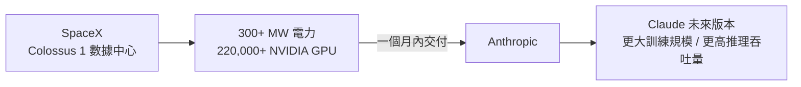

# AI Daily Digest — 2026-05-07

<!-- pipeline-generated:begin -->

## 🔥 今日 TOP 3
### 1. 多智能體五策略框架：三角色串聯架構生產數據驗證
Factory 的 Luke Alvoeiro 發表基於生產數據驗證的多智能體框架，提出五種策略分類與組合方式，核心為三角色系統：編排器（Orchestrator）全局規劃、工作者（Workers）執行、驗證器（Validator）以對抗性驗證契約把關輸出品質，三者以串聯方式運作。

此框架非學術假說，而是 Factory 生產環境的真實積累。最反直覺的發現是串聯執行優於並行——並行代理因信息不一致損失品質；按角色選擇最適模型（非全局固定）可複合放大優勢；良好架構隨模型迭代持續改進，不會被新模型淘汰。

可立即套用三原則：三角色分工 + 串聯優先 + 角色適配模型選擇。觀察重點是 Factory 是否公開五策略的量化比較數據，以及此框架能否驗證於金融、醫療等高風險域。

📖 [閱讀完整 insight](../10-insights/2026-05-06/inbox_3c17d77d.md) · 🔗 [原文連結](https://www.youtube.com/watch?v=ow1we5PzK-o)
### 2. Anthropic 獲 SpaceX 22 萬 GPU：算力月內到位
Anthropic 宣布與 SpaceX 達成算力合作協議，取得 Colossus 1 數據中心逾 300 MW 電力與超過 22 萬顆 NVIDIA GPU，協議後一個月內即可投入使用，是 Anthropic 迄今最大規模的單次基礎設施擴充。

此算力增量可能使 Anthropic 訓練能力翻數倍，直接決定下一代 Claude 的模型規模上限、推理吞吐量與服務容量，有望舒緩尖峰時段服務瓶頸，縮短與 OpenAI、Google 在算力規模上的差距。相比前一代受限的基礎設施，此次合作屬於量級躍升而非漸進改善。

觀察重點：Anthropic 的模型發布節奏是否因此加速、是否有跡象顯示正準備訓練更大規模新模型。企業 API 用戶可留意未來數月 Claude 推理速度與可用性的實際改變。

📖 [閱讀完整 insight](../10-insights/2026-05-06/inbox_012dc665.md) · 🔗 [原文連結](https://www.reddit.com/r/ClaudeAI/comments/1t5j05c/anthropic_just_secured_a_reserve/)
### 3. Atlas 推理引擎開源：Blackwell GPU 達 vLLM 三倍速
Avarok Cybersecurity 開源 Atlas 推理引擎，以純 Rust + CUDA（無 PyTorch）深度優化 NVIDIA Blackwell GB10 DGX Spark。Qwen 3.5-35B 實測 sustained 111 tok/s，比 vLLM 快 3.0–3.3 倍；Docker 映像僅 2.5GB、冷啟不到 2 分鐘，API 格式相容 OpenAI 與 Anthropic，可直接接入 Claude Code 與 Cline。

相對 vLLM 這個事實標準，3 倍效能差距極罕見，關鍵在手工調優 Blackwell SM120/121 CUDA kernel 及精簡技術棧。對 GB10 企業用戶而言，相同算力可服務 3 倍用戶，直接降低推理 TCO；同時支援 NVFP4/FP8 量化、MTP 推測解碼與前綴快取，功能不打折。

目前驗證僅限 GB10 DGX Spark，其他 Blackwell 配置需自行測試。觀察重點：社群複現廣泛硬體的進展、vLLM 的回應方向，以及 Avarok 是否擴展 AMD 支援。

📖 [閱讀完整 insight](../10-insights/2026-05-06/inbox_15458389.md) · 🔗 [原文連結](https://www.reddit.com/r/LocalLLaMA/comments/1t5p2yv/the_gb10_solution_atlas_is_now_open_source_the/)

## 📚 分類摘要
### foundation_models
企業 AI 部署本週以多模型組合為主流。Singular Bank 的 Singularity 助手整合 ChatGPT 與 Codex（inbox_e79623bf），為銀行家實現每日節省 60–90 分鐘，量化驗證自然語言推理 + 代碼生成的互補效益；Uber（inbox_1630247d）以語音 + 文字多模態 AI 在全球雙邊市場賦能司機（收益優化）與乘客（預訂加速）。OpenAI B2B Signals 研究（inbox_07af04ca）論證：從孤立工具轉向端到端 Codex 驅動代理工作流，是企業建立持久競爭優勢的核心路徑，而非單純工具採購決策。

Claude 陣營最大事件是 Anthropic-SpaceX 算力合作（inbox_012dc665, inbox_83638280）：Colossus 1 數據中心 300+ MW 電力、22 萬+ NVIDIA GPU，一個月內可投入使用，直接影響 Claude 未來版本的訓練規模上限與推理容量。技術研究面，受限提示詞（constrained prompt）相較無約束情況成本增加 73%（inbox_0fe74fb2），prefill 與 decode 兩階段成本貢獻差異顯著，對大規模 API 用戶有直接預算規劃意義。Claude Code v2.1.132（inbox_d4938234）修復 20+ 問題，涵蓋 Unicode 字符處理（Indic 聯合字元、ZWJ emoji、NFD 重音字符）、SIGINT 優雅關閉、MCP 連線重試，以及 Cursor / VS Code 1.92–1.104 / JetBrains 2025.2 跨 IDE 兼容性。

### agents
多智能體架構設計本週迎來重要框架貢獻。Factory 的 Luke Alvoeiro（inbox_3c17d77d）以生產數據驗證五策略分類框架：Orchestrator + Workers + Validator 三角色系統中，Validator 透過驗證契約（validation contracts）與對抗性驗證把關品質；串聯執行優於並行，按角色選模型可複合放大優勢，良好架構隨模型迭代改進。MCP Apps 的 Liad Yosef（inbox_db498218）展示協議層擴展：將交互式 UI 作為 MCP 訊息傳遞，在 ChatGPT、Claude、VS Code、Cursor、Copilot 等主機間保持完整交互上下文，標誌 MCP 從純文字工具回應轉向品牌化應用體驗，重新定義 agent-first 世界的應用分發模式。

生產可靠性方面，物理學家視角的 agent 設計原則（inbox_19f33c1c）與 2 年企業級開發心得（inbox_61986f58）均指向相同結論：高風險決策場景中 LLM 負責模式識別，確定性驗證層（verification layer）基於領域知識負責最終決策，不可端到端信任 LLM 輸出。Simon Willison（inbox_9174ea18）在 Heavybit 播客提出更深層問題：Claude Code 在 JSON API + SQL 場景達近零錯誤，連資深工程師也停止逐行審查，組織需重新設計整個 SDLC——代碼產出速度翻 10 倍（200→2000 行/天）時，上游設計與下游評審都成為新瓶頸。

### infra
本地推理效能本週以 Qwen 3.6 系列為主角，圍繞上下文長度、量化配置與 prefill 瓶頸三大議題展開。RTX 5090 + vLLM 0.20.1 + NVFP4 量化驗證 200k token 上下文（inbox_3143be1b）：冷快取 TTFT 69.9s，前綴快取後降至 2.8s（改善 98%），MTP 達 42.7% 接受率、生成速度 63+ tok/s；RTX 3090 以 Qwen 3.6 27B Q4_K_M + llama.cpp 最適配置（KV cache Q4_0、MTP 草稿最多 2 token）在 100k 上下文達 50 tok/s（inbox_b3636e76）。社群揭示被忽視的優化盲點：生成速度 15+ t/s 已超閱讀速，真正的使用者感知瓶頸是 prefill——64K tokens 在 Mac mini 上耗時逾 10 分鐘（inbox_c8970f8a, inbox_0f34c61d），現有 MTP 等方案主攻 decode，prefill 加速幾無社群投入，agentic work 場景（需先吸入大量上下文）受影響最大。

Atlas 推理引擎（inbox_15458389）在 Blackwell GB10 達 vLLM 3.0–3.3 倍效能，為本地部署設立新效能基準。分散式推理創新方案 larql（inbox_c0ae1216）解耦 Attention 層與模型權重至不同機器，在 Gemma 4 26B 上驗證可行性，突破單機 VRAM 限制，代碼與教學已開源可直接複現。Qwen 3.6-35B-A3B MTP 移植測試（inbox_a294de81）揭示 MTP 在稀疏 MoE 架構上加速效益遠低於密集模型（RTX 5090 Q4 僅提升 6.4% vs 27B 密集版 2–2.5 倍），暗示 MTP 與 MoE 結構存在兼容性問題。

⚠️ 今日尚有 12 個 pending items 未完成處理，上述摘要可能未涵蓋所有當日重要 insights。

## 🎯 專欄
### 🛠 Claude Code / Codex 新功能
- **[v2.1.132](../10-insights/2026-05-06/inbox_d4938234.md)**
  Claude Code 更新至 v2.1.132，修复 20+ bug 并新增功能。新增 CLAUDE_CODE_SESSION_ID 环境变量供 bash 工具使用，支持 CLAUDE_CODE_DISABLE_ALTERNATE_SCREEN=1 禁用全屏渲染。修复关键问题：外部 SIGINT 信号优雅关闭、emoji 截断损坏、vim 操作符对 NFD
- **[Singular Bank helps bankers move fast with ChatGPT and Codex](../10-insights/2026-05-06/inbox_e79623bf.md)**
  Singular Bank 构建 Singularity 内部助手，整合 ChatGPT 与 Codex，面向银行家日常工作（会议准备、投资组合分析、后续跟进），每日节省 60–90 分钟。案例验证了多模型组合在金融服务中的生产力倍增效应，为类似项目的成本收益分析提供了量化参考。
- **[How frontier enterprises are building an AI advantage](../10-insights/2026-05-06/inbox_07af04ca.md)**
  OpenAI 发布 B2B Signals 研究，分析前沿企业如何深化 AI 采纳、规模化部署 Codex 驱动的代理工作流、构建持久竞争优势。研究框架指出从单一 AI 工具应用向端到端代理自动化升级是企业差异化的关键路径。
- **[rust-v0.129.0-alpha.13](../10-insights/2026-05-07/inbox_04067241.md)**
  OpenAI Codex Rust 版本 0.129.0-alpha.13 发布。
- **[0.129.0-alpha.12](../10-insights/2026-05-06/inbox_f5766f9d.md)**
  OpenAI Codex 發布版本 0.129.0-alpha.12。發布說明為空，無法判定此版本包含的技術變更或改進內容。
### 📚 AI 知識管理
- **[Vector Databases — The Memory AI Never Had](../10-insights/2026-05-06/inbox_ea24de5c.md)**
  向量資料庫將資料存儲為 embedding vectors（數值向量），捕捉意義而非字面文本。核心機制：將查詢轉換為向量→與存儲的 embeddings 比對→使用 cosine similarity 計算相似度排序。應用包括 RAG 系統、推薦系統、異常檢測；優勢在於理解語義關係、支持非結構化資料（圖像、音頻）、實現毫秒級語義檢索。向量資料庫已成為現代 A
- **[Microsoft Azure AI Foundry](../10-insights/2026-05-06/inbox_51a4c512.md)**
  Microsoft 推出 Azure AI Foundry——統一的 AI 應用與代理工廠，用於建構、最佳化和治理 AI 應用程式。平台整合 8 大要素：(1) 模型管理（成本與效能控制），(2) 代理系統（自動化工作流），(3) 工具整合與治理，(4) 知識檢索（Foundry IQ、RAG），(5) 數據管理（微調與評估資料集），(6) 模型微調（提升可
- **[An Open Benchmark for Testing RAG on Realistic Company-Internal Data](../10-insights/2026-05-06/inbox_366e1712.md)**
  發布 EnterpriseRAG-Bench，一個基於 500k 合成公司文件的 RAG 評測基準。數據集模擬「Redwood Inference」公司，涵蓋 Slack、Gmail、Linear、Google Drive、HubSpot、Fireflies、GitHub、Jira、Confluence 等 9 個資訊源。生成流程包括：(1) 定義公司身份與
### 🏢 企業導入 AI / 團隊實踐
- **[v2.1.132](../10-insights/2026-05-06/inbox_d4938234.md)**
  Claude Code 更新至 v2.1.132，修复 20+ bug 并新增功能。新增 CLAUDE_CODE_SESSION_ID 环境变量供 bash 工具使用，支持 CLAUDE_CODE_DISABLE_ALTERNATE_SCREEN=1 禁用全屏渲染。修复关键问题：外部 SIGINT 信号优雅关闭、emoji 截断损坏、vim 操作符对 NFD
- **[Singular Bank helps bankers move fast with ChatGPT and Codex](../10-insights/2026-05-06/inbox_e79623bf.md)**
  Singular Bank 构建 Singularity 内部助手，整合 ChatGPT 与 Codex，面向银行家日常工作（会议准备、投资组合分析、后续跟进），每日节省 60–90 分钟。案例验证了多模型组合在金融服务中的生产力倍增效应，为类似项目的成本收益分析提供了量化参考。
- **[Uber uses OpenAI to help people earn smarter and book faster](../10-insights/2026-05-06/inbox_1630247d.md)**
  Uber 集成 OpenAI AI 助手与语音功能，服务于司机与乘客双边：帮助司机优化收益策略，加速乘客预订流程，覆盖全球实时出行市场。案例展示了大规模双边平台对 AI 的平衡部署，供给侧与需求侧同步受益。
- **[How frontier enterprises are building an AI advantage](../10-insights/2026-05-06/inbox_07af04ca.md)**
  OpenAI 发布 B2B Signals 研究，分析前沿企业如何深化 AI 采纳、规模化部署 Codex 驱动的代理工作流、构建持久竞争优势。研究框架指出从单一 AI 工具应用向端到端代理自动化升级是企业差异化的关键路径。
- **[Vibe coding and agentic engineering are getting closer than I&#39;d like](../10-insights/2026-05-06/inbox_9174ea18.md)**
  Simon Willison 在 Heavybit 播客中討論了一個令人不安的發現：「Vibe Coding」（非程序員無代碼審查的快速開發）與「Agentic Engineering」（資深工程師利用 AI 工具同時保持高標準）的界線正在模糊。隨著 Claude Code 等 AI 代理證明其可靠性，即使是 25 年資歷的工程師也開始不再逐行審查生成代碼，
### 🎓 AI 使用技巧 / 心法
- **[Timer-XL: A Long-Context Foundation Model for Time-Series Forecasting](../10-insights/2026-05-06/inbox_eed9ba95.md)**
  Timer-XL 是一個 decoder-only Transformer 基礎模型，針對時間序列預測任務設計且支持長上下文。文章探討此模型的內部工作原理，代表基礎模型在時間序列領域的新應用方向。
- **[Why Your Constrained Prompt Costs 73% More Decomposing Prefill vs Decode in a Real Ablation](../10-insights/2026-05-06/inbox_0fe74fb2.md)**
  本文通過實際數據實驗量化了受限提示詞（constrained prompt）的成本，發現相比無約束情況成本增加 73%。深入分解了 LLM 推理過程中 prefill（預填充）和 decode（解碼）階段的成本差異，揭示了在應用約束時需要考慮的經濟學因素。該分析對成本敏感的生產場景具有直接決策價值。
- **[Should you be polite to AI?](../10-insights/2026-05-06/inbox_0b36a011.md)**
  本文探討對 AI 系統進行禮貌交互的實用性與必要性。雖然對非生命體使用禮貌詞彙看似多餘，但文章討論了禮貌在 AI 交互中的潛在影響—無論是對模型行為、用戶習慣養成或人機關係的形塑。涉及 prompt 設計與人類心理因素。
- **[I Tested 100 Claude Prompts for Marketers — Here Are the 10 That Saved Me the Most Time](../10-insights/2026-05-06/inbox_3bb7f85b.md)**
  作者測試了 100 個 Claude 行銷提示，篩選出 10 個最省時的，包括：30 日內容日曆、LinkedIn 思想領導力格式、150 字冷郵件、5 封歡迎序列、Facebook 廣告文案鉤子、ICP 構建、內容複用、異議處理、魔鬼代言人、批量內容生成。文章核心數據是內容工作從 3 小時壓縮到 20 分鐘，單個提示如月度日曆可在 60 秒內生成（原本需半
- **[The Prompt Engineering Advice Everyone Repeats Is Missing the Most Important Part](../10-insights/2026-05-06/inbox_d5bf7832.md)**
  無法從提供的 RSS feed 取得文章內容。標題暗示該文批評 prompt engineering 常見建議中遺漏的重要環節，但缺乏摘要或內文資訊以判斷具體論點。
### 💳 支付 / Fintech
- **[西聯匯款發穩定幣，為何要對抗 SWIFT？](../10-insights/2026-05-06/inbox_ebea1caf.md)**
  Blocktrend 區塊鏈媒體文章，標題涉及西聯穩定幣與 SWIFT 競爭。此篇內容屬區塊鏈/金融領域，非 AI 相關。
### ⛓️ 區塊鏈 / Web3
- **[Singular Bank helps bankers move fast with ChatGPT and Codex](../10-insights/2026-05-06/inbox_e79623bf.md)**
  Singular Bank 构建 Singularity 内部助手，整合 ChatGPT 与 Codex，面向银行家日常工作（会议准备、投资组合分析、后续跟进），每日节省 60–90 分钟。案例验证了多模型组合在金融服务中的生产力倍增效应，为类似项目的成本收益分析提供了量化参考。
- **[How frontier enterprises are building an AI advantage](../10-insights/2026-05-06/inbox_07af04ca.md)**
  OpenAI 发布 B2B Signals 研究，分析前沿企业如何深化 AI 采纳、规模化部署 Codex 驱动的代理工作流、构建持久竞争优势。研究框架指出从单一 AI 工具应用向端到端代理自动化升级是企业差异化的关键路径。
- **[rust-v0.129.0-alpha.13](../10-insights/2026-05-07/inbox_04067241.md)**
  OpenAI Codex Rust 版本 0.129.0-alpha.13 发布。
- **[0.129.0-alpha.12](../10-insights/2026-05-06/inbox_f5766f9d.md)**
  OpenAI Codex 發布版本 0.129.0-alpha.12。發布說明為空，無法判定此版本包含的技術變更或改進內容。
- **[rust-v0.129.0-alpha.11](../10-insights/2026-05-06/inbox_a72b8d76.md)**
  OpenAI Codex 發布 Rust 實現的版本 0.129.0-alpha.11。發布說明為空，無法判定此版本對 Rust 實現的具體改進。
### 🔐 AI 安全 / 濫用
- **[The GB10 Solution Atlas is now open source, the inference engine made for the community with breakneck inference speeds (Qwen3.6-35B-FP8 100+ tok/s)](../10-insights/2026-05-06/inbox_15458389.md)**
  Atlas 推理引擎（Avarok Cybersecurity）開源發布，純 Rust + CUDA 為 NVIDIA Blackwell GPU（GB10 DGX Spark）優化。性能亮點：Qwen 3.5-35B 達 130 tok/s peak / 111 t/s sustained，比 vLLM 快 3.0-3.3 倍；支援 NVFP4、FP8 量
- **[Claude just saved me from sending money to a scammer and now I feel 90 years old](../10-insights/2026-05-06/inbox_4d0a9300.md)**
  Reddit 用戶分享用 Claude 成功檢驗釣魚郵件的經歷。用戶收到冒充廠商的可疑電郵，要求更新付款資訊，內容包括真實專案參考與相同簽名格式，差點就被騙。貼文給 Claude 後，Claude 立即指出多個操縱手法：虛假緊迫感、異常付款路由、微妙壓力措辭。用戶推測 Claude 背後有專門的「詐騙檢查整合」功能。該貼文反映出 AI 詐騙手法日益精進，以至

## 💡 今日 Takeaway

_讀完今日所有內容後，可帶走的知識點_
### 1. AI「翻譯失敗」比幻覺更危險：無聲的知識遺漏才是最難察覺的缺陷
幻覺（hallucination）留下可驗證的錯誤痕跡（虛構引用、錯誤事實），而翻譯失敗（translation failure）是 AI 基於對使用者能力的假設主動約束回應——結果技術正確但本質不完整，使用者甚至不知道自己漏掉了什麼，幾乎無法偵測。解法是在提示中明確說明使用者背景與期望深度（如「我是資深工程師，請完整說明，不省略假設」），或在 system prompt 設定「完整輸出，不因推測用戶能力而縮略」，將透明度責任前移至提示設計階段。

_類型：framework_

**參考來源**：
- [AI Hallucination or Lost in Translation?](../10-insights/2026-05-07/inbox_de6fd644.md) · [原文](https://medium.com/@beharterakaj/ai-hallucination-or-lost-in-translation-0d50da3b621f?source=rss------claude-5)
### 2. 編排能力是 AI 時代的核心競爭力：問題定義優先於工具熟練度
同一模型在多輪觀察、修正、迭代的代理循環下，產出品質遠優於單次查詢；問題定義正確時工具加速達標，問題定義錯誤時只會更快製造垃圾。競爭優勢因此從工具熟練度轉向問題分析、流程設計與迭代指導能力，具備深度領域知識的專家因對問題的理解最精準，是最有槓桿效應的 AI 使用者。設計 AI 工作流時應優先投資問題定義環節，而非持續追逐更新的工具。

_類型：framework_

**參考來源**：
- [It’s Not the Tool. It’s the Orchestrator.](../10-insights/2026-05-07/inbox_dacfab4c.md) · [原文](https://medium.com/@kicaromand/its-not-the-tool-it-s-the-orchestrator-07803a5eb72f?source=rss------large_language_models-5)
### 3. 「驗證先於構建」：AI 產品的市場契合不能由輸出量替代
最常見的 AI 創業失敗模式是倒置順序——先構建精緻自動化流程，再期望市場自然接受，結果高產量零收入。正確路徑是先以 5 次定向客戶對話驗證付費意願，再客製化自動化方案；「提示不是產品」，提示工程是執行工具而非核心價值，針對特定受眾（如簿記員）的精準解決方案優於通用內容的規模化。實務原則：任何 AI 自動化專案啟動前，先能回答「我已和多少目標用戶確認他們願意為此付費？」

_類型：pattern_

**參考來源**：
- [Everyone’s Using AI to Create Almost Nobody’s Using It to Validate](../10-insights/2026-05-06/inbox_03d0bd8c.md) · [原文](https://medium.com/@R.H_Rizvi/everyones-using-ai-to-create-almost-nobody-s-using-it-to-validate-f2f06366551d?source=rss------claude-5)
### 4. 多智能體三原則：串聯優於並行、角色適配模型、Validator 不可省
Factory 生產數據驗證三個反直覺結論：並行代理因信息不一致損失最終品質，串聯執行是更可靠的預設；按角色選擇最適模型（Orchestrator / Worker / Validator 各配不同模型）可複合放大整體優勢，優於全局固定同一最強模型；加入對抗性 Validator 是確保輸出品質最可靠的架構決策，不是可選優化。設計多代理系統時應先問「每個角色最需要什麼能力？」再選模型，而非反過來。

_類型：framework_

**參考來源**：
- [Missions: Multi-Agent Systems That Ship for Days — Luke Alvoeiro, Factory](../10-insights/2026-05-06/inbox_3c17d77d.md) · [原文](https://www.youtube.com/watch?v=ow1we5PzK-o)
### 5. Agentic Engineering 要求重新設計整個 SDLC，而非只是引入 AI 工具
代碼產出速度翻 10 倍（200→2000 行/天）時，上游設計流程（需求釐清、架構決策）與下游測試評審（代碼審查、回歸測試）都成為新瓶頸，組織若只升級工具而不調整流程，將遇到新的品質危機。評估 AI 代理可靠性的合理框架是視同第三方服務——根據歷史表現累積信任度，只在出現問題時深入；但 Claude 生成、工程師署名的專業責任仍由人類承擔，引入代理工作流前需明確這條道德邊界。

_類型：framework_

**參考來源**：
- [Vibe coding and agentic engineering are getting closer than I&#39;d like](../10-insights/2026-05-06/inbox_9174ea18.md) · [原文](https://simonwillison.net/2026/May/6/vibe-coding-and-agentic-engineering/#atom-everything)
## ⏳ 待處理 (12 筆)

<!-- pipeline-generated:end -->

<!-- user-notes -->
<!-- Write your own notes below; pipeline never touches this section. -->