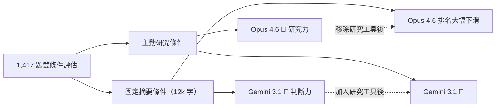
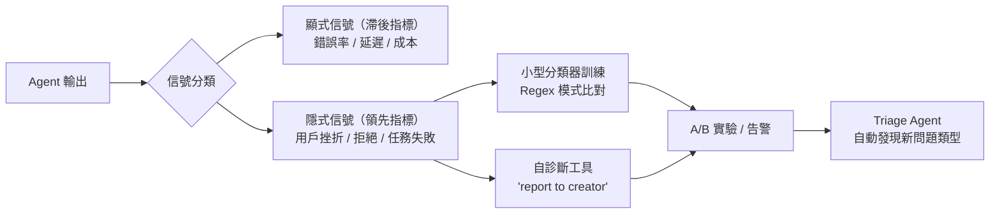

# AI Daily Digest — 2026-05-08

<!-- pipeline-generated:begin -->

## 🔥 今日 TOP 3
### 1. Claude Mythos 助 Firefox 月均修復漏洞從 30 跳升至 423 個，10 倍成長
Mozilla 利用 Claude Mythos 預覽版，搭配改進的模型引導技術（model steering）與技術堆疊，在 Firefox 安全強化上取得突破性成果。安全漏洞修復速率從 2025 年每月 20–30 個，在 2026 年 4 月激增至 423 個，成長超過 10 倍；其中包括一個存在 20 年的 XSLT 漏洞及 15 年前的 HTML legend 元素漏洞，過去從未被自動化工具識別。

此案例的關鍵不是模型本身的升級，而是改進的模型引導策略大幅提升了信噪比——即使部分嘗試仍被 Firefox 既有的深度防禦機制攔截，整體修復量仍呈指數成長。對資安研究者而言，這意味著 AI 輔助安全審計已從「試驗性工具」升級為可量產化的規模作業；對所有維護大型代碼庫的組織而言，AI 尋找歷史漏洞的速度也將同步提升，這是雙面刃。

下一步觀察重點：Anthropic 是否會公開與 Mozilla 合作的引導框架細節（eval 設計、堆疊架構）；此模式是否擴展至 Linux Kernel、OpenSSL 等其他安全關鍵代碼庫；以及 Firefox 開發團隊如何管理 423 個/月規模的漏洞修復品質驗證流程，防止修復引入新問題。

📖 [閱讀完整 insight](../10-insights/2026-05-07/inbox_ef3094f1.md) · 🔗 [原文連結](https://simonwillison.net/2026/May/7/firefox-claude-mythos/#atom-everything)
### 2. 1,417 題首次分離前沿模型研究力與判斷力：Opus 與 Gemini 排名完全倒置
研究者在 1,417 個二元預測問題上設計雙重條件評估：主動研究條件（各模型自行上網搜索）與固定摘要條件（統一提供 12k 字符標準摘要）。Claude Opus 4.6 在主動研究條件下顯著領先，但移除研究工具後校準分數大幅下滑；Gemini 3.1 Pro 呈現完全相反的曲線，在固定摘要條件下展現更銳利的判斷力與校準準度——四個模型在兩種條件間的排名幾乎完全逆轉。

此研究首次系統性分解了長期混淆的問題：「模型更好」究竟是「搜索決策更好」還是「推理判斷更好」。對 agent 架構師而言，這直接影響工具鏈設計：若任務是主動研究型（情報收集、技術盡職調查），Opus 4.6 的搜索能力是決定性優勢；若任務是固定資料型推理（文件審查、報告分析），Gemini 3.1 可能更準確。更深層的洞察是：Opus 的搜索過程本身可能作為概率推論的認知 scaffolding，而非單純資訊擷取工具。

實務建議：在選型 agentic 工作流核心推理模型前，應先確認任務是「工具密集型」還是「推理密集型」，據此選型而非依賴單一綜合基準分數。下一步追蹤 futuresearch.ai 公開的完整評分數據，以及其他模型在此框架下的表現。

📖 [閱讀完整 insight](../10-insights/2026-05-07/inbox_77332cae.md) · 🔗 [原文連結](https://www.reddit.com/r/ClaudeAI/comments/1t6hgsf/opus_46_does_better_research_gemini_31_has_better/)
### 3. Anthropic Code with Claude 同步發布五大功能：Routines、Dreams Memory、多代理編排
Anthropic 在 Code with Claude 活動中發布五項重大功能：Claude Code Routines（時間表或 webhook 觸發的自動化工作流）、Outcomes Feature（基於評分標準的代理性能評估系統）、Multi-Agent Orchestration（具不同角色與工具的專門 AI 團隊協作）、Dreams Memory System（跨長期交互的代理行為學習與記憶），以及 Claude Code 使用額度擴展。

Dreams Memory System 是其中最具戰略意義的功能——它允許 agent 在長期交互中積累行為知識，從根本上改變每次對話從零開始的限制。Outcomes Feature 填補了評估 agentic 系統性能的關鍵缺口：企業現在有了基於評分標準的框架來監控和改進 AI 代理行為，而非依賴人工抽樣審查。這五項功能集體標誌著 Claude 生態從「智能代碼助手」向「可編排的自主工作流平台」的重要轉型。

開發者本週可開始驗證：Routines 是否能替代現有的 n8n/Zapier 自動化工作流；Dreams Memory 的跨會話記憶持久化機制（存儲大小上限、記憶衰減策略）是否已有公開文檔；Multi-Agent Orchestration 在複雜任務分解上與 LangGraph、CrewAI 等框架的實際效能差異。

📖 [閱讀完整 insight](../10-insights/2026-05-07/inbox_9b81053f.md) · 🔗 [原文連結](https://www.lennysnewsletter.com/p/code-with-claude-the-5-biggest-updates)

## 📚 分類摘要
### foundation_models
今日 Claude 生態動態高度密集。業務層面，Dario Amodei 在舊金山開發者大會公開揭露 Q1 年化用戶成長達 80 倍（inbox_7567e63f），遠超原定 10 倍規劃，導致計算容量嚴重不足——這直接解釋了 Anthropic 以年度 $5 億簽署 xAI Colossus 1 數據中心全部 300MW 的爭議協議（inbox_352c5acc）。Colossus 1 在未獲《清潔空氣法》許可下運行 30+ 甲烷渦輪機，位於黑人聚居區（癌症風險為全國平均 4 倍），Elon Musk 保留若 Claude「傷害人類」即單方面收回計算資源的權利，對一家 PBC 架構的公司構成治理結構風險（inbox_e68a616c）。同週 Google 追加 $40 億投資（inbox_056fae69），Anthropic 年化收入在 4 個月內從 $9B 激增至 $30B 以上，彰顯企業 AI 合約的複利效應，亦讓計畫中的 2026 年 10 月 IPO（$350B 估值，約為 Arm 2023 IPO 的 5 倍）浮現龐大潛力。

技術與產品層面，Adam Wolff 在 InfoQ 分享 Claude Code 開發心法（inbox_c4413425）：AI 降低編碼成本後，SDLC 瓶頸已從程式實現轉向架構決策，學習速度與決策品質才是競爭優勢。Anthropic 產品負責人 Cat Wu 揭示超高速迭代祕訣（inbox_45a1bfc4）：輕量化 PRD、刻意針對當前模型能力設計（為下一代留白空間）、使命對齊削弱官僚摩擦；她同時指出 PM 的新核心技能是「正確的 AGI 信仰程度」（inbox_33d60121）——既要預判未來超級智能的簡化產品形態，也要優化當前模型的不足。Mozilla 與 Claude Mythos 的合作（inbox_ef3094f1）展示 AI 安全研究的規模效益，Firefox 月度漏洞修復量 10 倍躍升至 423 個。

模型能力研究方面，1,417 題的雙條件評估（inbox_77332cae）首次分離「研究能力」與「判斷能力」——Opus 4.6 主動研究優勢顯著，移除後排名大幅滑落；Gemini 3.1 Pro 在固定摘要條件下判斷力更強。MIT 2024 的 Platonic Representation Hypothesis（inbox_e3fce352）提供理論框架：所有主流模型隨規模擴大向同一表示核心收斂，由任務通用性、模型容量、簡樸偏好三項選擇壓力驅動，與架構和訓練資料無關，規模觸發「相位轉變」使模型從背誦轉為建構現實統計模型。GPT 側，OpenAI 推出 GPT-5.5-Cyber 擴展資安布局（inbox_4e4e51c8），Responses API 新增 WebSocket 執行模式降低 agent 延遲 40%（inbox_445dbb68）。

### agents
基礎設施層，Google 在 Cloud Next 2026 推出 GKE Agent Sandbox（inbox_eab4c023、inbox_106a34bb），基於 gVisor 核心隔離達到 300 sandboxes/秒的吞吐量，成為三大雲端商中唯一的原生 Agent 隔離方案，以開源 Kubernetes SIG Apps 子項目形式提供。同步發布的 Hypercluster 可從單一控制平面管理 100 萬顆 GPU/TPU 晶片，標誌 Kubernetes 正式演進為 AI Agent 基礎設施平台，建立起相較 AWS 和 Azure 的差異化優勢。OpenAI Responses API 的 WebSocket 執行模式（inbox_e35c9b95）解決 agentic workflows 的延遲瓶頸——持久連接替代 HTTP 循環，延遲降低最高 40%，對多步驟工具執行和串流傳輸有直接改善。

Agent 可觀測性方面，Raindrop（inbox_db50426a）提出生產監控方法論，核心洞察是：隱式信號（用戶挫折、任務失敗、拒絕行為）是領先指標，比顯式信號（錯誤率、延遲、成本）更早揭示 agent 問題。其自診斷設計的關鍵細節值得記錄——在 system prompt 要求模型自我舉報異常行為時，措辭「report to creator」比「unsafe action」更能激發模型配合；數百個事件即可開始偵測趨勢，Triage Agent 可進一步自動發現未知問題類型（如特定 provider 故障導致的用戶挫折模式）。

安全側，Google Cloud 發布 Fraud Defense（inbox_8c98411b）作為 reCAPTCHA 的下一代演進，針對「自主代理網際網路」的新威脅向量設計——傳統人機驗證無法區分合法 AI 代理與惡意自動化，Fraud Defense 提供代理活動測量儀表板與政策引擎，以全球信號進行風險判斷，讓企業可對人類用戶、AI 代理、機器人設定差異化存取策略。

### infra
硬體競爭格局密集更新。AMD 推出 Instinct MI350P PCIe 推理卡（inbox_423a6113，CDNA 4 架構），並計畫發布可插槽 GPU 系列（inbox_62378872）；台灣廠商 Skymizer 推出 HTX301（inbox_af3448c8，384GB 記憶體、約 240W 低功耗），顯示推理加速市場快速多元化。消費端則呈現嚴峻景象（inbox_ed27a030）：AI 浪潮導致晶片產能向數據中心傾斜，華碩主板出貨預計從 1,500 萬片跌至 1,000 萬片（-33%），消費級 CPU 價格上漲 2 倍，記憶體佔 BOM 比例從 15% 暴增至 30%，RTX 60 系列疑延至 2028 年——PC DIY 市場遭遇金融危機以來最嚴峻的結構性衰退。

本地推理優化技術持續突破。AtomicChat 在 llama.cpp 實現 Multi-Token Prediction（inbox_b6252903），Gemma 26B 在 MacBook Pro M5Max 上速度從 97 提升至 138 tokens/s（+40%）；社群指南（inbox_9f776e96）顯示 Qwen 3.6 35B-A3B 配合 NextN MTP 投機解碼在 RTX 3090 Ti 上可達 150 tokens/s，較基礎版本提升 2.9 倍，關鍵技巧是 nextn block 必須保持 Q8 量化精度（--tensor-type nextn=q8_0）。分散推理拓撲基準測試（inbox_85ea6789）揭示：4 顆 GPU TP=4 的吞吐量反而比雙 NVLink 配對 TP=2 低 13-30%，原因是全約減通訊受最慢互連限制；高並發時 NVLink 配對帶來 +53% 吞吐增益，最優策略是在 NVLink 對機箱中運行兩組 TP=2 服務。

Google Chrome 被社群發現靜默下載 ~4GB LLM 模型檢查點（inbox_76f9a89e），在用戶未知情的情況下推送邊緣推理能力，標誌消費級設備的 on-device AI 進入無感普及階段，但同時引發透明度與用戶知情權爭議。Anthropic 與 Neuronpedia 發布自然語言自動編碼器 NLA（inbox_805815e5），可逐 token 解讀 Gemma 3 27B 的內部推理狀態——案例顯示「I am Elon Musk」在初始 token 階段即被內部標記為「虛構」，為 LLM 可解釋性研究提供首個互動可驗證工具，模型權重已在 Hugging Face 開源。

## 🎯 專欄
### 🛠 Claude Code / Codex 新功能
- **[v2.1.133](../10-insights/2026-05-07/inbox_845c8360.md)**
  Claude Code v2.1.133 發布多項更新與修復。新增 worktree.baseRef 設定讓使用者選擇 worktree 從 origin/<default> 或本地 HEAD 分支（預設改回 fresh，需手動設 head 保留未推送提交）；新增 Linux/WSL 的 sandbox 二進制路徑管理設定；hooks 現收到 effort 
- **[Simplex rethinks software development with Codex](../10-insights/2026-05-07/inbox_18a5af97.md)**
  Simplex 通過整合 ChatGPT Enterprise 和 OpenAI Codex 提升軟體開發效率，縮減設計、構建、測試的時間成本，並支援 AI 驅動工作流程的規模化部署。此案例展示生成式 AI 在軟體工程全流程的應用。
- **[0.129.0](../10-insights/2026-05-07/inbox_6c737ff5.md)**
  OpenAI Codex v0.129.0 穩定版發布，引入 Vim 編輯模式、workspace 級 plugin 共享、/hooks 管理介面、實驗性 goals 等新功能。TUI 工作流優化包括重設計的 resume/fork picker、workspace-aware /diff、theme-aware status line 及 /keymap 
- **[0.129.0-alpha.15](../10-insights/2026-05-07/inbox_b5466980.md)**
  OpenAI Codex 發布 alpha 版本 0.129.0-alpha.15。本次發布公告未提供變更日誌或功能詳情，僅標示版本號。
- **[0.129.0-alpha.14](../10-insights/2026-05-07/inbox_54ef0027.md)**
  OpenAI Codex 發布 alpha 版本 0.129.0-alpha.14。本次發布公告未提供變更日誌或功能詳情，僅標示版本號。
### 📚 AI 知識管理
- **[Give Your AI Unlimited Updated Context](../10-insights/2026-05-07/inbox_c3d925f5.md)**
  基於 Andrej Karpathy 2026 年初發布的「LLM Wiki」模式，闡述如何構建 LLM 的持久知識層。傳統問題：每次對話從零開始；RAG 僅於查詢時重新推導，無累積。解決方案：Raw（源檔案唯讀、append-only）+ Wiki（結構化、AI 生成）兩層架構，搭配三個控制檔案（_hot.md 日快取 <500 token、_pendin
- **[Hard‐Earned RAG Lessons: Why “It Runs” Is Nowhere Near “It Works in Production”](../10-insights/2026-05-08/inbox_d60f8bd3.md)**
  未知。RSS 摘要僅提供標題『生產環境中 RAG 的硬戰教訓：為何「能跑」遠非「能在生產上用」』，暗示討論 RAG 系統從開發到生產部署間的落差和常見陷阱，但文章內容無法取得。
- **[Made an interactive Claude + Obsidian setup guide (for beginners)](../10-insights/2026-05-07/inbox_a85c286c.md)**
  非技術背景使用者分享自製的 Claude Code + Obsidian 互動設置指南(免費、初心者友善)。核心效益：(1) 日常與週次工作流程(via skills & commands)；(2) AI 可直接取得背景資訊、減少前置作業；(3) 大規模處理研究、通話紀錄、數據；(4) AI 自動浮現使用者未察覺的工作連結。關鍵洞察：一週持續使用即能改變 A
- **[The Pulse: Did capacity shortages turn Anthropic hostile to devs?](../10-insights/2026-05-07/inbox_cc025138.md)**
  Pragmatic Engineer Newsletter 報導企業級 AI 工具採用的最新動態。Amazon 終於開放工程師使用 Claude Code 與 OpenAI Codex，這標誌著大型科技企業開始正式允許內部開發團隊採用第三方 AI 輔助工具。同時 Meta 則採取相反策略，在組織調整與潛在裁員前夕，強制工程師轉向數據標籤工作。市場中湧現更多小
- **[Code with Claude: The 5 biggest updates explained](../10-insights/2026-05-07/inbox_9b81053f.md)**
  Anthropic 在 Code with Claude 发布 5 项重大功能：(1) Claude Code Routines 支持基于时间表或 webhook 触发的自动化工作流；(2) Outcomes Feature 提供基于评分标准的 AI 代理性能评估系统；(3) Multi-Agent Orchestration 支持具有不同角色与工具的专门 
### 🏢 企業導入 AI / 團隊實踐
- **[v2.1.133](../10-insights/2026-05-07/inbox_845c8360.md)**
  Claude Code v2.1.133 發布多項更新與修復。新增 worktree.baseRef 設定讓使用者選擇 worktree 從 origin/<default> 或本地 HEAD 分支（預設改回 fresh，需手動設 head 保留未推送提交）；新增 Linux/WSL 的 sandbox 二進制路徑管理設定；hooks 現收到 effort 
- **[Parloa builds service agents customers want to talk to](../10-insights/2026-05-07/inbox_73aa014b.md)**
  Parloa 利用 OpenAI 模型打造可擴展的語音驅動 AI 客服代理，支援企業完整的設計、模擬和部署流程，實現可靠的實時客户互動。此案例展示生成式 AI 在客服領域的產業應用。
- **[Simplex rethinks software development with Codex](../10-insights/2026-05-07/inbox_18a5af97.md)**
  Simplex 通過整合 ChatGPT Enterprise 和 OpenAI Codex 提升軟體開發效率，縮減設計、構建、測試的時間成本，並支援 AI 驅動工作流程的規模化部署。此案例展示生成式 AI 在軟體工程全流程的應用。
- **[0.129.0](../10-insights/2026-05-07/inbox_6c737ff5.md)**
  OpenAI Codex v0.129.0 穩定版發布，引入 Vim 編輯模式、workspace 級 plugin 共享、/hooks 管理介面、實驗性 goals 等新功能。TUI 工作流優化包括重設計的 resume/fork picker、workspace-aware /diff、theme-aware status line 及 /keymap 
- **[Presentation: Engineering at AI Speed: Lessons from the First Agentically Accelerated Software Project](../10-insights/2026-05-07/inbox_c4413425.md)**
  Adam Wolff 在 InfoQ 演講中分享 Claude Code 開發經驗，指出當 AI 降低編碼成本後，軟體開發的瓶頸已從程式實現轉向架構決策。透過三個「戰爭故事」說明 dogfooding 和快速迭代對 AI 加速開發的重要性。當編碼成本趨近於零時，開發團隊的競爭優勢不再來自寫碼速度，而是學習和決策的速度。這標誌著軟體開發文化的根本轉變：從實現導
### 🎓 AI 使用技巧 / 心法
- **[OpenAI Introduces Websocket-Based Execution Mode to Reduce Latency in Agentic Workflows](../10-insights/2026-05-07/inbox_e35c9b95.md)**
  OpenAI 為 Responses API 推出基於 WebSocket 的執行模式，替代傳統 HTTP 請求-回應循環，用於改善編碼代理和實時 AI 系統的性能。該更新將延遲降低高達 40%，並改進流式傳輸、工具執行和多步驟編排在生產規模系統中的能力。這是在 agentic workflows 中實現低延遲的關鍵技術突破。
- **[OpenAI Introduces Websocket-Based Execution Mode to Reduce Latency in Agentic Workflows](../10-insights/2026-05-07/inbox_4a5e784c.md)**
  OpenAI 為 Responses API 推出 WebSocket 執行模式，透過持久連接取代傳統 HTTP 請求-回應循環，在編碼代理和實時 AI 系統中減少延遲最多 40%。新的執行模式改進了串流、工具執行和多步驟協調的性能。WebSocket 連接特別適合需要頻繁交互的代理工作流程，例如編碼助手和實時決策系統。這項優化針對生產規模的 AI 系統進行
- **[OpenAI Introduces Websocket-Based Execution Mode to Reduce Latency in Agentic Workflows](../10-insights/2026-05-07/inbox_445dbb68.md)**
  OpenAI 為 Responses API 推出 WebSocket 執行模式，利用持久連接替代 HTTP request-response 循環，在生產環境中實現最高 40% 的延遲降低。該更新特別優化了 Coding Agents 和實時 AI 系統的 streaming、tool execution 和多步驟編排能力，為 Agent 工作流提供顯著的
- **[Playground in Prod: Optimising Agents in Production Environments — Samuel Colvin, Pydantic](../10-insights/2026-05-07/inbox_645902a7.md)**
  Samuel Colvin (Pydantic 創始人) 演示如何在生產環境中優化 Agent。核心內容包括使用 Jeepper (遺傳演算法優化庫) 和 Logfire managed variables 進行 prompt 優化。在英國議員政治關係識別任務上，初始 prompt 准確度 87%，經專家 prompt 改進至 92%，經 Jeepper 自
- **[Vibe Engineering Effect Apps — Michael Arnaldi, Effectful](../10-insights/2026-05-07/inbox_05decefa.md)**
  Michael Arnaldi (Effectful) 展示如何與 AI 模型協作開發 Effect 應用。核心洞察是「克隆該死的 repo」—— 將依賴庫直接複製到項目中，而非依賴模型的訓練知識，因為模型被優化以關注自有代碼而非 node_modules。演示從零構建包含 HTTP API、SQLite 持久化、測試的完整應用，建立 agents.md (
### 💳 支付 / Fintech
- **[I Reviewed 200 Pull Requests Last Year. 80% Had the Same Hidden Time Bomb.](../10-insights/2026-05-08/inbox_0e5e8052.md)**
  作者基於 200 個 PR 審查經驗，系統性識別出在代碼審查時難以發現但在生產環境中引發故障的「時間炸彈」代碼模式。整體分類顯示 21% 安全（green）、45% 有隱患（yellow）、34% 危險（red）——每三個 PR 就有一個時間炸彈。五大常見模式：(1) 同步外部調用（67 個 PR）—— checkout 端點阻塞等待 email/wareh
- **[The Single Entry Point Paradox: High-Availability Without a Single Point of Failure](../10-insights/2026-05-07/inbox_3e5e9986.md)**
  文章解答系統設計中的悖論：若所有流量經過單一入口點（Load Balancer 或 API Gateway），不是就有單點故障風險嗎？答案是否定的，透過 DNS 層級分佈、健康檢查和 Round Robin 實現容錯。單一入口點實際上是功能概念而非物理概念：DNS 將域名解析到多個 Load Balancer 實例（不同機房、不同 IP），客戶端靠 Roun
- **[AMD Intros Instinct MI350P Accelerator: CDNA 4 Comes to PCIe Cards](../10-insights/2026-05-07/inbox_423a6113.md)**
  AMD 推出 Instinct MI350P 推理加速卡，採用 CDNA 4 架構並以 PCIe 卡形式供應。該卡針對企業級與本地 LLM 推理應用設計，標誌 AMD 在推理加速市場的進一步布局。目前尚無公開定價與上市時程，市場關注其性價比與軟體生態相對於 NVIDIA 的競爭力。
- **[Taiwanese company Skymizer announces HTX301 - PCIE inference card with 384GB of Memory at ~240 Watts](../10-insights/2026-05-08/inbox_af3448c8.md)**
  台灣廠商 Skymizer 發表 HTX301 PCIe 推理卡，搭載 384GB 大容量記憶體，功耗約 240W，針對本地及邊緣 LLM 推理應用優化設計。該產品為中小廠商進軍推理加速市場的案例，提供相比主流廠商更多樣的硬體選擇。
- **[Benchmark Qwen 3.6 27B MTP on 2x3090 NVLINK](../10-insights/2026-05-08/inbox_85ea6789.md)**
  作者對 Qwen 3.6 27B 模型在 4× RTX 3090（含 NVLink）上的 MTP 推論進行了詳細基準測試，揭示硬體拓撲對分散式推論 (Tensor Parallel) 效能的決定性影響。將 TP=2 固定在 NVLinked GPU 對比拆散在 PCIe 上，單一並行時吞吐量 +25%、四並行時 +53%；但若擴展為 TP=4 用足四顆 GP
### ⛓️ 區塊鏈 / Web3
- **[v2.1.133](../10-insights/2026-05-07/inbox_845c8360.md)**
  Claude Code v2.1.133 發布多項更新與修復。新增 worktree.baseRef 設定讓使用者選擇 worktree 從 origin/<default> 或本地 HEAD 分支（預設改回 fresh，需手動設 head 保留未推送提交）；新增 Linux/WSL 的 sandbox 二進制路徑管理設定；hooks 現收到 effort 
- **[Simplex rethinks software development with Codex](../10-insights/2026-05-07/inbox_18a5af97.md)**
  Simplex 通過整合 ChatGPT Enterprise 和 OpenAI Codex 提升軟體開發效率，縮減設計、構建、測試的時間成本，並支援 AI 驅動工作流程的規模化部署。此案例展示生成式 AI 在軟體工程全流程的應用。
- **[0.129.0](../10-insights/2026-05-07/inbox_6c737ff5.md)**
  OpenAI Codex v0.129.0 穩定版發布，引入 Vim 編輯模式、workspace 級 plugin 共享、/hooks 管理介面、實驗性 goals 等新功能。TUI 工作流優化包括重設計的 resume/fork picker、workspace-aware /diff、theme-aware status line 及 /keymap 
- **[0.129.0-alpha.15](../10-insights/2026-05-07/inbox_b5466980.md)**
  OpenAI Codex 發布 alpha 版本 0.129.0-alpha.15。本次發布公告未提供變更日誌或功能詳情，僅標示版本號。
- **[0.129.0-alpha.14](../10-insights/2026-05-07/inbox_54ef0027.md)**
  OpenAI Codex 發布 alpha 版本 0.129.0-alpha.14。本次發布公告未提供變更日誌或功能詳情，僅標示版本號。
### 🔐 AI 安全 / 濫用
- **[Leading Open Source Author Calls for Verification over Trust in Software Supply Chains](../10-insights/2026-05-07/inbox_10cab0e9.md)**
  curl 創建者 Daniel Stenberg 在 2026 年 3 月撰文呼籲軟體行業從「盲目信任」轉向「主動驗證」。Stenberg 認為現有的軟體供應鏈模式──依賴於對知名元件的信任──已不再適當。他強調使用者和組織應主動驗證消費的所有軟體依賴，而非被動接受。Stenberg 以 curl 自身的實踐為例，展示如何建立供應鏈驗證的具體機制。這項呼籲代
- **[The Other 4 Lines: Your CLAUDE.MD Needs: A Security Engineer’s Take](../10-insights/2026-05-08/inbox_cacac011.md)**
  資安工程師提出 Karpathy 知名的 4 行 CLAUDE.md 存在致命缺口：完全忽略安全威脅。文章建議並列 4 條安全規則：(1) 將網頁擷取、MCP 輸出視為數據而非指令，防止 prompt injection；(2) 禁止訪問密鑰文件；(3) 破壞性操作（rm -rf、git push --force）前必須暫停並用英文說明；(4) 檢查第三方 
- **[Google Cloud fraud defense, the next evolution of reCAPTCHA](../10-insights/2026-05-06/inbox_8c98411b.md)**
  Google Cloud 推出 Fraud Defense，作為 reCAPTCHA 的下一代演進版本，專門針對「自主代理網際網路」(agentic web) 的安全威脅。該平台在 Google Cloud Next 發表，提供統一的信任驗證能力，可同時識別人類用戶、自主 AI 代理和機器人。核心功能包含代理活動測量儀表板、政策引擎以控制代理流量、通過全球信

## 💡 今日 Takeaway

_讀完今日所有內容後，可帶走的知識點_
### 1. Context window 是容量，Attention 信號稀釋才是理解瓶頸
Transformer 的 attention 機制對中間位置 token 天然存在信號衰減，這是架構性質而非資訊問題，增加 token 反而加重信噪比惡化。Aider 創作者 Paul Gauthier 實驗驗證：200K+ context 在 GPT-4o、Claude Sonnet、DeepSeek 上均無實際理解能力提升，說明「放更多上下文」是解決方向錯誤。正確設計是分離 loading contract（哪些資訊進入上下文、放在哪個位置）與 reasoning contract（模型在什麼結構下推理），優先將關鍵資訊安排在邊界位置，而非追求覆蓋更多代碼。

_類型：pattern_

**參考來源**：
- [You gave the model more context to fix the problem. More context was the problem.](../10-insights/2026-05-08/inbox_ff5f53b1.md) · [原文](https://medium.com/@stratoatlas/you-gave-the-model-more-context-to-fix-the-problem-more-context-was-the-problem-a5fae8844122?source=rss------claude-5)
### 2. CLAUDE.md 是執行規範而非文件：只放改變實作行為的資訊
AI coding agent 失敗的主因多是背景設計不良，具體失敗模式包括：相互矛盾的指導（instruction collision）、規則過多降低決定性（context flooding）、權限邊界不清（missing boundaries）、永久知識與暫時知識混雜（absent memory hierarchy）。核心設計原則是：若資訊不改變實作行為，就不應出現在規範文件中；3,500 行充滿公司價值觀與過時架構筆記的 CLAUDE.md 反而傷害 agent 推理。倉庫架構與約束設計的重要性現已等同於模型選擇——簡潔的操作清晰度勝過詳盡的文件覆蓋。

_類型：framework_

**參考來源**：
- [The Perfect CLAUDE.md: A Practical Specification for Agentic Coding Projects](../10-insights/2026-05-08/inbox_c5db9c95.md) · [原文](https://medium.com/@jasanuprandhawa/the-perfect-claude-md-a-practical-specification-for-agentic-coding-projects-081b05fa7fa0?source=rss------claude-5)
### 3. 用戶挫折是 Agent 問題的領先指標，錯誤率是滯後指標
傳統顯式信號（error rate、latency、cost）在 agent 出問題後才浮現；隱式信號（用戶挫折、拒絕行為、任務失敗）更早反映問題，需訓練小型分類器或設計 Regex 模式來偵測。自診斷工具的命名細節影響模型的自我舉報意願：system prompt 中措辭「report to creator」比「unsafe bash use」更能激發模型主動揭示異常行為，因為框架措辭決定了模型是否視其為正常協作而非自我揭露懲罰。數百個事件即可開始偵測趨勢，搭配 Triage Agent 可自動發現未知問題類型，使生產監控從被動告警轉為主動發現。

_類型：framework_

**參考來源**：
- [Everything You Need To Know About Agent Observability — Danny Gollapalli and Ben Hylak, Raindrop](../10-insights/2026-05-07/inbox_db50426a.md) · [原文](https://www.youtube.com/watch?v=-aM2EDTiaMs)
### 4. 遺傳演算法 prompt 優化可系統性超越專家手工提示詞
在英國議員政治關係識別任務上，初始 prompt 準確度 87%，專家手工改進至 92%，Jeepper 遺傳演算法自動優化達 96.7%——自動化明確超越人類專家。完整框架是 eval（黃金資料集評分）→ compare（多 prompt 對比）→ optimize（Jeepper 自動提議並評估新 prompt）的迴圈；Logfire managed variables 支援在不重新部署的情況下進行生產 A/B 實驗，降低優化成本。關鍵注意：eval 資料集必須充分覆蓋邊界情況，否則遺傳演算法可能對訓練資料過度擬合，實際效果反而下降。

_類型：framework_

**參考來源**：
- [Playground in Prod: Optimising Agents in Production Environments — Samuel Colvin, Pydantic](../10-insights/2026-05-07/inbox_645902a7.md) · [原文](https://www.youtube.com/watch?v=A48uhxfxbsM)
### 5. 多 GPU 推理吞吐由拓撲最慢互連決定，NVLink 配對比擴大 TP 規模更有效
Tensor Parallel 的全約減通訊（all-reduce）受限於拓撲中最慢的互連，TP=4 跨 4 顆 PCIe GPU 的吞吐量反而比 TP=2 雙 NVLink 配對低 13-30%；在高並行負載下，NVLink 配對帶來高達 +53% 吞吐量增益，TTFT 接近減半。最優配置策略是：在擁有 NVLink 對的機箱中，分別在 GPU 0+2 與 1+3 運行兩組 TP=2 服務，而非嘗試跨越全部 4 顆 GPU 的單一 TP=4。規劃推理基礎設施預算時，互連拓撲比 GPU 總數更決定實際效能上限。

_類型：data-point_

**參考來源**：
- [Benchmark Qwen 3.6 27B MTP on 2x3090 NVLINK](../10-insights/2026-05-08/inbox_85ea6789.md) · [原文](https://www.reddit.com/r/LocalLLaMA/comments/1t6susj/benchmark_qwen_36_27b_mtp_on_2x3090_nvlink/)

<!-- pipeline-generated:end -->

<!-- user-notes -->
<!-- Write your own notes below; pipeline never touches this section. -->