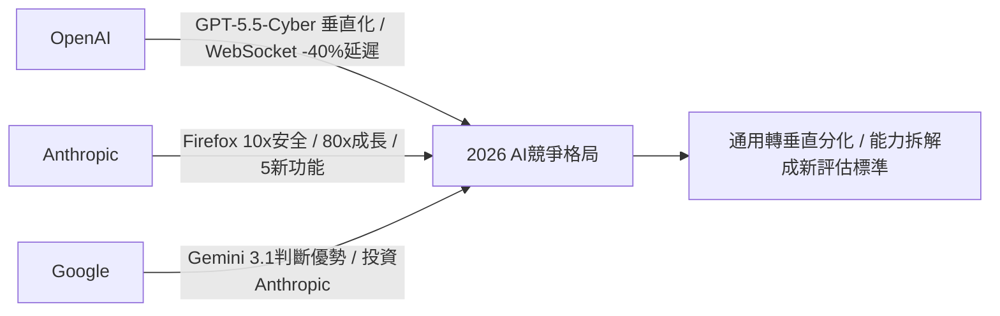
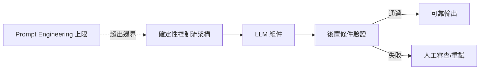

# AI Daily Digest — 2026-05-08

<!-- pipeline-generated:begin -->

## 🔥 今日 TOP 3
### 1. Claude Mythos 使 Firefox 安全修復月量增 10 倍
Mozilla 在 2026 年 4 月引入 Claude Mythos 預覽版，搭配改進的模型引導技術與技術堆疊，將 Firefox 月均安全漏洞修復數從 2025 年的 20–30 件激增至 423 件，成長超過 10 倍，並成功挖出潛伏 20 年的 XSLT 漏洞與 15 年的 HTML legend 元素缺陷。

此案例展示「模型能力提升 × 改進引導技術」的乘數效應，而非單純的模型升級。AI 驅動的安全稽核已能穿透 Firefox 的多層防禦機制，定位人類長期無法偵測的深層路徑缺陷，將過去需要大量人力的安全研究工作規模化，相較 2025 年月均 20–30 件的修復速度，效率差距已非線性可比。

下一步觀察重點在於可移植性：此方法能否複製到 Linux kernel、OpenSSL 等同等複雜的系統，以及 Claude Mythos 正式版發布後類似突破是否可在更多組織重現。對擁有大型歷史代碼庫的安全團隊而言，現在應立即評估 AI 驅動稽核管道的可行性。

📖 [閱讀完整 insight](../10-insights/2026-05-07/inbox_ef3094f1.md) · 🔗 [原文連結](https://simonwillison.net/2026/May/7/firefox-claude-mythos/#atom-everything)
### 2. 前沿模型能力正式分化：Opus 搜索領先，Gemini 推論更準
FutureSearch 對 1,417 個二元預測問題進行首次系統性能力分解評估，採雙重條件設計——各模型主動上網搜索 vs. 所有模型獲統一 12k 字符摘要——直接分離 Claude Opus 4.6、GPT-5.4、Gemini 3.1 Pro、Grok 4.20 的「研究能力」與「判斷能力」。

核心發現令人意外：Opus 4.6 在主動研究條件下明顯領先，擅長搜索決策與細節提取；但移除搜索優勢後，Gemini 3.1 的判斷校準度反而更高，四模型排名在兩種條件下完全顛倒。更深層的發現是 Opus 的搜索過程本身可能充當概率推論的認知鷹架，獨立於所獲取的資訊之外對最終判斷作出貢獻。

實務應用清晰：複雜開放式研究任務選 Opus，固定資料的結構化推論分析選 Gemini。更廣泛的意義是，模型評估體系應採雙條件設計以分離能力維度，「選哪個模型」從此需要先定義任務類型，而非依賴單一基準分數。

📖 [閱讀完整 insight](../10-insights/2026-05-07/inbox_77332cae.md) · 🔗 [原文連結](https://www.reddit.com/r/ClaudeAI/comments/1t6hgsf/opus_46_does_better_research_gemini_31_has_better/)
### 3. AI Agent 可靠性靠確定性架構，MANDATORY 是設計失敗的警示燈
當開發者在 prompt 加上 MANDATORY、DO NOT SKIP 等強調標記才能維持 agent 行為時，代表已達到 prompt 工程的能力上限；傳統軟體透過可組合模組實現可驗證行為，LLM 應被視為更大確定性系統內的組件而非決策核心。

此框架直指 agentic 系統最危險的失敗模式：系統技術上「成功執行」卻達到錯誤結論的沉默式失敗。文章提出三層防線——全程人工監督、執行後完整驗證、無驗證接受（最危險）——並明確指出無法只靠 prompt 防止此類失敗，這對任何生產環境代理系統都是結構性約束，尤其是在多步驟長鏈任務中。

立即可用的設計規則：為每個 agent 決策點建立可測試的輸入/輸出規格；對複雜多步驟 agent，在關鍵節點設置後置條件驗證而非依賴端對端 prompt；當 prompt 需要大量修飾詞才能約束行為時，應重寫為確定性代碼。

📖 [閱讀完整 insight](../10-insights/2026-05-07/inbox_ba8db7c8.md) · 🔗 [原文連結](https://bsuh.bearblog.dev/agents-need-control-flow/)

## 📚 分類摘要
### foundation_models
今日 Claude 生態系同時出現業務與技術兩類突破。最具衝擊力的是 Mozilla 與 Claude Mythos 預覽版合作（inbox_ef3094f1），月均安全修復從 20–30 件躍升至 423 件，並挖出 20 年舊 XSLT 漏洞。Anthropic 在 Code with Claude 活動發布五項重大功能（inbox_9b81053f）：Routines 自動化工作流、Outcomes 代理性能評估、Multi-Agent Orchestration、Dreams 跨長期記憶系統，以及 Claude Code 額度加倍。業務層面，Dario Amodei 披露 Anthropic Q1 年化成長 80 倍（inbox_7567e63f），遠超 10 倍預期，計算資源不足成為最大瓶頸；Google 宣布追加 $40 億投資（inbox_056fae69），$10 億立即到位，Anthropic 年化收入 4 個月內從 $9B 成長至 $30B 以上，並計劃於 2026 年 10 月 IPO。

OpenAI 同日推出多項基礎設施更新。Responses API 正式推出 WebSocket 執行模式（inbox_e35c9b95、inbox_445dbb68），透過持久連接取代 HTTP 循環，編碼代理和實時 AI 系統延遲最高降低 40%，改善串流傳輸、工具執行與多步驟協調。GPT-5.5 與 GPT-5.5-Cyber 發布（inbox_4e4e51c8），後者透過「Trusted Access for Cyber」計劃面向已驗證的安全防禦者，標誌 OpenAI 開始針對垂直領域推出差異化模型變體，與 Anthropic 的通用模型策略形成對比。OpenAI 同步新增支援推理、翻譯和轉錄的實時語音 API（inbox_2c40c280），進一步擴展多模態覆蓋範圍。

FutureSearch 的模型評估研究（inbox_77332cae）首次系統性分離研究能力與判斷能力，發現 Claude Opus 4.6 搜索優勢明顯，但 Gemini 3.1 Pro 在固定知識推論中校準更高，四模型在兩種評估條件下排名完全顛倒，為「哪類任務用哪個模型」提供了首套有實驗依據的答案。

### agents
基礎設施層面，Google 在 Cloud Next 2026 推出 GKE Agent Sandbox（inbox_eab4c023），以 gVisor 核心隔離達到每秒 300 個沙箱的吞吐量，目前是 AWS、Azure、Google 三大雲端商中唯一的原生 Agent 隔離方案，以開源 Kubernetes SIG Apps 子項目形式構建。同步發布的 Hypercluster 從單一控制平面管理 100 萬 GPU/TPU 晶片，標誌 Kubernetes 正式演進為 AI Agent 基礎設施平台，Google 在代理計算基礎設施層形成差異化優勢。

代理架構可靠性方面有兩項框架並行發布。inbox_ba8db7c8 論證 agent 可靠性的邊界來自確定性控制流架構而非 prompt 複雜度——LLM 應作為確定性系統的組件，每個關鍵輸出設置可驗證後置條件，才能防止沉默式失敗。Raindrop 的可觀測性框架（inbox_db50426a）則指出隱式信號（用戶挫折感、拒絕行為）比顯式信號（錯誤率、延遲）更有效，介紹分類器信號、Regex 模式、自診斷三類監控方法，並特別指出 prompt 中工具命名措辭顯著影響模型是否自我回報異常行為。

安全防禦層，Google 發布 Fraud Defense（inbox_8c98411b）作為 reCAPTCHA 的下一代演進，可同時識別人類用戶、AI 代理和惡意機器人，提供代理流量的策略引擎控制與全球信號風險評估。此方案與 GKE Agent Sandbox 構成雙層防禦架構：基礎設施層執行隔離 + 網路層身份驗證，為企業級 agent 部署提供端到端安全框架。

## 🎯 專欄
### 🛠 Claude Code / Codex 新功能
- **[v2.1.133](../10-insights/2026-05-07/inbox_845c8360.md)**
  Claude Code v2.1.133 發布多項更新與修復。新增 worktree.baseRef 設定讓使用者選擇 worktree 從 origin/<default> 或本地 HEAD 分支（預設改回 fresh，需手動設 head 保留未推送提交）；新增 Linux/WSL 的 sandbox 二進制路徑管理設定；hooks 現收到 effort 
- **[Simplex rethinks software development with Codex](../10-insights/2026-05-07/inbox_18a5af97.md)**
  Simplex 通過整合 ChatGPT Enterprise 和 OpenAI Codex 提升軟體開發效率，縮減設計、構建、測試的時間成本，並支援 AI 驅動工作流程的規模化部署。此案例展示生成式 AI 在軟體工程全流程的應用。
- **[0.129.0](../10-insights/2026-05-07/inbox_6c737ff5.md)**
  OpenAI Codex v0.129.0 穩定版發布，引入 Vim 編輯模式、workspace 級 plugin 共享、/hooks 管理介面、實驗性 goals 等新功能。TUI 工作流優化包括重設計的 resume/fork picker、workspace-aware /diff、theme-aware status line 及 /keymap 
- **[0.129.0-alpha.15](../10-insights/2026-05-07/inbox_b5466980.md)**
  OpenAI Codex 發布 alpha 版本 0.129.0-alpha.15。本次發布公告未提供變更日誌或功能詳情，僅標示版本號。
- **[0.129.0-alpha.14](../10-insights/2026-05-07/inbox_54ef0027.md)**
  OpenAI Codex 發布 alpha 版本 0.129.0-alpha.14。本次發布公告未提供變更日誌或功能詳情，僅標示版本號。
### 📚 AI 知識管理
- **[Give Your AI Unlimited Updated Context](../10-insights/2026-05-07/inbox_c3d925f5.md)**
  基於 Andrej Karpathy 2026 年初發布的「LLM Wiki」模式，闡述如何構建 LLM 的持久知識層。傳統問題：每次對話從零開始；RAG 僅於查詢時重新推導，無累積。解決方案：Raw（源檔案唯讀、append-only）+ Wiki（結構化、AI 生成）兩層架構，搭配三個控制檔案（_hot.md 日快取 <500 token、_pendin
- **[Hard‐Earned RAG Lessons: Why “It Runs” Is Nowhere Near “It Works in Production”](../10-insights/2026-05-08/inbox_d60f8bd3.md)**
  未知。RSS 摘要僅提供標題『生產環境中 RAG 的硬戰教訓：為何「能跑」遠非「能在生產上用」』，暗示討論 RAG 系統從開發到生產部署間的落差和常見陷阱，但文章內容無法取得。
- **[Made an interactive Claude + Obsidian setup guide (for beginners)](../10-insights/2026-05-07/inbox_a85c286c.md)**
  非技術背景使用者分享自製的 Claude Code + Obsidian 互動設置指南(免費、初心者友善)。核心效益：(1) 日常與週次工作流程(via skills & commands)；(2) AI 可直接取得背景資訊、減少前置作業；(3) 大規模處理研究、通話紀錄、數據；(4) AI 自動浮現使用者未察覺的工作連結。關鍵洞察：一週持續使用即能改變 A
- **[Code with Claude: The 5 biggest updates explained](../10-insights/2026-05-07/inbox_9b81053f.md)**
  Anthropic 在 Code with Claude 发布 5 项重大功能：(1) Claude Code Routines 支持基于时间表或 webhook 触发的自动化工作流；(2) Outcomes Feature 提供基于评分标准的 AI 代理性能评估系统；(3) Multi-Agent Orchestration 支持具有不同角色与工具的专门 
### 🏢 企業導入 AI / 團隊實踐
- **[v2.1.133](../10-insights/2026-05-07/inbox_845c8360.md)**
  Claude Code v2.1.133 發布多項更新與修復。新增 worktree.baseRef 設定讓使用者選擇 worktree 從 origin/<default> 或本地 HEAD 分支（預設改回 fresh，需手動設 head 保留未推送提交）；新增 Linux/WSL 的 sandbox 二進制路徑管理設定；hooks 現收到 effort 
- **[Parloa builds service agents customers want to talk to](../10-insights/2026-05-07/inbox_73aa014b.md)**
  Parloa 利用 OpenAI 模型打造可擴展的語音驅動 AI 客服代理，支援企業完整的設計、模擬和部署流程，實現可靠的實時客户互動。此案例展示生成式 AI 在客服領域的產業應用。
- **[Simplex rethinks software development with Codex](../10-insights/2026-05-07/inbox_18a5af97.md)**
  Simplex 通過整合 ChatGPT Enterprise 和 OpenAI Codex 提升軟體開發效率，縮減設計、構建、測試的時間成本，並支援 AI 驅動工作流程的規模化部署。此案例展示生成式 AI 在軟體工程全流程的應用。
- **[0.129.0](../10-insights/2026-05-07/inbox_6c737ff5.md)**
  OpenAI Codex v0.129.0 穩定版發布，引入 Vim 編輯模式、workspace 級 plugin 共享、/hooks 管理介面、實驗性 goals 等新功能。TUI 工作流優化包括重設計的 resume/fork picker、workspace-aware /diff、theme-aware status line 及 /keymap 
- **[Presentation: Engineering at AI Speed: Lessons from the First Agentically Accelerated Software Project](../10-insights/2026-05-07/inbox_c4413425.md)**
  Adam Wolff 在 InfoQ 演講中分享 Claude Code 開發經驗，指出當 AI 降低編碼成本後，軟體開發的瓶頸已從程式實現轉向架構決策。透過三個「戰爭故事」說明 dogfooding 和快速迭代對 AI 加速開發的重要性。當編碼成本趨近於零時，開發團隊的競爭優勢不再來自寫碼速度，而是學習和決策的速度。這標誌著軟體開發文化的根本轉變：從實現導
### 🎓 AI 使用技巧 / 心法
- **[Playground in Prod: Optimising Agents in Production Environments — Samuel Colvin, Pydantic](../10-insights/2026-05-07/inbox_645902a7.md)**
  Samuel Colvin (Pydantic 創始人) 演示如何在生產環境中優化 Agent。核心內容包括使用 Jeepper (遺傳演算法優化庫) 和 Logfire managed variables 進行 prompt 優化。在英國議員政治關係識別任務上，初始 prompt 准確度 87%，經專家 prompt 改進至 92%，經 Jeepper 自
- **[Give Your AI Unlimited Updated Context](../10-insights/2026-05-07/inbox_c3d925f5.md)**
  基於 Andrej Karpathy 2026 年初發布的「LLM Wiki」模式，闡述如何構建 LLM 的持久知識層。傳統問題：每次對話從零開始；RAG 僅於查詢時重新推導，無累積。解決方案：Raw（源檔案唯讀、append-only）+ Wiki（結構化、AI 生成）兩層架構，搭配三個控制檔案（_hot.md 日快取 <500 token、_pendin
- **[I Rewrote a Real Data Workflow in Polars. Pandas Didn’t Stand a Chance.](../10-insights/2026-05-07/inbox_5e5c1c77.md)**
  作者用 Polars 重寫了一個實際資料工作流，性能從 61 秒劇烈改善到 0.20 秒（提升 305 倍）。文章重點不僅是速度優勢，更強調使用 Polars 帶來的「心智模式轉變」——暗示 Polars 的設計哲學相較 Pandas 更符合現代資料處理思維。
- **[Continual Learning in LLMs: How AI Models Learn New Things Without Forgetting Old Ones](../10-insights/2026-05-08/inbox_349462b1.md)**
  討論 LLM 中的持續學習 (continual learning) 問題：如何讓模型在習得新知識時避免遺忘舊知識。文章開頭提及「大語言模型很強大，但世界不會靜止」，暗示模型需要持續適應變化的資訊環境，但具體介紹的方法論、技術方案或案例因內容截斷而無法確認。
- **[The Other 4 Lines: Your CLAUDE.MD Needs: A Security Engineer’s Take](../10-insights/2026-05-08/inbox_cacac011.md)**
  資安工程師提出 Karpathy 知名的 4 行 CLAUDE.md 存在致命缺口：完全忽略安全威脅。文章建議並列 4 條安全規則：(1) 將網頁擷取、MCP 輸出視為數據而非指令，防止 prompt injection；(2) 禁止訪問密鑰文件；(3) 破壞性操作（rm -rf、git push --force）前必須暫停並用英文說明；(4) 檢查第三方 
### 💳 支付 / Fintech
- **[I Reviewed 200 Pull Requests Last Year. 80% Had the Same Hidden Time Bomb.](../10-insights/2026-05-08/inbox_0e5e8052.md)**
  作者基於 200 個 PR 審查經驗，系統性識別出在代碼審查時難以發現但在生產環境中引發故障的「時間炸彈」代碼模式。整體分類顯示 21% 安全（green）、45% 有隱患（yellow）、34% 危險（red）——每三個 PR 就有一個時間炸彈。五大常見模式：(1) 同步外部調用（67 個 PR）—— checkout 端點阻塞等待 email/wareh
- **[The Single Entry Point Paradox: High-Availability Without a Single Point of Failure](../10-insights/2026-05-07/inbox_3e5e9986.md)**
  文章解答系統設計中的悖論：若所有流量經過單一入口點（Load Balancer 或 API Gateway），不是就有單點故障風險嗎？答案是否定的，透過 DNS 層級分佈、健康檢查和 Round Robin 實現容錯。單一入口點實際上是功能概念而非物理概念：DNS 將域名解析到多個 Load Balancer 實例（不同機房、不同 IP），客戶端靠 Roun
- **[Google Cloud fraud defense, the next evolution of reCAPTCHA](../10-insights/2026-05-06/inbox_8c98411b.md)**
  Google Cloud 推出 Fraud Defense，作為 reCAPTCHA 的下一代演進版本，專門針對「自主代理網際網路」(agentic web) 的安全威脅。該平台在 Google Cloud Next 發表，提供統一的信任驗證能力，可同時識別人類用戶、自主 AI 代理和機器人。核心功能包含代理活動測量儀表板、政策引擎以控制代理流量、通過全球信
### ⛓️ 區塊鏈 / Web3
- **[How to Deploy a Fine-Tuned LLM on Bittensor’s Chutes AI](../10-insights/2026-05-08/inbox_dce6daa0.md)**
  文章詳細介紹如何在 Bittensor 的 Chutes AI（subnet 64）上部署微調後的大語言模型。Chutes AI 是一個去中心化的 AI 推理平台，透過礦工提供的計算資源提供模型部署和 API 調用。作者提供逐步教學：使用 chutes SDK 的 NodeSelector 配置硬體需求（如 gpu_count=1），利用 vLLM 高效推理
- **[Things I wish I knew earlier about Claude token usage](../10-insights/2026-05-07/inbox_c63a4866.md)**
  使用者分享 Claude 代幣使用最佳化心法，發現大部分代幣消耗非來自模型答覆而是上下文設置。核心技巧包括：(1) 不相關任務開啟新對話，避免長對話重複傳送完整歷史；(2) 將多個小問題合併成一條訊息，減少重複的上下文加載；(3) 保持 CLAUDE.md 簡潔，改為索引指向相關檔案，每回合模型都會重讀此檔案；(4) 精確指定檔案引用而非傳全部代碼，節省 3
### 🔐 AI 安全 / 濫用
- **[The Other 4 Lines: Your CLAUDE.MD Needs: A Security Engineer’s Take](../10-insights/2026-05-08/inbox_cacac011.md)**
  資安工程師提出 Karpathy 知名的 4 行 CLAUDE.md 存在致命缺口：完全忽略安全威脅。文章建議並列 4 條安全規則：(1) 將網頁擷取、MCP 輸出視為數據而非指令，防止 prompt injection；(2) 禁止訪問密鑰文件；(3) 破壞性操作（rm -rf、git push --force）前必須暫停並用英文說明；(4) 檢查第三方 
- **[Google Cloud fraud defense, the next evolution of reCAPTCHA](../10-insights/2026-05-06/inbox_8c98411b.md)**
  Google Cloud 推出 Fraud Defense，作為 reCAPTCHA 的下一代演進版本，專門針對「自主代理網際網路」(agentic web) 的安全威脅。該平台在 Google Cloud Next 發表，提供統一的信任驗證能力，可同時識別人類用戶、自主 AI 代理和機器人。核心功能包含代理活動測量儀表板、政策引擎以控制代理流量、通過全球信

## 💡 今日 Takeaway

_讀完今日所有內容後，可帶走的知識點_
### 1. Agent 可靠性靠確定性控制流架構，Prompt 修飾詞是設計失敗的掩蓋劑
當 AI agent 需要 MANDATORY/DO NOT SKIP 等強調標記才能正常運作時，代表系統已超越 prompt 工程的能力邊界，應重構為確定性控制流。LLM 最可靠的定位是確定性系統內的一個組件，搭配可測試的後置條件驗證，才能防止技術上成功執行卻達到錯誤結論的沉默式失敗。實務規則：為每個 agent 決策點建立明確的輸入/輸出規格，並選擇「執行後完整驗證」策略，而非依賴端對端 prompt 約束。

_類型：framework_

**參考來源**：
- [Agents need control flow, not more prompts](../10-insights/2026-05-07/inbox_ba8db7c8.md) · [原文](https://bsuh.bearblog.dev/agents-need-control-flow/)
### 2. Context Window 大小不等於理解力，Attention 中間衰減才是真正瓶頸
實驗驗證顯示 200K+ token context 在 GPT-4o、Claude Sonnet、DeepSeek 等主流模型上無有效性能提升，根本原因是 transformer attention 機制中中間位置 token 信號衰減——這是架構性質而非資訊量問題，增加 token 反而加重信噪比。設計應對策略是「分離 loading contract 與 reasoning contract」，以 attention 位置優先化，而非試圖用更大 context 覆蓋更多代碼。設計 RAG pipeline 或 agent context 時，應最大化邊界位置的信息密度，而非追求覆蓋率。

_類型：pattern_

**參考來源**：
- [You gave the model more context to fix the problem. More context was the problem.](../10-insights/2026-05-08/inbox_ff5f53b1.md) · [原文](https://medium.com/@stratoatlas/you-gave-the-model-more-context-to-fix-the-problem-more-context-was-the-problem-a5fae8844122?source=rss------claude-5)
### 3. 工作負載感知混合架構：本地小模型快速任務 + 雲端前沿模型複雜推理
業界已從「哪個模型最優」轉向「哪種架構最適合此工作負載」——代碼解釋、摘要、結構化編輯、輕量 agent 等任務本地小模型已足夠，複雜多步驟推理才需呼叫雲端前沿模型。優化目標應從基準分數轉向延遲與成本效率的綜合指標，建立動態路由決策樹，為每類任務設定「本地優先、雲端備援」預設策略。在 AI 推理成本仍存在 40 倍量級壁壘的環境下，此架構是目前最有效的成本控制機制。

_類型：pattern_

**參考來源**：
- [Are local models becoming “good enough” faster than expected?](../10-insights/2026-05-07/inbox_f6cff8f1.md) · [原文](https://www.reddit.com/r/LocalLLaMA/comments/1t6p0zk/are_local_models_becoming_good_enough_faster_than/)
- [Speed, caching, and the 40x AI cost wall](../10-insights/2026-05-08/inbox_0c2bb499.md) · [原文](https://medium.com/@sanketsahu/speed-caching-and-the-40x-ai-cost-wall-acd0512f7709?source=rss------artificial_intelligence-5)
### 4. 遺傳演算法 Prompt 優化 Loop：自動從 87% 提升至 96.7%，超越人類專家
Jeepper 遺傳演算法工具透過 eval→compare→optimize 循環自動搜索 prompt 變體，在政治關係識別任務上從初始 87% 提升至人類專家 92%、再到自動優化 96.7%，並可搭配 Logfire managed variables 在不重新部署的情況下進行生產環境 A/B 實驗。關鍵前提是需有足夠覆蓋邊界案例的黃金資料集以防過度擬合；此框架適用於任何有明確評估標準的 agent pipeline，尤其是分類、萃取、結構化輸出等任務。

_類型：framework_

**參考來源**：
- [Playground in Prod: Optimising Agents in Production Environments — Samuel Colvin, Pydantic](../10-insights/2026-05-07/inbox_645902a7.md) · [原文](https://www.youtube.com/watch?v=A48uhxfxbsM)
### 5. 克隆依賴庫到專案目錄，讓 AI 模型學習具體實現而非陳舊訓練知識
AI 模型被優化為關注自有代碼而非 node_modules，對依賴庫的知識停留在訓練截止日期；將依賴庫直接複製到專案目錄（如 repos/effect），可讓模型讀取當前版本的具體實現，而非依賴可能過時的訓練記憶。配合三層結構——agents.md 指令規則、patterns/*.md 最佳實踐、ESLint lint rules 禁止反模式（如 as any、as never）——可在複雜代碼庫中顯著提升 AI 協作品質，尤其適用於小眾框架或快速迭代的內部庫。

_類型：pattern_

**參考來源**：
- [Vibe Engineering Effect Apps — Michael Arnaldi, Effectful](../10-insights/2026-05-07/inbox_05decefa.md) · [原文](https://www.youtube.com/watch?v=Wmp2Tku2PrI)

<!-- pipeline-generated:end -->

<!-- user-notes -->
<!-- Write your own notes below; pipeline never touches this section. -->