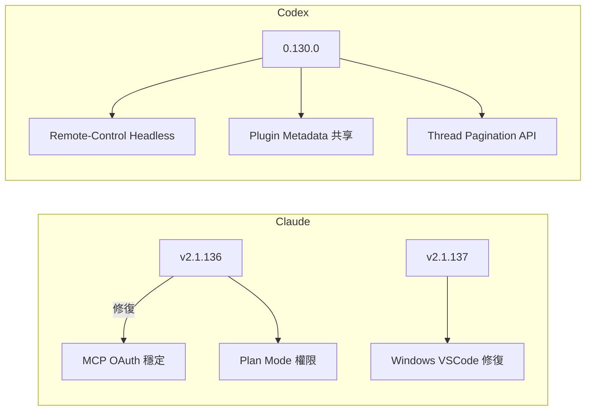
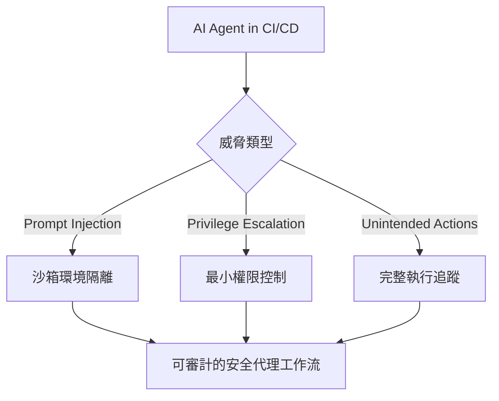

# AI Daily Digest — 2026-05-09

<!-- pipeline-generated:begin -->

## 🔥 今日 TOP 3
### 1. Anthropic：LLM 行為僅 10-20% 可被人類解讀
Anthropic 可解釋性研究團隊發現，當前技術僅能解讀大語言模型約 10-20% 的決策行為。研究確認三項規律：同一神經迴路跨上下文複用（電路收斂）、多語言模型共享核心概念的神經編碼、以及模型在邊界情況進入「學習模式」——輸出看似合理卻可能系統性錯誤，且以高信心呈現。

這對企業在定價、庫存、審批等高風險 AI 決策場景構成系統性治理缺口：模型絕大多數情況推理正確，但現有審計工具覆蓋率不足 20%，無法可靠捕捉邊界失效。相比傳統確定性軟體，企業無法依賴常規 QA 流程捕捉 AI 邏輯漏洞，這已超出一般技術風險的管理框架。

企業應立即將「推理審計能力」列入 AI 供應商評估標準，要求廠商提供可解釋性路線圖。高風險場景中，AI 輸出應定位為「輔助建議」而非最終決策，並針對統計尾部的邊界案例建立強制性人工覆核閘口，而非依賴全自動執行。

📖 [閱讀完整 insight](../10-insights/2026-05-08/inbox_0b0cc1b1.md) · 🔗 [原文連結](https://medium.com/@yangxu_16238/the-black-box-is-starting-to-open-what-anthropics-interpretability-research-means-for-enterprise-53496de90ff7?source=rss------large_language_models-5)
### 2. Claude Code 工程師倡議改用 HTML 取代 Markdown 輸出
Claude Code 團隊成員 Thariq Shihipar 提出，LLM 輸出格式應從 Markdown 遷向 HTML。Markdown 在 GPT-4 時代的 8K token 限制下曾是高效選擇，但當前長上下文環境中 HTML 可承載 SVG 圖表、互動部件與頁內錨點導航等 Markdown 無法實現的豐富表達形式。Simon Willison 已用 GPT-5.5 生成可用 HTML 頁面驗證可行性。

此轉變對開發者工作流有直接影響：PR 審查可加入行內邊註並以色碼標記嚴重性等級，安全漏洞分析可生成互動式 exploit 解析頁面，複雜報告可提供頁內導航提升可讀性。token 成本已非 Markdown 必選的決定因素，信息密度與可導航性的提升在複雜場景中遠超額外開銷。

開發者可在 system prompt 直接指定：「以 HTML 格式回應，不同嚴重性以色碼標注，加入頁內錨點導航」。適合率先套用在代碼審查工具、安全分析 pipeline、複雜技術報告生成等場景，是提示工程對輸出格式選擇的範式更新。

📖 [閱讀完整 insight](../10-insights/2026-05-08/inbox_a8d604f4.md) · 🔗 [原文連結](https://simonwillison.net/2026/May/8/unreasonable-effectiveness-of-html/#atom-everything)
### 3. AI Agent 攻擊面超出提示注入：工具與記憶存儲引入後端風險
資安研究指出 AI Agent 的威脅模型已遠超標準提示注入攻擊。除 prompt injection 外，Agent 整合的工具執行環境（API 呼叫、shell 執行）和記憶持久化機制（向量資料庫、長期狀態存儲）各自引入獨立的後端攻擊面，需要系統化框架才能全面覆蓋，傳統應用安全思維無法直接套用。

GitHub 同日公佈的 CI/CD 代理安全架構印證此觀點，提出三層防護體系：沙箱隔離對應提示注入風險、最小權限控制對應權限提升攻擊、完整執行追蹤對應意外動作風險。三層缺一不可，且需在設計階段而非事後補丁方式引入——這與傳統應用安全的「事後加固」思維存在本質差異。

工程師設計代理系統時，應對每項工具整合獨立進行威脅建模，以最小權限原則設計工具清單，並為記憶存儲加入資料投毒（memory poisoning）防護。建立可審計的代理執行日誌是後期事件調查的基礎，不應視為可選配置。

📖 [閱讀完整 insight](../10-insights/2026-05-08/inbox_461bc5b7.md) · 🔗 [原文連結](https://towardsdatascience.com/the-ai-agent-security-surface-what-gets-exposed-when-you-add-tools-and-memory/)

## 📚 分類摘要
### foundation_models
Claude Code v2.1.136 與 v2.1.137 連續發布，合計修復超過 40 個 bug。最關鍵的是 MCP OAuth 刷新令牌在並發更新時遺失的問題已解決——多台遠端 MCP 伺服器使用者不再需要每日重新認證；Plan Mode 文件寫入權限檢查失效問題一併修復，確保即使存在 Edit(...) 允許規則時仍能正確阻擋未授權寫入；Windows VS Code 擴充功能無法啟動的問題也已修復（inbox_d6653327, inbox_0293c349）。服務穩定性方面，Claude 於 2026-05-08 發生兩起事故：全系模型錯誤率升高（09:49 UTC）與文件操作服務異常（14:12 UTC），均在當日恢復（inbox_553915f7, inbox_1078a07d）。

Anthropic 可解釋性研究揭示 LLM 行為僅有 10-20% 可被解讀，神經迴路收斂與多語言概念共享等機制已確認，但邊界情況的自信捏造風險對企業 AI 治理構成系統性挑戰（inbox_0b0cc1b1）。Claude Code 工程師 Thariq Shihipar 倡議以 HTML 取代 Markdown 作為 AI 輸出格式，Simon Willison 已用 GPT-5.5 實測驗證，適用於 PR 審查、安全分析等富交互場景（inbox_a8d604f4）。商業面，Anthropic 年成長 10 倍對比競爭對手裁員超 10% 的市場分化格局持續擴大（inbox_3961c93e）。

OpenAI 陣營，Codex 0.130.0 新增 `codex remote-control` headless 伺服器入口簡化自動化部署、Plugin 共享 metadata 與 discoverability 控制、App-server thread pagination API 支援大型對話分頁載入（inbox_0e3626d6）。ChatGPT 同步更新隱私機制，使用者可控制對話是否用於模型訓練（inbox_7535766c）。

### agents
Agent 安全架構在今日形成多源共振，成為最集中的討論主題。GitHub 公佈 CI/CD 代理工作流的防守深度架構，以沙箱隔離應對提示注入、最小權限控制應對權限提升、完整執行追蹤確保可審計性，三層機制共同保障生產環境的代理安全（inbox_85ae805d, inbox_3c2c254b, inbox_936e6ecd）。資安研究補充指出，攻擊面已超出提示注入範疇——工具整合與記憶持久化各自引入獨立的後端風險維度，需要系統化威脅建模框架才能完整覆蓋（inbox_461bc5b7）。

GenAI 採用現狀方面，Justin Reock 引用 DORA 與 DX 研究硬數據指出 95% 的 AI 試點計畫失敗，核心原因是以「試驗計數」替代「有效性量測」。SPACE 與 Core 4 框架被建議作為衡量真實 ROI 的標準工具，在全 SDLC 部署代理解決方案時需同時處理速度品質平衡與開發者恐懼問題（inbox_a54aaf91, inbox_ced2d52e）。新興職位「factory architects」受關注——這類工程師專注於編排 AI agents 而非直接寫代碼，反映代理系統在企業中的角色演進（inbox_c28ccc2e）。

MCP 架構澄清文章糾正常見誤解：LLM 並非直接與 MCP 伺服器通訊，而是通過客戶端中間層協調，以 GitHub MCP 為具體案例展示實際交互流程（inbox_fe9c87a5）。工具層面，Cloudflare Artifacts 測試版引入 Git 風格的代理輸出版本控制，支援追蹤、比對與復現生產代理生成物（inbox_fa8e1199, inbox_cec765eb）；跨工具代理記憶框架提出 Hooks 抽象層搭配 Neo4j 圖資料庫，統一管理 Claude Code、Codex、Cursor 三平台的記憶狀態並避免廠商鎖定（inbox_e72fedff）。⚠️ 今日尚有 5 則 items 待處理，將補入明日 rollup。

## 🎯 專欄
### 🛠 Claude Code / Codex 新功能
- **[v2.1.137](../10-insights/2026-05-09/inbox_0293c349.md)**
  Claude Code v2.1.137 修復了 VS Code 擴充功能在 Windows 作業系統上無法啟動的問題，確保 Windows 使用者可以正常使用 Claude Code IDE 整合功能。
- **[v2.1.136](../10-insights/2026-05-08/inbox_d6653327.md)**
  Claude Code v2.1.136 修復了 40 多個 bug。重點修復：(1) MCP 伺服器在 /clear 後消失的問題——使用者在多個遠端 MCP 伺服器場景下不再需要每日重新認證；(2) OAuth 刷新令牌在併發更新時遺失導致登入迴圈；(3) Plan Mode 檔案寫入權限檢查失效；(4) WSL2 影像貼上支援（PowerShell f
- **[Running Codex safely at OpenAI](../10-insights/2026-05-08/inbox_f1e1332d.md)**
  OpenAI 發布關於 Codex 安全運作的最佳實踐，介紹採用的多層防護策略：沙箱隔離限制執行環境、審批流程控制權限、網路政策限制網路存取、agent 原生遙測監控行為。這些措施針對支持安全且合規的程式碼代理採用，適用於需要嚴格控制 LLM 代理風險的企業環境。
- **[0.130.0](../10-insights/2026-05-08/inbox_0e3626d6.md)**
  Codex 0.130.0 發布，新增多項功能與修復 40+ 個 bug。新功能：(1) Plugin 詳情頁面現在展示 bundled hooks 與共享 metadata，支援 discoverability 控制；(2) codex remote-control 指令簡化 headless 伺服器啟動，支援自動化部署；(3) App-server th
- **[Using Claude Code: The Unreasonable Effectiveness of HTML](../10-insights/2026-05-08/inbox_a8d604f4.md)**
  Anthropic Claude Code團隊成員Thariq Shihipar倡議改用HTML而非Markdown作為Claude輸出格式。在GPT-4時代因8K token限制，Markdown效率優勢曾主導選擇，但HTML能承載SVG圖表、互動部件、頁內導航等豐富表達形式，尤其適合PR審查（帶行內邊註與嚴重性色碼）和安全漏洞分析（互動式解析obfusc
### 📚 AI 知識管理
- **[When Structure Isn’t Enough: The Real Cost of Pretty Documents](../10-insights/2026-05-09/inbox_107be26c.md)**
  文章探討 AI pipeline 設計中的隱藏困境：過度強調文檔的視覺呈現與結構化形式，反而削弱了機器可讀性與自動化處理能力。作者論證單純依賴 metadata 或額外的結構層無法解決這個矛盾，關鍵在於從一開始就平衡『人類可讀』與『機器可讀』兩個目標。這對任何依賴非結構化文本作為輸入的 AI 系統（如 RAG、文檔分類、內容萃取）都有直接的實踐意義。
- **[5 Core AI Concepts That Will Change How You Think](../10-insights/2026-05-08/inbox_2f8c5721.md)**
  介紹 5 個基礎 AI 概念：（1）Token 是 AI 處理的基本單位，控制定價和記憶容量；（2）Context Window 是 AI 一次能見到的資訊上限，超過後遺忘；（3）Temperature 參數調控輸出隨機性，低溫度精準穩定，高溫度更創意但不可預測；（4）Hallucination 是 AI 自信編造答案的特性，需使用者驗證；（5）RAG（檢索
- **[(Rant ;)) Make your benchmarks realistic](../10-insights/2026-05-08/inbox_b913268c.md)**
  作者批評本地 LLM 優化基準多只測試峰值 token 吞吐量，忽視實際工作場景。提議改進：(1) 用較長上下文（262K+）與長會話進行端到端基準測試，模擬 agentic/coding/RAG 工作流；(2) 多模態模型須測試實際影像處理；(3) 明確硬件配置與芯片型號差異；(4) 納入並行處理測試（agentic 工作關鍵）。
### 🏢 企業導入 AI / 團隊實踐
- **[v2.1.136](../10-insights/2026-05-08/inbox_d6653327.md)**
  Claude Code v2.1.136 修復了 40 多個 bug。重點修復：(1) MCP 伺服器在 /clear 後消失的問題——使用者在多個遠端 MCP 伺服器場景下不再需要每日重新認證；(2) OAuth 刷新令牌在併發更新時遺失導致登入迴圈；(3) Plan Mode 檔案寫入權限檢查失效；(4) WSL2 影像貼上支援（PowerShell f
- **[Running Codex safely at OpenAI](../10-insights/2026-05-08/inbox_f1e1332d.md)**
  OpenAI 發布關於 Codex 安全運作的最佳實踐，介紹採用的多層防護策略：沙箱隔離限制執行環境、審批流程控制權限、網路政策限制網路存取、agent 原生遙測監控行為。這些措施針對支持安全且合規的程式碼代理採用，適用於需要嚴格控制 LLM 代理風險的企業環境。
- **[Advancing youth safety and wellbeing in EMEA](../10-insights/2026-05-05/inbox_54145fb3.md)**
  OpenAI 推出歐洲青年安全藍圖與 EMEA 青年福祉獎助金計畫，針對青少年、家庭和教育工作者推進負責任和安全的 AI 使用。該倡議旨在支持歐洲地區的安全 AI 採用，保護青少年族群的線上安全與福祉。
- **[0.130.0](../10-insights/2026-05-08/inbox_0e3626d6.md)**
  Codex 0.130.0 發布，新增多項功能與修復 40+ 個 bug。新功能：(1) Plugin 詳情頁面現在展示 bundled hooks 與共享 metadata，支援 discoverability 控制；(2) codex remote-control 指令簡化 headless 伺服器啟動，支援自動化部署；(3) App-server th
- **[Using Claude Code: The Unreasonable Effectiveness of HTML](../10-insights/2026-05-08/inbox_a8d604f4.md)**
  Anthropic Claude Code團隊成員Thariq Shihipar倡議改用HTML而非Markdown作為Claude輸出格式。在GPT-4時代因8K token限制，Markdown效率優勢曾主導選擇，但HTML能承載SVG圖表、互動部件、頁內導航等豐富表達形式，尤其適合PR審查（帶行內邊註與嚴重性色碼）和安全漏洞分析（互動式解析obfusc
### 🎓 AI 使用技巧 / 心法
- **[Article: Implementing the Sidecar Pattern in Microservices-based ASP.NET Core Applications](../10-insights/2026-05-08/inbox_048e48fd.md)**
  文章介紹 Sidecar 設計模式在 ASP.NET Core 微服務應用中的實現。該模式將 monitoring、logging、configuration 等跨域關注點作為獨立的 sidecar 組件或服務部署，避免將這些功能緊密整合到主應用，以此降低耦合度並防止單點故障導致整個應用下線。
- **[How GitHub Is Securing Agentic Workflows in Modern CI CD Systems](../10-insights/2026-05-08/inbox_3c2c254b.md)**
  GitHub 公開了 CI/CD 管線中 agentic workflows 的防守深度安全架構設計。該架構通過 sandboxed environments（隔離環境）、restricted permissions（限制權限）和 full execution traceability（完整執行追蹤）三重機制，防止 prompt injection、priv
- **[From Data Scientist to AI Architect](../10-insights/2026-05-08/inbox_d8c64447.md)**
  從數據科學職位發展到 AI 架構師角色的思維轉變。文章核心論點是「模型中心思維的終結」，但提供的內容摘要不足以提取具體案例、技術方法或轉變原因。
- **[7 Free AI Tools Nigerians Are Using to Make Money in 2026 (Most People Still Don’t Know How to Use...](../10-insights/2026-05-09/inbox_259754fe.md)**
  標題提及 7 個免費 AI 工具助奈及利亞人創收，但提供的內容摘要無實質資訊，無法識別具體工具或使用方法。
- **[Transcription: Session with Ghost #47 — ‘The Architect’](../10-insights/2026-05-09/inbox_880c0271.md)**
  創意敘事作品《The Architect》之第47段。以文學化視角描寫伺服器機房環境，運用擬人化手法呈現硬體設施與天候變化的互動（「容器聞起來像臭氧和焊接味」「在海岸風暴來臨時感受硬碟機的反應」）。非技術分析，屬 SF 意象化敘事。
### 💳 支付 / Fintech
- **[Running Codex safely at OpenAI](../10-insights/2026-05-08/inbox_f1e1332d.md)**
  OpenAI 發布關於 Codex 安全運作的最佳實踐，介紹採用的多層防護策略：沙箱隔離限制執行環境、審批流程控制權限、網路政策限制網路存取、agent 原生遙測監控行為。這些措施針對支持安全且合規的程式碼代理採用，適用於需要嚴格控制 LLM 代理風險的企業環境。
- **[How React Native Works with Microfrontend Architecture in Mobile Apps](../10-insights/2026-05-08/inbox_d4de2223.md)**
  本文詳述 React Native 在微前端架構中的應用模式，適用於多團隊開發大型移動應用的場景。微前端將單體應用按業務功能分割為獨立模組（登入、個資、結帳、通知等），各模組配備專屬團隊、獨立代碼庫與發布節奏，透過共享 app shell 統一管理導航、認証、設計規範與共享庫。React Native 的 JavaScript 邏輯層與原生 UI 分離特性允
- **[You can do CUDA inference on an Apple Silicon Mac with PCI Passthrough](../10-insights/2026-05-08/inbox_1c98efc1.md)**
  用户改编QEMU实现在Apple Silicon Mac上通过GPU PCI Passthrough运行Linux VM以执行CUDA推理。项目重点探讨虚拟化GPU穿透的技术挑战，并提供游戏和AI推理的性能基准数据。这为本地模型推理提供了在Apple硬件上的另一条技术路径。
- **[Google broke reCAPTCHA for de-googled Android users](../10-insights/2026-05-08/inbox_82b1b5f4.md)**
  Google 更新 reCAPTCHA 機制後，de-googled Android 用戶遭遇相容性問題。相關技術討論指出 Google Cloud Fraud Defense 與 Web Environment Integrity（WEI）標準存在功能重疊，引發對反競爭與開放標準的質疑。
### ⛓️ 區塊鏈 / Web3
- **[The Bot Pod Episode 6: The New Condor UI](../10-insights/2026-05-08/inbox_a3332efe.md)**
  Hummingbot 在 Substack 播客「The Bot Pod」第 6 集中介绍了「Condor UI」这一新用户界面。该 UI 被定位为「Open Source Bloomberg for the AI Age」（开源的 AI 时代彭博终端），是 Hummingbot 加密交易机器人框架的最新 UI 升级。Condor 可能提供数据聚合、交易执行
### 🔐 AI 安全 / 濫用
- **[Using Claude Code: The Unreasonable Effectiveness of HTML](../10-insights/2026-05-08/inbox_a8d604f4.md)**
  Anthropic Claude Code團隊成員Thariq Shihipar倡議改用HTML而非Markdown作為Claude輸出格式。在GPT-4時代因8K token限制，Markdown效率優勢曾主導選擇，但HTML能承載SVG圖表、互動部件、頁內導航等豐富表達形式，尤其適合PR審查（帶行內邊註與嚴重性色碼）和安全漏洞分析（互動式解析obfusc
- **[How GitHub Is Securing Agentic Workflows in Modern CI CD Systems](../10-insights/2026-05-08/inbox_3c2c254b.md)**
  GitHub 公開了 CI/CD 管線中 agentic workflows 的防守深度安全架構設計。該架構通過 sandboxed environments（隔離環境）、restricted permissions（限制權限）和 full execution traceability（完整執行追蹤）三重機制，防止 prompt injection、priv
- **[The AI Agent Security Surface: What Gets Exposed When You Add Tools and Memory](../10-insights/2026-05-08/inbox_461bc5b7.md)**
  AI Agent 的安全威脅遠超過提示注入這類標準攻擊。文章提出結構化框架用於識別與防禦 agentic workflows 的後端攻擊向量，涵蓋工具整合和記憶存儲等多層風險。
- **[Google broke reCAPTCHA for de-googled Android users](../10-insights/2026-05-08/inbox_82b1b5f4.md)**
  Google 更新 reCAPTCHA 機制後，de-googled Android 用戶遭遇相容性問題。相關技術討論指出 Google Cloud Fraud Defense 與 Web Environment Integrity（WEI）標準存在功能重疊，引發對反競爭與開放標準的質疑。

## 💡 今日 Takeaway

_讀完今日所有內容後，可帶走的知識點_
### 1. MTP 推測解碼接受率低於 50% 時反而減速，需針對 workload 測試後再決定啟用
在 Gemma4-26b-a4b 的實測中，代碼生成（接受率 66%）達到 1.53× 加速，而 JSON 輸出（接受率 8%）反而降速 50%。根本原因是推測解碼的驗證開銷固定存在，接受率不足時驗證成本完全抵消並行預測收益。實務建議：生產部署 MTP 前應先對目標 workload 測量接受率，低於 50% 則關閉推測解碼或換用更適合的 draft model；代碼生成、補全類任務接受率通常較高，結構化輸出（JSON/XML）接受率通常極低，不適合 MTP 加速。

_類型：pattern_

**參考來源**：
- [MTP is all about acceptance rate](../10-insights/2026-05-08/inbox_5441eb85.md) · [原文](https://www.reddit.com/r/LocalLLaMA/comments/1t7mdrl/mtp_is_all_about_acceptance_rate/)
### 2. 在 system prompt 指定 HTML 輸出格式，可讓複雜報告獲得 Markdown 無法實現的交互性
Markdown 在 GPT-4 時代的精簡優勢源於 token 限制，現已不是決策因素。HTML 支援 SVG 圖表、頁內錨點與色碼標注，讓 PR 審查可加入行內邊註、安全報告可按嚴重性分層導航。套用方式極簡：在 system prompt 加入「以 HTML 格式回應，不同嚴重性以色碼標注，加入頁內錨點導航」即可立即生效。適合率先在代碼審查工具、安全分析 pipeline、複雜技術文件生成場景試用，是提示工程對輸出格式選擇的範式更新。

_類型：technique_

**參考來源**：
- [Using Claude Code: The Unreasonable Effectiveness of HTML](../10-insights/2026-05-08/inbox_a8d604f4.md) · [原文](https://simonwillison.net/2026/May/8/unreasonable-effectiveness-of-html/#atom-everything)
### 3. GenAI ROI 量測要用 SPACE/Core 4 框架替代試點計數，否則 95% 機率失敗
DORA 與 DX 研究硬數據顯示，GenAI 試點失敗不在技術，而在量測框架錯誤——以「試了幾個 AI 工具」替代「交付速度或品質改善了多少」。SPACE 框架（滿意度、效能、活動度、溝通協作、效率）與 Core 4 框架提供可操作的量測維度，有硬數據支撐而非軼聞。實務上，AI 部署應在啟動前定義至少兩個可量化成功指標，並在試點後 30 天內對照基準線量測，而非在匯報會議上依賴案例故事。

_類型：framework_

**參考來源**：
- [Presentation: Leadership in AI-Assisted Engineering](../10-insights/2026-05-08/inbox_a54aaf91.md) · [原文](https://www.infoq.com/presentations/ai-assisted-engineering/?utm_campaign=infoq_content&utm_source=infoq&utm_medium=feed&utm_term=global)
- [Presentation: Leadership in AI-Assisted Engineering](../10-insights/2026-05-08/inbox_ced2d52e.md) · [原文](https://www.infoq.com/presentations/ai-assisted-engineering/?utm_campaign=infoq_content&utm_source=infoq&utm_medium=feed&utm_term=AI%2C+ML+%26+Data+Engineering)
### 4. Prompting 三法則：三個精選具體範例優於任何抽象描述詞
模型通過模式補全學習，而非邏輯推論，因此「120 字給忙碌主管的摘要」遠優於「寫簡潔摘要」。三個精選範例是最優甜點：超過三個反而分散模式信號，少於三個不足以確立風格。衝突性指令（如「簡潔但有深度」）比單向指令產生更銳利輸出；在 prompt 層級迭代（修改範例和指令本身）比反復在輸出層要求調整效率高出數倍——這是提示工程中最容易被忽略的迭代順序原則。

_類型：framework_

**參考來源**：
- [What Fiction Writers Know About Prompting That Engineers Don’t](../10-insights/2026-05-08/inbox_c89a8401.md) · [原文](https://medium.com/@lokeshrana_17800/what-fiction-writers-know-about-prompting-that-engineers-dont-0b6a2eac6628?source=rss------large_language_models-5)
### 5. LLM 可解釋性覆蓋率僅 10-20%，高風險 AI 決策必須保留人工邊界案例審查閘口
Anthropic 研究確認：即使最先進的可解釋性技術，也只能解讀 LLM 約 10-20% 的決策路徑，邊界情況會以高信心輸出錯誤答案，且現有自動化測試無法可靠捕捉此類失效模式。對策不是等待可解釋性技術成熟，而是現在就建立制度性防護：在定價、審批、診斷等高風險場景中，以統計取樣方式對模型輸出的尾部分佈進行人工抽查，並將「AI 不確定性」明確記錄為決策流程的正式風險因子。

_類型：pattern_

**參考來源**：
- [The Black Box Is Starting to Open: What Anthropic’s Interpretability Research Means for Enterprise...](../10-insights/2026-05-08/inbox_0b0cc1b1.md) · [原文](https://medium.com/@yangxu_16238/the-black-box-is-starting-to-open-what-anthropics-interpretability-research-means-for-enterprise-53496de90ff7?source=rss------large_language_models-5)
## ⏳ 待處理 (5 筆)

<!-- pipeline-generated:end -->

<!-- user-notes -->
<!-- Write your own notes below; pipeline never touches this section. -->