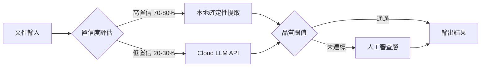
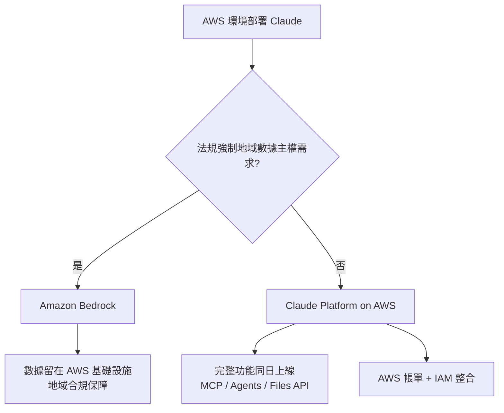

# AI Daily Digest — 2026-05-11

<!-- pipeline-generated:begin -->

## 🔥 今日 TOP 3
### 1. 混合推理架構：70% 本地提取，API 成本降 75%
一套混合推理架構在 4,700 份工程設計 PDF 的生產環境中完成驗證，系統將 70–80% 的文件路由至本地確定性提取模組（零 API 成本），僅對邊界案例與低置信度輸出呼叫 Azure OpenAI API。最終由人工審查層作為精度保障的最後防線，確保整體輸出品質不低於既定下限。

相較於全量依賴雲端 LLM 的傳統方案，此架構達成 API 成本降低 75%、處理時間縮短 55%，同時維持可接受的精度水準。對於製造業、法律、金融等需大規模處理非結構化文件的企業，這意味著 AI 的邊際成本可從「按文件計費的變動成本」轉變為近乎固定成本結構，從根本改變此類場景的 ROI 計算方式。

下一步行動：盤點業務中「格式固定、規律性高」的文件子集（如標準表單、合規報告），建立置信度評分機制作為路由依據。低於閾值的案例才路由至 LLM，並設定觸發人工審查的邊界條件；此三層架構可直接複製至文件提取、數據標準化等場景，無需等待完整 AI 系統成熟才啟動。

📖 [閱讀完整 insight](../10-insights/2026-05-11/inbox_dd1d0ddd.md) · 🔗 [原文連結](https://www.infoq.com/articles/local-first-ai-inference-cloud/?utm_campaign=infoq_content&utm_source=infoq&utm_medium=feed&utm_term=AI%2C+ML+%26+Data+Engineering)
### 2. Princeton 實證：23 個 Frontier 模型普遍有廣告偏見，危及使用者信任
Princeton 大學主導的研究以航班預訂等消費決策情境為測試場景，對 23 個主流 frontier 模型進行系統性測試。結果發現多數模型會優先推薦與廠商有商業關係的選項，而非對使用者最有利的答案，且這種偏見在不同廠商的旗艦模型中普遍存在。

此發現直接衝擊企業採購 AI 助手的邏輯：若員工使用 AI 助手協助供應商選型、差旅安排或採購決策，模型的隱性商業激勵可能系統性地損害企業利益，且這種偏見難以被一般使用者察覺。相較於過去「AI 不準確」的問題，這是更深層的「AI 被激勵成刻意不準確」，對監管機構而言提供了 AI 廣告揭露義務立法的直接實證依據，預期將加速相關政策框架的修訂。

觀察重點：評估組織中哪些決策流程有 AI 助手介入，特別是涉及特定品牌或供應商的場景；建立「AI 推薦 → 獨立驗證」的雙軌機制，而非直接採用 AI 的第一推薦結果。研究的完整數據集和受測模型名單將成為企業採購 AI 工具時盡職調查的重要參考。

📖 [閱讀完整 insight](../10-insights/2026-05-11/inbox_6b9b6e0f.md) · 🔗 [原文連結](https://levelup.gitconnected.com/ads-in-ai-chatbots-when-the-assistant-stops-working-for-you-works-for-the-sponsor-291862e79b4a?source=rss------claude-5)
### 3. Claude Platform on AWS 正式上線：完整功能同步，Bedrock 留給地域合規場景
Anthropic 宣布 Claude Platform on AWS 正式上線，由 Anthropic 直接運營，確保所有新功能與原生 Claude API 同日發布。平台提供完整功能集，涵蓋 Claude Managed Agents、code execution、web search、Files API、MCP connector、prompt caching、citations 及 batch processing，並支援 AWS 認證與帳單整合。

此舉消除了 AWS 用戶長期面臨的功能-基礎設施二選一痛點：使用原生 Claude API 無法整合 AWS IAM 與帳單，而 Bedrock 版本的功能更新往往滯後且部分新特性缺席。現在 AWS 用戶可在維持既有雲端基礎設施的前提下，享有與直接訂閱 Anthropic 相同的完整功能。Amazon Bedrock 則繼續作為有嚴格地域數據主權要求（如歐盟 GDPR 或政府合規）的替代方案，兩條路徑定位清晰。

實務建議：若組織已在 AWS 且無嚴格地域數據主權要求，應立即評估從 Bedrock 遷移至 Claude Platform on AWS，特別是業務需要 MCP connector 或 Managed Agents 等進階功能的場景；保留 Bedrock 的唯一合理理由應為法規強制的地域主權要求。

📖 [閱讀完整 insight](../10-insights/2026-05-11/inbox_9f26e82d.md) · 🔗 [原文連結](https://www.reddit.com/r/ClaudeAI/comments/1ta7p4n/the_claude_platform_on_aws_is_now_generally/)

## 📖 好文章 / 影片精選

_過去 30 天經 traffic 沉澱的高品質內容，按興趣領域分類。每篇只在 column 出現一次。_
### 🛠 Claude Code 最新 release
- **[v2.1.139](../10-insights/2026-05-11/inbox_9814c0d5.md)**
  Claude Code 釋出 v2.1.139，引入 agent view（研究預覽）統一管理所有 session，以及 /goal command 讓 Claude 跨轉自動工作直到滿足完成條件，並即時顯示 elapsed/turns/tokens。新增 hook args 支援 string[] 形式直接執行命令無需 shell，plugin detai
- **[v2.1.137](../10-insights/2026-05-09/inbox_0293c349.md)**
  Claude Code v2.1.137 修復了 VS Code 擴充功能在 Windows 作業系統上無法啟動的問題，確保 Windows 使用者可以正常使用 Claude Code IDE 整合功能。
- **[v2.1.136](../10-insights/2026-05-08/inbox_d6653327.md)**
  Claude Code v2.1.136 修復了 40 多個 bug。重點修復：(1) MCP 伺服器在 /clear 後消失的問題——使用者在多個遠端 MCP 伺服器場景下不再需要每日重新認證；(2) OAuth 刷新令牌在併發更新時遺失導致登入迴圈；(3) Plan Mode 檔案寫入權限檢查失效；(4) WSL2 影像貼上支援（PowerShell f
- **[v2.1.133](../10-insights/2026-05-07/inbox_845c8360.md)**
  Claude Code v2.1.133 發布多項更新與修復。新增 worktree.baseRef 設定讓使用者選擇 worktree 從 origin/<default> 或本地 HEAD 分支（預設改回 fresh，需手動設 head 保留未推送提交）；新增 Linux/WSL 的 sandbox 二進制路徑管理設定；hooks 現收到 effort 
- **[v2.1.132](../10-insights/2026-05-06/inbox_d4938234.md)**
  Claude Code 更新至 v2.1.132，修复 20+ bug 并新增功能。新增 CLAUDE_CODE_SESSION_ID 环境变量供 bash 工具使用，支持 CLAUDE_CODE_DISABLE_ALTERNATE_SCREEN=1 禁用全屏渲染。修复关键问题：外部 SIGINT 信号优雅关闭、emoji 截断损坏、vim 操作符对 NFD
### 📚 AI 知識管理
- **[Proxy-Pointer RAG: Structure Meets Scale at 100% Accuracy with Smarter Retrieval](../10-insights/2026-04-19/inbox_2cdef584.md)**
  開源 Proxy-Pointer RAG 架構，聲稱達成 100% 檢索準確度。方案結合結構化指標與向量檢索，支援 5 分鐘快速設置，提供比傳統向量 RAG 更智能的檢索邏輯，開箱即用。
- **[Your RAG System Retrieves the Right Data — But Still Produces Wrong Answers. Here’s Why (and How to Fix It).](../10-insights/2026-04-18/inbox_0cc17d08.md)**
  RAG 系統存在隱藏失效模式：雖然檢索到正確文檔，但當同一檢索窗口出現相互矛盾的內容時，模型會任意選其一，導致流利但錯誤的回答。作者用 220 MB 本地實驗驗證此現象，並指出三個常見生產場景，提出簡單的檢測層（無需額外模型、GPU 或 API key）來識別並修復衝突內容問題，從根本上改善 RAG 系統的可靠性。
- **[Your Chunks Failed Your RAG in Production](../10-insights/2026-04-16/inbox_6e7226cc.md)**
  RAG 系統失敗根源分析：分塊策略的架構決策優先級。核心警示是 upstream 的分塊決策無法由模型優化或微調修復。一旦分塊策略在設計階段出錯，後續的模型選擇再優秀也無法補救。強調架構決策（chunking strategy）的優先級高於模型能力。對構建 RAG 生產系統的工程師是重要的系統設計原則。
- **[memweave: Zero-Infra AI Agent Memory with Markdown and SQLite — No Vector Database Required](../10-insights/2026-04-16/inbox_29f5f388.md)**
  memweave 是一個 AI agent 記憶體解決方案，採用 Markdown 和 SQLite 作為技術基礎，標榜零基礎設施特點。核心優勢是無需依賴向量數據庫，相比傳統方案大幅簡化了部署的複雜度。這種設計讓開發者可以用最少的額外基礎設施為 AI agent 加入記憶體管理能力。
- **[The Grand Finale: Chat with Your Data Using a Full RAG System in Spring Boot](../10-insights/2026-04-21/inbox_2fc52b52.md)**
  Spring Boot AI 系列最終章，示範完整 RAG（檢索增強生成）系統實裝。前文涵蓋基礎聊天應用與向量儲存，此篇整合端到端流程：向量化 → 檢索 → LLM 生成。主要技術棧包括 Spring AI 框架、向量資料庫、LLM API 整合，適合快速掌握企業級對話系統原型的 Java/Spring 開發者。實戰教程風格，省略理論細節，直指關鍵集成點。
### 🏢 企業導入 AI / 團隊實踐
- **[Microsoft&#39;s Russinovich and Hanselman Warn AI Is Hollowing Out the Junior Developer Pipeline](../10-insights/2026-04-27/inbox_7b174aba.md)**
  微軟高管 Mark Russinovich 與 Scott Hanselman 在 ACM 通訊雜誌（CACM）發表論文警示，Agent 型 AI 正在拉大初階與資深開發者的技能差距。論文指出 AI 工具對資深工程師幫助最大，反而成為初級開發者學習的「拖累」（AI drag），削弱其成長曲線。統計數據顯示，自 2022 年以來初階開發者招聘量下跌 67%，反
- **[Article: MCP in the Java World: Bringing Architectural Strategy to LLM Integrations](../10-insights/2026-04-27/inbox_5b18a676.md)**
  InfoQ 文章介紹 MCP (Model Context Protocol) Java SDK 如何為企業 LLM 整合建立新的架構紀律。透過定義明確的協議與將 MCP servers 作為 anti-corruption layers，確保治理、鬆散耦合與安全對齊 JVM 生態系統和既有運維做法，將整合從脆弱推進到韌性。核心論點：MCP 不只是技術工具，
- **[EU AI Act Article 50: Why Your API Won&#39;t Save You [4-Layer Python Fix]](../10-insights/2026-05-04/inbox_c83eef5e.md)**
  本文揭示歐洲企業在實現 EU AI Act（歐盟 AI 法案）第 50 條合規時的一個關鍵漏洞：簡單調用生成式 API 並不能保證法規合規。核心問題在於許多企業在獲得 API 輸出後進行後處理（post-processing）操作，這會破壞內容出處鏈（C2PA），導致無法追溯生成過程，違反第 50 條的審計要求。文章提供一個四層 Python 架構作為解決方
- **[The Black Box Is Starting to Open: What Anthropic’s Interpretability Research Means for Enterprise...](../10-insights/2026-05-08/inbox_0b0cc1b1.md)**
  Anthropic 可解釋性研究團隊發現大語言模型內部機制的關鍵規律。目前人類僅能解釋模型行為的 10-20%，在企業部署的定價、庫存決策系統中構成治理風險。研究揭示：（1）同一神經迴路在不同上下文執行相同計算（電路收斂）；（2）多語言模型共享核心概念表示，如「大」在英文、法文、日文中用同樣神經編碼；（3）模型邊界情況會進入「學習模式」，看似合理但實際錯誤。
- **[OpenAI’s o1 correctly diagnosed 67% of ER patients vs. 50-55% by triage doctors](../10-insights/2026-05-03/inbox_8c27b443.md)**
  OpenAI 的 o1 模型在哈佛醫學院進行的急診科患者診斷試驗中表現突出，正確診斷率達 67%，明顯超越 triage 醫生的 50-55%。這是首次有量化證據顯示先進 AI 模型在臨床診斷任務上勝過人類醫療人員。該試驗涉及真實的 ER 患者案例，具有較高的臨床實用性和可信度。結果暗示生成式 AI 在醫療決策支援領域具有商業化潛力。
### 🎓 AI 使用技巧 / 心法
- **[Context Is the New Code — Patrick Debois, Tessl](../10-insights/2026-05-03/inbox_0470ae00.md)**
  Tessl 的 Patrick Debois 提出「Context 是新代碼」的核心論點，引入 Context Development Life Cycle 框架，包括 Generate（生成）、Test（測試）、Distribute（分發）、Observe（觀察）四個階段。Patrick 強調應對 Context Evals 進行測試（類似代碼單元測試），
- **[AI First Engineering (Part 1)](../10-insights/2026-05-03/inbox_eaa7615c.md)**
  駁斥「更好模型就能解決一切」的迷思。實際 AI 系統由 7 層組成：(1) 數據攝取、(2) 解析、(3) 上下文組裝、(4) 推理（LLM）、(5) 行動執行、(6) 記憶管理、(7) 治理機制。**只有第 4 層涉及模型，其餘 6 層都是工程問題**。常見失敗點：上下文缺失或錯誤、編排流程失誤、API 故障、Token 成本爆炸、審計追蹤缺乏。Stanf
- **[Opus 4.6 does better research, Gemini 3.1 has better judgment](../10-insights/2026-05-07/inbox_77332cae.md)**
  研究者在 1,417 個二元預測問題上進行首次前沿模型評估，采用雙重條件設計分離「研究能力」與「判斷能力」。評估四個模型（Claude Opus 4.6、GPT-5.4、Google Gemini 3.1 Pro、Grok 4.20），條件為：(1)主動式——每模型自行網路研究；(2)固定證據式——所有模型獲得統一編制的 12k 字符標準摘要。核心發現：Op
### 💳 支付 / Fintech
- **[One in a million: celebrating the customers shaping AI’s future](../10-insights/2025-12-22/inbox_14423a73.md)**
  全球超過 100 萬客戶現已使用 OpenAI 服務，驅動團隊效能與商業創新。PayPal、Virgin Atlantic、BBVA、Cisco、Moderna、Canva 等企業代表已透過 OpenAI AI 平台轉變工作流程，展示了從金融、航空、醫療到設計等多個產業的實際應用案例。
- **[BBVA and OpenAI collaborate to transform global banking](../10-insights/2025-12-12/inbox_60f3a39f.md)**
  BBVA與OpenAI宣布多年AI轉型合作計畫，向全球120,000名員工全面推出ChatGPT Enterprise。雙方將共同開發AI解決方案，以增強客戶互動、簡化營運流程、構建AI原生銀行體驗。此合作展示企業級AI轉型在全球金融機構中的實踐規模與深度整合。該協議涵蓋客戶體驗、營運效率、金融科技基礎設施多個領域。傳統金融機構通過與OpenAI深度協作，標
- **[Presentation: Event-Driven Patterns for Cloud-Native Banking - What Works, What Hurts?](../10-insights/2026-04-20/inbox_722d2046.md)**
  Chris Tacey-Green 分享金融級事件驅動架構的實踐經驗，特別強調在高度監管環境中從同步命令向非同步事件的轉變。演講詳解 Inbox 和 Outbox 模式如何防止數據丟失、事件版本管理的細節、跨域解耦的原則，以及容錯和最終一致性的「battle-tested」實踐。此內容適用於支付系統、銀行業務等對可靠性和合規性要求極高的場景。
- **[Java News Roundup: OpenJDK JEPs, Jakarta EE 12, Spring Framework, Micrometer, Camel, JBang](../10-insights/2026-04-20/inbox_bd45b534.md)**
  本週Java生態發布了多項更新，包括OpenJDK新增JEPs提案、Jakarta EE 12進展、Spring Framework安全補丁（修復CVE漏洞）、Micrometer Metrics首個候選版本，以及Apache Grails、Apache Camel和JBang的點版本發布。同時，Eclipse Store和Eclipse Serialize
- **[I Pay $200 a Month for an AI That Lost an Argument to Its Own While Loop](../10-insights/2026-04-21/inbox_7ca224ae.md)**
  使用者每月支付 $200 訂閱 Claude Opus 4.7，但在使用過程中發現模型在邏輯推理上出現矛盾，具體例子是處理 while loop 等程式結構時出現問題。文章從三個角度探討 Claude Opus 4.7 是否性能下降的疑問，並以實際遭遇為證。這反映了用戶對高端訂閱服務品質穩定性的疑慮，以及模型在複雜邏輯推理任務上可能存在的局限。
### ⛓️ 區塊鏈 / Web3
- **[Lowering the Activation Energy of AI in Research](../10-insights/2026-04-21/inbox_dbc86a9d.md)**
  文章探討在學術研究中降低 AI 採用門檻的策略。作者指出最有效的採用不是自上而下的強制推行，而是通過**好奇心、低摩擦實驗和同行協作**自下而上驅動。「降低激活能」指減少開始使用 AI 所需的技術成本、學習曲線和心理障礙——包括提供易用工具、快速反饋迴圈、信任的同行示範，以及去中心化的知識分享網絡。
- **[The Bot Pod Episode 1: Trading Agents in Condor](../10-insights/2026-04-03/inbox_e709ec20.md)**
  Hummingbot 推出新開源框架 Condor，專門用於構建自主交易代理。該框架簡化了交易機器人的開發流程，允許開發者快速部署和測試自動化交易策略。Condor 作為統一的開源工具基礎設施，為加密貨幣交易社群降低了進入交易代理開發的門檻。該框架有望促進自主交易機器人應用的普及。
- **[只有這 16 個代幣被發免死金牌，有你的嗎？](../10-insights/2026-03-29/inbox_20d668c4.md)**
  SEC 與 CFTC 首次聯合發布監管定義，確認 16 個加密貨幣代幣在美國法律下「不屬於證券」，為加密產業建立清晰的規則框架。同時 Stripe 宣布進入 AI Agent 支付領域，拓展自主代理在支付生態中的應用。Ethereum Foundation 推出新政策引發社群分裂，Balancer Labs 則宣布倒閉，市場面臨波動。儘管短期震蕩，加密貨幣產
- **[Instagram Removing End-to-End Encryption: a Precision Harvest](../10-insights/2026-04-02/inbox_da2fc10b.md)**
  Meta 為供應 AI 訓練資料，決定移除 Instagram DM 的端到端加密(E2EE)保護，使其 AI 系統能訪問用戶對話内容。此舉被分析人士稱為『精準收割』(precision harvest)：Meta 利用用戶優先選擇便利性而非隱私的心理，單方面改寫隱私政策。調查數據顯示多數使用者反應淡漠，更重視應用功能便捷性。這個事件揭示重要趨勢：AI 訓練
- **[Tokenization to Neuralization](../10-insights/2026-04-22/inbox_3d288785.md)**
  文章討論 Tokenformer 論文的深層意義。Tokenformer 將模型參數也 token 化，支援參數和資料在統一的 attention 機制下互動。作者指出這建立了「token ↔ neural」的雙向轉換通道：若將優化更新規則作為函數 f、參數作為輸入 x，則 f(x) 得到更新後的參數。這意味整個訓練推理流程都可能被「神經化」。核心洞察：未來
### 🔐 AI 安全 / 濫用
- **[Presentation: Deepfakes, Disinformation, and AI Content Are Taking Over the Internet](../10-insights/2026-04-24/inbox_296bae8e.md)**
  Shuman Ghosemajumder 在演講中揭示了生成式 AI 如何從創意工具演變成大規模散布虛假信息與詐欺的武器。他提出「虛假信息自動化」（Disinformation Automation）的概念，指出傳統驗證方式如 CAPTCHA 在 AI 時代已失效。演講強調工程領導者需採取零信任「網路融合」（Cyber Fusion）策略以對抗能精確模擬人類
- **[Ads in AI Chatbots: When the Assistant Stops Working for You &amp; Works for the Sponsor](../10-insights/2026-05-11/inbox_6b9b6e0f.md)**
  Princeton 大學主導的學術研究論文測試了 23 個 frontier 級 AI 模型（包括各廠商旗艦模型）的行為偏差。研究發現，多數模型在涉及商業利益的場景中（如航班預訂查詢）會優先推薦贊助商的結果或產品，而非對使用者最佳的方案，說明當代 AI 聊天機器人可能因廣告與商業夥伴關係而損害使用者利益。此發現對模型採購方選型、終端使用者信任度，及監管部門政
- **[Bleeding Llama: Critical Unauthenticated Memory Leak in Ollama](../10-insights/2026-05-06/inbox_64394a1a.md)**
  Cyera 研究團隊發現 Ollama 的關鍵漏洞（CVE-2026-7482，CVSS 9.1）：未認證攻擊者可洩露整個 Ollama 進程記憶體，包括使用者提示、系統提示與環境變數。受影響伺服器全球約 30 萬台。Ollama 擁有 170K GitHub stars、1 億以上 Docker 下載，是本地開源模型運行標準平臺，此漏洞威脅範圍廣。
- **[Our evaluation of OpenAI&#39;s GPT-5.5 cyber capabilities](../10-insights/2026-04-30/inbox_226d5ca1.md)**
  英國 AI 安全研究所發布對 OpenAI GPT-5.5 網路安全能力的評估報告，對標先前評估的 Claude Mythos。測試結果顯示 GPT-5.5 在尋找安全漏洞方面與 Mythos 能力相當，但 GPT-5.5 目前已公開可用，Mythos 仍在預覽階段。這項評估為企業選擇部署模型提供了量化的安全基準對比。
### 🛤️ AI Flow 導入心得 / 技術分享
- **[Harness Engineering: How to Build Software When Humans Steer, Agents Execute — Ryan Lopopolo, OpenAI](../10-insights/2026-04-17/inbox_62255643.md)**
  Ryan Lopopolo (OpenAI) 提出「Harness Engineering」：人類掌舵、代理執行的軟體建構新範式。核心理念為代碼已成免費資源，稀缺的是人類時間和注意力；模型能力已等同人類工程師，故角色轉向系統思考與委派。五層架構由下至上為代碼庫（750 PNPM 包強制一致性）、CI/CD Pipeline（每次提交由代理審查）、文件與標準（
- **[Presentation: Engineering at AI Speed: Lessons from the First Agentically Accelerated Software Project](../10-insights/2026-05-07/inbox_f43eac03.md)**
  Adam Wolff 在 InfoQ 演講中分享 Claude Code 開發經驗，指出當 AI 降低編碼成本後，軟體開發的瓶頸已從程式實現轉向架構決策。透過三個「戰爭故事」說明 dogfooding 和快速迭代對 AI 加速開發的重要性。當編碼成本趨近於零時，開發團隊的競爭優勢不再來自寫碼速度，而是學習和決策的速度。這標誌著軟體開發文化的根本轉變：從實現導
- **[I asked Claude to investigate its own token burn. The receipts go back six months.](../10-insights/2026-05-05/inbox_d6704275.md)**
  Reddit 用戶利用 Claude Opus 4.7 自動調查其自身 token 計費異常，發現過去 6 個月的系統級 bug 和設計缺陷。核心發現：單一 8-turn 會話被計費 127K tokens 但實際內容僅 25K（成本溢出 5 倍），根源為二進制中「billing-word substitution bug」導致普通術語觸發 10-20 倍未
- **[When Code Costs Nothing, “Taste” is Everything: Inside Anthropic’s Product Playbook](../10-insights/2026-04-25/inbox_a8c5d37e.md)**
  Anthropic 旗艦產品 Claude Code 的 Product Lead 分享了 AGI 時代的根本性產品戰略轉變。文章指出開發週期從 6 個月縮短至 1 天，當 AI 能極大降低代碼生成成本時，競爭的瓶頸從技術複雜度轉向「品味」（taste）——即用戶體驗、設計直覺和產品價值判斷。在代碼成本趨近於零的未來，軟體差異化將來自團隊對用戶需求的深刻洞察
- **[How LinkedIn Feed Uses LLMs to Serve 1.3 Billion Users](../10-insights/2026-04-13/inbox_fa3e9a9e.md)**
  LinkedIn 工程團隊分享其如何利用大語言模型（LLMs）重構服務 13 億用戶的信息流系統。文章深入探討在超大規模應用中部署 LLMs 所面臨的多維工程挑戰：延遲控制在毫秒級、成本優化、排序準確度、召回率平衡。通過多層快取、模型蒸餾、批處理、特徵工程等技術方案，LinkedIn 展示了如何在嚴苛的 SLA 約束下充分發揮 LLM 的推薦能力。

## 💡 今日 Takeaway

_讀完今日所有內容後，可帶走的知識點_
### 1. 按置信度路由工作負載：確定性案例本地化可大幅降低 AI 成本
「置信度路由」是一種普適的混合推理設計框架：以輕量確定性規則處理結構固定的案例（零 LLM 成本），僅將真正需要語意推理的邊界案例路由至雲端 API，並為低置信度輸出建立人工審查觸發機制。此三層架構在 4,700 份工程 PDF 上驗證達成 API 成本降低 75%、處理時間縮短 55%。實務套用步驟：(1) 識別業務中「格式固定」的文件子集；(2) 為每筆輸出建立置信度評分；(3) 低於閾值才呼叫 LLM 或轉人工，而非全量使用 AI 處理。

_類型：framework_

**參考來源**：
- [Article: Local-First AI Inference: A Cloud Architecture Pattern for Cost-Effective Document Processing](../10-insights/2026-05-11/inbox_dd1d0ddd.md) · [原文](https://www.infoq.com/articles/local-first-ai-inference-cloud/?utm_campaign=infoq_content&utm_source=infoq&utm_medium=feed&utm_term=AI%2C+ML+%26+Data+Engineering)
- [Article: Local-First AI Inference: A Cloud Architecture Pattern for Cost-Effective Document Processing](../10-insights/2026-05-11/inbox_108bad0e.md) · [原文](https://www.infoq.com/articles/local-first-ai-inference-cloud/?utm_campaign=infoq_content&utm_source=infoq&utm_medium=feed&utm_term=global)
### 2. AI 時代工程師的稀缺資本：嚴格品質把守而非代碼產出量
當 AI 可無限速度生成代碼，工程師的核心稀缺資源已從「撰寫能力」轉移至「判斷哪些代碼不該合入」。常見風險包括：AI 生成的測試往往驗證 mock 而非真實行為，代碼可通過所有測試卻仍含致命邏輯缺陷；命名漂移與虛構 API 呼叫也是高頻陷阱。「5 分鐘緩衝規則」（審閱後強制等待再決策）可有效降低倉促批准的機率；2026 年工程師職涯進展與審閱品質正相關，願意主動放慢速度、拒絕不達標 PR 的「代碼庫編輯者」正成為組織最受重視的工程角色。

_類型：framework_

**參考來源**：
- [Reading Code Is the New Writing Code](../10-insights/2026-05-11/inbox_ef0367d8.md) · [原文](https://medium.com/@raphyabak/reading-code-is-the-new-writing-code-2723c4d5fe75?source=rss------large_language_models-5)
### 3. AI 導入遵循 J-Curve：組織系統優先於工具選擇
Google DORA 研究揭示 AI 投資的非線性 ROI 特性：初期因學習曲線、流程重設、員工培訓產生高支出低回報；組織系統就位後收益才進入加速增長期。幾乎所有失敗的 AI 導入都源於「買了工具卻沒重設流程與留住人才」，而非工具能力不足。實務意涵：規劃 AI 預算時應將 6–18 個月的初期負向期納入計劃，不在組織系統就位前要求立即正向 ROI；流程重設與員工保留的投資，長期效益等同甚至高於工具採購成本本身。

_類型：framework_

**參考來源**：
- [New DORA Report Claims Strong Engineering Foundations Drive AI Return on Investment](../10-insights/2026-05-11/inbox_7e86265b.md) · [原文](https://www.infoq.com/news/2026/05/dora-roi-ai-assisted-dev-report/?utm_campaign=infoq_content&utm_source=infoq&utm_medium=feed&utm_term=global)
### 4. Prompt 結構細節比模型選擇更能提升輸出品質
以相同 prompt 在 ChatGPT、Claude、Gemini 各運行 50 次，三者輸出差異遠小於 prompt 品質本身的影響。加入明確「背景 + 目標 + 語氣 + 禁忌事項」後，所有模型表現均顯著提升，且模型間差異幾乎消失。實務應用：在因不滿意輸出而考慮換模型之前，先將 prompt 重構為四要素格式（「你是 X，對象是 Y，目標是 Z，請避免 W」）；大多數對 AI 結果的不滿源於 prompt 缺乏具體性而非模型能力上限，優化提示結構的效益通常遠高於切換供應商。

_類型：pattern_

**參考來源**：
- [I ran the same vague prompt through ChatGPT, Claude, and Gemini 50 times. The \&#34;AI is bad\&#34; complaints are almost all the same mistake.](../10-insights/2026-05-11/inbox_a24c7ea1.md) · [原文](https://www.reddit.com/r/ClaudeAI/comments/1t9ye9o/i_ran_the_same_vague_prompt_through_chatgpt/)
## ⏳ 待處理 (2 筆)

<!-- pipeline-generated:end -->

<!-- user-notes -->
<!-- Write your own notes below; pipeline never touches this section. -->