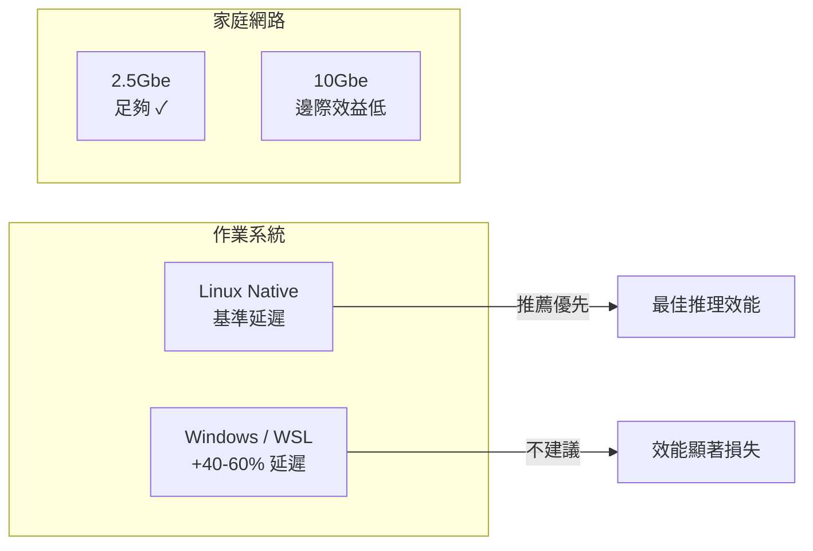
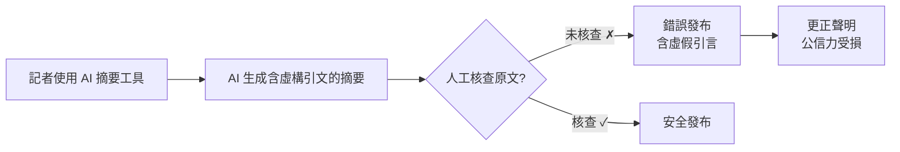

# AI Daily Digest — 2026-05-11

<!-- pipeline-generated:begin -->

## 🔥 今日 TOP 3
### 1. 分散推理實測：Linux 遠勝 WSL，家用 2.5G 網路已足夠
社群用戶對 Llama.cpp RPC 分散推理進行跨平台全面實測，環境涵蓋 RTX 5070/3080/5060Ti（共 158GB VRAM）、Linux Mint 與 Windows 11/WSL，以及 1Gbe 和 2.5Gbe 兩種家用網路，首次提供多變數對照的具體性能基準數據。

OS 選擇是最大效能槓桿：Linux native 延遲比 Windows/WSL 低 40-60%，遠超從 1G 升級至 2.5G 帶來的 20-30% 網路提升。實測帶寬瓶頸僅 3-22 MBps，家用 2.5Gbe 已完全足夠，投資 10Gbe 屬過度配置——這對預算分配有直接指導意義，省下網路設備費用反而應優先確保 Linux 環境。

若正評估多 GPU 分散推理，行動優先順序建議：① 確認 host machine 能跑 Linux native（雙開機優於 WSL）；② 以小 context 試跑 --rpc 模式驗證可行性；③ 最後才評估網路升級。小 context 情境下 RPC 效益最高，適合低成本先驗證後再決定硬體擴展。

📖 [閱讀完整 insight](../10-insights/2026-05-10/inbox_d5f05951.md) · 🔗 [原文連結](https://www.reddit.com/r/LocalLLaMA/comments/1t9lbcm/ran_some_llamacpp_rpc_test_to_see_if_its_worth_it/)
### 2. 《紐時》AI 幻覺事故：摘要工具虛構政治引言遭公開更正
《紐約時報》發布更正聲明，承認記者在加拿大政治報導中，將 AI 摘要工具生成的虛假內容誤當作保守黨領袖 Poilievre 的實際言論發布，其中包括原文從未出現的「叛徒」等措辭；事後由編輯部發現錯誤，以直接引文更正原報導。

AI 摘要工具的輸出形式與真實引文幾乎無法從外觀區分，但本質上是模型詮釋重組，而非原文複現，幻覺率難以即時偵測。與傳統事實性錯誤相比，這類錯誤源自工具本身的結構性缺陷，且在社群媒體上的傳播速度遠超後續更正聲明，對政治報導公信力的損害尤為深遠。

所有使用 AI 輔助研究的內容工作者，應在工具輸出與發布之間設置強制核查節點：引言、數字、政策立場需能回溯原始來源，無法回溯的引文一律標記待核查，不可直接採用。

📖 [閱讀完整 insight](../10-insights/2026-05-10/inbox_3e5b72c0.md) · 🔗 [原文連結](https://simonwillison.net/2026/May/10/new-york-times-editors-note/#atom-everything)
### 3. Claude Agent SDK：告別靜態 Prompt，邁向 agentic 應用架構
Anthropic 推出 Claude Agent SDK，為開發者提供構建具備推理、規劃、工具調用能力之 agentic 應用的完整框架，並附端到端開發指南，官方定位為靜態 prompt-response 架構的下一代替代方案。

此 SDK 的出現降低了 agentic 系統的入門門檻：現代 AI 應用不再只是單次 API 呼叫，而需設計 agent 的狀態管理、多步驟規劃與工具整合。Anthropic 官方背書提供更穩定的 API 契約，也有助於減少各家自製 orchestration 框架的碎片化問題，對 agent 生態系統標準化具正面意義。

開發者可以此為契機評估現有 prompt chain 的升級時機：若任務的下一步依賴前一步的動態結果，且分支情境超過 3 種以上，則 Agent SDK 值得優先探索——建議先選單一現有流程小規模試跑，評估複雜度後再決定全面遷移策略。

📖 [閱讀完整 insight](../10-insights/2026-05-11/inbox_cbc5bfab.md) · 🔗 [原文連結](https://new2026.medium.com/building-agentic-applications-with-the-claude-agent-sdk-a-complete-guide-760728102a1f?source=rss------claude-5)

## 📖 好文章 / 影片精選

_過去 30 天經 traffic 沉澱的高品質內容，按興趣領域分類。每篇只在 column 出現一次。_
### 🛠 Claude Code / Codex 新功能
- **[v2.1.108](../10-insights/2026-04-14/inbox_9af0a8a9.md)**
  Claude Code v2.1.108 是功能豐富的大版本更新。引入環境變數 ENABLE_PROMPT_CACHING_1H 和 FORCE_PROMPT_CACHING_5M 讓使用者調整提示快取 TTL（支援 API key、Bedrock、Vertex、Foundry）；新增 recap 功能在回到會話時自動提供上下文摘要；模型可透過 Skill 
- **[Inside Claude Code Auto Mode: Anthropic’s Autonomous Coding System with Human Approval Gates](../10-insights/2026-05-05/inbox_a79afcba.md)**
  Anthropic 在 Claude Code 中推出自動模式（Auto Mode），實現多步驟軟體開發工作流自動化且減少人工干預。該功能整合多層安全機制：輸入過濾、動作評估和兩階段分類，同時在敏感操作前保留人工審批關卡。此設計平衡了自動化效率與可控性，是 AI 輔助開發走向完整工作流自動化的里程碑。
- **[I asked Claude to investigate its own token burn. The receipts go back six months.](../10-insights/2026-05-05/inbox_d6704275.md)**
  Reddit 用戶利用 Claude Opus 4.7 自動調查其自身 token 計費異常，發現過去 6 個月的系統級 bug 和設計缺陷。核心發現：單一 8-turn 會話被計費 127K tokens 但實際內容僅 25K（成本溢出 5 倍），根源為二進制中「billing-word substitution bug」導致普通術語觸發 10-20 倍未
### 📚 AI 知識管理
- **[Proxy-Pointer RAG: Structure Meets Scale at 100% Accuracy with Smarter Retrieval](../10-insights/2026-04-19/inbox_2cdef584.md)**
  開源 Proxy-Pointer RAG 架構，聲稱達成 100% 檢索準確度。方案結合結構化指標與向量檢索，支援 5 分鐘快速設置，提供比傳統向量 RAG 更智能的檢索邏輯，開箱即用。
- **[Your RAG System Retrieves the Right Data — But Still Produces Wrong Answers. Here’s Why (and How to Fix It).](../10-insights/2026-04-18/inbox_0cc17d08.md)**
  RAG 系統存在隱藏失效模式：雖然檢索到正確文檔，但當同一檢索窗口出現相互矛盾的內容時，模型會任意選其一，導致流利但錯誤的回答。作者用 220 MB 本地實驗驗證此現象，並指出三個常見生產場景，提出簡單的檢測層（無需額外模型、GPU 或 API key）來識別並修復衝突內容問題，從根本上改善 RAG 系統的可靠性。
- **[Your Chunks Failed Your RAG in Production](../10-insights/2026-04-16/inbox_6e7226cc.md)**
  RAG 系統失敗根源分析：分塊策略的架構決策優先級。核心警示是 upstream 的分塊決策無法由模型優化或微調修復。一旦分塊策略在設計階段出錯，後續的模型選擇再優秀也無法補救。強調架構決策（chunking strategy）的優先級高於模型能力。對構建 RAG 生產系統的工程師是重要的系統設計原則。
- **[memweave: Zero-Infra AI Agent Memory with Markdown and SQLite — No Vector Database Required](../10-insights/2026-04-16/inbox_29f5f388.md)**
  memweave 是一個 AI agent 記憶體解決方案，採用 Markdown 和 SQLite 作為技術基礎，標榜零基礎設施特點。核心優勢是無需依賴向量數據庫，相比傳統方案大幅簡化了部署的複雜度。這種設計讓開發者可以用最少的額外基礎設施為 AI agent 加入記憶體管理能力。
- **[The Grand Finale: Chat with Your Data Using a Full RAG System in Spring Boot](../10-insights/2026-04-21/inbox_2fc52b52.md)**
  Spring Boot AI 系列最終章，示範完整 RAG（檢索增強生成）系統實裝。前文涵蓋基礎聊天應用與向量儲存，此篇整合端到端流程：向量化 → 檢索 → LLM 生成。主要技術棧包括 Spring AI 框架、向量資料庫、LLM API 整合，適合快速掌握企業級對話系統原型的 Java/Spring 開發者。實戰教程風格，省略理論細節，直指關鍵集成點。
### 🏢 企業導入 AI / 團隊實踐
- **[Microsoft&#39;s Russinovich and Hanselman Warn AI Is Hollowing Out the Junior Developer Pipeline](../10-insights/2026-04-27/inbox_7b174aba.md)**
  微軟高管 Mark Russinovich 與 Scott Hanselman 在 ACM 通訊雜誌（CACM）發表論文警示，Agent 型 AI 正在拉大初階與資深開發者的技能差距。論文指出 AI 工具對資深工程師幫助最大，反而成為初級開發者學習的「拖累」（AI drag），削弱其成長曲線。統計數據顯示，自 2022 年以來初階開發者招聘量下跌 67%，反
- **[Article: MCP in the Java World: Bringing Architectural Strategy to LLM Integrations](../10-insights/2026-04-27/inbox_5b18a676.md)**
  InfoQ 文章介紹 MCP (Model Context Protocol) Java SDK 如何為企業 LLM 整合建立新的架構紀律。透過定義明確的協議與將 MCP servers 作為 anti-corruption layers，確保治理、鬆散耦合與安全對齊 JVM 生態系統和既有運維做法，將整合從脆弱推進到韌性。核心論點：MCP 不只是技術工具，
- **[The Black Box Is Starting to Open: What Anthropic’s Interpretability Research Means for Enterprise...](../10-insights/2026-05-08/inbox_0b0cc1b1.md)**
  Anthropic 可解釋性研究團隊發現大語言模型內部機制的關鍵規律。目前人類僅能解釋模型行為的 10-20%，在企業部署的定價、庫存決策系統中構成治理風險。研究揭示：（1）同一神經迴路在不同上下文執行相同計算（電路收斂）；（2）多語言模型共享核心概念表示，如「大」在英文、法文、日文中用同樣神經編碼；（3）模型邊界情況會進入「學習模式」，看似合理但實際錯誤。
- **[EU AI Act Article 50: Why Your API Won&#39;t Save You [4-Layer Python Fix]](../10-insights/2026-05-04/inbox_c83eef5e.md)**
  本文揭示歐洲企業在實現 EU AI Act（歐盟 AI 法案）第 50 條合規時的一個關鍵漏洞：簡單調用生成式 API 並不能保證法規合規。核心問題在於許多企業在獲得 API 輸出後進行後處理（post-processing）操作，這會破壞內容出處鏈（C2PA），導致無法追溯生成過程，違反第 50 條的審計要求。文章提供一個四層 Python 架構作為解決方
- **[How LinkedIn Feed Uses LLMs to Serve 1.3 Billion Users](../10-insights/2026-04-13/inbox_fa3e9a9e.md)**
  LinkedIn 工程團隊分享其如何利用大語言模型（LLMs）重構服務 13 億用戶的信息流系統。文章深入探討在超大規模應用中部署 LLMs 所面臨的多維工程挑戰：延遲控制在毫秒級、成本優化、排序準確度、召回率平衡。通過多層快取、模型蒸餾、批處理、特徵工程等技術方案，LinkedIn 展示了如何在嚴苛的 SLA 約束下充分發揮 LLM 的推薦能力。
### 🎓 AI 使用技巧 / 心法
- **[Harness Engineering: How to Build Software When Humans Steer, Agents Execute — Ryan Lopopolo, OpenAI](../10-insights/2026-04-17/inbox_62255643.md)**
  Ryan Lopopolo (OpenAI) 提出「Harness Engineering」：人類掌舵、代理執行的軟體建構新範式。核心理念為代碼已成免費資源，稀缺的是人類時間和注意力；模型能力已等同人類工程師，故角色轉向系統思考與委派。五層架構由下至上為代碼庫（750 PNPM 包強制一致性）、CI/CD Pipeline（每次提交由代理審查）、文件與標準（
### 💳 支付 / Fintech
- **[One in a million: celebrating the customers shaping AI’s future](../10-insights/2025-12-22/inbox_14423a73.md)**
  全球超過 100 萬客戶現已使用 OpenAI 服務，驅動團隊效能與商業創新。PayPal、Virgin Atlantic、BBVA、Cisco、Moderna、Canva 等企業代表已透過 OpenAI AI 平台轉變工作流程，展示了從金融、航空、醫療到設計等多個產業的實際應用案例。
- **[BBVA and OpenAI collaborate to transform global banking](../10-insights/2025-12-12/inbox_60f3a39f.md)**
  BBVA與OpenAI宣布多年AI轉型合作計畫，向全球120,000名員工全面推出ChatGPT Enterprise。雙方將共同開發AI解決方案，以增強客戶互動、簡化營運流程、構建AI原生銀行體驗。此合作展示企業級AI轉型在全球金融機構中的實踐規模與深度整合。該協議涵蓋客戶體驗、營運效率、金融科技基礎設施多個領域。傳統金融機構通過與OpenAI深度協作，標
- **[Presentation: Event-Driven Patterns for Cloud-Native Banking - What Works, What Hurts?](../10-insights/2026-04-20/inbox_722d2046.md)**
  Chris Tacey-Green 分享金融級事件驅動架構的實踐經驗，特別強調在高度監管環境中從同步命令向非同步事件的轉變。演講詳解 Inbox 和 Outbox 模式如何防止數據丟失、事件版本管理的細節、跨域解耦的原則，以及容錯和最終一致性的「battle-tested」實踐。此內容適用於支付系統、銀行業務等對可靠性和合規性要求極高的場景。
- **[Java News Roundup: OpenJDK JEPs, Jakarta EE 12, Spring Framework, Micrometer, Camel, JBang](../10-insights/2026-04-20/inbox_bd45b534.md)**
  本週Java生態發布了多項更新，包括OpenJDK新增JEPs提案、Jakarta EE 12進展、Spring Framework安全補丁（修復CVE漏洞）、Micrometer Metrics首個候選版本，以及Apache Grails、Apache Camel和JBang的點版本發布。同時，Eclipse Store和Eclipse Serialize
- **[I Pay $200 a Month for an AI That Lost an Argument to Its Own While Loop](../10-insights/2026-04-21/inbox_7ca224ae.md)**
  使用者每月支付 $200 訂閱 Claude Opus 4.7，但在使用過程中發現模型在邏輯推理上出現矛盾，具體例子是處理 while loop 等程式結構時出現問題。文章從三個角度探討 Claude Opus 4.7 是否性能下降的疑問，並以實際遭遇為證。這反映了用戶對高端訂閱服務品質穩定性的疑慮，以及模型在複雜邏輯推理任務上可能存在的局限。
### ⛓️ 區塊鏈 / Web3
- **[Lowering the Activation Energy of AI in Research](../10-insights/2026-04-21/inbox_dbc86a9d.md)**
  文章探討在學術研究中降低 AI 採用門檻的策略。作者指出最有效的採用不是自上而下的強制推行，而是通過**好奇心、低摩擦實驗和同行協作**自下而上驅動。「降低激活能」指減少開始使用 AI 所需的技術成本、學習曲線和心理障礙——包括提供易用工具、快速反饋迴圈、信任的同行示範，以及去中心化的知識分享網絡。
- **[The Bot Pod Episode 1: Trading Agents in Condor](../10-insights/2026-04-03/inbox_e709ec20.md)**
  Hummingbot 推出新開源框架 Condor，專門用於構建自主交易代理。該框架簡化了交易機器人的開發流程，允許開發者快速部署和測試自動化交易策略。Condor 作為統一的開源工具基礎設施，為加密貨幣交易社群降低了進入交易代理開發的門檻。該框架有望促進自主交易機器人應用的普及。
- **[只有這 16 個代幣被發免死金牌，有你的嗎？](../10-insights/2026-03-29/inbox_20d668c4.md)**
  SEC 與 CFTC 首次聯合發布監管定義，確認 16 個加密貨幣代幣在美國法律下「不屬於證券」，為加密產業建立清晰的規則框架。同時 Stripe 宣布進入 AI Agent 支付領域，拓展自主代理在支付生態中的應用。Ethereum Foundation 推出新政策引發社群分裂，Balancer Labs 則宣布倒閉，市場面臨波動。儘管短期震蕩，加密貨幣產
- **[Instagram Removing End-to-End Encryption: a Precision Harvest](../10-insights/2026-04-02/inbox_da2fc10b.md)**
  Meta 為供應 AI 訓練資料，決定移除 Instagram DM 的端到端加密(E2EE)保護，使其 AI 系統能訪問用戶對話内容。此舉被分析人士稱為『精準收割』(precision harvest)：Meta 利用用戶優先選擇便利性而非隱私的心理，單方面改寫隱私政策。調查數據顯示多數使用者反應淡漠，更重視應用功能便捷性。這個事件揭示重要趨勢：AI 訓練
- **[Tokenization to Neuralization](../10-insights/2026-04-22/inbox_3d288785.md)**
  文章討論 Tokenformer 論文的深層意義。Tokenformer 將模型參數也 token 化，支援參數和資料在統一的 attention 機制下互動。作者指出這建立了「token ↔ neural」的雙向轉換通道：若將優化更新規則作為函數 f、參數作為輸入 x，則 f(x) 得到更新後的參數。這意味整個訓練推理流程都可能被「神經化」。核心洞察：未來
### 🔐 AI 安全 / 濫用
- **[Presentation: Deepfakes, Disinformation, and AI Content Are Taking Over the Internet](../10-insights/2026-04-24/inbox_296bae8e.md)**
  Shuman Ghosemajumder 在演講中揭示了生成式 AI 如何從創意工具演變成大規模散布虛假信息與詐欺的武器。他提出「虛假信息自動化」（Disinformation Automation）的概念，指出傳統驗證方式如 CAPTCHA 在 AI 時代已失效。演講強調工程領導者需採取零信任「網路融合」（Cyber Fusion）策略以對抗能精確模擬人類
- **[Bleeding Llama: Critical Unauthenticated Memory Leak in Ollama](../10-insights/2026-05-06/inbox_64394a1a.md)**
  Cyera 研究團隊發現 Ollama 的關鍵漏洞（CVE-2026-7482，CVSS 9.1）：未認證攻擊者可洩露整個 Ollama 進程記憶體，包括使用者提示、系統提示與環境變數。受影響伺服器全球約 30 萬台。Ollama 擁有 170K GitHub stars、1 億以上 Docker 下載，是本地開源模型運行標準平臺，此漏洞威脅範圍廣。
- **[Our evaluation of OpenAI&#39;s GPT-5.5 cyber capabilities](../10-insights/2026-04-30/inbox_226d5ca1.md)**
  英國 AI 安全研究所發布對 OpenAI GPT-5.5 網路安全能力的評估報告，對標先前評估的 Claude Mythos。測試結果顯示 GPT-5.5 在尋找安全漏洞方面與 Mythos 能力相當，但 GPT-5.5 目前已公開可用，Mythos 仍在預覽階段。這項評估為企業選擇部署模型提供了量化的安全基準對比。
### 🛤️ AI Flow 導入心得 / 技術分享
- **[Presentation: Engineering at AI Speed: Lessons from the First Agentically Accelerated Software Project](../10-insights/2026-05-07/inbox_f43eac03.md)**
  Adam Wolff 在 InfoQ 演講中分享 Claude Code 開發經驗，指出當 AI 降低編碼成本後，軟體開發的瓶頸已從程式實現轉向架構決策。透過三個「戰爭故事」說明 dogfooding 和快速迭代對 AI 加速開發的重要性。當編碼成本趨近於零時，開發團隊的競爭優勢不再來自寫碼速度，而是學習和決策的速度。這標誌著軟體開發文化的根本轉變：從實現導
- **[How Anthropic’s product team moves faster than anyone else | Cat Wu (Head of Product, Claude Code)](../10-insights/2026-04-23/inbox_45a1bfc4.md)**
  Anthropic 產品團隊負責人 Cat Wu 揭示公司如何實現超高速迭代（發布週期從月→週→日）的祕訣。Anthropic 在 PM 聘僱時重視「產品品味」而非傳統背景；PRD 和路線圖已演化為輕量化協調工具。團隊採用「為不完全工作的產品開發」策略——刻意用當前 Claude 模型的不足設計產品，為下一版本模型閉合能力缺口預留空間。Cat 強調 Clau
- **[Agentic AI the Hard Way — Part 3 Architecture and Design](../10-insights/2026-04-27/inbox_e0e4ea2a.md)**
  本文（系列第三篇）深入 agentic AI 系統架構，核心解決三大問題：工具發現、記憶機制、context 管理。技能系統使用 Docker 容器化封裝，各容器暴露 `GET /schema` 和 `POST /execute` 兩端點。四層記憶模型依序組裝上下文：AGENT.md、技能系統提示、preferences.md、ChromaDB 相似度、最近
- **[Code Review is the New Bottleneck For Engineering Teams](../10-insights/2026-04-13/inbox_0f6c65c6.md)**
  程式碼審查已成為工程速度的主要瓶頸，因AI加速了程式碼生成但人工審查能力未跟上。LinearB分析810萬個PR發現：代理AI PRs的審查拾取時間長5.3倍，AI輔助PRs長2.47倍；工程師普遍抗拒審查AI生成程式碼並傾向延緩。原因是審查需要大量認知負荷（理解context、驗證正確性）與建構的多巴胺滿足形成對比。建議包括：(1)撰寫詳盡測試案例增進審查

## 💡 今日 Takeaway

_讀完今日所有內容後，可帶走的知識點_
### 1. AI 摘要 ≠ 原文引言：發布前必設人工核查閘
AI 摘要工具在重組資訊時可能生成原文不存在的內容，外觀卻與真實引文幾乎無法區分——這是幻覺風險最容易被忽視的形式，尤其在涉及政治、法律或高敏感度事實陳述時，未核查直接發布可能造成機構公信力的不可逆損失。實務對策：為「引言」、「統計數字」、「政策立場」建立強制核查 gate，每條引文必須能回溯至原始來源方可採用，無法回溯者一律標記待查。

_類型：pattern_

**參考來源**：
- [Quoting New York Times Editors’ Note](../10-insights/2026-05-10/inbox_3e5b72c0.md) · [原文](https://simonwillison.net/2026/May/10/new-york-times-editors-note/#atom-everything)
### 2. 分散推理的 OS 選擇比網路升級報酬率更高
實測數據顯示，相同硬體條件下 Linux native 環境的 RPC 推理延遲比 Windows/WSL 低 40-60%，遠超從 1G 升至 2.5G 帶來的 20-30% 網路提升——這意味著 OS 環境是多 GPU 分散推理最值得優先調整的單一變數，而非直覺上的硬體或網路。規劃分散推理預算時，應先確認 OS 策略（雙開機而非 WSL），省下的設備費用可轉為更有效益的配置，而非直接跳向 10Gbe 投資。

_類型：data-point_

**參考來源**：
- [Ran some Llama.cpp RPC test to see if its worth it. And if 10Gbe needed.](../10-insights/2026-05-10/inbox_d5f05951.md) · [原文](https://www.reddit.com/r/LocalLLaMA/comments/1t9lbcm/ran_some_llamacpp_rpc_test_to_see_if_its_worth_it/)
### 3. AI Agent 前置影響評估護欄：20 行代碼填補反思盲點
AI coding agents 傾向直接執行而跳過「這個改動可能破壞什麼」的評估步驟，這是有經驗開發者的內化習慣，但 agent 原生缺乏此機制。在執行前插入輕量影響分析護欄（impact analysis guardrail）能強制觸發反思步驟，且實作複雜度極低（案例中僅需 20 行代碼）。這個模式可推廣至任何高風險自動化操作：在 action 節點前加入「潛在影響評估」步驟，以極少代碼換取顯著的風險降低。

_類型：technique_

**參考來源**：
- [I Built an Impact Analysis Guardrail for Cursor. The Best Version Was 20 Lines.](../10-insights/2026-05-11/inbox_4418b0eb.md) · [原文](https://medium.com/@2026jwutubechnl/i-built-an-impact-analysis-guardrail-for-cursor-the-best-version-was-20-lines-7e9675ba5077?source=rss------claude-5)
### 4. LoRA/QLoRA：消費級硬體也能 fine-tune 70B 模型
LoRA 透過在原始權重旁插入低秩矩陣，將可訓練參數量從全量降至 0.1-1%，顯著降低 VRAM 需求；QLoRA 進一步將基礎模型量化至 4-bit，使 70B 級別模型可在消費級 GPU 上完成微調，成本降低幅度達數十倍。這讓「針對特定領域調整模型行為」從雲端大規模訓練基礎設施的特權，變為小團隊可負擔的選項。實務建議：有限預算下優先評估 QLoRA + Hugging Face PEFT 組合，而非尋求全參數微調基礎設施。

_類型：technique_

**參考來源**：
- [Mengenal LoRA, QLoRA, dan PEFT dalam Fine-Tuning LLM](../10-insights/2026-05-11/inbox_e3d5bc86.md) · [原文](https://medium.com/@ditafebyindriani14/mengenal-lora-qlora-dan-peft-dalam-fine-tuning-llm-dddea3ffe250?source=rss------large_language_models-5)
### 5. Agentic 架構核心：模型自主持有推理狀態，動態決定下一步
傳統 prompt chain 的根本限制在於分支邏輯由開發者預先硬編碼，無法根據執行時中間結果動態調整策略，複雜任務需要外部大量維護。Agent 架構讓模型本身持有推理狀態，能根據工具回傳結果自主決定下一步，顯著提升複雜任務的靈活度與容錯能力。判斷是否升級的快速標準：若任務的下一步依賴前一步的動態結果、且情境分支超過 3 種以上，則 agent 架構優於靜態 prompt chain。

_類型：technique_

**參考來源**：
- [Building Agentic Applications with the Claude Agent SDK: A Complete Guide](../10-insights/2026-05-11/inbox_cbc5bfab.md) · [原文](https://new2026.medium.com/building-agentic-applications-with-the-claude-agent-sdk-a-complete-guide-760728102a1f?source=rss------claude-5)
## ⏳ 待處理 (2 筆)

<!-- pipeline-generated:end -->

<!-- user-notes -->
<!-- Write your own notes below; pipeline never touches this section. -->